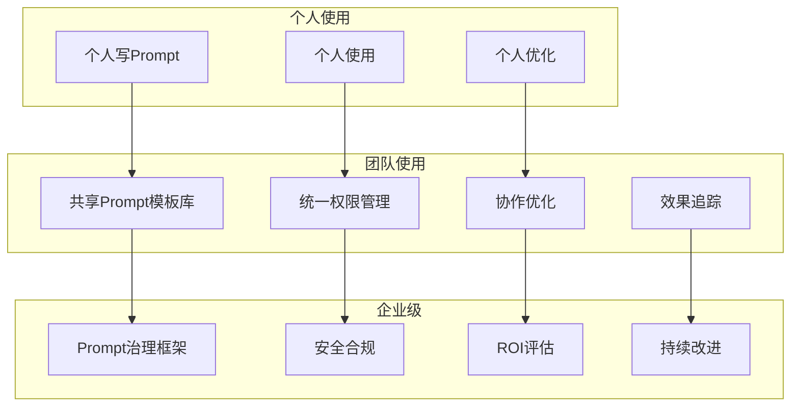
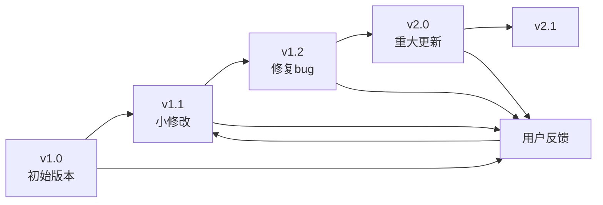

# 企业级Prompt管理：从个人到团队的规模化

## Prompt管理的"最后一公里"

> [!key] 核心洞察
> 个人使用Prompt和团队使用Prompt完全是两回事。当组织里有几十上百人都在使用AI时，**Prompt管理就变成了一个工程问题——包括模板库、版本控制、权限管理、安全合规和效果评估**。企业级Prompt管理是AI从"个人效率工具"升级为"组织生产力平台"的关键基础设施。



---

## Prompt模板库管理

### 模板分类体系

| 类别 | 子类 | 示例 | 访问权限 |
|------|------|------|---------|
| 通用 | 写作、分析、总结 | "会议纪要生成" | 全员 |
| 部门 | 市场、技术、HR | "代码审查Prompt" | 部门内 |
| 项目 | 特定项目使用 | "Q4销售分析" | 项目组 |
| 个人 | 个人定制 | "个人助理" | 个人 |

### 模板元数据

每个Prompt模板需要包含以下元数据：

```
---
name: "会议纪要生成器"
version: "2.3.0"
author: "张三"
created: "2026-01-15"
updated: "2026-06-20"
category: "通用/会议"
tags: ["会议", "纪要", "行动项"]
permissions: ["全员可读", "部门可编辑"]
parameters:
  - name: "会议类型"
    type: "enum"
    values: ["周会", "项目会", "1on1"]
  - name: "输出语言"
    type: "enum"
    values: ["中文", "英文"]
evaluation:
  accuracy: 92%
  usage_count: 1450
  satisfaction: 4.3/5
---
```

---

## 版本管理与变更控制

### 版本策略



### 变更流程

1. **提案**：提交Prompt修改建议
2. **评审**：至少2人审核修改
3. **测试**：在测试集上运行（参考[[01-AI技术/Prompt Engineering深度/06_Prompt测试与迭代：从「能用」到「好用」]]）
4. **审批**：负责人批准
5. **发布**：更新到生产环境
6. **监控**：跟踪效果指标

---

## 权限与安全管理

### 权限模型

| 角色 | 权限 | 职责 |
|------|------|------|
| 管理员 | 完全控制 | 系统配置、审计 |
| 编辑者 | 创建/编辑模板 | Prompt维护 |
| 评审者 | 审核修改 | 质量控制 |
| 使用者 | 使用模板 | 日常使用 |
| 审核者 | 查看日志 | 安全审计 |

### 安全考量

> [!warning] 企业Prompt安全要点
> 1. **数据泄露**：Prompt中可能包含敏感数据 → 需要数据脱敏
> 2. **Prompt注入**：恶意用户可能通过输入注入攻击 → 需要输入过滤
> 3. **权限泄露**：高权限Prompt被低权限用户使用 → 需要权限控制
> 4. **合规要求**：某些行业对AI使用有合规要求 → 需要审计日志

---

## 企业级Prompt治理框架

### 治理结构

```
Prompt治理委员会
├── 负责人：AI办公室主任
├── 成员：各部门代表
├── 职责：
│   ├── 制定Prompt使用规范
│   ├── 审批关键Prompt模板
│   ├── 评估AI使用效果
│   └── 处理安全事件
```

### 使用规范

```
1. 所有面向客户的Prompt必须经过审批
2. 包含客户数据的Prompt必须经过脱敏处理
3. 每季度进行Prompt效果评估
4. 重大Prompt变更需记录变更日志
5. 禁止在Prompt中传输密码、密钥等敏感信息
```

---

## 效果评估与ROI

### 企业级Prompt评估指标

| 指标 | 计算方法 | 目标值 |
|------|---------|-------|
| 使用率 | 活跃用户/总员工 | >60% |
| 满意度 | 用户评分 | >4.0/5 |
| 效率提升 | 使用前后的任务完成时间 | >30% |
| 错误率 | 需要人工修正的比例 | <10% |
| 模板覆盖率 | 标准化模板使用比例 | >70% |

---

## 规模化实施路线图

参考[[03-HR人事/AI时代领导力与管理/08_组织变革领导力：引领AI转型的路线图]]中的变革管理框架：

| 阶段 | 时间 | 关键行动 | 里程碑 |
|------|------|---------|--------|
| 启动 | 1-2个月 | 建立Prompt模板库 | 50个核心模板 |
| 推广 | 3-4个月 | 培训+推广 | 200用户 |
| 优化 | 5-6个月 | 建立评估体系 | 效果指标 |
| 成熟 | 7-12个月 | 全面治理 | 制度化 |

---

> [!tip] 企业级Prompt管理的关键成功因素
> 1. **从简单开始**：先做10个核心模板，再扩展到100个
> 2. **用户参与**：让一线员工参与模板设计
> 3. **持续培训**：定期组织Prompt工程培训
> 4. **快速反馈**：建立用户反馈机制
> 5. **价值展示**：定期展示AI使用成果

---

## 跨知识库联动

- [[01-AI技术/Prompt Engineering深度/06_Prompt测试与迭代：从「能用」到「好用」]] 提供了测试方法，是企业级管理的基础
- [[03-HR人事/AI时代领导力与管理/08_组织变革领导力：引领AI转型的路线图]] 中的组织变革框架适用于Prompt规模化推广
- [[05-产品与开发/独立开发者生存指南/08_财务与合规：从银行开户到税务申报]] 中的合规管理理念适用于Prompt安全治理

---

*最后更新: 2026-07-31*