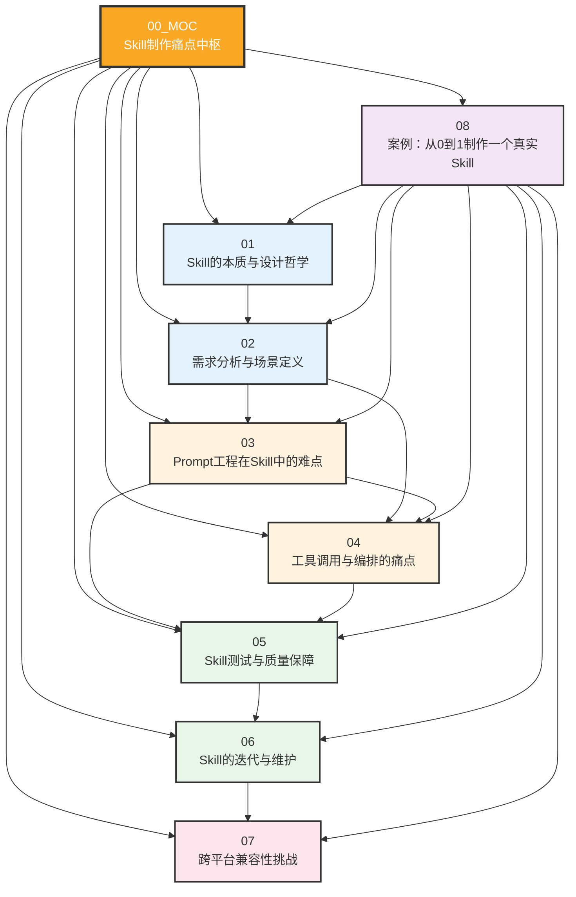
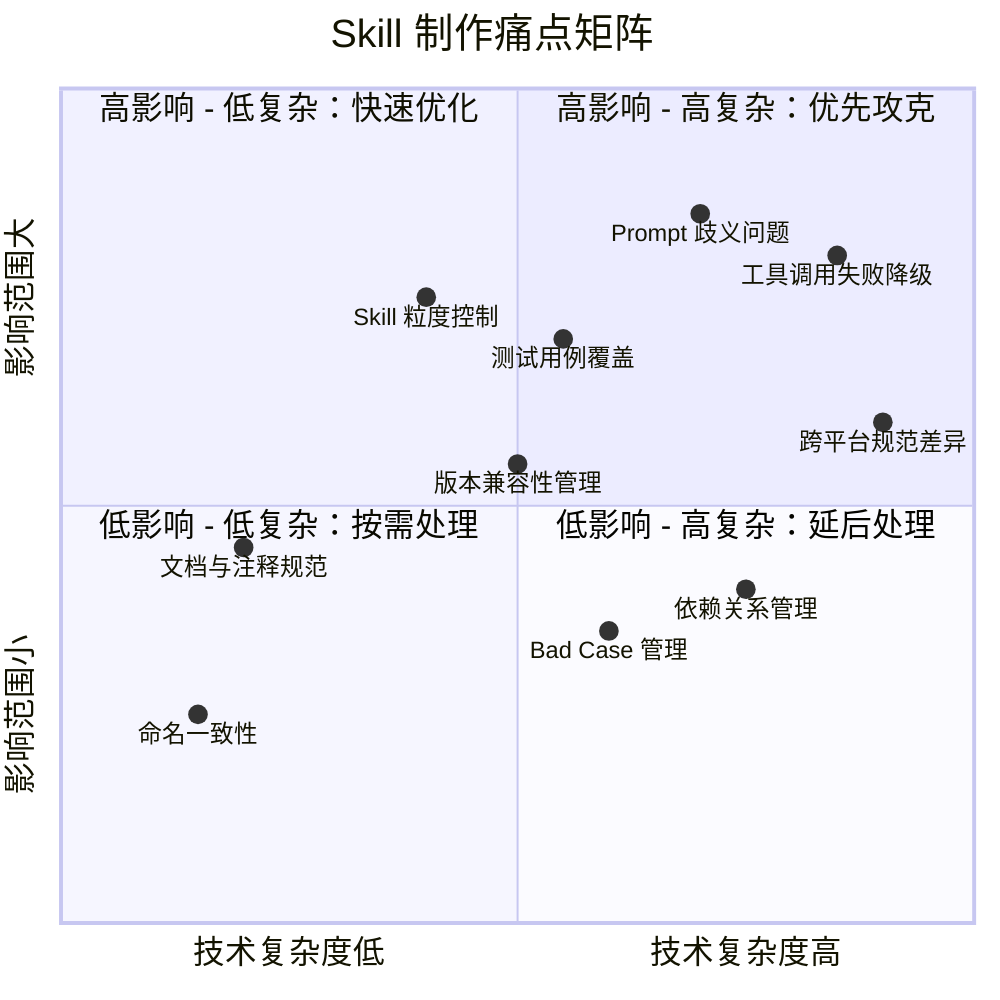
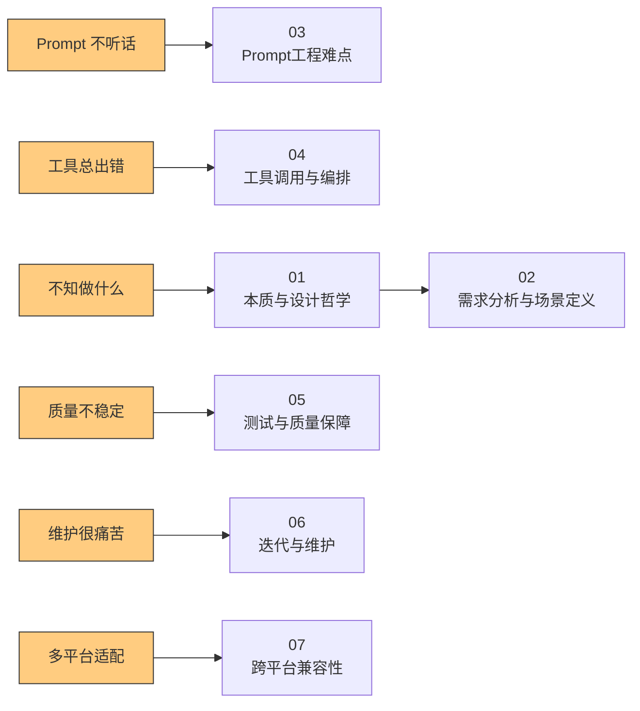
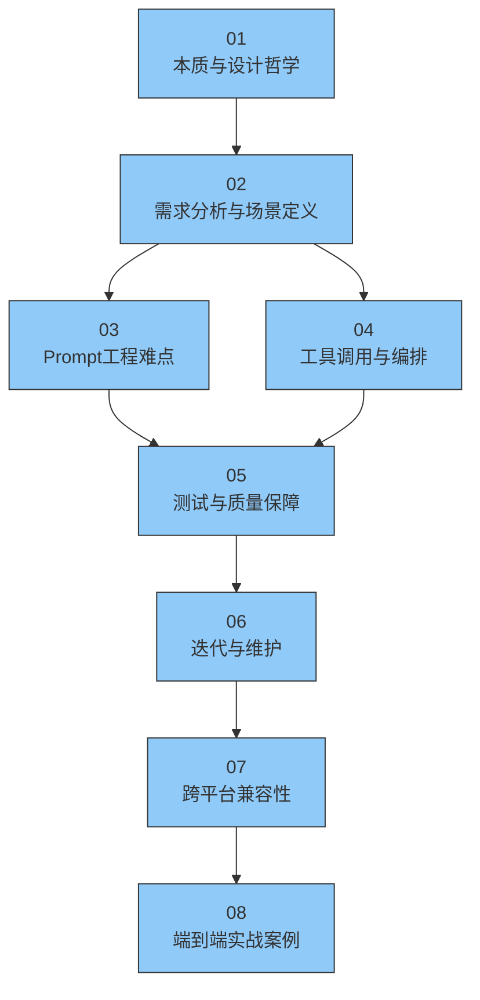
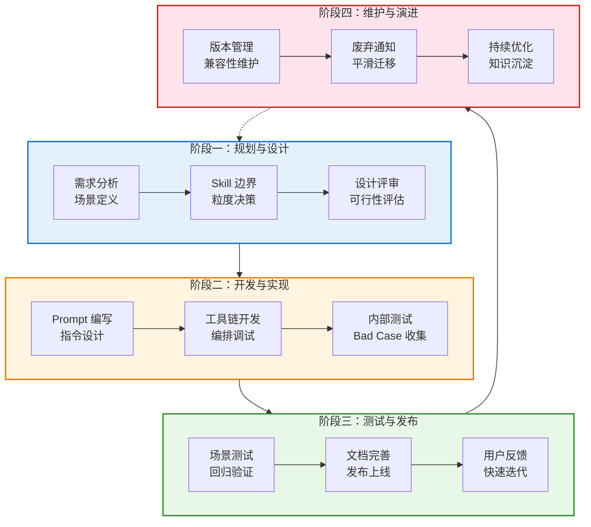

# Skill 制作痛点中枢

> [!note] 知识库定位
> 本知识库面向 **AI 工具开发者**，系统梳理制作 Skill/Plugin 过程中的实战问题与方法论。核心逻辑：不只是"怎么做"，而是"为什么这么做"+"踩过的坑"+"最佳实践"。从"战略+人力+AI"的复合视角切入，帮助开发者从零到一构建高质量 Skill。

> [!important] 深化路线图
> 想知道"Skill 能力下一步往哪走"，先读 [[01-AI技术/Skill制作痛点/00_深化路线图|深化路线图]]——四级台阶：Skill 体系化 → 自进化闭环 → ROI 评估 → Skill+Agent 协同。

---

## 一、知识库导航图

---

## 二、文档索引表

| 编号 | 文档名称 | 核心主题 | 阅读难度 | 关键问题 |
|:---:|:---|:---|:---:|:---|
| 01 | [[01-AI技术/Skill制作痛点/01_Skill的本质与设计哲学]] | Skill 是什么、边界、质量标准 | ★★☆ | 什么该做成 Skill？ |
| 02 | [[01-AI技术/Skill制作痛点/02_需求分析与场景定义]] | 场景驱动、粒度控制、边界判断 | ★★★ | 如何定义 Skill 的范围？ |
| 03 | [[01-AI技术/Skill制作痛点/03_Prompt工程在Skill中的难点]] | 指令歧义、上下文管理、多轮对话 | ★★★★ | 为什么 Prompt 总是有歧义？ |
| 04 | [[01-AI技术/Skill制作痛点/04_工具调用与编排的痛点]] | 工具链设计、错误处理、降级策略 | ★★★★ | 工具调用失败后怎么办？ |
| 05 | [[01-AI技术/Skill制作痛点/05_Skill测试与质量保障]] | 测试策略、回归测试、bad case 管理 | ★★★ | 如何保证 Skill 质量稳定？ |
| 06 | [[01-AI技术/Skill制作痛点/06_Skill的迭代与维护]] | 版本管理、反馈驱动、依赖管理 | ★★★ | 如何持续演进而不失控？ |
| 07 | [[01-AI技术/Skill制作痛点/07_跨平台兼容性挑战]] | 平台差异、一次编写多处运行 | ★★★★ | 要不要支持多平台？ |
| 08 | [[01-AI技术/Skill制作痛点/08_案例：从0到1制作一个真实Skill]] | 端到端实战、决策点、踩坑记录 | ★★★★ | 真实项目怎么做？ |
| 09 | [[01-AI技术/Skill制作痛点/09_实战_企业级Skill四连发总览]] | 痛点识别、提效切入点、个人工具→团队工具 | ★★★★★ | 企业里怎么找 AI 提效点？ |
| 10 | [[01-AI技术/Skill制作痛点/10_实战_自动拉群及话术Skill]] | 自动化边界、定时任务、批量组织 | ★★★★ | 重复操作怎么自动化？ |
| 11 | [[01-AI技术/Skill制作痛点/11_实战_拆合表自进化Skill]] | 自进化机制、常规直出+特殊记录、棘轮 | ★★★★★ | 怎么让 Skill 越用越聪明？ |
| 12 | [[01-AI技术/Skill制作痛点/12_实战_舆情周报自动化Skill]] | 低技术高价值、格式化、定时发送 | ★★★ | 简单场景值得做吗？ |
| 13 | [[01-AI技术/Skill制作痛点/13_实战_Dify Agent配置自动化Skill]] | AI生成配置、人机分工、团队提效 | ★★★★ | 非技术人员怎么参与 Agent 开发？ |

---

## 三、Skill 制作痛点全景图

---

## 四、推荐阅读路径

### 路径一：新手入门（从零开始）

> [!tip] 新手建议
> 如果你是第一次接触 Skill 开发，建议先读 01 和 02 建立认知框架，然后通过 08 的实战案例建立感性认识，再深入 03 和 04 解决具体技术问题。

### 路径二：问题驱动（按痛点查阅）

### 路径三：架构师视角（体系化建设）

> [!important] 架构师路线
> 如果你正在规划团队的 Skill 开发体系，建议按顺序通读全部文档。重点关注 01 的设计哲学、06 的维护策略、07 的平台兼容性，这些直接影响团队长期效率。

---

## 五、Skill 制作生命周期

---

## 六、关键概念速查

| 概念 | 定义 | 详见 |
|:---|:---|:---|
| **Skill 本质** | Skill 不是简单的 prompt 模板，而是封装了领域知识、工具调用、决策逻辑的智能体单元 | [[01-AI技术/Skill制作痛点/01_Skill的本质与设计哲学]] |
| **场景驱动** | 以用户实际使用场景为起点，反推 Skill 的功能设计和交互逻辑 | [[01-AI技术/Skill制作痛点/02_需求分析与场景定义]] |
| **指令歧义** | Prompt 中自然语言固有的模糊性，导致 AI 行为不可预测 | [[01-AI技术/Skill制作痛点/03_Prompt工程在Skill中的难点]] |
| **工具编排** | 多个工具调用的顺序、条件、错误处理的组合策略 | [[01-AI技术/Skill制作痛点/04_工具调用与编排的痛点]] |
| **回归测试** | 每次修改后重新运行全部测试用例，确保已有功能不受影响 | [[01-AI技术/Skill制作痛点/05_Skill测试与质量保障]] |
| **语义化版本** | 使用 MAJOR.MINOR.PATCH 格式管理 Skill 版本，帮助用户理解变更影响 | [[01-AI技术/Skill制作痛点/06_Skill的迭代与维护]] |
| **平台锁定** | 过度依赖某一平台的特定能力，导致迁移成本极高 | [[01-AI技术/Skill制作痛点/07_跨平台兼容性挑战]] |
| **端到端验证** | 从用户视角出发，完整走通一个场景的所有步骤，而不仅仅是单元测试 | [[01-AI技术/Skill制作痛点/08_案例：从0到1制作一个真实Skill]] |

---

## 七、关联知识库

本知识库与以下知识库体系紧密关联：

- **[[05-产品与开发/Vibe Coder/AI产品开发导航系统]]** — 提供 AI 产品开发的宏观视角和方法论
- **[[05-产品与开发/Vibe Coder/AI产品开发导航系统]]** — 通用 AI 产品开发原则
- **[[05-产品与开发/Vibe Coder/AI生成产品的经验法则]]** — 从实战中总结的经验规律
- **[[05-产品与开发/Vibe Coder/Vibe Coder 常见问题全景图]]** — Vibe Coding 场景下的常见问题索引
- **[[05-产品与开发/Vibe Coder/Vibe Coding 产品经理法则]]** — 产品视角下的 AI 开发方法论
- **[[05-产品与开发/Vibe Coder/02-开发实战/Prompt 工程速查（vibe coding 专用）]]** — Prompt 工程实用技巧速查
- **[[05-产品与开发/Vibe Coder/05-思想与思维/人机协作的边界]]** — 探讨人与 AI 协作的边界与分工

> [!note] 知识库体系关系
> 本知识库是"AI 工具开发"体系的**核心组成部分**，聚焦于 Skill/Plugin 制作这一垂直领域。它与 Vibe Coding 系列、AI Agent 工具系列共同构成了完整的 AI 开发知识体系。

---

## 八、常用 Checklist

### 开发前 Checklist

- [ ] 是否明确了 Skill 的核心价值主张？（参考 [[01-AI技术/Skill制作痛点/01_Skill的本质与设计哲学]]）
- [ ] 是否定义了清晰的用户场景和边界？（参考 [[01-AI技术/Skill制作痛点/02_需求分析与场景定义]]）
- [ ] 是否评估了技术可行性和资源投入？
- [ ] 是否确定了 Skill 的命名和描述规范？

### 开发中 Checklist

- [ ] Prompt 是否经过歧义审查？（参考 [[01-AI技术/Skill制作痛点/03_Prompt工程在Skill中的难点]]）
- [ ] 工具调用是否有完整的错误处理？（参考 [[01-AI技术/Skill制作痛点/04_工具调用与编排的痛点]]）
- [ ] 是否建立了测试用例和 bad case 库？（参考 [[01-AI技术/Skill制作痛点/05_Skill测试与质量保障]]）
- [ ] 是否考虑了多平台兼容性？（参考 [[01-AI技术/Skill制作痛点/07_跨平台兼容性挑战]]）

### 发布前 Checklist

- [ ] 是否通过了完整的回归测试？
- [ ] 是否编写了用户文档和示例？
- [ ] 是否设置了版本号（参考 [[01-AI技术/Skill制作痛点/06_Skill的迭代与维护]]）？
- [ ] 是否明确了后续维护和反馈机制？

### 维护期 Checklist

- [ ] 是否建立了用户反馈收集渠道？
- [ ] 是否定期审查 bad case 并优化？
- [ ] 是否管理了 Skill 间的依赖关系？
- [ ] 是否有废弃 Skill 的迁移方案？

---

## 九、常见问题速查

> [!important] "我的 Skill 应该做多大？"
> 这是一个经典问题。核心原则：**一个 Skill 做好一件事**。如果发现 Skill 的 prompt 超过 500 行，或工具调用超过 10 个，说明需要拆分。详见 [[01-AI技术/Skill制作痛点/02_需求分析与场景定义]]。

> [!important] "为什么我的 Prompt 在实际使用中效果比测试差很多？"
> 这通常是"测试环境与真实环境差异"问题。真实环境中的用户输入更加多样、上下文更加复杂、模型行为可能因为系统负载而波动。详见 [[01-AI技术/Skill制作痛点/03_Prompt工程在Skill中的难点]] 和 [[01-AI技术/Skill制作痛点/05_Skill测试与质量保障]]。

> [!important] "要不要发布到多个平台？"
> 取决于你的资源和目标用户。多平台支持可以扩大受众，但会显著增加维护成本。建议先在一个平台打磨成熟，再考虑扩展。详见 [[01-AI技术/Skill制作痛点/07_跨平台兼容性挑战]]。

---

## 十、版本历史

| 版本 | 日期 | 变更说明 |
|:---|:---|:---|
| v1.0 | 2026-07-27 | 初始版本，建立知识库框架，包含 MOC + 8 篇内容文档 |

---

> [!tip] 使用建议
> 本 MOC 是知识库的入口和导航中枢。建议在阅读具体文档前，先浏览本页面的导航图和索引表，建立全局认知。之后可以根据自身需求选择合适的阅读路径，也可以直接按问题查阅。

---

*本知识库持续更新中，欢迎贡献反馈和案例。*