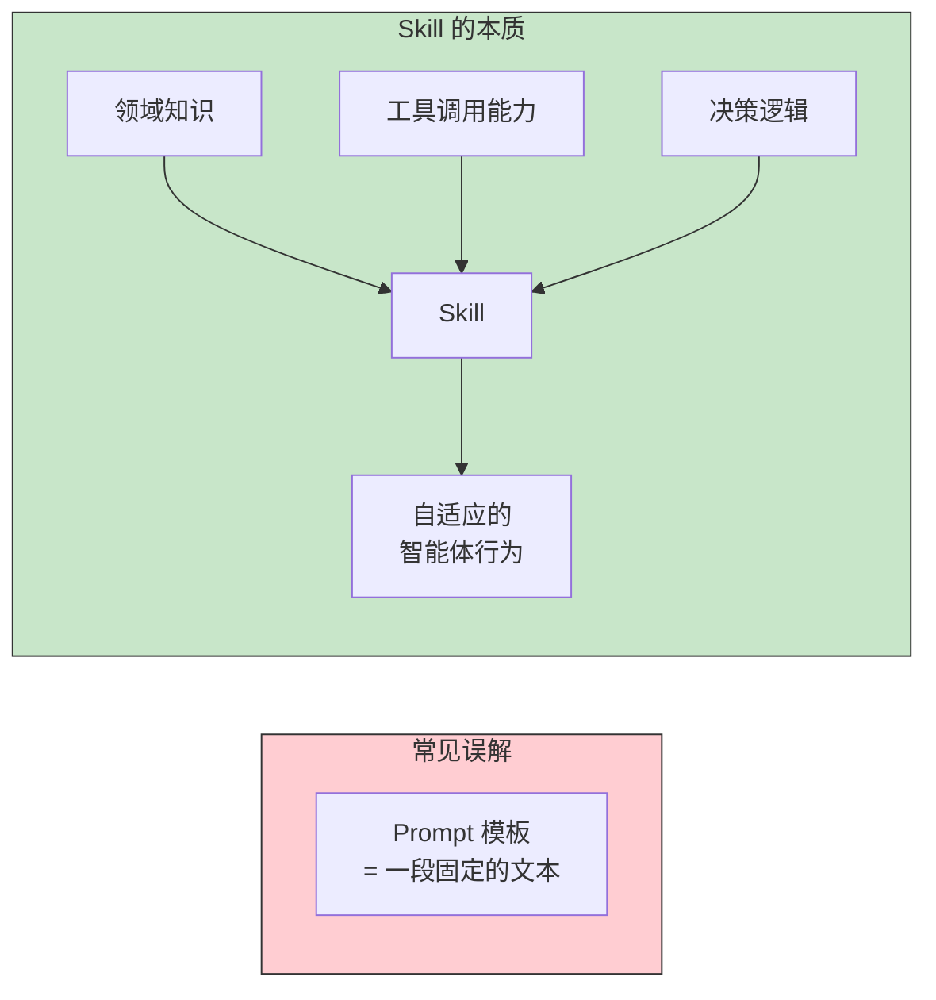
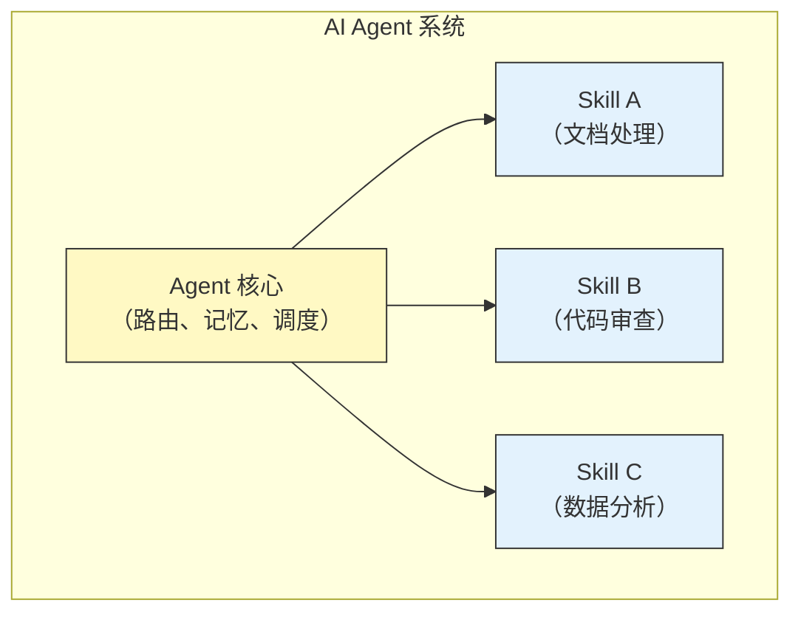
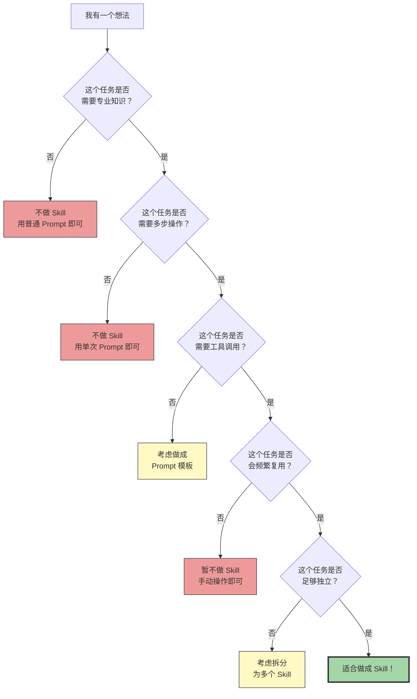
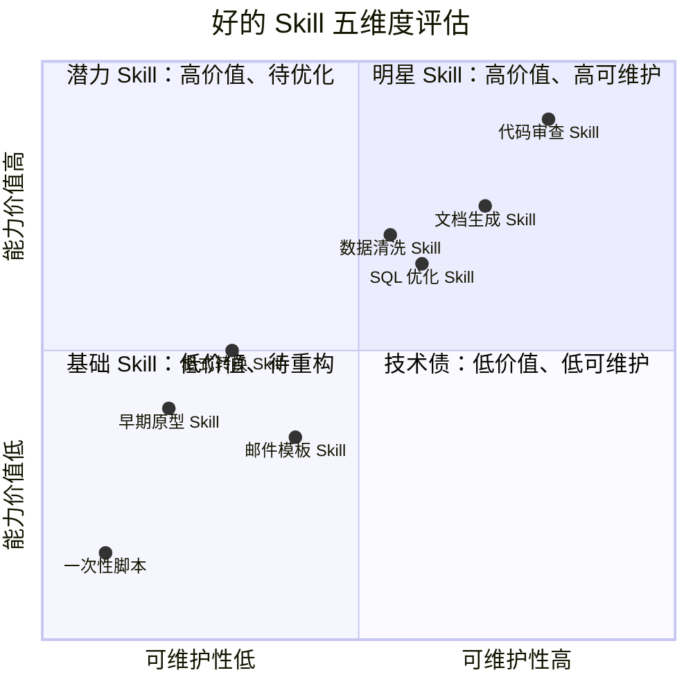
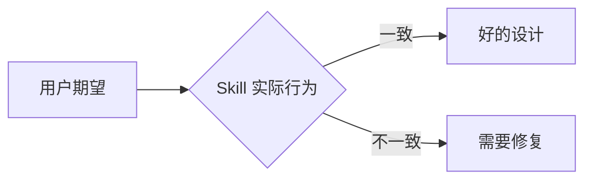
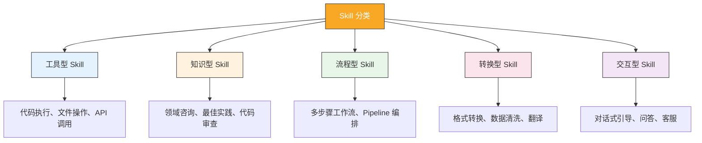
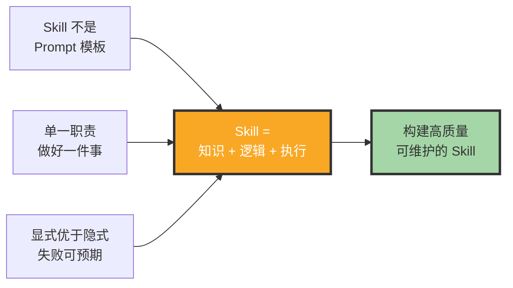

# Skill 的本质与设计哲学

> [!note] 本文定位
> 本文是 Skill 制作知识库的**基石文档**。在动手写第一行代码之前，先理解 Skill 的本质是什么、不是什么、以及什么值得做成 Skill。这些认知将直接影响你后续所有技术决策的质量。

---

## 一、Skill 不是什么

在讨论 Skill 是什么之前，我们首先需要澄清一些常见的误解。

### 1.1 Skill 不是简单的 Prompt 模板



> [!warning] 常见误区
> 很多开发者把 Skill 理解为"写一段好的 System Prompt 就行了"。但实际上，一个真正有价值的 Skill 至少包含三层：**领域知识（know-what）**、**决策逻辑（know-how）**、**工具调用（do-it）**。缺少任何一层，Skill 的能力都会大打折扣。

### 1.2 Skill 不是微调模型

| 维度 | Skill | 微调模型 |
|:---|:---|:---|
| 实现方式 | Prompt + 工具 + 逻辑 | 训练数据 + 参数调整 |
| 开发成本 | 低到中等（小时到天） | 高（天到周） |
| 更新速度 | 即时修改 Prompt | 需要重新训练 |
| 知识来源 | 显式注入（Prompt） | 隐式注入（训练） |
| 可解释性 | 高（Prompt 可读） | 低（黑盒） |
| 适用场景 | 流程化、工具密集型任务 | 风格化、模式化任务 |

> [!tip] 决策建议
> 如果你的任务是"告诉 AI 怎么做"而非"教 AI 变成什么"，Skill 是更合适的选择。微调适合风格和模式层面（如"用某种口吻回复"），而 Skill 适合流程和知识层面（如"按照这个流程处理文档"）。

### 1.3 Skill 不是 Agent 的全部



Skill 是 Agent 的能力模块，但 Agent 还需要**路由机制**（决定何时调用哪个 Skill）、**记忆系统**（跨 Skill 的状态管理）、**调度策略**（多 Skill 协同）。这就像操作系统中的应用程序：Skill 是 App，Agent 是操作系统。

---

## 二、Skill 是什么：一个更精确的定义

### 2.1 三层模型

```mermaid
graph TB
    subgraph L1["第一层：知识层（Know-What）"]
        K1["领域专业知识"]
        K2["最佳实践与方法论"]
        K3["常见陷阱与边界条件"]
    end

    subgraph L2["第二层：逻辑层（Know-How）"]
        L1["决策树与分支逻辑"]
        L2["条件判断与优先级"]
        L3["错误恢复策略"]
    end

    subgraph L3["第三层：执行层（Do-It）"]
        E1["工具调用能力"]
        E2["结果解析与二次利用"]
        E3["输出格式控制"]
    end

    L1 --> L2 --> L3

    style L1 fill:#e3f2fd,stroke:#1976d2
    style L2 fill:#fff3e0,stroke:#f57c00
    style L3 fill:#e8f5e9,stroke:#388e3c
```

**Skill = 知识层 + 逻辑层 + 执行层**

- **知识层**：Skill 携带的领域知识。例如一个"代码审查 Skill"，需要知道常见的代码坏味道、安全漏洞模式、性能反模式等。
- **逻辑层**：Skill 的决策能力。面对不同输入，Skill 应该走哪条路径、做何种判断、给出什么建议。
- **执行层**：Skill 的行动能力。能调用哪些工具、如何解析工具返回结果、如何格式化最终输出。

### 2.2 形式化定义

> [!important] Skill 的形式化定义
> 一个 Skill 是一个六元组：`S = (K, T, D, C, O, M)`
>
> - **K (Knowledge)**：领域知识集合，包含事实、规则、最佳实践
> - **T (Tools)**：可调用的工具集合，每个工具有明确的输入输出规范
> - **D (Decisions)**：决策逻辑，包含条件分支、优先级、默认策略
> - **C (Constraints)**：行为约束，包含安全边界、格式要求、伦理规范
> - **O (Output Schema)**：输出模式，定义了 Skill 的最终交付物格式
> - **M (Metadata)**：元数据，包含名称、版本、依赖、触发条件

---

## 三、Skill 的边界：什么该做，什么不该做

### 3.1 边界判断框架



### 3.2 适合做成 Skill 的场景

- **高频重复任务**：代码审查、文档格式化、数据清洗、测试生成等
- **专业领域任务**：金融分析、医疗咨询、法律审查、安全审计等
- **多步流程任务**：从需求分析到代码生成的全流程、数据处理 Pipeline 等
- **工具密集型任务**：需要调用多个 API、数据库、文件系统的任务
- **知识密集型任务**：需要大量领域知识才能正确完成的任务

### 3.3 不适合做成 Skill 的场景

- **一次性任务**：做一次就不会再用的东西
- **过于简单的任务**：一个 Prompt 就能解决的，不需要 Skill 的复杂度
- **过于宽泛的任务**：边界模糊、无法定义清晰输入输出
- **高度个性化任务**：高度依赖个人偏好且无法标准化的任务
- **与文化/情感高度相关**：需要深度人类同理心的任务

> [!warning] 过度工程化陷阱
> 不要把什么都做成 Skill。"当你有了一把锤子，一切看起来都像钉子"——这是 Skill 开发中最常见的陷阱。如果一个任务用简单的 Prompt 就能解决，就不要把它包装成 Skill。额外的复杂度不会带来额外价值。

---

## 四、一个好的 Skill 的判断标准

### 4.1 五维度评估模型



### 4.2 具体标准

| 维度 | 标准 | 衡量方式 |
|:---|:---|:---|
| **准确性** | 在核心场景下，输出正确率 > 90% | 场景测试通过率 |
| **鲁棒性** | 对异常输入有合理的降级行为 | Bad case 密度 |
| **可维护性** | Prompt 结构清晰，修改一处不影响其他 | 代码审查 + 变更影响分析 |
| **可用性** | 用户无需阅读文档即可上手 | 首次使用成功率 |
| **可扩展性** | 添加新功能不需要大规模重构 | 功能扩展成本 |

---

## 五、Skill 的设计原则

### 5.1 单一职责原则

> [!important] 核心原则
> **一个 Skill 只做一件事，并把它做好。**

这是最重要的设计原则。如果一个 Skill 的功能描述中出现了"和"、"以及"、"同时"等并列词，说明它可能需要拆分。例如：

- "代码审查和自动修复" -- 应该拆成两个 Skill
- "数据分析、可视化和报告生成" -- 应该拆成三个 Skill

### 5.2 最小惊奇原则

Skill 的行为应该符合用户的直觉。如果用户对 Skill 的行为感到意外，那就是设计问题。



### 5.3 显式优于隐式

- Skill 的触发条件应该明确（通过名称、描述、tags）
- Skill 的输入要求应该清晰（在描述中说明）
- Skill 的输出格式应该可以预期（在文档中定义）

### 5.4 失败可预期

> [!tip] 设计原则
> 一个好的 Skill 不仅在正常路径上表现好，更重要的是在失败时能给用户清晰的反馈。包括：
> - 什么情况下会失败
> - 失败后会给出什么信息
> - 用户如何从失败中恢复

### 5.5 渐进式复杂度

Skill 应该支持"开箱即用"的默认行为，同时允许高级用户自定义参数。不要让所有用户都面对同样的复杂度。

---

## 六、Skill 的分类体系



不同类型的 Skill 在设计和开发上有不同的侧重点：

- **工具型 Skill**：重点在工具链的稳定性和错误处理
- **知识型 Skill**：重点在领域知识的准确性和时效性
- **流程型 Skill**：重点在步骤编排的合理性和容错能力
- **转换型 Skill**：重点在输入输出的格式规范和边界情况
- **交互型 Skill**：重点在对话状态的维护和用户体验

---

## 七、Skill 设计的常见误区

### 7.1 大而全的"超级 Skill"

> [!warning] 反模式
> 试图用一个 Skill 解决所有问题。结果是 Prompt 越来越长，行为越来越不可预测，维护越来越困难。

**解决方案**：拆分为多个专注的 Skill，通过 Agent 层的路由机制来协作。

### 7.2 过度依赖 Prompt 而非工具

> [!warning] 反模式
> 用大段 Prompt 描述"你应该怎么做"，而不是给 Skill 真正可调用的工具。结果是 AI 的"想象力"成了瓶颈。

**解决方案**：能交给工具的交给工具，Prompt 只做逻辑判断和决策。

### 7.3 忽视错误处理

> [!warning] 反模式
> 只考虑"正常路径"（happy path），不考虑异常情况。结果是用户在遇到错误时完全不知道发生了什么。

**解决方案**：为每个工具调用设计降级策略，确保在任何情况下 Skill 都能给出有意义的输出。

### 7.4 缺少可观测性

> [!warning] 反模式
> Skill 是一个黑盒，出问题时完全不知道内部发生了什么。

**解决方案**：在 Skill 中嵌入日志、中间状态输出、决策路径记录等可观测性机制。

---

## 八、关联阅读

- [[01-AI技术/Skill制作痛点/00_MOC_Skill制作痛点中枢]] — 返回知识库中枢
- [[01-AI技术/Skill制作痛点/02_需求分析与场景定义]] — 如何从场景出发定义 Skill 的功能边界
- [[01-AI技术/Skill制作痛点/03_Prompt工程在Skill中的难点]] — Prompt 设计的具体技术挑战
- [[01-AI技术/Skill制作痛点/04_工具调用与编排的痛点]] — 工具链设计和错误处理
- [[01-AI技术/Skill制作痛点/05_Skill测试与质量保障]] — 如何验证 Skill 的质量
- [[01-AI技术/Skill制作痛点/08_案例：从0到1制作一个真实Skill]] — 端到端实战案例

---

## 九、总结



Skill 的本质是一个封装了领域知识、决策逻辑和工具调用能力的智能体单元。它不是一个简单的 Prompt 模板，也不是微调模型的替代品。好的 Skill 设计遵循单一职责、最小惊奇、显式优于隐式、失败可预期、渐进式复杂度五大原则。在动手开发之前，先想清楚：**这个任务值得做成 Skill 吗？这个 Skill 的边界在哪里？它的核心价值是什么？**

---

*本文是 Skill 制作知识库的基石文档，建议与 [[01-AI技术/Skill制作痛点/02_需求分析与场景定义]] 配套阅读。*