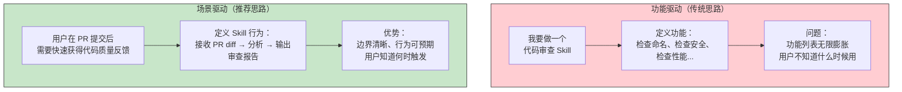
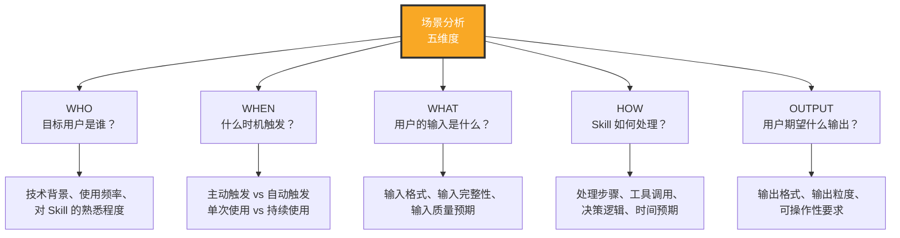
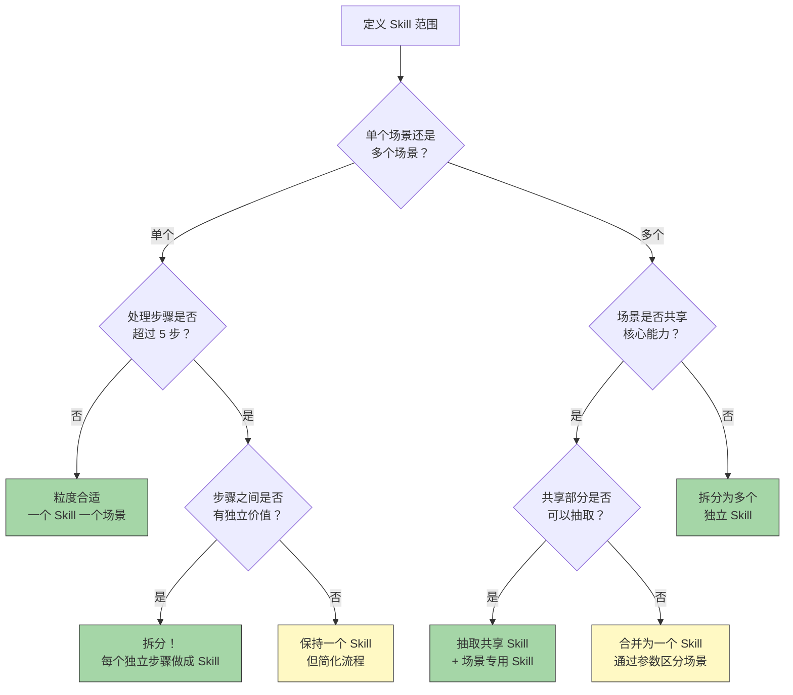
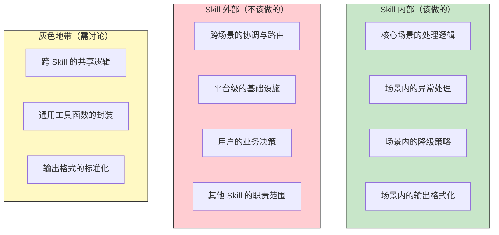
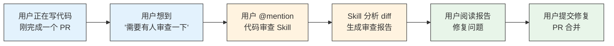

# 需求分析与场景定义

> [!note] 本文定位
> 本文聚焦于 Skill 制作**最前置**的环节：需求分析与场景定义。场景定义的质量直接决定了 Skill 的可用性和边界清晰度。一个场景定义模糊的 Skill，无论 prompt 写得多好，都很难真正解决用户问题。

---

## 一、场景驱动的设计方法论

### 1.1 为什么场景驱动而不是功能驱动？



> [!important] 核心理念
> 场景驱动意味着：**从用户的实际使用场景出发，反推 Skill 的功能设计，而不是从技术能力出发，罗列功能清单。** 场景定义了 Skill 的"存在理由"——用户为什么需要这个 Skill？在什么情况下会用到它？

### 1.2 场景分析的五个维度



---

## 二、从场景到 Skill 定义

### 2.1 场景描述模板

```markdown
## 场景名称：[简短描述]

### 用户画像
- 角色：[例如：初级开发者]
- 技术背景：[例如：熟悉 Python，了解 Git 基础]
- 使用频率：[例如：每天 5-10 次]

### 触发时机
- 触发方式：[主动调用 / 事件触发 / 关键词匹配]
- 典型上下文：[例如：用户在 IDE 中写完一段代码后]

### 输入描述
- 必填输入：[明确的必填项]
- 可选输入：[可选的附加信息]
- 输入约束：[格式、长度、内容限制]

### 处理流程
1. [步骤一]
2. [步骤二]
3. [步骤三]

### 期望输出
- 输出格式：[JSON / Markdown / 纯文本 / 文件]
- 输出内容：[具体包含什么信息]
- 输出时机：[即时返回 / 异步通知]

### 成功标准
- [用户如何判断 Skill 干得不错？]
```

### 2.2 场景描述示例

> [!example] 场景描述示例：代码审查 Skill
>
> **场景名称**：PR 提交后的自动代码审查
>
> **用户画像**：
> - 角色：中级开发者
> - 技术背景：熟悉 TypeScript 和 React
> - 使用频率：每天 2-3 次
>
> **触发时机**：
> - 触发方式：用户在 PR 页面 @mention Skill
> - 典型上下文：PR 已创建，等待审查
>
> **输入描述**：
> - 必填输入：PR 的 diff 内容
> - 可选输入：审查重点（如"只看安全性"）
> - 输入约束：diff 不超过 5000 行
>
> **处理流程**：
> 1. 解析 diff 获取变更文件列表
> 2. 按文件类型分组，应用不同审查规则
> 3. 对每个变更块进行代码坏味道检测
> 4. 汇总审查结果，按严重程度排序
> 5. 生成审查报告
>
> **期望输出**：
> - 输出格式：Markdown 格式的审查报告
> - 输出内容：问题列表（含严重程度、位置、建议修复方案）
> - 输出时机：即时返回（2 分钟内）
>
> **成功标准**：
> - 审查覆盖率 > 80%（不遗漏明显问题）
> - 误报率 < 20%（不浪费开发者时间）
> - 审查报告中每个问题都附带可操作的建议

---

## 三、粒度控制：Skill 应该做多大？

### 3.1 粒度决策框架



### 3.2 粒度判断的量化指标

| 指标 | 过细的信号 | 合适的范围 | 过粗的信号 |
|:---|:---|:---|:---|
| Prompt 行数 | < 50 行 | 100-500 行 | > 800 行 |
| 工具调用数 | 0-1 个 | 2-8 个 | > 12 个 |
| 场景覆盖数 | 0.5 个场景 | 1-3 个场景 | > 5 个场景 |
| 决策分支数 | < 2 个 | 3-8 个 | > 15 个 |
| 用户心智模型 | 记不住何时用 | 一眼就知道何时用 | 不知道该不该用 |

> [!tip] 粒度检查口诀
> "一个 Skill 做一件事，一件事对应一个场景。如果你需要'并且'来描述 Skill 的功能，说明它太大了。如果你需要'当...的时候'来描述触发条件，说明粒度刚好。"

### 3.3 典型粒度问题案例

**问题一：过大的 Skill**

```
错误示例："代码助手 Skill"——功能包括代码生成、代码审查、代码重构、文档生成、测试编写
问题：用户不知道这个 Skill 到底能做什么，AI 也不知道该走哪条路径
解法：拆分为 5 个独立 Skill
```

**问题二：过小的 Skill**

```
错误示例："检查变量命名的 Skill"——只检查变量命名是否符合规范
问题：功能太单一，用户使用成本高于收益（不如直接写在代码规范里）
解法：合并到"代码审查 Skill"中，作为其中一个检查项
```

**问题三：模糊的 Skill**

```
错误示例："帮助开发者提高代码质量的 Skill"
问题：描述太模糊，边界不清晰，AI 不知道具体做什么
解法：聚焦到具体场景，如"PR 代码审查 Skill"
```

---

## 四、场景边界判断

### 4.1 边界判断的四个维度



### 4.2 边界判断的决策模板

当遇到边界问题时，用以下问题清单辅助决策：

> [!important] 边界判断问题清单
> 1. 这个功能是 Skill 的核心场景的一部分吗？
> 2. 如果不做这个功能，用户会认为 Skill "不完整"吗？
> 3. 这个功能是否可以被其他 Skill 复用？
> 4. 实现这个功能需要引入多少新的复杂度？
> 5. 这个功能是否可以作为一个独立的 Skill 存在？

**判断规则**：
- 如果问题 1、2 都是"是"，且问题 4 的复杂度可控 → 纳入 Skill
- 如果问题 3 是"是" → 考虑抽取为共享模块
- 如果问题 5 是"是" → 考虑做成独立 Skill
- 如果问题 1 是"否" → 明确排除

---

## 五、场景定义中的常见陷阱

### 5.1 场景描述过于抽象

> [!warning] 陷阱
> "用户需要一个代码审查工具"——这个描述太抽象，无法指导 Skill 设计。

**更好的描述**：详细描述见 [[#2.2 场景描述示例]]。

### 5.2 场景覆盖不足

> [!warning] 陷阱
> 只定义了"正常路径"场景，忽略了边界和异常场景。

**必须覆盖的场景类型**：
- **正常场景**：一切按预期进行
- **边界场景**：输入在边界值附近
- **异常场景**：输入格式错误、工具调用失败、超时等
- **退化场景**：部分能力不可用时的降级行为

### 5.3 场景之间存在冲突

> [!warning] 陷阱
> 不同场景的期望行为互相矛盾，导致 Skill 无法同时满足。

**示例**：一个 Skill 既要"快速返回结果"（场景 A），又要"深度分析"（场景 B）。这两个场景的需求是矛盾的，需要拆分或通过参数控制。

### 5.4 忽视用户的使用上下文

> [!warning] 陷阱
> 定义了 Skill 的功能，但没有考虑用户在实际使用时的上下文环境。

**应该考虑**：
- 用户在使用 Skill 前后的工作流是什么？
- 用户的注意力状态（深度工作 vs 碎片时间）？
- 用户能否容忍等待（同步 vs 异步）？

---

## 六、场景验证方法

### 6.1 故事板验证



用故事板的方式画出用户使用 Skill 的完整旅程，检查每个环节是否通畅。

### 6.2 纸面推演

在写代码之前，用纸笔（或文档）模拟 Skill 的完整交互过程：

1. 用户输入："请审查这个 PR 的代码"
2. Skill 应该做什么？
3. 如果工具调用失败怎么办？
4. 如果用户输入不完整怎么办？
5. 最终输出应该是什么？

### 6.3 同行评审

在场景定义完成后，请至少 2 位潜在用户阅读场景描述，收集反馈：
- 他们能理解 Skill 是做什么的吗？
- 他们能想象自己使用这个 Skill 的场景吗？
- 场景描述中有没有让他们困惑的地方？

---

## 七、关联阅读

- [[01-AI技术/Skill制作痛点/00_MOC_Skill制作痛点中枢]] — 返回知识库中枢
- [[01-AI技术/Skill制作痛点/01_Skill的本质与设计哲学]] — 前置阅读：Skill 的本质和设计原则
- [[01-AI技术/Skill制作痛点/03_Prompt工程在Skill中的难点]] — 从场景到 Prompt 的落地
- [[01-AI技术/Skill制作痛点/04_工具调用与编排的痛点]] — 工具链设计如何支撑场景
- [[01-AI技术/Skill制作痛点/08_案例：从0到1制作一个真实Skill]] — 端到端实战案例中的场景定义

---

## 八、总结


场景定义是 Skill 制作的**第一道质量关卡**。一个场景定义清晰的 Skill，后续的 Prompt 设计、工具链开发、测试验证都会水到渠成。反之，一个场景定义模糊的 Skill，无论投入多少技术资源，都很难真正解决用户的问题。

核心原则：**从场景出发，为场景服务，在场景中验证。**

---

*本文是 Skill 制作知识库的核心文档，建议与 [[01-AI技术/Skill制作痛点/01_Skill的本质与设计哲学]] 和 [[01-AI技术/Skill制作痛点/03_Prompt工程在Skill中的难点]] 配套阅读。*