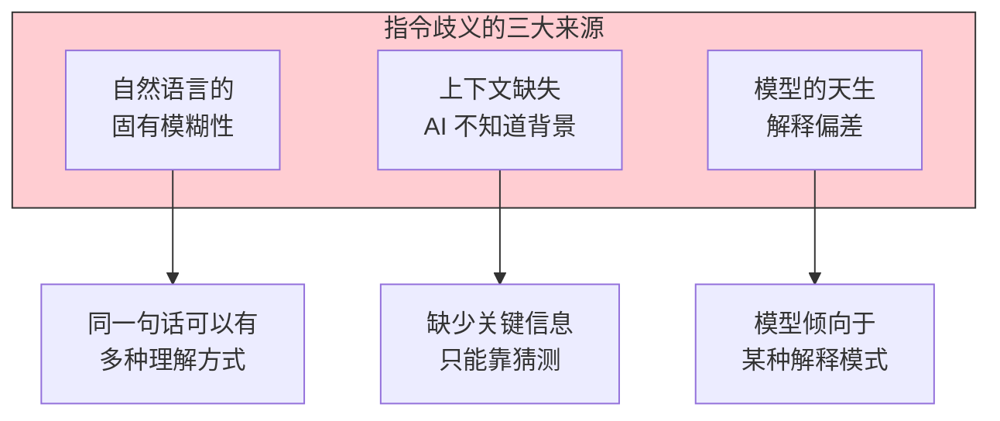
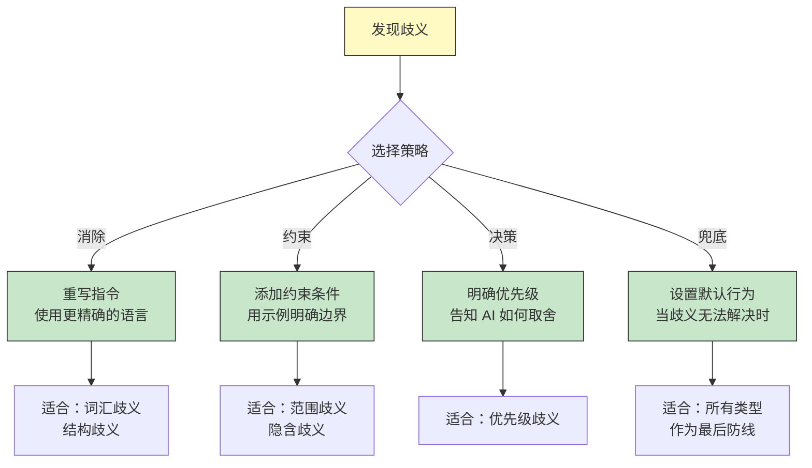
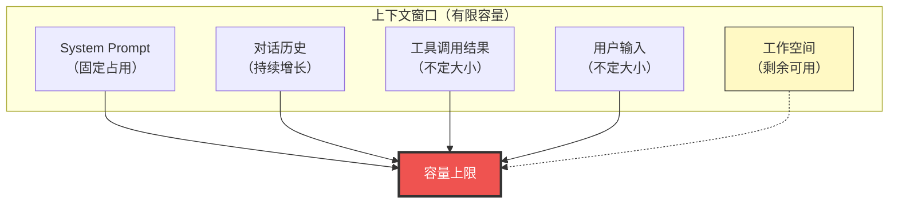
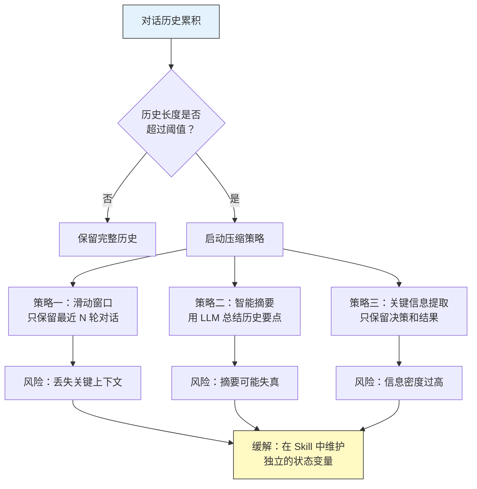
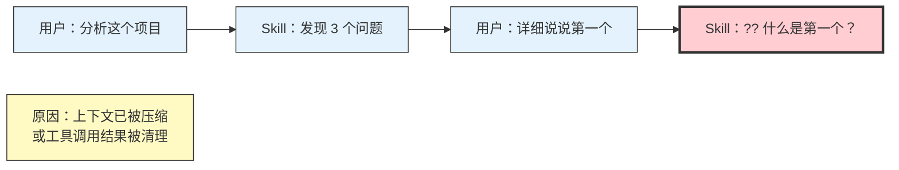
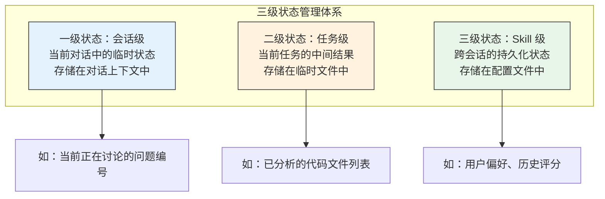
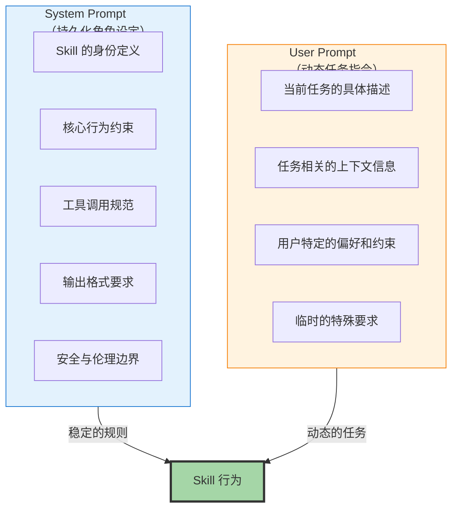
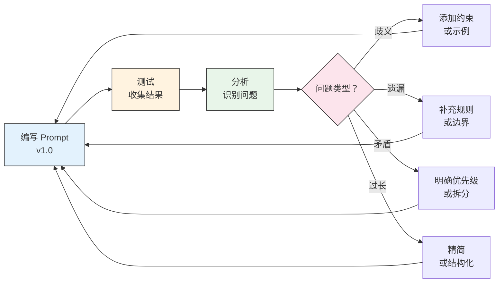

# Prompt 工程在 Skill 中的难点

> [!note] 本文定位
> Prompt 是 Skill 的"大脑"。本文深入剖析 Skill 开发中 Prompt 工程的核心难点——指令歧义、上下文窗口管理、多轮对话状态保持、以及 System Prompt 与 User Prompt 的分工策略。这些问题是 Skill 开发者最常遇到的"硬骨头"。

---

## 一、指令歧义：为什么"说清楚"这么难？

### 1.1 歧义的来源



> [!important] 核心洞察
> 指令歧义不是"写得不清楚"的问题，而是自然语言**固有的属性**。无论你写得多精确，总有一些边界情况是你的 Prompt 没有覆盖到的。认识到这一点，才能建立正确的 Prompt 设计心态：**不是消除歧义，而是管理歧义。**

### 1.2 歧义的类型

| 类型 | 说明 | 示例 | 出现频率 |
|:---|:---|:---|:---:|
| **词汇歧义** | 同一个词在不同上下文中有不同含义 | "检查代码"——是检查语法还是检查逻辑？ | 高 |
| **结构歧义** | 句子结构导致的多种解释 | "分析后修改并保存"——先分析，还是先修改？ | 中 |
| **范围歧义** | 指令的适用范围不明确 | "检查所有文件"——包含配置文件吗？ | 高 |
| **优先级歧义** | 多个指令冲突时的优先级不明确 | "既要快又要准确"——哪个优先？ | 高 |
| **隐含歧义** | 字面意思和实际意图不一致 | "优化这段代码"——可读性还是性能？ | 中 |

### 1.3 歧义管理策略



**实战技巧：歧义消除示例**

> [!example] 消除歧义的写法
>
> **有歧义的指令**：
> ```
> 检查代码中的问题
> ```
>
> **消除歧义后的指令**：
> ```
> 对输入的代码进行以下检查，按优先级排序：
> 1. 安全漏洞（最高优先级）：SQL 注入、XSS、硬编码密钥
> 2. 性能问题：N+1 查询、不必要的大对象创建
> 3. 代码规范：命名不符合项目约定、缺少必要的注释
>
> 对每个问题，必须说明：
> - 问题位置（文件名 + 行号）
> - 严重程度（严重/警告/建议）
> - 修复建议（至少一个具体方案）
>
> 如果代码中没有发现以上问题，返回"未发现已知问题"。
> 如果代码格式有误无法解析，返回详细错误信息，不要猜测。
> ```

---

## 二、上下文窗口管理

### 2.1 上下文窗口的"压力模型"



> [!warning] 核心矛盾
> 上下文窗口是有限的，但 Skill 需要的信息是无限的。System Prompt 写得越详细，可用的工作空间就越少；对话历史越长，留给新指令的空间就越少。这是 Prompt 工程中最根本的 trade-off。

### 2.2 上下文预算分配策略

| 组件 | 建议占比 | 说明 |
|:---|:---:|:---|
| System Prompt | 15-25% | 核心指令，必须精炼 |
| 工具定义 | 10-20% | 按需加载，不用的工具不要定义 |
| 对话历史 | 20-30% | 使用摘要压缩历史 |
| 工具调用结果 | 15-25% | 即时清理无用结果 |
| 用户输入 + 工作空间 | 15-25% | 留给 Skill 实际工作的空间 |

### 2.3 上下文压缩策略



> [!tip] 实战建议
> 对于需要长时间运行的 Skill（如多轮代码审查），建议在 Skill 内部维护一个**状态文件**，将关键决策和中间结果持久化，而不是全部依赖对话历史。

---

## 三、多轮对话状态保持

### 3.1 状态丢失的典型场景



### 3.2 状态保持的三种策略

| 策略 | 实现方式 | 优点 | 缺点 |
|:---|:---|:---|:---|
| **对话历史依赖** | 依赖 LLM 的上下文窗口保存历史 | 实现简单，无需额外开发 | 受窗口大小限制，可能被截断 |
| **显式状态文件** | 在 Skill 中将关键状态写入文件 | 可靠，不受窗口限制 | 需要额外的读写操作 |
| **结构化状态变量** | 在 Agent 层维护结构化状态 | 精确，可编程控制 | 需要 Agent 框架支持 |

### 3.3 推荐的状态管理模式



> [!important] 关键原则
> 能放在下一级的状态，不要放在上一级。会话级状态应该尽可能轻量，让 LLM 的上下文窗口有更多空间用于推理。

---

## 四、System Prompt vs User Prompt 的分工

### 4.1 分工原则



### 4.2 分工决策表

| 内容类型 | 放哪里 | 原因 |
|:---|:---|:---|
| Skill 的身份描述 | System Prompt | 每次调用都需要，不会改变 |
| 核心行为规则 | System Prompt | 是 Skill 的"宪法" |
| 工具使用规范 | System Prompt | 稳定的工具调用模式 |
| 输出格式要求 | System Prompt | 一致的输出格式 |
| 当前任务的具体内容 | User Prompt | 每次调用都不同 |
| 用户提供的上下文 | User Prompt | 随任务变化 |
| 临时的特殊要求 | User Prompt | 可能只适用一次 |
| Few-shot 示例 | System Prompt | 稳定的行为模式参考 |

### 4.3 常见错误

> [!warning] 错误一：System Prompt 过长
> 把所有的细节都塞进 System Prompt，导致上下文窗口被大量占用。**解决方案**：System Prompt 只放"不变的东西"，具体任务细节放到 User Prompt。

> [!warning] 错误二：System Prompt 和 User Prompt 职责重叠
> 两者都描述了同样的行为规则，导致歧义和冲突。**解决方案**：System Prompt 定义"规则"，User Prompt 描述"任务"，两者互补而不重叠。

> [!warning] 错误三：User Prompt 中缺少关键信息
> 假设 AI 能从 System Prompt 中推断出所有细节。**解决方案**：User Prompt 中明确包含任务所需的全部上下文信息。

---

## 五、Prompt 设计的迭代方法

### 5.1 迭代循环



### 5.2 Prompt 版本管理

> [!tip] 建议
> 每次修改 Prompt 时，记录：
> 1. 修改了什么（diff）
> 2. 为什么修改（解决的 bad case）
> 3. 修改后的效果（before/after 对比）
>
> 这样可以形成 Prompt 的"进化史"，帮助团队理解设计决策。

---

## 六、Prompt 设计中的高级技巧

### 6.1 结构化 Prompt 设计

```
[角色定义]
你是一个...的专家

[核心规则]
1. ...
2. ...

[工作流程]
步骤1：...
步骤2：...

[输出格式]
必须使用以下格式：
...

[边界条件]
如果遇到...情况，则...
如果遇到...情况，则...

[示例]
输入：...
输出：...
```

### 6.2 思维链（Chain-of-Thought）嵌入

在 Prompt 中明确要求 AI 展示推理过程，可以显著提高复杂任务的准确性：

> [!example] 思维链示例
> ```
> 在给出最终答案之前，请按以下步骤思考：
> 1. 理解用户的问题核心是什么
> 2. 列出可能的解决方案
> 3. 评估每个方案的优缺点
> 4. 选择最优方案并说明理由
> 5. 给出最终建议
> ```

### 6.3 负向指令

除了告诉 AI 要做什么，也要告诉它**不要做什么**：

```
不要：
- 不要在未确认的情况下假设用户意图
- 不要生成超过 500 字的回答（除非用户明确要求）
- 不要使用模糊的表述如"可能"、"也许"（给出明确判断）
- 不要在工具调用失败时自己编造结果
```

---

## 七、关联阅读

- [[01-AI技术/Skill制作痛点/00_MOC_Skill制作痛点中枢]] — 返回知识库中枢
- [[01-AI技术/Skill制作痛点/01_Skill的本质与设计哲学]] — Skill 的底层设计哲学
- [[01-AI技术/Skill制作痛点/02_需求分析与场景定义]] — 如何从场景出发定义 Prompt 需求
- [[01-AI技术/Skill制作痛点/04_工具调用与编排的痛点]] — Prompt 如何驱动工具调用
- [[01-AI技术/Skill制作痛点/05_Skill测试与质量保障]] — 如何通过测试发现 Prompt 问题
- [[01-AI技术/Skill制作痛点/06_Skill的迭代与维护]] — Prompt 的持续优化策略
- [[05-产品与开发/Vibe Coder/02-开发实战/Prompt 工程速查（vibe coding 专用）]] — 关联知识库中的 Prompt 速查手册

---

## 八、总结

Prompt 是 Skill 的"大脑"，也是 Skill 开发中最需要反复打磨的部分。核心挑战包括：

1. **指令歧义**：不是消除歧义，而是管理歧义
2. **上下文窗口**：合理分配预算，使用压缩策略
3. **多轮对话**：建立三级状态管理体系
4. **分工策略**：System Prompt 做规则，User Prompt 做任务

好的 Prompt 不是一次写成的，而是在"编写-测试-分析-修复"的循环中不断精炼出来的。

---

*本文是 Skill 制作知识库的核心技术文档，建议与 [[01-AI技术/Skill制作痛点/03_Prompt工程在Skill中的难点]] 和 [[01-AI技术/Skill制作痛点/04_工具调用与编排的痛点]] 配套阅读。*