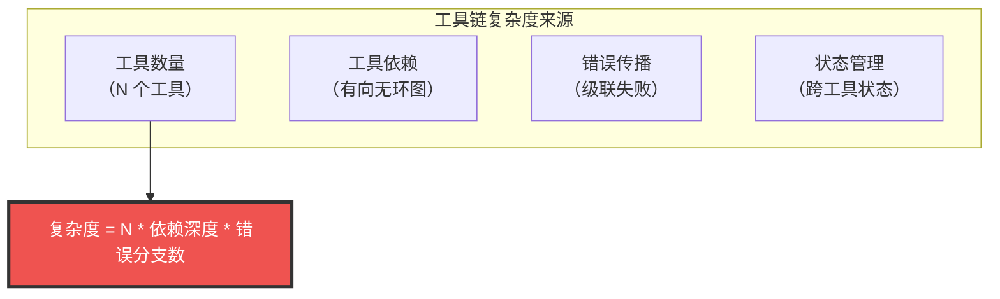
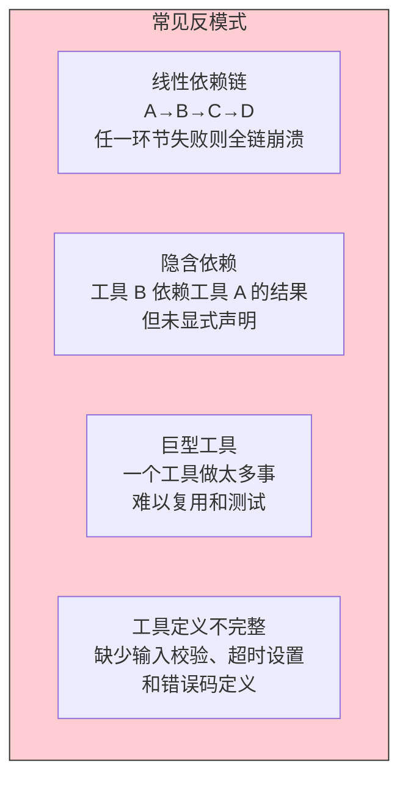
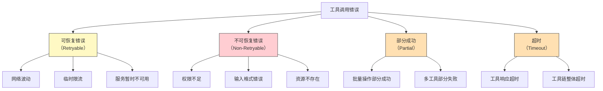
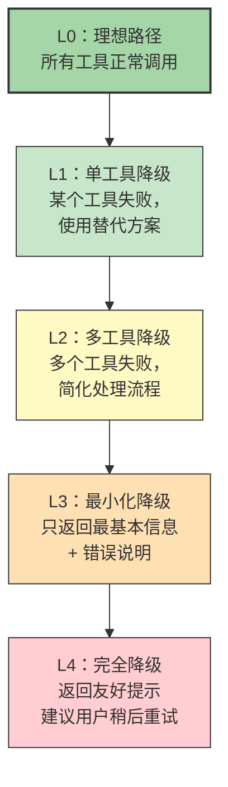
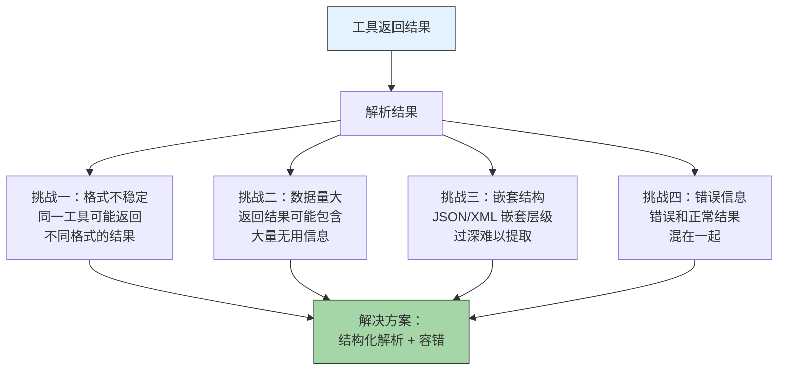
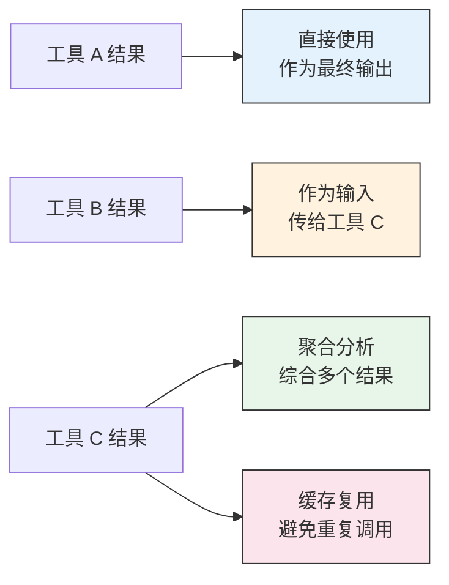
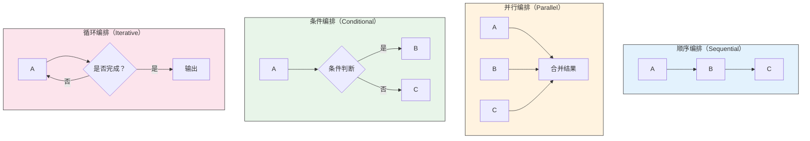
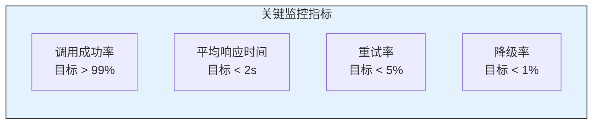

# 工具调用与编排的痛点

> [!note] 本文定位
> 工具调用是 Skill 从"嘴上说说"到"真正做事"的关键能力。本文深入分析工具链设计、错误处理、降级策略、以及工具返回结果的解析与二次利用等核心痛点。这些问题是 Skill 从原型走向生产环境的必经之路。

---

## 一、工具链设计的核心挑战

### 1.1 工具链的复杂性模型



> [!important] 核心洞察
> 工具链的复杂度不是线性的。每增加一个工具，不是增加 1 个复杂度单位，而是增加了与所有现有工具之间的交互可能性。一个有 5 个工具、每个工具有 3 种失败模式的 Skill，理论上需要处理 3^5 = 243 种可能的失败组合。

### 1.2 工具链设计的反模式



---

## 二、工具调用的错误处理策略

### 2.1 错误分类体系



### 2.2 错误处理策略矩阵

| 错误类型 | 策略 | 实现方式 | 用户感知 |
|:---|:---|:---|:---|
| 可恢复错误 | 自动重试 | 指数退避重试，最多 3 次 | 无感知（延迟稍长） |
| 不可恢复错误 | 明确报错 | 返回具体错误原因和建议 | 看到明确的错误信息 |
| 部分成功 | 降级返回 | 返回成功部分 + 失败说明 | 获得部分结果 |
| 超时 | 超时处理 | 设置合理超时，超时后降级 | 看到超时提示 |

### 2.3 错误处理代码模式

```
# 工具调用的标准错误处理模式

def call_tool_with_retry(tool_name, params, max_retries=3):
    """
    标准工具调用模式：
    1. 参数校验
    2. 指数退避重试
    3. 错误分类和转换
    4. 降级策略
    """
    # 步骤 1：参数校验
    validation_result = validate_params(tool_name, params)
    if not validation_result.valid:
        return ErrorResult(
            type="INVALID_PARAMS",
            message=f"参数校验失败: {validation_result.errors}"
        )

    # 步骤 2：指数退避重试
    for attempt in range(max_retries):
        try:
            result = execute_tool(tool_name, params, timeout=30)
            return SuccessResult(data=result)

        except TemporaryError as e:
            if attempt < max_retries - 1:
                wait_time = 2 ** attempt  # 指数退避
                time.sleep(wait_time)
                continue
            # 重试耗尽，进入降级
            return fallback_strategy(tool_name, e)

        except PermanentError as e:
            # 不可恢复错误，直接返回
            return ErrorResult(
                type="PERMANENT_ERROR",
                message=f"工具 {tool_name} 调用失败: {e}"
            )

    # 步骤 3：降级策略
    return fallback_strategy(tool_name, "max_retries_exceeded")
```

---

## 三、降级策略设计

### 3.1 降级层级



### 3.2 降级策略设计原则

> [!important] 降级三原则
> 1. **优雅降级**：功能减少但不出错，比功能完整但崩溃要好
> 2. **透明告知**：明确告诉用户发生了什么、为什么降级、能做什么
> 3. **渐进降级**：不要从 L0 直接跳到 L4，逐级降级，保留尽可能多的功能

### 3.3 降级策略实例

| 场景 | L0 理想路径 | L1 降级 | L2 降级 | L3 降级 |
|:---|:---|:---|:---|:---|
| 代码审查 | 安全+性能+规范全面检查 | 跳过安全扫描（API 不可用） | 只做规范检查 | 提示用户手动审查 |
| 文档生成 | 自动分析代码+生成+格式化 | 跳过代码分析（工具故障） | 生成模板文档 | 返回文档骨架 |
| 数据分析 | 连接数据库+分析+可视化 | 使用缓存数据 | 只做统计分析 | 返回数据摘要 |

---

## 四、工具返回结果的解析与二次利用

### 4.1 结果解析的挑战



### 4.2 结果解析的策略

**策略一：定义结果 Schema**

```
# 为每个工具定义标准的结果格式
TOOL_RESULT_SCHEMA = {
    "tool_name": "string",
    "status": "success | partial | error",
    "data": "object",          # 核心数据
    "metadata": {              # 元数据
        "execution_time": "number",
        "tokens_used": "number",
        "cache_hit": "boolean"
    },
    "errors": [                # 错误详情（如果有）
        {
            "code": "string",
            "message": "string",
            "recoverable": "boolean"
        }
    ]
}
```

**策略二：提取-转换-验证**

```
def extract_transform_validate(raw_result):
    # 1. 提取：从原始结果中提取关键字段
    extracted = extract_key_fields(raw_result)

    # 2. 转换：将提取的数据转换为标准格式
    transformed = transform_to_schema(extracted)

    # 3. 验证：验证转换后的数据完整性
    if not validate_schema(transformed):
        return fallback_parse(raw_result)

    return transformed
```

### 4.3 结果二次利用的模式



---

## 五、工具编排模式

### 5.1 常见编排模式



### 5.2 编排模式选择指南

| 场景特征 | 推荐模式 | 原因 |
|:---|:---|:---|
| 步骤间有严格顺序依赖 | 顺序编排 | 上一步输出是下一步输入 |
| 步骤间无依赖，可独立执行 | 并行编排 | 提升效率 |
| 需要根据中间结果决定走向 | 条件编排 | 灵活应对不同情况 |
| 需要重复执行直到满足条件 | 循环编排 | 处理不确定步骤数的情况 |

### 5.3 编排中的常见陷阱

> [!warning] 陷阱一：过度并行化
> 把所有工具都并行调用，但忽略了工具之间的隐含依赖。结果是某些工具因为缺少前置数据而失败。

> [!warning] 陷阱二：缺少超时控制
> 循环编排中没有设置最大迭代次数，导致在某些情况下陷入无限循环。

> [!warning] 陷阱三：编排和 Prompt 耦合
> 把编排逻辑硬编码在 Prompt 中，而不是通过工具链的显式依赖关系来管理。结果是 Prompt 修改时容易破坏编排逻辑。

---

## 六、工具链的可观测性

### 6.1 工具调用日志

每次工具调用都应记录以下信息：

```yaml
tool_call_log:
  tool_name: "code_analyzer"
  timestamp: "2026-07-27T10:30:00Z"
  params_snapshot: "{file: 'main.py', checks: ['security', 'style']}"
  result_summary: "Found 3 issues (2 warnings, 1 error)"
  execution_time_ms: 1250
  retry_count: 0
  status: "success"
```

### 6.2 工具调用监控面板



---

## 七、关联阅读

- [[01-AI技术/Skill制作痛点/00_MOC_Skill制作痛点中枢]] — 返回知识库中枢
- [[01-AI技术/Skill制作痛点/03_Prompt工程在Skill中的难点]] — Prompt 如何驱动工具调用
- [[01-AI技术/Skill制作痛点/05_Skill测试与质量保障]] — 工具调用的测试策略
- [[01-AI技术/Skill制作痛点/06_Skill的迭代与维护]] — 工具链的版本管理和兼容性
- [[01-AI技术/Skill制作痛点/07_跨平台兼容性挑战]] — 不同平台的工具调用差异
- [[01-AI技术/Skill制作痛点/08_案例：从0到1制作一个真实Skill]] — 端到端实战中的工具编排

---

## 八、总结

工具调用与编排是 Skill 从"能说"到"能做"的关键。核心挑战包括：

1. **工具链设计**：控制复杂度，避免反模式
2. **错误处理**：区分可恢复和不可恢复错误，建立分层处理策略
3. **降级策略**：渐进式降级，优雅失败
4. **结果解析**：结构化提取-转换-验证流水线
5. **编排模式**：根据场景选择合适的编排模式
6. **可观测性**：建立完整的日志和监控体系

> [!tip] 核心原则
> 工具调用失败是常态，不是异常。好的 Skill 不是"从不失败"，而是"失败时给用户最好的体验"。

---

*本文是 Skill 制作知识库的核心技术文档，建议与 [[01-AI技术/Skill制作痛点/03_Prompt工程在Skill中的难点]] 和 [[01-AI技术/Skill制作痛点/05_Skill测试与质量保障]] 配套阅读。*