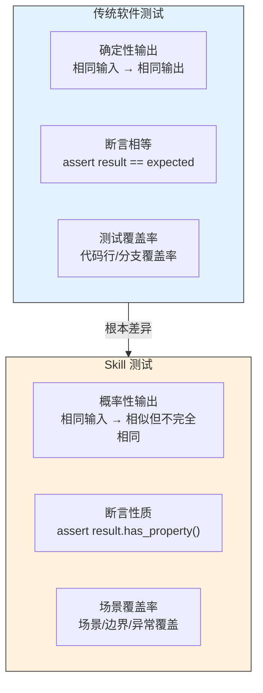
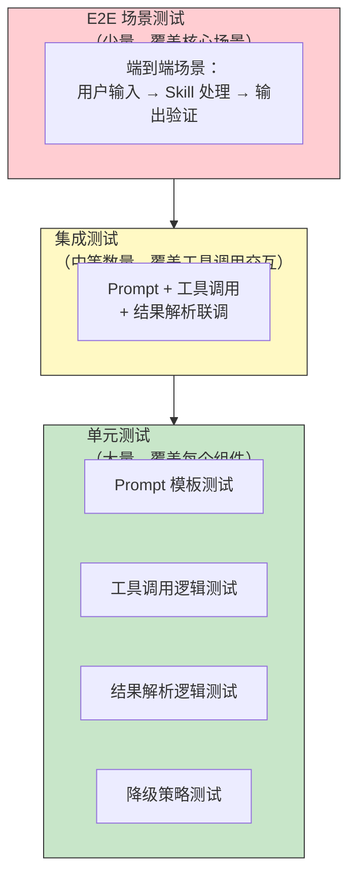
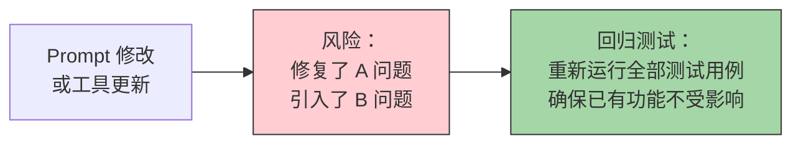
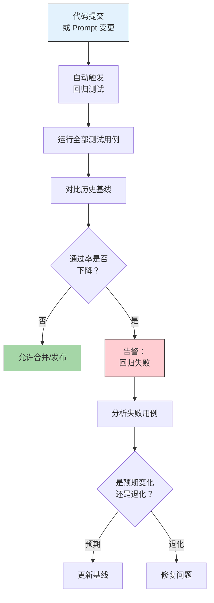
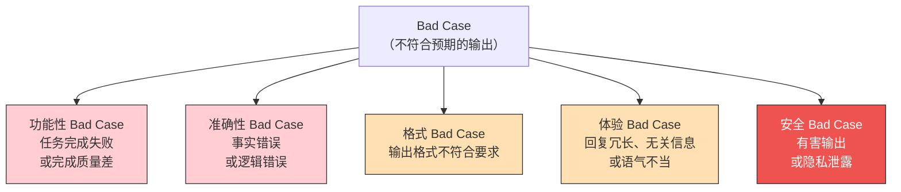
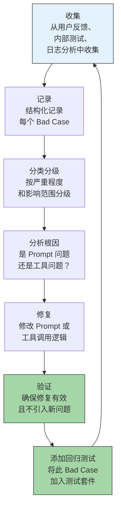
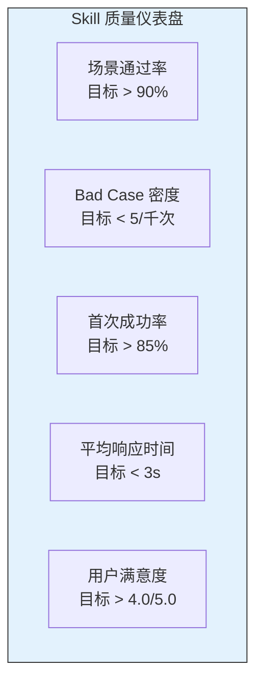

# Skill 测试与质量保障

> [!note] 本文定位
> Skill 的测试与传统软件测试有本质区别——Skill 的输出不是确定性的，而是概率性的。这意味着传统的"断言相等"测试方法不再适用。本文探讨如何为 Skill 建立有效的测试体系，包括测试策略、回归测试、bad case 管理，以及持续质量保障机制。

---

## 一、Skill 测试的特殊性

### 1.1 与传统软件测试的对比



> [!important] 核心洞察
> Skill 的输出不是 `1 + 1 = 2`，而是 `1 + 1 大约等于 2`。测试的目标不是验证"精确相等"，而是验证"性质正确"——输出是否满足功能性、准确性、格式、安全性等质量属性。

### 1.2 Skill 测试的五个质量维度

| 维度 | 定义 | 示例指标 |
|:---|:---|:---|
| **功能性** | Skill 是否完成了预期任务 | 任务完成率 |
| **准确性** | 输出内容是否正确 | 事实正确率、误报率 |
| **格式合规** | 输出格式是否符合要求 | 格式通过率 |
| **鲁棒性** | 对异常输入的容错能力 | 异常处理成功率 |
| **安全性** | 是否避免了有害输出 | 安全违规率 |

---

## 二、测试策略：单元测试 vs 场景测试

### 2.1 测试金字塔



### 2.2 单元测试策略

**测试对象**：Prompt 模板、工具调用逻辑、结果解析逻辑、降级策略

**测试方法**：

```
# Prompt 模板测试
def test_prompt_template():
    prompt = render_prompt("code_review", {"language": "python"})
    assert "python" in prompt
    assert "安全" in prompt or "security" in prompt
    assert len(prompt) < 2000  # 长度约束

# 工具调用逻辑测试
def test_tool_call_with_invalid_params():
    result = call_tool("code_analyzer", {"file": ""})
    assert result.status == "error"
    assert result.error_code == "INVALID_PARAMS"

# 降级策略测试
def test_fallback_strategy():
    with mock_tool_failure("code_analyzer"):
        result = run_skill("code_review", sample_pr)
        assert result.status == "partial"
        assert "未完成安全检查" in result.message
```

### 2.3 场景测试策略

场景测试是 Skill 测试的核心，因为只有端到端场景才能验证 Skill 的实际表现。

**场景测试设计模板**：

```yaml
scenario:
  name: "PR 代码审查 - 正常路径"
  description: "用户提交一个包含 3 个文件的 PR，Skill 应正确识别所有问题"

  input:
    pr_diff: "sample_pr_diff.txt"
    review_focus: "all"

  expected_properties:
    - "输出包含至少一个严重问题"
    - "每个问题都标注了文件位置"
    - "每个问题都有修复建议"
    - "输出格式为 Markdown"

  acceptance_criteria:
    - "问题检出率 > 80%"
    - "误报率 < 20%"
    - "输出在 2 分钟内完成"
```

---

## 三、回归测试策略

### 3.1 回归测试的必要性



> [!warning] 痛点
> 很多 Skill 开发者修完一个 bug 后，只测试了被修复的场景，没有重新测试其他场景。结果是被修复的 bug 好了，但其他功能坏了。这就是"打地鼠"现象。

### 3.2 回归测试套件设计

回归测试套件应该包含以下类型的测试用例：

| 测试类型 | 数量 | 优先级 | 用途 |
|:---|:---:|:---:|:---|
| 核心场景测试 | 5-10 个 | 最高 | 确保核心功能正常 |
| 边界场景测试 | 10-20 个 | 高 | 覆盖边界输入 |
| 异常场景测试 | 10-20 个 | 中 | 覆盖异常输入 |
| 回归专用测试 | 20-50 个 | 中 | 来自历史 bug 修复 |
| 随机测试 | 不限 | 低 | 探索性测试 |

### 3.3 回归测试自动化



---

## 四、Bad Case 持续收集与优化

### 4.1 Bad Case 的定义与分类



### 4.2 Bad Case 管理流程



### 4.3 Bad Case 记录模板

```yaml
bad_case:
  id: "BC-2026-0742"
  date: "2026-07-27"
  severity: "medium"  # critical / high / medium / low

  input:
    user_message: "检查这段代码的安全性"
    code_snippet: "def login(user, pwd): ..."

  expected:
    - "应识别出 SQL 注入风险"
    - "应识别出密码明文存储问题"

  actual:
    - "只识别了 SQL 注入风险"
    - "遗漏了密码明文存储问题"

  root_cause:
    type: "prompt_insufficient"
    detail: "安全审查规则中未包含密码存储相关检查项"

  fix:
    action: "在安全审查规则中添加'密码存储安全'检查项"
    prompt_diff: "见 PR #284"

  regression_test_added: true
  status: "fixed"
```

---

## 五、质量评估体系

### 5.1 质量仪表盘



### 5.2 质量门禁

在 Skill 发布前，必须通过以下质量门禁：

| 门禁 | 标准 | 不通过的处理 |
|:---|:---|:---|
| 核心场景通过率 | >= 95% | 禁止发布 |
| 回归测试通过率 | >= 100% | 禁止发布 |
| 新增 Bad Case | 0 个 critical | 禁止发布 |
| 安全扫描 | 无高危漏洞 | 禁止发布 |
| 性能基准 | 响应时间不退化 > 20% | 警告，需评估 |

---

## 六、测试中的常见陷阱

### 6.1 测试用例过于理想化

> [!warning] 陷阱
> 只测试"完美输入"——格式正确、信息完整、意图明确的用户输入。但真实用户的输入往往是凌乱的、不完整的、模糊的。

**解决方案**：在测试用例中加入"脏数据"——拼写错误、不完整输入、模糊表达、多语言混合等。

### 6.2 测试用例随时间老化

> [!warning] 陷阱
> 测试用例写完后就不再更新，但 Skill 的行为在持续演进。结果是测试用例逐渐失去代表性和有效性。

**解决方案**：定期审查测试用例，淘汰不再适用的用例，添加反映新场景的用例。

### 6.3 忽视非功能性测试

> [!warning] 陷阱
> 只关注功能性测试（输出是否正确），忽视非功能性测试（响应时间、资源消耗、并发处理能力）。

**解决方案**：建立非功能性测试基准，每次发布前检查性能指标是否退化。

### 6.4 测试数据与生产数据脱节

> [!warning] 陷阱
> 测试数据是精心构造的，但生产环境的真实数据完全不同。导致测试通过但上线后问题频出。

**解决方案**：从生产环境中采样真实数据，脱敏后加入测试套件。

---

## 七、关联阅读

- [[01-AI技术/Skill制作痛点/00_MOC_Skill制作痛点中枢]] — 返回知识库中枢
- [[01-AI技术/Skill制作痛点/03_Prompt工程在Skill中的难点]] — Prompt 层面的问题如何影响测试
- [[01-AI技术/Skill制作痛点/04_工具调用与编排的痛点]] — 工具链的测试策略
- [[01-AI技术/Skill制作痛点/06_Skill的迭代与维护]] — 测试如何支撑持续迭代
- [[01-AI技术/Skill制作痛点/08_案例：从0到1制作一个真实Skill]] — 端到端实战中的测试实践

---

## 八、总结

Skill 测试的核心挑战在于输出的**概率性**和**非确定性**。有效的测试策略需要：

1. **分层测试**：单元测试、集成测试、场景测试三层覆盖
2. **场景驱动**：以用户场景为核心，设计测试用例
3. **Bad Case 管理**：建立"收集-分析-修复-回归"的闭环
4. **自动化回归**：每次变更自动运行全量测试
5. **质量门禁**：发布前强制通过质量检查

> [!tip] 核心原则
> 测试的目的不是证明 Skill 没有 bug，而是建立对 Skill 行为的**信心**。一个好的测试体系能让你在修改 Prompt 时不再心惊胆战。

---

*本文是 Skill 制作知识库的质量保障文档，建议与 [[01-AI技术/Skill制作痛点/06_Skill的迭代与维护]] 配套阅读。*