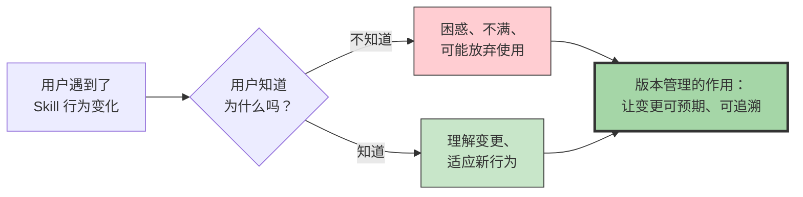
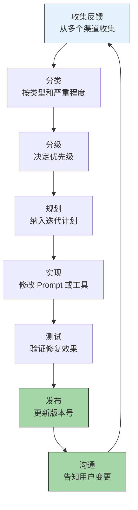
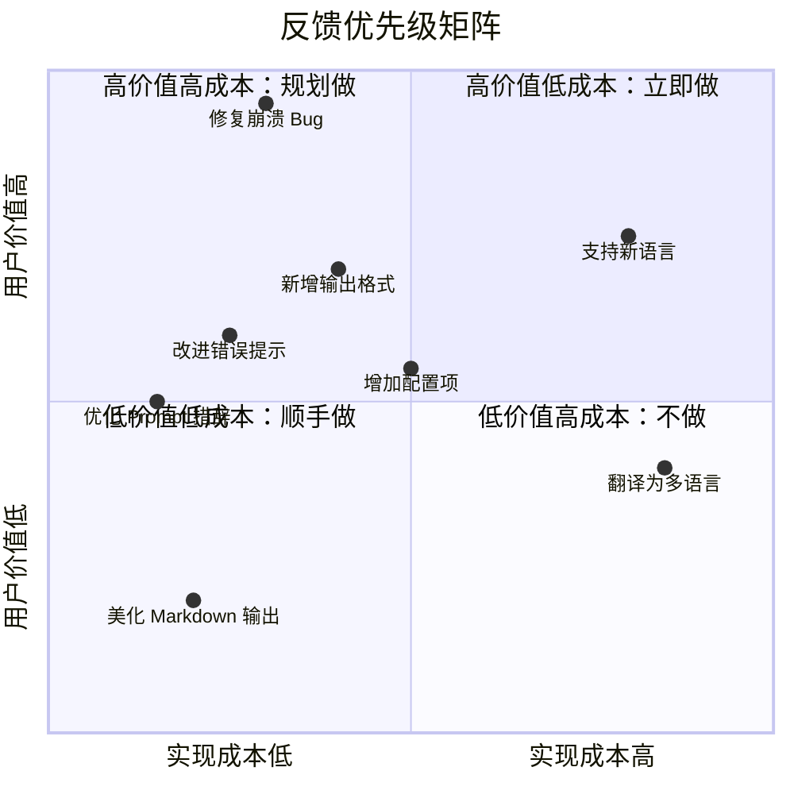
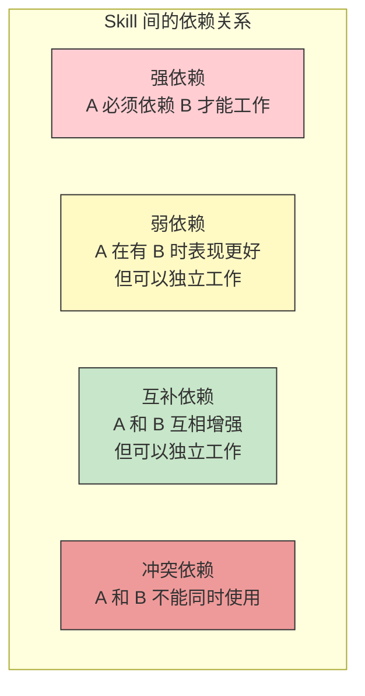
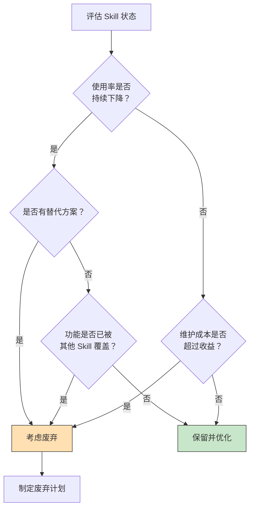
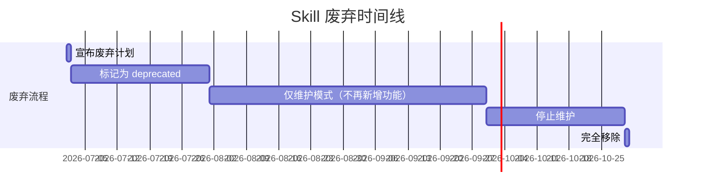
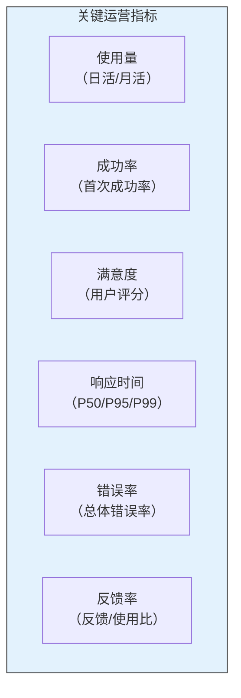

# Skill 的迭代与维护

> [!note] 本文定位
> Skill 不是一次交付就结束的"项目"，而是需要持续演进的"产品"。本文聚焦于 Skill 发布后的迭代与维护阶段——如何管理版本、如何基于用户反馈驱动迭代、如何处理 Skill 间的依赖关系、以及如何优雅地废弃和迁移 Skill。

---

## 一、版本管理：Skill 也需要语义化版本

### 1.1 为什么 Skill 需要版本管理？



> [!important] 核心洞察
> Skill 的行为变化对用户来说是"看不见的更新"。用户只知道"昨天还能用的功能今天不行了"。版本管理让这种变化变得可见、可理解、可预期。

### 1.2 Skill 的语义化版本规范

| 版本号变更 | 含义 | 示例 |
|:---|:---|:---|
| **MAJOR** (1.0 → 2.0) | 不兼容的 API 变更或行为重大变更 | 完全重写 Prompt、改变输出格式 |
| **MINOR** (1.0 → 1.1) | 向后兼容的功能新增 | 新增一个检查项、支持新的输入格式 |
| **PATCH** (1.0.0 → 1.0.1) | 向后兼容的 bug 修复 | 修复一个误报、优化 Prompt 措辞 |

### 1.3 版本变更日志模板

```markdown
## v1.2.0 (2026-07-27)

### 新增
- 支持 Python 3.12 的新语法特性检查
- 新增"安全审计"检查模式

### 修复
- 修复了在 Windows 路径下文件匹配失败的问题 (#142)
- 修复了空文件导致审查崩溃的问题 (#145)

### 变更
- 将"命名检查"的默认严重程度从"警告"调整为"建议"

### 废弃
- `--legacy-mode` 参数将在 v2.0 中移除
```

---

## 二、用户反馈驱动迭代

### 2.1 反馈闭环



### 2.2 反馈分类体系

| 反馈类型 | 描述 | 处理优先级 | 典型响应时间 |
|:---|:---|:---:|:---:|
| **严重缺陷** | Skill 完全无法使用或产生有害输出 | 最高 | 24 小时内 |
| **功能缺陷** | 特定场景下表现不符合预期 | 高 | 1 周内 |
| **体验问题** | 输出格式、措辞等体验问题 | 中 | 2 周内 |
| **功能建议** | 用户希望增加新功能 | 中 | 纳入下个迭代 |
| **使用困惑** | 用户不知道如何使用或何时使用 | 低 | 改进文档 |

### 2.3 反馈驱动的优先级决策



---

## 三、Skill 间依赖管理

### 3.1 依赖关系的类型



### 3.2 依赖管理策略

| 依赖类型 | 管理策略 | 声明方式 |
|:---|:---|:---|
| 强依赖 | 必须声明版本范围，升级时同步测试 | `requires: code_analyzer >= 1.2.0` |
| 弱依赖 | 声明推荐版本，降级时优雅处理 | `recommends: code_formatter >= 1.0.0` |
| 互补依赖 | 声明兼容版本，互不影响 | `compatible_with: test_generator >= 2.0.0` |
| 冲突依赖 | 声明冲突，运行时检测 | `conflicts_with: legacy_reviewer` |

### 3.3 依赖管理的最佳实践

> [!tip] 最佳实践
> 1. **最小化强依赖**：强依赖越多，系统越脆弱。尽量使用弱依赖和互补依赖。
> 2. **版本锁定**：在 Skill 的配置中锁定依赖的 MAJOR 版本，避免自动升级带来的破坏性变更。
> 3. **依赖测试**：当依赖的 Skill 升级时，必须重新运行依赖方的回归测试。
> 4. **依赖文档**：在 Skill 的文档中明确列出所有依赖及其版本要求。

---

## 四、废弃与迁移策略

### 4.1 何时考虑废弃 Skill



### 4.2 废弃的生命周期



### 4.3 废弃通知模板

```markdown
## [废弃通知] code_reviewer v1.x 将于 2026-10-01 停止维护

### 为什么废弃？
v1.x 的架构已无法支持新的审查需求，我们将用 v2.x 替代。

### 影响范围
- 所有使用 code_reviewer v1.x 的用户

### 迁移方案
1. 将配置中的 `code_reviewer: v1` 改为 `code_reviewer: v2`
2. 注意 v2 的输出格式有变化，请参考迁移指南

### 时间线
- 2026-07-01：宣布废弃（今天）
- 2026-08-01：标记为 deprecated，仅维护模式
- 2026-10-01：停止维护
- 2026-12-01：完全移除

### 帮助
如有迁移问题，请查看 [迁移指南] 或联系 [支持渠道]
```

### 4.4 迁移策略

| 迁移策略 | 适用场景 | 复杂度 |
|:---|:---|:---:|
| **直接替换** | 新 Skill 完全兼容旧 Skill 的接口 | 低 |
| **适配器模式** | 新 Skill 接口不同，但可以封装 | 中 |
| **渐进迁移** | 新旧 Skill 并行运行一段时间 | 中 |
| **强制迁移** | 旧 Skill 直接移除，用户必须迁移 | 高 |

> [!warning] 强制迁移的风险
> 强制迁移是最简单但风险最高的策略。如果用户没有及时迁移，会导致流程中断。建议至少给用户 2-3 个月的缓冲期。

---

## 五、迭代中的常见陷阱

### 5.1 过度迭代

> [!warning] 陷阱
> 频繁修改 Prompt，每次修改都改变 Skill 的行为。结果是用户无法建立稳定的使用预期，每次使用都像在"开盲盒"。

**解决方案**：建立稳定的迭代节奏（如每两周一个小版本，每月一个大版本），让用户有适应期。

### 5.2 修复引入新问题

> [!warning] 陷阱
> 修复一个 bug 时，不小心引入了新的 bug。这是 Skill 迭代中最常见的问题，因为 Prompt 的修改往往是全局性的。

**解决方案**：每次修改后运行完整的回归测试套件（参考 [[01-AI技术/Skill制作痛点/05_Skill测试与质量保障]]）。

### 5.3 忽视向后兼容性

> [!warning] 陷阱
> 修改输出格式、改变行为逻辑，但没有考虑已有用户的使用习惯和集成场景。

**解决方案**：MAJOR 版本变更时提供迁移指南，MINOR 版本变更时确保向后兼容。

### 5.4 缺乏变更日志

> [!warning] 陷阱
> 修改了 Skill 但不记录变更内容。结果是团队其他成员不知道为什么改、什么时候改的。

**解决方案**：每次变更都更新 CHANGELOG，记录"改了什么、为什么改、影响是什么"。

---

## 六、维护期的运营指标



| 指标 | 健康值 | 预警值 | 恶化值 |
|:---|:---:|:---:|:---:|
| 日活使用量 | 稳定或增长 | 连续 1 周下降 | 连续 2 周下降 |
| 首次成功率 | > 85% | 80-85% | < 80% |
| 用户满意度 | > 4.0 | 3.5-4.0 | < 3.5 |
| P95 响应时间 | < 5s | 5-10s | > 10s |
| 错误率 | < 2% | 2-5% | > 5% |

---

## 七、关联阅读

- [[01-AI技术/Skill制作痛点/00_MOC_Skill制作痛点中枢]] — 返回知识库中枢
- [[01-AI技术/Skill制作痛点/05_Skill测试与质量保障]] — 回归测试如何支撑持续迭代
- [[01-AI技术/Skill制作痛点/07_跨平台兼容性挑战]] — 多平台 Skill 的版本同步问题
- [[01-AI技术/Skill制作痛点/08_案例：从0到1制作一个真实Skill]] — 端到端实战中的迭代实践

---

## 八、总结

Skill 的迭代与维护是考验团队工程能力的"试金石"。核心要点：

1. **版本管理**：使用语义化版本，让变更可预期
2. **反馈驱动**：建立"收集-分类-规划-实现-验证-发布-沟通"的闭环
3. **依赖管理**：最小化强依赖，声明版本范围，依赖升级时同步测试
4. **废弃策略**：提前通知，提供迁移方案，给用户适应期
5. **持续监控**：通过运营指标及时发现异常

> [!tip] 核心原则
> Skill 的维护不是"修修补补"，而是"持续演进"。好的维护策略能让 Skill 随着时间推移越来越好用，而不是越来越臃肿。

---

*本文是 Skill 制作知识库的维护指南，建议与 [[01-AI技术/Skill制作痛点/05_Skill测试与质量保障]] 和 [[01-AI技术/Skill制作痛点/07_跨平台兼容性挑战]] 配套阅读。*