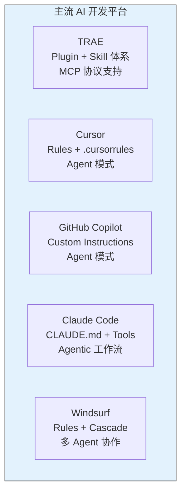
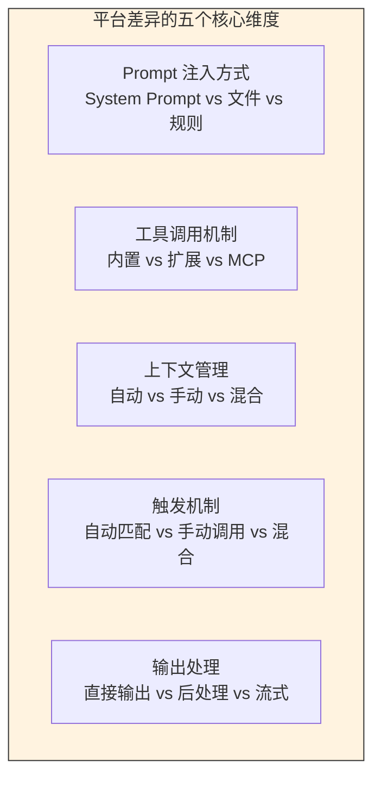
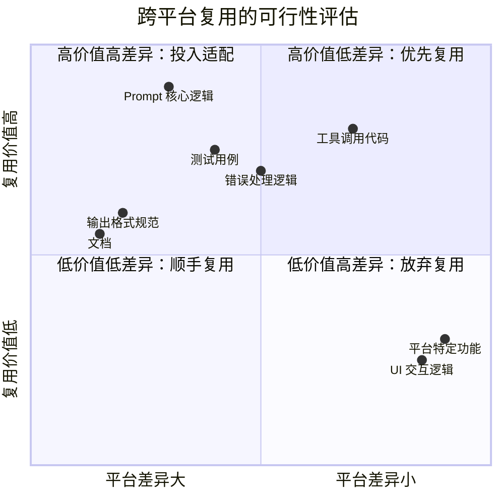
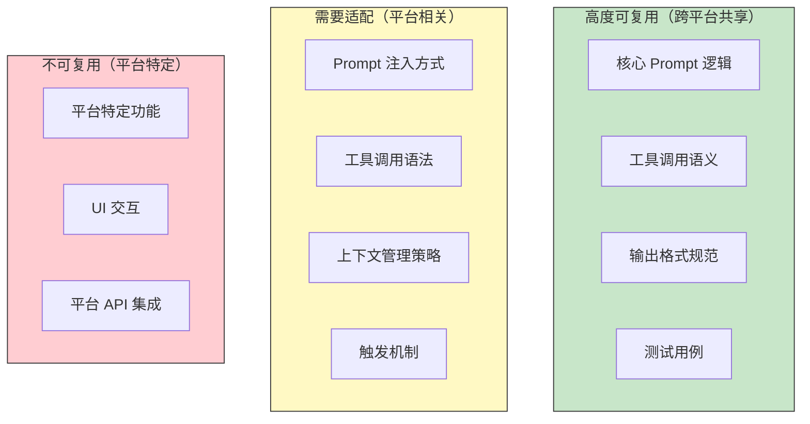
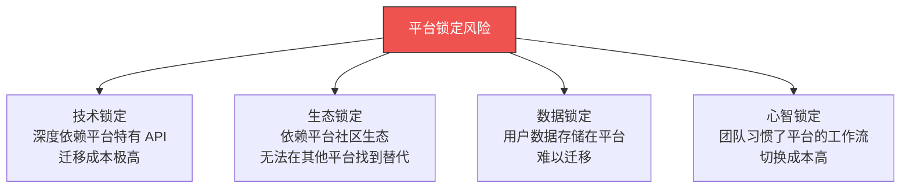
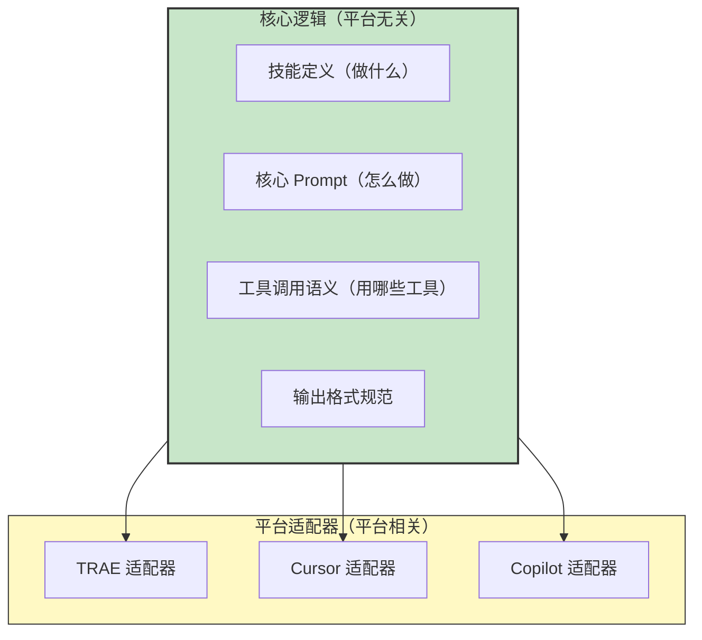
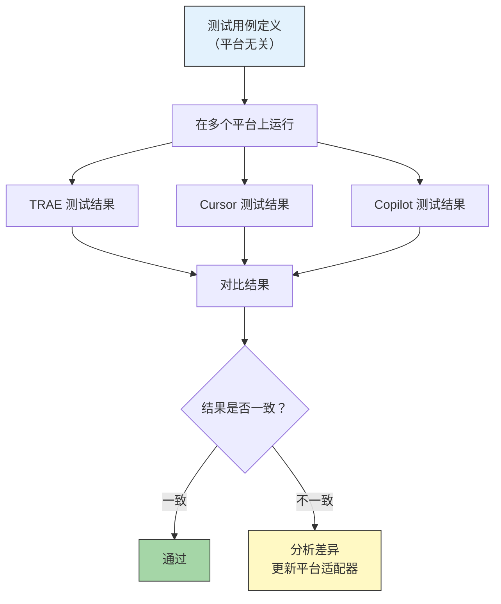
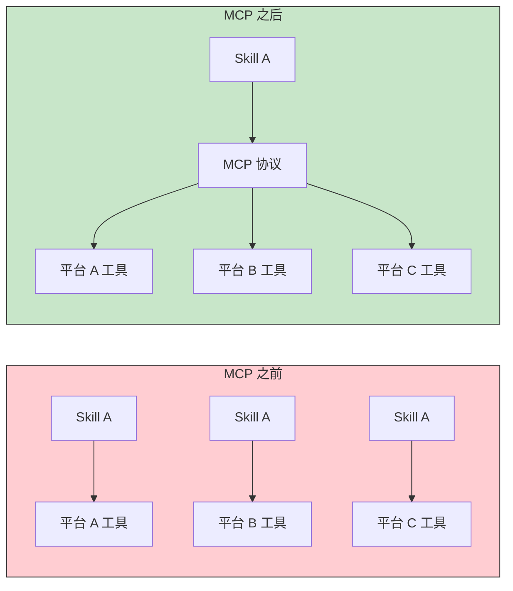
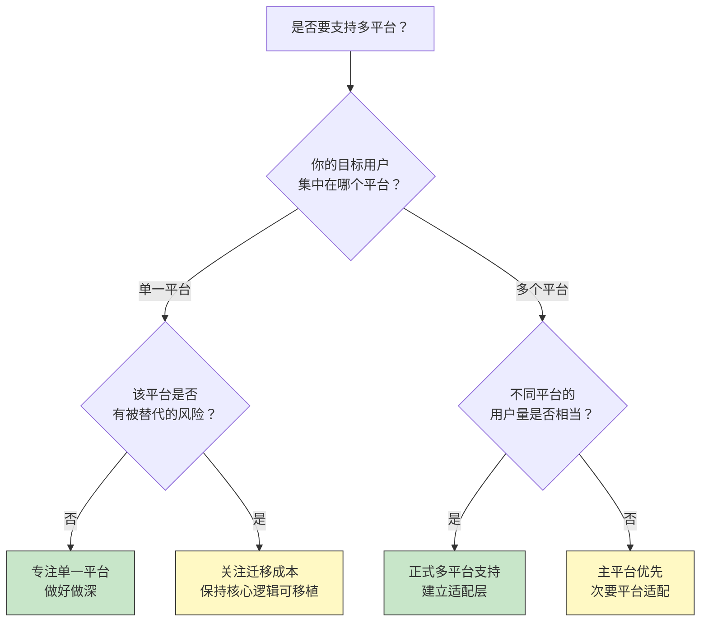

# 跨平台兼容性挑战

> [!note] 本文定位
> 不同的 AI 平台（Cursor、TRAE、Copilot、Claude Code 等）对 Skill 的定义和实现方式各不相同。本文探讨跨平台 Skill 开发的挑战、策略和最佳实践，帮助你在"一次编写，多处运行"的理想与"平台锁定"的现实之间找到平衡。

---

## 一、平台差异全景图

### 1.1 主流 AI 平台的 Skill 机制对比



| 维度 | TRAE | Cursor | Copilot | Claude Code | Windsurf |
|:---|:---|:---|:---|:---|:---|
| Skill 定义方式 | Plugin + Skill 文件 | .cursorrules | .github/copilot-instructions.md | CLAUDE.md | .windsurfrules |
| 工具调用 | 内置 + MCP | 内置 + 扩展 | 内置 + 扩展 | 内置 + MCP | 内置 + 扩展 |
| Prompt 组织 | System + User 分离 | 规则文件 | 指令文件 | 规则文件 | 规则文件 |
| 上下文管理 | 自动 | 自动 | 自动 | 自动 | 自动 |
| 版本管理 | 无内置 | 无内置 | 无内置 | 无内置 | 无内置 |
| 社区生态 | 成长中 | 成熟 | 成熟 | 成长中 | 成长中 |

### 1.2 平台差异的核心维度



---

## 二、"一次编写，多处运行"的可能性分析

### 2.1 可行性矩阵



### 2.2 分层复用策略



> [!important] 关键结论
> "一次编写，多处运行"对于 Skill 来说是**不现实的**。但 "核心逻辑复用 + 平台适配层" 是可行的。目标不是追求 100% 的代码复用，而是最大化核心逻辑的复用率。

---

## 三、平台锁定的风险与应对

### 3.1 平台锁定的风险模型



### 3.2 降低平台锁定的策略

| 策略 | 具体做法 | 成本 | 效果 |
|:---|:---|:---:|:---:|
| **抽象层** | 在 Skill 和平台之间加一层抽象 | 中 | 高 |
| **标准协议** | 使用 MCP 等标准协议 | 低 | 中 |
| **多平台测试** | 同时在至少 2 个平台上测试 | 中 | 高 |
| **文档化差异** | 明确记录平台特定的行为 | 低 | 中 |
| **渐进迁移** | 先在一个平台验证，再适配其他 | 低 | 中 |

### 3.3 抽象层的设计

```
# 平台抽象层示例

class SkillPlatform:
    """Skill 的平台抽象层"""

    def inject_prompt(self, prompt: str) -> None:
        """将 Prompt 注入到平台中"""
        raise NotImplementedError

    def call_tool(self, tool_name: str, params: dict) -> dict:
        """调用平台工具"""
        raise NotImplementedError

    def get_context(self) -> str:
        """获取当前上下文"""
        raise NotImplementedError

class TRAEPlatform(SkillPlatform):
    def inject_prompt(self, prompt: str) -> None:
        # TRAE 特定的 Prompt 注入方式
        pass

class CursorPlatform(SkillPlatform):
    def inject_prompt(self, prompt: str) -> None:
        # Cursor 特定的 Prompt 注入方式
        pass
```

---

## 四、跨平台 Skill 开发的最佳实践

### 4.1 核心逻辑与平台逻辑分离



### 4.2 目录结构建议

```
my-skill/
├── core/                    # 平台无关的核心逻辑
│   ├── skill-definition.md  # Skill 定义文档
│   ├── prompt-core.md       # 核心 Prompt 模板
│   ├── tools-schema.yaml    # 工具调用语义定义
│   └── output-schema.yaml   # 输出格式规范
├── platforms/               # 平台适配器
│   ├── trae/
│   │   ├── skill.yaml       # TRAE Skill 配置
│   │   └── prompt-adapter.md # TRAE 特定 Prompt 适配
│   ├── cursor/
│   │   ├── .cursorrules     # Cursor 规则文件
│   │   └── prompt-adapter.md
│   └── copilot/
│       └── instructions.md  # Copilot 指令文件
├── tests/                   # 测试用例
│   ├── test-cases.yaml      # 测试用例定义
│   └── expected-outputs/    # 期望输出
├── CHANGELOG.md             # 变更日志
└── README.md                # 说明文档
```

### 4.3 跨平台测试策略



---

## 五、跨平台开发中的常见陷阱

### 5.1 为每个平台写完全不同的 Skill

> [!warning] 陷阱
> 为 TRAE 写一个 Skill，为 Cursor 写一个 Skill，为 Copilot 写一个 Skill。三个 Skill 的核心逻辑相同，但维护成本是 3 倍。

**解决方案**：使用核心逻辑 + 平台适配器的模式，一个核心逻辑，多个适配器。

### 5.2 忽视平台能力差异

> [!warning] 陷阱
> 假设所有平台都有相同的能力。例如，在 TRAE 上使用了 MCP 工具，但 Copilot 不支持 MCP，导致 Skill 在 Copilot 上无法运行。

**解决方案**：在文档中明确标注 Skill 的平台依赖，在 Skill 中实现能力检测和降级。

### 5.3 同步延迟

> [!warning] 陷阱
> 核心逻辑修改后，忘记同步更新所有平台的适配器。导致不同平台上的 Skill 行为不一致。

**解决方案**：将核心逻辑的修改和平台适配器的更新放在同一个 PR 中，或者使用 CI 检查跨平台一致性。

### 5.4 过度抽象

> [!warning] 陷阱
> 为了追求跨平台兼容性，设计了过重的抽象层，导致 Skill 的开发和维护变得复杂。

**解决方案**：只在确实需要多平台支持时才引入抽象层。如果当前只支持一个平台，保持简单。

---

## 六、MCP 协议：跨平台的一线希望

### 6.1 MCP 的价值



> [!tip] MCP 的价值
> MCP（Model Context Protocol）提供了统一的工具调用协议，让 Skill 可以通过标准接口调用不同平台的工具。这大大降低了跨平台适配的复杂度。

### 6.2 MCP 的局限性

- **并非所有平台都支持 MCP**：目前 TRAE、Claude Code 等支持，但 Cursor、Copilot 等尚未全面支持
- **MCP 不等于零适配**：不同平台的 MCP 实现可能有差异
- **MCP 只解决工具调用问题**：Prompt 注入、触发机制等问题仍需平台适配

---

## 七、决策框架：要不要支持多平台？



---

## 八、关联阅读

- [[01-AI技术/Skill制作痛点/00_MOC_Skill制作痛点中枢]] — 返回知识库中枢
- [[01-AI技术/Skill制作痛点/01_Skill的本质与设计哲学]] — Skill 的底层设计哲学
- [[01-AI技术/Skill制作痛点/04_工具调用与编排的痛点]] — 工具调用的跨平台差异
- [[01-AI技术/Skill制作痛点/06_Skill的迭代与维护]] — 多平台 Skill 的版本同步
- [[01-AI技术/Skill制作痛点/08_案例：从0到1制作一个真实Skill]] — 端到端实战中的跨平台实践

---

## 九、总结

跨平台兼容性是 Skill 开发中最具挑战性的问题之一。核心要点：

1. **"一次编写，多处运行"不现实**：但"核心逻辑复用 + 平台适配层"是可行的
2. **分层复用**：核心 Prompt 逻辑高度可复用，工具调用需要适配，平台特定功能不可复用
3. **降低平台锁定**：使用抽象层、标准协议（MCP）、多平台测试
4. **按需决策**：不是所有 Skill 都需要多平台支持，根据用户分布和平台风险决策

> [!tip] 核心原则
> 跨平台支持是手段，不是目的。如果你的用户都在一个平台上，就不要为了"跨平台"而跨平台。保持核心逻辑的可移植性，在需要时再添加平台适配器。

---

*本文是 Skill 制作知识库的平台兼容性指南，建议与 [[01-AI技术/Skill制作痛点/04_工具调用与编排的痛点]] 和 [[01-AI技术/Skill制作痛点/06_Skill的迭代与维护]] 配套阅读。*