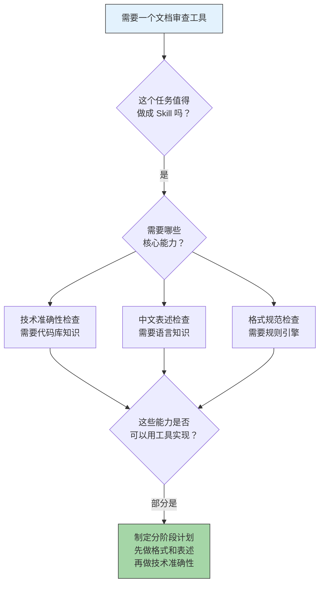
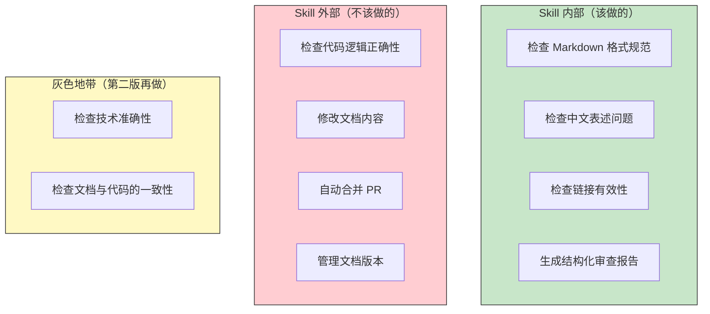
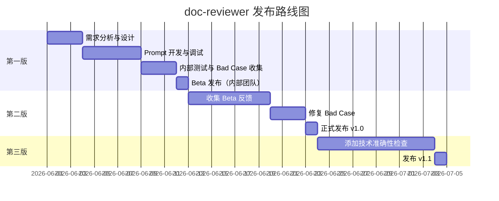
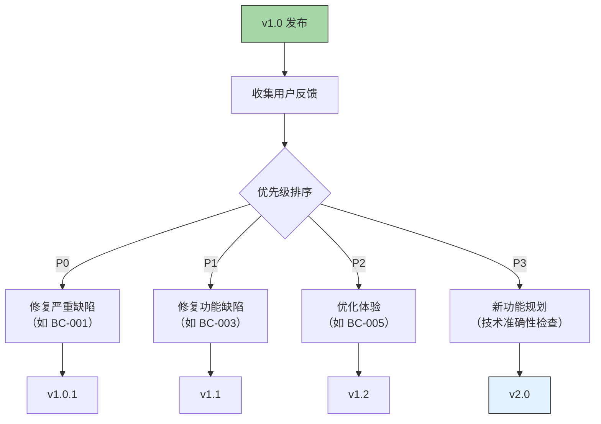

# 案例：从0到1制作一个真实 Skill

> [!note] 本文定位
> 本文通过一个完整的端到端案例，展示从需求分析、设计、开发、测试到发布的全流程。包含每个阶段的决策点分析和真实的踩坑记录。这个案例不是一个"理想化"的教程，而是真实还原了 Skill 制作过程中的纠结、试错和迭代。

---

## 一、案例背景

### 1.1 项目概述

**案例 Skill**：`doc-reviewer` —— 技术文档审查 Skill

**背景**：团队在维护一个开源项目的技术文档，每次 PR 中的文档变更都需要人工审查。审查内容包括：
- 技术准确性（API 参数名、类型、返回值是否正确）
- 中文表述问题（语法错误、用词不当、表达不清）
- 格式规范（Markdown 格式、链接有效性、代码块标注）
- 结构合理性（章节层级、内容组织）

**痛点**：人工审查耗时长（平均每篇 30 分钟），且不同审查者的标准不一致。

### 1.2 初始决策



> [!important] 决策点 1
> **问题**：是否要把"技术准确性"也纳入第一版？
> **决策**：推迟到第二版。因为技术准确性检查需要集成代码库分析工具，复杂度高，会显著延长第一版的交付时间。
> **教训**：**先交付价值，再完善能力**。不要试图在第一版就做到完美。

---

## 二、需求分析与场景定义

### 2.1 场景描述

参照 [[01-AI技术/Skill制作痛点/02_需求分析与场景定义]] 中的方法论，我们定义了以下核心场景：

**场景一：PR 中文档变更的自动审查**

```yaml
场景名称: "PR 文档变更自动审查"
用户画像:
  角色: 技术文档维护者
  技术背景: 熟悉 Markdown，了解项目技术栈
  使用频率: 每天 2-5 次

触发时机:
  触发方式: 在 PR 中 @mention Skill
  典型上下文: PR 包含 .md 文件变更

输入描述:
  必填输入: PR 的 diff 内容（自动获取）
  可选输入: 审查重点（默认：全部检查）
  输入约束: 只处理 .md 文件，单次不超过 10 个文件

处理流程:
  1. 解析 diff，提取变更的 .md 文件
  2. 逐文件进行格式规范检查
  3. 逐文件进行中文表述检查
  4. 汇总检查结果，按严重程度排序
  5. 生成审查报告

期望输出:
  输出格式: Markdown 格式的审查报告
  输出内容:
    - 问题列表（文件位置、类型、严重程度、建议）
    - 统计摘要（总问题数、按类型分布）
  输出时机: 1 分钟内完成

成功标准:
  - 格式检查覆盖率 > 95%
  - 表述检查覆盖率 > 70%
  - 误报率 < 15%
```

### 2.2 场景边界判断



> [!important] 决策点 2
> **问题**：要不要支持"自动修复"功能？
> **决策**：不做。自动修复文档内容风险太高，可能引入新的错误。Skill 只负责发现问题，修复由人工完成。
> **教训**：**明确 Skill 的职责边界**，不要越界做"看起来很酷但风险很高"的事情。

---

## 三、Prompt 设计

### 3.1 第一版 Prompt（踩坑版）

```
# 以下是我们踩过的坑——第一版 Prompt

你是一个文档审查助手，请检查文档中的问题。

检查内容：
- 格式问题
- 表述问题
- 其他问题

请给出审查报告。
```

> [!warning] 踩坑记录 1：Prompt 过于模糊
> **问题**：这个 Prompt 太模糊了。"格式问题"是什么？"表述问题"是什么？"其他问题"又是什么？AI 完全不知道具体要检查什么，结果是输出质量极不稳定。
> **教训**：Prompt 必须具体到"检查什么、怎么检查、输出什么格式"。参考 [[01-AI技术/Skill制作痛点/03_Prompt工程在Skill中的难点#1.3 歧义管理策略]]。

### 3.2 第二版 Prompt（迭代版）

```
# 第二版 Prompt —— 结构化、具体化

[角色定义]
你是一位资深的技术文档审查专家，精通 Markdown 规范、中文技术写作、
以及技术文档的质量标准。

[审查规则]
## 1. 格式规范检查
- 代码块是否标注了正确的语言类型（如 ```python）
- 标题层级是否连续（不应从 # 跳到 ###）
- 链接是否有效（检查 URL 格式）
- 表格格式是否正确（列对齐）
- 列表缩进是否一致

## 2. 中文表述检查
- 是否存在明显的语法错误
- 是否存在用词不当（如"的得地"混用）
- 是否存在表达不清或歧义
- 是否存在中英文混排时的空格问题
- 是否存在长句（超过 50 字且结构混乱）

[审查流程]
对于每个变更的 .md 文件：
1. 先进行格式规范检查
2. 再进行中文表述检查
3. 对每个问题，标注文件位置、行号、问题类型、严重程度

[输出格式]
```markdown
## 文档审查报告

### 审查概览
- 审查文件数：X
- 发现问题数：Y
- 严重问题：A
- 警告：B
- 建议：C

### 问题详情

#### [文件路径]

| 行号 | 严重程度 | 问题类型 | 问题描述 | 建议修复 |
|:---|:---|:---|:---|:---|
| ... | ... | ... | ... | ... |

### 审查结论
[总结性评价]
```

[边界条件]
- 如果文件内容为空，返回"文件为空，无需审查"
- 如果 diff 中不包含 .md 文件，返回"本次变更不涉及文档文件"
- 如果文件过大（> 5000 行），只审查前 5000 行并提示
- 不要修改文档内容，只给出审查意见
```

> [!tip] 踩坑记录 2：Prompt 结构化是关键
> **改进效果**：第二版 Prompt 的输出质量显著提升，格式检查准确率从约 60% 提升到约 90%。
> **关键改进**：明确了检查项、输出格式、边界条件。AI 不再需要"猜测"应该做什么。

### 3.3 第三版 Prompt（生产版）

在第二版的基础上，我们进一步优化了：

- 添加了 **Few-shot 示例**：在 Prompt 中加入了 2-3 个审查示例，帮助 AI 理解期望的输出风格
- 添加了 **负向指令**：明确告诉 AI "不要做什么"
- 添加了 **优先级规则**：当多个问题重叠时，应该优先报告哪个

```
[禁止行为]
- 不要在没有看到实际内容的情况下凭空猜测
- 不要在审查报告中添加主观评价（如"这段写得不好"）
- 不要修改文档内容（只审查不修改）
- 不要遗漏明显的问题（宁可多报也不要漏报）

[优先级规则]
当多个问题同时存在时，按以下优先级报告：
1. 严重问题（影响文档可读性或正确性）  > 警告（格式不规范） > 建议（优化建议）
2. 用户可见内容 > 元数据/注释
3. 新增内容 > 修改内容 > 未修改内容
```

---

## 四、测试与质量保障

### 4.1 测试用例设计

参照 [[01-AI技术/Skill制作痛点/05_Skill测试与质量保障]] 的方法论，我们设计了以下测试用例：

```yaml
测试用例集:
  - id: TC-001
    name: "正常 Markdown 文档审查"
    input: "sample_normal.md"
    expected:
      - "输出包含审查报告"
      - "问题按严重程度排序"
      - "每个问题标注了文件位置"

  - id: TC-002
    name: "包含多个格式问题的文档"
    input: "sample_broken_format.md"
    expected:
      - "至少识别出 8 个格式问题"
      - "误报数 < 2"

  - id: TC-003
    name: "包含中文表述问题的文档"
    input: "sample_broken_chinese.md"
    expected:
      - "至少识别出 5 个表述问题"
      - "误报数 < 3"

  - id: TC-004
    name: "空文件审查"
    input: "sample_empty.md"
    expected:
      - "返回'文件为空，无需审查'"

  - id: TC-005
    name: "超大文件审查"
    input: "sample_large.md"  # 8000 行
    expected:
      - "只审查前 5000 行"
      - "提示用户文件过大"

  - id: TC-006
    name: "不包含文档变更的 PR"
    input: "sample_no_doc.diff"
    expected:
      - "返回'本次变更不涉及文档文件'"
```

### 4.2 Bad Case 收集

> [!important] 踩坑记录 3：Bad Case 比测试用例更重要
> 我们在第一轮测试中写了 20 个测试用例，全部通过。但上线后第一天就收到了 5 个 bad case 反馈。这告诉我们：**测试用例永远无法覆盖真实世界的所有情况**。

**收集到的 Bad Case 示例**：

| Bad Case | 描述 | 根因 | 修复 |
|:---|:---|:---|:---|
| BC-001 | 将代码块中的中文也当作文档内容检查 | Prompt 未区分代码块和正文 | 添加"跳过代码块中的内容"规则 |
| BC-002 | 对英文文档中的中文术语误报"表述问题" | 未考虑中英混合场景 | 添加中英混合场景的特殊处理 |
| BC-003 | 审查报告过长，用户难以阅读 | 输出格式无长度限制 | 添加"问题超过 20 个时分页输出"规则 |
| BC-004 | 将正确的专业术语标记为"用词不当" | 缺少领域术语白名单 | 添加可配置的术语白名单 |
| BC-005 | 对 YAML frontmatter 也进行格式检查 | 未排除元数据区域 | 添加"跳过 frontmatter"规则 |

---

## 五、发布与迭代

### 5.1 发布策略



### 5.2 迭代决策



> [!important] 决策点 3
> **问题**：技术准确性检查（v2.0）要不要和 bug 修复并行开发？
> **决策**：先集中精力修复 bug（v1.0.1 → v1.2），等技术债务清理干净后再启动 v2.0。
> **教训**：**不要在破旧的地基上盖新楼**。先修好已有的问题，再添加新功能。

---

## 六、踩坑全集

### 6.1 设计阶段的坑

| 序号 | 坑 | 后果 | 教训 |
|:---:|:---|:---|:---|
| 1 | 一开始就想要"完美"的 Skill | 设计阶段花了 2 周，迟迟无法进入开发 | 先做 MVP，快速验证 |
| 2 | 没有定义清晰的输出格式 | AI 每次输出格式不同，用户困惑 | 必须定义严格的输出 Schema |
| 3 | 忽视了边界场景 | 上线后遇到空文件、超大文件等边界情况时崩溃 | 设计阶段就要考虑边界场景 |

### 6.2 开发阶段的坑

| 序号 | 坑 | 后果 | 教训 |
|:---:|:---|:---|:---|
| 4 | 在一个 Prompt 中塞了太多规则 | AI 经常遗漏某些检查项 | 规则过多时考虑分组或拆分 |
| 5 | 没有写 Few-shot 示例 | AI 的输出风格不稳定 | 至少 2-3 个 Few-shot 示例 |
| 6 | 修改 Prompt 后没有回归测试 | 修复了 A 问题，引入了 B 问题 | 每次修改都跑全量回归测试 |

### 6.3 发布阶段的坑

| 序号 | 坑 | 后果 | 教训 |
|:---:|:---|:---|:---|
| 7 | 没有设置版本号 | 用户不知道 Skill 是否更新了 | 从第一天就使用语义化版本 |
| 8 | 没有写用户文档 | 用户不知道怎么使用 Skill | 文档和 Skill 同步发布 |
| 9 | 没有收集反馈的渠道 | 不知道 Skill 在真实使用中的表现 | 建立反馈收集机制 |

### 6.4 维护阶段的坑

| 序号 | 坑 | 后果 | 教训 |
|:---:|:---|:---|:---|
| 10 | 修改 Prompt 后没有更新 CHANGELOG | 团队不知道改了什么 | 每次变更都更新 CHANGELOG |
| 11 | 测试用例没有随 Skill 一起演进 | 测试用例逐渐失效 | 定期审查和更新测试用例 |
| 12 | 忽视了用户的使用习惯 | 修改行为后老用户不适应 | 重大变更前通知用户 |

---

## 七、关键数据

### 7.1 质量指标变化


### 7.2 投入产出分析

| 阶段 | 投入时间 | 主要产出 | 经验教训 |
|:---|:---:|:---|:---|
| 需求分析与设计 | 3 天 | 场景定义、边界判断 | 花在需求上的时间是最值得的 |
| Prompt 开发 | 5 天 | 3 版 Prompt 迭代 | 第一版注定不完美，快速迭代是关键 |
| 测试与 Bad Case | 3 天 | 20 个测试用例 | Bad Case 比测试用例更有价值 |
| Beta 反馈收集 | 7 天 | 15 个 Bad Case | 真实用户是最好的测试者 |
| 持续迭代 | 持续 | 5 次版本迭代 | 维护是长期投入 |

---

## 八、关联阅读

- [[01-AI技术/Skill制作痛点/00_MOC_Skill制作痛点中枢]] — 返回知识库中枢
- [[01-AI技术/Skill制作痛点/01_Skill的本质与设计哲学]] — 本案例中的设计决策依据
- [[01-AI技术/Skill制作痛点/02_需求分析与场景定义]] — 本案例中的场景定义方法
- [[01-AI技术/Skill制作痛点/03_Prompt工程在Skill中的难点]] — 本案例中的 Prompt 迭代过程
- [[01-AI技术/Skill制作痛点/04_工具调用与编排的痛点]] — 本案例中的工具调用策略
- [[01-AI技术/Skill制作痛点/05_Skill测试与质量保障]] — 本案例中的测试实践
- [[01-AI技术/Skill制作痛点/06_Skill的迭代与维护]] — 本案例中的迭代策略
- [[01-AI技术/Skill制作痛点/07_跨平台兼容性挑战]] — 本案例中未涉及的跨平台问题

---

## 九、总结

这个案例完整展示了从 0 到 1 制作一个真实 Skill 的全过程。核心经验：

1. **先交付价值，再完善能力**：第一版只做格式和表述检查，技术准确性留给第二版
2. **Prompt 需要结构化**：模糊的 Prompt 是 Skill 质量不稳定的根本原因
3. **Bad Case 比测试用例更有价值**：真实用户的反馈是最宝贵的测试数据
4. **先修 bug，再添功能**：不要在破旧的地基上盖新楼
5. **维护是长期投入**：Skill 不是一次性交付，而是持续演进的产品

> [!tip] 最后的建议
> 制作 Skill 最难的从来不是技术，而是**决策**——做什么、不做什么、什么时候做、做到什么程度。希望这个案例能帮你建立自己的决策框架。

---

*本文是 Skill 制作知识库的实战案例，建议在阅读完其他文档后，作为综合参考阅读。*