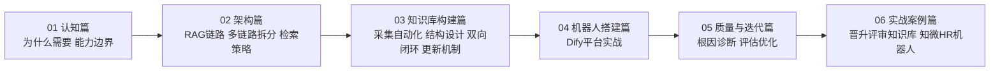

# 企业知识库与RAG问答机器人中枢

> [!key] 本库定位
> 从零到一搭建企业知识库问答机器人的实战手册。素材来自滴滴出行两个真实项目：晋升评审知识库机器人与知微HR制度问答机器人。全库贯穿一条主线——把分散的文档、视频、制度，变成可检索、可问答、可迭代的公共资产。

> [!important] 深化路线图
> 想知道"这个知识库下一步往哪走"，先读 [[01-AI技术/企业知识库与RAG问答机器人/00_深化路线图|深化路线图]]——五级台阶：决策助手 → 多轮澄清 → 自动评估闭环 → 全职能复制 → 主动推送。

## 六大模块全景

## 阅读指南

| 你的状态 | 建议阅读 | 目的 |
|:---|:---|:---|
| 刚接触，判断值不值得做 | 01-认知篇 | 明确场景与边界 |
| 确定要做，正在设计 | 02-架构篇 → 03-知识库构建篇 | 架构与知识库并行 |
| 知识库就绪，接机器人 | 04-机器人搭建篇 → 05-质量与迭代篇 | 上线与持续优化 |
| 想看完整落地过程 | 06-实战案例篇 | 从场景到方法论的还原 |

## 关键原则

> [!tip] 关键原则
> 1. **检索质量决定回答质量** — 答案的上限由检索片段决定，检索命中率上台阶，回答可信度跟着上台阶。
> 2. **单一职责链路** — 一条LLM链路只干一件事，功能多了就拆。见[[01-AI技术/企业知识库与RAG问答机器人/02-架构篇/02_多LLM链路架构：从单链路到按功能拆分|多LLM链路架构]]。
> 3. **知识库结构决定上限** — 场景层、词表层、制度层各归各位。见[[01-AI技术/企业知识库与RAG问答机器人/03-知识库构建篇/03_双向闭环映射法|双向闭环映射法]]。
> 4. **评估先行** — 每个迭代都带评测集，用数据说话，不靠感觉。
> 5. **棘轮式迭代** — 每轮只改一处，可回退可对比，只进不退。

## 各模块入口

- 01-认知篇：[[01-AI技术/企业知识库与RAG问答机器人/01-认知篇/01_为什么企业需要知识库机器人|为什么企业需要知识库机器人]] · [[01-AI技术/企业知识库与RAG问答机器人/01-认知篇/02_知识库机器人的能力边界与适用场景|能力边界与适用场景]]
- 02-架构篇：[[01-AI技术/企业知识库与RAG问答机器人/02-架构篇/01_RAG全链路架构|RAG全链路架构]] · [[01-AI技术/企业知识库与RAG问答机器人/02-架构篇/02_多LLM链路架构：从单链路到按功能拆分|多LLM链路架构]] · [[01-AI技术/企业知识库与RAG问答机器人/02-架构篇/03_检索策略：关键词向量与混合检索的取舍|检索策略]]
- 03-知识库构建篇：[[01-AI技术/企业知识库与RAG问答机器人/03-知识库构建篇/01_文档采集自动化|文档采集自动化]] · [[01-AI技术/企业知识库与RAG问答机器人/03-知识库构建篇/02_知识库结构设计|知识库结构设计]] · [[01-AI技术/企业知识库与RAG问答机器人/03-知识库构建篇/03_双向闭环映射法|双向闭环映射法]] · [[01-AI技术/企业知识库与RAG问答机器人/03-知识库构建篇/04_知识更新机制|知识更新机制]]
- 04-机器人搭建篇：[[01-AI技术/企业知识库与RAG问答机器人/04-机器人搭建篇/01_Dify平台实战|Dify平台实战]]
- 05-质量与迭代篇：[[01-AI技术/企业知识库与RAG问答机器人/05-质量与迭代篇/01_准确率下降的根因诊断|准确率下降的根因诊断]]
- 06-实战案例篇：[[01-AI技术/企业知识库与RAG问答机器人/06-实战案例篇/01_案例_晋升评审知识库与机器人|晋升评审知识库与机器人]] · [[01-AI技术/企业知识库与RAG问答机器人/06-实战案例篇/02_案例_知微HR制度问答机器人|知微HR制度问答机器人]]

## 关联知识库

- [[01-AI技术/AI Agent开发实战/00_MOC_AI Agent开发实战中枢|AI Agent开发实战]] — 机器人背后的Agent能力体系
- [[06-数据分析/AI数据分析/00_MOC_AI数据分析中枢|AI数据分析]] · [[06-数据分析/AI数据分析/15_方法_RAG在数据分析中的应用|RAG方法论]] — RAG的跨域应用
- [[01-AI技术/LOOP Engineering/00_MOC_LOOP_Engineering中枢|LOOP Engineering]] — 链路拆分与可验证环节的底层思想
- [[01-AI技术/Skill制作痛点/00_MOC_Skill制作痛点中枢|Skill制作痛点]] — 把方法论固化成可复用技能
- [[01-AI技术/超长项目AI跑/00_MOC_超长项目AI跑中枢|超长项目AI跑]] — 大项目拆解与上下文管理
