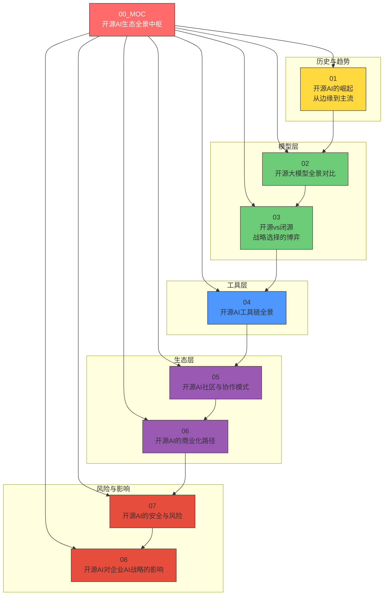
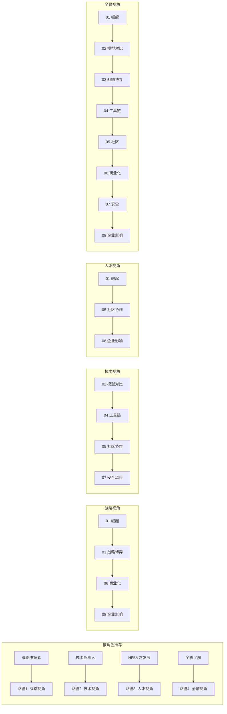
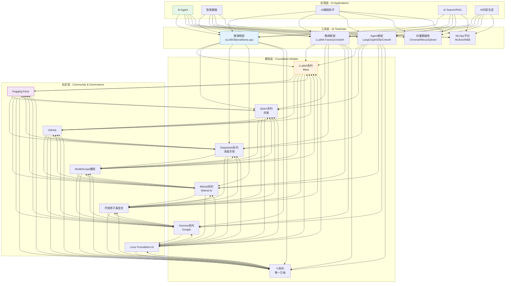
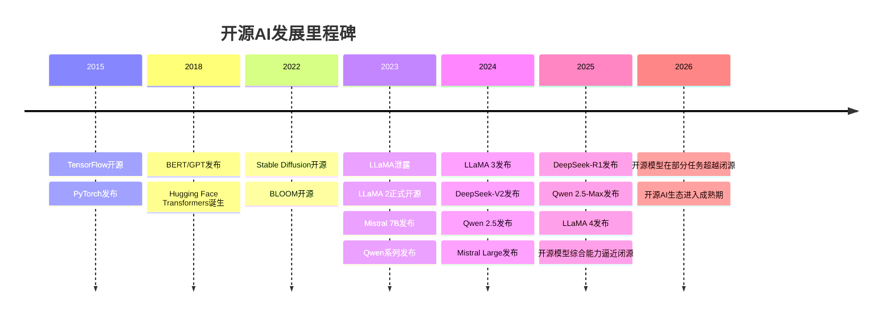
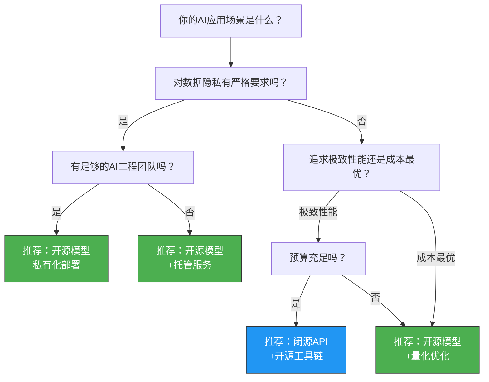
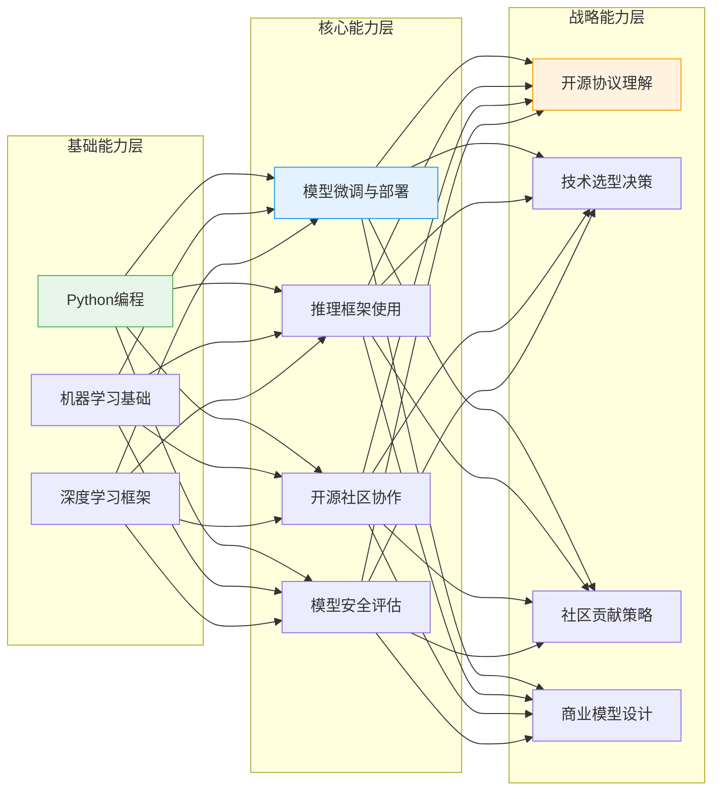
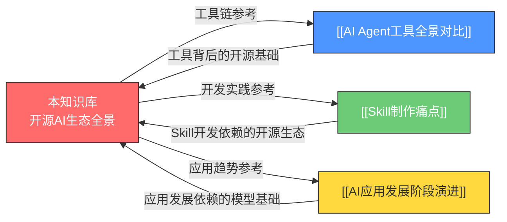

# 开源AI生态全景中枢

> [!abstract] 知识库定位
> 本知识库以 **"战略 + HR + AI"** 三重视角，系统梳理开源AI的生态全景——从模型层到工具层再到社区层，构建一幅完整的开源AI世界地图。核心关注点：开源AI如何降低AI应用门槛、如何影响企业AI战略决策、以及开源生态对AI人才市场的重塑。

---

## 一、为什么需要这个知识库？

### 1.1 背景与动机

2023年以来，开源AI领域发生了一系列地震级事件：LLaMA的泄露与正式开源、DeepSeek-V3以极低成本逼近闭源顶级模型、Qwen系列持续迭代并覆盖全尺寸。这些事件从根本上改变了AI产业的竞争格局。

然而，在企业决策层面，关于开源AI的认知仍然碎片化：

- **技术团队** 关注模型性能和工具链，但缺乏商业视角
- **战略层** 关注成本和风险，但难以评估开源生态的深度
- **HR团队** 急需理解开源AI对人才需求的冲击，却缺乏系统性的知识框架

本知识库正是为了弥合这一鸿沟而创建。

### 1.2 与已有知识库的差异化定位

| 已有知识库 | 聚焦领域 | 本知识库的差异化 |
|:---|:---|:---|
| [[01-AI技术/AI Agent 工具/AI_Agent_工具全景对比]] | AI开发工具的能力对比 | 聚焦**开源AI的模型层和生态层**，不重复工具对比 |
| [[01-AI技术/Skill制作痛点/00_MOC_Skill制作痛点中枢]] | Skill开发的实践问题 | 聚焦**开源AI基础设施**，不涉及Skill具体开发 |
| [[02-AI趋势与素养/AI应用发展阶段演进/00_MOC_AI应用发展阶段演进中枢]] | AI应用的发展趋势 | 聚焦**开源AI的基础层面**，补充应用层之外的基础设施视角 |

> [!tip] 阅读建议
> 如果你对AI Agent工具选型感兴趣，请参考 [[01-AI技术/AI Agent 工具/AI_Agent_工具全景对比]]；如果你关注Skill开发实践，请参考 [[01-AI技术/Skill制作痛点/00_MOC_Skill制作痛点中枢]]。本知识库关注的是这些工具和应用 **背后的开源生态基础设施**。

---

## 二、知识库结构总览

### 2.1 知识架构图

### 2.2 阅读路径建议

根据你的角色和需求，推荐以下阅读路径：

---

## 三、核心概念地图

### 3.1 开源AI生态的三层架构

### 3.2 开源AI的时间线

---

## 四、文档导航

### 4.1 文档清单与快速索引

| 编号 | 文档标题 | 核心主题 | 关键问题 |
|:---|:---|:---|:---|
| 01 | [[01-AI技术/开源AI生态全景/01_开源AI的崛起：从边缘到主流]] | 开源AI历史与驱动力 | 开源AI为什么能崛起？ |
| 02 | [[01-AI技术/开源AI生态全景/02_开源大模型全景对比]] | 模型能力与定位 | 哪个开源模型最适合我的场景？ |
| 03 | [[01-AI技术/开源AI生态全景/03_开源vs闭源：战略选择的博弈]] | 战略决策框架 | 企业应该选择开源还是闭源？ |
| 04 | [[01-AI技术/开源AI生态全景/04_开源AI工具链全景]] | 开源工具生态 | 开源工具链如何搭建？ |
| 05 | [[01-AI技术/开源AI生态全景/05_开源AI社区与协作模式]] | 社区运作机制 | 如何参与开源AI社区？ |
| 06 | [[01-AI技术/开源AI生态全景/06_开源AI的商业化路径]] | 商业模式分析 | 开源AI如何赚钱？ |
| 07 | [[01-AI技术/开源AI生态全景/07_开源AI的安全与风险]] | 风险识别与管理 | 开源AI有哪些风险？ |
| 08 | [[01-AI技术/开源AI生态全景/08_开源AI对企业AI战略的影响]] | 企业战略与人才 | 开源AI如何影响企业决策和人才需求？ |

### 4.2 各文档详细说明

#### [[01-AI技术/开源AI生态全景/01_开源AI的崛起：从边缘到主流]]

> [!info] 核心内容
> 追溯开源AI从2015年TensorFlow/PyTorch到2025年开源模型全面追赶闭源的历史轨迹。分析LLaMA泄露事件如何成为开源AI的历史转折点，以及学术界需求、开发者生态、成本优势、数据隐私四大核心驱动力如何共同推动开源AI从边缘走向主流。

**关键里程碑**：
- 2015年：TensorFlow开源，PyTorch发布
- 2022年：Stable Diffusion开源点燃生成式AI热情
- 2023年：LLaMA泄露事件，Meta正式开源LLaMA 2
- 2024年：开源模型全面逼近GPT-4水平
- 2025年：DeepSeek-R1以极低成本实现顶级推理能力

#### [[01-AI技术/开源AI生态全景/02_开源大模型全景对比]]

> [!info] 核心内容
> 系统对比六大开源模型家族：LLaMA（Meta）、Qwen（阿里）、DeepSeek（深度求索）、Mistral（Mistral AI）、Gemma（Google）、Yi（零一万物）。从模型架构、性能基准、开源协议、适用场景、社区生态等维度进行全面对比，为企业选型提供决策依据。

**对比维度**：模型参数规模 | 性能基准 | 开源协议 | 语言支持 | 多模态能力 | 推理效率 | 社区活跃度 | 商用友好度

#### [[01-AI技术/开源AI生态全景/03_开源vs闭源：战略选择的博弈]]

> [!info] 核心内容
> 深入分析开源AI与闭源AI的战略博弈。对比Meta的"开源武器化"战略、OpenAI的"闭源商业化"路径、阿里的"开源+云"双轮驱动模式。提供不同企业场景下的选择框架：预算敏感型、数据隐私敏感型、极致性能追求型、快速上市型。

**关键分析框架**：
- 开源优势：成本可控、数据隐私、技术自主、社区创新
- 闭源优势：开箱即用、极致性能、安全保障、商业服务
- 混合策略：核心模型闭源+生态工具开源

#### [[01-AI技术/开源AI生态全景/04_开源AI工具链全景]]

> [!info] 核心内容
> 全景式梳理开源AI工具链的五大关键领域：推理框架（vLLM/Ollama/llama.cpp）、微调框架（LLaMA-Factory/Unsloth）、Agent框架（LangGraph/AutoGen/CrewAI/Dify）、向量数据库（Chroma/Milvus/Qdrant）、评估框架。**注意**：本部分聚焦工具链基础设施，不重复 [[01-AI技术/AI Agent 工具/AI_Agent_工具全景对比]] 中的Agent应用对比内容。

#### [[01-AI技术/开源AI生态全景/05_开源AI社区与协作模式]]

> [!info] 核心内容
> 剖析Hugging Face作为开源AI"GitHub"的生态地位，分析GitHub上AI开源项目的增长态势和协作模式。探讨开源AI的五种治理模型：BDFL（仁慈独裁者）、委员会制、基金会制、企业主导、社区驱动。帮助理解如何有效参与开源AI社区。

#### [[01-AI技术/开源AI生态全景/06_开源AI的商业化路径]]

> [!info] 核心内容
> 梳理开源AI的五种商业模式：托管服务（Hugging Face Inference API）、开源核心+企业版（GitLab模式）、咨询与服务、云厂商"开源+云"（阿里云模式）、生态平台（Hugging Face模式）。分析成功案例（Mistral AI、Hugging Face）与失败教训。

#### [[01-AI技术/开源AI生态全景/07_开源AI的安全与风险]]

> [!info] 核心内容
> 识别开源AI面临的三类核心风险：模型安全风险（越狱/有害内容生成）、滥用风险（深度伪造/诈骗）、监管合规风险（开源模型能否被有效监管）。提供风险管理框架，帮助企业在享受开源红利的同时控制风险敞口。

#### [[01-AI技术/开源AI生态全景/08_开源AI对企业AI战略的影响]]

> [!info] 核心内容
> 从企业战略和HR双重视角，分析开源AI如何降低企业AI应用门槛、如何制定开源vs闭源的选择策略、如何参与开源AI社区以获取战略价值。**HR视角专章**：开源AI生态对人才需求结构的重塑——企业需要什么样的AI人才？开源社区参与经验在招聘中的价值评估。

---

## 五、关键概念索引

### 5.1 核心术语

| 术语 | 解释 | 相关文档 |
|:---|:---|:---|
| **开源AI** | 模型权重、代码、训练数据全部或部分公开的AI系统 | [[01-AI技术/开源AI生态全景/01_开源AI的崛起：从边缘到主流]] |
| **开源协议** | 定义模型使用、修改、分发规则的法律文本（如Apache 2.0、MIT、LLaMA Community License） | [[01-AI技术/开源AI生态全景/02_开源大模型全景对比]] |
| **模型蒸馏** | 将大模型的能力迁移到小模型的技术，是开源AI生态的关键技术 | [[01-AI技术/开源AI生态全景/02_开源大模型全景对比]] |
| **推理框架** | 用于高效运行大语言模型的软件框架（vLLM、Ollama等） | [[01-AI技术/开源AI生态全景/04_开源AI工具链全景]] |
| **LoRA/QLoRA** | 参数高效微调技术，使个人开发者也能微调大模型 | [[01-AI技术/开源AI生态全景/04_开源AI工具链全景]] |
| **Hugging Face** | 开源AI的"GitHub"，模型托管和社区协作的核心平台 | [[01-AI技术/开源AI生态全景/05_开源AI社区与协作模式]] |
| **BDFL** | Benevolent Dictator For Life，开源项目治理的一种模式 | [[01-AI技术/开源AI生态全景/05_开源AI社区与协作模式]] |
| **开源核心模式** | Open Core，核心功能开源+企业功能付费的商业模式 | [[01-AI技术/开源AI生态全景/06_开源AI的商业化路径]] |
| **越狱攻击** | 通过精心设计的提示词绕过模型安全限制 | [[01-AI技术/开源AI生态全景/07_开源AI的安全与风险]] |
| **AI人才三角** | 算法能力+工程能力+领域知识的复合型人才需求 | [[01-AI技术/开源AI生态全景/08_开源AI对企业AI战略的影响]] |

### 5.2 关键人物与组织

| 人物/组织 | 角色 | 相关文档 |
|:---|:---|:---|
| **Yann LeCun** | Meta首席AI科学家，开源AI的坚定倡导者 | [[01-AI技术/开源AI生态全景/01_开源AI的崛起：从边缘到主流]] |
| **Meta AI** | 开源AI的领军者，LLaMA系列模型的发布者 | [[01-AI技术/开源AI生态全景/02_开源大模型全景对比]] |
| **深度求索** | DeepSeek系列模型的开发团队，以极低成本实现顶级性能 | [[01-AI技术/开源AI生态全景/02_开源大模型全景对比]] |
| **Mistral AI** | 欧洲开源AI的代表，以高效模型著称 | [[01-AI技术/开源AI生态全景/02_开源大模型全景对比]] |
| **Hugging Face** | 开源AI生态的核心平台，模型托管+社区协作 | [[01-AI技术/开源AI生态全景/05_开源AI社区与协作模式]] |
| **阿里云** | "开源+云"双轮驱动模式的代表 | [[01-AI技术/开源AI生态全景/03_开源vs闭源：战略选择的博弈]] |

---

## 六、战略框架速览

### 6.1 企业开源AI决策框架

### 6.2 开源AI人才能力模型

> 详见 [[01-AI技术/开源AI生态全景/08_开源AI对企业AI战略的影响]]

---

## 七、跨知识库链接网络

### 7.1 与已有知识库的关联

### 7.2 关联阅读建议

| 场景 | 推荐阅读路径 |
|:---|:---|
| 想全面了解AI Agent工具 | [[01-AI技术/AI Agent 工具/AI_Agent_工具全景对比]] -> [[01-AI技术/开源AI生态全景/04_开源AI工具链全景]] |
| 想开发Skill但遇到问题 | [[01-AI技术/Skill制作痛点/00_MOC_Skill制作痛点中枢]] -> [[01-AI技术/开源AI生态全景/04_开源AI工具链全景]] -> [[01-AI技术/开源AI生态全景/05_开源AI社区与协作模式]] |
| 想了解AI应用发展趋势 | [[02-AI趋势与素养/AI应用发展阶段演进/00_MOC_AI应用发展阶段演进中枢]] -> [[01-AI技术/开源AI生态全景/01_开源AI的崛起：从边缘到主流]] -> [[01-AI技术/开源AI生态全景/08_开源AI对企业AI战略的影响]] |
| 企业AI战略规划 | [[01-AI技术/开源AI生态全景/03_开源vs闭源：战略选择的博弈]] -> [[01-AI技术/开源AI生态全景/06_开源AI的商业化路径]] -> [[01-AI技术/开源AI生态全景/08_开源AI对企业AI战略的影响]] |
| AI人才招聘与培养 | [[01-AI技术/开源AI生态全景/08_开源AI对企业AI战略的影响]] -> [[01-AI技术/开源AI生态全景/05_开源AI社区与协作模式]] |

---

## 八、维护与更新

### 8.1 更新机制

> [!warning] 注意
> 开源AI领域发展极快，模型版本迭代以月为单位。本知识库需要定期更新以保持时效性。

| 更新频率 | 更新内容 | 负责角色 |
|:---|:---|:---|
| 月度 | 新增模型发布、版本更新 | 技术团队 |
| 季度 | 战略分析、商业化案例更新 | 战略团队 |
| 半年度 | 人才市场分析、社区生态变化 | HR团队 |

### 8.2 贡献指南

- **新增内容**：在相关文档中追加章节，使用 `##` 标题
- **修正错误**：直接在原文修改，使用 `> [!note]` 标注修改记录
- **跨文档链接**：使用 `[[文档名]]` 格式确保双向链接有效
- **图表更新**：Mermaid代码可直接修改，如需复杂图表可替换为图片

### 8.3 版本历史

| 版本 | 日期 | 变更内容 |
|:---|:---|:---|
| v1.0 | 2026-07-27 | 初始版本，包含MOC + 8篇核心文档 |

---

## 九、快速入口

### 9.1 按场景快速导航

> [!question] 我该从哪里开始？

- **我想了解开源AI能做什么** --> [[01-AI技术/开源AI生态全景/01_开源AI的崛起：从边缘到主流]]
- **我想选一个开源大模型** --> [[01-AI技术/开源AI生态全景/02_开源大模型全景对比]]
- **我在纠结开源还是闭源** --> [[01-AI技术/开源AI生态全景/03_开源vs闭源：战略选择的博弈]]
- **我想搭建开源AI工具链** --> [[01-AI技术/开源AI生态全景/04_开源AI工具链全景]]
- **我想参与开源AI社区** --> [[01-AI技术/开源AI生态全景/05_开源AI社区与协作模式]]
- **我想知道开源AI怎么赚钱** --> [[01-AI技术/开源AI生态全景/06_开源AI的商业化路径]]
- **我担心开源AI的安全问题** --> [[01-AI技术/开源AI生态全景/07_开源AI的安全与风险]]
- **我在做企业AI战略规划** --> [[01-AI技术/开源AI生态全景/08_开源AI对企业AI战略的影响]]

### 9.2 核心结论速览

> [!summary] 本知识库的10个核心结论
>
> 1. **开源AI已从边缘走向主流**：2025年，开源模型在多个基准测试中已接近甚至超越闭源模型
> 2. **开源不等于免费**：开源AI的真正价值在于技术自主、数据隐私和社区创新
> 3. **DeepSeek是开源AI的"GPT时刻"**：以极低成本实现顶级推理能力，证明了开源路径的可行性
> 4. **"开源+云"是主流商业模式**：阿里云、Hugging Face证明了这一路径的可行性
> 5. **工具链是开源AI的隐性护城河**：vLLM/Ollama等推理框架的成熟度直接决定开源模型的可用性
> 6. **Hugging Face是开源AI的"GitHub"**：掌握了模型分发和社区协作的核心入口
> 7. **开源AI安全是可管理的**：通过评估框架、安全对齐和社区审查，开源模型的安全风险可控
> 8. **企业需要"开源AI战略"**：不是选不选开源的问题，而是如何将开源融入AI战略
> 9. **AI人才需求正在重构**：开源社区贡献经验正在成为比学历更重要的招聘指标
> 10. **混合策略是大多数企业的最优解**：核心业务用闭源API确保稳定性，探索性业务用开源模型保持灵活性

---

## 十、外部资源

### 10.1 推荐阅读

- Hugging Face Daily Papers: https://huggingface.co/papers
- The Batch by Andrew Ng: https://www.deeplearning.ai/the-batch/
- 开源AI基金会（Open Source AI Foundation）
- 中国信通院《开源大模型发展白皮书》

### 10.2 关键数据源

- Hugging Face Open LLM Leaderboard
- GitHub Octoverse Report
- Stanford HAI AI Index Report
- 中国人工智能开源软件发展联盟

---

> [!quote] 关于开源AI的未来
> "开源AI不是闭源AI的替代品，而是AI产业健康发展的必要条件。就像Linux之于云计算，开源AI将成为AI基础设施的默认选择。" —— 本知识库观点

---

*最后更新：2026-07-27*
*版本：v1.0*