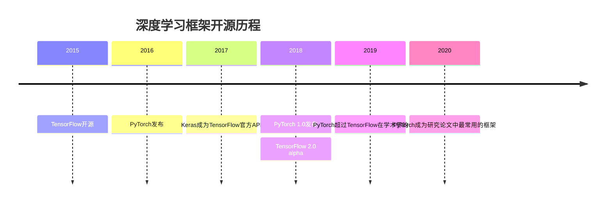
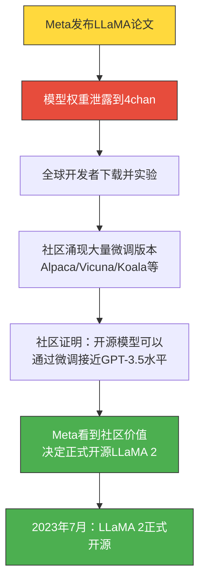
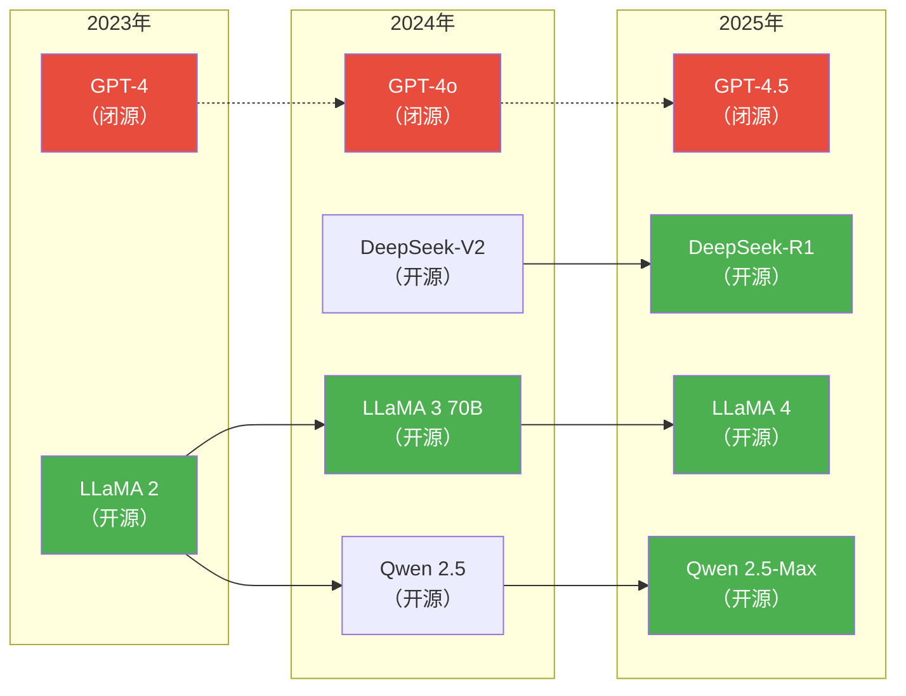
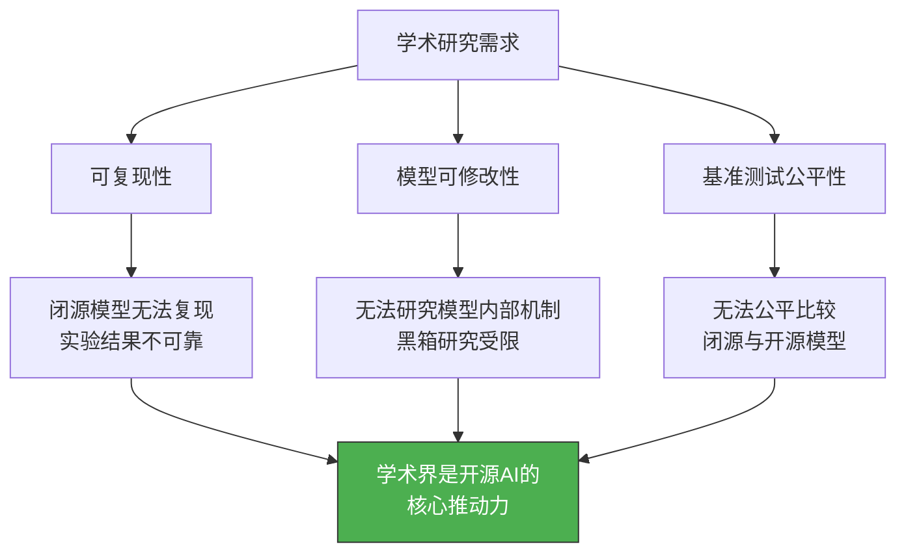
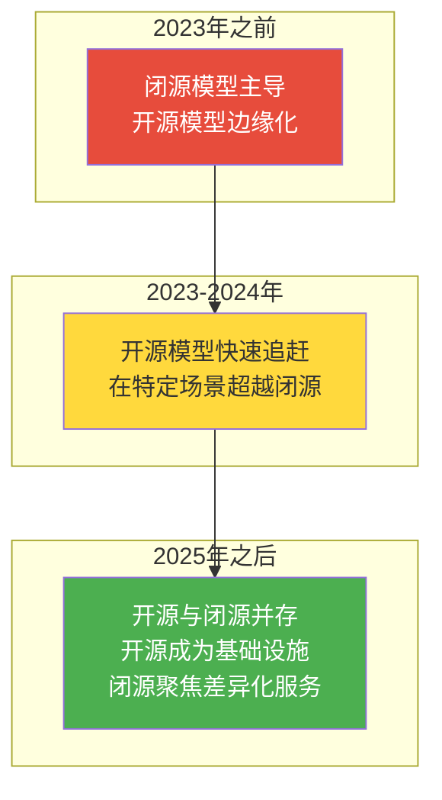

# 开源AI的崛起：从边缘到主流

> [!abstract] 核心观点
> 开源AI从2015年的学术实验，到2025年成为AI产业的基础设施，走过了一条"边缘→主流→基础设施"的演进路径。这一进程是学术界需求、开发者生态、成本优势和隐私合规四大驱动力共同作用的结果。LLaMA的泄露与开源是这一历史进程的关键转折点。

---

## 一、开源AI的前史：深度学习框架的奠基（2015-2018）

### 1.1 TensorFlow与PyTorch：开源AI的"地基"

在讨论开源大模型之前，必须回到2015年。这一年发生了两件深刻影响AI产业的事：

- **2015年11月**：Google开源TensorFlow，将深度学习从学术实验室推向工业界
- **2016年**：Facebook（现Meta）发布PyTorch，凭借动态计算图和Pythonic的API吸引了大量研究者

> [!note] 为什么框架开源如此重要？
> 在TensorFlow和PyTorch之前，深度学习框架是各自为政的（Caffe、Theano、Torch7）。框架的统一降低了AI开发的门槛，使得不同机构的模型可以基于相同的技术栈进行比较和复用。**没有框架开源，就不会有后来的模型开源**。

### 1.2 模型开源的萌芽：BERT与GPT

2018年是NLP领域的"ImageNet时刻"：

- **BERT**（Google）发布并开源，在11项NLP基准上刷新纪录
- **GPT**（OpenAI）发布，但当时并未开源模型权重

这里埋下了一个伏笔：Google选择了开源BERT，而OpenAI选择了闭源GPT。这两种不同的策略，在五年后演变成了开源AI与闭源AI的两条道路。

> [!warning] 历史的讽刺
> Google在2018年开源了BERT，但其后的大模型（PaLM、Gemini）却走向了闭源。直到2024年Gemma开源，Google才重新回到开源AI的牌桌上。而OpenAI从GPT-2开始就表现出对开源的犹豫——GPT-2因"安全担忧"延迟发布，GPT-3更是完全闭源。

---

## 二、生成式AI的破圈：从Stable Diffusion到LLaMA（2022-2023）

### 2.1 Stable Diffusion：开源AI的第一次"破圈"

2022年8月，Stability AI开源Stable Diffusion，引发了远超AI圈层的关注：

- **开源即用**：任何人都可以下载模型并在消费级GPU上运行
- **社区爆发**：在数周内涌现出ControlNet、LoRA、DreamBooth等衍生技术
- **商业验证**：证明了开源模型可以驱动一个完整的商业生态

> [!success] Stable Diffusion的启示
> Stable Diffusion证明了：一旦开源模型达到"足够好"的水平，社区创新速度将远超任何单一公司的研发速度。这一教训被Meta深刻吸收，并直接影响了其后续的LLaMA开源策略。

### 2.2 LLaMA泄露：一场改变AI产业格局的"意外"

2023年2月，Meta发布LLaMA论文但仅向研究者提供模型。然而不到一周，模型权重就在4chan上泄露，并通过BitTorrent迅速传播。

> [!important] LLaMA泄露的历史意义
> LLaMA泄露事件被MIT Technology Review评为"2023年AI领域最重要的事件之一"。它带来的三个深远影响：
>
> 1. **证明了开源模型的潜力**：社区通过微调让LLaMA-7B达到了接近GPT-3.5的性能
> 2. **改变了Meta的战略**：从"仅限研究"转为"正式开源"，LLaMA 2成为开源AI的转折点
> 3. **建立了开源AI的"SOTA追赶"范式**：开源模型通过社区创新快速缩小与闭源模型的差距

### 2.3 2023年：开源AI的爆发之年

2023年被称为"开源AI元年"，一系列事件密集发生：

| 时间 | 事件 | 意义 |
|:---|:---|:---|
| 2023年2月 | LLaMA发布并泄露 | 开源AI的"点火"事件 |
| 2023年3月 | Alpaca发布（斯坦福） | 证明低成本微调可行性（600美元） |
| 2023年6月 | Falcon 40B开源（TII） | 非美国机构首次开源顶级模型 |
| 2023年7月 | LLaMA 2正式开源 | Meta的战略转向，商业友好许可 |
| 2023年9月 | Mistral 7B发布 | 小模型（7B）实现顶级性能，欧洲崛起 |
| 2023年10月 | Qwen系列发布（阿里） | 中国开源AI力量崛起 |
| 2023年12月 | Mixtral 8x7B发布 | MoE架构在开源模型中的首次成功应用 |

---

## 三、开源AI的全面追赶（2024-2025）

### 3.1 2024年：开源模型逼近GPT-4

2024年是开源AI"质量追赶"的一年。关键事件包括：

- **LLaMA 3发布**（2024年4月）：8B和70B两个版本，70B版本在多个基准上接近GPT-4
- **DeepSeek-V2发布**（2024年5月）：MoE架构，以极低成本实现接近GPT-4的性能
- **Qwen 2.5发布**（2024年9月）：覆盖0.5B到72B的全尺寸系列，中文能力突出
- **Mistral Large发布**（2024年2月）：欧洲首个真正对标GPT-4的开源模型

### 3.2 2025年：DeepSeek-R1的"DeepSeek时刻"

2025年初，DeepSeek-R1的发布被业界称为开源AI的"DeepSeek时刻"——类似于ChatGPT之于闭源AI的意义：

- **极低成本**：训练成本仅为同级别闭源模型的1/10
- **推理能力**：在数学、编程等推理任务上达到甚至超越GPT-4o水平
- **完全开源**：模型权重、技术报告全部公开
- **全球震动**：引发美股AI板块震荡，动摇了"只有闭源才能做顶级AI"的假设

> [!quote] 业界评价
> "DeepSeek-R1 is the open-source AI's GPT moment. It proves that the gap between open and closed models is not a technology gap, but a resource gap — and that gap is closing fast." —— AI研究者社区

---

## 四、开源AI的四大核心驱动力

### 4.1 学术界需求：可复现性与研究自由

学术界对开源AI的需求是最根本的。当OpenAI的GPT-4论文只公布了"技术报告"而非详细方法时，学术界普遍表达了不满。没有开源模型，AI研究就会变成少数几家公司的"黑箱游戏"。

### 4.2 开发者生态：创新速度的指数级放大

开源AI的开发者生态形成了一个强大的正反馈循环：

> [!example] 案例：LLaMA的社区创新速度
> LLaMA发布后：
> - 第1周：社区完成模型格式转换和量化
> - 第2周：Alpaca（斯坦福）用600美元实现了指令微调
> - 第3周：Vicuna达到ChatGPT 90%的主观评价
> - 第4周：衍生出超过50个微调版本
> - 第2个月：llama.cpp让LLaMA在手机上运行

### 4.3 成本优势：从"用不起"到"用得起"

| 维度 | 闭源API | 开源自部署 |
|:---|:---|:---|
| 初始成本 | 低（按token付费） | 中（需要GPU服务器） |
| 大规模使用成本 | 高（线性增长） | 低（固定成本+边际成本递减） |
| 推理优化 | 不可控 | 完全可控（量化/蒸馏/批处理） |
| 长期TCO | 随使用量线性增长 | 使用量越大越有优势 |

> [!tip] 成本拐点
> 当企业的日均token消耗超过一定阈值（通常为1000万tokens/天），自部署开源模型的总成本将低于使用闭源API。这个拐点随着硬件成本下降和推理优化技术提升而不断降低。

### 4.4 数据隐私与合规：不可忽视的硬需求

对于金融、医疗、政务等强监管行业，数据不能离开自有服务器是硬约束。开源模型的私有化部署能力是唯一选择。

> [!warning] 合规风险
> 使用闭源API意味着将数据发送到第三方服务器。在GDPR、中国《数据安全法》等法规下，这可能带来严重的合规风险。开源模型的私有化部署可以完全规避这一风险。

---

## 五、开源AI的"新常态"：2025年后的格局

### 5.1 开源AI已成为基础设施

### 5.2 开源AI的三个"不会逆转"的趋势

> [!summary] 开源AI的三大确定性趋势
>
> 1. **开源模型与闭源模型的性能差距将持续缩小**：MoE、蒸馏、强化学习等技术在开源社区的快速传播，使得开源模型能够以更低的成本实现接近闭源的性能
>
> 2. **开源AI的生态厚度将持续增加**：推理框架、微调工具、评估基准、安全工具等周边生态的成熟，使得开源AI的可用性不断提升
>
> 3. **混合策略将成主流**：企业将同时使用开源和闭源模型——核心业务依赖开源模型的可控性，非核心业务借助闭源API的便捷性

---

## 六、与中国AI生态的关联

### 6.1 中国开源AI力量的崛起

中国在开源AI领域扮演着越来越重要的角色：

- **阿里Qwen系列**：全球下载量最高的开源模型系列之一
- **深度求索DeepSeek**：以技术创新（MoE、MLA）证明中国团队的开源实力
- **智谱ChatGLM**：最早的开源双语模型之一
- **零一万物Yi系列**：高效架构设计，多语言能力突出

> [!note] 中国开源AI的特色
> 中国开源AI力量的特点是**工程创新驱动**——在有限的算力资源下，通过架构创新和训练优化实现高效性能。这与美国开源AI的"规模驱动"路径形成互补。

### 6.2 魔搭社区（ModelScope）

阿里达摩院推出的魔搭社区是中国版"Hugging Face"，已成为中国最大的AI模型开源平台：

- 托管超过3000个模型
- 提供免费GPU算力用于模型体验
- 与中国云生态深度整合

详见 [[01-AI技术/开源AI生态全景/05_开源AI社区与协作模式]]

---

## 七、总结与展望

> [!summary] 本章核心要点
>
> 1. 开源AI的崛起可分为三个阶段：框架开源（2015-2018）、模型萌芽（2018-2022）、全面爆发（2023-至今）
> 2. LLaMA的泄露与正式开源是整个进程的关键转折点
> 3. DeepSeek-R1的发布证明了开源AI在推理能力上可以超越闭源模型
> 4. 学术界需求、开发者生态、成本优势、数据隐私是四大核心驱动力
> 5. 开源AI已成为AI产业的基础设施，混合策略将是企业的主流选择

---

## 相关阅读

- [[01-AI技术/开源AI生态全景/02_开源大模型全景对比]] — 详细了解主流开源模型的性能对比
- [[01-AI技术/开源AI生态全景/03_开源vs闭源：战略选择的博弈]] — 深入分析开源与闭源的战略博弈
- [[01-AI技术/开源AI生态全景/05_开源AI社区与协作模式]] — 了解开源AI社区的运作方式
- [[02-AI趋势与素养/AI应用发展阶段演进/00_MOC_AI应用发展阶段演进中枢]] — 了解AI应用的发展趋势

---

*最后更新：2026-07-27*