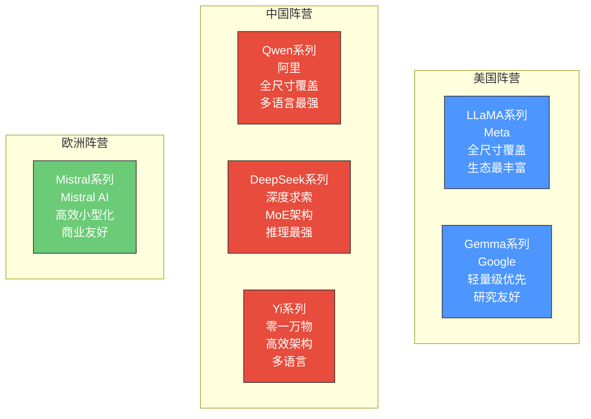
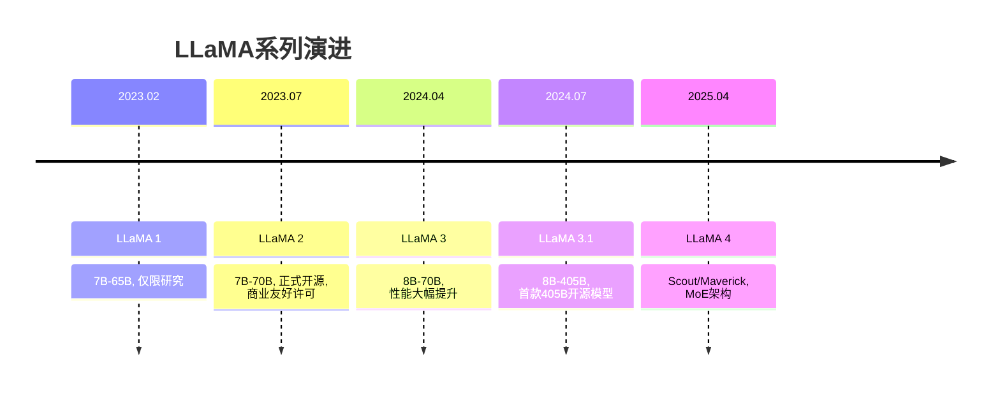
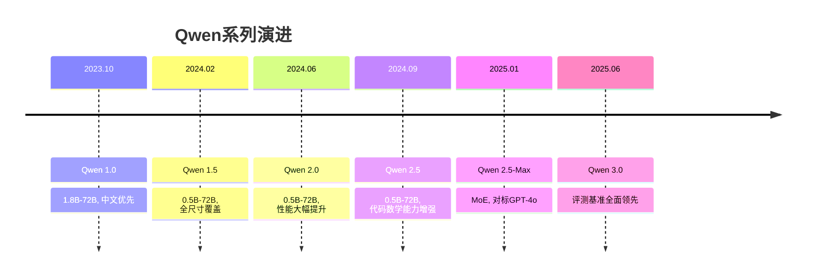
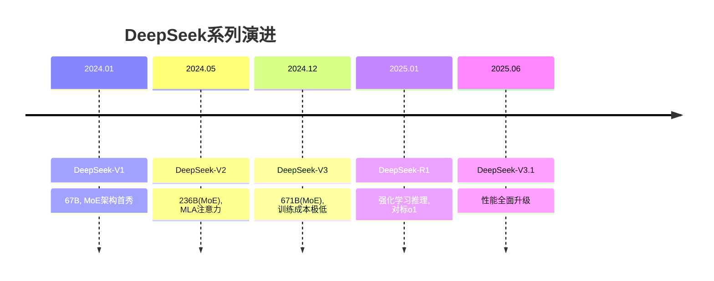
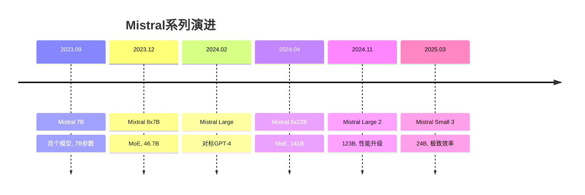
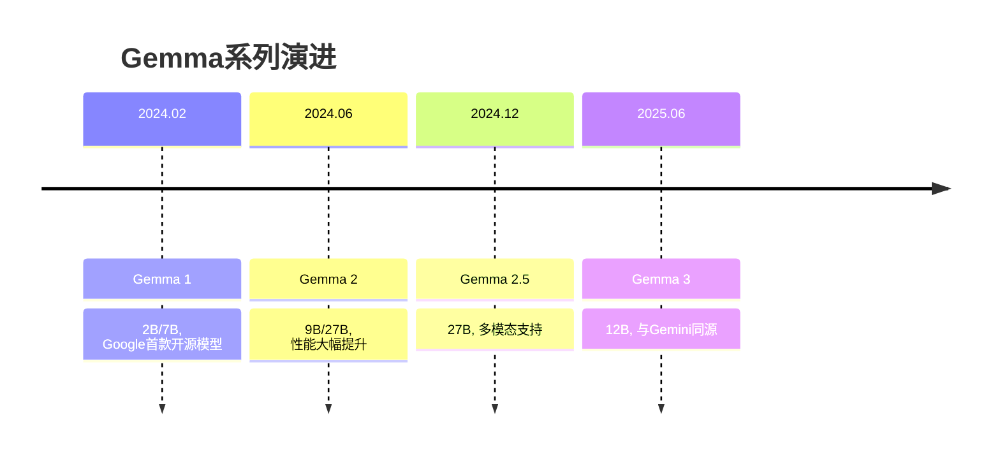
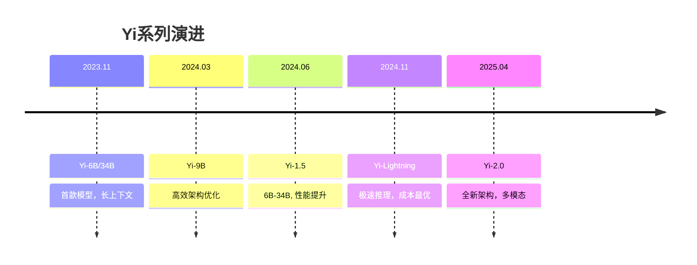
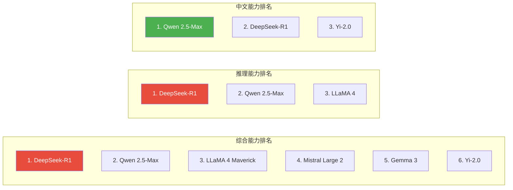
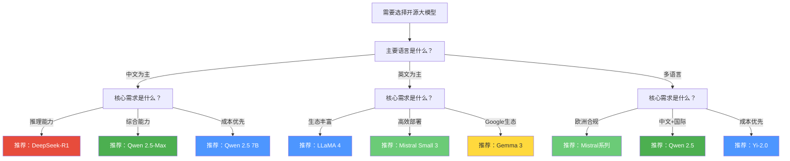

# 开源大模型全景对比

> [!abstract] 核心观点
> 2026年，开源大模型已形成六大核心家族：LLaMA（Meta）、Qwen（阿里）、DeepSeek（深度求索）、Mistral（Mistral AI）、Gemma（Google）、Yi（零一万物）。每个系列有其独特的定位、优势场景和生态策略。企业选型需要综合考虑性能、协议、生态和成本四个维度。

---

## 一、六大开源模型家族速览

### 1.1 全景对比地图

### 1.2 核心参数对比

| 维度 | LLaMA | Qwen | DeepSeek | Mistral | Gemma | Yi |
|:---|:---|:---|:---|:---|:---|:---|
| **开发方** | Meta | 阿里 | 深度求索 | Mistral AI | Google | 零一万物 |
| **国家/地区** | 美国 | 中国 | 中国 | 法国 | 美国 | 中国 |
| **参数范围** | 8B-405B | 0.5B-110B | 7B-236B(MoE) | 7B-123B | 2B-27B | 6B-34B |
| **架构** | Dense/MoE | Dense | MoE | Dense/MoE | Dense | Dense |
| **多模态** | 支持 | 支持 | 支持 | 部分支持 | 支持 | 部分支持 |
| **中文能力** | 中等 | 优秀 | 优秀 | 较弱 | 较弱 | 优秀 |
| **英文能力** | 优秀 | 优秀 | 优秀 | 优秀 | 优秀 | 优秀 |
| **推理效率** | 中等 | 高 | 极高 | 高 | 中等 | 高 |
| **社区生态** | 最丰富 | 丰富 | 快速增长 | 丰富 | 中等 | 中等 |
| **首次发布** | 2023.02 | 2023.10 | 2024.01 | 2023.09 | 2024.02 | 2023.11 |

---

## 二、各大模型家族详细分析

### 2.1 LLaMA系列（Meta）

> [!info] LLaMA系列定位
> **开源AI的"行业标准"**。LLaMA是全球使用最广泛的开源大模型系列，拥有最丰富的社区生态和最完善的工具链支持。

#### 版本演进

#### 核心优势

| 优势 | 说明 |
|:---|:---|
| **生态最丰富** | 几乎所有开源AI工具都优先支持LLaMA |
| **社区最活跃** | Hugging Face上LLaMA衍生模型超过10万个 |
| **全尺寸覆盖** | 从8B到405B，满足不同场景需求 |
| **商业友好** | LLaMA 2起的Community License允许商用 |
| **Meta背书** | 全球最大社交平台的技术积累 |

#### 开源协议

- **LLaMA 1**：仅限研究使用（非商业许可）
- **LLaMA 2/3**：LLaMA Community License（允许商用，月活用户>7亿需额外申请）
- **LLaMA 4**：LLaMA 4 Community License（进一步放宽商用限制）

> [!warning] 注意
> LLaMA的Community License存在"月活7亿用户上限"条款，对于超大型互联网平台存在限制。一般企业用户不受影响。

#### 适用场景

- 通用对话和内容生成
- 需要丰富社区生态支持的场景
- 多模态应用（LLaMA 3.2+支持视觉）
- 需要英文为主的国际化场景

---

### 2.2 Qwen系列（阿里）

> [!info] Qwen系列定位
> **中文能力最强的开源模型**，全尺寸覆盖，阿里云生态深度整合，中国企业用户的首选之一。

#### 版本演进

#### 核心优势

| 优势 | 说明 |
|:---|:---|
| **中文能力最强** | 在中文理解、生成、文化常识方面领先 |
| **全尺寸覆盖** | 从0.5B（手机端）到110B（数据中心），全场景覆盖 |
| **多语言能力** | 支持29种语言，中/英/日/韩/阿语等 |
| **阿里云生态** | 与阿里云MLOps平台深度整合，一键部署 |
| **开源协议友好** | 多数版本使用Apache 2.0，商业使用无限制 |
| **多模态能力** | Qwen-VL系列支持图像理解、OCR等 |

#### 开源协议

- **Qwen 1.0-2.5**：Apache 2.0（最友好的商业许可）
- **Qwen 2.5-Max**：Qwen License（类似Apache 2.0，附加少量限制）
- **Qwen 3.0**：Apache 2.0

> [!success] 协议优势
> Qwen使用Apache 2.0协议，是目前主流开源模型中最为商业友好的协议之一。这意味着企业可以自由使用、修改、分发，无需担心许可证限制。

#### 适用场景

- 中文为主的业务场景（客服、内容、办公）
- 需要多语言支持的国际业务
- 阿里云/中国云生态用户
- 多模态应用（Qwen-VL）

---

### 2.3 DeepSeek系列（深度求索）

> [!info] DeepSeek系列定位
> **推理能力最强的开源模型**，通过MoE架构和MLA注意力机制创新，以极低成本实现顶级性能。2025年DeepSeek-R1的发布改写了开源AI的竞争格局。

#### 版本演进

#### 核心优势

| 优势 | 说明 |
|:---|:---|
| **推理能力最强** | R1在数学/编程/逻辑推理上达到甚至超越o1 |
| **成本极低** | V3训练成本仅557万美元，为同级别的1/10 |
| **MoE架构创新** | 高效的多专家混合架构，推理时仅激活部分参数 |
| **MLA注意力** | 多头潜在注意力，大幅降低KV缓存 |
| **完全开源** | 模型权重和技术报告完全公开 |
| **中文优秀** | 中文理解和生成能力出色 |

#### 开源协议

- **DeepSeek-V2/V3**：DeepSeek License（允许商用，禁止用于竞争性模型训练）
- **DeepSeek-R1**：MIT License（最宽松的协议之一）

> [!tip] 技术亮点：MoE + MLA
> DeepSeek的MoE架构让671B参数的模型在推理时仅激活约37B参数，大幅降低了推理成本。MLA（Multi-head Latent Attention）则通过压缩KV缓存进一步降低了内存占用。这些技术创新使得用消费级硬件运行大模型成为可能。

#### 适用场景

- 复杂推理任务（数学、编程、逻辑分析）
- 成本敏感的大规模部署
- 需要顶级性能但预算有限
- 深度推理（DeepSeek-R1）场景

---

### 2.4 Mistral系列（Mistral AI）

> [!info] Mistral系列定位
> **欧洲开源AI的代表**，以高效小型化模型著称，追求"小而美"的极致性能密度。商业友好，欧洲市场首选。

#### 版本演进

#### 核心优势

| 优势 | 说明 |
|:---|:---|
| **性能密度高** | 小模型（7B）即可实现接近70B模型的性能 |
| **MoE先驱** | Mixtral是最早成功应用MoE的开源模型之一 |
| **商业友好** | Apache 2.0协议，商业使用无限制 |
| **欧洲合规** | 满足GDPR等欧洲数据保护要求 |
| **多语言能力** | 法语、英语、德语、西班牙语等欧洲语言 |
| **部署轻量** | 小模型可在消费级GPU上运行 |

#### 开源协议

- **Mistral 7B/Mixtral**：Apache 2.0
- **Mistral Large**：Mistral Research License（仅限研究）
- **Mistral Small 3**：Apache 2.0

> [!note] 注意
> Mistral Large不提供商业许可，仅用于研究。商业使用请选择Mistral Small 3或Mixtral系列。

#### 适用场景

- 欧洲市场（GDPR合规需求）
- 资源受限的部署环境
- 需要快速推理响应的场景
- 多语言欧洲业务

---

### 2.5 Gemma系列（Google）

> [!info] Gemma系列定位
> **Google的开源答卷**，以轻量级模型为主，与Google Cloud/TensorFlow生态深度整合，研究友好。

#### 版本演进

#### 核心优势

| 优势 | 说明 |
|:---|:---|
| **Google技术背书** | 与Gemini同源技术，研究深度有保障 |
| **轻量级高效** | 小模型（2B）即可实现不错的性能 |
| **研究友好** | 优秀的学术论文和模型卡文档 |
| **Google Cloud集成** | 与Vertex AI深度整合 |
| **安全对齐** | Google的安全标准，安全性较高 |

#### 开源协议

- **Gemma 1/2**：Gemma Terms of Use（允许商用，但有限制条款）
- **Gemma 3**：更加宽松的商业许可

> [!warning] 注意
> Gemma的使用条款相比Apache 2.0有更多限制，商业使用前请仔细阅读。Google对模型的使用行为保留了一定的干预权。

#### 适用场景

- Google Cloud生态用户
- 轻量级应用（移动端、边缘设备）
- 学术研究
- 安全敏感的场景

---

### 2.6 Yi系列（零一万物）

> [!info] Yi系列定位
> **架构创新的代表**，凭借高效的Transformer变体设计，在有限参数下实现高性能。多语言能力突出，成长迅速。

#### 版本演进

#### 核心优势

| 优势 | 说明 |
|:---|:---|
| **架构创新** | 创新的Transformer变体，效率更高 |
| **长上下文** | 原生支持200K+上下文长度 |
| **多语言能力** | 中文、英文、多语言表现均衡 |
| **成本优势** | Yi-Lightning以极低成本运行 |
| **快速迭代** | 研发节奏快，频繁更新 |

#### 开源协议

- **Yi-6B/34B**：Yi Series License（允许商用）
- **Yi-1.5/2.0**：Apache 2.0

#### 适用场景

- 长文本处理（200K上下文）
- 成本敏感场景
- 需要快速推理
- 多语言平衡需求

---

## 三、关键维度深度对比

### 3.1 性能基准对比（2025年底数据）

### 3.2 开源协议对比

| 模型系列 | 协议类型 | 商业使用 | 修改权 | 分发权 | 限制条款 |
|:---|:---|:---|:---|:---|:---|
| LLaMA 3/4 | Community License | 是 | 是 | 是 | 月活>7亿用户需申请 |
| Qwen 2.5 | Apache 2.0 | 是 | 是 | 是 | 无重大限制 |
| DeepSeek-V3 | DeepSeek License | 是 | 是 | 是 | 禁止用于竞争性模型训练 |
| DeepSeek-R1 | MIT License | 是 | 是 | 是 | 几乎无限制 |
| Mistral 7B/Mixtral | Apache 2.0 | 是 | 是 | 是 | 无重大限制 |
| Gemma 3 | Gemma Terms | 是 | 是 | 是 | Google保留干预权 |
| Yi-2.0 | Apache 2.0 | 是 | 是 | 是 | 无重大限制 |

> [!important] 协议选择建议
> 对于商业使用，推荐优先级：Apache 2.0 ≈ MIT > Community License > 自定义协议。Apache 2.0和MIT是最成熟、接受度最高的开源协议，法律风险最低。

### 3.3 推理效率对比

| 模型 | 参数量 | 推理显存 | 推理速度(相对) | 量化友好度 |
|:---|:---|:---|:---|:---|
| LLaMA 3 8B | 8B | ~6GB(INT4) | 快 | 高 |
| Qwen 2.5 7B | 7B | ~5GB(INT4) | 快 | 高 |
| DeepSeek-V3 | 671B(37B激活) | ~24GB(INT4) | 中 | 高 |
| Mixtral 8x7B | 46.7B(12.9B激活) | ~26GB(INT4) | 中 | 高 |
| Gemma 3 12B | 12B | ~8GB(INT4) | 快 | 中 |
| Yi-2.0 9B | 9B | ~6GB(INT4) | 快 | 高 |

---

## 四、企业选型决策框架

### 4.1 按场景选择

### 4.2 按企业规模选择

| 企业规模 | 推荐模型 | 推荐理由 |
|:---|:---|:---|
| **大型企业** | Qwen 2.5-Max / LLaMA 4 | 全尺寸覆盖，生态丰富，阿里云/AWS深度集成 |
| **中型企业** | DeepSeek-V3 / Qwen 2.5 72B | 性价比高，推理能力强，部署灵活 |
| **小型企业** | Qwen 2.5 7B / Mistral 7B | 单卡可部署，成本可控，满足基本需求 |
| **初创公司** | DeepSeek-R1 / Qwen 2.5 7B | 开源免费，性能优秀，迭代快 |

### 4.3 按行业选择

| 行业 | 推荐模型 | 关键考量 |
|:---|:---|:---|
| **金融** | Qwen 2.5 / DeepSeek | 数据隐私、私有化部署、中文能力 |
| **医疗** | LLaMA 4 / Qwen 2.5 | 合规要求、精度、可解释性 |
| **政务** | Qwen 2.5 / DeepSeek | 国产化、数据安全、中文能力 |
| **教育** | Qwen 2.5 / Yi-2.0 | 成本、中文能力、多语言 |
| **互联网** | LLaMA 4 / DeepSeek | 性能、生态、社区支持 |
| **制造** | Qwen 2.5 7B / Mistral 7B | 轻量部署、边缘计算、成本 |

---

## 五、模型选型的常见误区

> [!danger] 选型误区
>
> **误区1：参数越大越好**
> 参数不是唯一指标。DeepSeek-V3的671B（37B激活）在推理时比某些70B模型更高效。实际应用中的推理速度、显存占用、部署成本同样重要。
>
> **误区2：只看排行榜分数**
> 排行榜分数反映的是特定基准测试的能力，不代表实际业务场景的表现。建议在自有数据上进行评估。
>
> **误区3：忽略协议风险**
> 不同的开源协议对商业使用的限制不同。选择Apache 2.0协议可以最大程度降低法律风险。
>
> **误区4：锁定单一模型**
> 建议采用多模型策略：核心任务用最强模型，非核心任务用轻量模型，用模型路由来平衡性能和成本。

---

## 六、未来趋势

> [!summary] 开源大模型发展趋势
>
> 1. **MoE架构成为主流**：LLaMA 4、DeepSeek、Qwen 2.5-Max均采用MoE，高效推理
> 2. **小模型性能持续提升**：7B级别的模型已能满足大多数场景
> 3. **多模态融合加速**：文本+视觉+语音的多模态开源模型日益成熟
> 4. **推理能力成新战场**：从DeepSeek-R1开始，强化推理能力成为竞争焦点
> 5. **开源协议趋于友好**：Apache 2.0和MIT协议成为主流选择

---

## 相关阅读

- [[01-AI技术/开源AI生态全景/01_开源AI的崛起：从边缘到主流]] — 了解开源AI的发展历程
- [[01-AI技术/开源AI生态全景/03_开源vs闭源：战略选择的博弈]] — 深入分析开源与闭源的战略选择
- [[01-AI技术/开源AI生态全景/04_开源AI工具链全景]] — 了解配套的开源工具链
- [[01-AI技术/开源AI生态全景/00_MOC_开源AI生态全景中枢]] — 返回知识库中枢

---

*最后更新：2026-07-27*