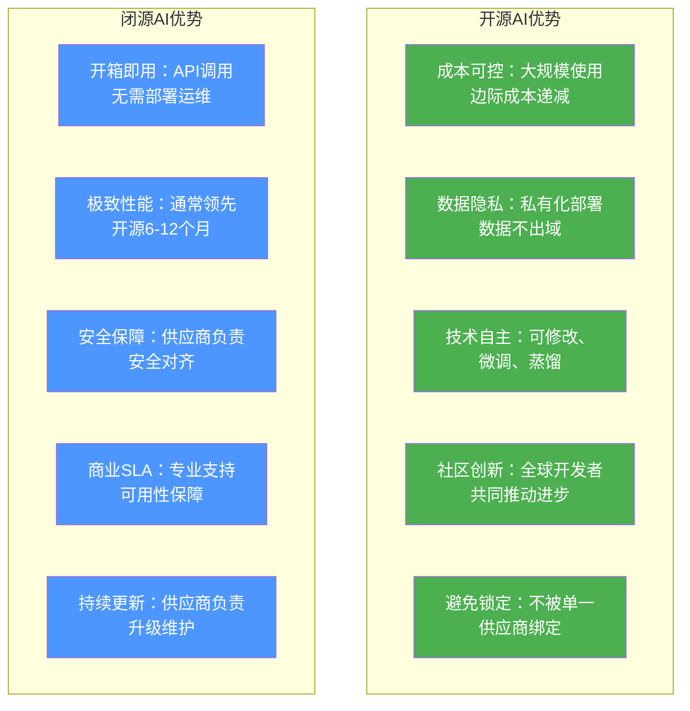
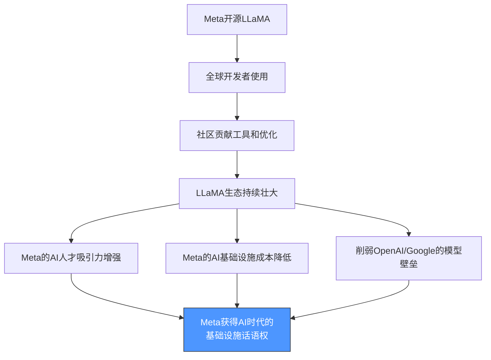
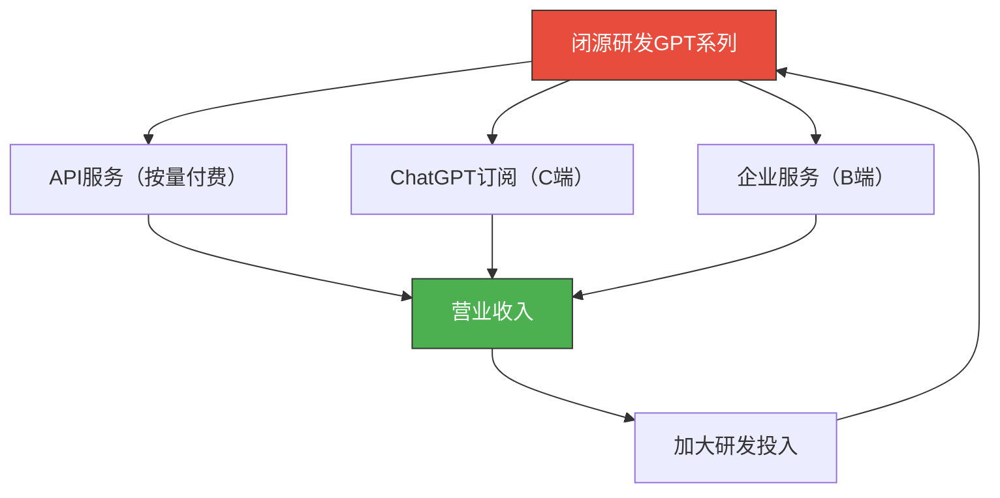
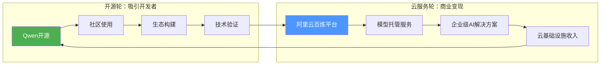
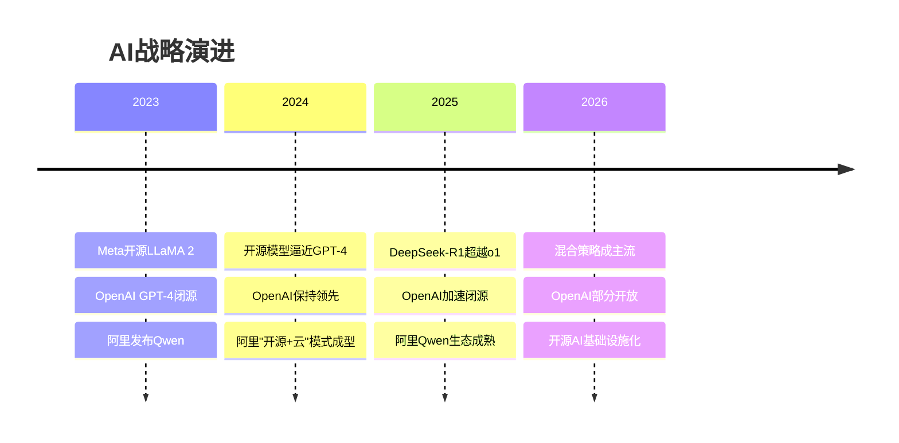
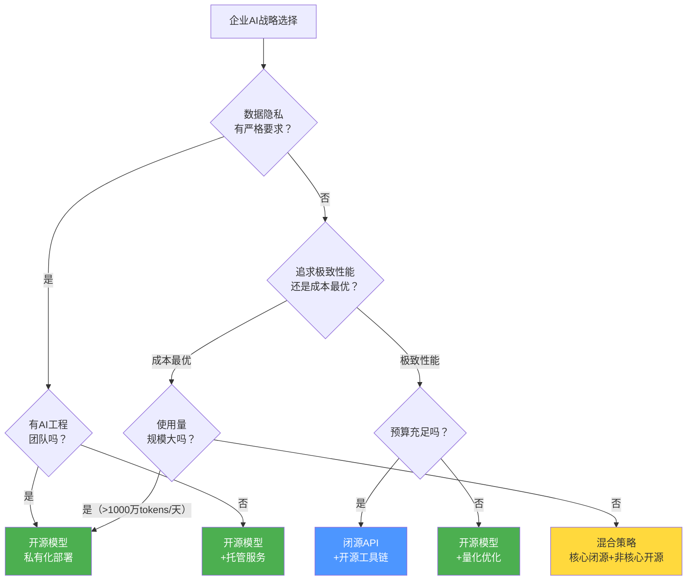
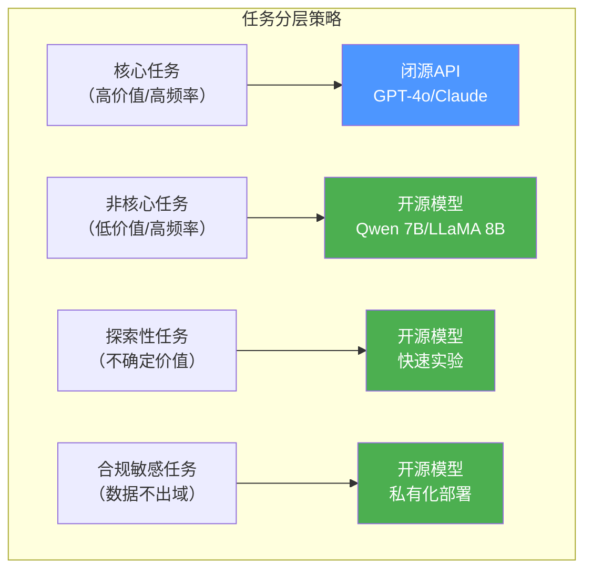
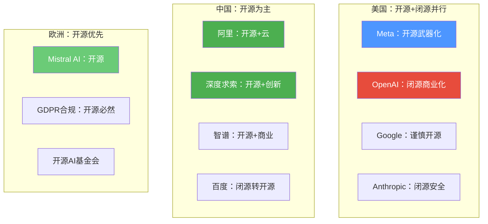

# 开源vs闭源：战略选择的博弈

> [!abstract] 核心观点
> 开源AI与闭源AI的博弈，不仅是技术路线的选择，更是商业战略的对决。Meta的"开源武器化"战略、OpenAI的"闭源商业化"路径、阿里的"开源+云"双轮驱动，代表了三种不同的战略范式。企业需要根据自身场景、预算和团队能力，做出动态的、分层的选择。

---

## 一、开源vs闭源：本质对比

### 1.1 核心维度对比

| 维度 | 开源AI | 闭源AI |
|:---|:---|:---|
| **模型获取** | 免费下载权重，自行部署 | 通过API调用，按量付费 |
| **技术可控性** | 完全可控，可修改、微调、蒸馏 | 黑箱，不可修改 |
| **数据隐私** | 本地部署，数据不出域 | 数据发送至第三方服务器 |
| **成本结构** | 前期投入高（GPU），边际成本低 | 前期投入低，边际成本线性增长 |
| **性能** | 快速追赶，部分任务超越 | 通常领先6-12个月 |
| **安全性** | 需自行管理，风险自担 | 供应商负责，但需信任第三方 |
| **创新速度** | 社区驱动，创新速度快 | 公司驱动，但方向单一 |
| **服务与支持** | 社区支持为主，需自行解决问题 | 商业SLA，专业支持 |
| **定制化** | 可深度定制 | 仅能通过prompt engineering |
| **开源协议** | 需遵守协议条款 | 服务条款约束 |

### 1.2 优劣势对比图谱

---

## 二、三大战略范式深度分析

### 2.1 Meta的"开源武器化"战略

> [!important] 战略核心
> Meta通过开源LLaMA系列，将AI产业的竞争从"模型性能"转变为"生态规模"，利用其社交平台（Facebook/Instagram/WhatsApp）的30亿用户基础，构建以LLaMA为核心的开源生态。

**战略逻辑分析**：

1. **打破OpenAI的模型壁垒**：如果只有闭源模型，AI的"军备竞赛"就是比谁钱多。Meta通过开源LLaMA，将竞争从"谁的模型更大"转变为"谁的生态更活跃"。

2. **获取社区创新红利**：Meta不需要自己探索所有应用场景——全球开发者会帮它测试、优化、拓展LLaMA的应用边界。这相当于Meta拥有了一支免费的外部研发团队。

3. **人才吸引**：开源文化吸引顶尖AI研究者。Yann LeCun公开表示，开源是Meta AI能够吸引和留住顶级人才的关键。

4. **基础设施成本分摊**：当整个社区都在优化LLaMA的推理效率时，Meta自己部署AI的成本也会降低。

> [!quote] Yann LeCun的观点
> "开源AI不是慈善，而是战略。一个开放的平台比一个封闭的平台更强大，因为它能吸引更多的创新者。就像Linux最终主导了服务器操作系统一样，开源AI也将主导AI基础设施。"

### 2.2 OpenAI的"闭源商业化"路径

> [!important] 战略核心
> OpenAI通过闭源模型（GPT系列）+ API服务 + 企业订阅的模式，构建了完整的商业闭环。其战略逻辑是：保持模型性能领先，通过API和订阅实现商业化，用收入反哺研发。

**战略逻辑分析**：

1. **性能领先是核心护城河**：OpenAI的战略建立在"模型性能始终领先"的假设上。只要GPT系列比开源模型更好，企业和开发者就愿意付费。

2. **商业闭环清晰**：API收入 + 订阅收入 + 企业服务，形成了多元化的收入结构。

3. **安全可控**：闭源意味着可以更好地控制模型行为，减少安全风险。

4. **规模化优势**：作为最大的AI API提供商，OpenAI可以优化推理成本，形成规模效应。

> [!warning] 风险分析
> OpenAI的闭源战略面临两个核心风险：
> 1. **性能差距缩小**：随着DeepSeek-R1等开源模型的性能追赶，闭源的优势正在缩小
> 2. **客户转向**：当开源模型性能足够好时，成本敏感型客户会转向开源

### 2.3 阿里的"开源+云"双轮驱动

> [!important] 战略核心
> 阿里通过开源Qwen系列模型（吸引开发者） + 阿里云AI服务（商业化变现）的双轮驱动，实现了"开源引流、云服务变现"的商业模式。这是目前最成功的开源AI商业化路径之一。

**战略逻辑分析**：

1. **开源降低获客成本**：Qwen的广泛使用为阿里云带来了大量潜在客户。当开发者熟悉了Qwen，迁移到阿里云的AI服务就变得自然而然。

2. **云服务提供增值**：模型托管、推理优化、MLOps平台、企业级SLA——这些是开源模型本身不提供的，阿里云通过云服务实现价值捕获。

3. **技术验证循环**：开源社区的反馈帮助阿里快速验证和迭代Qwen，形成"开源驱动研发、云服务驱动变现"的正循环。

4. **中国市场的独特优势**：数据合规要求使得私有化部署需求强烈，Qwen + 阿里云私有化方案完美匹配这一需求。

> [!success] 成功指标
> - Qwen系列全球下载量超过1亿次
> - 阿里云百炼平台服务超过10万家企业客户
> - Qwen衍生模型超过5万个

---

## 三、不同战略范式的比较

### 3.1 三种战略的系统对比

| 维度 | Meta（开源武器化） | OpenAI（闭源商业化） | 阿里（开源+云） |
|:---|:---|:---|:---|
| **核心逻辑** | 以开源构建生态壁垒 | 以性能领先构建商业壁垒 | 以开源引流，云服务变现 |
| **收入模式** | 间接（广告+生态） | 直接（API+订阅） | 混合（开源免费+云服务收费） |
| **竞争壁垒** | 生态规模 | 模型性能 | 云基础设施+生态 |
| **目标客户** | 全球开发者 | 企业和个人用户 | 中国企业+开发者 |
| **风险点** | 开源模型被竞争对手使用 | 性能差距被追赶 | 开源与云服务的平衡 |
| **成功关键** | 生态活跃度 | 性能持续领先 | 云服务增值能力 |

### 3.2 战略演进趋势

---

## 四、企业选择决策框架

### 4.1 决策矩阵

### 4.2 按企业场景的推荐策略

| 场景类型 | 推荐策略 | 推荐模型/服务 | 理由 |
|:---|:---|:---|:---|
| **金融数据合规** | 纯开源 | DeepSeek-R1/Qwen 2.5 | 数据不出域，私有化部署 |
| **互联网产品** | 混合策略 | GPT-4o + Qwen 2.5 | 核心功能用闭源，长尾用开源 |
| **政务应用** | 纯开源 | Qwen 2.5-Max | 国产化、数据安全要求 |
| **初创公司** | 混合策略 | 闭源API + 开源模型 | 快速验证，成本可控 |
| **大型企业** | 混合策略 | 多模型路由 | 灵活性和成本最优 |
| **教育科研** | 纯开源 | Qwen/Llama/DeepSeek | 成本优先，可复现性 |

### 4.3 混合策略：大多数企业的最优解

> [!tip] 混合策略的核心原则
> 混合策略不是简单的"同时使用开源和闭源"，而是基于**任务分层**的精细化选择：
>
> - **核心任务**（高价值、高频率）：使用最强模型（可能是闭源）
> - **非核心任务**（低价值、高频率）：使用开源模型降低成本
> - **探索性任务**（不确定价值）：使用开源模型快速实验
> - **合规敏感任务**：必须使用开源模型私有化部署

---

## 五、全球AI战略格局

### 5.1 中美欧三地的战略差异

### 5.2 地缘政治对AI战略的影响

> [!warning] 地缘政治因素
> AI芯片出口管制、数据跨境流动限制、技术出口管制等因素，使得开源AI的战略意义超越了纯商业考量。对于中国企业而言，开源AI不仅是成本选择，更是**技术自主可控**的战略需求。

---

## 六、战略选择的常见误区

> [!danger] 决策误区
>
> **误区1：开源就是免费**
> 开源模型本身免费，但部署、运维、优化都需要成本。大规模自建AI基础设施的总成本可能高于使用API。
>
> **误区2：闭源总是更好**
> 在特定场景（中文任务、垂直领域微调），开源模型可能优于通用闭源API。
>
> **误区3：一旦选了就不能改**
> 战略应该是动态的。建议每季度评估一次模型选型，根据最新性能数据调整。
>
> **误区4：开源=不安全**
> 开源模型的安全性取决于部署方式和对齐程度。Qwen和LLaMA 3都经过了充分的安全对齐。详见 [[01-AI技术/开源AI生态全景/07_开源AI的安全与风险]]
>
> **误区5：闭源更省心**
> 闭源API同样需要管理（prompt engineering、输出质量控制、成本优化）。没有"完全省心"的方案。

---

## 七、未来展望

> [!summary] 战略博弈的未来趋势
>
> 1. **性能差距持续缩小**：开源模型与闭源模型的性能差距将从6-12个月缩短到3-6个月
> 2. **混合策略成为主流**：超过80%的企业将采用"开源+闭源"混合策略
> 3. **开源协议的商业友好化**：Apache 2.0和MIT协议将成为主流
> 4. **"开源+云"模式验证**：阿里的双轮驱动模式将被更多云厂商效仿
> 5. **开源AI基础设施化**：就像Linux之于服务器，开源AI将成为AI基础设施的默认选择

---

## 相关阅读

- [[01-AI技术/开源AI生态全景/01_开源AI的崛起：从边缘到主流]] — 了解开源AI的发展历程
- [[01-AI技术/开源AI生态全景/02_开源大模型全景对比]] — 详细对比各开源模型
- [[01-AI技术/开源AI生态全景/06_开源AI的商业化路径]] — 深入了解开源AI如何赚钱
- [[01-AI技术/开源AI生态全景/08_开源AI对企业AI战略的影响]] — 企业AI战略的完整框架
- [[01-AI技术/开源AI生态全景/00_MOC_开源AI生态全景中枢]] — 返回知识库中枢

---

*最后更新：2026-07-27*