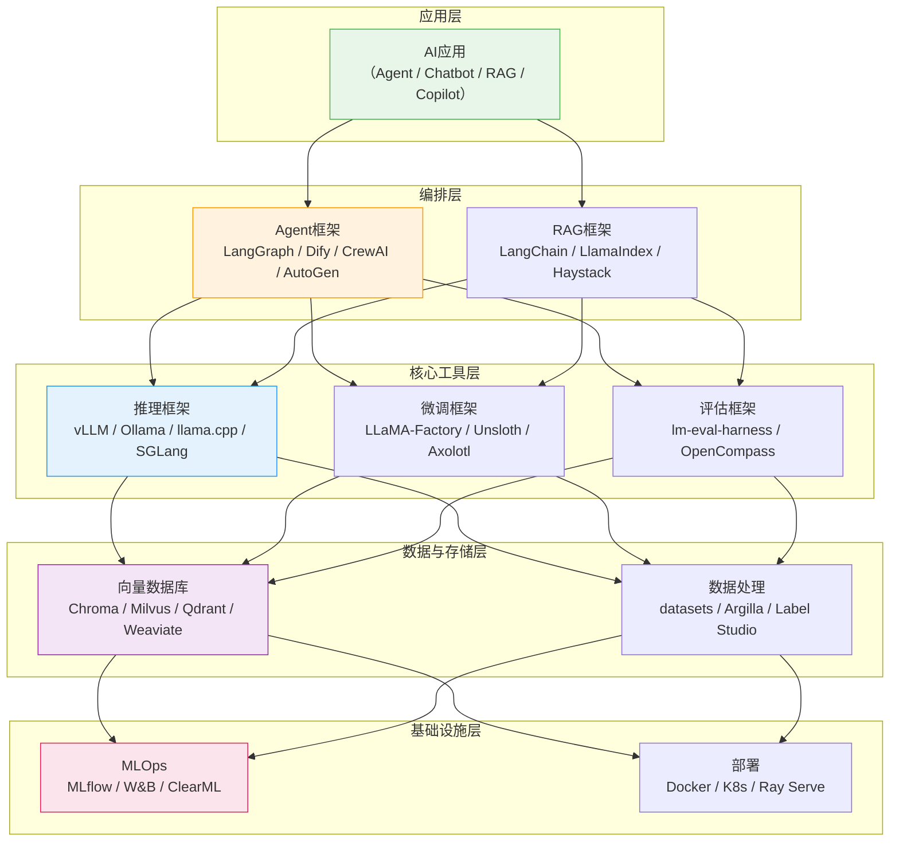
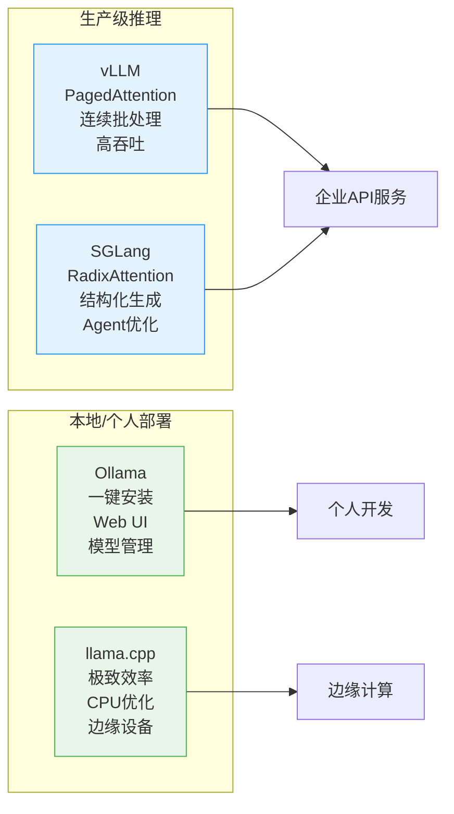
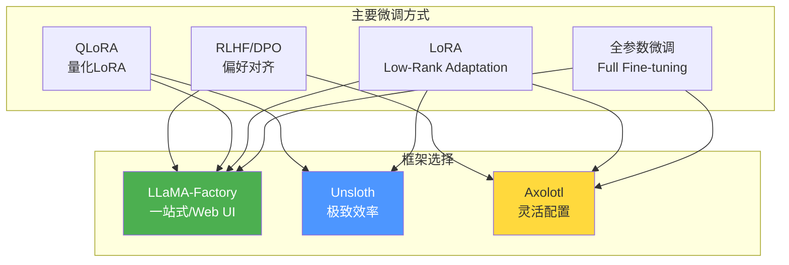
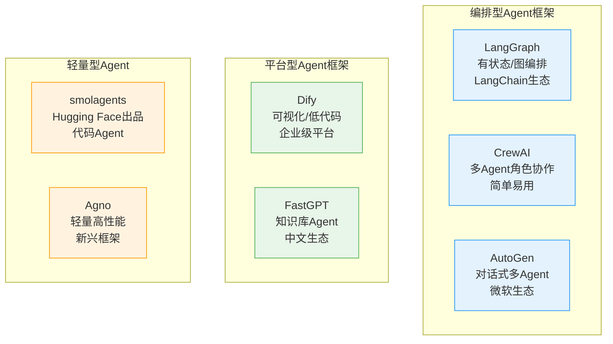
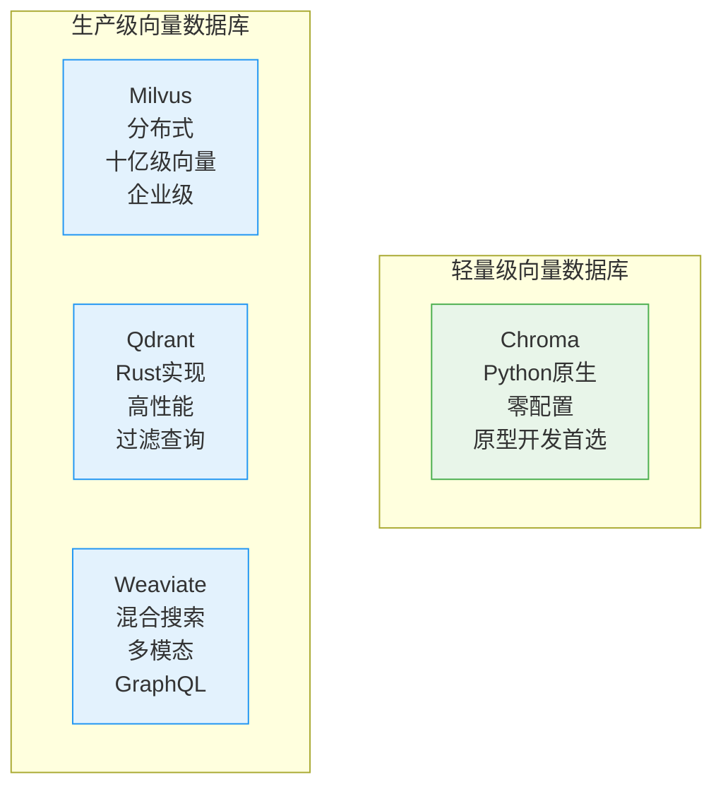
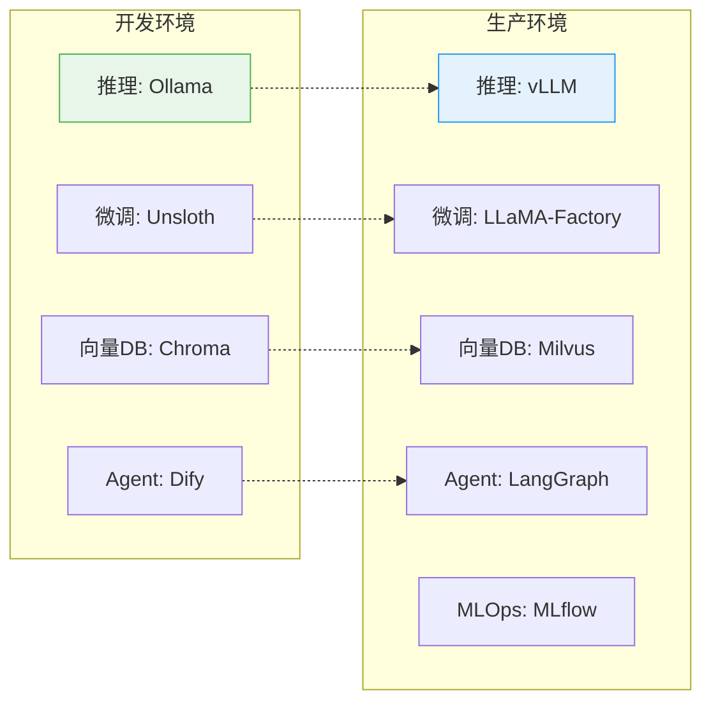

# 开源AI工具链全景

> [!abstract] 核心观点
> 开源AI工具链是开源模型从"能用"到"好用"的关键桥梁。五大核心领域——推理框架、微调框架、Agent框架、向量数据库、评估框架——构成了开源AI的"隐性护城河"。工具链的成熟度直接决定了开源模型的可用性和企业采用率。

> [!warning] 与 [[01-AI技术/AI Agent 工具/AI_Agent_工具全景对比]] 的边界
> 本文聚焦**开源AI工具链基础设施**，不重复 [[01-AI技术/AI Agent 工具/AI_Agent_工具全景对比]] 中的Agent应用对比。关于Agent能力、平台选择、商业定价等内容，请参考 [[01-AI技术/AI Agent 工具/AI_Agent_工具全景对比]]。

---

## 一、开源AI工具链全景图

### 1.1 工具链架构



### 1.2 工具链选型地图

| 领域 | 工具 | 定位 | 适用场景 | 社区活跃度 |
|:---|:---|:---|:---|:---|
| **推理框架** | vLLM | 高性能生产推理 | 大规模API服务 | 极高 |
| | Ollama | 本地一键部署 | 个人开发/小团队 | 极高 |
| | llama.cpp | 极致效率（CPU/边缘） | 边缘设备/CPU推理 | 极高 |
| | SGLang | 结构化生成 | 复杂Agent场景 | 高 |
| **微调框架** | LLaMA-Factory | 一站式微调 | 通用微调场景 | 极高 |
| | Unsloth | 极致效率微调 | 资源受限/快速实验 | 极高 |
| | Axolotl | 灵活配置微调 | 高级微调需求 | 高 |
| **Agent框架** | LangGraph | 有状态Agent | 复杂工作流 | 极高 |
| | Dify | 可视化Agent平台 | 低代码/快速搭建 | 极高 |
| | CrewAI | 多Agent协作 | 多角色协作 | 高 |
| | AutoGen | 对话式Agent | 微软生态 | 高 |
| **向量数据库** | Chroma | 轻量嵌入 | 原型开发/小规模 | 极高 |
| | Milvus | 高性能分布式 | 大规模生产 | 极高 |
| | Qdrant | 高性能Rust | 高性能需求 | 高 |
| | Weaviate | 混合搜索 | 多模态搜索 | 高 |
| **评估框架** | lm-eval-harness | 标准基准测试 | 模型评估 | 极高 |
| | OpenCompass | 中文评估体系 | 中文模型评估 | 高 |

---

## 二、推理框架深度对比

### 2.1 推理框架全景

推理框架是开源AI工具链中的"发动机"，直接影响模型的响应速度、吞吐量和部署成本。



### 2.2 vLLM：生产级推理的事实标准

> [!info] vLLM
> UC Berkeley开源的推理框架，通过PagedAttention技术实现了高效的内存管理，是目前生产环境中最广泛使用的推理框架。

**核心特性**：
- **PagedAttention**：类似操作系统虚拟内存的KV缓存管理，将显存利用率从传统的60-70%提升到近100%
- **连续批处理**：动态合并请求，最大化GPU利用率
- **量化支持**：支持AWQ、GPTQ、FP8等多种量化方式
- **多模型支持**：支持几乎所有主流开源模型
- **OpenAI兼容API**：可以直接替换OpenAI API端点

**适用场景**：大规模API服务、需要高吞吐的生产环境

**性能参考**：在A100 GPU上，vLLM可以实现比Hugging Face Transformers快24倍的推理速度。

### 2.3 Ollama：本地部署的首选

> [!info] Ollama
> 一键式本地LLM部署工具，让"下载即运行"成为可能。极大降低了开源AI的使用门槛。

**核心特性**：
- **一键安装**：下载、安装、运行一条命令
- **模型管理**：类似Docker的模型管理方式
- **Modelfile**：通过配置文件定制模型行为
- **REST API**：提供标准API接口
- **跨平台**：支持Mac、Windows、Linux

**适用场景**：个人开发者、小团队、私有化部署原型

```bash
# Ollama 典型使用方式
ollama pull qwen2.5:7b     # 下载模型
ollama run qwen2.5:7b      # 运行模型
ollama serve               # 启动API服务
```

### 2.4 llama.cpp：极致效率的追求

> [!info] llama.cpp
> 纯C/C++实现的LLM推理引擎，无需Python依赖，支持CPU、GPU和混合推理。让大模型在消费级硬件上运行成为可能。

**核心特性**：
- **纯C/C++**：无Python依赖，部署极简
- **CPU推理**：在CPU上也能获得可用的推理速度
- **量化技术**：GGUF格式，支持2-8bit量化
- **边缘设备**：支持手机、树莓派等设备
- **多后端**：支持CUDA、Metal、Vulkan、SYCL

**适用场景**：边缘设备、CPU推理、资源受限环境

### 2.5 推理框架选型建议

| 场景 | 推荐框架 | 理由 |
|:---|:---|:---|
| 企业API服务（大规模） | vLLM | 高吞吐、稳定性好、生态完善 |
| 个人开发/小团队 | Ollama | 一键部署、零配置 |
| 边缘设备/CPU推理 | llama.cpp | 极致效率、跨平台 |
| 结构化生成/Agent | SGLang | RadixAttention、结构化输出 |
| 混合方案 | vLLM + Ollama | 生产用vLLM，开发用Ollama |

---

## 三、微调框架深度对比

### 3.1 微调框架全景

微调是开源AI的核心优势之一——闭源模型无法微调，而开源模型可以让企业针对特定场景进行深度定制。



### 3.2 LLaMA-Factory：一站式微调平台

> [!info] LLaMA-Factory
> 中文社区最活跃的微调框架，提供Web UI和命令行两种使用方式，支持几乎所有主流模型和微调方法。

**核心特性**：
- **Web UI界面**：可视化操作，降低使用门槛
- **多种微调方法**：全参数、LoRA、QLoRA、DPO等
- **广泛模型支持**：LLaMA、Qwen、DeepSeek、Mistral等
- **数据集管理**：内置数据集格式转换
- **一键评估**：微调后自动评估

**适用场景**：通用微调需求、团队协作、快速实验

### 3.3 Unsloth：极致效率的微调

> [!info] Unsloth
> 通过底层CUDA优化，将微调速度提升2-5倍，显存占用降低50-80%。让个人开发者用消费级GPU也能微调大模型。

**核心特性**：
- **2-5倍加速**：底层kernel优化
- **显存节省50-80%**：通过数学等价变换
- **免费Colab笔记本**：提供免费GPU微调教程
- **开源模型广泛支持**：LLaMA、Qwen、Mistral、Gemma等

**适用场景**：资源受限的个人开发者、快速实验迭代

### 3.4 微调框架选型建议

| 场景 | 推荐框架 | 理由 |
|:---|:---|:---|
| 团队协作微调 | LLaMA-Factory | Web UI、功能全面 |
| 个人快速实验 | Unsloth | 速度快、显存省 |
| 高级定制需求 | Axolotl | 配置灵活、YAML驱动 |
| 入门学习 | LLaMA-Factory | 图形界面友好 |

---

## 四、Agent框架深度对比

### 4.1 Agent框架全景

> [!note] 关于Agent框架的定位
> 本部分聚焦Agent框架的**开源工具链属性**，而非Agent应用对比。关于Agent能力和平台选择的详细对比，请参考 [[01-AI技术/AI Agent 工具/AI_Agent_工具全景对比]]。



### 4.2 LangGraph

> [!info] LangGraph
> 基于有向图（Directed Graph）的Agent编排框架，将Agent的行为建模为节点和边的图结构。适合构建复杂的、有状态的Agent工作流。

**核心特性**：
- **图编排**：将Agent工作流建模为节点和边
- **状态管理**：内置checkpointing和状态持久化
- **人机协作**：支持Human-in-the-Loop
- **LangChain生态**：与LangChain无缝集成

**适用场景**：复杂Agent工作流、需要精确控制流程的场景

### 4.3 Dify

> [!info] Dify
> 可视化AI应用开发平台，提供低代码/无代码的Agent构建方式。支持RAG、Agent、工作流等多种模式。

**核心特性**：
- **可视化编排**：拖拽式构建AI工作流
- **内置RAG**：知识库管理、文档解析
- **多模型支持**：支持100+模型提供商
- **企业级功能**：权限管理、日志监控、API管理

**适用场景**：快速搭建AI应用、非技术人员参与开发

### 4.4 CrewAI

> [!info] CrewAI
> 多Agent协作框架，让多个AI Agent扮演不同角色（如研究员、写手、审核员），协作完成复杂任务。

**核心特性**：
- **角色定义**：Agent扮演特定角色
- **任务分配**：自动分配任务给不同Agent
- **协作流程**：顺序执行、层级委派
- **简单易用**：Python API，学习成本低

**适用场景**：多Agent协作场景、内容生成流水线

---

## 五、向量数据库深度对比

### 5.1 向量数据库全景

向量数据库是RAG（检索增强生成）的核心组件，也是开源AI应用中最常用的基础设施。



### 5.2 向量数据库对比

| 维度 | Chroma | Milvus | Qdrant | Weaviate |
|:---|:---|:---|:---|:---|
| **定位** | 轻量嵌入 | 企业级分布式 | 高性能 | 混合搜索 |
| **语言** | Python | Go/C++ | Rust | Go |
| **部署** | pip install | Docker/K8s | Docker/K8s | Docker/K8s |
| **规模** | 百万级 | 十亿级 | 亿级 | 亿级 |
| **过滤查询** | 基础 | 强大 | 强大 | 强大 |
| **混合搜索** | 不支持 | 支持 | 不支持 | 支持 |
| **多模态** | 通过embedding | 支持 | 支持 | 原生支持 |
| **社区活跃度** | 极高 | 极高 | 高 | 高 |
| **入门难度** | 极低 | 中 | 中 | 中 |

### 5.3 向量数据库选型建议

| 场景 | 推荐 | 理由 |
|:---|:---|:---|
| 原型开发 | Chroma | 零配置、pip install即可 |
| 生产环境（大规模） | Milvus | 分布式、十亿级、GPU加速 |
| 高性能需求 | Qdrant | Rust实现、极致性能 |
| 多模态搜索 | Weaviate | 原生多模态、混合搜索 |
| 混合方案 | Chroma(开发) + Milvus(生产) | 开发用轻量，生产用分布式 |

---

## 六、评估框架

### 6.1 评估框架介绍

| 框架 | 定位 | 特色 |
|:---|:---|:---|
| **lm-eval-harness** | 标准基准测试 | EleutherAI出品，支持200+基准任务 |
| **OpenCompass** | 中文评估体系 | 上海AI Lab，中文评估最全面 |
| **HELM** | 多维评估 | Stanford，涵盖准确性、公平性、毒性等 |
| **Chatbot Arena** | 人类偏好 | LMSYS，基于真实人类投票 |

### 6.2 为什么评估框架很重要

> [!important] 评估框架的价值
> 在开源AI生态中，评估框架是"度量衡"——一个客观、标准化的评估体系让不同模型可以公平比较，也让企业在选型时有了数据依据。没有评估框架，模型选型就会变成"凭感觉"。

---

## 七、工具链集成最佳实践

### 7.1 推荐的端到端技术栈



### 7.2 不同规模团队的推荐方案

| 团队规模 | 推理 | 微调 | Agent | 向量DB | 评估 |
|:---|:---|:---|:---|:---|:---|
| 个人开发者 | Ollama | Unsloth | Dify | Chroma | lm-eval |
| 小型团队(3-10人) | Ollama/vLLM | LLaMA-Factory | Dify | Chroma/Qdrant | lm-eval |
| 中型团队(10-50人) | vLLM | LLaMA-Factory | LangGraph/Dify | Qdrant/Milvus | lm-eval+OpenCompass |
| 大型企业(50人+) | vLLM集群 | LLaMA-Factory | LangGraph+Dify | Milvus | 全栈评估 |

---

## 八、工具链发展趋势

> [!summary] 开源AI工具链发展趋势
>
> 1. **推理框架的性能竞赛**：vLLM、SGLang、TensorRT-LLM持续优化，推理成本持续下降
> 2. **微调的门槛持续降低**：QLoRA + Unsloth让个人开发者用消费级GPU也能微调大模型
> 3. **Agent框架的标准化**：MCP（Model Context Protocol）推动Agent框架的互操作性
> 4. **向量数据库的融合**：传统数据库（PostgreSQL/pgvector）也在加入向量搜索能力
> 5. **MLOps的AI化**：用AI来管理AI，自动化模型评估、监控和更新

---

## 相关阅读

- [[01-AI技术/开源AI生态全景/02_开源大模型全景对比]] — 了解要部署的模型
- [[01-AI技术/开源AI生态全景/05_开源AI社区与协作模式]] — 了解工具链背后的社区
- [[01-AI技术/AI Agent 工具/AI_Agent_工具全景对比]] — Agent平台和能力的详细对比
- [[01-AI技术/Skill制作痛点/00_MOC_Skill制作痛点中枢]] — Skill开发实践
- [[01-AI技术/开源AI生态全景/00_MOC_开源AI生态全景中枢]] — 返回知识库中枢

---

*最后更新：2026-07-27*