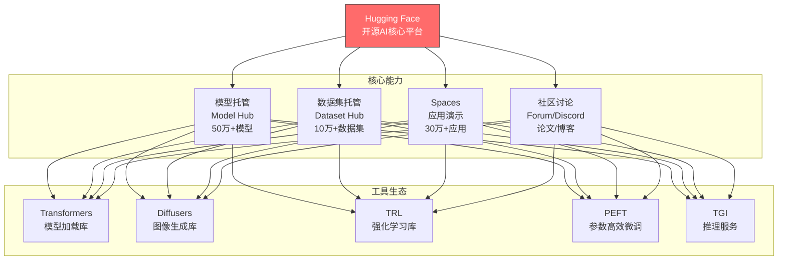
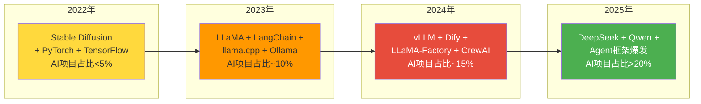
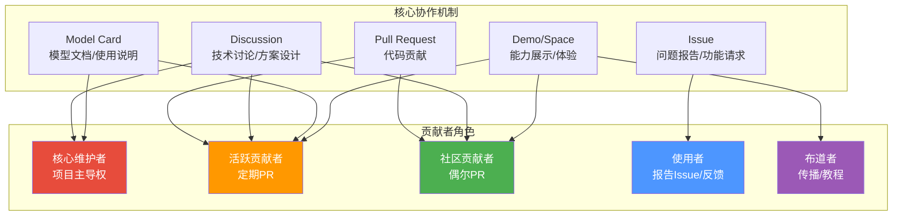
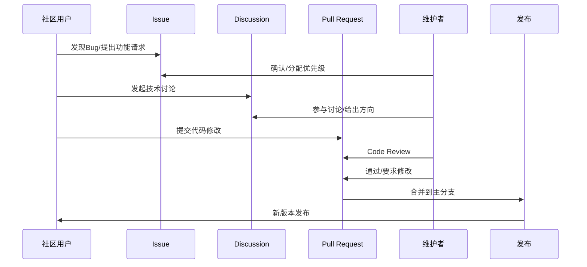
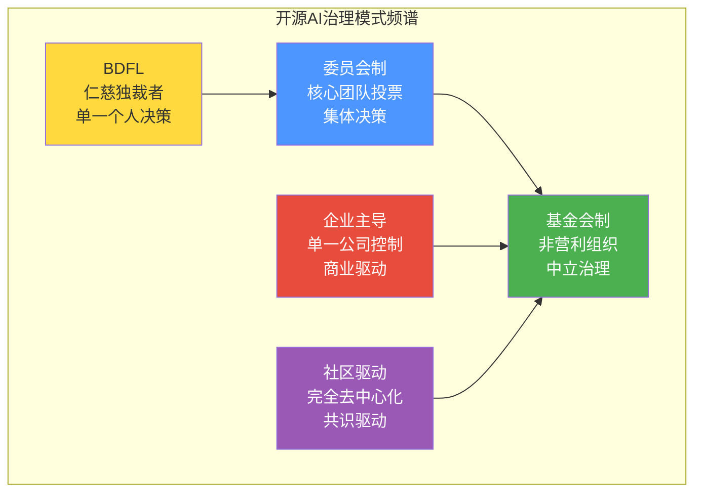
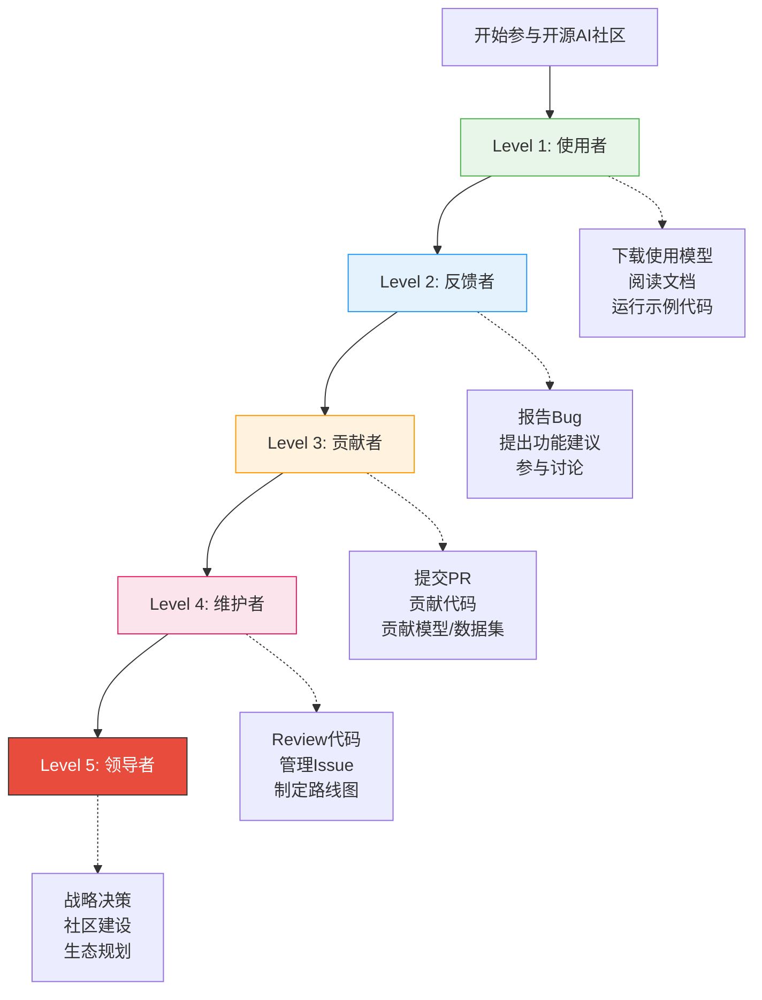
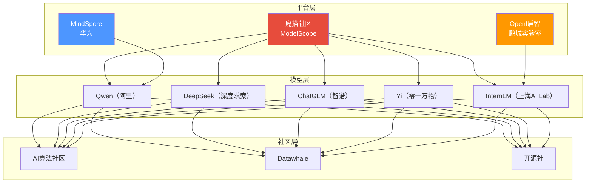

# 开源AI社区与协作模式

> [!abstract] 核心观点
> 开源AI之所以能快速崛起，根本原因在于其独特的社区协作模式。Hugging Face作为"AI的GitHub"，构建了模型分发、协作讨论、基准测试的完整生态。理解开源AI社区的运作机制，是企业参与开源AI、获取社区红利的前提。

---

## 一、Hugging Face：开源AI的"GitHub"

### 1.1 Hugging Face的生态地位

> [!important] Hugging Face的核心价值
> Hugging Face不是简单的"模型托管平台"，而是开源AI生态的**基础设施**。它提供了：
> 1. **模型分发通道**：统一的模型格式和下载机制
> 2. **协作标准**：Model Card、数据集规范、评估基准
> 3. **社区网络效应**：用户越多，生态越强，吸引更多用户
> 4. **技术栈整合**：从训练到推理的完整工具链

### 1.2 Hugging Face的关键数据（2025年）

| 指标 | 数据 |
|:---|:---|
| 托管模型数 | 超过50万个 |
| 托管数据集 | 超过10万个 |
| Spaces应用 | 超过30万个 |
| 月活用户 | 超过500万 |
| 企业客户 | 超过1万家 |
| 估值 | 约45亿美元 |

### 1.3 Hugging Face的商业模式

> [!note] 商业模式
> 详见 [[01-AI技术/开源AI生态全景/06_开源AI的商业化路径]]。Hugging Face的核心商业模式是：**开源平台免费 + 企业服务收费**（Inference API、AutoTrain、企业版Hub）。

---

## 二、GitHub上的AI开源项目态势

### 2.1 AI开源项目的增长趋势

### 2.2 GitHub AI项目热度排行榜

| 项目 | Stars（2025年） | 类别 | 关键特征 |
|:---|:---|:---|:---|
| **transformers** | 150K+ | 模型库 | Hugging Face核心库 |
| **pytorch** | 90K+ | 框架 | Meta开源深度学习框架 |
| **langchain** | 100K+ | Agent框架 | LLM应用开发框架 |
| **ollama** | 120K+ | 推理 | 本地LLM运行 |
| **vllm** | 50K+ | 推理 | 高性能推理引擎 |
| **llama.cpp** | 80K+ | 推理 | CPU/边缘推理 |
| **dify** | 70K+ | Agent平台 | 可视化AI应用平台 |
| **DeepSeek-V3** | 80K+ | 模型 | 高性能开源模型 |
| **Qwen** | 50K+ | 模型 | 阿里开源模型系列 |
| **LLaMA-Factory** | 50K+ | 微调 | 一站式微调框架 |

---

## 三、开源AI的协作模式

### 3.1 协作模式全景

### 3.2 协作流程详解

### 3.3 开源AI协作的独特挑战

> [!warning] 开源AI协作的特殊性
>
> 与传统的开源软件项目不同，开源AI的协作面临一些独特挑战：
>
> 1. **模型权重巨大**：几十GB的模型文件无法通过传统Git管理，需要特殊的存储和分发机制
> 2. **复现性挑战**：模型训练涉及随机性，同一个代码可能产生不同结果
> 3. **算力门槛**：模型训练需要大量GPU资源，限制了个人贡献者的参与
> 4. **安全审查**：模型贡献需要额外的安全审查，防止恶意模型注入
> 5. **数据集版权**：训练数据的版权问题比代码版权更复杂

---

## 四、开源AI的治理模式

### 4.1 五种治理模式

### 4.2 各治理模式的代表与特点

| 治理模式 | 代表项目 | 优势 | 劣势 | 适用场景 |
|:---|:---|:---|:---|:---|
| **BDFL** | llama.cpp | 决策快、方向一致 | 个人风险、可扩展性差 | 早期项目、工具类项目 |
| **委员会制** | vLLM | 多方视角、决策质量高 | 决策慢、可能僵局 | 中型项目、核心基础设施 |
| **基金会制** | PyTorch(LF) | 中立、可信、可持续 | 官僚化、效率低 | 大型项目、行业标准 |
| **企业主导** | LLaMA(Meta) | 资源充足、方向明确 | 社区参与受限、商业利益冲突 | 公司战略产品 |
| **社区驱动** | HuggingFace生态 | 开放、创新快 | 方向分散、资源不稳定 | 平台类、生态类 |

### 4.3 治理模式的实际案例

#### LLaMA的"企业主导+社区反馈"模式

> [!example] LLaMA的治理模式
> Meta对LLaMA拥有完全的控制权（决定何时发布、什么版本、什么协议），但同时积极吸收社区反馈。例如：
> - LLaMA 2的商业友好许可，是社区反馈的结果
> - LLaMA 3的多语言能力提升，部分来自社区的微调经验
> - llama.cpp和Ollama等社区工具，改善了LLaMA的部署体验

#### vLLM的"委员会制"治理

> [!example] vLLM的治理模式
> vLLM由UC Berkeley发起，但核心维护者来自多个机构（NVIDIA、Anyscale、Red Hat等）。决策通过核心团队讨论和投票进行，确保项目不会成为单一公司的工具。

#### Hugging Face的"平台中立"治理

> [!example] Hugging Face的治理模式
> Hugging Face作为平台，不对托管的模型进行"价值判断"。它提供了一个中立的基础设施，让开源AI生态在其上自然生长。这种"平台中立"策略是其成功的核心。

---

## 五、如何参与开源AI社区

### 5.1 参与路径

### 5.2 企业参与开源AI的方式

| 参与方式 | 投入程度 | 收益 | 代表企业 |
|:---|:---|:---|:---|
| **使用开源模型** | 低 | 降低成本、快速验证 | 大多数企业 |
| **反馈和报告** | 低 | 影响项目方向、积累声誉 | 技术人员活跃的企业 |
| **贡献代码/工具** | 中 | 技术影响力、人才吸引 | 字节跳动、美团 |
| **开源自有模型** | 高 | 生态主导权、品牌价值 | 阿里（Qwen）、Meta（LLaMA） |
| **赞助/合作** | 高 | 战略合作、定制化需求 | 微软（Hugging Face合作） |

> [!tip] 企业参与开源AI的ROI
> 企业参与开源AI社区的投资回报体现在：
> 1. **人才吸引**：活跃的开源贡献者是企业最有吸引力的招聘广告
> 2. **技术影响力**：在开源项目中获得话语权，影响技术方向
> 3. **成本分摊**：通过社区协作降低研发和维护成本
> 4. **品牌价值**：技术开源增强企业技术品牌

---

## 六、中国开源AI社区生态

### 6.1 中国开源AI社区图谱

### 6.2 魔搭社区（ModelScope）

魔搭社区是中国版的"Hugging Face"，由阿里达摩院推出：

- **模型托管**：超过3000个模型
- **免费算力**：提供免费GPU用于模型体验
- **中文优先**：中文文档、中文模型、中文社区
- **云生态整合**：与阿里云深度整合

### 6.3 中国开源AI社区的特点

> [!note] 中国开源AI社区的独特之处
>
> 1. **工程创新驱动**：在算力受限的背景下，中国社区更注重架构创新和效率优化
> 2. **中文优先**：中文模型、中文数据集、中文文档
> 3. **国产化需求**：信创、国产化替代驱动开源AI在中国的快速发展
> 4. **云厂商驱动**：阿里云、华为云等云厂商是开源AI的主要推动力
> 5. **数据合规驱动**：数据不出域的需求推动私有化部署

---

## 七、社区参与的最佳实践

> [!success] 开源AI社区参与指南
>
> 1. **先使用，再贡献**：在贡献代码之前，先深入了解项目
> 2. **从小处着手**：从文档修正、Bug报告开始
> 3. **阅读贡献指南**：每个项目都有CONTRIBUTING.md
> 4. **尊重社区文化**：不同的项目有不同的沟通风格
> 5. **持续参与**：单次贡献不如持续参与有价值
> 6. **公开透明**：所有的讨论和决策应公开进行
> 7. **给予credit**：引用他人的工作，尊重知识产权

---

## 八、社区发展趋势

> [!summary] 开源AI社区发展趋势
>
> 1. **平台集中化**：Hugging Face正在成为事实上的行业标准平台
> 2. **治理专业化**：从个人项目走向基金会/委员会治理
> 3. **企业深度参与**：企业不仅是使用者，更是贡献者和主导者
> 4. **安全审查机制完善**：模型安全审查正在成为社区标准流程
> 5. **中国社区崛起**：魔搭社区等中国平台正在形成自己独特的生态
> 6. **跨社区协作**：不同社区之间的协作和标准统一

---

## 相关阅读

- [[01-AI技术/开源AI生态全景/04_开源AI工具链全景]] — 了解社区构建的工具
- [[01-AI技术/开源AI生态全景/06_开源AI的商业化路径]] — 社区如何转化为商业价值
- [[01-AI技术/开源AI生态全景/08_开源AI对企业AI战略的影响]] — 企业如何参与开源AI社区
- [[01-AI技术/开源AI生态全景/00_MOC_开源AI生态全景中枢]] — 返回知识库中枢

---

*最后更新：2026-07-27*