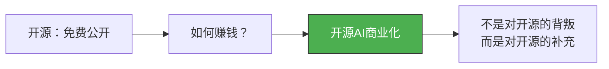
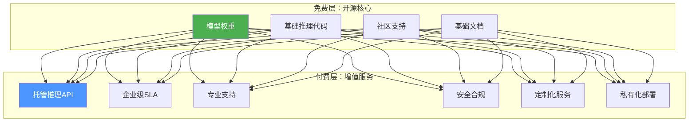
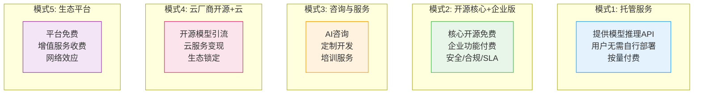
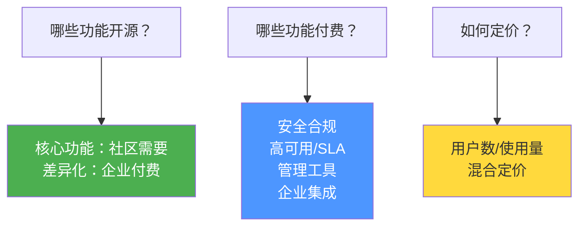
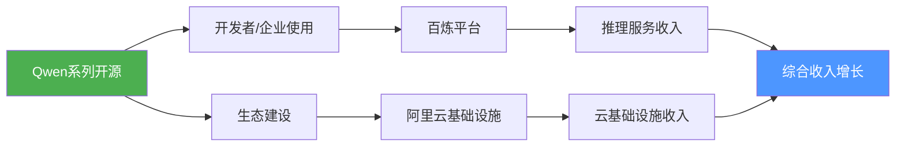
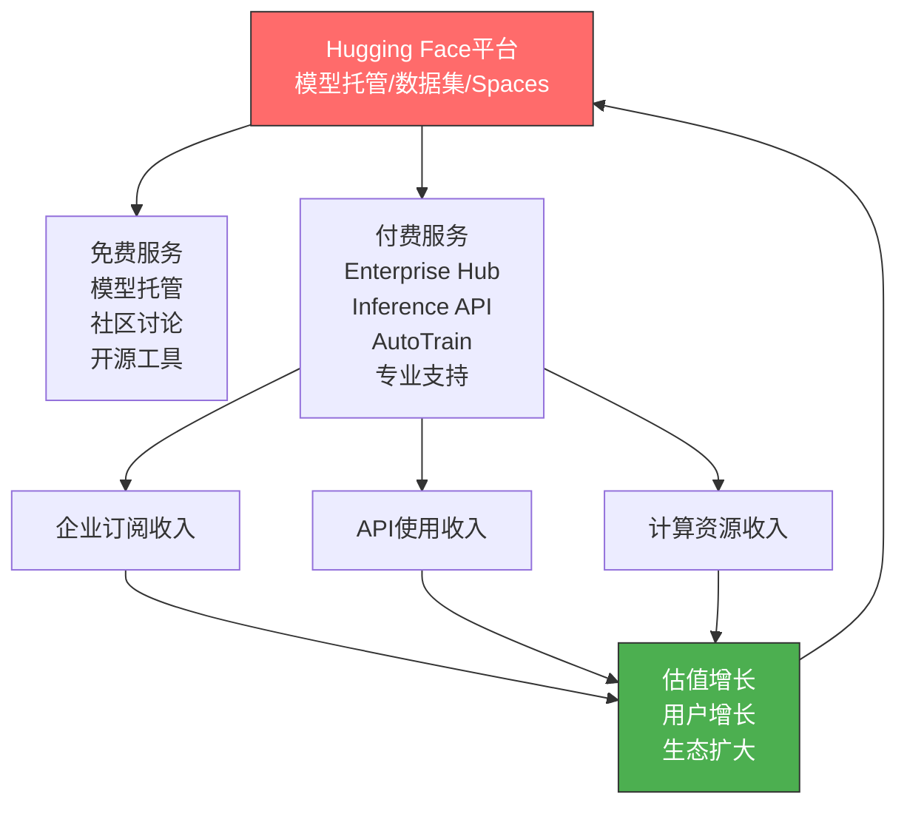
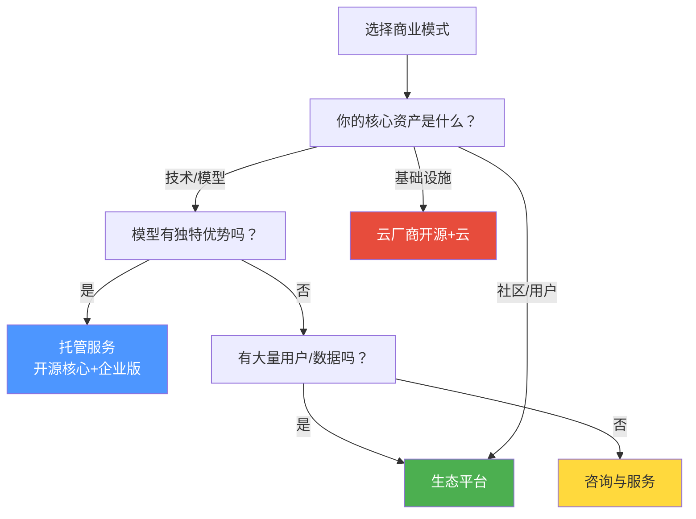

# 开源AI的商业化路径

> [!abstract] 核心观点
> 开源AI不是"免费午餐"，而是"价值捕获"的创新。成功的开源AI商业化不是对开源精神的背叛，而是对开源生态的补充。五种主流商业模式——托管服务、开源核心+企业版、咨询与服务、云厂商"开源+云"、生态平台——各有其适用场景和成功案例。

---

## 一、开源AI商业化的核心矛盾

### 1.1 "开源悖论"

> [!important] 核心认知
> 开源AI的商业化不是"圈地收费"，而是**在开源的基础上提供增值服务**。开源降低了用户获取成本，商业化服务提供了可持续的运营模式。两者不是对立关系，而是互补关系。

### 1.2 开源AI的"免费vs付费"分层

---

## 二、五种主流商业模式

### 2.1 商业模式全景

### 2.2 五种模式详细对比

| 维度 | 托管服务 | 开源核心+企业版 | 咨询与服务 | 云厂商开源+云 | 生态平台 |
|:---|:---|:---|:---|:---|:---|
| **收入模式** | 按量付费 | 订阅制 | 项目制 | 混合 | 混合 |
| **毛利率** | 中 | 高 | 低 | 中 | 高 |
| **可扩展性** | 高 | 高 | 低 | 高 | 极高 |
| **技术壁垒** | 推理优化 | 企业功能 | 专业能力 | 基础设施 | 网络效应 |
| **代表企业** | Together AI | GitLab | 传统IT咨询 | 阿里云 | Hugging Face |
| **适合阶段** | 成长期 | 成熟期 | 早期 | 任何阶段 | 生态成熟期 |

---

## 三、模式一：托管服务

### 3.1 模式概述

> [!info] 托管服务模式
> 模型是开源的，但部署和运维是专业的。用户不需要购买GPU、配置环境、优化推理，只需要通过API调用即可使用开源模型。这是"开源模型+闭源服务"的典型模式。

### 3.2 代表企业

| 企业 | 服务 | 定价模式 | 特色 |
|:---|:---|:---|:---|
| **Together AI** | 开源模型推理API | 按token计费 | 多模型支持、推理优化 |
| **Fireworks AI** | 开源模型推理API | 按token计费 | 极速推理、FireAttention |
| **Groq** | 开源模型推理API | 按token计费 | LPU芯片、极致速度 |
| **Hugging Face** | Inference API | 按小时/按量 | 最全面的模型覆盖 |
| **Replicate** | 模型托管API | 按秒计费 | 开发者友好、Cog格式 |

### 3.3 成功关键

> [!success] 托管服务模式的成功要素
>
> 1. **推理性能**：必须比用户自行部署更快、更便宜
> 2. **模型覆盖**：提供最热门、最新的开源模型
> 3. **开发者体验**：简洁的API、完善的文档
> 4. **规模效应**：通过大规模GPU集群降低单位成本

---

## 四、模式二：开源核心+企业版

### 4.1 模式概述

> [!info] 开源核心+企业版（Open Core）
> 核心功能完全开源免费，企业级功能（安全合规、SLA、审计日志、SSO、高级管理）付费。这是开源软件领域最成熟的商业模式，正在被AI领域借鉴。

### 4.2 代表企业

| 企业 | 开源产品 | 企业版功能 | 企业版定价 |
|:---|:---|:---|:---|
| **Hugging Face** | Transformers/Diffusers | Enterprise Hub | $20/用户/月 |
| **Dify** | 社区版 | 企业版 | 按规模定价 |
| **LangChain** | LangChain开源 | LangSmith | $39/月起 |
| **Weaviate** | 开源向量数据库 | 企业版 | 按规模定价 |

### 4.3 开源核心模式的关键决策

> [!warning] 开源核心模式的风险
> 最大的风险是"开源不够，付费太多"——如果核心功能太弱，用户不会采用；如果免费功能太强，用户不会付费。找到平衡点是关键。

---

## 五、模式三：咨询与服务

### 5.1 模式概述

> [!info] 咨询与服务模式
> 围绕开源AI提供专业服务：AI战略咨询、模型定制微调、私有化部署、培训等。这是传统IT服务模式在AI领域的延伸，毛利率较低但现金流稳定。

### 5.2 代表企业

| 企业 | 服务类型 | 特色 |
|:---|:---|:---|
| **Hugging Face** | 企业AI咨询 | 定制模型、专家服务 |
| **Mistral AI** | 企业定制 | 模型定制、私有化部署 |
| **传统IT咨询（Accenture等）** | AI转型咨询 | 端到端服务 |
| **本地AI服务商** | 私有化部署+培训 | 本地化服务 |

### 5.3 适用场景

> [!tip] 咨询与服务模式适合
> 1. 大型企业的AI转型项目（需要定制化）
> 2. 强监管行业的AI部署（金融、医疗、政务）
> 3. 开源AI的早期市场（教育、培训需求大）
> 4. 作为托管服务和开源核心模式的补充收入

---

## 六、模式四：云厂商"开源+云"

### 6.1 模式概述

> [!info] 云厂商"开源+云"模式
> 这是目前最成功的开源AI商业化路径。云厂商通过开源模型吸引开发者和企业用户，然后通过云服务（模型托管、MLOps、推理优化、企业级SLA）实现商业变现。核心逻辑是：**开源是获客渠道，云服务是利润中心**。

### 6.2 代表企业分析

#### 阿里云：开源+云的典范

**阿里云的成功要素**：
- Qwen系列是中国最受欢迎的开源模型
- 百炼平台提供一站式模型托管和推理服务
- 开源模型与阿里云基础设施的深度整合
- 满足中国企业数据合规需求（私有化部署）

#### 其他云厂商

| 云厂商 | 开源模型 | 云服务 | 策略 |
|:---|:---|:---|:---|
| **阿里云** | Qwen | 百炼平台 | 开源+云双轮驱动 |
| **AWS** | LLaMA等 | SageMaker/Bedrock | 托管第三方开源模型 |
| **Google Cloud** | Gemma | Vertex AI | 自有开源+云服务 |
| **Azure** | LLaMA/Mistral | Azure AI | 托管开源模型 |

### 6.3 为什么"开源+云"模式成功？

> [!success] "开源+云"模式的成功逻辑
>
> 1. **开源降低了获客成本**：开发者通过开源模型了解云平台，迁移成本低
> 2. **云服务提供了不可替代的价值**：模型托管、推理优化、弹性伸缩——这些是开源模型本身无法提供的
> 3. **生态锁定**：一旦技术栈建立在特定云平台上，迁移成本高
> 4. **正循环**：开源模型吸引用户 -> 用户使用云服务 -> 云服务收入支持开源研发 -> 开源模型更好

---

## 七、模式五：生态平台

### 7.1 模式概述

> [!info] 生态平台模式
> 构建一个开源AI的生态平台，通过平台效应吸引用户和开发者，然后通过增值服务（企业版、推理API、数据集、计算资源）实现商业化。Hugging Face是这一模式的代表。

### 7.2 Hugging Face的商业化路径

**Hugging Face的商业模式分层**：
| 层级 | 产品 | 定价 | 目标用户 |
|:---|:---|:---|:---|
| 免费 | 模型托管、Transformers库 | 免费 | 所有开发者 |
| Pro | 更多计算资源、私有模型 | $9/月 | 个人开发者 |
| Enterprise | Enterprise Hub、SSO、审计 | $20/用户/月 | 企业 |
| 推理API | 托管推理服务 | 按使用量 | 需要API的企业 |

---

## 八、成功与失败案例

### 8.1 成功案例

> [!success] Mistral AI：从开源到商业化的典范
>
> Mistral AI在2023年9月发布Mistral 7B（开源），迅速获得全球关注。随后通过以下路径实现商业化：
> 1. **开源引流**：Mistral 7B和Mixtral 8x7B免费开源，建立品牌和社区
> 2. **闭源变现**：Mistral Large通过API提供（闭源），面向企业客户收费
> 3. **合作伙伴**：与Microsoft Azure合作，通过云平台分发
> 4. **融资驱动**：累计融资超过10亿美元，估值超过60亿美元
>
> **关键经验**：小模型开源建立声誉，大模型闭源实现商业化

> [!success] Hugging Face：平台生态的胜利
>
> Hugging Face从2016年的聊天机器人公司，转型为开源AI生态平台，其成功路径：
> 1. **先建生态，后商业化**：前5年专注构建开源生态，不急于商业化
> 2. **平台中立**：不偏向任何模型或公司，成为行业基础设施
> 3. **渐进式商业化**：从免费到Pro到Enterprise，逐步深入
> 4. **网络效应**：模型越多->用户越多->更多模型上传->更强网络效应
>
> **关键经验**：平台模式的核心是网络效应，一旦建立就难以被撼动

### 8.2 失败教训

> [!danger] Stability AI：开源无法弥补商业模式的缺失
>
> Stability AI是Stable Diffusion的发布者，但由于以下原因陷入困境：
> 1. **没有清晰的商业模式**：开源了Stable Diffusion但没有建立可持续的收入来源
> 2. **烧钱过快**：GPU集群成本巨大，但收入远低于支出
> 3. **开源不等于免费**：社区免费使用，但Stability AI承担了大部分成本
> 4. **竞争加剧**：Midjourney用闭源模式实现了更好的商业化
>
> **关键教训**：仅有开源模型是不够的，必须有清晰的商业模式和可持续的收入来源

> [!danger] 开源AI商业化的常见陷阱
>
> 1. **"开源了就能赚钱"的幻觉**：开源只是手段，商业模式才是根本
> 2. **低估部署成本**：用户自行部署开源模型需要大量工程投入
> 3. **过度依赖融资**：AI创业公司需要比传统SaaS更多的前期投入
> 4. **忽视社区建设**：没有社区支持的开源项目难以持续
> 5. **定价失误**：定价过高（用户不用）或过低（无法覆盖成本）

---

## 九、商业化路径选择框架

### 9.1 如何选择商业模式？

### 9.2 不同阶段的商业化策略

| 阶段 | 策略 | 关键动作 |
|:---|:---|:---|
| **早期（0-1年）** | 建立社区 | 开源核心模型、构建开发者社区、建立品牌 |
| **成长期（1-3年）** | 验证商业模式 | 推出托管服务、建立企业客户关系 |
| **成熟期（3-5年）** | 规模化商业 | 企业版、云平台合作、生态扩展 |
| **平台期（5年+）** | 生态变现 | 平台收费、生态合作伙伴、数据服务 |

---

## 十、未来趋势

> [!summary] 开源AI商业化未来趋势
>
> 1. **"开源+云"模式成为主流**：阿里云、AWS、GCP都在复制这一模式
> 2. **托管服务市场爆发**：Together AI、Fireworks AI等推理服务商快速增长
> 3. **"开源核心+企业版"在Agent领域兴起**：Dify、LangChain等平台验证了这一模式
> 4. **AI咨询成为新蓝海**：企业AI转型需求驱动咨询市场增长
> 5. **数据服务成为新收入来源**：高质量数据集、数据标注、数据合成服务
> 6. **开源AI的IPO浪潮**：随着Hugging Face等公司的成熟，开源AI公司开始走向资本市场

---

## 相关阅读

- [[01-AI技术/开源AI生态全景/03_开源vs闭源：战略选择的博弈]] — 理解开源与闭源的战略博弈
- [[01-AI技术/开源AI生态全景/05_开源AI社区与协作模式]] — 了解社区如何驱动商业化
- [[01-AI技术/开源AI生态全景/08_开源AI对企业AI战略的影响]] — 企业如何利用开源AI的商业化
- [[01-AI技术/开源AI生态全景/00_MOC_开源AI生态全景中枢]] — 返回知识库中枢

---

*最后更新：2026-07-27*