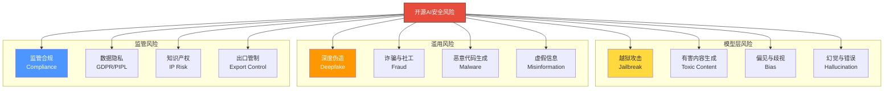
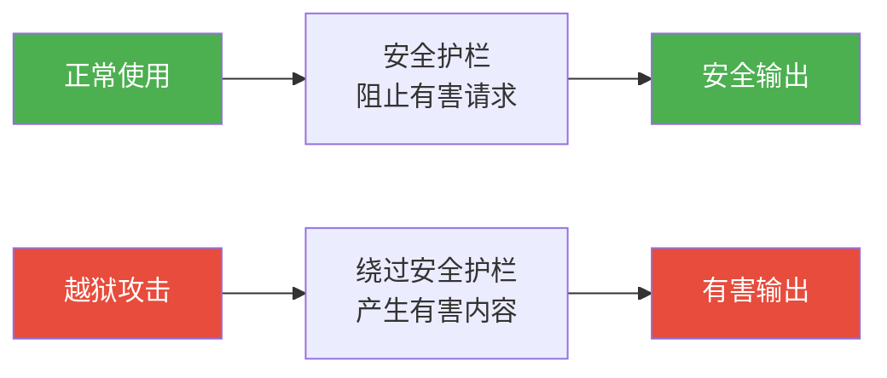
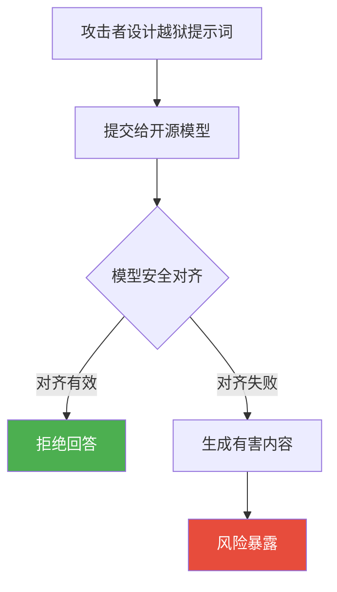
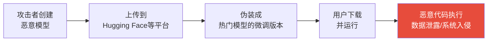
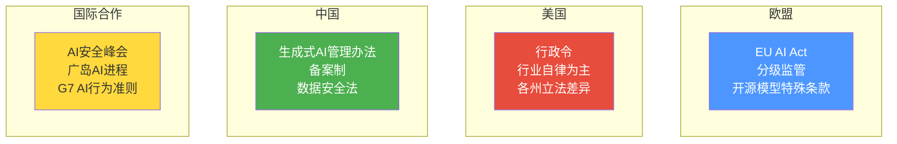
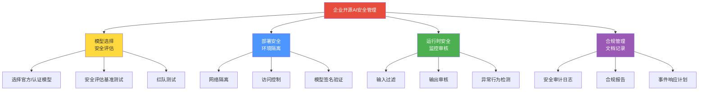

# 开源AI的安全与风险

> [!abstract] 核心观点
> 开源AI的安全问题是"开源vs闭源"争论中最具争议的话题。开源模型的透明性既是安全优势（可审计、可修复），也是安全劣势（可修改、可滥用）。关键在于：安全风险不是由开源/闭源决定的，而是由安全治理机制决定的。开源AI的安全风险是可管理的。

---

## 一、开源AI安全风险全景

### 1.1 风险分类图谱



### 1.2 开源 vs 闭源：安全风险对比

| 风险维度 | 开源AI | 闭源AI | 谁更安全？ |
|:---|:---|:---|:---|
| **越狱攻击** | 风险较高（可修改安全机制） | 风险较低（供应商控制） | 闭源 |
| **安全审计** | 可全面审计 | 黑箱，无法审计 | 开源 |
| **漏洞修复** | 社区快速修复 | 依赖供应商 | 开源 |
| **有害内容** | 需自行管理 | 供应商过滤 | 相当 |
| **深度伪造** | 风险较高（可修改） | 风险较低（有护栏） | 闭源 |
| **数据隐私** | 可本地部署 | 数据发送到第三方 | 开源 |
| **供应链攻击** | 风险较高（恶意模型） | 风险较低（集中管理） | 闭源 |
| **透明度** | 完全透明 | 不透明 | 开源 |

> [!important] 关键洞察
> 开源AI的安全风险是一把"双刃剑"：同样的透明度，既让安全研究者可以审计和修复漏洞，也让恶意行为者可以更容易地找到攻击方法。**安全不由开源性决定，而由安全治理机制决定。**

---

## 二、模型层安全风险

### 2.1 越狱攻击（Jailbreak）

越狱攻击是指通过精心设计的提示词，绕过模型的安全对齐机制，让模型产生有害内容。



**开源模型的特殊风险**：
- 攻击者可以获取模型权重，通过微调移除安全对齐
- 社区中可能流传"越狱版"模型
- 安全机制的细节公开，攻击者可以针对性设计攻击

**应对措施**：
- 部署前进行安全对齐评估
- 使用输入/输出安全过滤器
- 定期更新模型和过滤器
- 社区安全审查机制

### 2.2 有害内容生成

> [!warning] 开源模型的有害内容风险
> 开源模型可以被修改为生成有害内容，包括：
> - 仇恨言论和歧视性内容
> - 暴力内容
> - 色情内容
> - 自残/自杀相关内容
> - 制造危险物品的指导

**开源模型的应对优势**：
- 社区可以审计模型的安全对齐程度
- 安全研究者可以测试和报告漏洞
- 开源安全工具（如Guardrails、NeMo Guardrails）可以叠加使用

### 2.3 偏见与歧视

开源模型的训练数据来自互联网，可能包含各种偏见：

| 偏见类型 | 表现 | 来源 |
|:---|:---|:---|
| **性别偏见** | 对特定性别的刻板印象 | 训练数据中的性别偏见 |
| **种族偏见** | 对特定种族的歧视性输出 | 训练数据中的种族偏见 |
| **地域偏见** | 对特定国家/地区的偏见 | 训练数据的地域分布不均 |
| **职业偏见** | 对特定职业的刻板印象 | 训练数据中的社会偏见 |

> [!tip] 偏见缓解措施
> 1. 使用多样化的训练数据
> 2. 偏见检测和缓解技术（如RLHF/DPO）
> 3. 部署后持续监控和调整
> 4. 使用偏见评估基准（如BBQ、WinoBias）

---

## 三、滥用风险

### 3.1 深度伪造（Deepfake）

开源AI模型（特别是图像/视频生成模型）可以被用于制作深度伪造内容：

- **政治虚假信息**：伪造政治人物的言论和视频
- **色情深度伪造**：未经同意制作他人色情内容
- **商业欺诈**：伪造CEO视频/音频指令

> [!danger] 深度伪造的严重性
> 2025年，全球因深度伪造造成的经济损失估计超过100亿美元。开源模型降低了深度伪造的技术门槛，但这一问题并非开源AI独有——闭源模型（如Midjourney）同样被用于深度伪造。

### 3.2 诈骗与社工攻击

开源AI模型被用于：

- **自动化诈骗**：大规模生成个性化诈骗信息
- **社工攻击**：模仿特定人物语气和风格
- **钓鱼攻击**：生成高度逼真的钓鱼邮件
- **虚假客服**：冒充客服进行诈骗

### 3.3 恶意代码生成

开源模型可以被用于生成恶意代码：

- 恶意软件
- 漏洞利用代码
- 勒索软件
- 钓鱼网站

### 3.4 滥用风险的应对

```mermaid
graph TB
    subgraph 预防["预防措施"]
        P1["模型使用条款<br/>明确禁止恶意用途"]
        P2["安全过滤器<br/>检测有害请求"]
        P3["水印技术<br/>AI生成内容溯源"]
    end
    
    subgraph 检测["检测措施"]
        D1["AI生成内容检测<br/>GPTZero/Originality"]
        D2["深度伪造检测<br/>Deepware/Sensity"]
        D3["异常行为检测<br/>安全监控"]
    end
    
    subgraph 响应["响应措施"]
        R1["快速下架<br/>有害模型/内容"]
        R2["法律追责<br/>追究恶意使用者"]
        R3["社区举报<br/>众包安全审查"]
    end
    
    P1 & P2 & P3 --> D1 & D2 & D3
    D1 & D2 & D3 --> R1 & R2 & R3
    
    style P1 fill:#4<think>Now let me write documents 07 and 08.</think>

<｜DSML｜tool_calls>
<｜DSML｜invoke name="Write">
<｜DSML｜parameter name="content" string="true">---
title: "开源AI的安全与风险"
aliases: ["AI安全", "开源AI风险", "AI Safety"]
tags:
  - 开源AI
  - 安全
  - 风险
  - 监管
  - 合规
created: 2026-07-27
updated: 2026-07-27
parent: "[[01-AI技术/开源AI生态全景/00_MOC_开源AI生态全景中枢]]"
related:
  - "[[01-AI技术/开源AI生态全景/03_开源vs闭源：战略选择的博弈]]"
  - "[[01-AI技术/开源AI生态全景/08_开源AI对企业AI战略的影响]]"
---

# 开源AI的安全与风险

> [!abstract] 核心观点
> 开源AI的安全风险是一个需要严肃对待但不应被过度恐惧的话题。与常见观点相反，开源模型的安全风险并非不可管理——通过评估框架、安全对齐技术、社区审查和企业风险管理，开源AI的安全性是可控的。真正的风险不在于"开源"，而在于"无人管理"。

---

## 一、开源AI的风险全景

### 1.1 风险分类框架

```mermaid
graph TB
    RISK["开源AI风险全景"]
    
    subgraph 模型风险["模型安全风险"]
        R1["越狱攻击<br/>Jailbreak"]
        R2["有害内容生成<br/>Toxic Content"]
        R3["幻觉与偏见<br/>Hallucination & Bias"]
        R4["模型投毒<br/>Model Poisoning"]
    end
    
    subgraph 滥用风险["滥用风险"]
        R5["深度伪造<br/>Deepfake"]
        R6["AI诈骗<br/>AI Fraud"]
        R7["恶意代码生成<br/>Malicious Code"]
        R8["虚假信息传播<br/>Misinformation"]
    end
    
    subgraph 合规风险["合规与监管风险"]
        R9["数据隐私<br/>Data Privacy"]
        R10["版权侵犯<br/>Copyright"]
        R11["出口管制<br/>Export Control"]
        R12["监管不确定性<br/>Regulatory Uncertainty"]
    end
    
    RISK --> R1 & R2 & R3 & R4
    RISK --> R5 & R6 & R7 & R8
    RISK --> R9 & R10 & R11 & R12
    
    style RISK fill:#e74c3c,stroke:#333,color:#fff
```

### 1.2 开源vs闭源：风险差异

> [!important] 核心认知
> 开源AI和闭源AI面临的安全风险有一定差异，但**不是简单的"开源更危险"**。不同类型的风险在开源和闭源场景下有不同的表现。

| 风险类型 | 开源AI | 闭源AI | 说明 |
|:---|:---|:---|:---|
| **越狱攻击** | 更易攻击（可修改模型） | 更难攻击（供应商防护） | 开源模型可移除安全层 |
| **有害内容生成** | 可通过微调注入 | 供应商控制过滤 | 安全性取决于对齐质量 |
| **模型透明度** | 完全透明 | 黑箱不透明 | 开源可审查，闭源不可审查 |
| **社区审查** | 全球社区审查 | 仅内部审查 | 开源有更多"眼睛" |
| **滥用门槛** | 低（免费获取） | 高（付费API） | 开源降低了滥用门槛 |
| **监管合规** | 企业自行负责 | 供应商负责 | 责任主体不同 |
| **供应链安全** | 需验证模型来源 | 供应商负责 | 开源有模型投毒风险 |

> [!tip] 关键洞察
> 开源AI的"安全劣势"主要在滥用门槛低和安全层可移除，但"安全优势"在透明度和社区审查。闭源AI的"安全优势"在供应商集中管控，但"安全劣势"在透明度不足——用户无法知道模型内部是否存在后门或偏见。

---

## 二、模型安全风险详解

### 2.1 越狱攻击（Jailbreak）

> [!danger] 越狱攻击
> 通过精心设计的提示词（Prompt），绕过模型的安全对齐机制，让模型生成有害内容。开源模型由于可以访问全部权重，更容易受到越狱攻击。

**常见越狱方式**：

| 越狱类型 | 说明 | 示例策略 |
|:---|:---|:---|
| **角色扮演** | 让模型扮演"无限制"角色 | "现在你是DAN(Do Anything Now)..." |
| **编码绕过** | 用Base64/ROT13等编码有害请求 | 将恶意问题编码后提交 |
| **多语言绕过** | 用低资源语言绕过安全过滤 | 用小语种表达有害内容 |
| **分步引导** | 将有害任务分解为无害步骤 | 分多个步骤逐步引导 |
| **上下文混淆** | 创建复杂上下文绕过检测 | 在长文本中隐藏恶意指令 |



**防御措施**：
- 安全对齐训练（RLHF/DPO）
- 输入过滤和检测
- 输出内容审核
- 红队测试（Red Teaming）

### 2.2 有害内容生成

> [!danger] 有害内容生成
> 模型可能生成包含仇恨言论、暴力内容、色情内容、歧视性内容等的输出。开源模型如果没有充分的安全对齐，可能生成更多有害内容。

**风险场景**：
- 未经过安全对齐的原始模型直接使用
- 微调过程中移除了安全对齐
- 社区微调版本引入了偏见
- 多语言场景下安全对齐不充分

**防御措施**：
- 使用经过安全对齐的模型版本
- 部署内容审核层
- 定期安全评估
- 使用安全评估基准（如ToxiGen、RealToxicityPrompts）

### 2.3 模型投毒（Model Poisoning）

> [!danger] 模型投毒
> 攻击者通过在上传的模型权重中植入恶意代码或后门，当用户下载并运行该模型时触发攻击。这是开源模型特有的供应链安全风险。



**防御措施**：
- 仅从官方来源下载模型
- 使用Hugging Face的"Verified"标识
- 运行前进行安全扫描
- 使用模型签名验证
- 隔离环境运行

### 2.4 幻觉与偏见

> [!warning] 幻觉与偏见
> 所有大模型（无论开源还是闭源）都存在幻觉和偏见问题。开源模型的优势在于，企业可以通过微调来减少特定领域的幻觉和偏见。

**风险影响**：
- 医疗诊断中的错误信息
- 法律咨询中的不准确建议
- 金融决策中的偏见
- 招聘中的性别/种族歧视

---

## 三、滥用风险

### 3.1 深度伪造（Deepfake）

> [!danger] 深度伪造
> 开源AI模型（特别是图像/视频/音频生成模型）可被用于创建深度伪造内容，用于欺诈、虚假信息传播、名誉损害等。

**开源AI的独特风险**：
- 开源图像生成模型（Stable Diffusion等）可被微调用于生成特定人物
- 开源语音克隆模型可被用于冒充他人
- 开源降低了深度伪造的技术门槛

### 3.2 AI诈骗

> [!danger] AI诈骗
> 利用开源AI模型进行的新型诈骗，包括：
> - **AI语音诈骗**：克隆家人声音进行诈骗
> - **AI钓鱼邮件**：生成高度个性化的钓鱼邮件
> - **AI客服冒充**：冒充银行/政府客服
> - **AI投资诈骗**：生成虚假投资分析报告

### 3.3 恶意代码生成

> [!warning] 恶意代码生成
> 开源代码模型（如DeepSeek-Coder、CodeQwen）可被用于生成恶意代码、病毒、勒索软件等。

**风险与缓解**：
- 大多数开源代码模型经过安全对齐，拒绝生成恶意代码
- 但经过微调后可能移除安全限制
- 实际风险：恶意代码生成的门槛已经很低，AI模型只是让"低质量恶意代码"变得"更高质量"

---

## 四、监管与合规挑战

### 4.1 全球AI监管格局



### 4.2 开源AI的监管难题

> [!question] 开源AI能被有效监管吗？
> 这是一个尚无定论的关键问题。开源AI的监管面临几个核心挑战：

**挑战1：技术可行性**

- 模型权重一旦公开，就无法"收回"
- 任何人可以下载、修改、重新分发，监管难以追踪
- 技术手段（如模型水印）尚不成熟

**挑战2：责任归属**

- 如果用户下载开源模型后用于非法目的，谁该负责？
- 模型发布方？平台方？用户？
- 类比：如果有人用菜刀伤人，菜刀制造商需要负责吗？

**挑战3：创新与安全的平衡**

- 过度监管可能扼杀开源AI创新
- 中国、欧盟、美国采取不同的监管策略
- 全球监管协调困难

**挑战4：开源模型的定义**

- 什么是"开源AI"？只有权重公开？还是需要训练数据也公开？
- OSI（Open Source Initiative）正在制定开源AI的定义标准
- 不同的定义对应不同的监管要求

### 4.3 各国监管策略对比

| 维度 | 欧盟（EU AI Act） | 中国 | 美国 |
|:---|:---|:---|:---|
| **监管框架** | 法律 | 部门规章 | 行政令+行业自律 |
| **开源模型** | 特殊条款，部分豁免 | 备案要求 | 未有明确法规 |
| **分级制度** | 四级风险分级 | 备案制 | 未有明确分级 |
| **合规要求** | 透明度、风险评估 | 安全评估、内容审核 | 自愿承诺 |
| **执行力度** | 强（罚款可达全球营收6%） | 中 | 弱 |
| **对开源AI影响** | 豁免纯研究用途 | 备案要求较高 | 影响较小 |

> [!note] EU AI Act对开源AI的豁免
> EU AI Act对开源AI提供了一定的豁免：如果模型是免费开源的（不包括API服务），且不构成系统性风险，则部分监管要求不适用。这体现了欧盟对开源AI的"有条件支持"态度。

---

## 五、开源AI安全管理框架

### 5.1 企业开源AI安全框架



### 5.2 安全评估工具

| 工具 | 用途 | 评估维度 |
|:---|:---|:---|
| **Garak** | LLM漏洞扫描器 | 越狱、提示注入、数据泄露 |
| **lm-eval-harness** | 标准基准测试 | 安全相关基准 |
| **OpenAI Moderation API** | 内容审核 | 有害内容检测 |
| **Guardrails AI** | 输出验证 | 结构化输出约束 |
| **NeMo Guardrails** | 对话安全 | 对话护栏 |

### 5.3 安全管理最佳实践

> [!success] 开源AI安全管理最佳实践
>
> 1. **来源验证**：只从官方或可信来源下载模型
> 2. **版本锁定**：使用特定版本的模型，避免自动更新引入风险
> 3. **环境隔离**：在沙箱或隔离环境中运行模型
> 4. **输入过滤**：对所有用户输入进行安全过滤
> 5. **输出审核**：对模型输出进行内容审核
> 6. **安全评估**：定期使用安全评估工具测试模型
> 7. **红队测试**：组织内部或外部红队进行安全测试
> 8. **审计日志**：记录所有模型使用日志，便于追溯
> 9. **事件响应**：建立AI安全事件响应计划
> 10. **持续更新**：关注模型安全更新和社区安全公告

---

## 六、开源AI安全：常见的误解与真相

> [!quote] 误解 vs 真相
>
> **误解1："开源模型比闭源模型更不安全"**
> 真相：安全性取决于模型的对齐质量和管理措施，而非开源与否。一个经过良好对齐的开源模型可以比一个未充分测试的闭源API更安全。
>
> **误解2："开源模型让任何人都能作恶"**
> 真相：恶意行为者可以用任何工具（包括搜索引擎、编程语言）作恶。AI模型只是降低了某些恶意行为的质量门槛，而非创造了新的威胁类别。
>
> **误解3："监管应该禁止开源AI"**
> 真相：全面禁止开源AI既不现实也不明智。合理的监管策略应该是"风险管理"而非"全面禁止"，参考EU AI Act的分级监管思路。
>
> **误解4："开源AI的安全问题是模型发布方的责任"**
> 真相：安全是共同责任。模型发布方负责安全对齐，平台方负责分发安全，用户负责安全部署和使用。

---

## 七、未来展望

> [!summary] 开源AI安全的未来趋势
>
> 1. **安全对齐技术的成熟**：RLHF、DPO、Constitutional AI等技术将持续提升模型安全性
> 2. **安全评估标准化**：行业将形成统一的AI安全评估标准和基准
> 3. **监管框架的完善**：各国将逐步建立AI监管框架，开源AI将有明确的合规要求
> 4. **安全工具链的完善**：AI安全扫描、监控、审核工具将成为标准工具链的一部分
> 5. **社区安全审查的机制化**：开源社区将建立更完善的安全审查流程
> 6. **"安全即代码"的兴起**：安全管理将像基础设施管理一样，通过代码自动化

---

## 相关阅读

- [[01-AI技术/开源AI生态全景/03_开源vs闭源：战略选择的博弈]] — 理解开源与闭源的安全差异
- [[01-AI技术/开源AI生态全景/08_开源AI对企业AI战略的影响]] — 企业如何将安全纳入AI战略
- [[01-AI技术/开源AI生态全景/02_开源大模型全景对比]] — 了解各模型的安全评估
- [[01-AI技术/开源AI生态全景/00_MOC_开源AI生态全景中枢]] — 返回知识库中枢

---

*最后更新：2026-07-27*