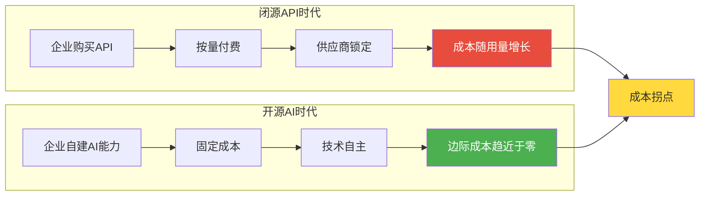
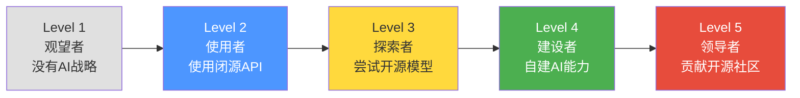
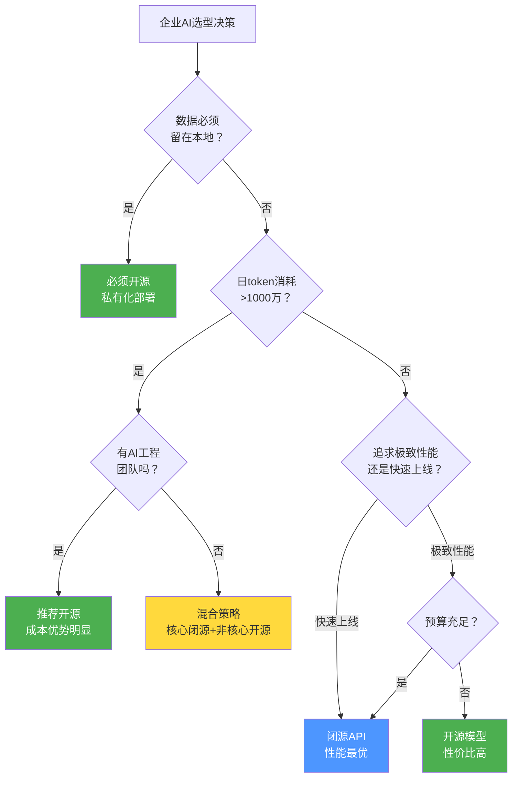
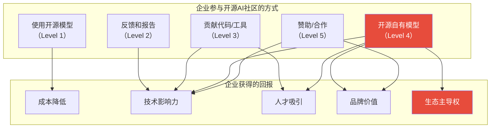
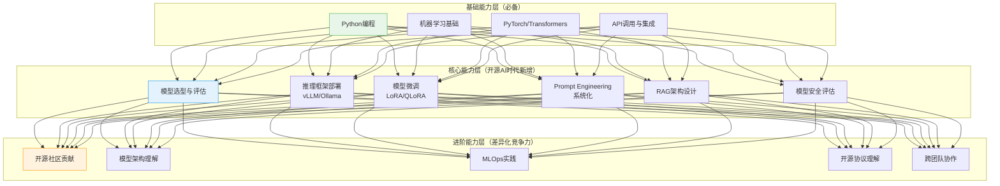
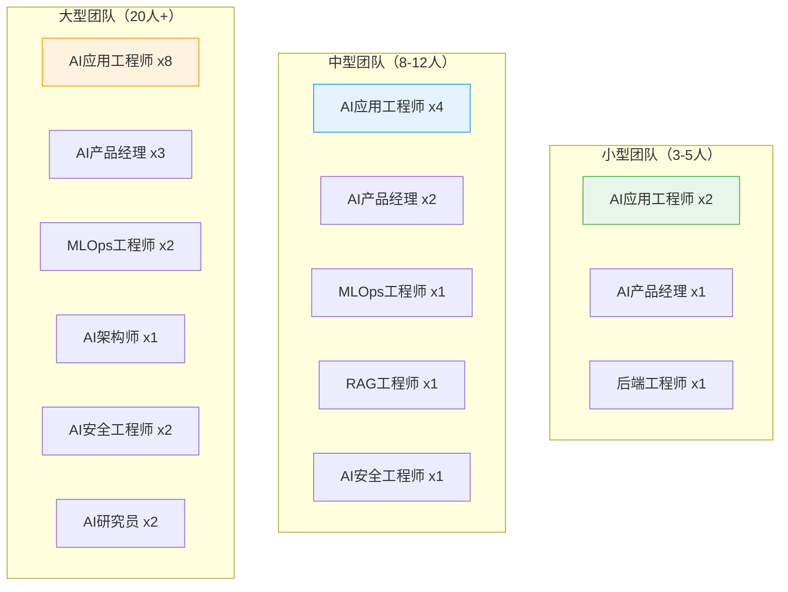
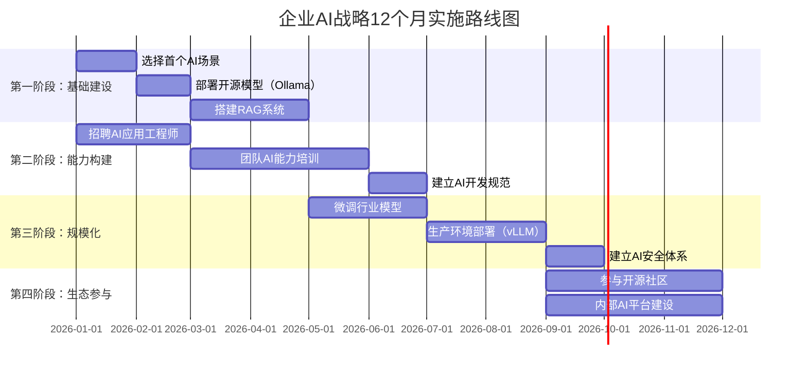

# 开源AI对企业AI战略的影响

> [!abstract] 核心观点
> 开源AI正在从根本上改变企业的AI战略——不是"要不要用AI"的问题，而是"如何将开源AI融入企业AI战略"的问题。开源AI降低了AI应用的门槛，同时也改变了企业AI人才的画像。HR需要重新思考：在开源AI时代，企业需要什么样的AI人才？

---

## 一、开源AI如何重新定义企业AI战略

### 1.1 从"买AI"到"建AI"

> [!important] 范式转变
> 开源AI将企业的AI应用模式从"租赁"转变为"自建"。这类似于云计算时代：企业可以选择租用公有云（闭源API），也可以选择自建私有云（开源模型）。不同的是，AI的自建成本正在快速下降。

### 1.2 开源AI对企业AI战略的五大影响

| 影响维度 | 具体变化 | 战略意义 |
|:---|:---|:---|
| **成本结构** | 从可变成本到固定成本 | 大规模使用时，开源模型总成本更低 |
| **技术自主** | 从依赖供应商到自主可控 | 不受供应商定价和策略变化影响 |
| **数据安全** | 数据可本地处理 | 满足金融、医疗等强监管行业需求 |
| **定制能力** | 可深度定制模型 | 构建行业壁垒和差异化优势 |
| **创新速度** | 借助社区创新 | 享受全球开发者社区的创新红利 |

### 1.3 企业AI战略成熟度模型

| 成熟度 | 特征 | 典型行为 | 建议下一步 |
|:---|:---|:---|:---|
| **Level 1** | 没有AI战略 | 观望 | 开始小范围试点闭源API |
| **Level 2** | 使用闭源API | ChatGPT/GPT-4 API | 评估开源模型在非核心场景的可行性 |
| **Level 3** | 尝试开源模型 | 部署Ollama/Qwen | 建立AI工程团队，构建AI基础设施 |
| **Level 4** | 自建AI能力 | 私有化部署+微调 | 制定开源贡献策略 |
| **Level 5** | 贡献开源社区 | 开源模型/工具 | 引领行业标准，吸引顶级人才 |

---

## 二、企业选择开源vs闭源的决策框架

### 2.1 决策矩阵

### 2.2 按行业推荐的AI策略

| 行业 | 推荐策略 | 优先模型 | 关键考量 |
|:---|:---|:---|:---|
| **金融** | 开源为主 | Qwen/DeepSeek | 数据隐私、合规、私有化部署 |
| **医疗** | 开源为主 | Qwen/LLaMA | 患者数据保护、可解释性 |
| **政务** | 纯开源 | Qwen/DeepSeek | 国产化、数据安全、信创 |
| **互联网** | 混合策略 | GPT-4o + Qwen/LLaMA | 性能与成本平衡 |
| **制造** | 开源为主 | Qwen 7B/Mistral 7B | 边缘部署、成本控制 |
| **教育** | 开源为主 | Qwen/Yi | 成本优先、可定制 |
| **零售** | 混合策略 | 闭源API + 开源模型 | 快速上线+成本优化 |

### 2.3 小型企业 vs 大型企业的策略差异

| 维度 | 小型企业 | 大型企业 |
|:---|:---|:---|
| **首选策略** | 闭源API为主 | 混合策略 |
| **开源模型角色** | 辅助/探索 | 核心基础设施 |
| **部署方式** | 托管服务/云服务 | 私有化部署+云服务 |
| **团队需求** | 1-2名AI工程师 | 5-20人AI团队 |
| **关键考量** | 快速上线、成本可控 | 技术自主、数据安全 |
| **推荐模型** | Qwen 7B + GPT-4o API | Qwen 2.5-Max + DeepSeek-R1 |

---

## 三、企业参与开源AI社区的方式与价值

### 3.1 参与方式与价值

### 3.2 企业参与开源AI的ROI分析

| 参与方式 | 投入 | 直接回报 | 间接回报 | 推荐度 |
|:---|:---|:---|:---|:---|
| **使用开源模型** | 部署成本 | 降低API费用50-80% | 技术积累 | 强烈推荐 |
| **反馈Bug/建议** | 人力（少量） | 影响项目方向 | 社区声誉 | 推荐 |
| **贡献代码** | 人力（持续） | 技术影响力 | 人才吸引、品牌 | 推荐 |
| **开源模型** | 研发+算力 | 生态主导权 | 人才吸引、品牌 | 大型企业推荐 |
| **赞助/合作** | 资金 | 定制化服务 | 战略合作关系 | 按需推荐 |

---

## 四、HR视角：开源AI对人才需求的影响

### 4.1 AI人才需求的根本性变化

> [!important] HR核心洞察
> 开源AI的崛起正在从根本上改变企业对AI人才的需求画像。传统的"AI人才 = 算法工程师"的等式已经过时。在开源AI时代，企业需要的是**"AI应用工程师"**——能够选择、部署、微调、优化开源模型，并将其集成到业务中的复合型人才。

### 4.2 新型AI人才能力模型

### 4.3 传统AI人才 vs 开源AI时代人才

| 维度 | 传统AI人才（2020年前） | 开源AI时代人才（2025年后） |
|:---|:---|:---|
| **核心技能** | 算法研究、模型训练 | 模型选型、微调、部署 |
| **技术栈** | TensorFlow/PyTorch | vLLM/Ollama/LangChain |
| **工作方式** | 从零训练模型 | 基于开源模型微调 |
| **数学要求** | 高（推导公式） | 中（理解原理即可） |
| **工程能力** | 中等 | 高（部署、优化、集成） |
| **产品思维** | 低 | 高（AI如何服务业务） |
| **开源参与** | 偶尔 | 重要加分项 |
| **学历要求** | 硕士/博士 | 本科+实践经验 |
| **薪资范围** | 高（稀缺） | 中高（供给增加） |

> [!tip] HR招聘策略调整
> 在开源AI时代，HR应该：
> 1. **降低学历门槛**：本科学历+开源AI实践经验 > 硕士学历+无实践经验
> 2. **重视GitHub/Hugging Face**：候选人的开源贡献是比学历更可靠的信号
> 3. **看重工程能力**：能部署和优化模型 > 能推导公式
> 4. **关注产品思维**：理解AI如何解决业务问题 > 理解AI算法原理

### 4.4 开源AI时代的高价值岗位

| 岗位 | 核心职责 | 关键技能 | 市场需求 |
|:---|:---|:---|:---|
| **AI应用工程师** | 选型、部署、微调开源模型 | vLLM/LangChain/微调 | 极高 |
| **AI产品经理** | AI产品设计、场景定义 | AI理解+产品思维 | 高 |
| **MLOps工程师** | AI基础设施运维 | Docker/K8s/MLflow | 高 |
| **AI安全工程师** | 模型安全评估、红队测试 | 安全+AI | 快速增长 |
| **RAG工程师** | 检索增强生成系统设计 | 向量数据库/Embedding | 高 |
| **AI架构师** | 企业AI基础设施规划 | 全栈AI能力 | 极高 |

### 4.5 企业AI团队建设建议

### 4.6 开源AI社区经验在招聘中的价值评估

> [!tip] 招聘评估指南
>
> **高价值信号**（强烈加分）：
> - Hugging Face上有发布的模型（即使只有几十个下载）
> - GitHub上有开源AI工具/项目的贡献记录
> - 在开源AI社区（GitHub Discussions/Discord）中活跃参与
> - 有个人AI项目（Blog/视频/教程）
>
> **中价值信号**（加分）：
> - 在Hugging Face上使用过多种模型并有对比分析
> - 参加过开源AI相关的Hackathon
> - 有AI相关的技术博客
>
> **低价值信号**（谨慎参考）：
> - 仅有AI相关课程证书，无实践经验
> - 仅有学历，无开源AI实践经验
> - 仅有理论学习，无实际部署经验
>
> **红旗信号**（需要警惕）：
> - 声称"精通所有AI模型"但无具体实践
> - 无法回答"你最近用过哪个开源模型？"的基本问题

---

## 五、企业AI战略实施路线图

### 5.1 12个月实施路线图

### 5.2 关键里程碑与检查点

| 时间节点 | 里程碑 | 成功标准 | 风险提示 |
|:---|:---|:---|:---|
| **第1个月** | 首个AI场景确定 | 业务需求明确、ROI可量化 | 场景选择过于宏大 |
| **第3个月** | 首个AI应用上线 | 用户满意度>70% | 性能不达预期 |
| **第6个月** | 团队能力成型 | 团队可独立开发和运维 | 人才招聘困难 |
| **第9个月** | 生产环境部署 | 可用性>99.5% | 安全和合规风险 |
| **第12个月** | 社区参与启动 | 首次开源贡献 | 知识产权风险 |

---

## 六、案例研究

### 6.1 案例一：金融企业AI战略

> [!example] 某中型银行的开源AI转型
>
> **背景**：某中型银行，日均客服咨询量10万+，需在数据不出域的前提下实现智能客服。
>
> **策略**：
> 1. 选择Qwen 2.5 72B作为基础模型，私有化部署
> 2. 使用LLaMA-Factory对模型进行金融领域微调
> 3. 搭建RAG系统，接入银行内部知识库
> 4. 部署vLLM作为推理引擎
>
> **成果**：
> - 客服自动化率从15%提升到65%
> - 客服成本降低40%
> - 数据完全在本地处理，满足监管要求
> - 团队从2人扩展到8人

### 6.2 案例二：互联网企业混合策略

> [!example] 某电商平台的AI混合策略
>
> **背景**：某中型电商平台，需要AI支持商品描述、客服、推荐等多个场景。
>
> **策略**（混合策略）：
> - 核心场景（商品推荐）：使用闭源GPT-4o API，确保最佳性能
> - 非核心场景（商品描述、客服）：使用开源Qwen 2.5 7B
> - 模型路由：根据任务复杂度自动选择模型
>
> **成果**：
> - 总AI成本降低55%
> - 核心场景性能保持顶级水平
> - 非核心场景用户满意度达到85%

---

## 七、总结与建议

> [!summary] 企业AI战略核心建议
>
> **对于CEO/CTO**：
> 1. 开源AI不是"省钱工具"，而是"战略武器"——它赋予企业技术自主权
> 2. 建议采用混合策略：核心业务用最强模型，非核心业务用开源模型降本
> 3. 关注AI人才建设，开源AI时代的竞争本质是人才的竞争
>
> **对于HR负责人**：
> 1. 重新定义AI人才画像：从"算法研究员"转向"AI应用工程师"
> 2. 将开源社区贡献经验纳入招聘评估体系
> 3. 投资现有团队的AI能力提升，而非完全依赖外部招聘
> 4. 关注AI产品经理、AI安全工程师等新兴岗位
>
> **对于技术负责人**：
> 1. 建立AI基础设施：推理框架、微调平台、MLOps
> 2. 制定开源AI使用规范：模型选择标准、安全审查流程
> 3. 鼓励团队参与开源社区，通过贡献获得技术影响力
> 4. 关注AI安全，建立安全评估和监控体系

---

## 相关阅读

- [[01-AI技术/开源AI生态全景/03_开源vs闭源：战略选择的博弈]] — 深入理解开源与闭源的战略选择
- [[01-AI技术/开源AI生态全景/05_开源AI社区与协作模式]] — 了解如何参与开源AI社区
- [[01-AI技术/开源AI生态全景/06_开源AI的商业化路径]] — 了解开源AI的商业模式
- [[01-AI技术/开源AI生态全景/07_开源AI的安全与风险]] — 了解开源AI的安全管理
- [[01-AI技术/AI Agent 工具/AI_Agent_工具全景对比]] — 了解AI Agent工具选型
- [[02-AI趋势与素养/AI应用发展阶段演进/00_MOC_AI应用发展阶段演进中枢]] — 了解AI应用的发展趋势
- [[01-AI技术/开源AI生态全景/00_MOC_开源AI生态全景中枢]] — 返回知识库中枢

---

*最后更新：2026-07-27*