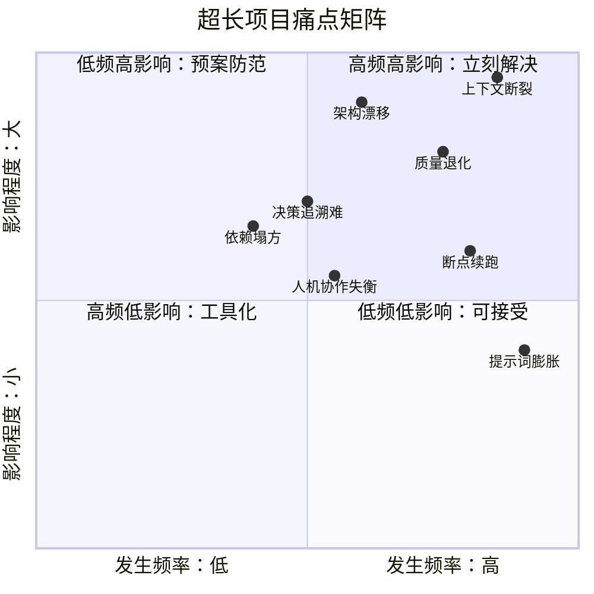
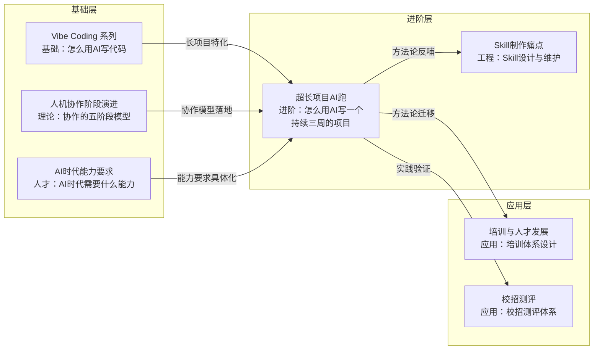

# 超长项目AI跑 — 知识库中枢

> [!abstract] 这个知识库解决什么问题？
> 当你用 AI 开发一个需要跨越多个会话、持续数天甚至数周的项目时，AI 每次都是"新大脑"——不记得上次做了什么决策、为什么这样做、哪些地方容易踩坑。本知识库提供一套**系统方法论**，让你像管理"每天换一个外包程序员"一样管理 AI，确保项目在长周期中不失控、不退化、可持续推进。

---

## 文档导航图

```mermaid
flowchart TD
    MOC["📚 00 中枢<br/>MOC"]:::moc

    subgraph 模块一：问题定义
        P1["01 本质挑战<br/>为什么AI跑长项目这么难？"]:::problem
    end

    subgraph 模块二：方法论核心
        P2["02 上下文管理<br/>AI的记忆体系"]:::method
        P3["03 架构锚点<br/>用Spec锁定AI不乱跑"]:::method
        P4["04 项目拆解<br/>从庞然大物到可消化单元"]:::method
        P5["05 版本控制<br/>渐进式交付"]:::method
        P6["06 测试驱动<br/>让AI自己守护质量"]:::method
        P7["07 跨会话传承<br/>让AI记住上次做了什么"]:::method
    end

    subgraph 模块三：协作模式
        P8["08 协作节奏<br/>谁做什么、何时介入"]:::collab
    end

    subgraph 模块四：实战验证
        P9["09 案例复盘<br/>真实长项目的全流程"]:::case
    end

    MOC --> P1
    MOC --> P2
    MOC --> P3
    MOC --> P4
    MOC --> P5
    MOC --> P6
    MOC --> P7
    MOC --> P8
    MOC --> P9

    P1 -.->|"问题驱动"| P2
    P2 -.->|"记忆体系"| P3
    P3 -.->|"设计约束"| P4
    P4 -.->|"任务单元"| P5
    P5 -.->|"代码管理"| P6
    P6 -.->|"质量保障"| P7
    P7 -.->|"知识传承"| P8
    P8 -.->|"协作模式"| P9

    classDef moc fill:#4A90D9,color:#fff,stroke:#2C5F8A,stroke-width:3px
    classDef problem fill:#E74C3C,color:#fff,stroke:#C0392B,stroke-width:2px
    classDef method fill:#27AE60,color:#fff,stroke:#1E8449,stroke-width:2px
    classDef collab fill:#F39C12,color:#fff,stroke:#D68910,stroke-width:2px
    classDef case fill:#8E44AD,color:#fff,stroke:#6C3483,stroke-width:2px
```

---

## 文档索引表

| 编号 | 文档标题 | 核心内容 | 优先级 | 字数预算 |
|------|----------|----------|--------|----------|
| 00 | [[01-AI技术/超长项目AI跑/00_MOC_超长项目AI跑中枢]] | 知识库中枢，导航、索引、阅读路径 | -- | -- |
| 01 | [[01-AI技术/超长项目AI跑/01_超长项目的本质挑战]] | 为什么 AI 跑长项目这么难？根因分析、人类 vs AI 对比、"外包程序员"隐喻 | P0 | 2500+ |
| 02 | [[01-AI技术/超长项目AI跑/02_上下文管理：AI的记忆体系]] | 多级记忆体系（L0-L4）、窗口预算分配、信息浓缩方法论、记忆加载流程 | P0 | 2800+ |
| 03 | [[01-AI技术/超长项目AI跑/03_架构锚点：用Spec锁定AI不乱跑]] | 四种锚点类型、给AI读的PRD怎么写、ADR模板、代码规范锚点、模块边界 | P0 | 2600+ |
| 04 | [[01-AI技术/超长项目AI跑/04_项目拆解：从庞然大物到可消化单元]] | 任务拆解原则、DAG依赖管理、优先级排序、任务模板、拆解checklist | P1 | 待定 |
| 05 | [[01-AI技术/超长项目AI跑/05_版本控制与渐进式交付]] | Git 工作流、增量提交、安全回滚、Feature Flag 隔离 | P2 | 待定 |
| 06 | [[01-AI技术/超长项目AI跑/06_测试驱动：让AI自己守护质量]] | 测试优先开发、回归自动化、AI生成测试、质量门禁设计 | P1 | 待定 |
| 07 | [[01-AI技术/超长项目AI跑/07_跨会话传承：让AI记住上次做了什么]] | Session Summary 模板、新会话启动流程、项目记忆维护策略 | P0 | 待定 |
| 08 | [[01-AI技术/超长项目AI跑/08_人机协作节奏：谁做什么、何时介入]] | 人机分工模型、介入时机决策、阶段门禁、协作反模式 | P1 | 待定 |
| 09 | [[01-AI技术/超长项目AI跑/09_案例复盘：一个真实长项目的全流程]] | Day 0 到 Day 20 完整复盘、项目记忆文件实例、ADR 实例 | P2 | 待定 |

---

## 三条阅读路径

### 路径一：快速入门（30分钟）

> [!tip] 适合：第一次接触本知识库，想快速了解核心方法论


1. **先读 [[01-AI技术/超长项目AI跑/01_超长项目的本质挑战]]**（10分钟）：理解为什么 AI 跑长项目这么难，建立"外包程序员"隐喻的心智模型
2. **再读 [[01-AI技术/超长项目AI跑/02_上下文管理：AI的记忆体系]]**（10分钟）：掌握多级记忆体系，这是所有方法论的基础
3. **最后读 [[01-AI技术/超长项目AI跑/07_跨会话传承：让AI记住上次做了什么|07 跨会话传承]]**（10分钟）：学会每次会话结束时的交接流程和新会话的启动流程
4. **开始实践**：在你的项目中创建 `PROJECT_MEMORY.md`，然后开始第一个会话

### 路径二：深度实践（完整阅读）

> [!tip] 适合：已经跑过几个长项目，想系统化提升协作效率

```mermaid
flowchart TD
    subgraph 第一阶段：理解问题
        A["01 本质挑战"] --> B["提炼自己的痛点清单"]
    end

    subgraph 第二阶段：掌握核心方法论
        C["02 上下文管理"] --> D["03 架构锚点"]
        D --> E["07 跨会话传承"]
    end

    subgraph 第三阶段：落地执行
        F["04 项目拆解"] --> G["06 测试驱动"]
        G --> H["08 协作节奏"]
    end

    subgraph 第四阶段：进阶与验证
        I["05 版本控制"] --> J["09 案例复盘"]
    end

    B --> C
    E --> F
    H --> I
```

**阅读顺序**：01 → 02 → 03 → 07 → 04 → 06 → 08 → 05 → 09

每篇阅读后，对照自己的项目做一次"方法论审计"：当前项目在哪个维度做得不够？可以立即改进什么？

### 路径三：按痛点查找

> [!tip] 适合：项目中遇到了具体问题，需要定向解决

不需要从头读！根据你当前遇到的痛点，直接跳到对应文档：

| 你遇到的问题 | 去看这篇 | 重点章节 |
|--------------|----------|----------|
| 新会话 AI 完全不记得之前的决策 | [[01-AI技术/超长项目AI跑/02_上下文管理：AI的记忆体系|02 上下文管理]] | 多级记忆体系、L1 项目记忆文件模板 |
| AI 生成的代码风格不一致、架构越来越乱 | [[01-AI技术/超长项目AI跑/03_架构锚点：用Spec锁定AI不乱跑|03 架构锚点]] | 四种锚点类型、代码规范锚点 |
| 不知道上次做到哪了、下一步该做什么 | [[01-AI技术/超长项目AI跑/07_跨会话传承：让AI记住上次做了什么|07 跨会话传承]] | Session Summary 模板、Context Bootstrap 流程 |
| 项目太大，AI 一次会话做不完 | [[01-AI技术/超长项目AI跑/04_项目拆解：从庞然大物到可消化单元|04 项目拆解]] | 拆解原则、任务模板 |
| 新功能总是破坏旧功能 | [[01-AI技术/超长项目AI跑/06_测试驱动：让AI自己守护质量|06 测试驱动]] | 回归测试自动化、质量门禁 |
| 不知道该让 AI 做什么、自己做什么 | [[01-AI技术/超长项目AI跑/08_人机协作节奏：谁做什么、何时介入|08 协作节奏]] | 人机分工模型、介入时机 |
| 每次都要写又长又臭的 prompt | [[01-AI技术/超长项目AI跑/02_上下文管理：AI的记忆体系|02 上下文管理]] | 窗口预算分配、信息浓缩方法论 |
| 改一个模块其他模块全崩了 | [[01-AI技术/超长项目AI跑/03_架构锚点：用Spec锁定AI不乱跑|03 架构锚点]] | 模块边界定义、接口契约 |
| 代码越改越烂，不知道怎么回滚 | [[01-AI技术/超长项目AI跑/05_版本控制与渐进式交付|05 版本控制]] | 安全回滚、Feature Flag |

---

## 核心痛点速查表



| 痛点 | 典型症状 | 应急方案 | 根治方案 |
|------|----------|----------|----------|
| **上下文断裂** | 新会话中 AI 忘记之前的架构决策、代码约定 | 把关键信息贴在 prompt 开头 | [[01-AI技术/超长项目AI跑/02_上下文管理：AI的记忆体系|02 多级记忆体系]] |
| **架构漂移** | 模块间接口不一致、设计风格分裂 | 手动 review 并修正 | [[01-AI技术/超长项目AI跑/03_架构锚点：用Spec锁定AI不乱跑|03 架构锚点]] |
| **质量退化** | 新功能破坏旧功能、回归问题频发 | 手动回归测试 | [[01-AI技术/超长项目AI跑/06_测试驱动：让AI自己守护质量|06 测试驱动]] |
| **断点续跑** | 不知道上次做到哪了、下一步该做什么 | 翻聊天记录 | [[01-AI技术/超长项目AI跑/07_跨会话传承：让AI记住上次做了什么|07 跨会话传承]] |
| **决策追溯** | 三周后想不起来"为什么当时这样设计" | 问 AI（它也不记得） | [[01-AI技术/超长项目AI跑/03_架构锚点：用Spec锁定AI不乱跑|03 ADR 决策记录]] |
| **提示词膨胀** | 每次都要写超长 prompt 解释上下文 | 复制粘贴之前的 prompt | [[01-AI技术/超长项目AI跑/02_上下文管理：AI的记忆体系|02 信息浓缩方法论]] |
| **依赖塌方** | 改一个模块，其他模块跟着崩 | 紧急修复 + 加测试 | [[01-AI技术/超长项目AI跑/03_架构锚点：用Spec锁定AI不乱跑|03 模块边界定义]] |
| **人机协作失衡** | 不知道什么时候该让人介入、什么时候信任 AI | 要么全信要么全不信 | [[01-AI技术/超长项目AI跑/08_人机协作节奏：谁做什么、何时介入|08 协作节奏]] |

---

## 核心隐喻：每天换一个外包程序员

> [!important] 核心隐喻
> 如果你每天换一个外包程序员来写代码，你会怎么做？
>
> 1. **项目概述**：给他一份"这是什么项目、技术栈是什么"的简要说明
> 2. **架构文档**：给他一份"代码怎么组织的、规范是什么"的设计文档
> 3. **明确任务**：告诉他"今天要做什么，边界在哪里"
> 4. **昨日进度**：给他"上次做到哪了、有什么遗留问题"
> 5. **交接文档**：让他做完后写一份"做了什么、为什么、下一步是什么"
>
> **这就是超长项目 AI 协作的核心方法论。** 把 AI 的每一次新会话，当成"今天新来的外包程序员"——你给他 context，他给你产出，然后写交接文档。

这个隐喻贯穿整个知识库，详细展开见 [[01-AI技术/超长项目AI跑/01_超长项目的本质挑战]]。

---

## 知识体系层次

```
┌─────────────────────────────────────────────────────────────────┐
│                      🎯 核心认知（为什么）                        │
│   [[01-AI技术/超长项目AI跑/01_超长项目的本质挑战]]：AI 是"每天换一个外包程序员"           │
├─────────────────────────────────────────────────────────────────┤
│                      🔧 方法论体系（怎么做）                      │
│   [[01-AI技术/超长项目AI跑/02_上下文管理：AI的记忆体系|02 上下文管理]] ─── [[01-AI技术/超长项目AI跑/03_架构锚点：用Spec锁定AI不乱跑|03 架构锚点]] ─── [[01-AI技术/超长项目AI跑/04_项目拆解：从庞然大物到可消化单元|04 项目拆解]]  │
│   [[01-AI技术/超长项目AI跑/05_版本控制与渐进式交付|05 版本控制]]      ─── [[01-AI技术/超长项目AI跑/06_测试驱动：让AI自己守护质量|06 测试驱动]]      ─── [[07_跨会话传承：Session Summary与Context Bootstrap|07 跨会话传承]]  │
├─────────────────────────────────────────────────────────────────┤
│                      👥 协作模式（谁来做）                        │
│   [[01-AI技术/超长项目AI跑/08_人机协作节奏：谁做什么、何时介入]]：人做决策，AI 做执行      │
├─────────────────────────────────────────────────────────────────┤
│                      📖 实战验证（验证）                          │
│   [[01-AI技术/超长项目AI跑/09_案例复盘：一个真实长项目的全流程]]：方法论在真实项目中的效果   │
└─────────────────────────────────────────────────────────────────┘
```

---

## 与已有知识库的关联

本知识库不是孤立的存在，它与你的其他知识库形成了完整的知识网络：



| 已有知识库 | 关联方式 | 关键衔接文档 |
|------------|----------|--------------|
| **Vibe Coding 系列** | 本知识库是 Vibe Coding 的"长项目特化版"。Vibe Coding 讲的是"怎么用 AI 写代码"，本知识库讲的是"怎么用 AI 写一个持续三周的项目"。Vibe Coding 中的 [[05-产品与开发/Vibe Coder/02-开发实战/Prompt 工程速查（vibe coding 专用）]] 和 [[05-产品与开发/Vibe Coder/02-开发实战/Vibe Coding 迭代防退化指南]] 是本知识库的"前传" | [[01-AI技术/超长项目AI跑/01_超长项目的本质挑战]] |
| **Skill 制作痛点** | [[01-AI技术/超长项目AI跑/07_跨会话传承：让AI记住上次做了什么|07 跨会话传承]] 的方法论，可以反哺 Skill 设计——如何让 Skill 在多次调用间保持一致性。Skill 的"上下文窗口管理"问题与本知识库同源 | [[01-AI技术/超长项目AI跑/07_跨会话传承：让AI记住上次做了什么|07 跨会话传承]] |
| **人机协作阶段演进** | [[01-AI技术/超长项目AI跑/08_人机协作节奏：谁做什么、何时介入|08 人机协作节奏]] 直接对应五阶段模型的"阶段三：协作共创"和"阶段四：AI 主导执行"，是本知识库与协作框架的衔接点 | [[01-AI技术/超长项目AI跑/08_人机协作节奏：谁做什么、何时介入|08 协作节奏]] |
| **AI 时代能力要求** | [[01-AI技术/超长项目AI跑/06_测试驱动：让AI自己守护质量|06 测试驱动]] 中提到的 AI 输出评估能力，对应"AI 素养"中的评估能力。本知识库回答了"AI 时代需要什么样的项目管理能力" | [[01-AI技术/超长项目AI跑/06_测试驱动：让AI自己守护质量|06 测试驱动]] |
| **培训与人才发展** | [[01-AI技术/超长项目AI跑/07_跨会话传承：让AI记住上次做了什么|07 跨会话传承]] 中的 Session Summary 方法论，本质上是 ADDIE 模型的"评估"环节在 AI 协作中的映射 | [[01-AI技术/超长项目AI跑/07_跨会话传承：让AI记住上次做了什么|07 跨会话传承]] |

---

## 核心创新点

> [!important] 本知识库的独特价值
>
> 1. **不是泛泛的"AI 编程技巧"**，而是专门针对**跨会话、长周期**项目的系统方法论。大多数 AI 编程教程只教你"一个会话内怎么写好代码"，但真正的项目需要 10+ 个会话
> 2. **"每天换一个外包程序员"的核心隐喻**，把所有方法论统一到一个简单易懂的框架下。这个隐喻解释了为什么需要项目记忆文件、为什么需要 Session Summary、为什么需要架构锚点
> 3. **多级记忆体系（L0-L4）**是原创的上下文管理框架，不是简单的"写个好 prompt"。它把 AI 的"记忆"问题分解为五个层次，每个层次有明确的职责和更新策略
> 4. **与已有知识库形成闭环**：Vibe Coding（基础）→ 超长项目（进阶）→ 协作阶段（理论）→ 能力要求（人才），构成了从"会用 AI"到"会管 AI 项目"到"理解 AI 协作本质"到"培养 AI 时代人才"的完整路径

---

## 核心概念速查

| 概念 | 定义 | 出处 |
|------|------|------|
| **上下文断裂** | 新会话中 AI 无法获取之前会话的决策和约定，导致产出一致性下降 | [[01-AI技术/超长项目AI跑/01_超长项目的本质挑战]] |
| **架构漂移** | 随着会话增加，模块设计风格和接口约定逐渐偏离初始设计 | [[01-AI技术/超长项目AI跑/01_超长项目的本质挑战]] |
| **剪刀差效应** | 项目复杂度随时间指数增长，但 AI 的理解能力是常量，两者差距越来越大 | [[01-AI技术/超长项目AI跑/01_超长项目的本质挑战]] |
| **多级记忆体系（L0-L4）** | 从会话记忆到项目记忆文件的五层记忆架构，逐层降低信息密度 | [[01-AI技术/超长项目AI跑/02_上下文管理：AI的记忆体系]] |
| **窗口预算分配** | 将 AI 上下文窗口按比例分配给项目记忆、任务指令、对话历史、输出缓冲区 | [[01-AI技术/超长项目AI跑/02_上下文管理：AI的记忆体系]] |
| **架构锚点** | 用于约束 AI 行为的结构化文档和规范，防止 AI 在无约束下自由发挥 | [[01-AI技术/超长项目AI跑/03_架构锚点：用Spec锁定AI不乱跑]] |
| **ADR（架构决策记录）** | 记录每个关键架构决策的"背景→决策→后果→替代方案"的结构化文档 | [[01-AI技术/超长项目AI跑/03_架构锚点：用Spec锁定AI不乱跑]] |
| **Session Summary** | 每次会话结束时 AI 输出的结构化交接记录，包含"做了什么→为什么→遗留问题→下一步" | [[01-AI技术/超长项目AI跑/07_跨会话传承：让AI记住上次做了什么]] |
| **Context Bootstrap** | 新会话开始时的标准启动流程：读项目记忆→读上次 Summary→读相关 Spec→开始任务 | [[01-AI技术/超长项目AI跑/07_跨会话传承：让AI记住上次做了什么]] |

---

## 建设优先级与进度

| 优先级 | 文档 | 状态 |
|--------|------|------|
| **P0** | [[01-AI技术/超长项目AI跑/01_超长项目的本质挑战]] | 待撰写 |
| **P0** | [[01-AI技术/超长项目AI跑/02_上下文管理：AI的记忆体系]] | 待撰写 |
| **P0** | [[01-AI技术/超长项目AI跑/03_架构锚点：用Spec锁定AI不乱跑]] | 待撰写 |
| **P0** | [[01-AI技术/超长项目AI跑/07_跨会话传承：让AI记住上次做了什么]] | 待撰写 |
| **P1** | [[01-AI技术/超长项目AI跑/04_项目拆解：从庞然大物到可消化单元]] | 待撰写 |
| **P1** | [[01-AI技术/超长项目AI跑/06_测试驱动：让AI自己守护质量]] | 待撰写 |
| **P1** | [[01-AI技术/超长项目AI跑/08_人机协作节奏：谁做什么、何时介入]] | 待撰写 |
| **P2** | [[01-AI技术/超长项目AI跑/05_版本控制与渐进式交付]] | 待撰写 |
| **P2** | [[01-AI技术/超长项目AI跑/09_案例复盘：一个真实长项目的全流程]] | 待撰写 |

---

## 如何使用本知识库

> [!tip] 最佳实践
>
> 1. **不要试图一次性读完**。本知识库约 25000+ 字，建议按"三条阅读路径"分阶段阅读
> 2. **带着项目来读**。如果你手头有一个正在跑的长项目，效果最好——每读一篇，立刻在项目中实践
> 3. **先建项目记忆文件**。读完 [[01-AI技术/超长项目AI跑/02_上下文管理：AI的记忆体系]] 后，立刻为你的项目创建 `PROJECT_MEMORY.md`，这是最低成本、最高收益的改进
> 4. **把本文档的链接发给 AI**。在每次新会话开始时，你可以把本文档的链接或内容发给 AI，让它理解你的工作方式
> 5. **迭代改进**。不需要一次性做到完美。从 L1 项目记忆文件开始，然后逐步加入 L2 架构文档、L3 模块详情、L4 Session Summary

---

## 更新日志

| 日期 | 变更内容 |
|------|----------|
| 2026-07-27 | 创建中枢文档，定义知识库框架和文档规划 |
| 2026-07-27 | 完成 P0 文档：01 本质挑战、02 上下文管理、03 架构锚点 |

---

> [!quote] 最后一句
> 超长项目 AI 协作的核心不是"让 AI 更聪明"，而是"让 AI 在最短时间内重新理解项目，然后做出与之前一致的决策"。**你给 AI 的 context 质量，决定了 AI 的产出质量。**