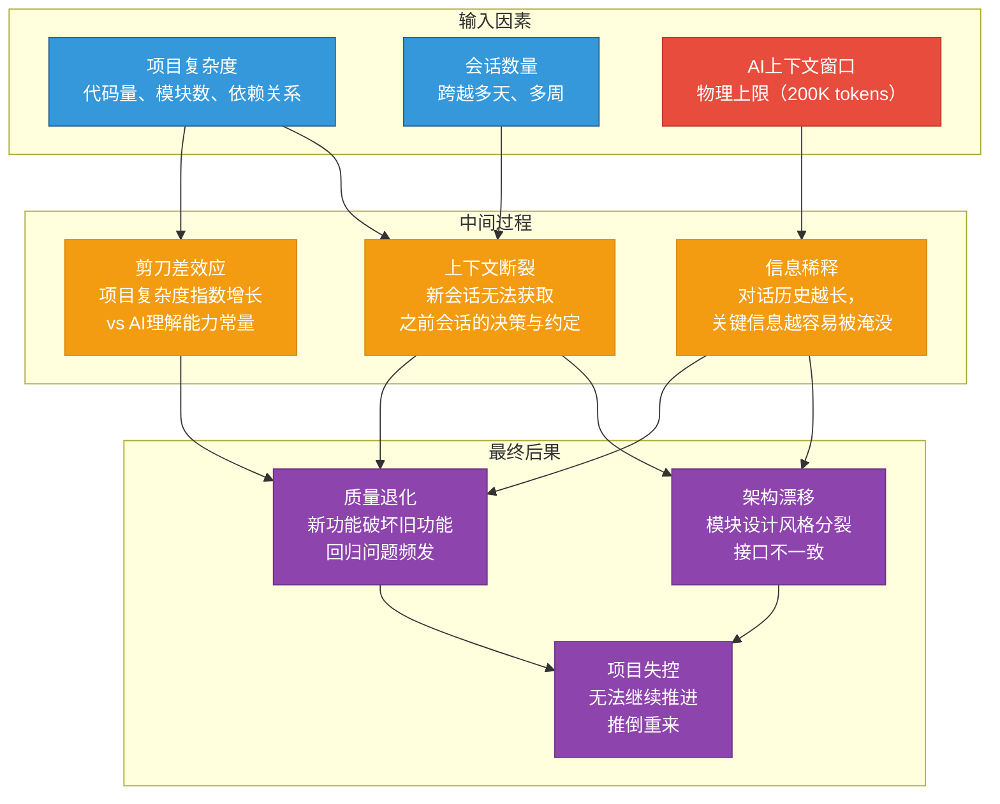
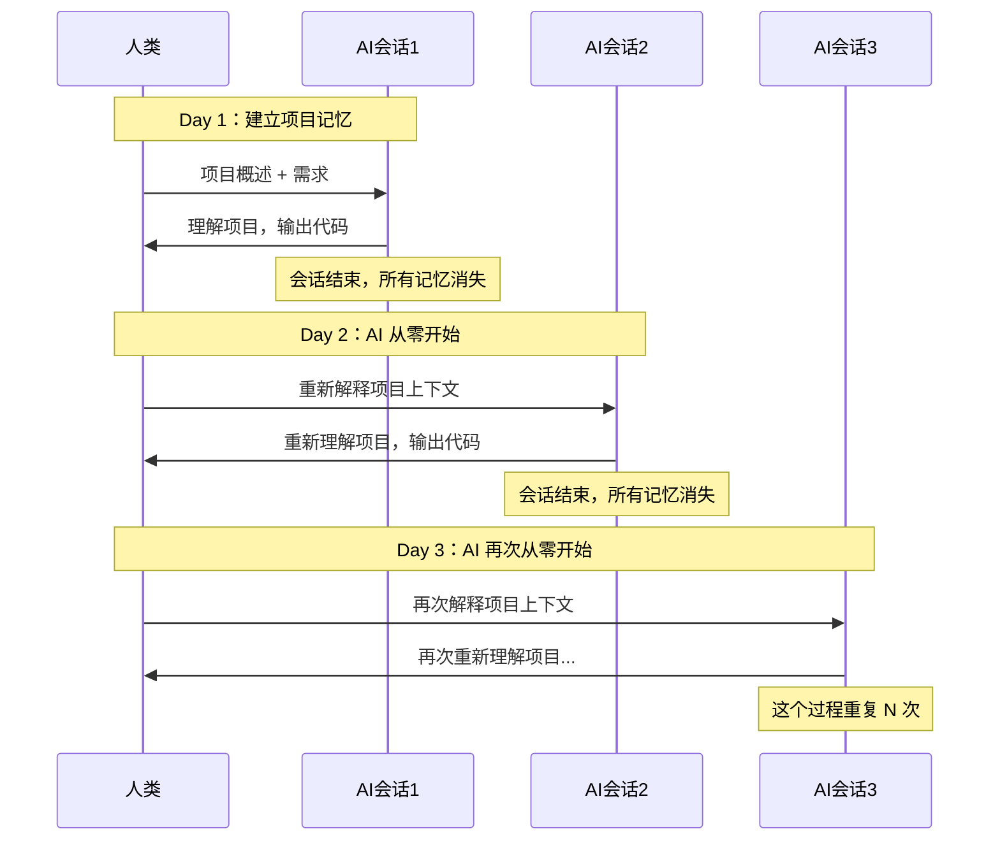
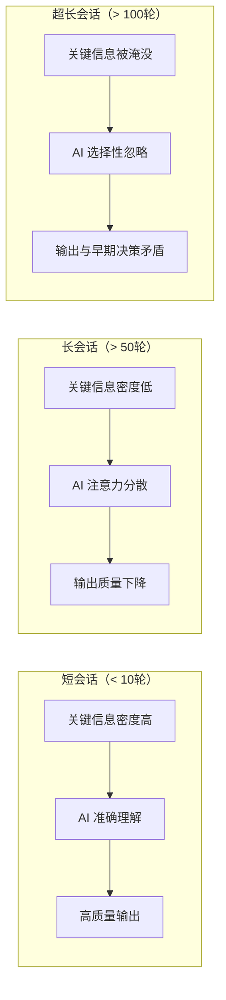
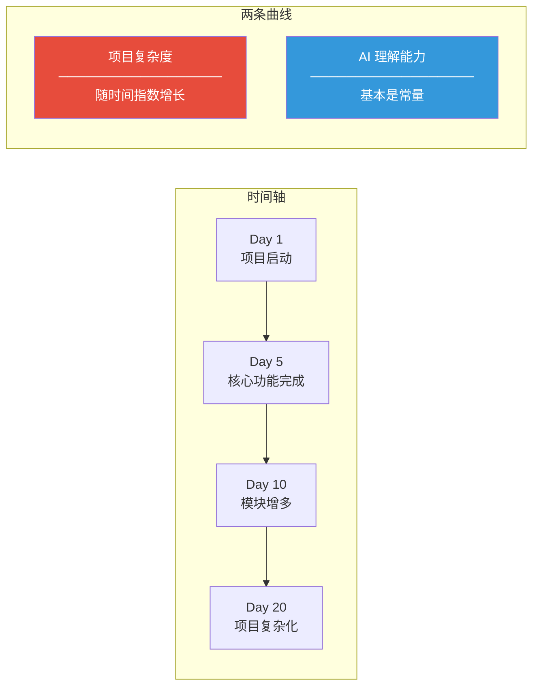
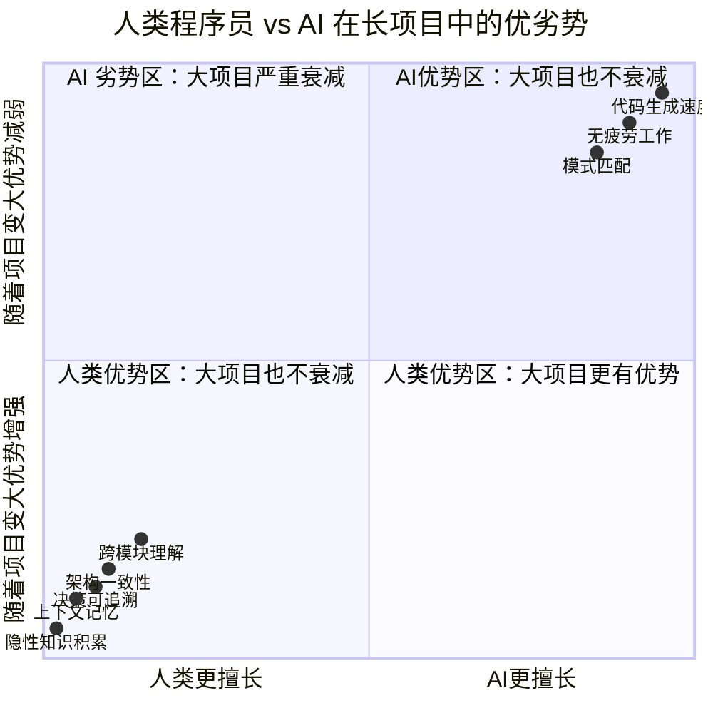
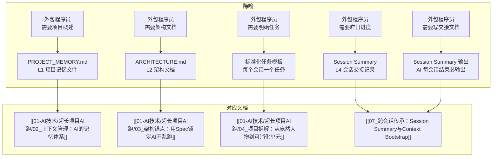
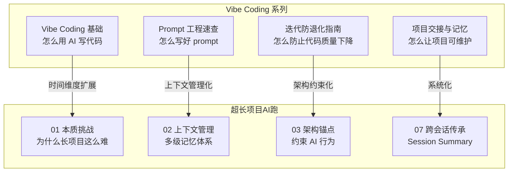
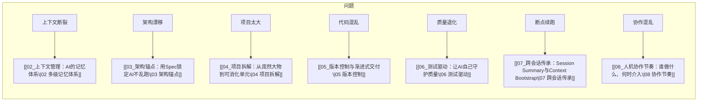

# 超长项目的本质挑战

> [!abstract] 本文要回答的问题
> 为什么 AI 在一个会话内能写出漂亮的代码，但在跨 10 个会话的项目中却越来越"力不从心"？上下文窗口不是有 200K 吗？AI 不是越来越聪明了吗？**问题的根源不在于 AI 的"智能"不够，而在于 AI 的"记忆"机制与长周期项目的需求之间存在根本性矛盾。**

---

## 一、问题定义：核心矛盾链

> [!important] 一句话总结
> 超长项目的核心矛盾不是"AI 不够聪明"，而是**"AI 没有记忆"**。每一次新会话，AI 都是从头开始理解项目。所有方法论都围绕一个目标：**让 AI 在最短时间内"重新理解"项目，然后做出与之前一致的决策。**

---

## 二、三大根因深入分析

### 根因一：AI 无状态 —— 每次会话都是"新大脑"

> [!warning] 关键认知
> AI 大模型本质上是**无状态的函数**：输入 prompt → 输出 response。它不保存任何"记忆"。
> 每次新会话，对 AI 来说就是一个全新的世界。它不知道你是谁、不知道你的项目是什么、不知道你上次做到了哪里。

**对比人类程序员**：

| 维度 | 人类程序员 | AI |
|------|-----------|-----|
| 项目记忆 | 持续积累，越做越熟悉 | 每次会话从零开始 |
| 隐性知识 | 自然形成"代码感觉"（哪里容易出 bug、哪个模块要注意） | 没有任何隐性知识，全靠显式输入 |
| 上下文理解 | 即使不明确说，也能理解"为什么这样设计" | 只能理解 prompt 中明确写出来的内容 |
| 学习曲线 | 第 1 天到第 10 天，效率提升 3-5 倍 | 第 1 天和第 10 天，效率完全一样（如果 context 相同） |
| 决策一致性 | 自然倾向于与之前保持一致 | 没有"之前"，每次都可能做出不同选择 |

> [!tip] 这意味着什么？
> 如果你没有在每次会话中给 AI 提供足够的项目上下文，AI 就会像一个第一天上班的新员工——而且是每天都换一个新员工。你需要在每次会话中"重新培训"它。

---

### 根因二：上下文窗口的物理限制 —— 不是"越大越好"

> [!warning] 常见误区
> "我的 AI 有 200K 上下文窗口，我直接把整个项目代码贴进去不就行了？"
>
> **不是这样的。** 上下文窗口越大，不代表 AI 理解得越好。

**上下文窗口的"稀释效应"**：

**实际影响**：

| 上下文窗口使用率 | 现象 | 对项目的影响 |
|-----------------|------|-------------|
| < 30% | AI 对项目有清晰理解，输出质量高 | 项目初期，进展顺利 |
| 30%-60% | AI 开始"遗忘"早期对话中的细节 | 新代码开始与早期约定不一致 |
| 60%-80% | AI 明显丢失上下文，需要反复提醒 | 架构漂移、风格不一致 |
| > 80% | AI 的注意力严重分散，关键信息丢失 | 需要开新会话，否则项目质量崩溃 |

> [!important] 关键洞察
> 上下文窗口的"物理限制"不是指 200K 不够大，而是指**对话历史越长，早期的关键信息越容易被"稀释"**。这就像在一个嘈杂的房间里听人说话——房间越大，背景噪音越多，你越难听清关键信息。

**类比：鸡尾酒会效应**

在鸡尾酒会上，你可以在嘈杂的环境中聚焦于一个人的声音。但如果同时有 50 个人在跟你说话，即使你站在一个巨大的房间里，你也无法同时处理所有信息。AI 的上下文窗口同理——不是"能不能装下"，而是"能不能有效处理"。

---

### 根因三：剪刀差效应 —— 项目复杂度与 AI 理解能力的增长曲线

**剪刀差效应的具体表现**：

| 阶段 | 项目复杂度 | AI 理解能力 | 差距 | 表现 |
|------|-----------|------------|------|------|
| Day 1-3 | 低（1-3 个文件，简单逻辑） | 完全理解 | 无差距 | AI 输出高效、准确 |
| Day 4-7 | 中（5-10 个文件，模块间依赖） | 基本理解 | 小差距 | 偶尔需要提醒约定 |
| Day 8-14 | 高（15+ 文件，多模块协作） | 部分理解 | 明显差距 | 频繁出现不一致、遗忘 |
| Day 15+ | 很高（30+ 文件，复杂依赖） | 无法完整理解 | 巨大差距 | 每个新功能都可能引入 bug |

> [!warning] 剪刀差效应的本质
> 项目复杂度随代码量、模块数、依赖关系**指数增长**，但 AI 在每个会话中能理解的项目范围是**常量**（受限于上下文窗口和 prompt 质量）。这两条曲线的差距越来越大，最终导致项目失控。

---

## 三、人类程序员 vs AI：长项目中的全方位对比

| 维度 | 人类程序员 | AI | 在长项目中的影响 |
|------|-----------|-----|-----------------|
| **记忆** | 持续积累，越做越熟悉项目 | 每次会话从零开始 | AI 需要外部记忆系统 |
| **一致性** | 自然倾向于保持风格一致 | 每次都可能做出不同选择 | 需要 Spec/ADR 锁定 |
| **学习能力** | 在项目中学习，积累隐性知识 | 不会"学习"，每次都是全新推理 | 人类需要不断教 AI |
| **上下文理解** | 能理解"没写出来"的隐式约定 | 只能理解显式写出的内容 | 隐式约定必须显式化 |
| **决策可追溯** | 可以回忆"为什么这样设计" | 不记得之前的决策 | 需要 ADR 记录决策 |
| **代码生成速度** | 受限于打字速度和思考 | 极快，一次生成大量代码 | 这是 AI 的核心优势 |
| **疲劳影响** | 长时间工作质量下降 | 无疲劳，质量恒定 | AI 适合做重复性工作 |
| **跨模块理解** | 需要时间建立全局视图 | 可以快速浏览大量代码 | 但理解深度有限 |
| **错误模式** | 逻辑错误、疏忽 | 幻觉、不一致、过时方案 | 两种错误模式不同 |

---

## 四、"每天换一个外包程序员"隐喻详解

> [!tip] 核心隐喻
> 这个隐喻不是贬低 AI，而是提供一个**精确的心智模型**，帮助你理解 AI 在长项目中的行为模式。

### 为什么这个隐喻如此精准？

| 外包程序员的特点 | AI 的表现 | 对应的方法论 |
|-----------------|----------|-------------|
| 每天换一个人，不认识项目 | 每次新会话，AI 不记得任何项目信息 | 需要项目记忆文件（L1） |
| 需要你给他项目概述 | 需要你在 prompt 中提供项目上下文 | 需要 Context Bootstrap |
| 需要你给他架构文档 | 需要你提供 Spec/PRD/ADR | 需要架构锚点 |
| 需要你明确告诉他今天做什么 | 需要清晰的任务描述和边界 | 需要标准化任务模板 |
| 需要你告诉他昨天的进度 | 需要 Session Summary | 需要跨会话传承机制 |
| 做完后需要写交接文档 | 需要 AI 在会话结束时输出总结 | 需要 Session Summary 模板 |
| 每个人风格不同 | 不同会话 AI 可能输出不同风格 | 需要代码规范锚点 |
| 需要代码审查 | 需要人 review AI 的产出 | 需要质量门禁 |

### 隐喻的边界条件

> [!note] 这个隐喻不适用于什么场景？
> 1. **单会话项目**：如果你的项目在一个会话内就能完成，不需要这套方法论
> 2. **AI 已经充分理解项目**：如果你已经把整个项目上下文塞进了 prompt（而且 AI 能有效处理），不需要
> 3. **纯探索性项目**：如果你的目标是"让 AI 自由发挥"，不需要约束

### 从隐喻到方法论

---

## 五、什么是"超长项目"？一个可操作的定义

> [!important] 定义
> 一个项目被认为是"超长项目"，当它满足以下**至少两个条件**时：
>
> 1. **跨 5 个以上会话**：不是一次聊天能完成的
> 2. **代码量 > 1000 行**（或预计最终 > 1000 行）
> 3. **涉及 3 个以上模块/文件的协作**
> 4. **时间跨度超过 3 天**
> 5. **需要做出关键架构决策**（技术选型、模块划分、接口设计）

### 超长项目的"超长"不是贬义

> [!note] 注意
> "超长"不是指项目"太大"或"太难"，而是指**项目的时间跨度超过了 AI 单次会话能有效处理的范围**。一个 500 行代码但有 5 个模块的项目，可能比一个 2000 行但只有一个模块的项目更需要这套方法论。

### 超长项目的典型阶段

每个阶段的 AI 协作需求不同：

| 阶段 | AI 的核心需求 | 关键文档 | 风险 |
|------|-------------|----------|------|
| 探索期 | 理解需求、提出方案 | PRD/SPEC | 方向错误 |
| 搭建期 | 理解架构约束、遵循规范 | ARCHITECTURE.md | 架构设计不当 |
| 加速期 | 理解模块边界、保持一致性 | 模块详情、接口契约 | 架构漂移 |
| 稳定期 | 理解影响范围、避免回归 | 测试用例、ADR | 引入新 bug |
| 交付期 | 理解全局、生成完整文档 | 项目记忆文件 | 遗漏关键步骤 |

---

## 六、与 Vibe Coding 系列的关联

本知识库是 [[05-产品与开发/Vibe Coder/Vibe Coding 产品经理法则|Vibe Coding 系列]] 的"长项目特化版"。两者的关系：

> [!tip] 如果你想深入学习 Vibe Coding，推荐阅读：
> - [[05-产品与开发/Vibe Coder/Vibe Coding 产品经理法则]] — 理解 Vibe Coding 的核心原则
> - [[05-产品与开发/Vibe Coder/02-开发实战/Prompt 工程速查（vibe coding 专用）]] — 写好 prompt 的速查手册
> - [[05-产品与开发/Vibe Coder/02-开发实战/Vibe Coding 迭代防退化指南]] — 防止代码质量在迭代中退化

---

## 七、常见误区与纠正

| 误区 | 真相 | 后果 |
|------|------|------|
| "AI 越来越聪明了，以后不会有这个问题了" | AI 的"无状态"特性是架构决定的，不是聪明与否的问题 | 等待解决 = 不解决 |
| "我把代码全贴进去就行了" | 上下文窗口越大，稀释效应越严重 | 信息过载反而降低质量 |
| "每个会话重新解释一遍就行了" | 手动解释成本随会话数量线性增长，且容易遗漏 | 第 10 个会话时你已经忘了第 1 个会话做了什么决策 |
| "让 AI 自己读代码就行了" | AI 能读代码，但不能从代码中推断"为什么这样设计" | AI 可能顺着代码的方向"优化"，但不知道当时的约束条件 |
| "小项目不需要这套方法论" | 小项目如果不规范，变成大项目时已经积重难返 | 前期不投入，后期成本更高 |

---

## 八、从"问题"到"方案"的路线图

> [!important] 阅读建议
> 建议按以下顺序阅读：
> 1. **01 本质挑战**（本文）— 建立问题意识
> 2. **[[01-AI技术/超长项目AI跑/02_上下文管理：AI的记忆体系]]** — 核心方法论，解决"记忆"问题
> 3. **[[01-AI技术/超长项目AI跑/03_架构锚点：用Spec锁定AI不乱跑]]** — 核心方法论，解决"一致性"问题
> 4. **[[01-AI技术/超长项目AI跑/07_跨会话传承：让AI记住上次做了什么]]** — 核心方法论，解决"传承"问题
>
> 这三篇是 P0 优先级，读完即可开始实践。

---

## 九、总结

> [!quote] 核心结论
> 超长项目的核心挑战不是"AI 不够聪明"，而是**"AI 没有记忆"**。AI 的"无状态"特性与长周期项目的"持续记忆"需求之间存在根本矛盾。
>
> 解决这个矛盾的方法不是"等 AI 变聪明"，而是**建立一套外部记忆系统**——让 AI 在每次新会话中，通过阅读结构化文档，快速"重新理解"项目，然后做出与之前一致的决策。
>
> 这就是"每天换一个外包程序员"隐喻的核心：**你需要给 AI 项目概述、架构文档、明确任务、昨日进度，并让他写交接文档。**

---

## 下一篇

[[01-AI技术/超长项目AI跑/02_上下文管理：AI的记忆体系]] — 多级记忆体系的完整设计，从 L0 到 L4 的架构与实战。