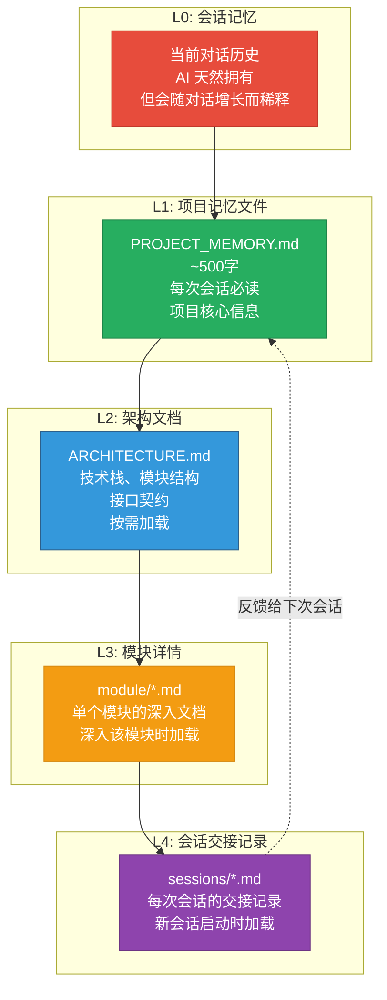
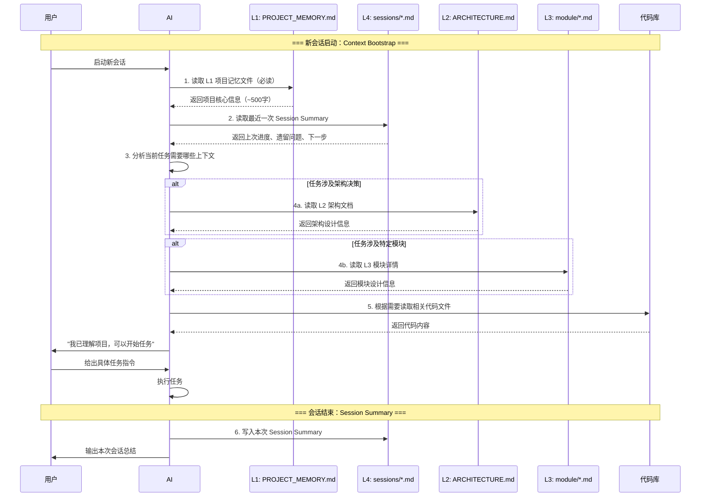
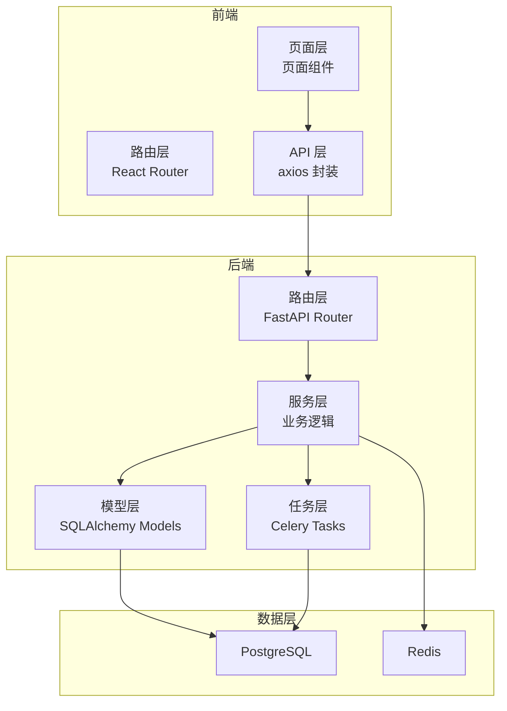
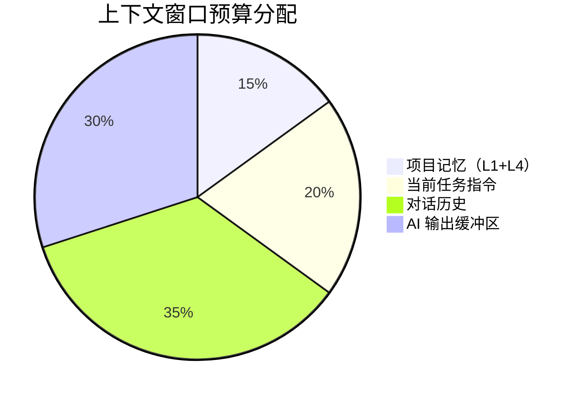
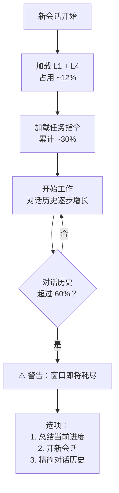
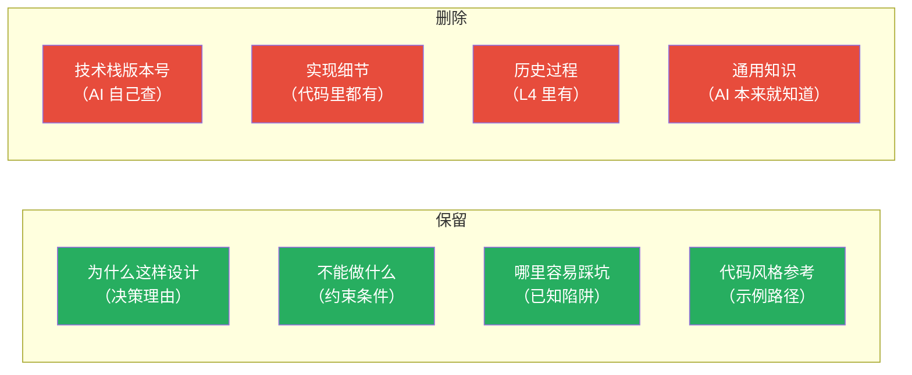
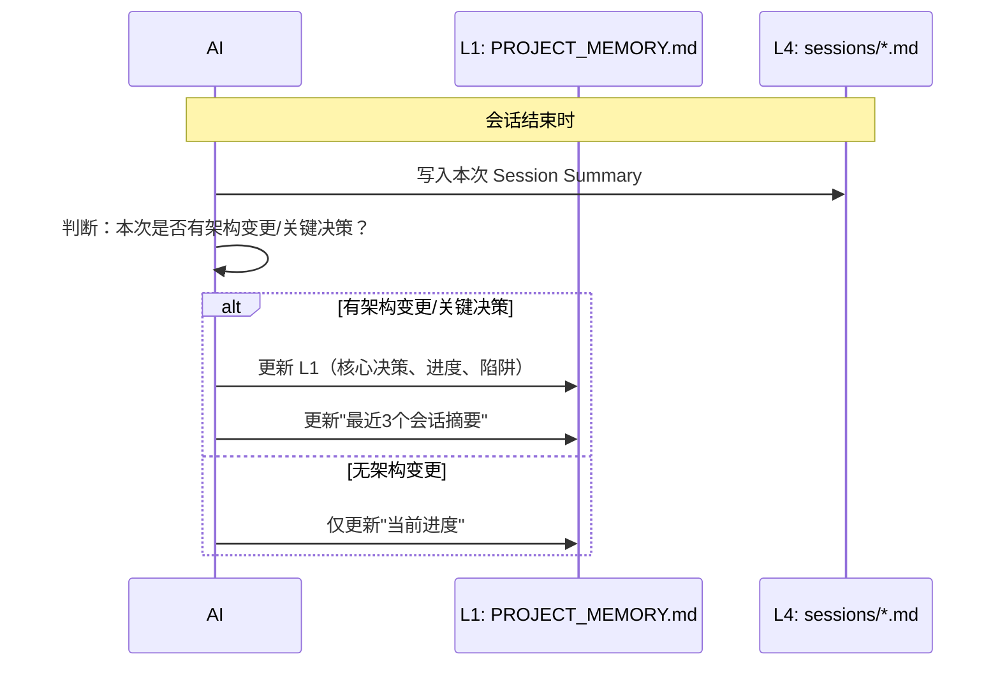
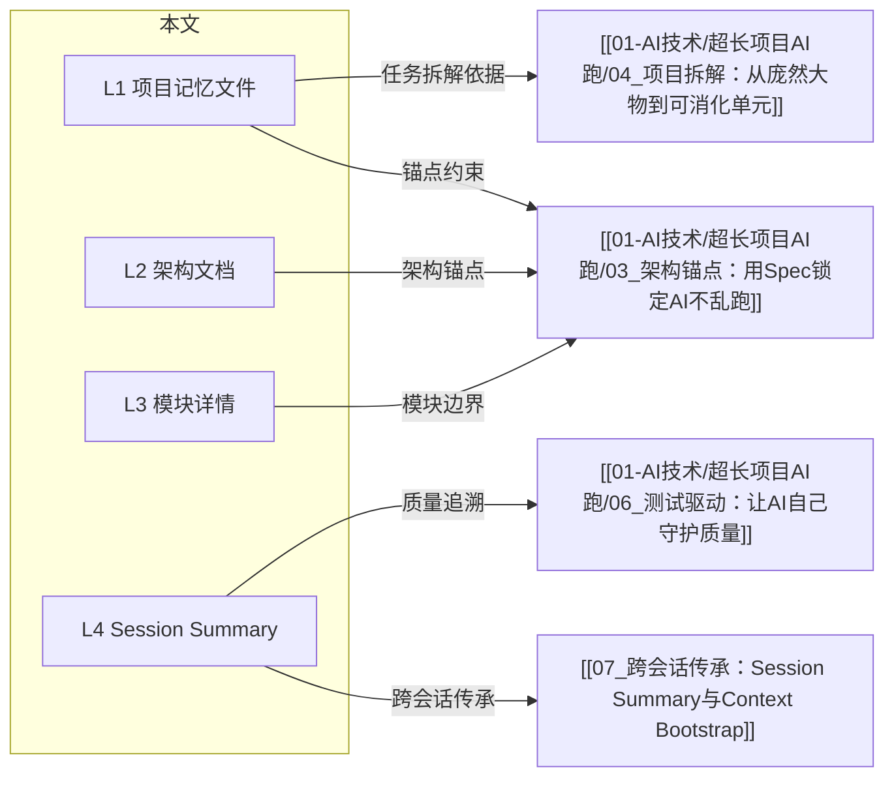

# 上下文管理：AI 的记忆体系

> [!abstract] 本文要回答的问题
> [[01-AI技术/超长项目AI跑/01_超长项目的本质挑战]] 告诉我们：AI 在长项目中的核心问题是"没有记忆"。本文提供一套**多级记忆体系（L0-L4）**，让 AI 在每次新会话中都能快速"重新理解"项目，做出与之前一致的决策。

---

## 一、多级记忆体系总览



> [!important] 设计原则
> **逐层降密**：信息密度从 L1 到 L4 逐层降低。L1 是"浓缩精华"，L4 是"详细记录"。
> **按需加载**：不要一次性把所有文档塞给 AI。根据当前任务的需要，只加载相关的文档层级。
> **闭环反馈**：L4 的会话交接记录会反馈到 L1 的项目记忆文件中，形成信息更新的闭环。

### 各层级对比

| 层级 | 名称 | 存储位置 | 大小 | 加载时机 | 更新频率 | 核心职责 |
|------|------|----------|------|----------|----------|----------|
| L0 | 会话记忆 | AI 上下文窗口 | 可变 | 自动 | 实时 | 当前对话的全部历史 |
| L1 | 项目记忆文件 | `PROJECT_MEMORY.md` | ~500字 | 每次会话必读 | 架构变更时 | 让 AI 5 分钟内理解项目全貌 |
| L2 | 架构文档 | `ARCHITECTURE.md` | ~2000字 | 涉及架构决策时 | 架构变更时 | 技术栈、模块结构、接口契约 |
| L3 | 模块详情 | `module/*.md` | 每模块 ~500字 | 深入该模块时 | 模块变更时 | 单个模块的详细设计 |
| L4 | 会话交接记录 | `sessions/*.md` | 每会话 ~300字 | 新会话启动时 | 每次会话结束 | 上次做了什么、遗留问题、下一步 |

---

## 二、记忆加载流程



> [!tip] 关键设计
> Context Bootstrap 的核心是**先读 L1，再决定读什么**。L1 相当于 AI 的"项目索引"——读完 L1 后，AI 应该知道哪些问题需要进一步了解。

---

## 三、L1 项目记忆文件：AI 的"项目名片"

### 设计原则

> [!important] L1 的核心原则
> L1 是 AI 在每次新会话中**第一个读的文档**。它的目标是在 **500 字以内**（约 800 tokens），让 AI 对项目有一个**足够准确**的理解，能够做出与之前一致的决策。
>
> **信息筛选标准**：只保留"AI 必须知道才能做对决策"的信息，删掉"AI 可以自己从代码中推断"的信息。

### L1 模板

```markdown
# PROJECT_MEMORY.md

## 项目一句话描述
[一句话说清楚这个项目是做什么的，50字以内]

## 技术栈
- 前端：[框架/库]
- 后端：[框架/语言]
- 数据库：[类型]
- 其他关键依赖：[列出]

## 核心架构决策
- [决策1]：[为什么这样选]
- [决策2]：[为什么这样选]
- ...（最多 5 条）

## 当前进度
- 整体完成度：[百分比]
- 已完成的核心功能：[列出]
- 正在开发的功能：[列出]

## 最近 3 个会话摘要
- [日期]：[做了什么] → [关键决策] → [遗留问题]
- [日期]：[做了什么] → [关键决策] → [遗留问题]
- [日期]：[做了什么] → [关键决策] → [遗留问题]

## 关键约定
- 代码风格：[参考文件路径]
- 命名规范：[约定]
- 提交规范：[约定]

## 常见陷阱
- [陷阱1]：[为什么容易踩 + 怎么避免]
- [陷阱2]：[为什么容易踩 + 怎么避免]
```

### 实战示例

> [!example] 一个真实的 L1 示例
>
> ```markdown
> # PROJECT_MEMORY.md
>
> ## 项目一句话描述
> 校招测评题库管理系统：HR 可创建、管理、批改校招笔试题库，学生可在线答题。
>
> ## 技术栈
> - 前端：React 18 + TypeScript + Ant Design 5
> - 后端：Python FastAPI + SQLAlchemy
> - 数据库：PostgreSQL 15
> - 其他：Redis（缓存）、Celery（异步任务）
>
> ## 核心架构决策
> - 前后端分离：RESTful API，前端通过 `/api/` 前缀访问后端
> - 题库与试卷解耦：题库是独立模块，试卷是"题库的子集 + 元数据"
> - 批改引擎独立：客观题自动批改，主观题通过 Celery 异步处理
> - 权限模型：RBAC（Admin / HR / Student），前端路由守卫 + 后端中间件双重校验
>
> ## 当前进度
> - 整体完成度：60%
> - 已完成：题库 CRUD、试卷生成、学生答题、客观题自动批改
> - 正在开发：主观题批改引擎、成绩统计报表
>
> ## 最近 3 个会话摘要
> - 07-26：完成客观题自动批改 → 关键决策：批改结果直接写入数据库而非缓存 → 遗留：主观题批改接口已定义但未实现
> - 07-25：完成试卷生成功能 → 关键决策：试卷生成使用随机算法，保证每次生成的试卷不同 → 遗留：需要加入去重逻辑
> - 07-24：完成题库 CRUD → 关键决策：题目使用 JSONB 存储选项，灵活但牺牲了查询性能 → 遗留：需要添加索引优化
>
> ## 关键约定
> - 代码风格：参考 `src/api/questions.py` 的 API 设计模式
> - 命名规范：后端用 snake_case，前端用 camelCase，API 字段用 snake_case
> - 提交规范：`type(scope): description`，如 `feat(question): add question CRUD`
>
> ## 常见陷阱
> - 题目 JSONB 字段：不要直接查询 JSONB 内部字段，使用 GIN 索引
> - 权限校验：前端和后端都要校验，不要只在路由层做
> - 批改异步任务：Celery 任务必须幂等，因为可能重试
> ```

> [!tip] 为什么这个 L1 有效？
> 1. **500 字以内**：AI 可以在 30 秒内读完
> 2. **每个决策都有"为什么"**：AI 知道约束条件，不会"优化"掉关键设计
> 3. **有代码参考**：AI 知道去哪里找风格参考
> 4. **有常见陷阱**：AI 知道哪些地方容易踩坑，会主动避开

---

## 四、L2 架构文档：AI 的"项目地图"

### 与 L1 的区别

| 维度 | L1 项目记忆文件 | L2 架构文档 |
|------|---------------|------------|
| 目标 | 让 AI 快速理解项目全貌 | 让 AI 理解架构细节和约束 |
| 大小 | ~500 字 | ~2000 字 |
| 加载时机 | 每次会话必读 | 涉及架构决策时加载 |
| 内容 | 一句话描述、核心决策、进度 | 技术栈详解、模块结构、接口契约 |
| 更新频率 | 架构变更时 | 架构变更时 |

### L2 模板

```markdown
# ARCHITECTURE.md

## 技术栈详解
[每项技术的版本、用途、关键配置]

## 目录结构
[项目目录树 + 每个目录的职责说明]

## 模块结构
[模块划分 + 模块间依赖关系（mermaid 图）]

## 接口契约
[每个模块对外暴露的接口定义]

## 数据流
[数据如何在模块间流转]

## 部署架构
[部署方式、环境配置]
```

### 模块依赖图示例



---

## 五、L3 模块详情：AI 的"放大镜"

### 什么时候创建 L3 文档？

> [!tip] 触发条件
> 当一个模块满足以下**任意一个**条件时，值得创建 L3 文档：
> 1. 模块代码超过 300 行
> 2. 模块有 3 个以上外部依赖
> 3. 模块有复杂的内部状态管理
> 4. 模块的接口在多个会话中被修改过

### L3 模板

```markdown
# [模块名] 模块详情

## 模块职责
[一句话说清楚这个模块做什么]

## 对外接口
[列出所有 public 方法/函数/API，包含签名和用途]

## 内部结构
[模块内部的关键类/函数/组件及其关系]

## 依赖关系
- 依赖的模块：[列出]
- 被依赖的模块：[列出]

## 关键设计决策
- [决策]：[为什么]

## 测试覆盖
- 测试文件：[路径]
- 覆盖率：[百分比]
- 已知薄弱点：[列出]

## 变更历史
- [日期]：[变更内容] → [影响]
```

---

## 六、L4 Session Summary：AI 的"工作日志"

### 为什么需要 L4？

> [!important] L4 的核心价值
> L4 是连接两次会话的**桥梁**。没有 L4，每次会话之间就是"断崖"——你无法知道 AI 上次做了什么、为什么这样做、下一步应该做什么。
>
> L4 的详细设计见 [[01-AI技术/超长项目AI跑/07_跨会话传承：让AI记住上次做了什么]]。

### L4 模板（简要版）

```markdown
# Session [日期] Summary

## 本次完成了什么
[列出完成的文件和功能]

## 关键决策
[列出本次会话中做出的关键决策及原因]

## 遗留问题
[列出未解决的问题]

## 下一步建议
[建议下一个会话做什么，分优先级]

## 注意事项
[下一个会话需要特别注意的事项]
```

---

## 七、窗口预算分配策略

> [!warning] 关键概念
> AI 的上下文窗口不是无限的，即使有 200K。你需要像管理预算一样管理它。

### 推荐分配比例



| 预算项目 | 占比 | 典型内容 | 为什么这个比例 |
|----------|------|----------|---------------|
| 项目记忆 | 10-15% | L1（~500字）+ 最近一次 L4（~300字） | 足够让 AI 理解项目，但不过多占用 |
| 当前任务指令 | 15-20% | 本次任务描述、约束条件、验收标准 | 清晰的任务定义是高质量产出的前提 |
| 对话历史 | 30-40% | 本次会话的所有对话 | 足够的上下文让 AI 理解当前讨论 |
| AI 输出缓冲区 | 30-35% | AI 生成代码、文档的空间 | 不能压缩，否则 AI 会截断输出 |

### 预算管理策略



> [!tip] 预算管理技巧
> 1. **定期压缩**：当对话历史超过 50% 时，让 AI 总结当前进度，然后开新会话
> 2. **精简指令**：不要把整个需求文档都贴进去，只贴本次任务相关的部分
> 3. **避免重复**：不要在 prompt 中重复 L1 中已有的信息
> 4. **使用引用**：告诉 AI "参考 ARCHITECTURE.md 中的模块结构"，而不是把整个文档贴进去

---

## 八、关键信息浓缩方法论

> [!important] 核心问题
> 如何把 100 页的项目信息浓缩成 500 字的 L1 项目记忆文件，还不丢失关键决策？

### 浓缩原则



### 浓缩三步法

1. **筛选**：哪些信息是"AI 必须知道才能做对决策"的？哪些是"AI 可以自己从代码中推断"的？只保留前者。
2. **结构化**：用固定的模板（一句话描述 → 技术栈 → 核心决策 → 进度 → 约定 → 陷阱）组织信息，让 AI 可以快速扫描。
3. **精简**：每条信息不超过一行。如果一行说不清楚，说明这个信息还不够"核心"。

### 浓缩示例

> [!example] 从项目文档到 L1 的浓缩过程
>
> **原始信息**（2000 字）：
> ```
> 校招测评题库管理系统是一个面向 HR 和学生的一站式平台。
> HR 可以创建题库、设计试卷、安排考试、批改试卷、查看成绩报表。
> 学生可以参加在线考试、查看成绩和错题解析。
> 系统采用前后端分离架构，前端使用 React 18 + TypeScript + Ant Design 5，
> 后端使用 Python FastAPI + SQLAlchemy，数据库使用 PostgreSQL 15，
> 缓存使用 Redis，异步任务使用 Celery。
> 我们选择 React 而不是 Vue 的原因是团队对 React 更熟悉...
> 选择 FastAPI 而不是 Django 的原因是 FastAPI 的异步支持更好...
> 选择 PostgreSQL 而不是 MySQL 的原因是 PostgreSQL 对 JSONB 的支持更好...
> （中间省略 1500 字）
> ```
>
> **浓缩后**（150 字）：
> ```
> 校招测评题库管理系统：HR 管理题库/试卷/考试/批改/报表，学生在线答题。
> 技术栈：React 18 + TS + Ant Design 5 / FastAPI + SQLAlchemy / PostgreSQL 15 + Redis + Celery
> 核心决策：前后端分离 RESTful、题库试卷解耦、批改引擎独立、RBAC 权限模型
> 进度：60%（已完成题库CRUD、试卷生成、答题、客观题批改；正在做主观题批改）
> 风格参考：src/api/questions.py
> 陷阱：JSONB 字段不要直接查内部字段、权限要前后端都校验、Celery 任务必须幂等
> ```

---

## 九、信息更新策略

### 什么时候更新 L1？

> [!important] L1 更新触发条件
> 以下情况发生时，必须更新 L1：
> 1. **架构变更**：新增/删除模块、改变技术选型、修改接口契约
> 2. **关键决策**：做出了影响多个模块的决策
> 3. **新模块加入**：项目范围扩大
> 4. **里程碑达成**：完成了一个重要功能
> 5. **发现新陷阱**：发现了新的常见错误模式

### 什么时候更新 L4？

> [!tip] L4 更新时机
> **每次会话结束时**，AI 必须输出 Session Summary。这是强制性的，就像外包程序员必须写交接文档一样。
>
> 如果某次会话特别短（< 5 轮对话），可以只输出一个简短的"本次未做实质性变更"。

### 更新流程



---

## 十、记忆体系的实战检查清单

> [!tip] 在开始新会话前，确认以下事项：

- [ ] L1 项目记忆文件是否存在且是最新的？
- [ ] 上一次会话的 L4 Session Summary 是否已生成？
- [ ] 本次任务是否需要加载 L2 架构文档？
- [ ] 本次任务是否需要加载 L3 模块详情？
- [ ] 本次任务的 prompt 是否避免了与 L1 内容的重复？
- [ ] 窗口预算是否合理（项目记忆 < 15%，任务指令 < 20%）？

> [!tip] 在结束会话前，确认以下事项：

- [ ] 是否已输出本次 Session Summary（L4）？
- [ ] 是否有需要更新 L1 的变更（架构变更、关键决策、新陷阱）？
- [ ] 是否明确了"下一步建议"（让下一个会话有明确起点）？

---

## 十一、常见反模式

| 反模式 | 为什么不好 | 正确做法 |
|--------|-----------|----------|
| **L1 写太长**（>1000 字） | AI 的信息密度降低，关键信息被稀释 | 控制在 500 字以内，遵循浓缩原则 |
| **L1 不更新** | AI 基于过时信息做决策，架构漂移加速 | 每次架构变更后立即更新 L1 |
| **每次会话都把全部文档塞进去** | 窗口预算超标，AI 输出质量下降 | 按需加载，只加载本次任务需要的文档 |
| **L1 只有"是什么"没有"为什么"** | AI 不知道约束条件，可能"优化"掉关键设计 | 每个决策后面都要写"为什么" |
| **Session Summary 太笼统**（"今天做了很多事"） | 下一个 AI 会话无法获取有用信息 | 具体到文件和功能，明确"做了什么"和"为什么" |
| **不写常见陷阱** | AI 不知道哪些地方容易踩坑，反复犯错 | 每个陷阱写清楚"为什么容易踩"和"怎么避免" |

---

## 十二、与其他文档的关联



---

## 十三、总结

> [!quote] 核心结论
> 多级记忆体系（L0-L4）是解决 AI "无记忆"问题的基础设施。它不是"写个好 prompt"的技巧，而是**一套系统化的信息管理架构**。
>
> **最低成本起步**：先创建 L1 项目记忆文件（500 字），每次新会话开始时让 AI 读它。这是回报率最高的改进。
>
> **逐步完善**：在 L1 的基础上，逐步加入 L4（Session Summary）、L2（架构文档）、L3（模块详情）。每加一层，AI 的理解深度就提升一级。
>
> **记住浓缩原则**：只保留"AI 必须知道才能做对决策"的信息，删掉"AI 可以自己从代码中推断"的信息。

---

## 上一篇 / 下一篇

- [[01-AI技术/超长项目AI跑/01_超长项目的本质挑战]] — 理解为什么 AI 需要记忆体系
- [[01-AI技术/超长项目AI跑/03_架构锚点：用Spec锁定AI不乱跑]] — 用 Spec 和 ADR 锁定 AI 的行为边界