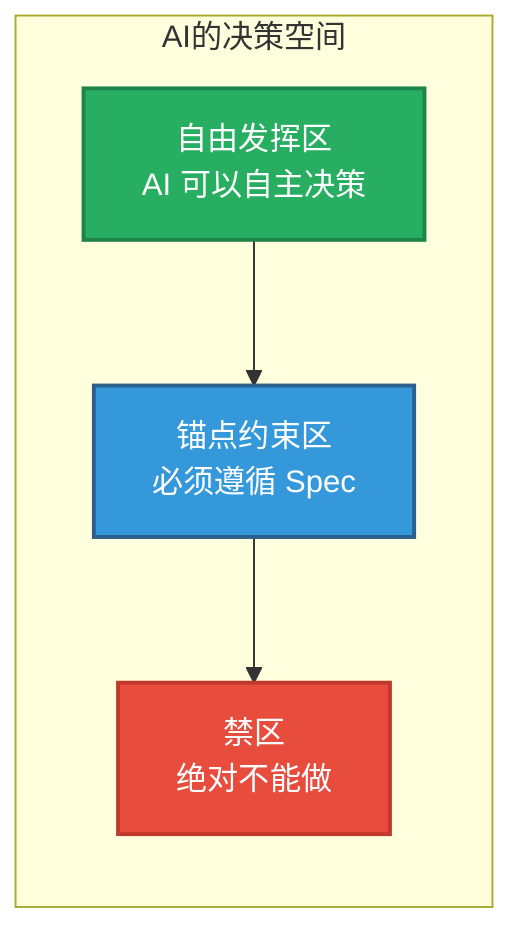
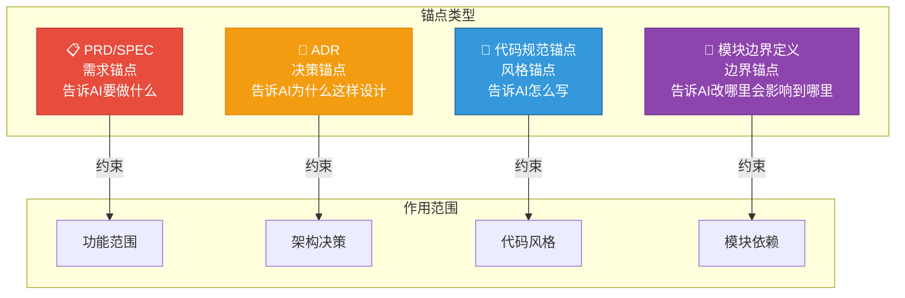
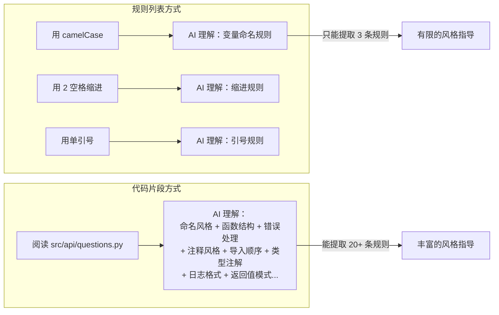
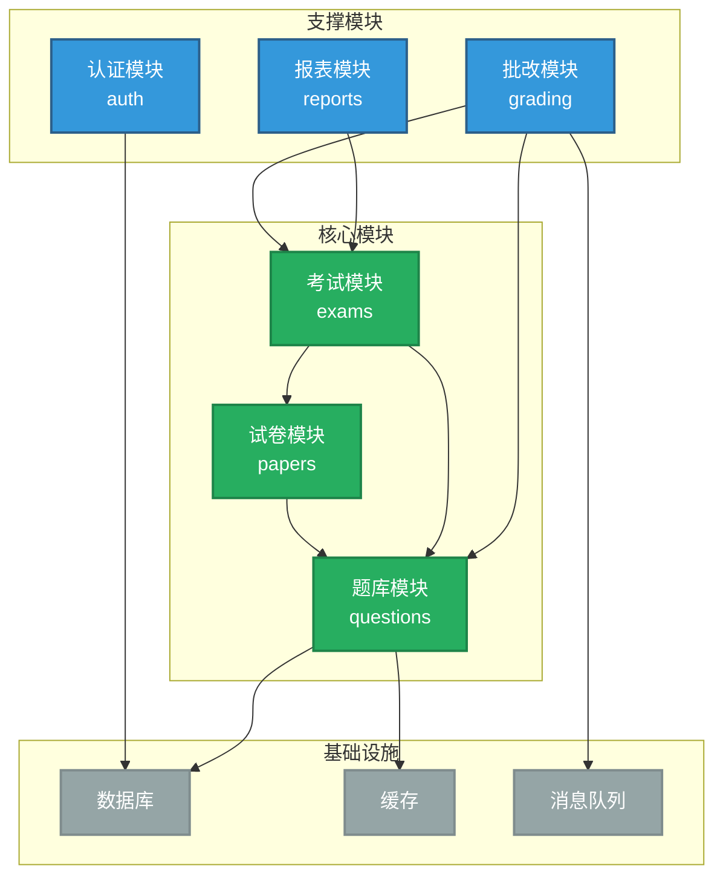
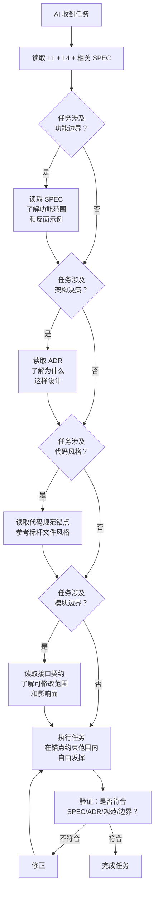
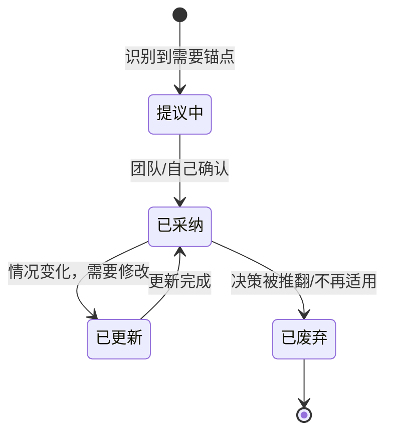
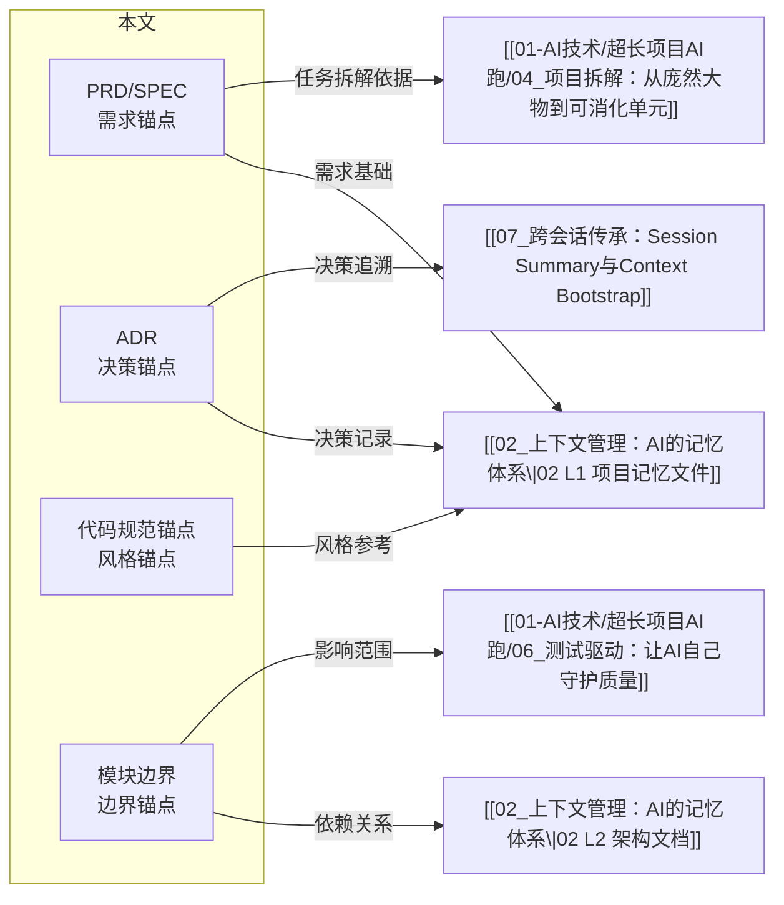

# 架构锚点：用 Spec 锁定 AI 不乱跑

> [!abstract] 本文要回答的问题
> [[01-AI技术/超长项目AI跑/02_上下文管理：AI的记忆体系]] 解决了"让 AI 记住什么"的问题，但还有一个更根本的问题：**当 AI 理解了项目后，它会不会"自由发挥"，导致架构漂移？** 本文提供一套"架构锚点"体系，用 Spec、ADR、代码规范和模块边界，给 AI 划定"不可逾越的边界"。

---

## 一、为什么需要"架构锚点"？

> [!warning] 核心问题
> AI 在没有约束时，倾向于"自由发挥"。这不是 AI 的 bug，而是它的 feature——AI 被训练来"创造性地解决问题"。
>
> 但在长项目中，"创造性"往往意味着"不一致"：AI 可能在第二个会话中引入一种新的错误处理方式，在第三个会话中改变 API 命名风格，在第四个会话中"优化"掉一个你精心设计的架构决策。

### 架构漂移的典型过程

```mermaid
flowchart TD
    S1["会话1：AI 按照 Spec 生成代码<br/>风格一致，架构清晰"]:::good
    S2["会话2：AI 忘记了 Spec<br/>引入新的错误处理方式"]:::warn
    S3["会话3：AI 继续"优化"<br/>改变了 API 命名风格"]:::warn
    S4["会话4：AI 不理解之前的决策<br/>"优化"掉关键设计"]:::bad
    S5["会话5：新代码与旧代码风格分裂<br/>维护成本飙升"]:::bad
    S6["会话10：项目变成"拼凑品"<br/>每个模块风格不同"]:::bad

    S1 --> S2 --> S3 --> S4 --> S5 --> S6

    classDef good fill:#27AE60,color:#fff
    classDef warn fill:#F39C12,color:#fff
    classDef bad fill:#E74C3C,color:#fff
```

### 锚点的作用

> [!important] 锚点的定义
> 架构锚点是一组**结构化的文档和规范**，它们共同为 AI 划定一个"不可逾越的边界"。
>
> 锚点的作用不是"告诉 AI 怎么做"，而是"告诉 AI **不能怎么做**"。它们定义了项目的"宪法"——AI 可以在宪法范围内自由发挥，但不能违宪。



---

## 二、四种锚点类型



| 锚点类型 | 核心作用 | 约束什么 | 对应文档 | 更新频率 |
|----------|----------|----------|----------|----------|
| **PRD/SPEC** | 定义需求边界 | 功能范围、验收标准 | `SPEC.md` | 需求变更时 |
| **ADR** | 锁定架构决策 | 为什么这样设计 | `adr/*.md` | 每次关键决策时 |
| **代码规范锚点** | 锁定代码风格 | 怎么写代码 | 代码参考文件 | 规范变更时 |
| **模块边界定义** | 锁定模块契约 | 改哪里会影响哪里 | 接口定义文件 | 接口变更时 |

---

## 三、锚点一：给 AI 读的 PRD/SPEC

### 与给人看的 PRD 的区别

> [!important] 关键差异
> 给人看的 PRD 可以用模糊的语言（"界面要美观"、"体验要流畅"），因为人类可以理解上下文。
> 给 AI 读的 PRD 必须**显式、结构化、可验证**。

| 维度 | 给人看的 PRD | 给 AI 读的 PRD |
|------|-------------|---------------|
| 语言风格 | 可以模糊、可以有"大方向" | 必须精确、可执行 |
| 验收标准 | 可以隐含 | 必须显式列出 |
| 反面示例 | 通常不需要 | **强烈建议提供**（告诉 AI "不要做什么"） |
| 优先级 | 可以标注 | 必须标注（P0/P1/P2） |
| 边界条件 | 可能遗漏 | 必须显式声明"不做什么" |
| 结构 | 自由格式 | 强制结构化 |

### 给 AI 读的 PRD 模板

```markdown
# SPEC: [功能名称]

## 概述
[一句话描述这个功能做什么]

## 用户故事
- 作为 [角色]，我想要 [做什么]，以便 [达到什么目的]

## 功能范围（P0/P1/P2）
### P0 - 必须实现
- [功能1]：[详细描述]
- [功能2]：[详细描述]

### P1 - 应该实现
- [功能3]：[详细描述]

### P2 - 可以后续实现
- [功能4]：[详细描述]

## 明确不做什么（范围边界）
- 不实现 [功能X]，因为 [原因]
- 不处理 [场景Y]，因为 [原因]

## 验收标准
- [ ] [可验证的标准1]
- [ ] [可验证的标准2]

## 技术约束
- 必须使用 [技术/库]
- 必须兼容 [已有模块]
- 必须遵循 [代码规范参考]

## 反面示例（AI 容易犯的错误）
- ❌ 不要 [错误做法]：因为 [原因]
- ❌ 不要 [错误做法]：因为 [原因]

## 依赖关系
- 依赖 [模块A]：[说明]
- 被 [模块B] 依赖：[说明]

## 测试要求
- 单元测试覆盖率 > [百分比]
- 必须覆盖的边界条件：[列出]
```

### 实战示例

> [!example] SPEC 示例：试卷生成功能
>
> ```markdown
> # SPEC: 试卷生成功能
>
> ## 概述
> HR 可以从题库中选择题目，生成一份试卷。试卷支持随机出题和手动选题两种模式。
>
> ## 用户故事
> - 作为 HR，我想要从题库中选择题型生成试卷，以便组织考试
> - 作为 HR，我想要设置随机出题规则，以便快速生成不同版本的试卷
>
> ## 功能范围
> ### P0 - 必须实现
> - 手动选题：从题库中按题型筛选，勾选题目加入试卷
> - 随机出题：设置每个题型的题目数量和难度分布，系统自动选题
> - 试卷预览：生成后预览试卷内容，确认无误后保存
>
> ### P1 - 应该实现
> - 试卷模板：保存出题规则为模板，下次直接使用
>
> ### P2 - 可以后续实现
> - 试卷版本管理：同一试卷的多个版本
>
> ## 明确不做什么
> - 不实现试卷的在线编辑（PDF 导出即可）
> - 不实现组卷算法优化（先用简单随机，后续迭代）
>
> ## 验收标准
> - [ ] 手动选题：从 100 道题中选 10 道，操作时间 < 2 分钟
> - [ ] 随机出题：设置规则后 3 秒内生成试卷
> - [ ] 试卷预览：显示完整试卷内容，包括题目、选项、分值
> - [ ] 题型覆盖：支持单选、多选、判断、填空四种题型
>
> ## 技术约束
> - 必须使用现有的题库 API（`/api/questions/`）
> - 试卷数据模型必须兼容现有的考试模块
> - 代码风格参考 `src/api/questions.py`
>
> ## 反面示例
> - ❌ 不要在试卷表中直接存储题目内容：试卷只存题目 ID，内容从题库读取。原因：题目更新后试卷自动更新
> - ❌ 不要在前端实现选题逻辑：前端只负责展示，所有业务逻辑在后端。原因：保证数据一致性
> - ❌ 不要修改 `Question` 模型：试卷不需要新增字段，可以复用现有结构
>
> ## 依赖关系
> - 依赖 `题库模块`：读取题目列表
> - 被 `考试模块` 依赖：考试需要引用试卷
>
> ## 测试要求
> - 单元测试覆盖率 > 80%
> - 必须覆盖：空题库、题目不足、题型不匹配等边界条件
> ```

> [!tip] 为什么这个 SPEC 有效？
> 1. **有"不做什么"**：AI 不会去实现试卷在线编辑或组卷算法优化
> 2. **有反面示例**：AI 不会把题目内容存到试卷表中
> 3. **有技术约束**：AI 知道必须用现有 API，不能自己造一套
> 4. **有验收标准**：AI 知道做到什么程度才算完成

---

## 四、锚点二：架构决策记录（ADR）

### 什么是 ADR？

> [!important] ADR 的定义
> ADR（Architecture Decision Record）是一种**轻量级的架构决策文档**。每当你做出一个会影响多个模块的决策时，就创建一张 ADR 卡片。
>
> ADR 的核心价值：**三周后，你（和 AI）还能知道"为什么当时这样设计"。**

### ADR 模板

```markdown
# ADR-[编号]: [决策标题]

## 状态
[提议中 / 已采纳 / 已废弃 / 已替代]

## 背景
[什么情况下需要做出这个决策？有什么约束条件？]

## 决策
[我们决定怎么做？]

## 后果
### 正面影响
- [这个决策带来的好处]

### 负面影响
- [这个决策带来的代价/限制]

## 替代方案
### 方案A：[名称]
- 优点：[列出]
- 缺点：[列出]
- 为什么不选：[原因]

### 方案B：[名称]
- 优点：[列出]
- 缺点：[列出]
- 为什么不选：[原因]
```

### ADR 实战示例

> [!example] ADR 示例：题库使用 JSONB 存储题目选项
>
> ```markdown
> # ADR-001: 题库使用 JSONB 存储题目选项
>
> ## 状态
> 已采纳
>
> ## 背景
> 题库需要支持多种题型（单选、多选、判断、填空），每种题型的选项结构不同：
> - 单选题：4 个选项，1 个正确答案
> - 多选题：4-6 个选项，1-4 个正确答案
> - 判断题：2 个选项（对/错）
> - 填空题：无选项，但有标准答案
>
> 如果用传统的关系型表设计，需要为每种题型设计不同的字段，导致表结构复杂。
>
> ## 决策
> 使用 PostgreSQL 的 JSONB 字段存储题目选项，同时在 JSONB 字段上创建 GIN 索引。
>
> ## 后果
> ### 正面影响
> - 一种表结构支持所有题型，无需为每种题型建表
> - 新增题型时不需要修改数据库 Schema
> - 前端可以直接使用 JSON 数据，无需转换
>
> ### 负面影响
> - JSONB 查询性能不如关系型字段（但 GIN 索引可以缓解）
> - 无法在数据库层面做选项的完整性校验（需要应用层校验）
> - 新团队成员可能不熟悉 JSONB 查询语法
>
> ## 替代方案
> ### 方案A：使用 EAV（实体-属性-值）模型
> - 优点：灵活，支持任意属性
> - 缺点：查询复杂，性能差，SQL 难以维护
> - 为什么不选：EAV 模型的查询性能远不如 JSONB + GIN 索引
>
> ### 方案B：为每种题型设计独立表
> - 优点：类型安全，数据库层面可以做完整性校验
> - 缺点：表结构复杂，新增题型需要改 Schema 和数据迁移
> - 为什么不选：题型的扩展性要求高，独立表的设计在长期维护中成本更高
> ```

### ADR 与 AI 协作

> [!tip] 给 AI 读 ADR 的最佳方式
> 1. 在 L1 项目记忆文件中，列出关键 ADR 的编号和标题
> 2. 当 AI 需要做相关决策时，让它读对应的 ADR
> 3. 在 ADR 中明确"替代方案"和"为什么不选"——这能防止 AI "重新发现"已被否决的方案

### ADR 索引（推荐在 L1 中维护）

```markdown
## 关键 ADR 索引
- ADR-001: 题库使用 JSONB 存储题目选项 → 已采纳
- ADR-002: 前后端分离，RESTful API → 已采纳
- ADR-003: 批改引擎使用 Celery 异步处理 → 已采纳
- ADR-004: 权限模型使用 RBAC → 已采纳
```

---

## 五、锚点三：代码规范锚点

### 为什么不用传统的代码规范文档？

> [!warning] 传统代码规范的问题
> 传统的代码规范文档（"用 camelCase、用 2 空格缩进、用单引号..."）对 AI 的帮助有限。
> 原因：AI 已经被训练过这些通用规范，它需要的不是"规则"，而是**你这个项目特有的风格参考**。

### 代码规范锚点的设计原则

> [!important] 核心原则：用代码片段锁定风格
> 不要写一长串规则，而是**给一个代码片段说"参考这个风格"**。AI 从代码片段中能提取出比规则列表更丰富的风格信息。

### 代码规范锚点模板

```markdown
# 代码规范锚点

## API 设计风格
参考文件：`src/api/questions.py`

## 组件结构风格
参考文件：`src/components/QuestionList.tsx`

## 错误处理风格
参考文件：`src/utils/errorHandler.ts`

## 测试风格
参考文件：`tests/test_questions.py`
```

### 为什么代码片段比规则列表更有效？



> [!tip] 实战建议
> 为每个关键模块选一个"标杆文件"作为代码规范锚点。这个文件应该：
> 1. 代码质量高（是你满意的那种）
> 2. 覆盖了该模块的典型操作（CRUD、错误处理、日志等）
> 3. 不长（200-400 行，AI 可以快速读完）

---

## 六、锚点四：模块边界定义

### 为什么需要模块边界？

> [!warning] 依赖塌方问题
> 在长项目中，最常见的痛苦之一就是"改一个模块，其他模块跟着崩"。根本原因是模块之间的边界模糊：AI 不知道改这里会影响哪里。

### 模块边界定义的三个层次

```mermaid
flowchart TD
    subgraph 层次1：接口契约
        L1["定义模块的 public API<br/>用 interface/type 显式声明"]
    end

    subgraph 层次2：依赖关系
        L2["列出模块的依赖和被依赖<br/>用 mermaid 图可视化"]
    end

    subgraph 层次3：影响分析
        L3["定义"改这里之前先检查哪里"<br/>的 checklist"]
    end

    L1 --> L2 --> L3
```

### 接口契约模板

```markdown
# 模块接口契约：[模块名]

## 对外暴露的接口
### 必须保持不变的接口
\`\`\`typescript
// 以下接口不可修改，修改会影响以下模块：
// - 模块A（依赖此接口做XX）
// - 模块B（依赖此接口做YY）
interface QuestionAPI {
  getQuestions(filter: QuestionFilter): Promise<Question[]>;
  createQuestion(data: CreateQuestionDTO): Promise<Question>;
  updateQuestion(id: string, data: UpdateQuestionDTO): Promise<Question>;
  deleteQuestion(id: string): Promise<void>;
}
\`\`\`

### 可以修改的内部实现
// 以下为模块内部实现，可以自由修改：
// - QuestionService 的内部逻辑
// - QuestionRepository 的查询方式
// - 缓存策略

## 依赖关系
- 依赖：[模块A]（用于 [功能]）
- 被依赖：[模块B]（用于 [功能]）、[模块C]（用于 [功能]）

## 修改前 checklist
在修改本模块之前，请先检查：
- [ ] 是否修改了 public API？→ 如果是，需要更新所有依赖方
- [ ] 是否修改了数据模型？→ 如果是，需要创建数据迁移
- [ ] 是否修改了错误处理方式？→ 如果是，需要更新前端错误展示
```

### 模块依赖可视化



> [!tip] 给 AI 的指令示例
> 在 prompt 中告诉 AI：
> ```
> 修改题库模块时，只能修改 `src/questions/` 目录下的文件。
> 不要修改 `src/questions/types.ts` 中标记为 `@public` 的接口。
> 如果确实需要修改接口，请先列出所有受影响模块，等我确认后再修改。
> ```

---

## 七、架构锚点与 AI 决策的关系



---

## 八、锚点维护策略

### 什么时候创建新锚点？

| 触发条件 | 创建什么锚点 | 示例 |
|----------|-------------|------|
| 新功能需求明确 | PRD/SPEC | 试卷生成功能 SPEC |
| 做出影响多模块的决策 | ADR | JSONB 存储决策 ADR |
| 发现代码风格不一致 | 代码规范锚点 | 指定标杆文件 |
| 模块间出现耦合问题 | 模块边界定义 | 接口契约文档 |

### 锚点生命周期



### 锚点数量控制

> [!warning] 锚点不是越多越好
> 锚点太多会变成"过度约束"，AI 没有自由发挥的空间，反而降低效率。
>
> **推荐数量**：
> - SPEC：每个独立功能一个，同时活跃的不超过 3 个
> - ADR：每个关键决策一个，通常 5-10 个
> - 代码规范锚点：每个模块类型一个，通常 3-5 个
> - 模块边界定义：每个独立模块一个

---

## 九、锚点失效的常见原因

| 失效原因 | 表现 | 预防措施 |
|----------|------|----------|
| **锚点过期** | AI 按照旧 SPEC 生成代码，与新架构冲突 | 每次架构变更时更新所有受影响的锚点 |
| **锚点太模糊** | AI 不知道"不能做什么"，仍然自由发挥 | 加入反面示例和"明确不做什么" |
| **锚点太多** | AI 被过度约束，无法灵活解决问题 | 定期审查和清理废弃锚点 |
| **锚点没被加载** | AI 在会话中根本不知道有锚点存在 | 在 L1 中列出关键锚点索引 |
| **锚点只有"是什么"没有"为什么"** | AI 不理解约束条件，可能在"优化"中违反约束 | 每个约束都要写"为什么" |
| **锚点写得像论文** | AI 读了但理解不了，或者忽略 | 用结构化、列表化的格式，减少散文 |

---

## 十、锚点实战检查清单

> [!tip] 在定义新功能时，确认以下事项：

- [ ] 是否创建了 SPEC，包含功能范围、验收标准、反面示例？
- [ ] 是否在 SPEC 中明确了"不做什么"？
- [ ] 是否需要创建新的 ADR？（如果涉及跨模块决策）
- [ ] 是否指定了代码规范锚点（标杆文件）？
- [ ] 是否定义了模块边界？（如果涉及跨模块修改）

> [!tip] 在开始新会话时，确认以下事项：

- [ ] AI 是否加载了本次任务相关的 SPEC？
- [ ] AI 是否阅读了相关的 ADR？
- [ ] AI 是否知道代码规范锚点（标杆文件）？
- [ ] AI 是否了解模块边界（哪些接口不能改）？

---

## 十一、与其他文档的关联



---

## 十二、总结

> [!quote] 核心结论
> 架构锚点（SPEC + ADR + 代码规范锚点 + 模块边界）是防止 AI "自由发挥"导致架构漂移的**四道防线**。
>
> **第一道防线（SPEC）**：告诉 AI 做什么、不做什么、验收标准是什么
> **第二道防线（ADR）**：告诉 AI 为什么这样设计、哪些方案被否决了
> **第三道防线（代码规范锚点）**：告诉 AI 参考什么风格写代码
> **第四道防线（模块边界）**：告诉 AI 改这里会影响哪里
>
> **最低成本起步**：在 SPEC 中加"反面示例"和"明确不做什么"，这是最高收益的改进。
>
> **核心原则**：锚点不是约束 AI 的创造力，而是让 AI 的创造力**在正确的方向上发挥**。

---

## 上一篇 / 下一篇

- [[01-AI技术/超长项目AI跑/02_上下文管理：AI的记忆体系]] — 多级记忆体系，让 AI 知道该记住什么
- [[01-AI技术/超长项目AI跑/04_项目拆解：从庞然大物到可消化单元]] — 把大任务拆成 AI 能消化的单元