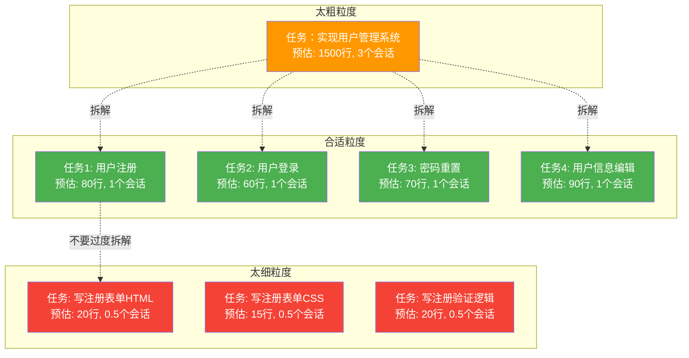
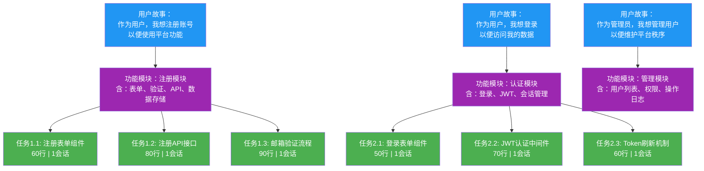
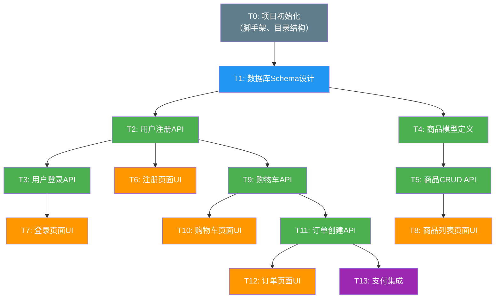
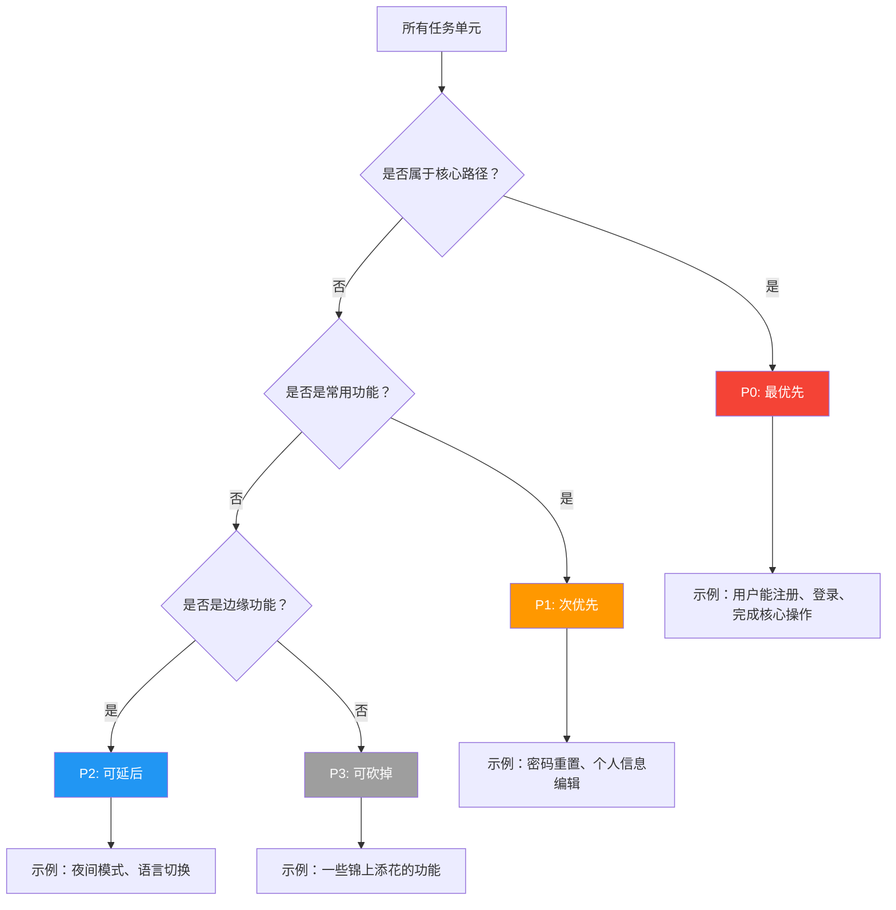

# 项目拆解：从庞然大物到可消化单元

> [!abstract] 核心隐喻
> 把 AI 当成**"每天换一个外包程序员"**。你不可能让一个今天刚来的外包程序员理解你整个项目的上下文。你能做的，就是把大任务拆成他能在一个下午完成的小任务，给他一份清晰的说明书，让他做完一个独立的、可验证的单元。

---

## 一、为什么拆解是 AI 超长项目的基石

### 1.1 AI 的"记忆天花板"

AI 编程助手在单个会话中存在上下文窗口限制。当会话结束时，AI 不会"记住"上一个会话中讨论过的细节。即使你打开一个新会话并把之前的对话总结粘贴进去，信息的保真度也会逐层衰减。


> [!warning] 关键认知
> **不要试图让 AI 在多个会话中"记住"所有事情。** 正确的策略是：让每个会话只处理一个独立的任务单元，AI 不需要知道全局，只需要知道当前任务。

### 1.2 拆解的本质

拆解的目标不是简单的"把大任务变小"，而是：

- **降低认知负荷**：每个任务单元的信息量小于 AI 的上下文窗口
- **建立可验证的边界**：每个任务单元完成后可以独立验证
- **减少耦合**：任务之间的依赖关系是显式的、可追踪的
- **支持并行**：独立的任务可以并行执行

---

## 二、拆解原则

### 2.1 四大核心原则

> [!tip] 原则一：每个任务单元 < 200 行代码变更
> 200 行不是硬性上限，而是一个**警告阈值**。当一个任务单元预计产生超过 200 行代码变更时，你应该停下来问自己：这个任务是否可以进一步拆分？

> [!tip] 原则二：每个任务单元可独立测试
> 做完这个任务单元后，你应该能运行一个或多个测试来验证它是否正确。如果做完后无法独立验证，说明拆解粒度有问题。

> [!tip] 原则三：每个任务单元有明确完成标准（Definition of Done）
> 完成标准必须是客观的、可度量的。不是"实现了用户登录"，而是"用户可以通过邮箱和密码登录，登录成功后跳转到首页，登录失败显示错误提示"。

> [!tip] 原则四：一个会话内可完成
> 假设一个 AI 会话的有效工作时间是 2-4 小时。你的任务单元必须在这个时间窗口内完成。如果一个任务需要 3 个会话才能完成，说明它其实是一个"功能模块"而不是"任务单元"。

### 2.2 拆解粒度示意



> [!warning] 过犹不及
> 过度拆解会导致**上下文切换成本**超过任务本身的价值。如果一个任务单元只需要 10 分钟就能完成，但你需要花 15 分钟给 AI 解释上下文，那这个拆解就是失败的。

---

## 三、拆解方法论：三层拆解

### 3.1 从用户故事到功能模块到任务单元

拆解是一个自上而下的过程，分为三个层次：



### 3.2 第一层：用户故事（User Story）

用户故事是最高层的抽象，从用户视角描述系统应该做什么。一个好的用户故事格式：

```
作为 [角色]，我想 [功能]，以便 [价值/目的]
```

**示例**：
- 作为**普通用户**，我想**注册账号**，以便**使用平台的全部功能**
- 作为**内容创作者**，我想**发布文章**，以便**与读者分享我的知识**
- 作为**管理员**，我想**查看用户活跃度统计**，以便**了解平台运营状况**

> [!info] 用户故事的质量标准
> 一个好的用户故事应该满足 **INVEST** 原则：
> - **I**ndependent（独立）：故事之间尽量独立
> - **N**egotiable（可协商）：不是固定合同，可以讨论细节
> - **V**aluable（有价值）：对用户或业务有明确价值
> - **E**stimable（可估算）：可以估算工作量
> - **S**mall（小）：足够小，可以在一个迭代内完成
> - **T**estable（可测试）：有明确的验收标准

### 3.3 第二层：功能模块（Feature Module）

功能模块是用户故事的实现分解。一个用户故事通常对应 1-3 个功能模块。

**拆解过程**：
1. 从用户故事中提取所有"名词"和"动词"
2. 将相关的名词和动词组合成功能模块
3. 识别模块之间的依赖关系

**示例**：用户故事"作为用户，我想注册账号"
- 功能模块 1：注册表单（前端 UI）
- 功能模块 2：注册 API（后端接口）
- 功能模块 3：邮箱验证（验证流程）

### 3.4 第三层：任务单元（Task Unit）

任务单元是 AI 一个会话内可以完成的最小可交付单元。这是整个拆解体系中最关键的一层。

**拆解技巧**：

1. **按技术层拆解**：前端 ↔ 后端 ↔ 数据库
2. **按数据流拆解**：输入 → 处理 → 输出
3. **按状态拆解**：正常路径 → 边界条件 → 异常处理
4. **按角色拆解**：普通用户 → VIP 用户 → 管理员

---

## 四、DAG 依赖管理

### 4.1 什么是 DAG

DAG（Directed Acyclic Graph，有向无环图）是一种用节点和有向边表示任务依赖关系的数据结构。它有两个关键特性：

- **有向（Directed）**：依赖关系有方向（A → B 表示 B 依赖 A，必须先完成 A 才能做 B）
- **无环（Acyclic）**：不能存在循环依赖（A → B → C → A 是非法的）

### 4.2 为什么用 DAG

> [!important] DAG 的核心价值
> - **可视化依赖关系**：一眼就能看出哪些任务可以并行，哪些任务必须串行
> - **识别关键路径**：找到从开始到结束的最长依赖链，这就是项目的"最短完成时间"
> - **检测循环依赖**：如果图中出现环，说明你的拆解有问题
> - **支持增量开发**：随时可以知道当前应该做哪些任务

### 4.3 任务依赖 DAG 示例

以下是一个电商项目的任务依赖关系图：



### 4.4 如何从 DAG 中提取执行计划

1. **识别入度为 0 的节点**：这些是没有依赖的任务，可以立即开始
2. **标记并行任务**：同一层级的任务可以并行执行（在不同会话中）
3. **计算关键路径**：从起点到终点的最长路径，决定了项目的最短工期

以上图为例：
- **第一批（可并行）**：T0, T1（完成后可做 T2, T4）
- **第二批（可并行）**：T2, T4, T6, T7（T2 完成后可做 T3, T9）
- **第三批（可并行）**：T3, T5, T8, T9, T10
- **第四批（可并行）**：T11, T12, T13

---

## 五、优先级排序：Happy Path 优先

### 5.1 核心准则

> [!danger] 黄金法则
> **如果 AI 中途"换人"，核心路径（Happy Path）必须已经可用。**

这句话的意思是：假设你的项目需要 50 个会话，但 AI 在第 20 个会话时"换了人"（新的会话、新的上下文），那么前 20 个会话完成的功能应该已经构成一个**可运行、可演示的核心流程**。

### 5.2 优先级排序策略



### 5.3 Happy Path 的判断标准

对于一个功能模块，happy path 是指**最常见的、无异常的用户操作路径**。例如：

| 功能 | Happy Path | 边缘情况 |
|------|-----------|---------|
| 用户注册 | 用户填写正确信息 → 注册成功 | 邮箱已存在、密码太弱、验证码错误 |
| 商品搜索 | 输入关键词 → 返回匹配结果 | 无结果、关键词含特殊字符、超长关键词 |
| 下单支付 | 选商品 → 填地址 → 付款成功 | 库存不足、支付失败、地址校验失败 |

> [!tip] 实践建议
> 在规划任务优先级时，先列出所有 Happy Path 任务，确保它们先完成。边缘情况和异常处理放在后面。这样即使项目中途断掉，至少核心流程是完整的。

---

## 六、任务描述模板

### 6.1 标准化任务格式

每个任务单元必须包含以下字段，以便 AI 在任何会话中都能快速理解并执行：

```markdown
## 任务编号：T-XXX

### 任务目标
[用一句话描述这个任务要完成什么]

### 背景上下文
[这个任务在整个项目中的位置，以及它依赖哪些已完成的任务]

### 输入
- 参考文件：[列出 AI 需要阅读的已有文件路径]
- 参考文档：[列出相关的设计文档或 API 文档]
- 依赖任务：[列出本任务依赖的已完成任务编号]

### 输出
- 新建文件：[列出需要创建的新文件]
- 修改文件：[列出需要修改的已有文件]
- 交付物描述：[描述最终交付物应该是什么样的]

### 约束
- 不能修改：[列出绝对不能动的文件或模块]
- 技术栈限制：[列出必须使用的技术栈和版本]
- 兼容性要求：[列出向后兼容方面的要求]

### 验收标准（Definition of Done）
- [ ] 验收条件 1：[可客观验证的条件]
- [ ] 验收条件 2：[可客观验证的条件]
- [ ] 验收条件 3：[可客观验证的条件]

### 预估工作量
- 代码行数：约 XX 行
- 预计会话数：1 个会话
```

### 6.2 填写示例

以下是一个真实的任务描述示例：

```markdown
## 任务编号：T-012

### 任务目标
实现用户注册 API 接口（POST /api/auth/register）

### 背景上下文
本任务属于认证模块，是用户注册流程的后端实现。前端注册表单（T-011）已完成，数据库用户表（T-001）已创建。

### 输入
- 参考文件：`src/models/user.ts`（用户数据模型）
- 参考文件：`src/middleware/validation.ts`（请求验证中间件）
- 参考文档：`docs/api-spec.md` 第 3.1 节
- 依赖任务：T-001（数据库 Schema），T-011（注册表单组件）

### 输出
- 新建文件：`src/routes/auth.ts`（认证路由）
- 新建文件：`src/services/auth.service.ts`（认证服务）
- 修改文件：`src/app.ts`（注册新路由）
- 测试文件：`tests/auth/register.test.ts`（注册接口测试）
- 交付物描述：一个可用的 POST /api/auth/register 端点，接受邮箱和密码，返回 JWT token

### 约束
- 不能修改：`src/models/user.ts` 中的字段定义（已锁定）
- 技术栈限制：使用 Express.js 4.x + TypeScript + bcrypt
- 兼容性要求：返回的 token 格式必须与现有认证中间件（T-005）兼容

### 验收标准（Definition of Done）
- [ ] 使用有效邮箱和密码调用接口，返回 201 和 JWT token
- [ ] 使用已注册邮箱调用接口，返回 409 和错误信息
- [ ] 使用无效邮箱格式调用接口，返回 400 和验证错误
- [ ] 密码长度小于 8 位时返回 400
- [ ] 单元测试覆盖率 > 80%
- [ ] 所有现有测试仍然通过

### 预估工作量
- 代码行数：约 80 行
- 预计会话数：1 个会话
```

---

## 七、拆解反模式

### 7.1 反模式一：任务太大

> [!failure] 症状
> AI 在一个会话中做不完任务，留下半成品。下次会话时需要花大量时间理解上下文，导致效率极低。

**诊断标准**：
- 任务预估代码变更 > 200 行
- 任务描述中包含 "和" 超过 3 次（如"实现注册和登录和密码重置"）
- 验收标准超过 8 条

**解决方案**：按技术层、数据流或状态进行二次拆分。

### 7.2 反模式二：任务太小

> [!failure] 症状
> 频繁切换会话，每个会话的工作量很小，但上下文建立成本很高。AI 在理解任务上花的时间比执行任务还多。

**诊断标准**：
- 任务预估代码变更 < 20 行
- 建立上下文需要的时间 > 执行任务的时间
- 多个任务之间有大量重复的上下文

**解决方案**：将相关的小任务合并为一个任务单元。例如，"写注册表单 HTML" 和 "写注册表单 CSS" 可以合并为 "实现注册表单 UI 组件"。

### 7.3 反模式三：任务耦合强

> [!failure] 症状
> 任务 A 和任务 B 互相依赖，或者任务 A 的修改必然导致任务 B 也要修改。AI 在完成任务 A 后，发现任务 B 的代码已经被破坏了。

**诊断标准**：
- 任务 A 的验收标准中需要检查"任务 B 仍然正常"
- 修改任务 A 的代码时，经常需要同时修改任务 B 的代码
- 两个任务共享过多的内部状态或工具函数

**解决方案**：
1. 先在两个任务之间建立明确的接口契约
2. 通过接口/抽象层解耦
3. 考虑是否应该重新划分任务边界

### 7.4 反模式四：顺序依赖过深

> [!failure] 症状
> 任务 A → 任务 B → 任务 C → 任务 D → 任务 E，每个任务都依赖前一个任务，导致项目无法并行推进。

**诊断标准**：
- DAG 图中关键路径占总任务数的 60% 以上
- 每次只能做一个任务，其他任务都在等待

**解决方案**：
1. 识别可以"桩化"（Stub）的依赖
2. 先定义接口，让下游任务基于接口开发
3. 使用 Mock 数据隔离依赖

### 7.5 反模式五：预留"将来再说"

> [!failure] 症状
> 任务描述中反复出现"暂时 hardcode"、"先用假数据"、"以后优化"等表述，导致技术债务快速积累。

**诊断标准**：
- 一个任务单元中有超过 3 处 TODO/FIXME/HACK 注释
- 任务描述中明确指出"这是临时方案"

**解决方案**：
1. 为每个"将来再说"创建一个独立的任务单元
2. 在 DAG 中标记这些任务，确保它们不会被遗忘
3. 评估"临时方案"是否真的可以接受——有些临时方案会在后续引发连锁问题

---

## 八、拆解检查清单

### 8.1 每个任务单元的自检

在做完一个任务单元的拆解后，用以下清单自检：

> [!checklist] 任务单元检查清单
> - [ ] 做完这个任务单元后，能否**独立验证**结果？
> - [ ] 这个任务单元是否**只做一件事**？（单一职责）
> - [ ] 这个任务单元是否**影响其他模块**？如果影响，是否已经沟通？
> - [ ] 这个任务单元的**依赖是否已经就绪**？
> - [ ] 这个任务单元能否在一个**2-4 小时的会话**内完成？
> - [ ] 这个任务单元的**验收标准是否客观可度量**？
> - [ ] 这个任务单元是否**不需要额外的上下文**就能被 AI 理解？
> - [ ] 如果这个任务单元在今天之后"换人"做，新的人能不能看懂任务描述？

### 8.2 整个项目拆解的自检

> [!checklist] 项目拆解检查清单
> - [ ] DAG 图中**没有循环依赖**？
> - [ ] 关键路径上的任务是否**不超过总任务数的 60%**？
> - [ ] Happy Path 任务是否**排在最前面**？
> - [ ] 是否有**至少 30% 的任务可以并行**？（不同会话中）
> - [ ] 每个任务单元是否都有**唯一的编号**？
> - [ ] 任务之间的**接口契约是否明确**？
> - [ ] 是否有一个**总览文档**汇总所有任务及其状态？

---

## 九、与其他文档的关系

本文件是"超长项目 AI 跑"知识库的第四篇文档。在了解任务拆解之后，你需要：

- 继续阅读 [[01-AI技术/超长项目AI跑/05_版本控制与渐进式交付]]，了解如何用 Git 管理每会话的产出
- 继续阅读 [[01-AI技术/超长项目AI跑/06_测试驱动：让AI自己守护质量]]，了解如何确保每个任务单元的质量
- 回到 [[01-AI技术/超长项目AI跑/02_上下文管理：AI的记忆体系]]，了解上下文传递策略（如果已创建）

---

## 十、总结

> [!summary] 核心要点
> 1. **拆解是 AI 超长项目的第一性原理**：不拆解，就无法跨会话推进
> 2. **DAG 是你的地图**：用有向无环图管理依赖，让并行和串行一目了然
> 3. **Happy Path 优先**：确保核心路径在任何时候都可用，应对"AI 换人"风险
> 4. **标准化任务描述**：让每个 AI 会话都能快速上手，减少上下文建立成本
> 5. **警惕反模式**：太大、太小、太耦合、太深的拆解都会拖慢进度

拆解不是一次性的工作。随着项目的推进，你可能会发现某些任务需要重新拆分或合并。**拆解是一个持续迭代的过程**，就像外包项目经理每天都在调整任务分配一样。