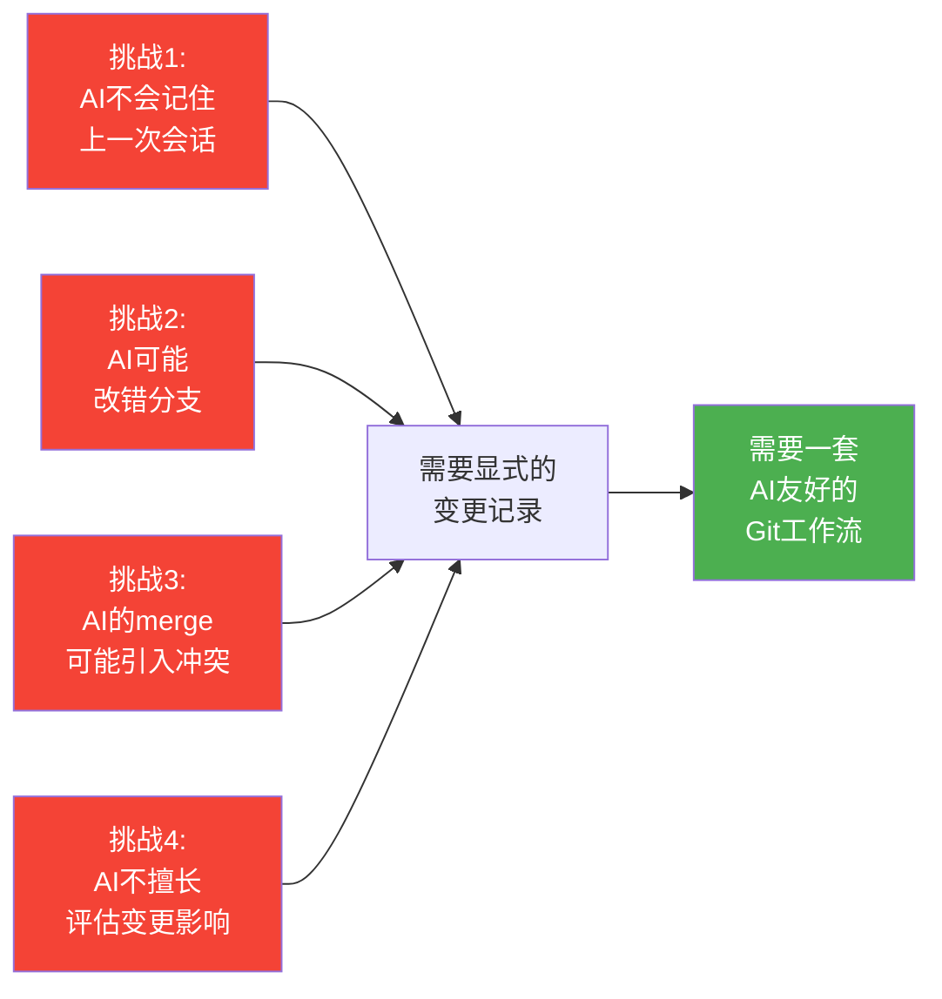
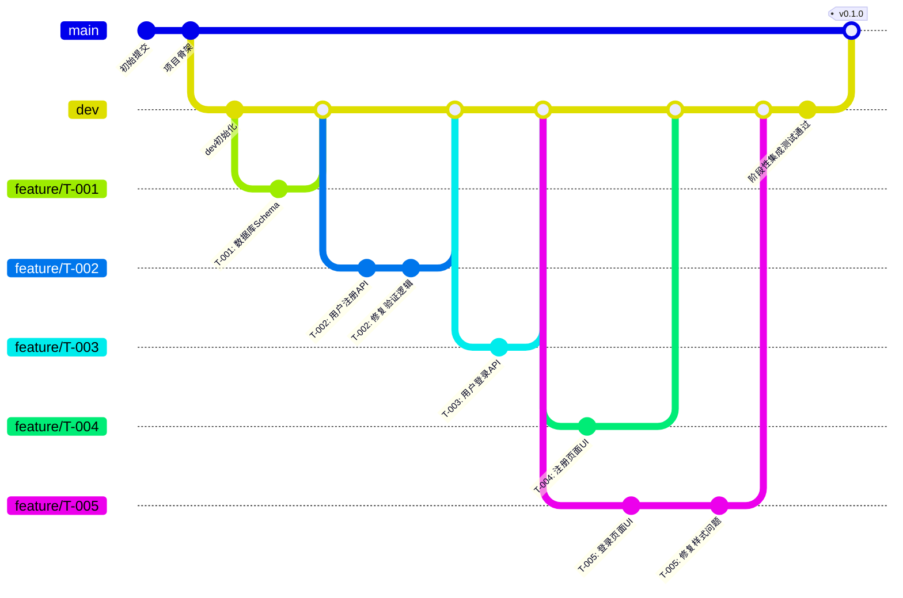
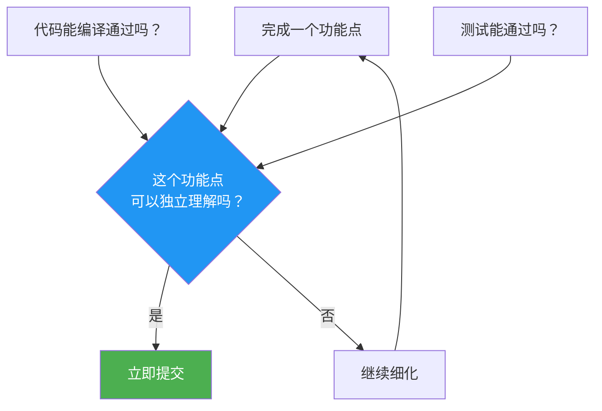
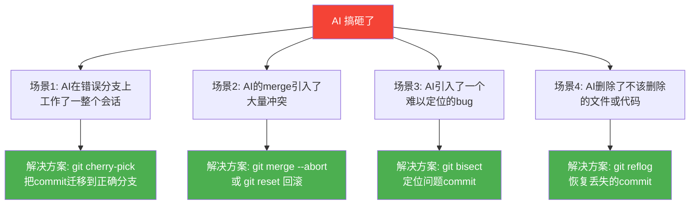
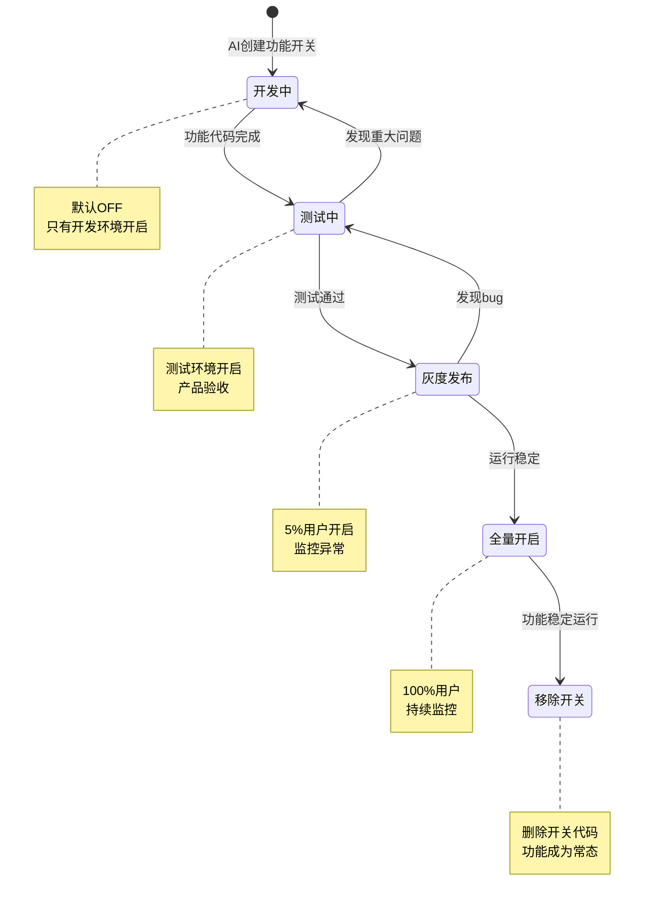
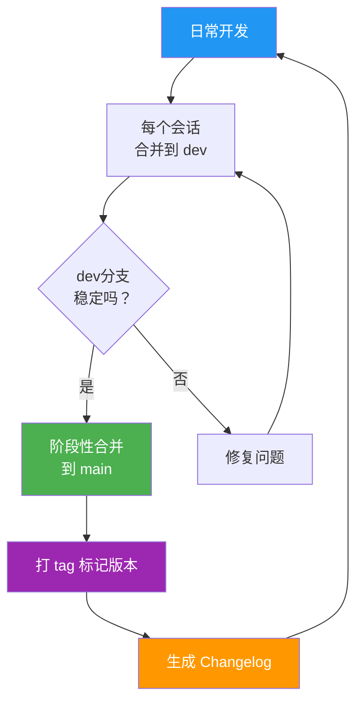

# 版本控制与渐进式交付

> [!abstract] 核心隐喻
> 把 AI 当成**"每天换一个外包程序员"**。你不可能指望今天的"外包程序员"知道昨天的"外包程序员"做了什么、改了哪些文件、为什么那样改。你需要的是一套严谨的版本控制体系，让任何人在任何时候接手项目，都能清楚地知道"发生了什么"、"当前是什么状态"、"下一步应该做什么"。

---

## 一、为什么 AI 超长项目需要特殊的版本控制策略

### 1.1 AI 编程的独特挑战

传统的版本控制面向的是"同一个人持续开发"的场景。但 AI 超长项目面临的是截然不同的挑战：



> [!warning] 关键认知
> 在传统的软件开发中，Git 是"记录工具"；在 AI 超长项目中，Git 是**"交接工具"**。每个 commit 都是一份"给下一个 AI 会话的交接文档"。

### 1.2 版本控制的核心目标

在 AI 超长项目中，版本控制需要实现以下目标：

1. **可追溯**：任何一个变更都能追溯到"哪个任务、哪个会话、什么目的"
2. **可回滚**：任何时候都能快速回到最近的安全点
3. **可隔离**：不同任务的工作互不干扰，出问题不影响主线
4. **可协作**：多个会话（甚至多个人）可以并行开发

---

## 二、Git 工作流：每会话一个功能分支

### 2.1 分支策略核心原则

> [!important] 每会话一个分支
> 每个 AI 会话都应该在**自己的功能分支**上工作。这个分支的生命周期 = 一个会话的生命周期。会话结束时，分支要么被合并，要么被归档。

### 2.2 分支命名规范

```
feature/T-{任务编号}-{简短描述}
```

**示例**：
- `feature/T-001-project-init`
- `feature/T-012-user-register-api`
- `feature/T-025-product-search`

> [!tip] 为什么这样命名
> 分支名直接关联到任务编号，使得任何人都能快速从分支名定位到具体的任务描述文档。这比 `feature/user-auth` 这样的命名要精确得多。

### 2.3 分支策略图



### 2.4 分支工作流详解

**阶段一：会话开始时**

```bash
# 1. 确保本地是最新的
git checkout dev
git pull origin dev

# 2. 从 dev 创建功能分支
git checkout -b feature/T-XXX-task-description

# 3. 确认当前在正确的分支上
git branch --show-current
# 输出: feature/T-XXX-task-description
```

**阶段二：会话进行中**

```bash
# 每完成一个独立的功能单元就提交
git add src/services/auth.service.ts
git commit -m "feat(T-012): 实现用户注册 API

完成 POST /api/auth/register 端点，支持邮箱和密码注册。
返回 JWT token 用于后续认证。

关联任务: T-012
验收条件: 所有注册相关测试通过"
```

**阶段三：会话结束时**

```bash
# 1. 确保所有修改已提交
git status

# 2. 切回 dev 并合并
git checkout dev
git merge feature/T-XXX-task-description

# 3. 推送到远程
git push origin dev

# 4. 删除本地功能分支（可选，保留一段时间便于回溯）
git branch -d feature/T-XXX-task-description
```

---

## 三、增量提交策略：小步快跑

### 3.1 核心原则

> [!tip] 提交粒度黄金法则
> **每个 commit 应该是一个"可理解的变更"**。如果你的 commit message 需要写三行以上才能解释清楚，说明这个 commit 太大了。

### 3.2 什么时候提交



**提交时机**：
- 完成一个函数或方法
- 通过一个测试用例
- 修复一个 bug
- 完成一个重构步骤
- 添加一个文档

**不提交的时机**：
- 代码无法编译
- 测试失败
- 工作进行到一半
- 临时调试代码

### 3.3 提交频率建议

| 任务类型 | 建议提交频率 | 说明 |
|---------|------------|------|
| 新建功能 | 每 30-50 行代码一次 | 功能点明确，自然分段 |
| 重构 | 每完成一个重构步骤一次 | 确保每次重构都可以独立回滚 |
| Bug 修复 | 修复 + 测试一起提交 | 修复和验证不可分割 |
| 文档更新 | 每完成一个章节一次 | 文档变更通常不涉及代码 |

> [!warning] 不要过度提交
> 如果每次提交只有 2-3 行代码变更，反而会让你在 `git log` 中迷失方向。找到合适的粒度是一门艺术，需要在实践中不断调整。

---

## 四、Commit Message 规范

### 4.1 AI 友好的 Commit Message 模板

在 AI 超长项目中，commit message 需要服务两个读者：**人类**和**下一个 AI 会话**。因此，它需要比传统的 commit message 携带更多信息。

```markdown
<type>(<scope>): <简短描述>

<详细描述：做了什么、为什么这样做>

关联任务: <任务编号>
关联会话: <会话标识>
验收状态: <✅ 通过 / ⚠️ 部分通过 / ❌ 未通过>
```

### 4.2 Type 类型定义

| Type | 用途 | 示例 |
|------|------|------|
| `feat` | 新功能 | `feat(T-012): 实现用户注册 API` |
| `fix` | Bug 修复 | `fix(T-012): 修复邮箱验证正则表达式` |
| `refactor` | 重构（不改变功能） | `refactor(auth): 提取 JWT 工具函数` |
| `test` | 测试相关 | `test(T-012): 添加注册接口边界测试` |
| `docs` | 文档更新 | `docs: 更新 API 接口文档` |
| `style` | 代码格式（不影响逻辑） | `style: 格式化代码，统一缩进` |
| `chore` | 构建/工具配置 | `chore: 添加 ESLint 配置` |
| `perf` | 性能优化 | `perf(auth): 优化密码哈希算法` |

### 4.3 完整示例

```
feat(T-012): 实现用户注册 API

实现 POST /api/auth/register 端点，允许用户通过邮箱和密码
注册新账号。注册成功后返回 JWT token。

技术细节：
- 使用 bcrypt 对密码进行哈希处理
- 密码强度要求：至少 8 位，包含字母和数字
- 邮箱格式通过正则表达式验证
- 重复邮箱注册返回 409 Conflict

关联任务: T-012
关联会话: 2026-07-27-session-3
验收状态: ✅ 通过
验收详情:
  - ✅ 有效邮箱注册返回 201 + JWT
  - ✅ 重复邮箱注册返回 409
  - ✅ 无效邮箱格式返回 400
  - ✅ 弱密码返回 400
  - ✅ 单元测试覆盖率 87%
  - ✅ 已有测试全部通过
```

### 4.4 为什么标准的 Commit Message 不够

> [!important] AI 需要的信息 vs 人类需要的信息
> 传统的 commit message 面向的是"熟悉项目的人"——他们知道项目上下文，只需要一个简短的提示就能理解变更。但 AI 会话是"零上下文"的——下一个会话的 AI 对这个项目一无所知。因此，commit message 需要提供足够的上下文，让 AI 能在不看代码的情况下理解变更的意图和影响。

---

## 五、回滚与恢复：当 AI 搞砸了

### 5.1 常见需要回滚的场景



### 5.2 场景一：AI 在错误分支上工作

```bash
# 假设 AI 在 feature/T-005 分支上做了本来应该在 feature/T-006 上的工作

# 1. 找到所有在错误分支上的 commit
git log feature/T-005 --oneline

# 2. 切换到正确的分支
git checkout feature/T-006

# 3. 使用 cherry-pick 迁移需要的 commit
git cherry-pick <commit-hash-1> <commit-hash-2>

# 4. 回到错误分支，回退到正确状态
git checkout feature/T-005
git reset --hard <正确的commit-hash>
```

### 5.3 场景二：AI 的 merge 引入冲突

```bash
# 如果 merge 正在进行中且冲突难以解决
git merge --abort

# 如果 merge 已经完成但发现有问题
git reset --hard HEAD~1  # 回到 merge 之前的状态

# 如果 merge 已经推送到远程
git revert -m 1 <merge-commit-hash>  # 创建一个反向 commit 撤销 merge
```

### 5.4 场景三：AI 引入难以定位的 bug

```bash
# 使用 git bisect 二分查找问题 commit
git bisect start
git bisect bad HEAD           # 当前版本有问题
git bisect good <last-known-good-commit>  # 最后一个已知正常的版本

# Git 会自动 checkout 中间版本，测试后标记
git bisect good   # 如果这个版本没问题
git bisect bad    # 如果这个版本有问题

# 重复直到找到问题 commit
# 完成后退出 bisect 模式
git bisect reset
```

### 5.5 场景四：恢复"丢失"的 commit

```bash
# git reflog 记录了所有 HEAD 的移动历史，包括被"删除"的 commit
git reflog

# 输出示例:
# abc1234 HEAD@{0}: reset: moving to HEAD~1
# def5678 HEAD@{1}: commit: feat(T-012): 实现用户注册 API
# ghi9012 HEAD@{2}: commit: fix: 修复验证逻辑

# 恢复到被"删除"的 commit
git checkout -b recovery-branch def5678
# 或者
git cherry-pick def5678
```

> [!warning] reflog 不是永久的
> `git reflog` 默认只保留 90 天的记录，且只存在于本地仓库。如果已经 `git push --force` 覆盖了远程，reflog 是你最后的救命稻草。

### 5.6 Stash：临时保存未完成的工作

```bash
# 当 AI 需要临时切换分支但当前工作还未完成时
git stash save "WIP: T-012 注册API进行中"

# 查看 stash 列表
git stash list

# 恢复 stash
git stash pop

# 丢弃 stash
git stash drop
```

---

## 六、功能开关（Feature Flag）

### 6.1 为什么需要功能开关

在 AI 超长项目中，你经常会遇到这种情况：AI 完成了一个功能，但这个功能依赖于另一个尚未完成的功能，或者这个功能的部分边缘情况还未处理。

> [!important] 功能开关的核心价值
> 功能开关让你可以**将未完成的代码合并到主分支，而不影响主流程**。这解决了 AI 超长项目中最核心的矛盾：你需要频繁合并（避免分支发散），但你又不能让"半成品"影响已有功能。

### 6.2 功能开关的实现

```typescript
// config/features.ts
export const FEATURE_FLAGS = {
  // 核心功能 - 始终开启
  USER_REGISTRATION: true,
  USER_LOGIN: true,
  
  // 实验性功能 - 通过开关控制
  PASSWORD_RESET: process.env.FEATURE_PASSWORD_RESET === 'true',
  SOCIAL_LOGIN: process.env.FEATURE_SOCIAL_LOGIN === 'true',
  TWO_FACTOR_AUTH: process.env.FEATURE_TWO_FACTOR === 'true',
  
  // 开发中功能 - 默认关闭
  DARK_MODE: process.env.FEATURE_DARK_MODE === 'true',
  EXPORT_CSV: process.env.FEATURE_EXPORT_CSV === 'true',
} as const;

// 使用示例
import { FEATURE_FLAGS } from '@/config/features';

if (FEATURE_FLAGS.PASSWORD_RESET) {
  app.use('/api/auth/password-reset', passwordResetRouter);
}
```

### 6.3 功能开关的生命周期



### 6.4 功能开关的命名规范

```
{功能名称}_{状态后缀}
```

**示例**：
- `PASSWORD_RESET_ENABLED`
- `DARK_MODE_BETA`
- `EXPORT_CSV_EXPERIMENTAL`

> [!tip] 实践建议
> 在 AI 会话中，一定要在任务描述中明确标注"该功能使用功能开关 X 控制"。这样下一个 AI 会话就知道这个功能是否存在、是否已经启用。

---

## 七、AI 协作中的 Git 陷阱

### 7.1 陷阱一：AI 忘记切换分支

> [!failure] 症状
> AI 在 `dev` 或 `main` 分支上直接修改代码，而不是在功能分支上工作。

**预防措施**：
1. 在每次会话开始时，明确要求 AI 创建并切换到功能分支
2. 在任务描述中第一行就写："请先在 `dev` 分支基础上创建 `feature/T-XXX` 分支"
3. 在会话中定期提醒 AI 确认当前分支

**恢复方法**：
```bash
# 如果尚未提交
git stash
git checkout -b feature/T-XXX
git stash pop

# 如果已经提交但不应该直接在 dev 上
git log --oneline -5  # 找到需要迁移的 commit
git checkout -b feature/T-XXX
git cherry-pick <commit-hash>
git checkout dev
git reset --hard origin/dev
```

### 7.2 陷阱二：AI 在错误的分支上修改

> [!failure] 症状
> AI 在 `feature/T-005` 分支上修改了属于 `feature/T-006` 的代码。

**预防措施**：
1. 每个任务描述中明确列出"输出文件"的范围
2. 在会话开始时让 AI 确认"本任务只修改以下文件"
3. 使用 Git hooks 检查文件修改范围

**恢复方法**：使用 `git cherry-pick` 迁移 commit（见 5.2）。

### 7.3 陷阱三：AI 的 merge 引入冲突

> [!failure] 症状
> AI 执行 `git merge` 时自动解决了冲突，但解决方式不正确，导致代码逻辑错误。

**预防措施**：
1. 不要让 AI 自动解决冲突，应该由人来审查
2. 在合并前先 `git fetch` 和 `git diff` 查看差异
3. 使用 `git merge --no-ff` 保留合并历史

**恢复方法**：
```bash
# 如果 merge 尚未完成
git merge --abort

# 如果 merge 已完成但有问题
git reset --hard HEAD~1
```

### 7.4 陷阱四：AI 的 force push

> [!failure] 症状
> AI 使用 `git push --force` 覆盖远程分支，导致其他人的工作丢失。

**预防措施**：
1. **永远不要让 AI 使用 `--force` 推送**
2. 使用 `git push --force-with-lease` 作为更安全的替代
3. 在 Git 配置中禁用 force push：`git config --global push.default simple`

> [!danger] 高危操作
> `git push --force` 是 AI 超长项目中最危险的操作之一。它不仅会丢失代码，还会丢失宝贵的 commit 历史。在任务描述中应该明确写："不要使用 force push"。

### 7.5 陷阱五：AI 忽略 .gitignore

> [!failure] 症状
> AI 将 `node_modules`、`.env`、构建产物等不该提交的文件加入了版本控制。

**预防措施**：
1. 在项目初始化时就创建完整的 `.gitignore`
2. 在任务描述中明确："不要提交 node_modules 和构建产物"
3. 使用 `git status` 检查暂存区

---

## 八、阶段性合并与版本发布

### 8.1 阶段性合并策略



### 8.2 版本号规范

采用语义化版本（Semantic Versioning）：

```
v{主版本号}.{次版本号}.{修订号}
```

- **主版本号**：不兼容的 API 修改（大功能完成）
- **次版本号**：向下兼容的功能新增（阶段性里程碑）
- **修订号**：向下兼容的问题修正（Bug 修复）

**示例**：
- `v0.1.0`：核心注册流程完成
- `v0.2.0`：商品浏览功能完成
- `v0.2.1`：修复商品搜索 bug
- `v1.0.0`：MVP 发布

### 8.3 合并前的检查清单

> [!checklist] 合并到 main 前的检查清单
> - [ ] 所有计划内的任务已完成并通过验收？
> - [ ] 全量回归测试通过？
> - [ ] 代码覆盖率 > 80%？
> - [ ] 没有未解决的 merge 冲突？
> - [ ] 功能开关状态正确？（新功能已开启，实验功能已关闭）
> - [ ] 是否有遗留的调试代码或 console.log？
> - [ ] Changelog 已更新？

---

## 九、与其他文档的关系

本文件是"超长项目 AI 跑"知识库的第五篇文档。在了解版本控制策略之后，你需要：

- 返回 [[01-AI技术/超长项目AI跑/04_项目拆解：从庞然大物到可消化单元]]，回顾任务拆解和 DAG 管理
- 继续阅读 [[01-AI技术/超长项目AI跑/06_测试驱动：让AI自己守护质量]]，了解如何确保每次合并的质量
- 查看 [[02_会话管理：从单次对话到长周期协作]]，了解会话级别的管理策略（如果已创建）

---

## 十、总结

> [!summary] 核心要点
> 1. **Git 是交接工具，不是记录工具**：每个 commit 都是给下一个 AI 会话的"交接文档"
> 2. **每会话一个分支**：隔离风险，让每个会话的工作独立可控
> 3. **小步快跑提交**：每个 commit 都是"可理解的变更"，让回滚精确到点
> 4. **AI 不解决冲突**：merge 冲突由人来决定，AI 只负责写代码
> 5. **功能开关是保险**：让"半成品"可以安全地合并到主分支
> 6. **永远不要 force push**：这是 AI 超长项目中最危险的操作

版本控制不是为了让代码"看起来专业"，而是为了**在 AI 频繁"换人"的情况下，让项目始终保持可控、可追溯、可恢复**。就像外包公司的项目经理不会让每个外包程序员直接改生产代码一样，你也不应该让每个 AI 会话直接修改 `main` 分支。