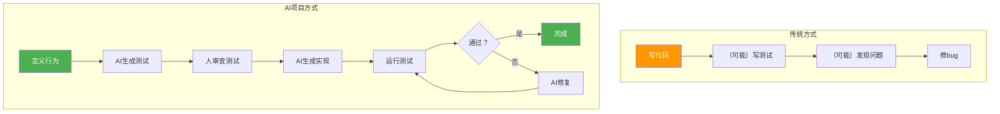
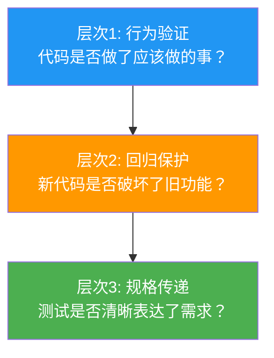
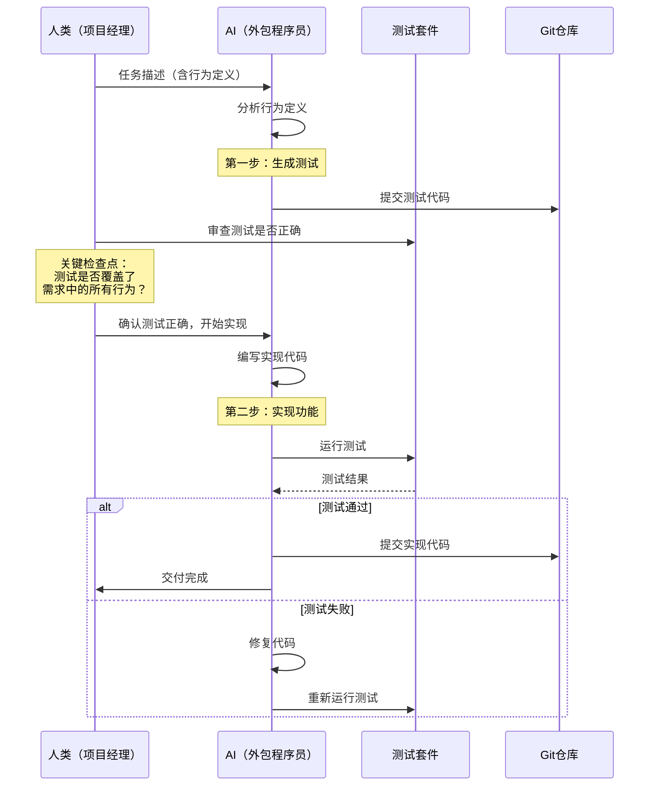
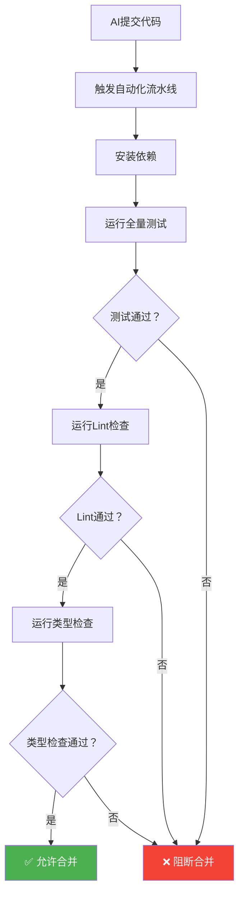
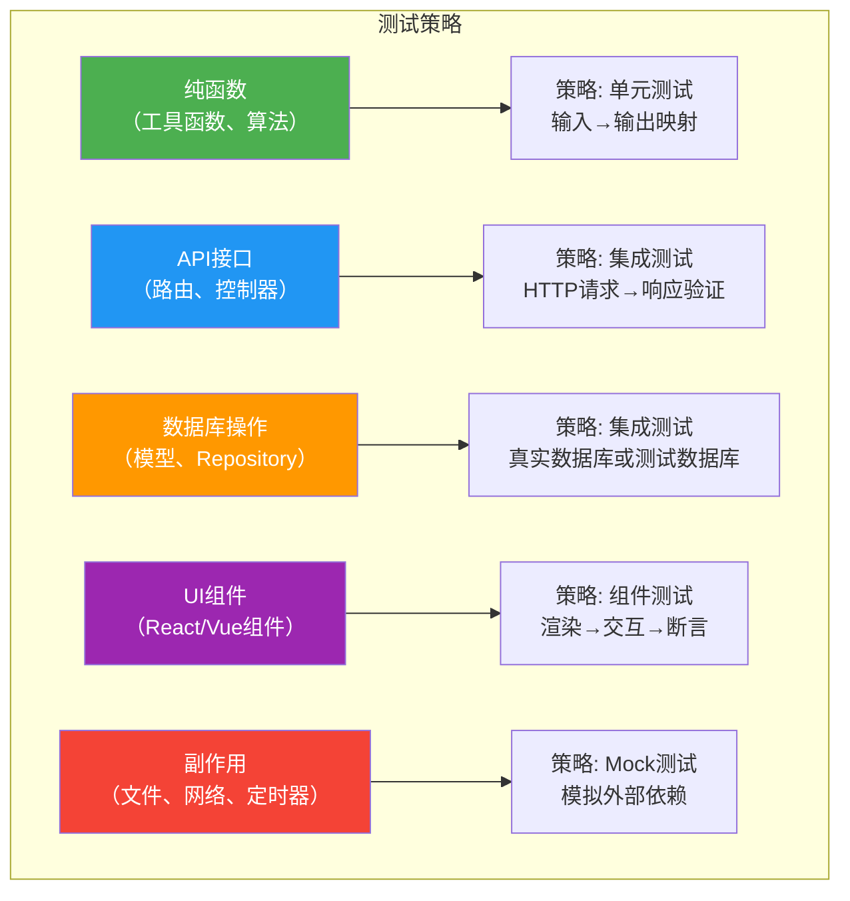
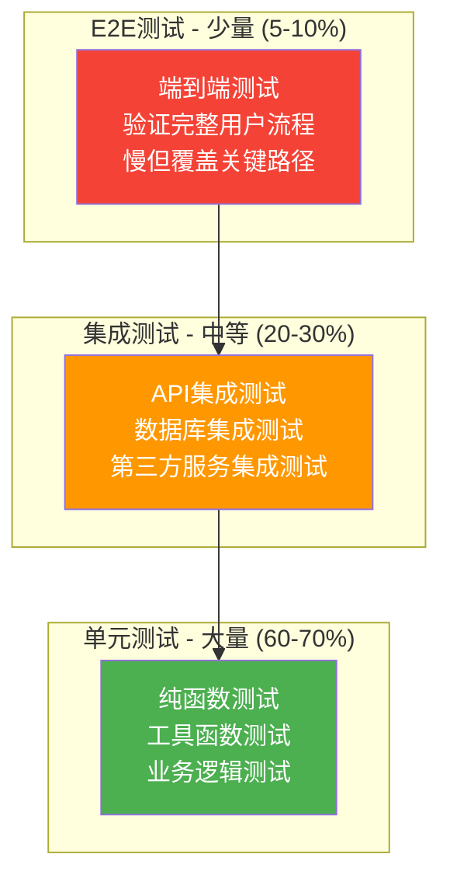
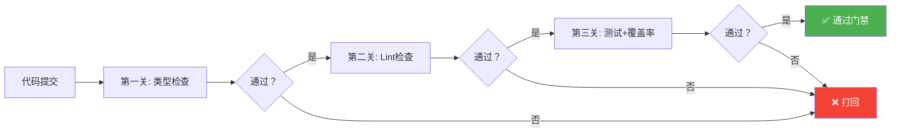

# 测试驱动：让AI自己守护质量

> [!abstract] 核心隐喻
> 把 AI 当成**"每天换一个外包程序员"**。你不可能信任一个今天刚来的外包程序员的代码质量。你需要的不是"相信他写对了"，而是"用测试来验证他写对了"。**测试不是给代码擦屁股，测试是给 AI 的"规格说明书"**——在 AI 写代码之前，先告诉它"什么是对的"。

---

## 一、AI 项目中的测试哲学

### 1.1 传统测试 vs AI 测试

在传统的软件开发中，测试通常发生在代码之后——先写代码，再写测试（或者干脆不写测试）。但在 AI 超长项目中，这个顺序必须被颠倒。



> [!important] 核心哲学
> 在 AI 项目中，测试的角色发生了根本性转变：
> - **传统项目**：测试是"验证工具"——验证代码是否正确
> - **AI 项目**：测试是"规格说明书"——在写代码之前定义"什么是正确"

### 1.2 为什么测试对 AI 项目尤其重要

| 场景 | 没有测试的风险 | 有测试的保障 |
|------|-------------|------------|
| AI 完成一个功能 | 不知道是否真的正确 | 运行测试，立刻知道结果 |
| AI 修改已有代码 | 不知道是否破坏了其他功能 | 全量回归，立刻发现回归 |
| 换一个 AI 会话 | 新 AI 不知道之前的约定 | 测试就是约定，新 AI 能看懂 |
| 合并功能分支 | 可能引入隐蔽 bug | 合并前跑测试，拦截问题 |
| 重构代码 | 重构可能改变行为 | 测试确保行为不变 |

### 1.3 测试的三个层次目标



> [!tip] 最重要的层次
> 在 AI 超长项目中，**层次3（规格传递）是最重要的**。一个好的测试应该让下一个 AI 会话能够理解"这个功能应该做什么"，而不需要翻看原始需求文档。

---

## 二、测试优先开发流程

### 2.1 完整流程



### 2.2 流程详解

**第一步：定义行为**

在任务描述中，行为定义是测试的"原材料"。行为定义应该用自然语言描述，但足够精确，能转化为测试用例。

```
行为定义示例（任务 T-012：用户注册 API）：

正常路径：
- 当用户提供有效的邮箱和符合强度要求的密码时，系统应创建用户账号并返回 JWT token

边界条件：
- 邮箱已存在时，系统应返回 409 Conflict
- 邮箱格式无效时，系统应返回 400 Bad Request
- 密码长度 < 8 时，系统应返回 400 Bad Request
- 密码不含数字时，系统应返回 400 Bad Request
- 密码不含字母时，系统应返回 400 Bad Request

异常情况：
- 数据库连接失败时，系统应返回 500 Internal Server Error
- 并发注册相同邮箱时，只有一个能成功
```

**第二步：AI 生成测试**

将行为定义提供给 AI，要求其生成对应的测试代码：

```typescript
// tests/auth/register.test.ts
// AI 根据行为定义生成的测试

describe('POST /api/auth/register', () => {
  // 正常路径
  describe('Happy Path', () => {
    it('should create user and return JWT when email and password are valid', async () => {
      const response = await request(app)
        .post('/api/auth/register')
        .send({ email: 'test@example.com', password: 'SecurePass123' });
      
      expect(response.status).toBe(201);
      expect(response.body).toHaveProperty('token');
      expect(response.body.token).toBeTruthy();
    });
  });

  // 边界条件
  describe('Edge Cases', () => {
    it('should return 409 when email already exists', async () => {
      // 先注册一个用户
      await request(app)
        .post('/api/auth/register')
        .send({ email: 'existing@example.com', password: 'SecurePass123' });
      
      // 再次注册相同邮箱
      const response = await request(app)
        .post('/api/auth/register')
        .send({ email: 'existing@example.com', password: 'SecurePass123' });
      
      expect(response.status).toBe(409);
    });

    it('should return 400 when email format is invalid', async () => {
      const response = await request(app)
        .post('/api/auth/register')
        .send({ email: 'not-an-email', password: 'SecurePass123' });
      
      expect(response.status).toBe(400);
    });

    it('should return 400 when password is too short', async () => {
      const response = await request(app)
        .post('/api/auth/register')
        .send({ email: 'test@example.com', password: 'Short1' });
      
      expect(response.status).toBe(400);
    });
  });

  // 异常情况
  describe('Error Handling', () => {
    it('should return 500 when database connection fails', async () => {
      // 模拟数据库故障
      jest.spyOn(db, 'query').mockRejectedValue(new Error('Connection refused'));
      
      const response = await request(app)
        .post('/api/auth/register')
        .send({ email: 'test@example.com', password: 'SecurePass123' });
      
      expect(response.status).toBe(500);
    });
  });
});
```

**第三步：人审查测试**

这是流程中**最关键的一步**。AI 生成的测试需要人审查，检查：

> [!checklist] 测试审查清单
> - [ ] 测试是否覆盖了行为定义中的所有场景？
> - [ ] 测试是否在测"行为"而不是"实现细节"？
> - [ ] 测试的断言是否精确？（不是 `expect(result).toBeTruthy()` 这种模糊断言）
> - [ ] 测试之间是否独立？（一个测试的失败不影响其他测试）
> - [ ] 测试数据是否清晰？（测试的输入和输出一目了然）
> - [ ] 是否有遗漏的边界条件？

**第四步：AI 生成实现**

确认测试正确后，让 AI 根据测试来写实现代码。此时 AI 的目标非常明确：**让所有测试通过**。

**第五步：运行测试，验证通过**

```bash
# 运行测试
npm test -- --coverage

# 期望输出
# PASS  tests/auth/register.test.ts
#   POST /api/auth/register
#     Happy Path
#       ✓ should create user and return JWT (45ms)
#     Edge Cases
#       ✓ should return 409 when email already exists (23ms)
#       ✓ should return 400 when email format is invalid (15ms)
#       ✓ should return 400 when password is too short (12ms)
#     Error Handling
#       ✓ should return 500 when database connection fails (18ms)
#
# Test Suites: 1 passed, 1 total
# Tests:       5 passed, 5 total
# Coverage:    87% (statements), 85% (branches), 90% (functions)
```

---

## 三、回归测试自动化

### 3.1 为什么需要自动化回归

在 AI 超长项目中，每个新会话都可能引入回归 bug。**人不可能在每次 AI 会话后手动跑一遍所有测试。** 自动化回归是唯一可行的方案。



### 3.2 本地自动化脚本

在项目根目录下创建一个自动化检查脚本，每次 AI 会话结束时运行：

```bash
#!/bin/bash
# scripts/quality-check.sh
# AI 会话结束时的质量检查脚本

set -e  # 任何命令失败时立即退出

echo "========================================="
echo "  质量门禁检查"
echo "========================================="

# 1. 运行全量测试
echo ""
echo "[1/4] 运行全量测试..."
npm test -- --coverage --verbose
TEST_EXIT=$?

# 2. 检查覆盖率
echo ""
echo "[2/4] 检查代码覆盖率..."
COVERAGE=$(cat coverage/coverage-summary.json | grep -o '"pct":[0-9.]*' | head -1 | cut -d: -f2)
if (( $(echo "$COVERAGE < 80" | bc -l) )); then
    echo "❌ 代码覆盖率 $COVERAGE% 低于 80% 门槛"
    exit 1
fi
echo "✅ 代码覆盖率: $COVERAGE%"

# 3. 运行 Lint 检查
echo ""
echo "[3/4] 运行 Lint 检查..."
npm run lint
LINT_EXIT=$?

# 4. 运行类型检查
echo ""
echo "[4/4] 运行类型检查..."
npx tsc --noEmit
TSC_EXIT=$?

# 汇总结果
echo ""
echo "========================================="
echo "  检查结果汇总"
echo "========================================="
if [ $TEST_EXIT -eq 0 ] && [ $LINT_EXIT -eq 0 ] && [ $TSC_EXIT -eq 0 ]; then
    echo "✅ 所有检查通过！可以提交。"
    exit 0
else
    echo "❌ 部分检查失败，请修复后再提交。"
    exit 1
fi
```

### 3.3 GitHub Actions 自动化

```yaml
# .github/workflows/quality-gate.yml
name: Quality Gate

on:
  pull_request:
    branches: [dev, main]
  push:
    branches: [dev]

jobs:
  test:
    runs-on: ubuntu-latest
    
    steps:
      - uses: actions/checkout@v4
      
      - name: Setup Node.js
        uses: actions/setup-node@v4
        with:
          node-version: '20'
          cache: 'npm'
      
      - name: Install dependencies
        run: npm ci
      
      - name: Run tests with coverage
        run: npm test -- --coverage
      
      - name: Check coverage threshold
        run: |
          COVERAGE=$(node -e "const c = require('./coverage/coverage-summary.json').total; console.log(c.statements.pct)")
          echo "Coverage: $COVERAGE%"
          if (( $(echo "$COVERAGE < 80" | bc -l) )); then
            echo "Coverage below 80% threshold"
            exit 1
          fi
      
      - name: Run lint
        run: npm run lint
      
      - name: Type check
        run: npx tsc --noEmit
      
      - name: Upload coverage report
        if: always()
        uses: actions/upload-artifact@v4
        with:
          name: coverage-report
          path: coverage/
```

> [!tip] 关键配置
> 将质量门禁配置为 PR 的**必要检查**（Required Status Check），这样任何不通过质量门禁的代码都无法合并到 `dev` 或 `main` 分支。

---

## 四、AI 生成测试的策略

### 4.1 让 AI 为已有代码生成测试

当项目已经有了一些代码但缺少测试时，可以让 AI 为已有代码补充测试。

**给 AI 的指令模板**：

```
请为以下代码编写测试，覆盖以下场景：

1. 正常路径：输入合法数据，验证输出正确
2. 边界条件：输入边界值（空值、最大值、最小值）
3. 异常情况：输入非法数据，验证错误处理正确
4. 副作用：验证函数对数据库/文件系统/外部服务的影响

要求：
- 使用 Jest 测试框架
- 每个测试用例只测一个行为
- 测试用例名称清晰描述测试意图
- 不要测试实现细节，只测试行为

代码：
[粘贴代码]
```

### 4.2 测试策略矩阵



### 4.3 不同代码类型的测试模板

**纯函数测试模板**：

```typescript
describe('validatePassword', () => {
  // 正常路径
  it('should return true for valid password', () => {
    expect(validatePassword('SecurePass123')).toBe(true);
  });

  // 边界条件
  it('should return false for password shorter than 8 characters', () => {
    expect(validatePassword('Short1')).toBe(false);
  });

  it('should return false for password without numbers', () => {
    expect(validatePassword('NoNumbersHere')).toBe(false);
  });

  it('should return false for password without letters', () => {
    expect(validatePassword('12345678')).toBe(false);
  });

  // 异常情况
  it('should return false for empty string', () => {
    expect(validatePassword('')).toBe(false);
  });

  it('should return false for null input', () => {
    expect(validatePassword(null as unknown as string)).toBe(false);
  });
});
```

**API 集成测试模板**：

```typescript
describe('GET /api/users/:id', () => {
  // 正常路径
  it('should return user when valid ID is provided', async () => {
    const user = await createTestUser();
    const response = await request(app).get(`/api/users/${user.id}`);
    expect(response.status).toBe(200);
    expect(response.body.email).toBe(user.email);
  });

  // 边界条件
  it('should return 404 when user does not exist', async () => {
    const response = await request(app).get('/api/users/99999');
    expect(response.status).toBe(404);
  });

  // 异常情况
  it('should return 401 when not authenticated', async () => {
    const response = await request(app).get('/api/users/1');
    expect(response.status).toBe(401);
  });
});
```

---

## 五、测试金字塔

### 5.1 金字塔结构



### 5.2 各层测试的职责

| 测试层级 | 占比 | 速度 | 稳定性 | 覆盖内容 |
|---------|------|------|--------|---------|
| 单元测试 | 60-70% | 毫秒级 | 极高 | 纯函数、业务逻辑、工具函数 |
| 集成测试 | 20-30% | 秒级 | 高 | API 接口、数据库操作、外部服务调用 |
| E2E 测试 | 5-10% | 分钟级 | 中等 | 核心用户流程（注册→登录→使用→退出） |

### 5.3 AI 项目中的测试金字塔策略

> [!important] 关键原则
> 在 AI 超长项目中，**单元测试的优先级最高**。因为：
> 1. 单元测试最快，AI 可以在写代码的同时不断运行测试
> 2. 单元测试最稳定，不受环境因素影响
> 3. 单元测试最容易编写和维护
> 4. 单元测试最精确地定位问题

**AI 项目的测试优先级**：
1. **P0**：核心业务逻辑的单元测试（必须在每个会话中通过）
2. **P1**：API 接口的集成测试（每次合并前通过）
3. **P2**：关键路径的 E2E 测试（每次发布前通过）
4. **P3**：非核心功能的测试（可以逐步补充）

---

## 六、质量门禁设计

### 6.1 质量门禁的三道关卡



### 6.2 门禁标准

> [!checklist] 质量门禁标准
> - [ ] **类型检查**：`tsc --noEmit` 零错误
> - [ ] **Lint 检查**：`eslint` 零错误，警告不超过 5 个
> - [ ] **测试通过率**：100%（所有测试必须通过）
> - [ ] **代码覆盖率**：整体 > 80%，新增代码 > 85%
> - [ ] **构建成功**：`npm run build` 零错误
> - [ ] **无 console.log**：生产代码中不能有调试日志

### 6.3 会话级别的交付标准

在 AI 超长项目中，每个会话结束时，AI 必须满足以下标准才能被认为"完成交付"：

```markdown
## AI 会话交付标准

### 代码质量
- [ ] 所有测试通过（`npm test` 零失败）
- [ ] 代码覆盖率 > 80%
- [ ] 类型检查通过（`tsc --noEmit` 零错误）
- [ ] Lint 检查通过（`npm run lint` 零错误）

### 文档质量
- [ ] Commit message 符合规范
- [ ] 新增/修改的 API 有文档注释
- [ ] 如有复杂逻辑，有必要的注释说明

### 功能完整性
- [ ] 验收标准全部满足
- [ ] 没有遗留的 TODO/FIXME（除非是任务描述中明确允许的）
- [ ] 没有调试代码（console.log, debugger）

### 兼容性
- [ ] 没有破坏现有功能（全量回归通过）
- [ ] 数据库迁移正确（如有）
- [ ] API 变更向后兼容（如有）
```

---

## 七、常见陷阱

### 7.1 陷阱一：AI 写的测试测了实现而不是行为

> [!failure] 症状
> AI 写的测试紧密耦合于实现细节，重构代码时测试大量失败，即使行为没有改变。

**错误示例**（测试实现细节）：
```typescript
// 错误：测试了内部实现
it('should call bcrypt.hash with correct parameters', () => {
  const spy = jest.spyOn(bcrypt, 'hash');
  registerUser('test@example.com', 'password123');
  expect(spy).toHaveBeenCalledWith('password123', 10); // 测试了实现细节！
});
```

**正确示例**（测试行为）：
```typescript
// 正确：测试了行为结果
it('should store hashed password, not plain text', async () => {
  await registerUser('test@example.com', 'password123');
  const user = await db.findUserByEmail('test@example.com');
  expect(user.password).not.toBe('password123'); // 测试行为
  expect(bcrypt.compareSync('password123', user.password)).toBe(true);
});
```

> [!tip] 判断标准
> 一个好的测试应该**在重构代码后仍然通过**。如果你的测试因为改了变量名、提取了函数、调整了代码结构而失败，说明测试在测实现细节。

### 7.2 陷阱二：AI 生成的测试覆盖率虚高

> [!failure] 症状
> 覆盖率报告显示 85%，但很多测试只是"调用了代码"而没有"验证行为"。

**覆盖率虚高的典型特征**：
```typescript
// 这个测试会提高覆盖率，但几乎没有验证任何行为
it('should render without crashing', () => {
  const { container } = render(<MyComponent />);
  expect(container).toBeTruthy(); // 这基本上什么都没验证
});
```

**有意义的测试**：
```typescript
// 这个测试验证了实际行为
it('should display error message when email is invalid', async () => {
  render(<RegistrationForm />);
  const emailInput = screen.getByLabelText('邮箱');
  const submitButton = screen.getByRole('button', { name: '注册' });
  
  await userEvent.type(emailInput, 'invalid-email');
  await userEvent.click(submitButton);
  
  expect(screen.getByText('请输入有效的邮箱地址')).toBeVisible();
});
```

> [!important] 覆盖率不是目的
> 覆盖率是一个**指标**，不是**目标**。追求 100% 覆盖率往往会导致无意义的测试。80% 的覆盖率 + 有意义的断言 > 95% 的覆盖率 + 形式化的断言。

### 7.3 陷阱三：AI 修改代码后忘记更新测试

> [!failure] 症状
> AI 修改了函数的签名或行为，但忘记同步更新对应的测试用例。导致测试过时或失败。

**预防措施**：
1. 在任务描述中明确要求："如果修改了函数签名或行为，请同步更新对应的测试"
2. 在会话结束时运行全量测试，确保没有遗漏
3. 在 commit message 中注明"同步更新了测试"

**检测方法**：
```bash
# 查看哪些文件被修改了但对应的测试文件没有被修改
git diff --name-only HEAD~1 | grep -v '\.test\.' | grep -v '\.spec\.'
# 如果输出了非测试文件，检查对应的测试文件是否也需要更新
```

### 7.4 陷阱四：测试数据污染

> [!failure] 症状
> 测试之间共享数据库状态，一个测试的副作用影响另一个测试的结果，导致测试不稳定（有时通过有时失败）。

**预防措施**：
```typescript
// 在每个测试前后清理数据
describe('User API', () => {
  beforeEach(async () => {
    await db.clean(); // 清理所有测试数据
  });

  afterAll(async () => {
    await db.disconnect(); // 断开数据库连接
  });

  it('should create user', async () => {
    // 测试独立运行，不受其他测试影响
  });
});
```

### 7.5 陷阱五：测试运行太慢导致 AI 不愿意跑

> [!failure] 症状
> 测试运行时间超过 30 秒，AI 在开发过程中不愿意频繁运行测试，导致问题积累。

**解决方案**：
1. **单元测试优先**：单元测试应该毫秒级完成
2. **测试分组**：将测试分为"快速"和"慢速"两组
3. **只运行相关测试**：开发时只运行当前模块的测试

```bash
# 快速测试（开发时频繁运行）
npm test -- --testPathPattern="src/services"

# 全量测试（会话结束前运行）
npm test -- --coverage
```

---

## 八、测试与质量保障的工具链

### 8.1 推荐工具组合

| 工具 | 用途 | 适用场景 |
|------|------|---------|
| Jest | 单元测试 + 集成测试 | JavaScript/TypeScript 项目 |
| Vitest | 单元测试 + 集成测试 | Vite 项目，速度更快 |
| React Testing Library | React 组件测试 | React 前端项目 |
| Supertest | HTTP API 测试 | Express/Koa/Fastify 后端 |
| Playwright | E2E 测试 | 关键的端到端流程 |
| Testing Library | DOM 测试 | 任何前端框架 |
| MSW (Mock Service Worker) | API Mock | 前端测试中模拟后端 |

### 8.2 项目配置示例

```json
// package.json 中的测试相关脚本
{
  "scripts": {
    "test": "jest --verbose",
    "test:watch": "jest --watch",
    "test:coverage": "jest --coverage",
    "test:e2e": "playwright test",
    "test:fast": "jest --testPathPattern='src/(services|utils)'",
    "lint": "eslint src/ --ext .ts,.tsx",
    "type-check": "tsc --noEmit",
    "quality": "npm run type-check && npm run lint && npm test -- --coverage"
  }
}
```

---

## 九、与其他文档的关系

本文件是"超长项目 AI 跑"知识库的第六篇文档。在了解测试策略之后，你需要：

- 返回 [[01-AI技术/超长项目AI跑/04_项目拆解：从庞然大物到可消化单元]]，了解如何在任务拆解中嵌入测试要求
- 返回 [[01-AI技术/超长项目AI跑/05_版本控制与渐进式交付]]，了解如何将测试集成到 Git 工作流中
- 查看 [[01-AI技术/超长项目AI跑/02_上下文管理：AI的记忆体系]]，了解如何让测试成为上下文的一部分（如果已创建）

---

## 十、总结

> [!summary] 核心要点
> 1. **测试是 AI 的"规格说明书"**：在 AI 写代码之前，先定义"什么是对的"
> 2. **测试优先，实现在后**：先让 AI 生成测试，人审查测试，再让 AI 实现
> 3. **自动化是生命线**：没有自动化回归，超长项目必然被 bug 淹没
> 4. **质量门禁是底线**：不通过质量门禁的代码，不允许合并
> 5. **测试行为，不是实现**：好的测试在重构后仍然通过
> 6. **覆盖率是手段，不是目的**：有意义的断言 > 形式化的覆盖率

在 AI 超长项目中，测试不是"锦上添花"，而是**"生存必需品"**。就像你不会让一个外包程序员在没有测试的情况下交付代码一样，你也不应该让 AI 在没有测试的情况下完成一个任务单元。**测试是你和 AI 之间的契约**——它定义了"什么是交付标准"，让 AI 在每次会话中都知道自己应该达到什么标准。