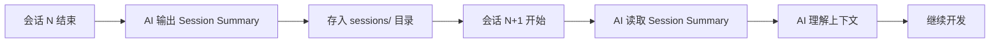
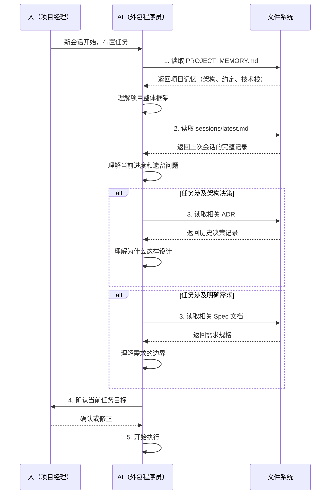
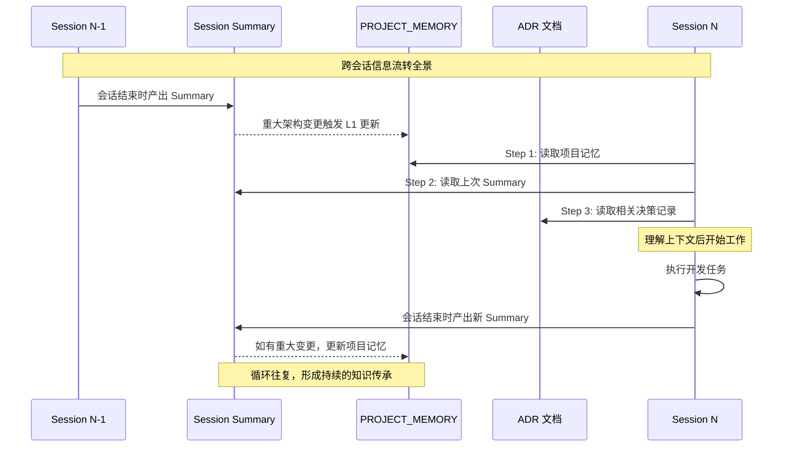
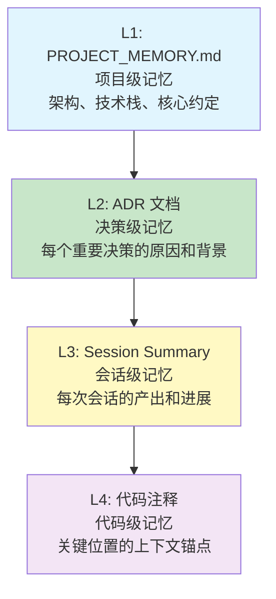

# 跨会话传承：让AI记住上次做了什么

> [!abstract] 核心隐喻
> 把 AI 当成**每天换一个外包程序员**。你周一跟张三聊了需求，周二换成李四接手。李四完全不知道张三做了什么，也不知道项目的约定是什么。你需要一套机制，让"李四"能在 5 分钟内理解"张三"留下的所有重要信息。

---

## 一、问题本质：为什么 AI 需要"记忆"

### 1.1 AI 的天然短板

AI 在每次会话开始时，对"上一次发生了什么"是**完全无知**的。它不像人类开发者那样有连续的记忆，每次新会话都相当于一个全新的外包程序员刚入职。

这不是 AI 的 bug，而是当前 AI 工具的架构限制。理解这一点，就不会对"AI 怎么又忘了"感到沮丧，而是建立一套系统来应对。

### 1.2 不做传承的后果

> [!warning] 无传承的典型症状
> - AI 在同一个问题上反复犯错，因为每次都是"第一次"
> - 架构方向逐渐偏离最初的约定，因为没人记得"为什么这么设计"
> - 人需要反复解释同样的背景，对话效率急剧下降
> - 项目越进行到后期，上下文断裂越严重，新人需要花更长时间才能理解项目

### 1.3 解决方案的核心思路



**核心思想**：把每次会话结束时的"脑力"固化为结构化文档，在新会话开始时"加载"这些文档，用**文件系统**代替 AI 的短期记忆。

---

## 二、Session Summary 方法论的完整设计

### 2.1 何时产出 Session Summary

> [!important] 触发时机
> Session Summary 应该在**每次会话即将结束时**产出，由使用者（你）向 AI 发出指令：
>
> 指令模板：
> ```
> 本次会话即将结束，请输出一份 Session Summary，包含：
> 1. 本次会话做了什么
> 2. 关键决策及原因
> 3. 遗留问题
> 4. 下一步建议
> 5. 修改的文件清单
> 6. 关键代码片段
> ```
>
> 保存到 `sessions/YYYY-MM-DD.md`。

### 2.2 Session Summary 标准模板

以下是每次会话结束时 AI 必须产出的结构化交付物：

```markdown
---
title: 会话记录 - YYYY-MM-DD
date: 2026-07-27
session_id: 007
tags:
  - session-summary
  - 开发阶段
---

# 会话记录 - 2026-07-27

## 一、本次会话做了什么

1. **[模块名]** 完成了 XXX 功能的 API 接口开发，包括 GET /api/v1/xxx 和 POST /api/v1/xxx
2. **[模块名]** 修复了 YYY 模块中因数据库字段类型不匹配导致的查询失败问题
3. **[基础设施]** 为项目引入了 Redis 缓存层，用于提高热点数据访问性能
4. **[测试]** 为 XXX 模块编写了 12 个单元测试，覆盖率达到 85%
5. **[文档]** 更新了 API 文档，补充了错误码说明

## 二、关键决策及原因

### 决策 1：选择 Redis 而非 Memcached 作为缓存层
- **原因**：Redis 支持更丰富的数据结构（Hash、Sorted Set），后续需要实现排行榜功能时可以直接复用
- **替代方案**：Memcached（更简单，但数据结构单一，无法满足后续需求）
- **影响**：增加了运维复杂度，但长期收益更大

### 决策 2：用户认证不采用 JWT，改用 Session + Cookie
- **原因**：项目有实时踢出用户的需求，JWT 无法主动失效
- **替代方案**：JWT + 黑名单（架构更复杂，不推荐）
- **影响**：需要引入 Redis 存储 Session，但安全性更高

## 三、遗留问题

- [ ] 邮件发送服务的 SMTP 配置尚未完成，需要运维提供 SMTP 服务器地址和端口
- [ ] 图片上传接口的大文件处理逻辑有待优化（当前超过 10MB 会超时）
- [ ] 数据库迁移脚本中 T_User 表缺少 `last_login_ip` 字段，需要补充
- [ ] 前端第 3 个页面的响应式布局在 Safari 上有兼容性问题，暂未修复

## 四、下一步建议

1. **优先**：完成 SMTP 配置，打通邮件发送链路（依赖运维提供 SMTP 信息）
2. **其次**：为图片上传接口引入分片上传机制，解决大文件超时问题
3. **可选**：为 Redis 缓存层补充监控和告警

## 五、修改的文件清单

| 操作 | 文件路径 | 说明 |
|------|----------|------|
| 新增 | `src/api/v1/xxx.py` | XXX 模块 API 接口 |
| 新增 | `src/services/cache.py` | Redis 缓存服务 |
| 修改 | `src/models/user.py` | 用户模型增加字段 |
| 修改 | `config/settings.py` | 新增 Redis 配置项 |
| 删除 | `src/utils/old_auth.py` | 废弃旧的认证工具 |

## 六、关键代码片段

### Redis 缓存装饰器（值得在新会话中参考）

```python
def cache_result(ttl: int = 300):
    """缓存函数结果的装饰器"""
    def decorator(func):
        @wraps(func)
        async def wrapper(*args, **kwargs):
            cache_key = f"{func.__name__}:{hash(str(args))}"
            result = await redis_client.get(cache_key)
            if result:
                return json.loads(result)
            data = await func(*args, **kwargs)
            await redis_client.setex(cache_key, ttl, json.dumps(data))
            return data
        return wrapper
    return decorator
```

### 用户认证中间件结构

```python
# 核心认证流程：Token 解析 → 用户查询 → 权限校验
# 入口：middleware/auth.py → AuthMiddleware.dispatch()
# 注意：需确保 Redis 中 Session 数据存在，否则返回 401
```
```

### 2.3 Session Summary 的存储结构

> [!info] 目录结构约定
> ```
> project-root/
> ├── PROJECT_MEMORY.md          # L1 项目记忆（架构级）
> ├── specs/                      # Spec 文档（需求级）
> ├── adrs/                       # 架构决策记录
> └── sessions/                   # Session Summary 存档
>     ├── 2026-07-20.md
>     ├── 2026-07-22.md
>     ├── 2026-07-25.md
>     └── latest.md               # 软链接或副本，始终指向最新一次会话
> ```

**`latest.md` 的作用**：新会话开始时，AI 只需要读取 `sessions/latest.md` 就能快速定位到上一次会话的上下文，不需要遍历整个目录。这是"外包程序员快速交接"的关键设计。

---

## 三、Context Bootstrap 标准流程

### 3.1 新会话启动的标准操作序列

每次开启新会话，必须按照以下标准流程执行，确保 AI 在正确的上下文中工作：



### 3.2 Bootstrap 的每个步骤详解

**Step 1：读取 PROJECT_MEMORY.md**

> [!tip] 为什么第一步必须是 PROJECT_MEMORY.md
> 这是项目的"宪法"。它定义了技术栈、目录结构、代码规范、命名约定等全局性约束。如果 AI 连项目的技术栈都不知道，后面的讨论都是空中楼阁。

PROJECT_MEMORY.md 应该包含：
- 项目愿景和核心目标
- 技术栈（语言、框架、数据库、中间件）
- 目录结构约定
- 代码规范（命名、格式、注释要求）
- 当前开发阶段和里程碑
- 关键约束（性能、安全、兼容性要求）

**Step 2：读取 sessions/latest.md**

这是"上次的外包程序员留给你的交接单"。通过阅读它，AI 能知道：
- 项目进行到哪一步了
- 上次干了什么
- 有什么坑需要注意
- 有什么遗留问题需要处理

**Step 3：选择性读取相关文档**

如果当前任务涉及架构层的决策，需要读取相关的 ADR（Architecture Decision Record），理解历史决策的背景。

如果当前任务有明确的需求规格，需要读取相关的 Spec 文档，确保 AI 充分理解需求边界。

**Step 4：确认任务目标**

> [!warning] 不要跳过这一步
> 即使人已经在新会话中说了"继续做 XXX"，AI 也应该用一句话确认理解：
> "我的理解是：本次任务是继续开发 XXX 模块的 YYY 接口，基于上次会话留下的代码，按 PROJECT_MEMORY.md 的技术栈约定进行。是否正确？"
>
> 这 30 秒的确认可以避免 30 分钟的返工。

**Step 5：开始执行**

确认无误后，AI 正式开始工作。

---

## 四、项目记忆文件（PROJECT_MEMORY.md）的维护

### 4.1 什么时候更新 PROJECT_MEMORY.md

> [!important] 更新触发条件（L1 级变更）
>
> | 变更类型 | 具体场景 | 谁来更新 |
> |----------|----------|----------|
> | 架构变更 | 新增模块、删除模块、模块间依赖关系变化 | **人**更新（AI 可以起草，但人必须确认） |
> | 技术选型变更 | 换数据库、换框架、新增中间件 | **人**更新 |
> | 关键约定变更 | 命名规范调整、目录结构重组、代码风格变更 | **人**更新 |
> | 里程碑更新 | 阶段完成、进入下一阶段 | **AI 可以更新**（人确认内容即可） |
> | 依赖版本更新 | 升级关键依赖的版本 | **AI 可以更新** |
> | 新发现的约束 | 性能瓶颈、安全漏洞、兼容性问题 | **AI 可以记录**，人确认 |

### 4.2 更新的粒度原则

> [!tip] 黄金法则
> PROJECT_MEMORY.md 应该是一份**新人能在 10 分钟内读完并理解项目全貌**的文档。
>
> - 写得太细 → 变成 README 的翻版，没人愿意读
> - 写得太粗 → 缺少关键信息，AI 产生误解
> - 正确粒度 → 每个模块 1-2 句话说明职责，每个约定 1-2 句话说明规则

### 4.3 PROJECT_MEMORY.md 示例结构

```markdown
# 项目记忆 - 校招测评题库系统

## 项目定位
面向 HR 的校招在线测评系统，支持题库管理、试卷生成、在线考试、自动评分。

## 技术栈
- 后端：Python 3.11 + FastAPI
- 数据库：PostgreSQL 15 + Redis 7
- 前端：React 18 + TypeScript + Ant Design 5
- 部署：Docker + Docker Compose

## 目录结构
- `src/api/` - API 路由层（只做参数校验和响应格式化）
- `src/services/` - 业务逻辑层（所有业务规则在此实现）
- `src/models/` - 数据模型（ORM 定义）
- `src/schemas/` - 请求/响应 Schema
- `tests/` - 测试代码

## 核心约定
- 所有 API 响应使用统一的 `{code, message, data}` 格式
- 数据库查询必须使用参数化查询，严禁字符串拼接
- 错误处理统一走 `src/exceptions/` 中定义的异常类
- 日志使用 `structlog`，不允许使用 `print`

## 当前阶段
- Phase 2：核心功能开发（题库 CRUD 已完成，试卷生成模块开发中）
- 下一个里程碑：完成试卷生成模块，进入联调测试

## 已知约束
- 并发用户数目标：1000
- 单次考试时长不超过 180 分钟
- 需要支持试题的图片上传
```

---

## 五、Session Summary 的常见陷阱

### 5.1 陷阱一：Summary 写得太长

> [!bug] 错误做法
> 把 Session Summary 写成了流水账，记录了每一次对话的细节，结果一个 Summary 长达 2000 行。新会话的 AI 花了 15 分钟才读完上下文，效率反而更低。

**正确做法**：Summary 控制在 100-200 行以内。每个模块用 1-2 句话概括，代码片段只保留关键部分。如果细节需要保留，引用对应的源文件位置即可。

### 5.2 陷阱二：Summary 写得太短

> [!bug] 错误做法
> "今天修了几个 bug，写了几个接口。"

**正确做法**：必须包含**关键决策**和**原因**。很多 bug 之所以反复出现，就是因为 AI 不知道"为什么上次这么改"。只说"做了什么"不说"为什么这么做"，等于没写。

### 5.3 陷阱三：忘记更新 Summary

> [!bug] 错误做法
> 会话结束时匆匆关闭，忘记让 AI 输出 Summary。下次会话开始时，AI 只能从代码中"猜测"上次做了什么，猜错的概率很高。

**正确做法**：把"输出 Session Summary"作为每次会话的**固定收尾动作**。建议在 PROJECT_MEMORY.md 中明确写出这个约定：
```markdown
## 会话约定
- 每次会话结束前，AI 必须输出 Session Summary 并保存到 sessions/YYYY-MM-DD.md
- 新会话开始前，AI 必须先读取 sessions/latest.md
```

### 5.4 陷阱四：Summary 没有"决策"只有"动作"

> [!bug] 错误做法
> "完成了用户模块的 CRUD 接口。"

**正确做法**：
> "完成了用户模块的 CRUD 接口。**关键决策**：用户密码使用 bcrypt 而非 MD5 加密，因为 bcrypt 自带 salt 且计算成本可调节，安全性更高。"

决策是 Summary 中最有价值的部分。动作可以从代码 diff 中看出来，但决策背后的思考只有 Summary 能承载。

### 5.5 陷阱五：代码片段没有上下文

> [!bug] 错误做法
> 贴了一大段代码，但没有说明这段代码的入口、依赖、调用链。

**正确做法**：代码片段附带简短的上下文说明（入口函数、关键依赖、调用链），让新会话的 AI 能快速理解这段代码在系统中的位置。

---

## 六、跨会话信息流转的完整视图



---

## 七、进阶技巧

### 7.1 渐进式上下文加载

不是每次会话都需要读所有文档。可以根据任务类型，按需加载：

- **修 bug**：只需要读 PROJECT_MEMORY.md + latest Session Summary
- **新功能开发**：需要读 PROJECT_MEMORY.md + latest Session Summary + 相关 Spec
- **架构变更**：需要读 PROJECT_MEMORY.md + 所有 ADR + latest Session Summary
- **重构**：需要读 PROJECT_MEMORY.md + latest Session Summary + 涉及的模块代码

### 7.2 上下文锚点

在代码中设置"上下文锚点"——在关键位置添加注释，指向 PROJECT_MEMORY.md 或 ADR 中的相关决策说明：

```python
# [CONTEXT] 认证方案选择 Session Cookie 而非 JWT
# 原因：需要支持主动踢出用户
# 详见：PROJECT_MEMORY.md → 核心约定 → 认证方案
# 详见：sessions/2026-07-20.md → 关键决策2
```

这样即使 AI 暂时没有读取 Summary，也能从代码注释中获取关键上下文。

### 7.3 约定自动检查

在 PROJECT_MEMORY.md 中定义可以被自动检查的约定（如代码格式、命名规范），然后在 CI 中配置 linter 自动检查。这样即使 AI 忘记了约定，CI 也会提醒。

### 7.4 多层级记忆体系



**L1（项目记忆）**：全局性、长期有效的信息。修改频率低，影响范围大。

**L2（决策记录）**：每个重要决策的完整分析。用于回答"为什么这么设计"。

**L3（会话记录）**：每次会话的产出。用于回答"上次做了什么"。

**L4（代码注释）**：代码中的上下文锚点。用于快速定位相关决策。

---

## 八、与其他知识库文档的关联

> [!seealso] 相关文档
> - [[01-AI技术/超长项目AI跑/08_人机协作节奏：谁做什么、何时介入]] — Session Summary 的产出和维护需要人的参与，了解人机协作的节奏有助于更好地管理 Summary
> - [[01-AI技术/超长项目AI跑/09_案例复盘：一个真实长项目的全流程]] — 在真实项目中，Session Summary 是如何一步步演化并发挥作用的
> - [[04_上下文管理策略]] — 更底层的上下文管理理论，与 Session Summary 形成互补
> - [[02-AI趋势与素养/人机协作阶段演进/00_MOC_人机协作阶段演进中枢]] — 在不同协作阶段，Session Summary 的粒度和内容会有所不同

---

## 九、总结

> [!summary] 核心要点
> 1. **把 AI 当成每天换一个外包程序员**，用文件系统代替 AI 的记忆
> 2. **Session Summary 是交接单**，必须包含"做了什么"和"为什么这么做"
> 3. **Context Bootstrap 是标准入职流程**，每次新会话必须按 5 步流程执行
> 4. **PROJECT_MEMORY.md 是宪法**，架构级变更必须由人确认后更新
> 5. **多层级记忆体系**：L1 项目记忆 → L2 决策记录 → L3 会话记录 → L4 代码注释

跨会话传承不是一次性的工作，而是一个需要持续维护的系统。它像代码一样，需要定期审查、持续优化。当项目进行到第 20 天时，回头看看第 1 天的 Session Summary，你会惊讶于这套系统带来的效率提升。