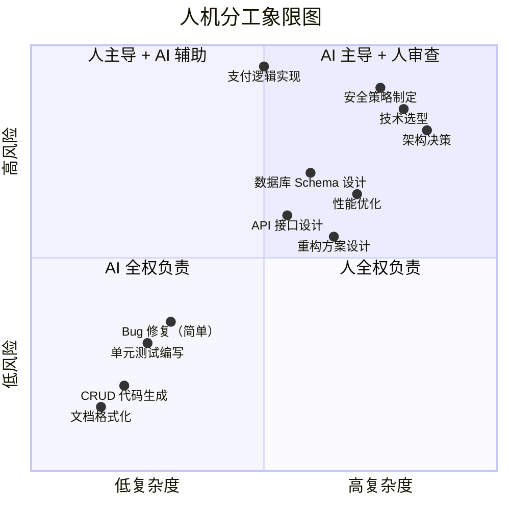
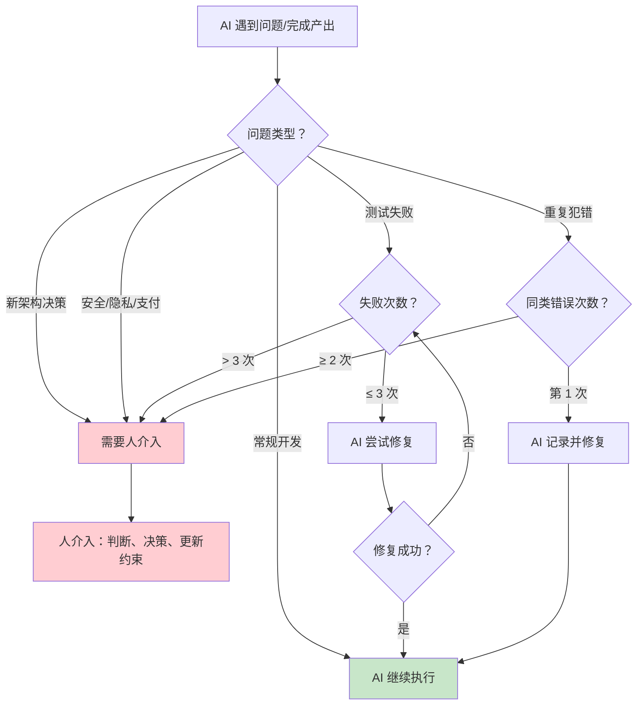
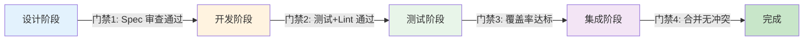
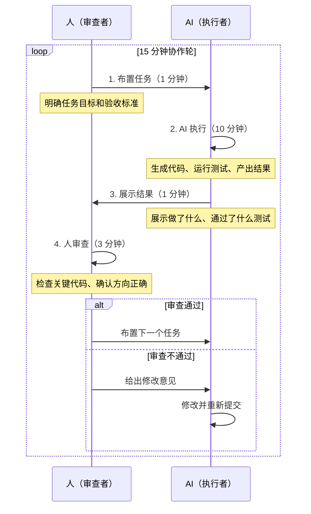
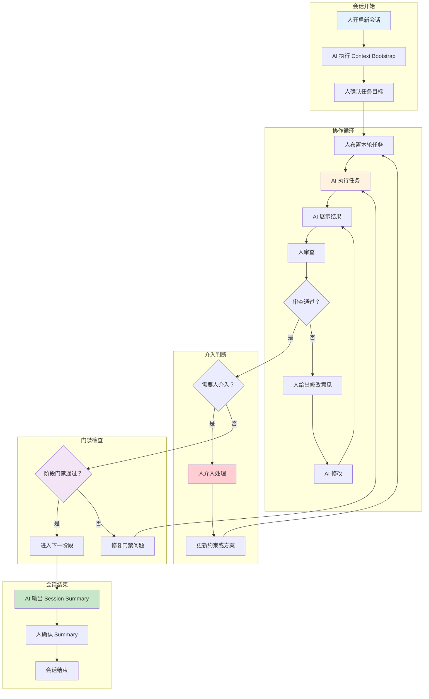

# 人机协作节奏：谁做什么、何时介入

> [!abstract] 核心隐喻
> 你是一个**项目经理 + 架构师**，AI 是一群**每天换的外包程序员**。你的工作不是写代码，而是：
> 1. 把需求讲清楚（Spec）
> 2. 在关键决策点拍板（架构）
> 3. 审查 AI 的输出质量（代码审查）
> 4. 在 AI 跑偏时及时纠正（介入）
>
> 如果你开始帮 AI 写代码，你就已经输了——你的时间应该花在 AI 做不到的事情上。

---

## 一、人机分工模型

### 1.1 分工的核心原则

> [!important] 分工铁律
> **人做决策，AI 做执行。**
>
> 人是"大脑"——负责判断方向、定义标准、做出取舍。
> AI 是"双手"——负责生成代码、编写测试、处理重复性工作。
>
> 如果人开始做 AI 能做的事（比如手动写 CRUD），就是浪费了最宝贵的资源——人的判断力。
> 如果 AI 开始做人的事（比如自行决定架构），就是越界了——AI 缺乏对业务全局的理解。

### 1.2 详细分工表

| 任务类型 | 负责人 | AI 角色 | 人的角色 | 备注 |
|----------|--------|---------|----------|------|
| Spec 定义 | **人** | 辅助整理格式 | 定义需求边界和验收标准 | AI 不理解业务，无法定义 Spec |
| 架构决策 | **人** | 提供方案对比 | 做出最终选择 | AI 可以列出 Pros/Cons，但选哪个要人拍板 |
| 技术选型 | **人** | 调研资料 | 综合考虑团队能力、维护成本 | AI 的调研可能偏向流行度而非适用性 |
| 代码生成 | **AI** | 主力执行 | 审查关键部分 | 常规 CRUD 可以放心交给 AI |
| 测试编写 | **AI** | 主力执行 | 审查测试覆盖的场景 | AI 写的测试需要检查是否覆盖了边界情况 |
| 文档生成 | **AI** | 主力执行 | 审查准确性和完整性 | 文档的事实准确性需要人把关 |
| Bug 修复 | **AI 优先** | 先尝试修复 | 超过3次失败后介入 | 见介入时机规则 |
| 代码审查 | **人** | 可以辅助 | 核心审查者 | AI 可以审查代码风格，但逻辑正确性要人确认 |
| 安全相关代码 | **人** | 辅助生成 | 必须逐行审查 | 涉及认证、授权、加密、支付等 |
| 性能优化 | **AI 辅助** | 提供优化建议 | 决定采用哪些优化 | 性能优化往往涉及取舍，需要人的判断 |

### 1.3 分工的边界案例

> [!question] 模糊地带如何处理？
> 
> **场景 1**：AI 发现一个性能瓶颈，建议引入 Redis 缓存。
> - **AI 应该做的**：描述瓶颈的表现、提供 Redis 的引入方案（包括代码改动范围）
> - **人应该做的**：判断是否真的需要 Redis（考虑运维成本、团队能力）、决定是否引入
> - **处理方式**：AI 写一份简短的 ADR 草稿，人确认后写入正式 ADR
>
> **场景 2**：AI 在写代码时发现现有接口设计不合理。
> - **AI 应该做的**：指出问题、提出改进方案、询问是否现在重构
> - **人应该做的**：判断重构的时机（现在还是以后）、决定是否接受改进方案
> - **处理方式**：AI 在 Session Summary 中记录此发现，人决定是否创建新任务

---

## 二、介入时机判断

### 2.1 介入时机决策树

### 2.2 四类必须介入的场景

#### 场景一：遇到新架构决策

> [!warning] 触发条件
> 以下任何情况发生，人**必须介入**：
> - 新增模块（如新增一个微服务、新增一个独立的业务模块）
> - 新增外部依赖（如引入新的第三方库、中间件）
> - 技术选型变更（如从 REST 改为 GraphQL、从 MySQL 改为 PostgreSQL）
> - 接口契约变更（如修改对外 API 的签名、修改数据库 Schema）
> - 目录结构重组（如移动大量文件、重新划分模块边界）

**为什么必须介入**：这些决策影响范围大、回滚成本高。AI 不了解团队的长期规划、运维能力、人员技能分布，无法做出最优选择。

**介入方式**：AI 写一份简短的 ADR 草稿（包含问题描述、方案对比、推荐方案），人在 5 分钟内审阅并做出决定。

#### 场景二：AI 连续修复失败

> [!warning] 触发条件
> AI 尝试修复同一个测试失败或 bug **超过 3 次**仍未成功。

**为什么必须介入**：超过 3 次失败通常意味着 AI 对问题的理解有偏差，或者问题本身需要更深入的领域知识。继续让 AI 尝试只会浪费时间。

**介入方式**：
1. 人阅读 AI 的 3 次尝试记录，诊断根因
2. 如果根因是 AI 理解错误 → 人给出更精确的指令
3. 如果根因是设计缺陷 → 人决定是否需要小范围重构
4. 如果根因是外部依赖问题 → 人决定解决方案

#### 场景三：AI 重复犯错

> [!warning] 触发条件
> 同一类问题（同样的错误模式、同样的代码风格问题、同样的逻辑缺陷）出现 **2 次或以上**。

**为什么必须介入**：AI 重复犯错说明 PROJECT_MEMORY.md 或 Session Summary 中的约束不够明确，或者 AI 没有正确读取约束。需要人更新约束或调整工作流程。

**介入方式**：
1. 识别重复错误的模式
2. 在 PROJECT_MEMORY.md 中添加明确的约束规则
3. 如果适用，配置 linter 或自动化检查来拦截此类错误
4. 在 Session Summary 中标注此类错误为"已知陷阱"

#### 场景四：涉及安全/隐私/支付

> [!danger] 触发条件
> 任何涉及以下领域的代码，人**必须逐行审查**：
> - 用户认证和授权逻辑
> - 密码存储和加密
> - 敏感数据的传输和存储
> - 支付流程
> - 权限校验
> - SQL 查询（防止注入）
> - 文件上传逻辑
> - 第三方 API 调用中的凭证处理

**为什么必须介入**：这些领域的错误可能导致严重的安全事故或资金损失。AI 可能生成"看起来正确"但实际有安全漏洞的代码。

**介入方式**：人必须阅读每一行涉及上述领域的代码，确保安全最佳实践被遵守。AI 可以生成代码，但最终的责任在人。

---

## 三、阶段门禁设计

### 3.1 门禁机制概览

> [!important] 门禁设计原则
> 每个阶段结束时，必须通过门禁检查才能进入下一阶段。门禁是**不可跳过的质量关卡**，就像工厂流水线上的质检站。

### 3.2 各阶段门禁详解

#### 门禁 1：设计阶段 → 开发阶段

> [!check] 通过标准
> - [ ] Spec 文档已由人审阅并签字确认
> - [ ] Spec 中所有模糊点已澄清（没有"待定"、"后续再定"）
> - [ ] 关键接口的数据结构已定义（请求/响应 Schema）
> - [ ] 需要 ADR 的决策已记录（如有新架构决策）
> - [ ] 依赖关系已明确（本功能依赖哪些已有模块）
>
> **审查人**：人（项目经理 / 架构师角色）
>
> **审查时间**：5-15 分钟

#### 门禁 2：开发阶段 → 测试阶段

> [!check] 通过标准
> - [ ] 所有单元测试通过（`pytest` 或等价命令返回 0）
> - [ ] Linter 检查通过（无 Error 级别问题，Warning 不超过 5 个）
> - [ ] 代码已通过人的快速审查（重点看安全相关代码和关键逻辑）
> - [ ] 新增的 API 接口已添加基本的集成测试
> - [ ] 代码中没有 TODO 标记（除非已记录在遗留问题中）
>
> **审查人**：AI 自动检查（测试 + lint） + 人手动审查（关键代码）
>
> **审查时间**：AI 自动（1-2 分钟） + 人审查（5-10 分钟）

#### 门禁 3：测试阶段 → 集成阶段

> [!check] 通过标准
> - [ ] 代码覆盖率 ≥ 80%（核心模块 ≥ 90%）
> - [ ] 无回归测试失败（新增功能不能破坏已有功能）
> - [ ] 性能测试通过（如适用，响应时间不超过目标的 1.5 倍）
> - [ ] 边界情况测试覆盖（空值、极大值、并发、超时）
> - [ ] 测试报告已生成并归档
>
> **审查人**：AI 自动检查 + 人审阅测试报告
>
> **审查时间**：AI 自动（3-5 分钟） + 人审阅（5 分钟）

#### 门禁 4：集成阶段 → 完成

> [!check] 通过标准
> - [ ] 与主分支的合并无冲突（或冲突已解决）
> - [ ] 集成测试通过
> - [ ] 文档已更新（API 文档、部署文档、变更日志）
> - [ ] Session Summary 已产出
> - [ ] 如有架构变更，PROJECT_MEMORY.md 已更新
>
> **审查人**：AI 自动检查 + 人最终确认
>
> **审查时间**：AI 自动（2-3 分钟） + 人确认（5 分钟）

### 3.3 门禁失败的处置

> [!warning] 门禁失败的处置流程
> 1. **识别失败原因**：哪个门禁条件未满足？
> 2. **判断严重程度**：是阻塞性问题（无法继续）还是警告性问题（可以继续但需记录）？
> 3. **制定修复计划**：谁修复？需要多长时间？是否需要回退到上一阶段？
> 4. **修复后重新检查**：修复完成后重新运行门禁检查
> 5. **记录失败原因**：在 Session Summary 中记录门禁失败的原因和修复措施

---

## 四、协作反模式

### 4.1 反模式一：过度微管理

> [!bug] 症状
> 人对 AI 的每一行代码都要审查、每一个变量名都要修改、每一个函数结构都要调整。AI 变成了一个"代码打字机"，人的时间全部花在了低价值的审查工作上。

**为什么会这样**：
- 人对 AI 的代码质量不信任
- 人有自己的代码风格偏好，不愿意接受 AI 的风格
- 需求本身不够清晰，AI 生成的代码偏离预期，人不得不逐行修正

**怎么解决**：
1. **把编码规范明确写入 PROJECT_MEMORY.md**，让 AI 在生成代码时遵守
2. **配置 linter 和 formatter**，用自动化工具替代人工检查
3. **只审查关键代码**：安全相关、核心业务逻辑、复杂算法——其余的信任 AI 和自动化检查
4. **接受"足够好"的代码**：AI 生成的代码可能不是最优美的，但只要功能正确、测试通过、符合规范，就接受它

### 4.2 反模式二：过度放任

> [!bug] 症状
> 人给 AI 一个模糊的需求，然后就放手不管了。3 天后回来看，AI 写了 5000 行代码，但方向完全错了，需要全部重写。

**为什么会这样**：
- 人过于信任 AI 的理解能力，以为 AI 能"猜"到自己的真实意图
- 需求本身没有明确的验收标准，AI 在模糊空间中自由发挥
- 人没有设置中间检查点，AI 在错误的方向上越走越远

**怎么解决**：
1. **每个任务必须有明确的验收标准**（输入是什么、输出是什么、什么情况下算完成）
2. **设置检查点**：每完成一个子任务，人就审查一次，确保方向正确
3. **遵循 15 分钟协作轮**（见第五节），不要让 AI 连续工作超过 15 分钟无人审查
4. **使用 Spec 文档**：把需求写成结构化的 Spec，而不是口头描述

### 4.3 反模式三：假性信任

> [!bug] 症状
> 人嘴上说"我相信 AI 能做好"，但实际行为暴露了不信任——反复修改 AI 的输出、纠结于细节、在 AI 的方案和自己的方案之间反复横跳。

**为什么会这样**：
- 人的技术能力很强，习惯了自己动手
- 人对 AI 的产出有"审美洁癖"，看 AI 写的代码总想改
- 人没有真正接受"AI 是执行者，人是决策者"的角色定位

**怎么解决**：
1. **明确自己的角色**：你是项目经理 + 架构师，不是代码审查员
2. **建立信任阈值**：预先定义"什么情况下可以信任 AI 的输出"（如测试通过 + lint 通过 + 关键逻辑审查通过 = 信任）
3. **如果实在不信任，调整分工**：把 AI 不擅长的部分收回来自己做，AI 擅长的部分（如测试生成、文档生成）完全交给 AI
4. **衡量成本**：为修改 AI 的代码所花的时间，是不是比直接自己写还多？如果是，这个任务不适合交给 AI

### 4.4 反模式四：模糊的验收标准

> [!bug] 症状
> "帮我做一个用户管理模块"——然后人就走了。AI 生成了代码，但人觉得"这不是我想要的"。AI 修改，人还是不满意。循环往复，双方都很沮丧。

**为什么这是错的**：
- "用户管理模块"太模糊了。包含哪些功能？支持什么操作？权限怎么设计？UI 长什么样？
- 没有验收标准，AI 只能猜测，猜错是大概率事件

**正确做法**：
> "帮我做一个用户管理模块，需求如下：
> 1. 功能：用户列表（分页、搜索、排序）、用户详情、新增用户、编辑用户、删除用户（软删除）
> 2. 权限：只有 admin 角色可以访问
> 3. 接口：RESTful API，使用项目统一的 `{code, message, data}` 响应格式
> 4. 验收标准：所有接口的单元测试覆盖率 ≥ 85%，前端页面能正常展示
> 5. 详见 specs/user-management.md"

---

## 五、协作节奏建议

### 5.1 15 分钟协作轮

> [!tip] 核心节奏
> 最有效的协作节奏是 **15 分钟一轮**，每轮包含四个阶段：

### 5.2 为什么是 15 分钟

- **10 分钟足够 AI 完成一个有意义的工作单元**（一个接口、一个组件、一个测试文件）
- **3 分钟足够人审查一次产出**（不需要深入每一行代码，只需要确认方向和关键逻辑）
- **15 分钟足够短**，不会让 AI 在错误的方向上走太远
- **15 分钟足够长**，不会因为频繁切换导致效率降低

### 5.3 不同任务类型的节奏调整

| 任务类型 | 协作轮长度 | 审查频率 | 说明 |
|----------|------------|----------|------|
| 简单 CRUD | 15 分钟 | 每轮审查 | 标准节奏 |
| 复杂业务逻辑 | 10 分钟 | 每轮审查 | 出错概率高，需要更频繁确认 |
| 测试编写 | 20 分钟 | 每 2 轮审查 | 测试相对独立，可以批量审查 |
| 文档生成 | 30 分钟 | 生成完成后审查 | 文档不需要中间确认 |
| 重构 | 10 分钟 | 每轮审查 | 重构风险高，需要频繁确认方向 |
| Bug 修复 | 5 分钟 | 每次尝试后审查 | 修复失败超过 3 次要介入 |

### 5.4 一日协作节奏模板

```mermaid
gantt
    title 一日协作节奏
    dateFormat HH:mm
    axisFormat %H:%M
    
    section 上午
    启动 Context Bootstrap    :a1, 09:00, 10m
    协作轮 1: 任务 A          :a2, after a1, 15m
    协作轮 2: 任务 A 续       :a3, after a2, 15m
    协作轮 3: 任务 A 完成     :a4, after a3, 15m
    休息                      :a5, after a4, 10m
    
    section 下午
    协作轮 4: 任务 B          :b1, 14:00, 15m
    协作轮 5: 任务 B 续       :b2, after b1, 15m
    协作轮 6: 任务 B 完成     :b3, after b2, 15m
    门禁检查                  :b4, after b3, 15m
    输出 Session Summary      :b5, after b4, 10m
```

---

## 六、协作流程全景图

---

## 七、度量与改进

### 7.1 协作效率度量指标

> [!info] 关键指标
> | 指标 | 定义 | 健康值 | 警戒值 |
> |------|------|--------|--------|
> | 介入频率 | 人介入次数 / 总协作轮数 | < 20% | > 40% |
> | 门禁一次通过率 | 一次通过门禁的比例 | > 80% | < 50% |
> | 返工率 | 需要修改的协作轮 / 总协作轮数 | < 30% | > 50% |
> | 平均协作轮时长 | 每轮从布置到审查通过的时间 | 15-20 分钟 | > 30 分钟 |
> | AI 自主修复率 | AI 自行修复的 bug 数 / 总 bug 数 | > 70% | < 50% |

### 7.2 持续改进

- **每周回顾**：回顾本周的协作数据，找出效率瓶颈
- **调整分工**：如果发现某个类型的任务 AI 总是做不好，考虑调整分工
- **更新约束**：如果 AI 反复在同一个问题上出错，在 PROJECT_MEMORY.md 中增加约束
- **优化 Bootstrap**：如果 AI 每次都需要花很长时间理解上下文，优化 Session Summary 的格式

---

## 八、与其他知识库文档的关联

> [!seealso] 相关文档
> - [[01-AI技术/超长项目AI跑/07_跨会话传承：让AI记住上次做了什么]] — 人机协作中，Session Summary 是关键的信息传递机制
> - [[01-AI技术/超长项目AI跑/09_案例复盘：一个真实长项目的全流程]] — 在真实项目中，人机协作模式是如何演化的
> - [[02-AI趋势与素养/人机协作阶段演进/00_MOC_人机协作阶段演进中枢]] — 项目不同阶段的人机协作模式差异
> - [[01-AI技术/超长项目AI跑/03_架构锚点：用Spec锁定AI不乱跑]] — Spec 是人机协作的"合同"，定义了双方的期望
> - [[04_上下文管理策略]] — 上下文管理直接影响协作效率

---

## 九、总结

> [!summary] 核心要点
> 1. **人做决策，AI 做执行**——这是人机协作不可动摇的底线
> 2. **四类必须介入的场景**：新架构决策、连续修复失败（>3次）、重复犯错（>=2次）、安全/隐私/支付
> 3. **阶段门禁不可跳过**：设计→开发→测试→集成，每个阶段都有明确的通过标准
> 4. **15 分钟协作轮**是最有效的节奏：布置→执行→展示→审查，循环往复
> 5. **避免三个反模式**：过度微管理、过度放任、假性信任
> 6. **度量驱动改进**：用数据说话，持续优化协作效率

人机协作的本质不是"人代替 AI"或"AI 代替人"，而是**人机互补**。人擅长判断、决策、权衡，AI 擅长执行、生成、重复。找到各自的边界，在边界处建立清晰的协作协议，这就是长项目成功的关键。