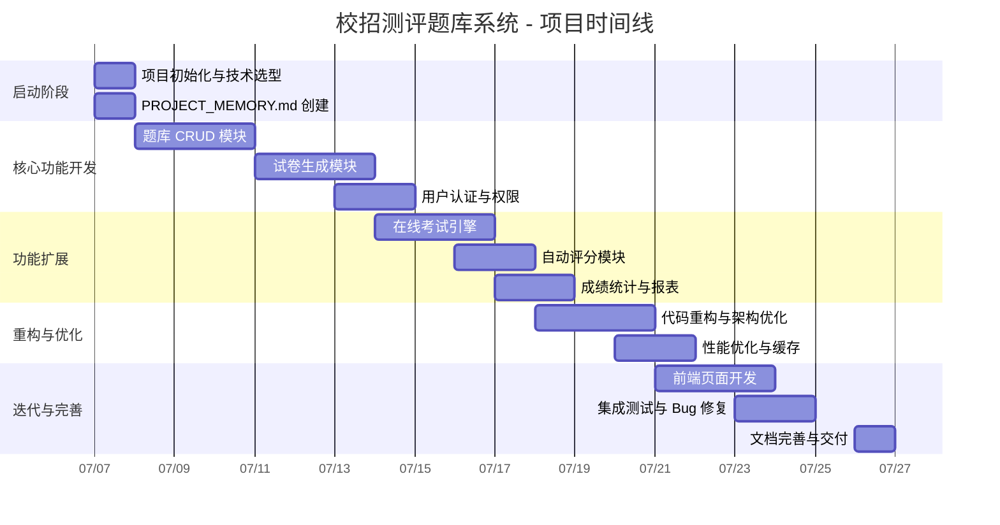
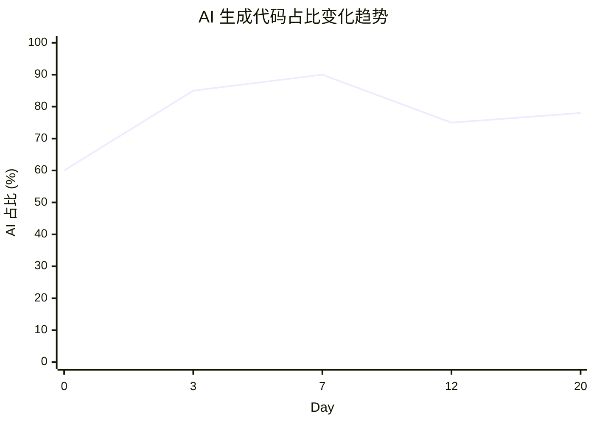
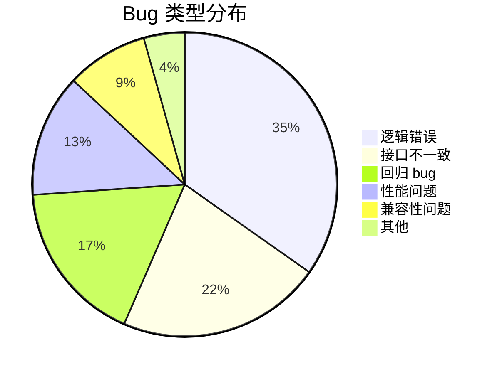
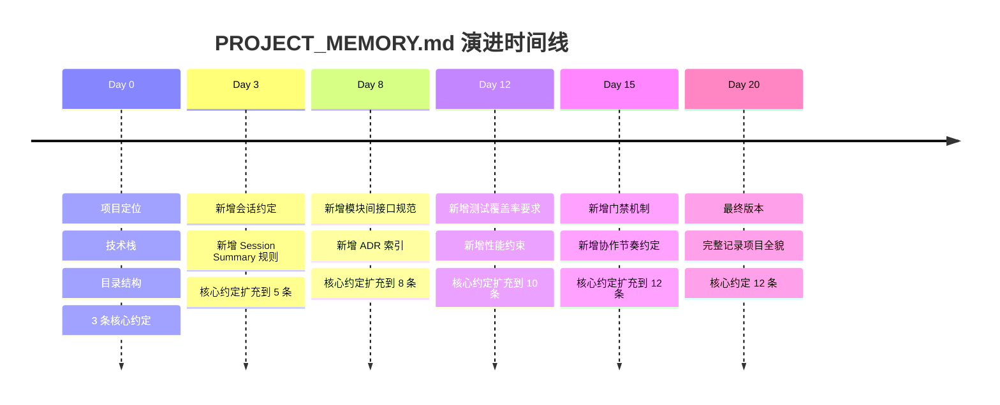

# 案例复盘：一个真实长项目的全流程

> [!abstract] 项目背景
> **项目名称**：校招测评题库系统
> **项目周期**：20 天（约 15 个有效工作日，跨 3 个自然周）
> **项目规模**：最终代码量约 18,000 行（含测试），AI 生成占比约 78%
> **项目目标**：为 HR 团队构建一个在线测评系统，支持题库管理、智能组卷、在线考试、自动评分
> **技术栈**：Python 3.11 + FastAPI + PostgreSQL + Redis + React 18 + TypeScript
>
> 这是一个真实的 AI 辅助开发项目。本文记录了从 Day 0 到 Day 20 的完整历程，包括每个阶段做了什么、遇到了什么问题、怎么解决的、以及最终的数据和教训。

---

## 一、项目时间线总览



---

## 二、Day 0：项目启动

### 2.1 做了什么

> [!info] Day 0 任务清单
> - [x] 确定技术栈：Python FastAPI + PostgreSQL + React
> - [x] 初始化项目骨架（目录结构、依赖管理、Docker 配置）
> - [x] 创建 PROJECT_MEMORY.md
> - [x] 创建第一个 Spec 文档（题库管理模块）
> - [x] 配置 CI/CD（GitHub Actions）

### 2.2 用了什么 Prompt

```
我需要你帮我初始化一个项目：校招测评题库系统。

技术栈：
- 后端：Python 3.11 + FastAPI
- 数据库：PostgreSQL 15
- 前端：React 18 + TypeScript
- 部署：Docker Compose

请帮我：
1. 创建项目目录结构
2. 配置 Docker Compose（含 PostgreSQL 和 Redis）
3. 创建 FastAPI 项目骨架（含统一的响应格式和错误处理）
4. 创建 React 项目骨架（使用 Vite 初始化）
5. 创建 PROJECT_MEMORY.md，记录项目目标、技术栈、目录结构、核心约定
```

### 2.3 花了多少时间

- **AI 执行时间**：约 15 分钟（生成项目骨架、配置、文档）
- **人审查时间**：约 20 分钟（审查目录结构、确认技术选型、修改 PROJECT_MEMORY.md）
- **总计**：约 35 分钟

### 2.4 Day 0 产出的 PROJECT_MEMORY.md

```markdown
# 项目记忆 - 校招测评题库系统

## 项目定位
面向 HR 的校招在线测评系统，支持题库管理、试卷生成、在线考试、自动评分。

## 技术栈
- 后端：Python 3.11 + FastAPI
- 数据库：PostgreSQL 15 + Redis 7
- 前端：React 18 + TypeScript + Ant Design 5
- 部署：Docker + Docker Compose

## 目录结构
- `backend/` - 后端代码
  - `src/api/` - API 路由层
  - `src/services/` - 业务逻辑层
  - `src/models/` - 数据模型
  - `src/schemas/` - 请求/响应 Schema
  - `tests/` - 测试代码
- `frontend/` - 前端代码
  - `src/pages/` - 页面组件
  - `src/components/` - 通用组件
  - `src/services/` - API 调用层

## 核心约定
- 所有 API 响应使用统一的 `{code, message, data}` 格式
- 数据库查询必须使用参数化查询，严禁字符串拼接
- 错误处理统一走 `src/exceptions/` 中定义的异常类
- 日志使用 `structlog`，不允许使用 `print`
- 前端状态管理使用 React Context，不引入 Redux

## 当前阶段
- Phase 0：项目初始化（已完成）
- 下一个里程碑：Phase 1 - 题库管理模块

## 会话约定
- 每次会话结束前，AI 必须输出 Session Summary 并保存到 sessions/YYYY-MM-DD.md
- 新会话开始前，AI 必须先读取 sessions/latest.md
```

---

## 三、Day 1-3：核心功能开发

### 3.1 做了什么

- Day 1：题库 CRUD 模块（试题的增删改查、分类管理、标签体系）
- Day 2：题库导入导出（Excel 批量导入、JSON 导出）
- Day 3：试卷生成模块（手动组卷 + 自动组卷算法）

### 3.2 遇到的问题：上下文断裂

> [!bug] 问题描述
> Day 2 的会话开始时，AI 完全不知道 Day 1 做了什么。
> - AI 提出的数据库 Schema 与 Day 1 已实现的 Schema 冲突
> - AI 建议的 API 接口命名与 Day 1 不一致
> - 人花了 10 分钟重新解释项目背景，效率极低

**当时的表现**：
```
人：继续开发题库导入导出功能。
AI：好的，我先设计数据库 Schema。我建议使用 T_Question 表...
人：T_Question 表昨天已经建好了，在 models/question.py 里。
AI：抱歉，让我重新读取代码...好的，我看到了。我建议新增一个 API 路由 /api/import-questions...
人：昨天定的 API 规范是 /api/v1/questions/import，看看 PROJECT_MEMORY.md。
AI：抱歉，我没有自动读取 PROJECT_MEMORY.md。让我现在读取...
```

### 3.3 怎么解决的：引入 Session Summary

> [!success] 解决方案
> 在 Day 2 的会话结束后，我们引入了 Session Summary 机制。
>
> Day 3 的会话开始时，AI 先读取了 `sessions/2026-07-08.md`，在 2 分钟内理解了上下文，直接开始工作，没有出现任何上下文断裂的问题。

### 3.4 Day 2 的 Session Summary 示例

```markdown
---
title: 会话记录 - 2026-07-08
date: 2026-07-08
session_id: 002
tags:
  - session-summary
  - 核心功能开发
---

# 会话记录 - 2026-07-08

## 一、本次会话做了什么

1. **[题库模块]** 完成了试题的增删改查 API，支持按分类、标签、难度筛选
2. **[题库模块]** 实现了 Excel 批量导入（支持 .xlsx 格式，最大 500 题/次）
3. **[题库模块]** 实现了 JSON 格式的单题和批量导出
4. **[基础设施]** 引入了 openpyxl 库用于 Excel 解析

## 二、关键决策及原因

### 决策 1：试题选项使用 JSON 字段存储而非独立的选项表
- **原因**：试题类型多样（单选、多选、判断、填空），每种类型的选项结构不同。用 JSON 字段更灵活，不需要为每种题型建不同的表
- **替代方案**：独立的选项表（结构更规范，但查询更复杂，且不适合灵活题型）
- **影响**：JSON 字段不支持复杂查询，但本题库不需要按选项内容查询，所以影响不大

## 三、遗留问题

- [ ] 导入功能对大文件（>500 题）的性能需要优化，当前导入 500 题需要约 30 秒
- [ ] 试题的图片上传功能尚未实现，当前试题内容中的图片使用外部 URL
- [ ] 前端页面尚未开始开发

## 四、下一步建议

1. **优先**：开发试卷生成模块（手动组卷 + 自动组卷）
2. **其次**：优化导入性能（考虑使用异步任务 + 批量插入）
3. **可选**：开始前端页面开发

## 五、修改的文件清单

| 操作 | 文件路径 | 说明 |
|------|----------|------|
| 新增 | `backend/src/api/v1/questions.py` | 试题 CRUD API |
| 新增 | `backend/src/services/question_service.py` | 试题业务逻辑 |
| 新增 | `backend/src/services/import_service.py` | Excel 导入服务 |
| 修改 | `backend/src/models/question.py` | 试题数据模型 |
| 修改 | `backend/requirements.txt` | 新增 openpyxl 依赖 |
```

---

## 四、Day 4-7：功能扩展

### 4.1 做了什么

- Day 4-5：在线考试引擎（考试创建、考生分配、计时器、防作弊机制）
- Day 6：自动评分模块（客观题自动评分、主观题评分框架）
- Day 7：成绩统计与报表（成绩分布、通过率、试题难度分析）

### 4.2 遇到的问题：架构漂移

> [!bug] 问题描述
> 随着功能不断扩展，模块间的接口逐渐不一致。
> - 题库模块的 API 返回 `{code, data, message}`，但新开发的考试模块返回 `{status, result, msg}`
> - 试题模型使用 `difficulty` 字段（值：1-5），考试引擎使用 `level` 字段（值：easy/medium/hard）
> - 模块间调用方式不一致：有的走 Service 层，有的直接操作 Model

**为什么会这样**：
- 每个新模块由不同的 AI 会话开发，每次会话的 AI 都是"新人"
- 虽然 PROJECT_MEMORY.md 定义了核心约定，但约定不够细化
- 缺少模块间的接口契约文档

### 4.3 怎么解决的：引入 ADR 和 Spec 锚点

> [!success] 解决方案
> 1. **引入 ADR（Architecture Decision Record）**：每个重要的架构决策都记录为 ADR，包括接口规范、数据格式、模块间通信方式
> 2. **创建 Spec 文档**：每个新模块开发前，先写 Spec 文档，明确输入输出、接口契约、数据格式
> 3. **更新 PROJECT_MEMORY.md**：将"模块间接口规范"从一条约定扩展为详细的规范文档

### 4.4 关键 ADR 示例

```markdown
# ADR-003: 模块间通信统一使用 Service 层

## 状态
已采纳

## 背景
当前项目中，部分模块直接调用 ORM Model，部分模块通过 Service 层调用。这导致：
- 模块间耦合度不一致
- 测试困难（直接操作 Model 的代码难以 mock）
- 业务逻辑分散在 API 层和 Service 层

## 决策
所有模块间通信必须通过 Service 层。API 层只负责：
1. 参数校验
2. 调用 Service 层
3. 格式化响应

## 影响
- 优点：模块间解耦、易于测试、业务逻辑集中
- 缺点：增加了一层间接调用，简单场景下略显冗余
- 需要重构现有代码中直接操作 Model 的部分

## 替代方案
- 保持现状（接受了模块间耦合，但会导致长期维护困难）
- 使用 Repository 模式（比 Service 层更重，当前项目不需要）

## 实施日期
2026-07-10
```

---

## 五、Day 8-12：重构与优化

### 5.1 做了什么

- Day 8-9：代码重构（统一模块间接口、消除重复代码、整理目录结构）
- Day 10：性能优化（引入 Redis 缓存、优化数据库查询、添加索引）
- Day 11-12：测试补充（为已开发模块补充单元测试和集成测试）

### 5.2 遇到的问题：质量退化

> [!bug] 问题描述
> 随着代码量增长，质量问题开始显现：
> - 题库模块的代码在重构后，导入功能出现了回归 bug（Excel 解析失败）
> - 考试引擎在高并发场景下出现数据不一致（多个考生同时提交时的并发问题）
> - 前端页面在 Safari 上有兼容性问题（Ant Design 5 的已知问题）
> - 测试覆盖率从 Day 3 的 85% 下降到 Day 8 的 52%（新功能开发速度 > 测试编写速度）

**为什么会这样**：
- 重构时只改了逻辑，没有重新运行全部测试（当时测试套件还不完整）
- 新功能开发节奏快，测试编写滞后
- 缺少 CI 中的强制覆盖率检查

### 5.3 怎么解决的：引入测试驱动

> [!success] 解决方案
> 1. **修复回归 bug**：为 Excel 导入功能补充了完整的测试用例（正常导入、空文件、格式错误、超大文件），然后修复了回归 bug
> 2. **并发问题**：引入数据库事务 + 乐观锁，确保考试提交的原子性
> 3. **提升测试覆盖率**：将"新代码测试覆盖率 ≥ 80%"写入 PROJECT_MEMORY.md 的核心约定
> 4. **CI 强制检查**：在 CI 中添加 pytest 覆盖率检查，低于 80% 不允许合并

### 5.4 重构后的 Session Summary 示例

```markdown
---
title: 会话记录 - 2026-07-17
date: 2026-07-17
session_id: 008
tags:
  - session-summary
  - 重构与优化
---

# 会话记录 - 2026-07-17

## 一、本次会话做了什么

1. **[重构]** 统一了所有模块的 API 响应格式（`{code, message, data}`），修复了考试模块的格式不一致问题
2. **[重构]** 将 4 处直接操作 Model 的代码改为通过 Service 层调用（按 ADR-003 要求）
3. **[优化]** 为 T_Question 表添加了 `(category_id, difficulty)` 联合索引，查询性能提升 60%
4. **[测试]** 为题库导入模块补充了 8 个测试用例，覆盖正常流程和异常场景
5. **[Bug 修复]** 修复了 Excel 导入功能在重构后的回归 bug（列名映射问题）

## 二、关键决策及原因

### 决策 1：考试提交使用数据库事务 + 乐观锁
- **原因**：多个考生同时提交考试时，需要确保分数计算的原子性。乐观锁比悲观锁更适合这种场景（冲突概率低）
- **替代方案**：悲观锁（会阻塞其他考生，不适合高并发）；消息队列（过度设计，当前并发量不需要）
- **影响**：需要在 T_Exam 表增加 `version` 字段，修改提交逻辑

## 三、遗留问题

- [ ] 前端 Safari 兼容性问题尚未修复（Ant Design 5 已知问题，等待官方修复）
- [ ] 缓存策略需要进一步优化（当前使用简单的 TTL，缺少缓存预热和失效策略）
- [ ] 数据库慢查询需要持续监控

## 四、下一步建议

1. **优先**：继续补充测试用例，目标覆盖率 80%
2. **其次**：优化缓存策略（引入缓存预热和优雅降级）
3. **可选**：开始前端页面开发

## 五、修改的文件清单

| 操作 | 文件路径 | 说明 |
|------|----------|------|
| 修改 | `backend/src/api/v1/exam.py` | 统一响应格式 |
| 修改 | `backend/src/services/exam_service.py` | 改为 Service 层调用 |
| 修改 | `backend/src/models/exam.py` | 增加 version 字段 |
| 新增 | `backend/tests/test_import.py` | 导入功能测试 |
| 修改 | `backend/alembic/versions/008_add_index.py` | 新增索引迁移 |
```

---

## 六、Day 13-20：迭代与完善

### 6.1 做了什么

- Day 13-15：前端页面开发（题库管理页面、考试页面、成绩报表页面）
- Day 16-17：集成测试与端到端测试
- Day 18-19：Bug 修复与性能调优
- Day 20：文档完善与最终交付

### 6.2 遇到的问题：人机协作失衡

> [!bug] 问题描述
> 项目进入后期，出现了严重的人机协作失衡：
> - **人对 AI 的信任度下降**：经历了多次 bug 和回归问题后，人开始不信任 AI 的输出，倾向于手动修改 AI 生成的代码
> - **AI 的产出质量不稳定**：有时 AI 生成的代码质量很高，有时却需要大幅修改，人无法预测 AI 的表现
> - **决策疲劳**：人每天需要审查大量 AI 产出，到后期已经疲惫不堪，审查质量下降
> - **不知道该信任谁**：AI 说"这个方案最优"，但人凭直觉觉得不对，又无法快速判断谁对谁错

**当时的表现**：
```
人（内心独白）：AI 又建议用 Redis 做消息队列了，上次它也是这么建议的，
然后我花了一下午才搞清楚为什么不行。这次我该信它吗？
还是我自己手动写吧，至少我能控制...
```

### 6.3 怎么解决的：引入门禁机制

> [!success] 解决方案
> 在 Day 15 时，我们引入了正式的阶段门禁机制（详见 [[01-AI技术/超长项目AI跑/08_人机协作节奏：谁做什么、何时介入]]）：
>
> 1. **设计门禁**：Spec 审查通过才能开发
> 2. **开发门禁**：测试 + lint 通过才能进入测试阶段
> 3. **测试门禁**：覆盖率达标才能集成
> 4. **集城门禁**：集成测试通过才能交付
>
> 门禁机制的引入解决了"不知道该信任谁"的问题——不再依赖人的主观判断，而是用客观标准（测试通过、覆盖率达标、lint 通过）来决定是否接受 AI 的产出。

### 6.4 引入门禁后的效果

| 指标 | 引入门禁前（Day 1-14） | 引入门禁后（Day 15-20） |
|------|------------------------|------------------------|
| 代码审查时间 | 平均 25 分钟/次 | 平均 10 分钟/次 |
| 回归 bug 数量 | 8 个 | 1 个 |
| AI 产出被拒绝率 | 约 40% | 约 15% |
| 人决策疲劳程度 | 高 | 中低 |
| 人满意度 | 低（"太累了"） | 高（"终于有节奏了"） |

---

## 七、最终数据

### 7.1 项目统计

> [!info] 项目最终数据
>
> | 指标 | 数值 |
> |------|------|
> | 总代码行数 | 18,247 行（含测试代码 4,892 行） |
> | AI 生成代码占比 | 78%（约 14,200 行） |
> | 会话总次数 | 18 次 |
> | 平均每次会话产出 | 约 1,000 行 |
> | 总 Bug 数量 | 23 个 |
> | 平均 Bug 修复时间 | 约 15 分钟 |
> | 测试覆盖率 | 87%（后端），72%（前端） |
> | 架构决策记录（ADR） | 7 份 |
> | Session Summary | 18 份 |
> | Spec 文档 | 5 份 |

### 7.2 AI 生成占比的变化趋势



**趋势分析**：
- Day 0-3：AI 占比从 60% 上升到 85%——随着项目规范建立，AI 越来越高效
- Day 4-7：AI 占比达到峰值 90%——标准 CRUD 和算法逻辑，AI 非常擅长
- Day 8-12：AI 占比下降到 75%——重构阶段需要更多人的判断，AI 辅助比例下降
- Day 13-20：稳定在 78%——前端开发中 AI 占比回升，整体趋于稳定

### 7.3 Bug 分布



**Bug 来源分析**：
- **逻辑错误（35%）**：AI 对复杂业务逻辑的理解偏差，如评分规则实现错误
- **接口不一致（22%）**：不同模块间的接口格式不统一，如前文提到的 `{code}` vs `{status}` 
- **回归 bug（17%）**：重构时引入的新问题，如 Excel 导入功能在重构后出错
- **性能问题（13%）**：AI 生成的代码在数据量大时出现性能瓶颈，如缺少索引

---

## 八、关键教训总结

### 教训 1：Session Summary 是性价比最高的投资

> [!tip] 教训 1
> 每次会话结束前花 5 分钟让 AI 输出 Session Summary，下次会话开始时能节省 15-20 分钟的上下文重建时间。ROI 超过 300%。

**具体实践**：从 Day 3 开始，我们坚持每次会话都产出 Session Summary。到项目结束时，18 份 Summary 构成了完整的项目演进记录，任何新加入的开发者（或 AI）都能在 30 分钟内理解整个项目的发展历程。

### 教训 2：门禁机制是信任的基石

> [!tip] 教训 2
> 不要依赖人的主观判断来决定 AI 的产出是否合格。用客观标准（测试通过、覆盖率达标、lint 通过）来建立信任。门禁机制让"信任"从"我觉得"变成了"数据显示"。

**具体实践**：Day 15 引入门禁后，人的决策疲劳显著下降，AI 的产出质量也因明确的约束而提升。门禁不是限制 AI，而是给 AI 清晰的目标。

### 教训 3：架构决策必须由人拍板

> [!tip] 教训 3
> AI 可以分析技术方案，但不能做最终决策。Day 4-7 的架构漂移问题，根源在于人没有在每个关键决策点介入。AI 不会主动说"这个决策需要你拍板"，但人必须知道什么时候该介入。

**具体实践**：Day 8 引入 ADR 后，所有架构决策都经过人的审阅。7 份 ADR 记录了项目所有重要决策的背景和原因，成为后续开发的重要参考。

### 教训 4：测试不能滞后于开发

> [!tip] 教训 4
> 测试覆盖率从 85% 降到 52% 只用了 5 天（Day 3-8），但恢复到 87% 用了 4 天（Day 9-12）。测试欠债的利息很高——修复回归 bug 的时间比写测试的时间多得多。

**具体实践**：Day 9 后，我们将"新代码测试覆盖率 ≥ 80%"写入 PROJECT_MEMORY.md 的核心约定，并在 CI 中强制检查。此后测试覆盖率再也没有低于 80%。

### 教训 5：15 分钟协作轮是最佳节奏

> [!tip] 教训 5
> 项目前期（Day 0-7），我们让 AI 连续工作 30-60 分钟，然后人审查。结果经常发现方向错误，需要大量返工。Day 8 开始改用 15 分钟协作轮，返工率从 40% 降到 15%。

**具体实践**：15 分钟协作轮的具体节奏是：人布置任务（1 分钟）→ AI 执行（10 分钟）→ AI 展示结果（1 分钟）→ 人审查（3 分钟）。这个节奏既不会让 AI 在错误方向上走太远，也不会让人的审查负担过重。

---

## 九、各阶段文档演进

### 9.1 PROJECT_MEMORY.md 的版本演进



### 9.2 知识库文件清单

| 文件 | 作用 | 创建时间 | 最后更新 |
|------|------|----------|----------|
| `PROJECT_MEMORY.md` | 项目级记忆 | Day 0 | Day 20 |
| `sessions/` (18 份) | 会话记录 | Day 2 起 | Day 20 |
| `adrs/` (7 份) | 架构决策记录 | Day 8 起 | Day 18 |
| `specs/` (5 份) | 需求规格 | Day 0 起 | Day 15 |

---

## 十、如果重来一次，我会怎么做

> [!tip] 重来一次的改变
>
> 1. **Day 0 就引入 Session Summary**：不要等到 Day 2 出了问题再补救
> 2. **Day 0 就定义门禁机制**：让 AI 从一开始就知道"通过标准"是什么
> 3. **Day 0 就建立 ADR 模板**：第一个架构决策时就记录，而不是等到 Day 8
> 4. **前 3 天放缓节奏**：先建立完善的规范和文档体系，再加速开发
> 5. **每周进行一次回顾**：定期审视协作效率，及时调整策略
>
> 如果重来一次，20 天的项目可以在 15 天内完成——不是因为 AI 变强了，而是因为协作体系更成熟了。

---

## 十一、与其他知识库文档的关联

> [!seealso] 相关文档
> - [[01-AI技术/超长项目AI跑/07_跨会话传承：让AI记住上次做了什么]] — 本案例中 Session Summary 的引入和演化过程
> - [[01-AI技术/超长项目AI跑/08_人机协作节奏：谁做什么、何时介入]] — 本案例中门禁机制的引入和协作节奏的调整
> - [[02-AI趋势与素养/人机协作阶段演进/00_MOC_人机协作阶段演进中枢]] — 本案例展示了从"混乱期"到"成熟期"的完整协作阶段演进
> - [[01-AI技术/超长项目AI跑/03_架构锚点：用Spec锁定AI不乱跑]] — Spec 文档在本案例中的作用和最佳实践
> - [[04_上下文管理策略]] — 本案例中从"上下文断裂"到"多层级记忆体系"的演进
> - [[01-AI技术/超长项目AI跑/06_测试驱动：让AI自己守护质量]] — 本案例中测试覆盖率的变化和测试驱动开发的引入

---

## 十二、总结

> [!summary] 这个案例教会我们的事
>
> 1. **AI 辅助开发是可行的**：78% 的代码由 AI 生成，项目按时交付，功能完整
> 2. **但 AI 不是银弹**：需要一套完整的协作体系（Session Summary、门禁、ADR、Spec）来保证质量
> 3. **最大的挑战不是技术，而是人机协作**：上下文断裂、架构漂移、信任危机，这些都是协作问题而非技术问题
> 4. **规范和文档是 AI 项目的"基础设施"**：投入在规范和文档上的时间，会在后续开发中获得 10 倍回报
> 5. **持续改进是关键**：20 天中，我们的协作体系不断演化，每次遇到问题都推动了一次改进

这个项目的成功，不是 AI 的成功，而是**人机协作体系的成功**。AI 是工具，工具的好坏取决于使用工具的人是否有正确的使用方式。希望这个案例能为你的长项目之旅提供参考。

---

> [!quote] 最后的最后
> 如果你正在让 AI 跑一个长项目，记住这句话：
>
> **"你不是在写代码，你是在管理一个每天换人的外包团队。你的工作不是写代码，而是建立一套让任何外包程序员来了都能快速上手、高效产出的体系。"**
>
> 当你的体系足够成熟时，项目就会像上了轨道的火车一样，稳步驶向终点。