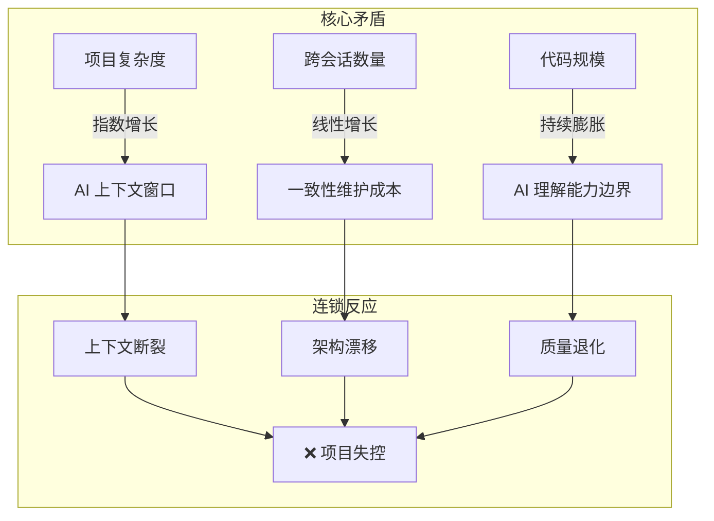
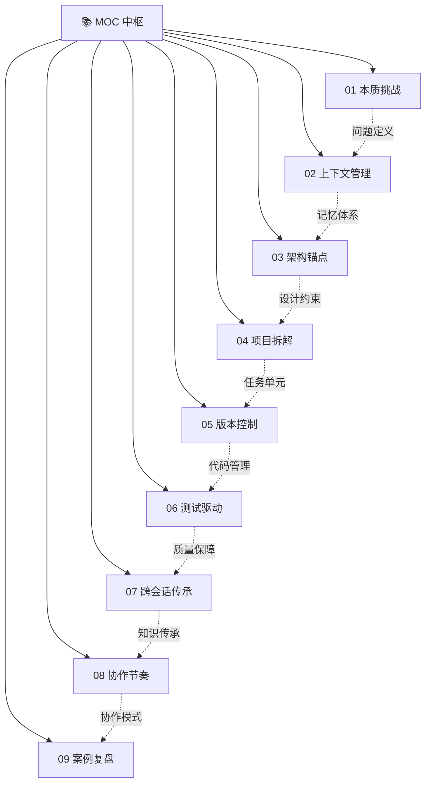

# 超长项目AI跑 — 知识库建设方案

> [!abstract] 核心问题
> 当你用 AI 开发一个需要跨越多个会话、持续数天甚至数周的项目时，AI 每次都是"新大脑"——不记得上次做了什么决策、为什么这样做、哪些地方容易踩坑。这个知识库就是解决这个问题的。

---

## 一、问题定义：为什么超长项目是 AI 的"阿喀琉斯之踵"



> [!important] 一句话总结
> 超长项目的核心矛盾不是"AI 不够聪明"，而是**"AI 没有记忆"**。每一次新会话，AI 都是从头开始理解项目。所有方法论都围绕一个目标：**让 AI 在最短时间内"重新理解"项目，然后做出与之前一致的决策**。

---

## 二、痛点全景图

```mermaid
quadrantChart
    title 超长项目痛点矩阵
    x-axis 发生频率低 --> 发生频率高
    y-axis 影响程度小 --> 影响程度大
    quadrant-1 高频高影响：重点关注
    quadrant-2 低频高影响：预案防范
    quadrant-3 高频低影响：工具化解决
    quadrant-4 低频低影响：可接受
    "上下文断裂" [0.85, 0.95]
    "架构漂移" [0.6, 0.9]
    "质量退化" [0.75, 0.8]
    "决策追溯难" [0.5, 0.7]
    "断点续跑" [0.8, 0.6]
    "依赖管理" [0.4, 0.65]
    "测试维护" [0.7, 0.55]
    "提示词膨胀" [0.9, 0.4]
    "版本混乱" [0.55, 0.35]
    "重复解释" [0.95, 0.25]
```

### 八大核心痛点

| 痛点 | 典型表现 | 根因 | 解决方向 |
|---|---|---|---|
| **上下文断裂** | 新会话中 AI 忘记之前的架构决策、代码约定 | AI 无状态，每次会话独立 | 多级记忆体系 + Context Bootstrap |
| **架构漂移** | 模块间接口不一致、设计风格分裂 | 缺少可被 AI 理解的架构锚点 | Spec/PRD/ADR 文档体系 |
| **质量退化** | 新功能破坏旧功能，回归问题频发 | 测试覆盖不足 + AI 不了解影响面 | 测试驱动 + 自动化回归 |
| **断点续跑难** | 不知道上次做到哪了、下一步该做什么 | 任务状态不可见 | Session Summary + 任务看板 |
| **决策追溯难** | 三周后想不起来"为什么当时这样设计" | 决策过程没有记录 | 决策日志 + 设计文档 |
| **提示词膨胀** | 每次都要写超长 prompt 解释上下文 | 项目信息没有结构化存储 | 项目记忆文件 + 模板化 |
| **依赖塌方** | 改一个模块，其他模块跟着崩 | 模块间耦合 + AI 不了解全局影响 | 接口契约 + 影响分析 |
| **人机协作失衡** | 不知道什么时候该让人介入、什么时候信任 AI | 缺少明确的协作边界和门禁 | 分工模型 + 质量门禁 |

---

## 三、核心理念：把 AI 当成"每天换一个外包程序员"

> [!tip] 关键隐喻
> 如果你每天换一个外包程序员来写代码，你会怎么做？
> 1. 给他一份**项目概述**（这是什么项目、技术栈是什么）
> 2. 给他一份**架构设计文档**（代码怎么组织的、规范是什么）
> 3. 给他一个**明确的任务**（今天要做什么，边界是什么）
> 4. 给他一份**昨天的进度**（上次做到哪了、有什么遗留问题）
> 5. 让他做完后**写一份交接文档**（做了什么、为什么、下一步是什么）
>
> **这就是超长项目 AI 协作的核心方法论。**

---

## 四、文档规划（10篇）



### 模块一：问题定义（1篇）

| 编号 | 文档标题 | 核心内容 | 价值 |
|---|---|---|---|
| 01 | 超长项目的本质挑战 | 为什么 AI 跑长项目这么难？上下文窗口的物理限制、AI 无状态特性、项目复杂度与 AI 理解能力的剪刀差。**核心矛盾**：AI 每次都是"新大脑"，但项目需要"持续记忆"。对比人类程序员 vs AI 在长项目中的差异 | ⭐⭐⭐ 建立问题意识 |

### 模块二：方法论体系（6篇）

| 编号 | 文档标题 | 核心内容 | 价值 |
|---|---|---|---|
| 02 | 上下文管理：AI 的记忆体系 | **多级记忆体系**设计：L1 项目记忆文件（~500字，每次会话必读）、L2 架构文档（按需加载）、L3 模块详情（深入时加载）、L4 代码本体（AI 自行探索）。**窗口预算分配**：多少留给项目记忆、多少留给当前任务、多少留给对话历史。**关键信息浓缩**：如何把 100 页的项目浓缩成 500 字还不丢失关键决策 | ⭐⭐⭐ 核心方法论 |
| 03 | 架构锚点：用 Spec 锁定 AI 不乱跑 | **PRD/SPEC 文档**的设计方法（不是给人看的 PRD，是给 AI 读的 PRD）。**架构决策记录（ADR）**：每个关键决策记录"背景→决策→后果→替代方案"。**代码规范锚点**：用代码片段锁定风格（如"所有 API 调用格式参考 `src/api/example.ts`"）。**模块边界定义**：接口契约，让 AI 知道改这里会影响哪里 | ⭐⭐⭐ 架构一致性 |
| 04 | 项目拆解：从庞然大物到可消化单元 | 如何把一个大项目拆成 AI 一个会话能完成的任务单元。**拆解原则**：每个任务单元应 < 200 行代码变更、可独立测试、有明确完成标准。**依赖管理**：用 DAG（有向无环图）管理任务依赖。**优先级排序**：先做核心路径，再做边缘功能。**任务模板**：标准化任务描述格式 | ⭐⭐⭐ 可执行性 |
| 05 | 版本控制与渐进式交付 | **Git 工作流**：每会话一个分支，完成后合并。**增量提交策略**：小步快跑，每完成一个独立功能就提交。**回滚与恢复**：当 AI 搞砸了，如何快速回到最近的安全点。**功能开关**：用 Feature Flag 隔离未完成功能 | ⭐⭐ 代码安全 |
| 06 | 测试驱动：让 AI 自己守护质量 | **测试优先开发**：先让 AI 写测试，再写实现。**回归测试自动化**：每次新功能提交前，自动跑全量回归。**AI 生成测试**：让 AI 为已有代码生成测试用例。**质量门禁**：测试覆盖率、类型检查、lint 检查作为 AI 会话的"交付标准" | ⭐⭐⭐ 质量保障 |
| 07 | 跨会话传承：让 AI"记住"上次做了什么 | **Session Summary 模板**：每次会话结束时，AI 输出一份结构化的"本次做了什么→为什么这么做→遗留问题→下一步建议"。**Context Bootstrap 流程**：新会话开始时的标准启动流程（读项目记忆→读上次 Summary→读相关 Spec→开始任务）。**项目记忆文件**的维护策略：什么时候更新、更新什么 | ⭐⭐⭐ 核心方法论 |

### 模块三：协作模式（1篇）

| 编号 | 文档标题 | 核心内容 | 价值 |
|---|---|---|---|
| 08 | 人机协作节奏：谁做什么、何时介入 | **人机分工模型**：人负责 Spec 定义、架构决策、关键代码审查；AI 负责代码生成、测试编写、文档生成。**介入时机**：遇到新架构决策、测试失败、AI 重复犯错时。**阶段门禁设计**：每个阶段（设计→开发→测试→集成）的通过标准。**协作反模式**：过度微管理 vs 过度放任 | ⭐⭐⭐ 实践指南 |

### 模块四：实战验证（1篇）

| 编号 | 文档标题 | 核心内容 | 价值 |
|---|---|---|---|
| 09 | 案例复盘：一个真实长项目的全流程 | 以一个真实项目为例（如"校招测评题库系统"），从 Day 0 到 Day 20 的完整复盘。每个阶段：做了什么、遇到了什么问题、怎么解决的、踩了什么坑。附带项目记忆文件的实际内容、Session Summary 示例、ADR 示例 | ⭐⭐⭐ 端到端验证 |

---

## 五、知识体系层次

```
┌─────────────────────────────────────────────────────────┐
│                    🎯 核心认知（为什么）                    │
│   01 本质挑战：AI 是"每天换一个外包程序员"                  │
├─────────────────────────────────────────────────────────┤
│                    🔧 方法论（怎么做）                      │
│   02 上下文管理 ─── 03 架构锚点 ─── 04 项目拆解            │
│   05 版本控制   ─── 06 测试驱动 ─── 07 跨会话传承          │
├─────────────────────────────────────────────────────────┤
│                    👥 协作模式（谁来做）                    │
│   08 人机协作节奏：人做决策，AI 做执行                      │
├─────────────────────────────────────────────────────────┤
│                    📖 实战验证（验证）                      │
│   09 案例复盘：方法论在真实项目中的效果                      │
└─────────────────────────────────────────────────────────┘
```

---

## 六、与已有知识库的关联

| 已有知识库 | 关联方式 |
|---|---|
| **Vibe Coding 系列** | 本知识库是 Vibe Coding 的"长项目特化版"。Vibe Coding 讲的是"怎么用 AI 写代码"，本知识库讲的是"怎么用 AI 写一个持续三周的项目" |
| **Skill 制作痛点** | 第 07 篇"跨会话传承"的方法论，可以反哺 Skill 设计——如何让 Skill 在多次调用间保持一致性 |
| **人机协作阶段演进** | 第 08 篇"人机协作节奏"直接对应五阶段模型的"阶段三：协作共创"，是本知识库与协作框架的衔接点 |
| **AI 时代能力要求** | 第 06 篇"测试驱动"中提到的 AI 输出评估能力，对应"AI 素养"中的评估能力 |
| **培训与人才发展** | 第 07 篇"跨会话传承"中的 Session Summary 方法论，本质上是 ADDIE 模型的"评估"环节在 AI 协作中的映射 |

---

## 七、核心创新点

> [!important] 本知识库的独特价值
> 1. **不是泛泛的"AI 编程技巧"**，而是专门针对**跨会话、长周期**项目的系统方法论
> 2. **"每天换一个外包程序员"**的核心隐喻，把所有方法论统一到一个简单易懂的框架下
> 3. **多级记忆体系**是原创的上下文管理框架，不是简单的"写个好 prompt"
> 4. **与已有知识库形成闭环**：Vibe Coding（基础）→ 超长项目（进阶）→ 协作阶段（理论）→ 能力要求（人才）

---

## 八、建设优先级

| 优先级 | 文档 | 理由 |
|---|---|---|
| **P0** | 01 本质挑战 + 02 上下文管理 + 03 架构锚点 + 07 跨会话传承 | 核心方法论，解决最痛的上下文断裂问题 |
| **P1** | 04 项目拆解 + 06 测试驱动 + 08 协作节奏 | 执行层面的方法论，让方法落地 |
| **P2** | 05 版本控制 + 09 案例复盘 | 工具操作 + 实战验证 |

---

## 九、后续步骤

1. **确认方案**：是否增减模块 / 调整优先级
2. **开始建设**：按 P0 → P1 → P2 顺序逐篇撰写
3. **关联打通**：每篇完成时，与 Vibe Coding、协作阶段、能力要求等知识库建立双向链接