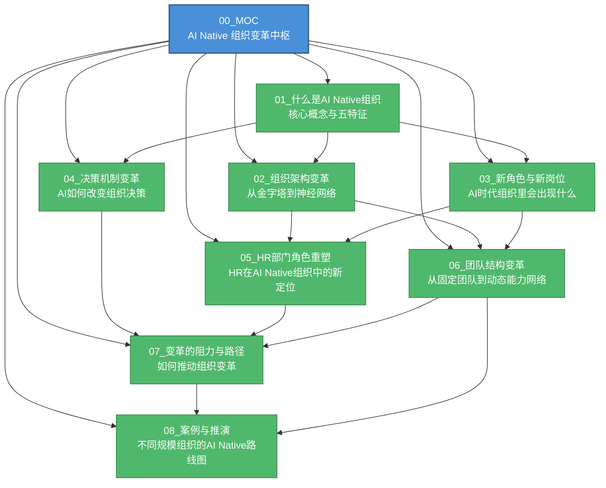
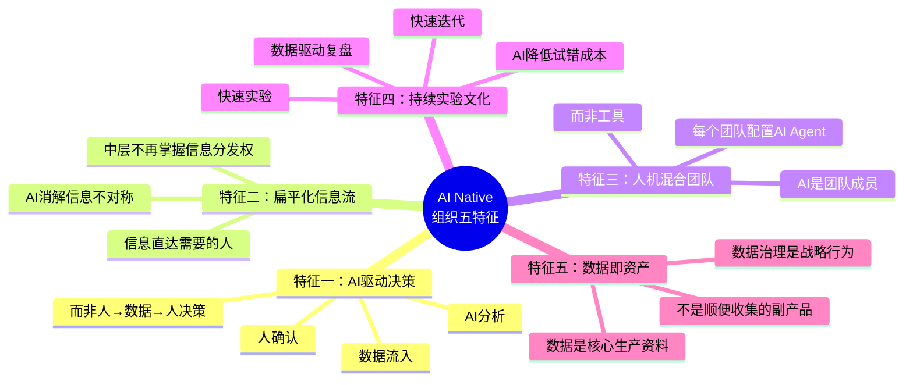
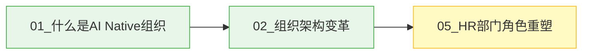
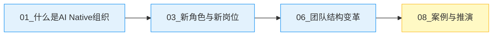
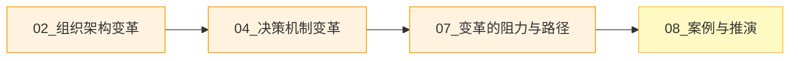
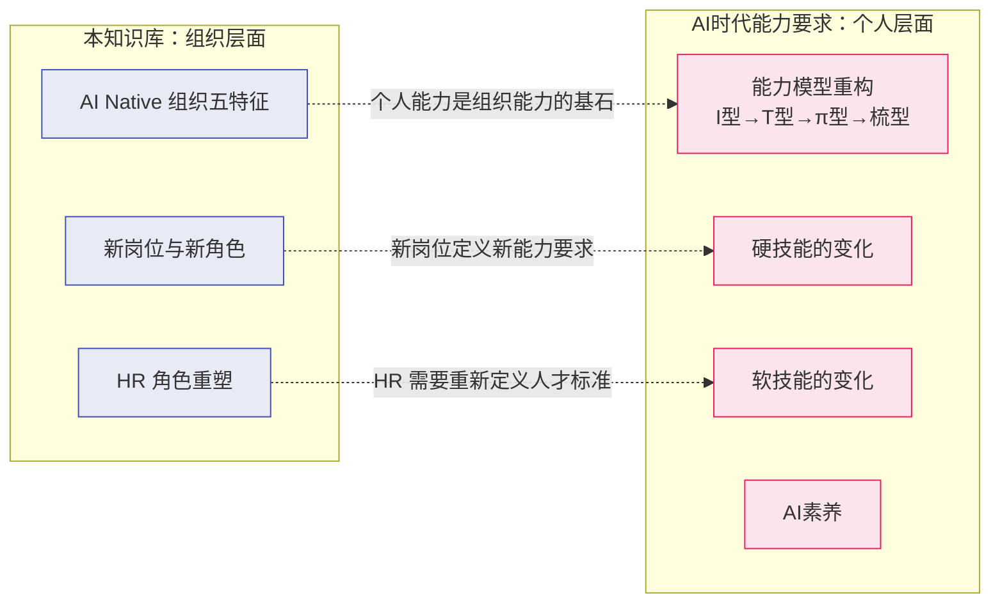
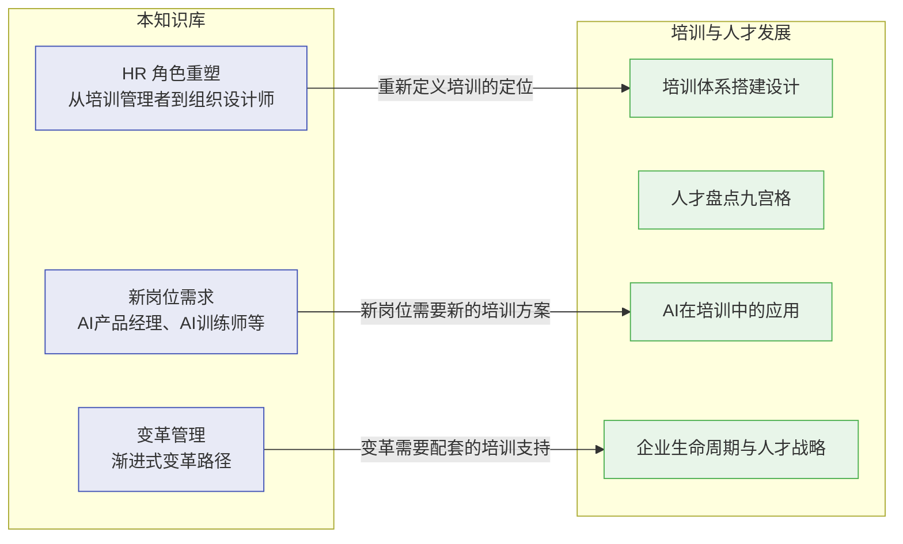
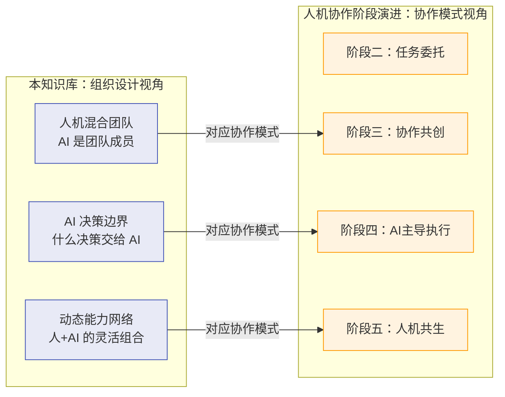
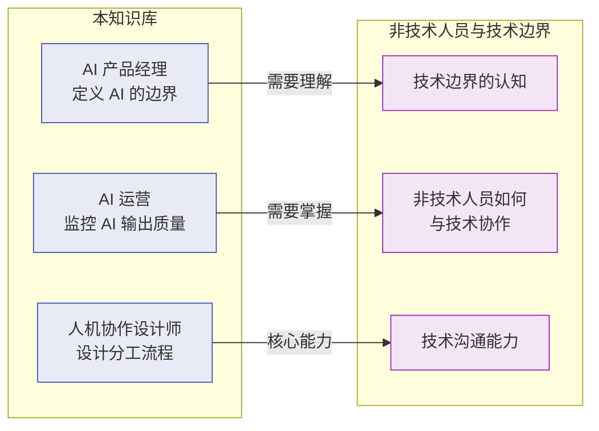
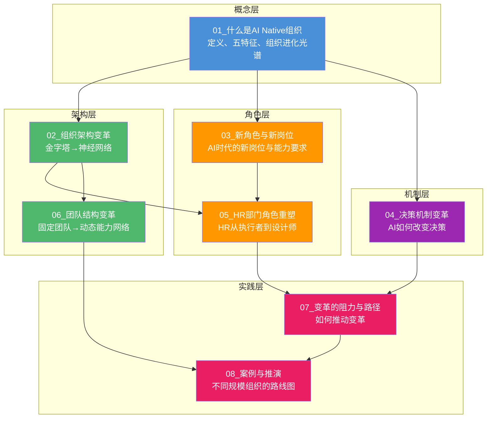

# AI Native 组织变革中枢

> [!abstract] 知识库定位
> 本知识库聚焦**组织层面的架构变革**——如果今天从零创办一家公司，默认 AI 已经存在，你会怎么设计组织？
>
> 已有知识库 [[02-AI趋势与素养/AI时代能力要求/00_MOC_AI时代能力要求中枢]]、[[03-HR人事/培训与人才发展/培训与人才发展_知识库建设方案]]、[[02-AI趋势与素养/人机协作阶段演进/00_MOC_人机协作阶段演进中枢]] 讲的是"个人能力变化"、"培训体系"、"个体协作阶段"，本知识库补全的是**组织架构、决策机制、人才结构、团队形态**等组织层面的系统性变革。

> [!important] 核心隐喻
> **从"给马车装发动机"到"直接造汽车"**
>
> 大多数公司当前的实践是"传统组织 + AI 工具"（马车装发动机），真正的 AI Native 是**重新设计组织架构、决策流程、人才结构**——就像汽车不是马车加发动机，而是从底盘到动力系统到操控方式的全面重构。

---

## 文档导航图

---

## 文档索引表

| 编号 | 文档名称 | 核心问题 | 适合人群 | 关联文档 |
|------|---------|---------|---------|---------|
| 01 | [[02-AI趋势与素养/AI Native组织变革/01_什么是AI Native组织]] | 什么是 AI Native 组织？它和"用了 AI 的组织"有什么区别？ | 所有人 | [[02-AI趋势与素养/AI Native组织变革/02_组织架构变革：从金字塔到神经网络]] |
| 02 | [[02-AI趋势与素养/AI Native组织变革/02_组织架构变革：从金字塔到神经网络]] | 组织架构如何从金字塔演变为神经网络式？中层管理会消失吗？ | 管理者、HR | [[02-AI趋势与素养/AI Native组织变革/01_什么是AI Native组织]]、[[02-AI趋势与素养/AI Native组织变革/06_团队结构变革：从固定团队到动态能力网络]] |
| 03 | [[02-AI趋势与素养/AI Native组织变革/03_新角色与新岗位：AI时代组织里会出现什么]] | AI 时代会出现哪些新岗位？哪些岗位会消失或转型？ | HR、求职者、创业者 | [[02-AI趋势与素养/AI Native组织变革/05_HR部门在AI Native组织中的角色重塑]]、[[02-AI趋势与素养/AI时代能力要求/00_MOC_AI时代能力要求中枢]] |
| 04 | [[02-AI趋势与素养/AI Native组织变革/04_决策机制变革：AI如何改变组织决策]] | AI 如何参与组织决策？决策权如何重新分配？ | 管理者、创业者 | [[02-AI趋势与素养/AI Native组织变革/07_组织变革的阻力与路径]] |
| 05 | [[02-AI趋势与素养/AI Native组织变革/05_HR部门在AI Native组织中的角色重塑]] | HR 部门如何从"流程执行者"变为"组织设计师"？ | HR 从业者 | [[03-HR人事/培训与人才发展/培训与人才发展_知识库建设方案]]、[[02-AI趋势与素养/AI Native组织变革/03_新角色与新岗位：AI时代组织里会出现什么]] |
| 06 | [[02-AI趋势与素养/AI Native组织变革/06_团队结构变革：从固定团队到动态能力网络]] | 团队如何从固定编制变为动态能力网络？最小可行团队是什么？ | 管理者、创业者 | [[02-AI趋势与素养/AI Native组织变革/02_组织架构变革：从金字塔到神经网络]]、[[02-AI趋势与素养/人机协作阶段演进/00_MOC_人机协作阶段演进中枢]] |
| 07 | [[02-AI趋势与素养/AI Native组织变革/07_组织变革的阻力与路径]] | 变革会遇到哪些阻力？如何设计渐进式变革路径？ | 管理者、HR、变革推动者 | [[02-AI趋势与素养/AI Native组织变革/04_决策机制变革：AI如何改变组织决策]]、[[03-HR人事/培训与人才发展/培训与人才发展_知识库建设方案]] |
| 08 | [[02-AI趋势与素养/AI Native组织变革/08_案例与推演：不同规模组织的AI Native路线图]] | 不同规模的组织如何落地 AI Native？12 个月路线图怎么画？ | 创业者、管理者、咨询顾问 | [[02-AI趋势与素养/AI Native组织变革/07_组织变革的阻力与路径]]、[[02-AI趋势与素养/AI Native组织变革/06_团队结构变革：从固定团队到动态能力网络]] |

---

## 核心概念速览：AI Native 组织五特征

> [!note] 关键区分
> **用了 AI ≠ AI Native**，就像有网站 ≠ 数字化。真正的 AI Native 是组织基因层面的变革，而非在现有组织上叠加 AI 工具。

---

## 三条阅读路径

### 路径一：HR 从业者
关注HR部门在AI时代的角色转型、新岗位设计、人才战略变化。

**推荐阅读顺序**：
1. [[02-AI趋势与素养/AI Native组织变革/01_什么是AI Native组织]] —— 理解 AI Native 的五特征，建立全局认知
2. [[02-AI趋势与素养/AI Native组织变革/02_组织架构变革：从金字塔到神经网络]] —— 理解组织架构的演进方向，把握中层管理者角色的转型
3. [[02-AI趋势与素养/AI Native组织变革/05_HR部门在AI Native组织中的角色重塑]] —— 重点：HR 从"流程执行者"到"组织设计师"的转型路径

> [!tip] HR 从业者额外推荐
> 结合 [[03-HR人事/培训与人才发展/培训与人才发展_知识库建设方案]] 知识库，理解"培训体系"如何与"AI Native 组织"的人才需求对接。特别是 [[03-HR人事/培训与人才发展/06-前沿趋势/19_AI在培训中的应用]] 和 [[03-HR人事/培训与人才发展/04-人才发展/12_人才盘点九宫格]] 两篇文档，与 AI 时代的人才评估有直接关联。

---

### 路径二：创业者
关注从零开始如何设计 AI Native 组织，以及如何在实践中落地。

**推荐阅读顺序**：
1. [[02-AI趋势与素养/AI Native组织变革/01_什么是AI Native组织]] —— 建立"造汽车"而非"改装马车"的思维框架
2. [[02-AI趋势与素养/AI Native组织变革/03_新角色与新岗位：AI时代组织里会出现什么]] —— 确定创业初期需要什么样的核心人才
3. [[02-AI趋势与素养/AI Native组织变革/06_团队结构变革：从固定团队到动态能力网络]] —— 设计最小可行团队和动态能力网络
4. [[02-AI趋势与素养/AI Native组织变革/08_案例与推演：不同规模组织的AI Native路线图]] —— 重点阅读"初创公司（10-50人）"路线图

> [!tip] 创业者额外推荐
> 结合 [[02-AI趋势与素养/人机协作阶段演进/00_MOC_人机协作阶段演进中枢]] 知识库，理解从"工具使用"到"人机共生"的协作演化路径，帮助你在创业初期就设计好人与 AI 的分工模式。

---

### 路径三：管理者
关注如何推动组织变革、设计新的决策机制、处理变革中的阻力。

**推荐阅读顺序**：
1. [[02-AI趋势与素养/AI Native组织变革/02_组织架构变革：从金字塔到神经网络]] —— 理解组织架构的演进方向
2. [[02-AI趋势与素养/AI Native组织变革/04_决策机制变革：AI如何改变组织决策]] —— 重点：AI 决策边界框架设计
3. [[02-AI趋势与素养/AI Native组织变革/07_组织变革的阻力与路径]] —— 掌握变革的阻力应对策略和渐进式路径
4. [[02-AI趋势与素养/AI Native组织变革/08_案例与推演：不同规模组织的AI Native路线图]] —— 重点阅读"中小企业（50-500人）"和"大型企业（500+人）"路线图

> [!tip] 管理者额外推荐
> 结合 [[03-HR人事/培训与人才发展/培训与人才发展_知识库建设方案]] 中的 [[03-HR人事/培训与人才发展/01-战略视角/01_企业生命周期与人才战略]] 和 [[03-HR人事/培训与人才发展/01-战略视角/02_战略人力资源与人才供应链]]，理解企业不同阶段的人才战略与 AI Native 转型的匹配关系。

---

## 与已有知识库的关联

### 与 [[02-AI趋势与素养/AI时代能力要求/00_MOC_AI时代能力要求中枢]] 的关联

> [!note] 分层关系
> [[02-AI趋势与素养/AI时代能力要求/00_MOC_AI时代能力要求中枢]] 关注的是**个人层面**的能力变化（个体需要什么能力），本知识库关注的是**组织层面**的架构变革（组织如何设计以发挥 AI 的最大效能）。两者是"个人能力"与"组织土壤"的关系——个人能力再强，如果组织架构仍是科层制，AI 的优势就无法充分发挥。

---

### 与 [[03-HR人事/培训与人才发展/培训与人才发展_知识库建设方案]] 的关联

> [!tip] 关键衔接点
> 当你在本知识库中读到"HR 角色重塑"时，可以回到 [[03-HR人事/培训与人才发展/培训与人才发展_知识库建设方案]] 查看具体的培训体系搭建方法（如 [[03-HR人事/培训与人才发展/03-培训体系/08_培训需求分析TNA]]、[[03-HR人事/培训与人才发展/03-培训体系/09_课程体系搭建]]），将 AI Native 组织的人才需求转化为可落地的培训方案。

---

### 与 [[02-AI趋势与素养/人机协作阶段演进/00_MOC_人机协作阶段演进中枢]] 的关联

> [!important] 互补视角
> [[02-AI趋势与素养/人机协作阶段演进/00_MOC_人机协作阶段演进中枢]] 从**微观协作模式**出发，分类了工具使用、任务委托、协作共创、AI 主导执行、人机共生五个阶段。本知识库从**宏观组织设计**出发，回答"组织如何设计以支持这些协作模式"。两者结合阅读，可以从"个体如何与 AI 协作"到"组织如何设计人机协作体系"形成完整认知。

---

### 与 [[02-AI趋势与素养/非技术人员与技术边界/00_MOC_非技术人员与技术边界中枢]] 的关联

> [!note] 能力衔接
> 本知识库中描述的"AI 产品经理"、"AI 运营"、"人机协作设计师"等新岗位，核心能力之一就是理解技术边界。[[02-AI趋势与素养/非技术人员与技术边界/00_MOC_非技术人员与技术边界中枢]] 为这些岗位提供了基础能力框架。

---

## 知识库结构总览

---

## 使用建议

> [!tip] 如何最大化本知识库的价值
> 1. **先读 MOC**：建立全局认知，理解知识库的结构和文档间的关系
> 2. **按路径阅读**：根据你的角色（HR/创业者/管理者）选择对应的阅读路径
> 3. **关联阅读**：每个文档末尾都有"关联文档"的指引，建议按照指引交叉阅读
> 4. **结合已有知识库**：本知识库与 [[02-AI趋势与素养/AI时代能力要求/00_MOC_AI时代能力要求中枢]]、[[03-HR人事/培训与人才发展/培训与人才发展_知识库建设方案]]、[[02-AI趋势与素养/人机协作阶段演进/00_MOC_人机协作阶段演进中枢]]、[[02-AI趋势与素养/非技术人员与技术边界/00_MOC_非技术人员与技术边界中枢]] 深度关联，建议在阅读过程中适时跳转

> [!warning] 注意事项
> - 本知识库讨论的是**组织层面的架构变革**，不是个人如何使用 AI 工具
> - AI Native 是一个**方向**而非**终点**——不存在"完全 AI Native"的组织，只有"更 AI Native"的组织
> - 每个组织的变革路径不同，没有统一模板，本知识库提供的是**思考框架**而非**标准答案**

---

## 知识库快速检索

你可以通过以下关键词在本知识库中搜索相关内容：

| 关键词 | 主要相关文档 |
|--------|-------------|
| AI Native 组织 | [[02-AI趋势与素养/AI Native组织变革/01_什么是AI Native组织]] |
| 组织架构 | [[02-AI趋势与素养/AI Native组织变革/02_组织架构变革：从金字塔到神经网络]] |
| 中层管理 | [[02-AI趋势与素养/AI Native组织变革/02_组织架构变革：从金字塔到神经网络]]、[[02-AI趋势与素养/AI Native组织变革/07_组织变革的阻力与路径]] |
| 新岗位 | [[02-AI趋势与素养/AI Native组织变革/03_新角色与新岗位：AI时代组织里会出现什么]] |
| 决策机制 | [[02-AI趋势与素养/AI Native组织变革/04_决策机制变革：AI如何改变组织决策]] |
| HR 转型 | [[02-AI趋势与素养/AI Native组织变革/05_HR部门在AI Native组织中的角色重塑]] |
| 团队设计 | [[02-AI趋势与素养/AI Native组织变革/06_团队结构变革：从固定团队到动态能力网络]] |
| 变革阻力 | [[02-AI趋势与素养/AI Native组织变革/07_组织变革的阻力与路径]] |
| 路线图 | [[02-AI趋势与素养/AI Native组织变革/08_案例与推演：不同规模组织的AI Native路线图]] |
| 人机协作 | [[02-AI趋势与素养/AI Native组织变革/06_团队结构变革：从固定团队到动态能力网络]]、[[02-AI趋势与素养/人机协作阶段演进/00_MOC_人机协作阶段演进中枢]] |
| 人才战略 | [[02-AI趋势与素养/AI Native组织变革/03_新角色与新岗位：AI时代组织里会出现什么]]、[[02-AI趋势与素养/AI时代能力要求/00_MOC_AI时代能力要求中枢]] |
| 数据资产 | [[02-AI趋势与素养/AI Native组织变革/01_什么是AI Native组织]] |
| 实验文化 | [[02-AI趋势与素养/AI Native组织变革/01_什么是AI Native组织]]、[[02-AI趋势与素养/AI Native组织变革/06_团队结构变革：从固定团队到动态能力网络]] |

---

> [!abstract] 关于本知识库
> **创建日期**：2026-07-27
> **版本**：v1.0
> **作者**：AI Native 组织变革研究
> **更新记录**：初始版本，包含 1 个 MOC + 8 篇内容文档
> **关联知识库**：[[02-AI趋势与素养/AI时代能力要求/00_MOC_AI时代能力要求中枢]]、[[03-HR人事/培训与人才发展/培训与人才发展_知识库建设方案]]、[[02-AI趋势与素养/人机协作阶段演进/00_MOC_人机协作阶段演进中枢]]、[[02-AI趋势与素养/非技术人员与技术边界/00_MOC_非技术人员与技术边界中枢]]