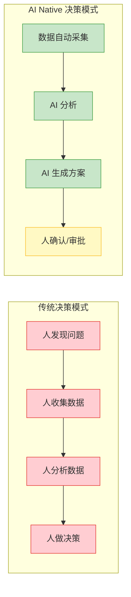
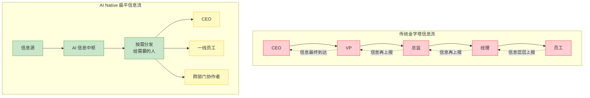
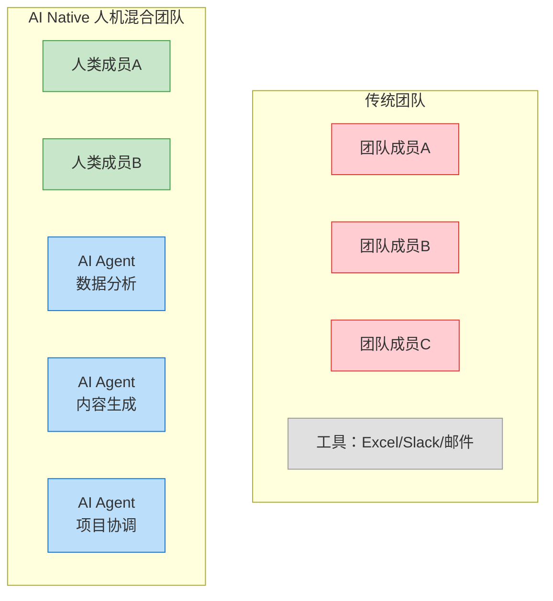
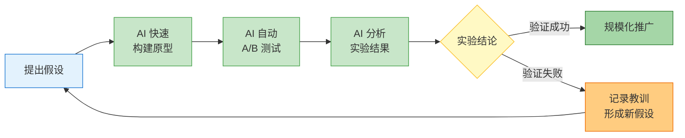
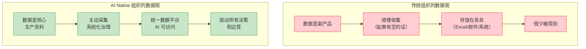
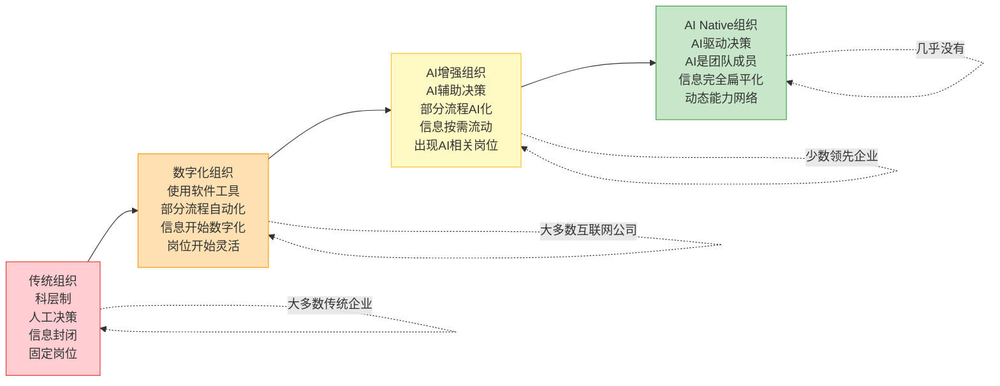
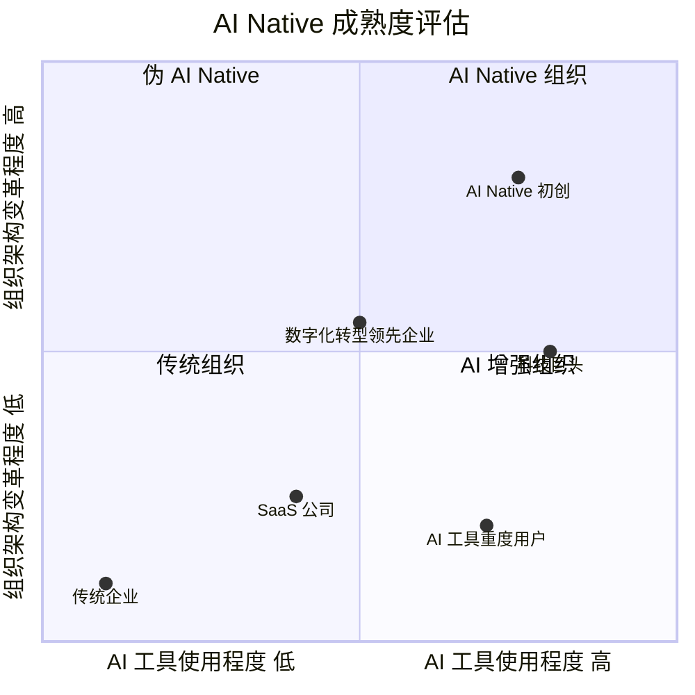

# 什么是AI Native组织

> [!important] 核心隐喻
> **从"给马车装发动机"到"直接造汽车"**
>
> 大多数公司当前的实践是"传统组织 + AI 工具"——这就像给马车装上发动机，马车跑得快了一点，但它仍然是马车，不是汽车。真正的 AI Native 组织是**重新设计组织架构、决策流程、人才结构、协作模式**——就像汽车不是马车加发动机，而是从底盘到动力系统到操控方式的全面重构。

> [!abstract] 本章核心问题
> 什么是 AI Native 组织？它和"用了 AI 的组织"有什么区别？为什么说"用了 AI ≠ AI Native"？

---

## 一、AI Native 组织的五个特征

### 特征一：AI 驱动决策

> [!note] 关键变化
> 在传统组织中，决策的核心瓶颈是**人**——人的时间、人的认知带宽、人的信息处理能力。在 AI Native 组织中，AI 承担了"分析、聚合、生成方案"的工作，人从"做决策的苦力"变成了"做决策的裁判"。

**具体表现**：
- 每日运营决策（如库存补货、客服响应优先级、营销预算分配）由 AI 自动完成
- 人只需处理 AI 标记为"需要人工判断"的例外情况
- 决策速度从"天"提升到"秒"，决策质量从"凭经验"提升到"数据驱动"

> [!tip] 实例
> 某电商公司的 AI Native 实践：AI 系统自动监控全平台 10 万 SKU 的销售数据、库存数据、竞品价格，自动生成补货建议和调价建议。人工只需每天花 15 分钟审核 AI 标记的 20 个"异常建议"，而无需逐条审核 5000 条常规建议。

---

### 特征二：扁平化信息流

> [!important] 中层的权力基础被瓦解
> 在传统组织中，中层管理者的核心权力来源之一是"信息分发权"——他知道上级的想法，也知道下级的执行情况，他决定什么信息往上传递、什么信息往下传达。AI 消解了这种信息不对称：信息不再经过中层"翻译"，而是由 AI 直接按需分发。

**具体表现**：
- 一线员工可以直接获取公司战略、业务数据、客户反馈等信息，无需通过经理"传达"
- 高层可以直接看到一线的执行数据和客户反馈，无需通过经理"汇报"
- 跨部门协作不再需要"找对人"——AI 可以直接推荐最合适的协作者

---

### 特征三：人机混合团队

> [!note] AI 不是工具，是团队成员
> 在传统组织中，AI 被视为"工具"——就像 Excel 或 Slack，人用它来提高效率。在 AI Native 组织中，AI 被视为**团队的正式成员**——它有明确的职责、有输入输出、有绩效评估标准。

**具体表现**：
- 团队 Morning Standup 中，AI Agent 汇报它过去 24 小时处理的自动化任务
- 项目分工时，明确哪些任务分配给"人类成员"，哪些分配给"AI Agent"
- 团队 KPI 中，包含"AI Agent 调用频次"、"AI Agent 产出质量"等指标

> [!tip] 参考
> 这种"人机混合团队"的协作模式，与 [[02-AI趋势与素养/人机协作阶段演进/00_MOC_人机协作阶段演进中枢]] 中的"阶段三：协作共创"和"阶段四：AI 主导执行"有直接对应关系。建议结合阅读以理解协作的深度。

---

### 特征四：持续实验文化

> [!important] AI 大幅降低了试错成本
> 在传统组织中，每次"试错"意味着人力投入、时间成本、机会成本。在 AI Native 组织中，AI 可以快速生成原型、自动运行 A/B 测试、自动分析结果——实验的成本从"一个月 + 一个团队"降低到"一小时 + 一个 AI Agent"。

**具体表现**：
- 实验频率：从"每月一两次"到"每天数十次"
- 实验范围：从"只有大项目才敢实验"到"每个小决策都可以实验"
- 实验文化：从"失败是耻辱"到"不实验才是风险"

> [!warning] 陷阱
> 持续实验文化需要配套的**数据基础设施**和**快速决策机制**。如果 AI 生成了实验结论，但人需要花三天才能做出"是否推广"的决策，那么实验的速度优势就完全被浪费了。这也是为什么 [[02-AI趋势与素养/AI Native组织变革/04_决策机制变革：AI如何改变组织决策]] 必须与实验文化配套建设。

---

### 特征五：数据即资产

> [!note] 数据治理是战略行为，不是 IT 部门的任务
> 在 AI Native 组织中，数据质量直接影响 AI 的决策质量。如果数据是脏的、碎片化的、不可访问的，AI 再强大也无用武之地。因此，数据治理不是"IT 部门顺便做一下"的事，而是 CEO 级别的战略议题。

**具体表现**：
- 每个新业务上线时，首先定义"这个业务会产生什么数据、谁会用到这些数据"
- 公司设有"数据资产目录"，任何员工（和 AI Agent）都可以查找和访问所需数据
- 数据质量有明确的 KPI，与业务部门的绩效挂钩

---

## 二、组织进化光谱

### 四个阶段的对比

| 维度 | 传统组织 | 数字化组织 | AI 增强组织 | AI Native 组织 |
|------|---------|-----------|------------|---------------|
| **决策方式** | 人凭经验决策 | 人看数据决策 | AI 辅助人决策 | AI 驱动决策，人确认 |
| **组织结构** | 金字塔科层制 | 科层制 + 项目组 | 矩阵式 + 敏捷小队 | 神经网络式，动态组网 |
| **信息流动** | 层层上报，层层下达 | 部分信息数字化，但仍需层层传递 | 信息按需流动，但仍有层级 | 信息完全扁平化，AI 按需分发 |
| **人才需求** | 专业化、执行型 | 专业化 + 数字化 | 复合型 + AI 素养 | "AI+业务"复合型，AI 协作能力是基本要求 |
| **技术依赖** | 基本办公软件 | ERP、CRM 等系统 | AI 工具嵌入部分流程 | AI 是组织的基础设施 |
| **团队形态** | 固定部门、固定岗位 | 固定部门 + 虚拟项目组 | 敏捷小队 + 部分动态调配 | 动态能力网络，按需组队 |
| **中层角色** | 信息传递者、监督者 | 信息传递者 + 协调者 | 开始从"传递者"向"决策者"转型 | 纯粹的决策者与教练 |
| **实验文化** | 几乎没有 | 偶尔有，成本高 | 开始有，但受限于流程 | 持续实验，AI 自动执行 |
| **数据态度** | 数据是副产品 | 数据被系统收集，但利用率低 | 数据开始被重视，但治理不完善 | 数据是核心资产，系统化治理 |
| **AI 角色** | 不存在 | 不存在 | 工具（辅助人） | 团队成员（与人协作） |

> [!important] 关键区分
> **用了 AI ≠ AI Native**，就像有网站 ≠ 数字化。一家公司可能购买了 ChatGPT 企业版、部署了 AI 客服、用 AI 写周报，但如果它的组织架构仍然是科层制、决策流程仍然是层层审批、信息流动仍然依赖中层"传达"，那它仍然是"AI 增强组织"而非"AI Native 组织"。

---

## 三、"AI Native"的迷思与澄清

### 迷思一："AI Native 就是全员 AI 化"

> [!danger] 错误
> 不是让所有人都变成 AI 专家，而是让组织的**架构设计**默认 AI 存在。

**澄清**：AI Native 组织中，不是每个人都需要会写代码或训练模型。就像数字化组织中，不是每个人都需要会写 SQL。关键是**组织流程、决策机制、人才结构**围绕 AI 的能力来设计，而不是让每个人去适应 AI。

---

### 迷思二："AI Native 意味着 AI 取代人"

> [!danger] 错误
> AI Native 不是"AI 取代人"，而是"人 + AI"的组合产出远超"纯人"或"纯 AI"。

**澄清**：AI Native 组织的核心是**重新定义人的角色**——人从"执行者"变成"决策者"、从"重复劳动者"变成"创造性工作者"、从"信息中间人"变成"价值创造者"。中层管理者的消失不是"被裁员"，而是"角色转型"——从"信息传递者"变成"决策者和教练"。

---

### 迷思三："AI Native 是一个终点"

> [!danger] 错误
> 不存在"完全 AI Native"的组织，只有"更 AI Native"的组织。

**澄清**：AI Native 是一个**方向**和**过程**，而非一个**终点**。就像"数字化"是一个持续的过程，不存在"已经完全数字化了，不需要再做什么了"的公司。AI Native 同样如此——AI 技术在不断进化，组织的 AI Native 程度也在不断进化。

---

## 四、从"马车装发动机"到"造汽车"的思维转变

```mermaid
graph TB
    subgraph "马车装发动机（错误路径）"
        M1["买 AI 工具"] --> M2["要求员工使用 AI"]
        M2 --> M3["组织架构不变"]
        M3 --> M4["决策流程不变"]
        M4 --> M5["AI 沦为摆设<br/>或效率提升有限"]
    end
    
    subgraph "造汽车（正确路径）"
        C1["重新定义组织愿景<br/>AI 作为默认假设"] --> C2["重新设计组织架构<br/>神经网络式"]
        C2 --> C3["重新设计决策流程<br/>AI 驱动"]
        C3 --> C4["重新设计人才结构<br/>AI+业务复合型"]
        C4 --> C5["AI 成为组织基因<br/>效率质的飞跃"]
    end
    
    style M1 fill:#FFCDD2,stroke:#E53935
    style M2 fill:#FFCDD2,stroke:#E53935
    style M3 fill:#FFCDD2,stroke:#E53935
    style M4 fill:#FFCDD2,stroke:#E53935
    style M5 fill:#FFCDD2,stroke:#E53935
    style C1 fill:#C8E6C9,stroke:#43A047
    style C2 fill:#C8E6C9,stroke:#43A047
    style C3 fill:#C8E6C9,stroke:#43A047
    style C4 fill:#C8E6C9,stroke:#43A047
    style C5 fill:#A5D6A7,stroke:#2E7D32
```

> [!tip] 思维实验
> 如果你今天从零创办一家公司，默认 AI 已经存在，你会怎么设计组织？
> 1. 你还会设置"部门"吗？还是用"能力池"？
> 2. 你还会设置"经理"吗？还是用"AI 协调层"？
> 3. 你还会写"岗位说明书"吗？还是用"能力标签"动态匹配？
> 4. 你还会做"年度预算"吗？还是用"AI 驱动的实时资源分配"？
>
> 这些问题，就是本知识库要系统回答的。

---

## 五、AI Native 组织的成熟度模型

> [!note] 解读
> - **左下象限（传统组织）**：既没有大量使用 AI 工具，也没有改变组织架构。大多数传统企业在此象限。
> - **右下象限（AI 增强组织）**：大量使用 AI 工具，但组织架构变化不大。虽然效率有所提升，但 AI 的潜力远未释放。
> - **右上象限（AI Native 组织）**：既深度使用 AI 工具，又从根本上改变了组织架构。这是 AI Native 的理想状态。
> - **左上象限（伪 AI Native）**：组织架构变了，但 AI 工具使用不足。这种"为变革而变革"往往效果不佳。

---

## 本章小结

> [!abstract] 核心要点
> 1. AI Native 组织有五个特征：AI 驱动决策、扁平化信息流、人机混合团队、持续实验文化、数据即资产
> 2. 组织进化是一个光谱：传统组织 → 数字化组织 → AI 增强组织 → AI Native 组织
> 3. **用了 AI ≠ AI Native**，就像有网站 ≠ 数字化；真正的 AI Native 是组织基因层面的变革
> 4. AI Native 是一个方向而非终点，不存在"完全 AI Native"，只有"更 AI Native"
> 5. 核心思维转变：从"给马车装发动机"到"直接造汽车"

> [!question] 思考题
> 你的组织目前处于组织进化光谱的哪个阶段？阻碍你向 AI Native 迈进的最大障碍是什么？是技术问题、人才问题、还是组织架构问题？

---

## 关联文档

- [[02-AI趋势与素养/AI Native组织变革/02_组织架构变革：从金字塔到神经网络]] —— 继续深入理解组织架构如何从金字塔演变为神经网络式
- [[02-AI趋势与素养/AI Native组织变革/04_决策机制变革：AI如何改变组织决策]] —— 深入理解 AI 如何改变组织的决策机制
- [[02-AI趋势与素养/AI Native组织变革/03_新角色与新岗位：AI时代组织里会出现什么]] —— 了解 AI Native 组织中会出现哪些新岗位
- [[02-AI趋势与素养/AI时代能力要求/00_MOC_AI时代能力要求中枢]] —— 个人层面的能力变化，与组织层面的变革形成互补
- [[02-AI趋势与素养/人机协作阶段演进/00_MOC_人机协作阶段演进中枢]] —— 理解人与 AI 协作的五个阶段，为"人机混合团队"提供微观基础