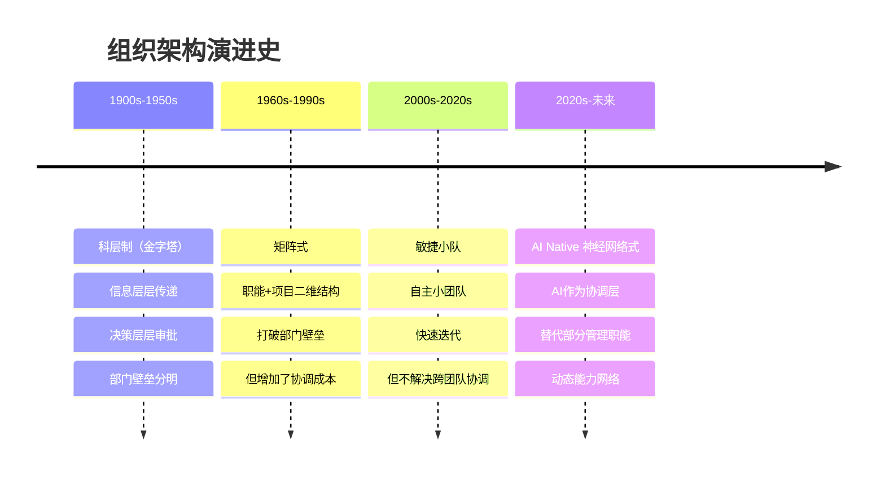
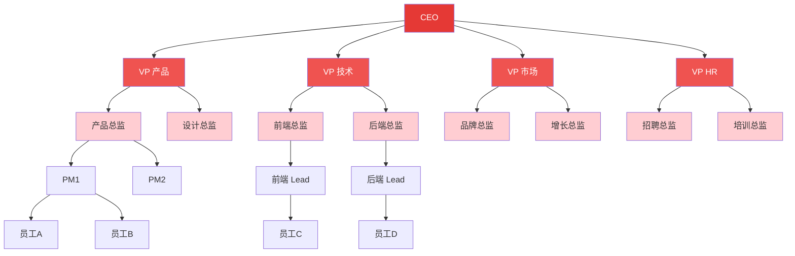
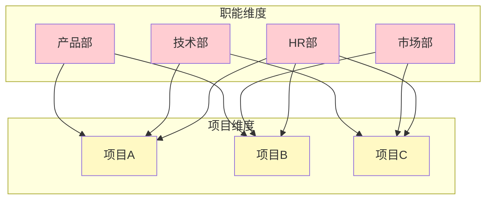
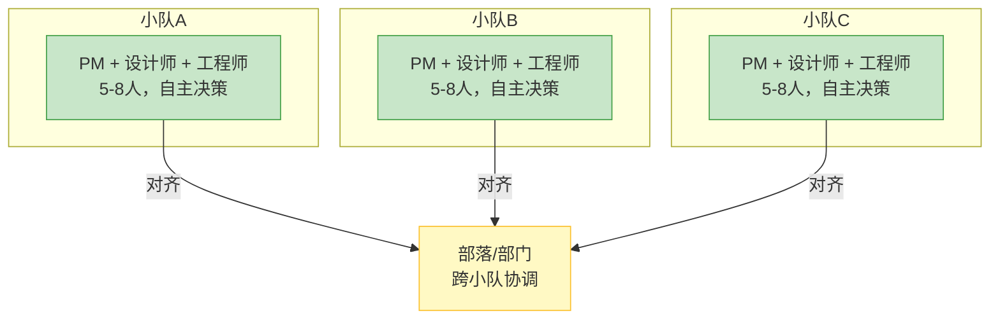
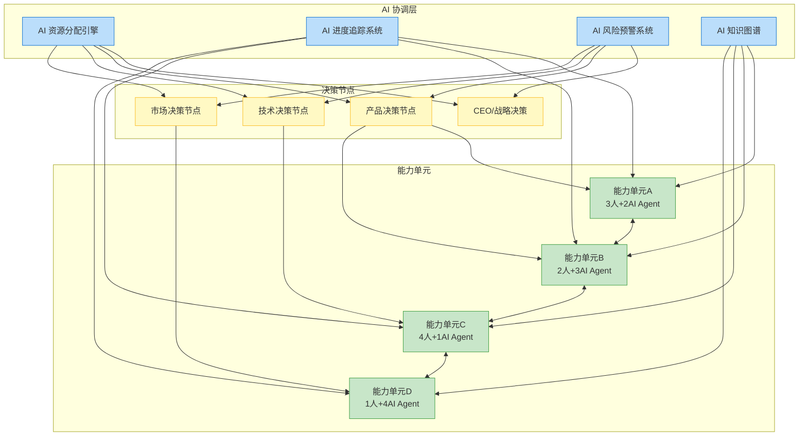
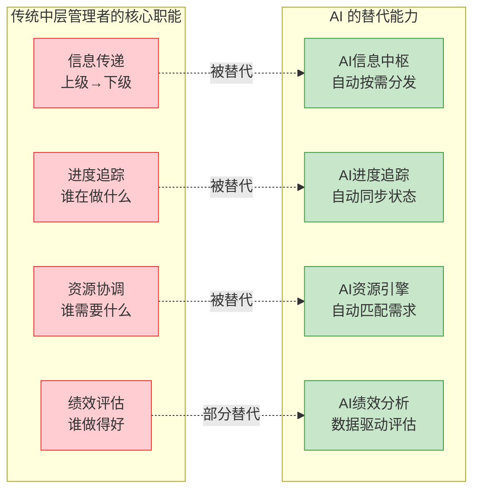
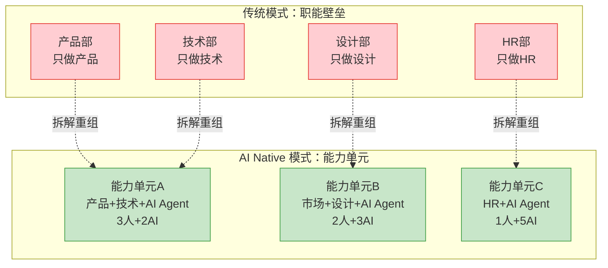
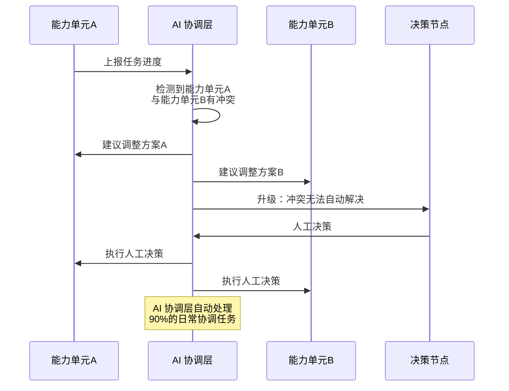
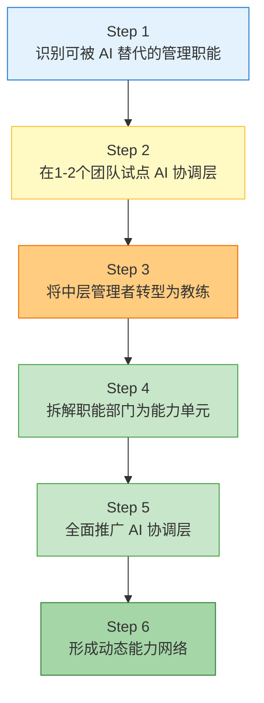

# 组织架构变革：从金字塔到神经网络

> [!important] 核心观点
> 在 AI Native 组织中，AI 承担了传统组织中"中层管理者"的核心职能——信息传递、进度追踪、资源协调。这意味着，组织架构不再需要多层级的"信息中转站"，而是可以进化为**神经网络式**的扁平结构——AI 是"协调层"，人是"决策节点"。

> [!abstract] 本章核心问题
> 组织架构如何从金字塔演变为神经网络式？中层管理会消失吗？AI 如何替代传统管理职能？

---

## 一、四种组织架构的演进

### 总体演进图谱

---

### 架构一：科层制（金字塔）

**特征**：
- 层级分明：CEO → VP → 总监 → 经理 → 员工
- 信息传递：从上到下逐级传达，从下到上逐级汇报
- 决策方式：谁层级高谁拍板
- 部门边界：每个部门有自己的"地盘"

**核心问题**：
- 信息传递损耗：每经过一层，信息失真 20%-30%
- 决策速度慢：一个决策平均需要 3-5 个层级审批
- 部门壁垒：市场部不知道产品部在做什么，产品部不理解技术部的约束
- 中层冗余：中层管理者 70% 的时间花在"信息传递"而非"价值创造"

---

### 架构二：矩阵式

**特征**：
- 每个人有两个汇报线：职能经理（管人）和项目经理（管事）
- 试图打破部门壁垒，让不同职能部门的人一起做项目

**核心问题**：
- **双重汇报困境**：员工同时向两个人汇报，当职能经理和项目经理意见不一致时，员工陷入两难
- **协调成本高**：每个项目都需要和多个职能部门协调，项目管理成本大幅上升
- **权力斗争**：职能经理和项目经理争夺对员工的控制权

---

### 架构三：敏捷小队

**特征**：
- 小队是自主的、跨职能的、5-8 人的小团队
- 小队有决策权，不需要层层审批
- 多个小队通过"部落"或"部门"对齐目标和资源

**核心问题**：
- **跨小队协调困难**：小队 A 不知道小队 B 在做什么，容易重复造轮子或产生冲突
- **资源分配不透明**：哪个小队获得更多资源？缺乏系统化的分配机制
- **规模化挑战**：当小队数量超过 10 个时，部落/部门的协调能力达到瓶颈

---

### 架构四：AI Native 神经网络式

**特征**：
- **AI 协调层**替代了传统的中层管理职能：资源分配、进度追踪、风险预警
- **决策节点**是分布式的：不是"CEO 一个人决策"，而是每个节点在自己领域内决策
- **能力单元**是动态的：根据项目需求，能力单元可以灵活组合和拆分
- **信息流**是扁平的：能力单元之间的信息通过 AI 知识图谱直接共享

---

## 二、核心变化之一：中层管理的消失与转型

> [!important] 中层管理的角色转型
> 中层管理者的传统核心职能（信息传递、进度追踪、资源协调、绩效评估）中，前三个可以被 AI 完全替代，第四个可以被 AI 部分替代。但这并不意味着中层管理者会消失——他们的角色将从**"信息传递者"**转变为**"决策者"**和**"教练"**。

### 中层管理者的新角色

| 传统角色 | 新角色 | 说明 |
|---------|--------|------|
| 信息传递者 | **不需要了** | AI 自动按需分发信息，信息不再需要"中间人" |
| 进度追踪者 | **不需要了** | AI 自动追踪每个能力单元的进度，实时同步 |
| 资源协调者 | **不需要了** | AI 资源引擎自动匹配需求和供给 |
| 决策者 | **决策者（升级版）** | 从"做日常决策"变成"做例外决策"——AI 处理不了的复杂情况 |
| 绩效评估者 | **教练** | AI 提供数据驱动的绩效分析，管理者专注于"如何帮助员工成长" |
| 团队建设者 | **能力单元设计师** | 不再是"管理一个固定团队"，而是"设计能力单元的组合方式" |

> [!tip] 一个具体的例子
> 张经理是一个传统组织中的产品总监，手下有 3 个产品经理。他的日常工作包括：
> - 早上看每个 PM 的日报，了解进度（AI 可以替代）
> - 把上周的用户数据整理成报告发给 VP（AI 可以替代）
> - 协调设计团队和开发团队的排期冲突（AI 可以替代）
> - 和每个 PM 做 1-on-1，帮助他们解决困难（**这是 AI 替代不了的，也是他最有价值的工作**）
>
> 在 AI Native 组织中，前三个任务由 AI 自动完成，张经理可以把 80% 的时间花在最后一项——**教练和赋能**。

---

## 三、核心变化之二：跨职能团队成为基本单元

> [!note] 关键变化
> 在传统组织中，每个职能部门是一个"能力孤岛"——产品部只做产品、技术部只做技术。跨部门协作需要通过层层审批、跨部门会议、邮件沟通。在 AI Native 组织中，**跨职能的能力单元是基本单元**——每个能力单元自带完成目标所需的所有能力（包括人类和 AI Agent）。

**具体表现**：
- 不是"一个团队里有一个 HR"，而是"每个能力单元直接对接 AI 驱动的 HR 服务"——AI 自动处理入职、薪酬、绩效评估等常规 HR 事务
- 不是"申请财务审批"，而是"AI 财务 Agent 自动审批预算内的支出"
- 不是"找法务审合同"，而是"AI 法务 Agent 自动审标准合同，只把异常的踢给人类法务"

---

## 四、核心变化之三：AI 协调层

> [!important] AI 协调层的三大职能
> 1. **资源分配**：根据项目优先级、能力匹配度、可用时间，自动推荐人员和 AI Agent 的分配方案
> 2. **进度追踪**：自动同步各能力单元的进度，识别延迟风险，提出调整建议
> 3. **风险预警**：基于历史数据和实时数据，自动识别项目风险（如需求变更频繁、关键人员过载等），提前预警

> [!tip] 关键洞察
> AI 协调层不是"一个 AI 系统"，而是**一组 AI Agent 的集合**——每个 Agent 负责一个领域的协调（资源 Agent、进度 Agent、风险 Agent、知识 Agent）。它们之间通过标准化的 API 通信，形成一个"AI 管理网络"。

---

## 五、四种架构的全面对比

| 维度 | 科层制 | 矩阵式 | 敏捷小队 | AI Native 神经网络式 |
|------|--------|--------|---------|---------------------|
| **层级数量** | 5-7 层 | 3-5 层 | 2-3 层 | 1-2 层 |
| **决策速度** | 慢（天/周） | 中（小时/天） | 较快（小时） | 极快（秒/分钟） |
| **信息传递损耗** | 高（每层 20-30%） | 中高 | 中 | 低（AI 直接分发） |
| **跨部门协作** | 困难 | 中（双重汇报） | 中（小队间协调） | 容易（AI 自动协调） |
| **管理成本** | 高（大量中层） | 高（双重管理） | 中（部落管理） | 低（AI 替代管理） |
| **灵活性** | 低 | 中 | 较高 | 极高（动态组网） |
| **规模化能力** | 强（但慢） | 中 | 挑战（>10个小队） | 强（AI 协调层可扩展） |
| **创新能力** | 低 | 中 | 较高 | 高（持续实验） |
| **人才要求** | 专业化 | 专业化+协作 | 全栈化 | AI+业务复合型 |
| **适合场景** | 稳定环境 | 中等复杂度 | 快速变化 | 高度不确定、AI 密集型 |

---

## 六、向神经网络式架构转型的关键步骤

> [!warning] 最大的挑战不是技术，而是人
> 向神经网络式架构转型，最大的挑战不是 AI 技术本身（AI 协调层的技术已经相对成熟），而是**中层管理者的抗拒**。当他们的"信息传递者"角色被 AI 替代后，他们是否愿意转型为"教练"？是否具备转型所需的能力？这需要配套的培训和变革管理。详见 [[02-AI趋势与素养/AI Native组织变革/07_组织变革的阻力与路径]]。

---

## 本章小结

> [!abstract] 核心要点
> 1. 组织架构经历了科层制 → 矩阵式 → 敏捷小队 → AI Native 神经网络式的演进
> 2. AI 协调层是 AI Native 组织的核心架构创新——它替代了传统中层管理者的信息传递、进度追踪、资源协调职能
> 3. 中层管理者的角色将从"信息传递者"转型为"决策者"和"教练"
> 4. 跨职能的能力单元取代职能部门，成为组织的基本单元
> 5. 神经网络式架构的最大挑战不是技术，而是人的转型

> [!question] 思考题
> 如果你是一个中层管理者，你如何将你目前 70% 花在"信息传递"上的时间，转化为花在"教练和赋能"上的时间？你的团队需要什么样的 AI 工具来支持这种转型？

---

## 关联文档

- [[02-AI趋势与素养/AI Native组织变革/01_什么是AI Native组织]] —— 回顾 AI Native 组织的五个特征，理解组织架构变革的宏观背景
- [[02-AI趋势与素养/AI Native组织变革/06_团队结构变革：从固定团队到动态能力网络]] —— 深入理解"能力单元"如何运作，以及如何从固定团队向动态能力网络转型
- [[02-AI趋势与素养/AI Native组织变革/04_决策机制变革：AI如何改变组织决策]] —— 理解在神经网络式架构中，决策权如何分配和流转
- [[02-AI趋势与素养/AI Native组织变革/07_组织变革的阻力与路径]] —— 了解中层管理者转型过程中的阻力和应对策略
- [[02-AI趋势与素养/AI Native组织变革/05_HR部门在AI Native组织中的角色重塑]] —— HR 部门如何支持这种架构转型