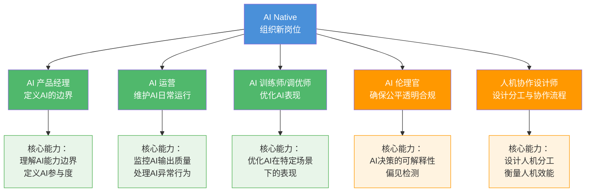
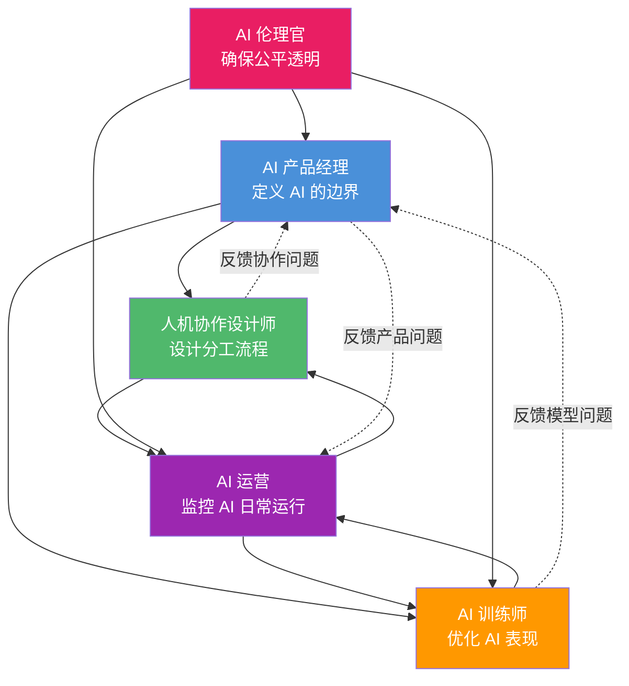
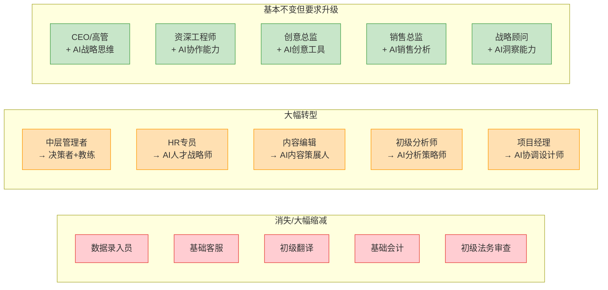

# 新角色与新岗位：AI时代组织里会出现什么

> [!important] 核心观点
> AI 时代，消失的是"可被 AI 替代的任务"，而不是"人"。但新的组织形态需要新的岗位——这些岗位不是"传统岗位 + AI 技能"，而是**围绕 AI 的能力边界、人机协作的设计、AI 系统的治理**而生的全新角色。

> [!abstract] 本章核心问题
> AI 时代会出现哪些新岗位？哪些岗位会消失或转型？"AI+业务"复合型人才为什么是未来最稀缺的？

---

## 一、新岗位全景图



---

## 二、五大新岗位详解

### 岗位一：AI 产品经理

> [!note] 定义
> AI 产品经理不是传统 PM 的"AI 版"，而是**定义 AI 的边界**——知道 AI 能做什么、不能做什么、应该做什么、不应该做什么。

| 维度 | 传统 PM | AI 产品经理 |
|------|---------|------------|
| **核心关注** | 用户需求 → 功能设计 | AI 能力边界 → 人机分工设计 |
| **需求来源** | 用户访谈、竞品分析、数据 | 以上 + AI 能力评估、AI 行为分析 |
| **设计对象** | 用户界面、交互流程 | 人机交互流程、AI 决策逻辑 |
| **核心技能** | 需求分析、原型设计、数据分析 | 以上 + AI 能力理解、AI 行为设计、AI 输出评估 |
| **关键决策** | 做什么功能、不做什么功能 | 什么交给 AI、什么留给人、AI 的"安全边界"在哪 |
| **衡量指标** | 用户满意度、功能使用率 | AI 决策准确率、人机协作效率 |

**为什么这个岗位现在需要**：
- AI 不是"万能工具"——它有明确的能力边界，需要有人来定义这个边界
- AI 的行为是"概率性"的，不是"确定性"的——PM 需要设计"AI 出错时的用户体验"
- 人机协作的分工不是"一拍脑袋"能决定的——需要系统化的设计

> [!tip] 实例
> 一个 AI 客服产品的 PM 需要决定：
> - 哪些问题由 AI 自动回答？（如"我的订单到哪了"）
> - 哪些问题由 AI 草拟答案，人工审核后发送？（如"我要投诉"）
> - 哪些问题直接转人工？（如"我要起诉你们"）
> - AI 回答错误时，用户如何"纠正"AI？如何让 AI 从错误中学习？

---

### 岗位二：AI 运营

> [!note] 定义
> AI 运营负责**维护 AI 系统的日常运行**，监控 AI 输出质量，处理 AI 的"异常行为"——类似于传统 IT 运维，但对象是 AI 系统而非服务器。

| 维度 | 传统 IT 运维 | AI 运营 |
|------|-------------|---------|
| **监控对象** | 服务器状态、网络延迟 | AI 输出质量、AI 行为异常 |
| **告警类型** | 服务器宕机、流量异常 | AI 输出偏差、AI 拒绝率上升、AI 幻觉率增加 |
| **处理方式** | 重启服务器、扩容 | 回滚 AI 版本、调整 prompt、标记异常样本 |
| **核心技能** | 系统管理、网络知识 | AI 系统理解、数据分析、异常检测 |
| **日常工作** | 巡检、处理工单 | 巡检 AI 输出、处理 AI 异常工单、优化 AI 配置 |

**为什么这个岗位现在需要**：
- AI 的行为是"概率性"的——今天表现好的 AI，明天可能因为数据分布变化而表现变差
- AI 会"退化"——如果不持续监控和优化，AI 的输出质量会逐渐下降
- AI 的"异常行为"需要专业判断——什么算异常？如何处理？何时回滚？这些都需要 AI 运营的专业判断

> [!tip] 实例
> 某公司的 AI 内容审核系统，周一突然开始大量误判——把正常内容标记为违规。AI 运营发现是因为周末上线的训练数据引入了偏差，立即回滚到上一个版本，并在 2 小时内恢复了正常。如果没有 AI 运营，这个"异常"可能要等到用户大量投诉才会被发现。

---

### 岗位三：AI 训练师/调优师

> [!note] 定义
> AI 训练师/调优师不是 prompt engineer（写 prompt 的人），而是**持续优化 AI 在特定场景下的表现**——通过调整训练数据、微调模型、设计评估体系来提升 AI 的业务效果。

| 维度 | Prompt Engineer | AI 训练师/调优师 |
|------|----------------|-----------------|
| **工作方式** | 写 prompt 指令 | 训练数据管理、模型微调、评估体系设计 |
| **技术深度** | 浅（了解 prompt 技巧） | 深（理解模型行为、数据工程） |
| **影响范围** | 单个对话/任务 | 整个 AI 系统在特定场景的表现 |
| **迭代方式** | 试 prompt、看效果 | 分析错误模式、优化训练数据、重新微调 |
| **产出** | 好的 prompt 模板 | 优化的模型版本、评估报告、训练数据方案 |

**为什么这个岗位现在需要**：
- 通用 AI 模型在特定业务场景下表现不佳——需要领域专家来"调优"
- AI 需要"理解"业务上下文——这不是写 prompt 能解决的，需要系统化的训练和优化
- 评估 AI 的业务效果需要专业方法——不是"跑几个测试用例"就行了

> [!tip] 实例
> 某法律科技公司的 AI 训练师，负责优化 AI 在法律文书生成场景下的表现。她的工作包括：
> - 收集和标注高质量的法律文书作为训练数据
> - 识别 AI 在"法律术语使用"、"逻辑推理"、"格式规范"等方面的错误模式
> - 设计评估体系（如"法律准确性"、"逻辑完整性"、"格式规范性"三个维度的评分标准）
> - 与工程师合作，将优化方案落地为模型微调

---

### 岗位四：AI 伦理官

> [!note] 定义
> AI 伦理官负责**确保 AI 决策的公平性、透明度、合规性**——在 AI 越来越深入地参与组织决策的时代，这个角色变得不可或缺。

| 维度 | 传统合规/法务 | AI 伦理官 |
|------|-------------|----------|
| **关注焦点** | 法律合规（不要违法） | 伦理合规（AI 决策公平、透明、可解释） |
| **工作对象** | 业务流程、合同 | AI 模型、AI 决策逻辑 |
| **核心技能** | 法律知识、合规管理 | 法律知识 + AI 理解 + 伦理框架 + 偏见检测 |
| **典型问题** | "这个合同条款合法吗？" | "AI 招聘系统对女性求职者有偏见吗？" |
| **产出** | 合规报告 | AI 伦理评估报告、AI 透明度说明、AI 偏见检测报告 |

**为什么这个岗位现在需要**：
- AI 的决策可能带有偏见（来自训练数据的偏见），而这种偏见可能带来法律风险和声誉风险
- 监管机构正在加强对 AI 决策的监管（如欧盟 AI Act），要求 AI 决策必须可解释、可申诉
- 员工和客户对 AI 的信任，取决于 AI 决策的公平性和透明度

> [!warning] 紧迫性
> 2024 年欧盟 AI Act 正式通过，对"高风险 AI 系统"提出了严格的透明度、可解释性、人工监督要求。在中国，AI 治理相关法规也在加速推进。AI 伦理官不是"可选项"，而是"合规必需品"。

---

### 岗位五：人机协作设计师

> [!note] 定义
> 人机协作设计师负责**设计人与 AI 的分工流程、交互界面、效能衡量**——是 AI Native 组织中最具创造性的岗位之一。

| 维度 | 传统 UX 设计师 | 人机协作设计师 |
|------|---------------|---------------|
| **设计对象** | 人机界面（UI） | 人机协作流程、分工机制 |
| **核心问题** | "用户如何操作这个界面？" | "人和 AI 如何分工？何时切换？" |
| **设计产出** | 线框图、交互原型 | 人机协作流程图、分工规则、效能衡量框架 |
| **核心技能** | UI/UX 设计 | 以上 + AI 能力理解 + 组织行为学 + 效能分析 |
| **衡量标准** | 用户体验评分 | 人机协作效率、人机切换流畅度 |

**为什么这个岗位现在需要**：
- 人机协作不是"自然发生"的——需要有人来设计"人做什么、AI 做什么、何时切换"
- 人机协作的效率直接影响组织效能——糟糕的分工设计会让 AI 变成"累赘"而非"助力"
- 不同场景需要不同的协作模式——客服场景的协作模式不同于产品设计场景

> [!tip] 实例
> 一个人机协作设计师在设计"AI 辅助销售"的协作流程时，需要考虑：
> - AI 自动处理：客户基本信息查询、产品推荐、价格计算
> - 人机协作：AI 草拟报价方案，销售人员审核修改
> - 人主导：客户关系维护、复杂谈判、情感沟通
> - 切换机制：什么情况下 AI 自动升级到人工？（如"客户表达不满"、"合同金额超过 100 万"）

---

## 三、新岗位间的协作关系



> [!note] 协作动态
> 这五个岗位不是孤立的，而是紧密协作的：
> - AI 产品经理定义"AI 的边界"，人机协作设计师基于这个边界设计"人机分工"
> - AI 训练师优化 AI 的表现，AI 运营监控 AI 的日常运行——两者形成"优化-监控-反馈"的闭环
> - AI 伦理官贯穿所有环节，确保 AI 的决策在任何阶段都符合公平、透明、合规的要求

---

## 四、哪些传统岗位会消失或转型？



> [!important] 判断标准
> 一个岗位是否会被 AI 替代，取决于三个因素：
> 1. **重复性**：工作内容是否高度重复、可预测？ → 越高，越容易被替代
> 2. **规则性**：工作是否有明确的规则和标准？ → 越明确，越容易被替代
> 3. **人际性**：工作是否需要复杂的人际互动、情感理解、价值判断？ → 越少，越容易被替代
>
> 三个因素同时满足的岗位（如数据录入员），面临最大的替代风险。三个因素都不满足的岗位（如 CEO），基本不受影响，但需要学会"与 AI 协作"。

---

## 五、关键结论："AI+业务"复合型人才是未来最稀缺的

```mermaid
quadrantChart
    title 人才稀缺度矩阵
    x-axis "AI 能力 低" --> "AI 能力 高"
    y-axis "业务理解 低" --> "业务理解 高"
    quadrant-1 ""AI+业务"复合型人才<br/>最稀缺"
    quadrant-2 "纯业务专家<br/>仍有价值但需升级"
    quadrant-3 "纯AI技术人才<br/>供过于求"
    quadrant-4 "入门级人才<br/>AI替代风险高"
    "传统业务专家": [0.2, 0.8]
    "AI工程师": [0.8, 0.2]
    "AI产品经理": [0.7, 0.75]
    "AI训练师": [0.8, 0.65]
    "人机协作设计师": [0.65, 0.7]
    "AI伦理官": [0.55, 0.7]
    "初级数据分析师": [0.4, 0.3]
    "数据录入员": [0.1, 0.1]
    "AI Native 创业者": [0.75, 0.85]
```

> [!important] 核心洞察
> - **纯 AI 技术人才**（只会写代码、训练模型）：供给正在快速增长，竞争激烈
> - **纯业务专家**（只懂业务，不懂 AI）：仍有价值，但天花板在降低
> - **"AI+业务"复合型人才**：既懂 AI 的能力边界，又懂业务的痛点需求——这是 AI Native 组织最稀缺的"桥梁型人才"
>
> 本知识库中描述的五个新岗位（AI 产品经理、AI 运营、AI 训练师、AI 伦理官、人机协作设计师），本质上都是"AI+业务"复合型人才。

> [!tip] 关联
> 关于"AI+业务"复合型人才的能力模型，详见 [[02-AI趋势与素养/AI时代能力要求/00_MOC_AI时代能力要求中枢]] 中的 [[02-AI趋势与素养/AI时代能力要求/02_能力模型重构：从I型到T型到π型到梳型]]，以及 [[02-AI趋势与素养/AI时代能力要求/04_软技能的变化：AI时代的稀缺能力]]。

---

## 本章小结

> [!abstract] 核心要点
> 1. AI Native 组织需要五个全新的岗位：AI 产品经理、AI 运营、AI 训练师/调优师、AI 伦理官、人机协作设计师
> 2. 这些岗位不是"传统岗位 + AI 技能"，而是围绕 AI 的能力边界、人机协作设计、AI 治理而生的全新角色
> 3. 传统岗位中，高度重复+规则明确+人际性低的岗位面临最大替代风险
> 4. 中层管理者的角色将从"信息传递者"转型为"决策者+教练"
> 5. **"AI+业务"复合型人才是未来最稀缺的**——纯 AI 技术人才供给快速增长，纯业务专家天花板降低

> [!question] 思考题
> 你目前的岗位属于哪个象限？如果要在你的岗位上叠加"AI 能力"，你最需要学习的是什么？你的组织是否需要设置上述五个新岗位中的某一个？

---

## 关联文档

- [[02-AI趋势与素养/AI Native组织变革/01_什么是AI Native组织]] —— 回顾 AI Native 组织的定义和五特征
- [[02-AI趋势与素养/AI Native组织变革/05_HR部门在AI Native组织中的角色重塑]] —— HR 如何招聘和培养这些新岗位的人才
- [[02-AI趋势与素养/AI Native组织变革/06_团队结构变革：从固定团队到动态能力网络]] —— 这些新岗位如何在动态能力网络中发挥作用
- [[02-AI趋势与素养/AI时代能力要求/00_MOC_AI时代能力要求中枢]] —— 个人层面的能力变化，特别是 [[02-AI趋势与素养/AI时代能力要求/02_能力模型重构：从I型到T型到π型到梳型]] 和 [[02-AI趋势与素养/AI时代能力要求/04_软技能的变化：AI时代的稀缺能力]]
- [[02-AI趋势与素养/非技术人员与技术边界/00_MOC_非技术人员与技术边界中枢]] —— 理解"AI+业务"复合型人才需要掌握的技术边界认知