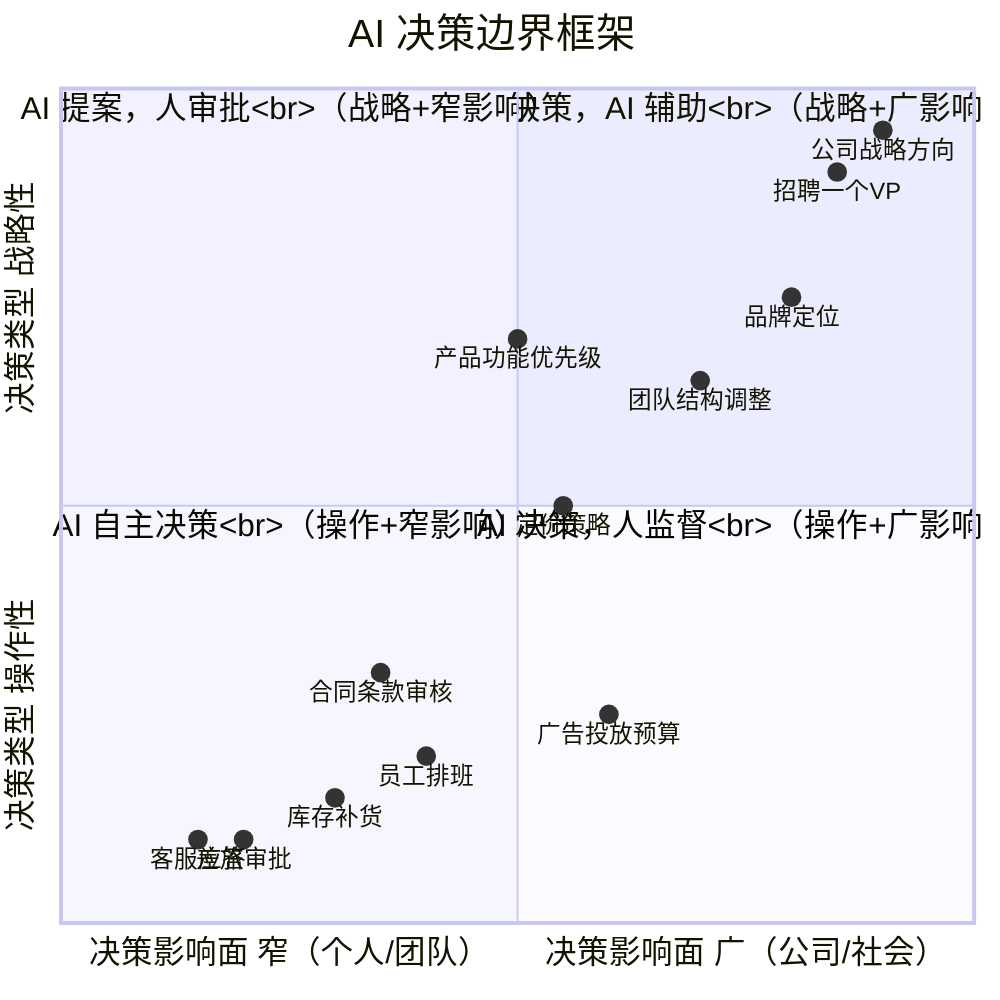
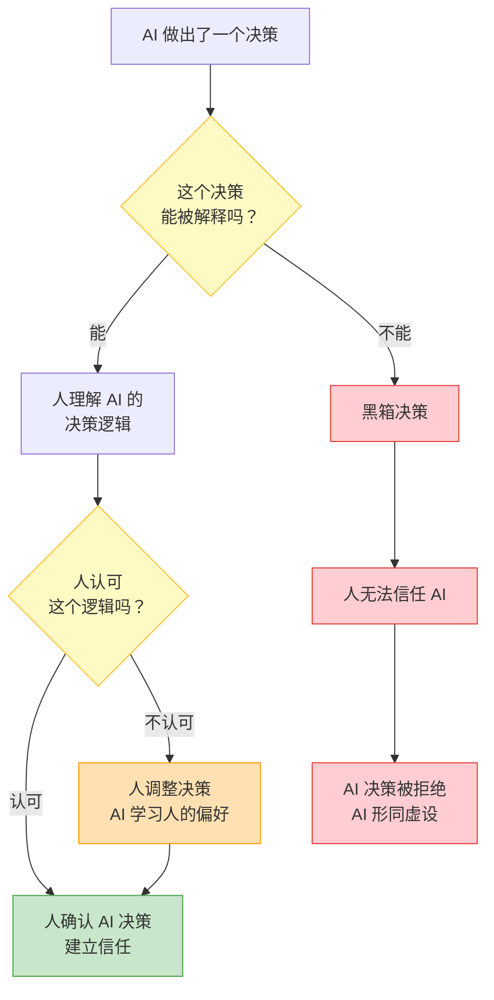
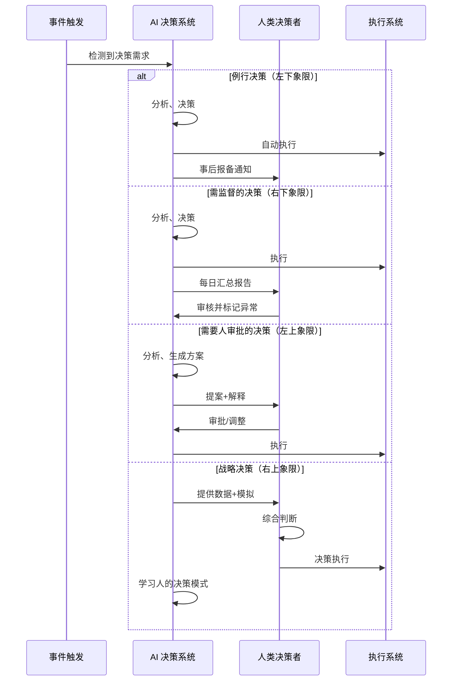

# 决策机制变革：AI如何改变组织决策

> [!important] 核心观点
> 在 AI Native 组织中，决策权不再由"层级"决定，而是由**决策类型与 AI 能力匹配度**决定。AI 处理"例行决策"，人处理"例外决策"——这不是"AI 取代人决策"，而是"人从做决策的苦力变成做决策的裁判"。

> [!abstract] 本章核心问题
> AI 如何参与组织决策？决策权如何重新分配？如何设计 AI 决策的边界和可解释性？

---

## 一、决策的三层进化

```mermaid
graph TB
    subgraph "第一层：人做决策，AI 辅助（当前阶段）"
        L1_A["人发现<br/>决策需求"] --> L1_B["AI 提供<br/>数据和分析"]
        L1_B --> L1_C["人综合判断<br/>做出决策"]
        L1_C --> L1_D["人执行<br/>并承担后果"]
    end
    
    subgraph "第二层：AI 做例行决策，人做例外决策（近期 1-3 年）"
        L2_A["AI 自动识别<br/>决策需求"] --> L2_B["AI 判断<br/>决策类型"]
        L2_B -->|"例行决策"| L2_C["AI 自动执行<br/>无需人工介入"]
        L2_B -->|"例外决策"| L2_D["AI 生成方案<br/>升级给人工"]
        L2_D --> L2_E["人审批<br/>或调整后执行"]
    end
    
    subgraph "第三层：AI 提案，人审批（未来 3-5 年）"
        L3_A["AI 主动识别<br/>决策机会"] --> L3_B["AI 生成多方案<br/>并解释利弊"]
        L3_B --> L3_C["人选择方案<br/>或要求 AI 调整"]
        L3_C --> L3_D["AI 执行<br/>并持续监控效果"]
    end
    
    style L1_A fill:#FFCDD2,stroke:#E53935
    style L1_B fill:#FFCDD2,stroke:#E53935
    style L1_C fill:#FFCDD2,stroke:#E53935
    style L1_D fill:#FFCDD2,stroke:#E53935
    style L2_A fill:#FFE0B2,stroke:#FF9800
    style L2_B fill:#FFE0B2,stroke:#FF9800
    style L2_C fill:#FFE0B2,stroke:#FF9800
    style L2_D fill:#FFE0B2,stroke:#FF9800
    style L2_E fill:#FFE0B2,stroke:#FF9800
    style L3_A fill:#C8E6C9,stroke:#43A047
    style L3_B fill:#C8E6C9,stroke:#43A047
    style L3_C fill:#C8E6C9,stroke:#43A047
    style L3_D fill:#C8E6C9,stroke:#43A047
```

### 第一层：人做决策，AI 辅助（当前阶段）

> [!note] 现状
> 这是大多数组织当前的阶段。AI 提供数据和分析，但最终的决策权在人手里。

**典型场景**：
- 销售经理看 AI 生成的销售预测报告，决定下季度的销售目标
- HR 看 AI 筛选的简历，决定面试谁
- 采购经理看 AI 推荐的供应商，决定选哪家

**核心局限**：
- AI 的作用被限制在"提供信息"，决策的"质"和"速"仍然受限于人
- 如果人不想看 AI 的报告，AI 的建议就等于"不存在"

---

### 第二层：AI 做例行决策，人做例外决策（近期 1-3 年）

> [!note] 正在发生
> 这是领先组织正在进入的阶段。90% 的日常决策由 AI 自主完成，人只处理 AI 标记为"需要人工判断"的例外情况。

**典型场景**：
- AI 自动调整广告投放预算（例行决策），只在 ROI 异常波动时通知人
- AI 自动审批标准合同（例行决策），只在条款异常时升级给法务
- AI 自动排班（例行决策），只在突发请假时请求人工干预

> [!tip] 关键设计原则
> **"默认 AI 决策，人工例外干预"** 而非 **"默认人工决策，AI 辅助"**。这个思维转变，是从"AI 增强组织"到"AI Native 组织"的关键一步。

---

### 第三层：AI 提案，人审批（未来 3-5 年）

> [!note] 未来方向
> AI 不仅做决策，还主动发现决策机会、生成多方案、解释利弊。人从"决策者"变成"审批者"。

**典型场景**：
- AI 发现公司现金流可能出现问题，主动生成三个应对方案（裁员、融资、缩减预算），并分析每个方案的利弊
- AI 发现某个产品线持续亏损，主动生成"关闭、转型、加大投入"三个方案，并附上数据支撑
- AI 发现公司人才结构存在短板，主动生成招聘计划和内部培养方案

---

## 二、AI 决策边界框架

### 四象限决策分类

| 象限 | 决策类型 | AI 参与度 | 决策流程 | 典型例子 |
|------|---------|----------|---------|---------|
| **左下** | 操作性 + 窄影响 | **AI 自主决策** | AI 自动执行，事后报备 | 客服应答、差旅审批、库存补货 |
| **右下** | 操作性 + 广影响 | **AI 决策，人监督** | AI 执行，人定期审核 | 广告投放、员工排班、合同审核 |
| **左上** | 战略性 + 窄影响 | **AI 提案，人审批** | AI 生成方案，人选择 | 产品优先级、团队结构 |
| **右上** | 战略性 + 广影响 | **人决策，AI 辅助** | 人主导，AI 提供数据分析和方案模拟 | 公司战略、高管招聘、品牌定位 |

> [!important] 动态调整原则
> 这四个象限的边界不是固定的。随着 AI 能力的提升，边界会逐渐向右上方移动——今天需要"人决策，AI 辅助"的，明天可能变成"AI 提案，人审批"；今天需要"AI 提案，人审批"的，明天可能变成"AI 自主决策"。

---

## 三、AI 决策的可解释性

> [!important] 可解释性 = 可信任性
> AI 的决策必须能解释"为什么"，否则人无法信任。在 AI Native 组织中，**可解释性不是可选项，而是 AI 决策系统的基本要求**。

### 可解释性的三个层次

| 层次 | 解释内容 | 例子 | 适用场景 |
|------|---------|------|---------|
| **第一层：结果解释** | AI 做了什么决策？ | "AI 拒绝了这笔贷款申请" | 所有 AI 决策 |
| **第二层：因素解释** | 哪些因素影响了决策？ | "信用评分低（占 60%）、收入不稳定（占 30%）、负债率高（占 10%）" | 需要人工审核的决策 |
| **第三层：逻辑解释** | 为什么这些因素导致了这个决策？ | "根据历史数据，信用评分低于 600 的申请人中，90% 在 12 个月内出现逾期" | 高风险决策、合规要求 |

> [!tip] 实践建议
> - 对于**左下象限**（AI 自主决策），第一层可解释性就足够了——"AI 做了什么"可以被事后审计
> - 对于**右下象限**（AI 决策，人监督），需要第二层可解释性——"为什么这么做"需要能被人理解
> - 对于**左上和右上象限**（需要人参与决策），需要第三层可解释性——"背后的逻辑"需要能被验证和讨论

---

## 四、组织中的人机决策协作流程

---

## 五、实施 AI 决策的常见陷阱

> [!danger] 陷阱一：一步到位
> 试图让 AI 一步到位处理所有决策，结果 AI 决策失误导致严重后果，组织对 AI 失去信任。

**应对**：从"左下象限"开始——先让 AI 处理最低风险、最标准化的决策。建立信任后，逐步扩展到其他象限。

> [!danger] 陷阱二：黑箱决策
> AI 做决策但不解释，导致人无法信任，最终 AI 决策被"架空"。

**应对**：所有 AI 决策必须附带可解释性。即使是"AI 自主决策"，也要有事后审计机制。

> [!danger] 陷阱三：人机扯皮
> AI 说要 A，人说要 B，最后谁也不服谁，决策被搁置。

**应对**：预先定义"AI 决策的权威等级"——什么情况下 AI 的决策具有最终效力？什么情况下人的决策覆盖 AI？

> [!danger] 陷阱四：AI 决策无人负责
> AI 做错了决策，责任归谁？AI 工程师？AI 产品经理？还是使用 AI 的人？

**应对**：建立"AI 决策责任矩阵"——每个 AI 决策都有明确的"人类负责人"。AI 是工具，责任永远在人。

---

## 六、AI 决策责任矩阵

| 决策类型 | AI 角色 | 人类角色 | 责任归属 |
|---------|---------|---------|---------|
| AI 自主决策（左下） | 决策执行者 | 事后审计者 | **AI 产品经理**（对 AI 系统质量负责） |
| AI 决策，人监督（右下） | 决策执行者 | 日常监督者 | **AI 运营**（对 AI 运行质量负责） |
| AI 提案，人审批（左上） | 方案生成者 | 决策审批者 | **审批者**（对最终决策负责） |
| 人决策，AI 辅助（右上） | 数据提供者 | 决策者 | **决策者**（对决策质量负全责） |

> [!important] 核心原则
> **AI 永远不承担最终责任**。AI 可以辅助决策、执行决策、甚至提出决策方案，但最终的责任永远在人类身上。这是 AI 治理的底线。

---

## 本章小结

> [!abstract] 核心要点
> 1. 决策机制经历了三层进化：人决策+AI 辅助 → AI 做例行决策+人做例外决策 → AI 提案+人审批
> 2. AI 决策边界框架（四象限）帮助组织决定"什么决策交给 AI，什么决策留给人"
> 3. AI 决策的可解释性是建立信任的关键——解释程度因决策类型而异
> 4. AI 永远不承担最终责任——责任永远在人
> 5. 实施 AI 决策应从"左下象限"（低风险、标准化）开始，逐步扩展

> [!question] 思考题
> 在你的组织中，哪些决策属于"左下象限"（可以被 AI 自主执行）？如果今天开始让 AI 自主处理这些决策，最大的阻力会来自哪里？

---

## 关联文档

- [[02-AI趋势与素养/AI Native组织变革/01_什么是AI Native组织]] —— 回顾 AI Native 组织的"AI 驱动决策"特征
- [[02-AI趋势与素养/AI Native组织变革/02_组织架构变革：从金字塔到神经网络]] —— 理解决策权如何从"层级决定"变为"决策类型决定"
- [[02-AI趋势与素养/AI Native组织变革/07_组织变革的阻力与路径]] —— 了解推动决策机制变革时会遇到的阻力和应对策略
- [[02-AI趋势与素养/AI Native组织变革/05_HR部门在AI Native组织中的角色重塑]] —— HR 如何设计 AI 决策的人才评估和绩效管理