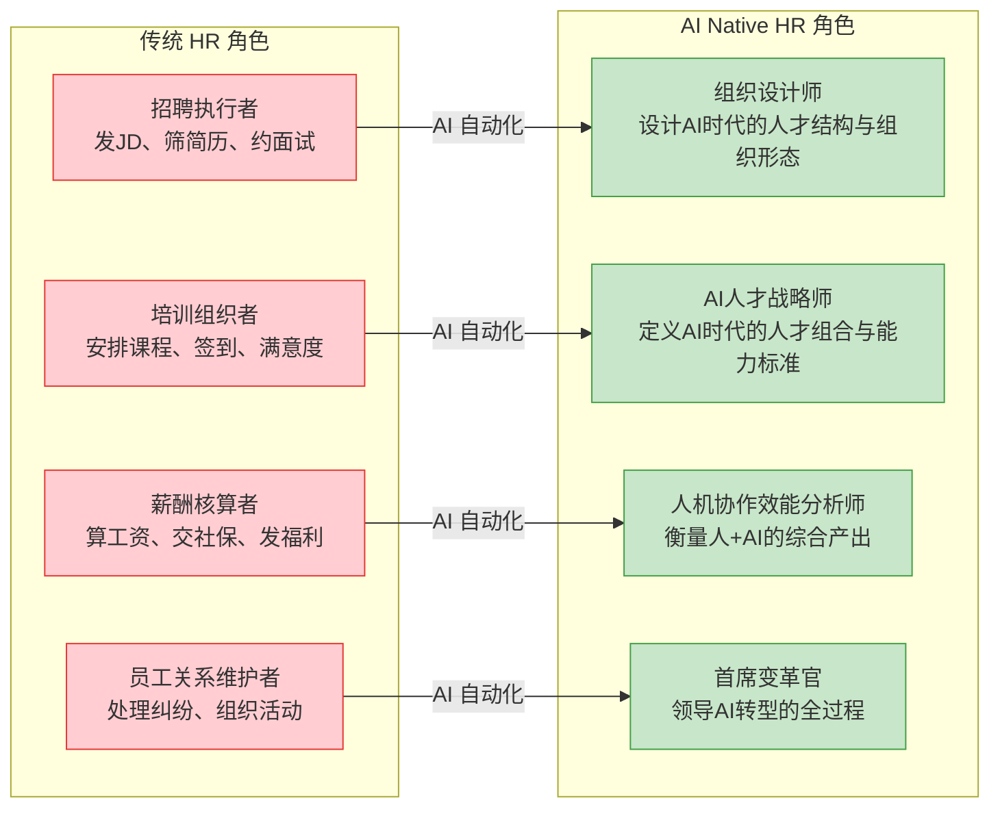
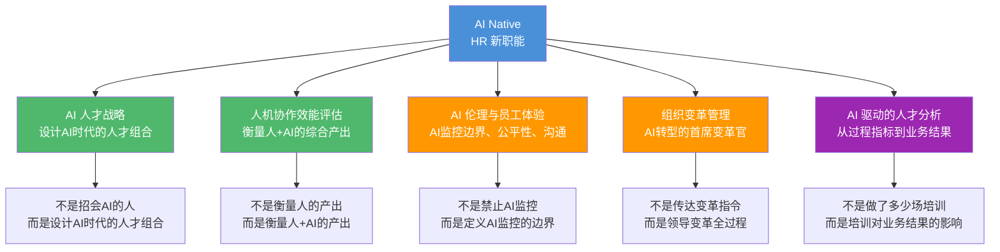
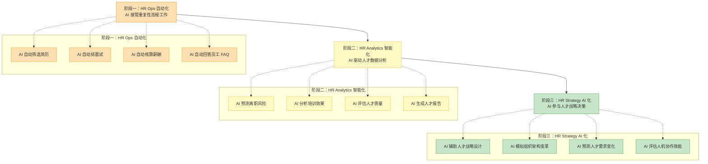
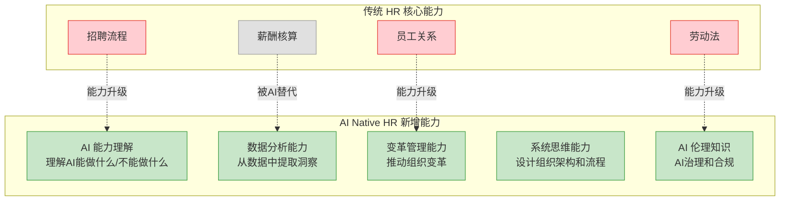
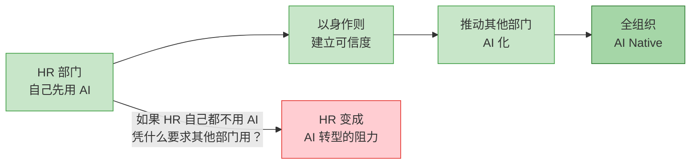

# HR部门在AI Native组织中的角色重塑

> [!important] 核心观点
> 在 AI Native 组织中，HR 部门从"流程执行者"变为"组织设计师"——不再是"做招聘、做培训、算工资"，而是**设计 AI 时代的人才组合、评估人机协作效能、推动组织变革**。

> [!abstract] 本章核心问题
> HR 部门如何从"流程执行者"变为"组织设计师"？HR 的新职能矩阵是什么？HR 自身的 AI 化路径是什么？

---

## 一、HR 角色的根本转变

> [!note] 关键转变
> 传统 HR 的 80% 工作（招聘执行、培训组织、薪酬核算、员工关系维护）都是**流程性工作**，可以被 AI 自动化。当这些工作被 AI 接管后，HR 释放出来的精力应该投向**更高价值的战略工作**——设计组织、设计人才战略、衡量人机效能、推动变革。

---

## 二、HR 的新职能矩阵

---

### 职能一：AI 人才战略

> [!note] 从"招会 AI 的人"到"设计 AI 时代的人才组合"
> 传统 HR 的人才战略是"找到符合岗位说明书的人"。AI Native HR 的人才战略是"设计什么样的人才组合，能最大化人与 AI 的协同效应"。

**核心工作**：
1. **定义 AI 时代的人才标准**：不再是"3 年 Java 经验"、"本科学历"，而是"AI 协作能力"、"系统性思维"、"学习敏锐度"
2. **设计人才组合**：一个团队中，需要多少"AI+业务复合型人才"？多少"深度领域专家"？多少"AI 技术专家"？比例如何搭配？
3. **重新定义岗位**：不是写"岗位说明书"，而是定义"能力单元"——这个角色需要什么能力？哪些能力由 AI 补充？哪些能力必须由人提供？
4. **AI 驱动的招聘**：AI 自动筛选、AI 初面、AI 能力评估——人只做最终判断

> [!tip] 关联
> 关于 AI 时代的人才能力标准，详见 [[02-AI趋势与素养/AI时代能力要求/00_MOC_AI时代能力要求中枢]] 知识库。特别是 [[02-AI趋势与素养/AI时代能力要求/02_能力模型重构：从I型到T型到π型到梳型]] 和 [[02-AI趋势与素养/AI时代能力要求/05_AI素养：新时代的基础能力]]。

---

### 职能二：人机协作效能评估

> [!note] 从"衡量人的产出"到"衡量人+AI 的产出"
> 传统绩效管理衡量的是"这个人做了什么"。但在 AI Native 组织中，同一个人的产出很大程度上取决于"他和 AI 协作得怎么样"。

**核心工作**：
1. **设计人机协作效能指标**：不是"这个人写了多少代码"，而是"这个人和 AI 协作，产出了多少有效代码？质量如何？"
2. **识别"AI 协作能力强"的人才**：有些人天生擅长和 AI 协作，有些人则不然。HR 需要识别这两类人，并设计不同的培养路径
3. **重新定义"高绩效"**：一个只用 AI 30% 能力、产出 100 的人 vs 一个用了 AI 90% 能力、产出 500 的人——谁更值得奖励？
4. **AI 绩效的校准**：AI 的产出如何纳入绩效评估？AI 做得好，算谁的功劳？

> [!warning] 关键挑战
> 人机协作效能评估最大的挑战是**归因问题**——这个产出，多少是人的贡献？多少是 AI 的贡献？如果归因不清，可能导致"搭便车"（人靠 AI 撑业绩）或"打压 AI"（人怕 AI 抢功劳而不用 AI）。

**建议的归因框架**：

| 场景 | 人的贡献 | AI 的贡献 | 评估方式 |
|------|---------|----------|---------|
| 人主导，AI 辅助 | 70% | 30% | 评估人的决策质量和 AI 使用的有效性 |
| 人机协作共创 | 50% | 50% | 评估人+AI 的综合产出，以及人"引导 AI"的能力 |
| AI 主导，人监督 | 30% | 70% | 评估人"发现异常"的能力和"纠正 AI"的能力 |

---

### 职能三：AI 伦理与员工体验

> [!note] 从"禁止 AI 监控"到"定义 AI 监控的边界"
> AI 让组织拥有了前所未有的监控能力——AI 可以分析员工的工作效率、情绪状态、离职风险。但这也带来了严重的伦理问题。

**核心工作**：
1. **定义 AI 监控的边界**：什么可以监控（如工作效率）？什么不能监控（如私人聊天）？谁有权查看监控数据？
2. **确保 AI 评估的公平性**：AI 的绩效评估是否对某些群体有偏见？AI 的晋升推荐是否公平？
3. **AI 替代的沟通**：当 AI 替代了某些岗位，如何与员工沟通？如何提供转岗和培训机会？
4. **AI 时代的员工体验设计**：员工如何感知"AI 在组织中的角色"？是"AI 在帮我"还是"AI 在监视我"？

> [!warning] 紧迫性
> 2024 年，某大型科技公司因使用 AI 监控员工工作效率而引发大规模抗议，最终被迫取消。AI 监控不是"能不能用"的问题，而是"怎么用才不伤害员工信任"的问题。HR 需要走在前面，定义规则，而不是等出了问题再补救。

---

### 职能四：组织变革管理

> [!note] 从"传达变革指令"到"领导变革全过程"
> AI 转型不是"IT 部门的事"，而是"组织层面的变革"。HR 是天然的"首席变革官"——因为变革的核心是**人**，而 HR 是组织中最懂"人"的部门。

**核心工作**：
1. **变革沟通**：向员工解释"AI 转型是什么、为什么、对我意味着什么"
2. **变革培训**：设计 AI 素养培训、AI 工具培训、AI 协作培训
3. **变革阻力管理**：识别变革的阻力来源（中层管理者、老员工、特定部门），设计针对性的应对策略
4. **变革节奏管理**：不是"一刀切"，而是"渐进式"——从哪里开始、以什么速度推进、如何评估效果

> [!tip] 关联
> 关于变革的阻力和路径，详见 [[02-AI趋势与素养/AI Native组织变革/07_组织变革的阻力与路径]]。关于培训体系设计，详见 [[03-HR人事/培训与人才发展/培训与人才发展_知识库建设方案]] 知识库。

---

### 职能五：AI 驱动的人才分析

> [!note] 从"做了多少场培训"到"培训对业务结果的影响"
> 传统 HR 的衡量指标是**过程指标**——招聘了多少人、做了多少场培训、员工满意度多少。AI Native HR 的衡量指标是**业务结果**——人才质量对业务增长的影响、培训对员工产出的提升、员工体验对留任率的影响。

**核心工作**：
1. **建立人才分析数据平台**：整合招聘、培训、绩效、离职等数据，建立统一的人才分析视图
2. **AI 驱动的人才预测**：预测哪些员工有离职风险、哪些团队的效能即将下降、哪些人才缺口即将出现
3. **从"描述性分析"到"预测性分析"到"处方性分析"**：
   - 描述性：发生了什么？（如"上季度离职率 15%"）
   - 预测性：将要发生什么？（如"下季度离职率预计上升到 18%"）
   - 处方性：应该做什么？（如"建议给以下 20 名高风险员工提供留任方案"）

---

## 三、HR 自身的 AI 化路径

### 阶段一：HR Ops 自动化（当前）

**目标**：AI 接管 HR 的重复性流程工作，释放 HR 的精力。

**具体行动**：
- 部署 AI 招聘系统：自动筛选简历、自动初面、自动评估
- 部署 AI 薪酬系统：自动核算、自动发放、自动报税
- 部署 AI 员工服务：自动回答 HR 政策、请假流程、福利查询等 FAQ
- 部署 AI 培训管理：自动排课、自动签到、自动收集满意度

**关键指标**：HR 流程工作耗时减少 50%+

---

### 阶段二：HR Analytics 智能化（6-12 个月）

**目标**：AI 驱动人才数据分析，从"凭感觉管人"到"数据驱动管人"。

**具体行动**：
- 建立统一的人才数据平台
- 部署 AI 离职预测系统
- 部署 AI 培训效果分析系统
- 部署 AI 人才质量评估系统

**关键指标**：人才分析报告生成时间从"周"到"小时"

---

### 阶段三：HR Strategy AI 化（12-24 个月）

**目标**：AI 参与人才战略决策，HR 成为真正的"组织设计师"。

**具体行动**：
- AI 辅助人才战略设计：基于业务战略，AI 推荐人才组合方案
- AI 模拟组织架构变革：在组织架构调整前，AI 模拟调整后的影响
- AI 预测人才需求变化：基于业务增长预测，AI 预测未来 12 个月的人才缺口
- AI 评估人机协作效能：AI 持续分析"人+AI"的综合产出，发现问题并推荐改进方案

**关键指标**：HR 战略决策的"数据支持度"从 30% 提升到 80%

---

## 四、HR 角色转型的能力要求

> [!important] 能力升级路径
> 传统 HR 的核心能力（招聘流程、劳动法、薪酬核算、员工关系）中，**薪酬核算会被 AI 替代**，**其他三项需要升级**——招聘流程升级为"AI 人才战略"，劳动法升级为"AI 伦理知识"，员工关系升级为"变革管理能力"。

---

## 五、HR 的自我革命：先 AI 化自己

> [!tip] 实践建议
> HR 部门应该成为组织内**第一个全面 AI 化的部门**。当 HR 自己用 AI 做招聘、用 AI 做培训分析、用 AI 做绩效评估，其他部门才会相信"AI 真的有用"。如果 HR 自己都不用 AI，却要求其他部门用 AI，那 AI 转型就变成了"上层的口号"。

---

## 本章小结

> [!abstract] 核心要点
> 1. HR 从"流程执行者"变为"组织设计师"——传统 HR 的 80% 工作可以被 AI 自动化
> 2. HR 的五大新职能：AI 人才战略、人机协作效能评估、AI 伦理与员工体验、组织变革管理、AI 驱动的人才分析
> 3. HR 自身的 AI 化路径：HR Ops 自动化 → HR Analytics 智能化 → HR Strategy AI 化
> 4. HR 需要新增五项核心能力：AI 能力理解、数据分析、变革管理、系统思维、AI 伦理
> 5. HR 部门应该成为组织内第一个全面 AI 化的部门——以身作则，建立可信度

> [!question] 思考题
> 如果你是一个 HR 从业者，你今天的日常工作中有多少是"流程性工作"（可以被 AI 替代）？如果这些工作被 AI 接管了，你会把释放出来的时间花在哪些"战略工作"上？

---

## 关联文档

- [[02-AI趋势与素养/AI Native组织变革/01_什么是AI Native组织]] —— 回顾 AI Native 组织的定义和五特征
- [[02-AI趋势与素养/AI Native组织变革/03_新角色与新岗位：AI时代组织里会出现什么]] —— 了解 HR 需要招聘和培养的新岗位
- [[02-AI趋势与素养/AI Native组织变革/07_组织变革的阻力与路径]] —— 了解 HR 作为"首席变革官"需要掌握的变革管理方法
- [[03-HR人事/培训与人才发展/培训与人才发展_知识库建设方案]] —— 结合培训体系设计，将 AI Native 人才需求转化为可落地的培训方案
- [[02-AI趋势与素养/AI时代能力要求/00_MOC_AI时代能力要求中枢]] —— 理解 AI 时代的人才能力标准，为 AI 人才战略提供基础