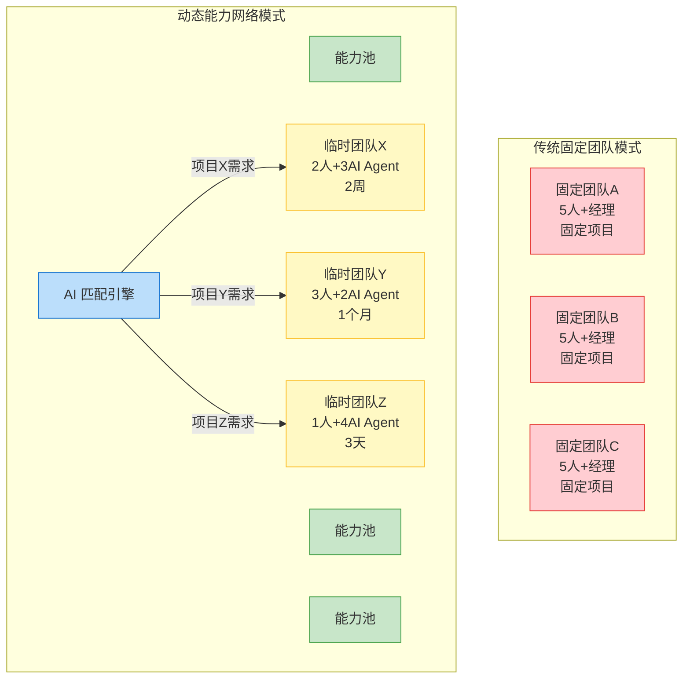
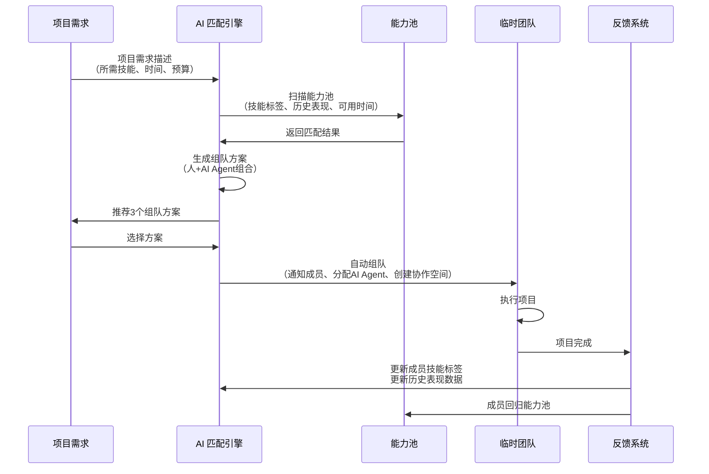
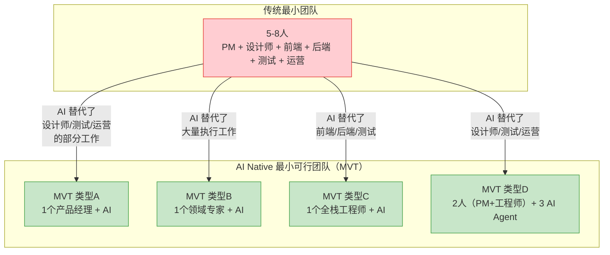
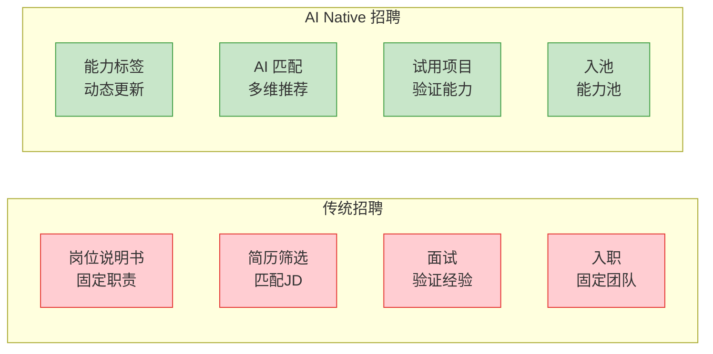
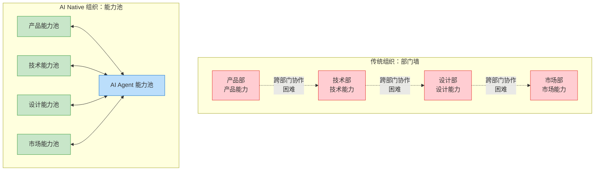
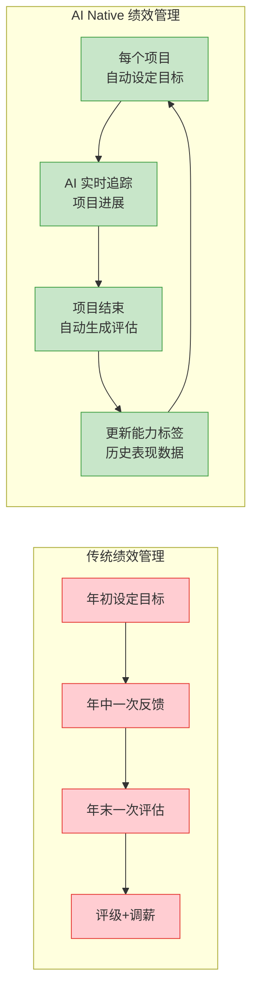

# 团队结构变革：从固定团队到动态能力网络

> [!important] 核心观点
> 在 AI Native 组织中，团队不再是"固定编制 + 固定岗位"，而是**动态能力网络**——AI 根据项目需求，从组织的能力池中自动匹配最合适的人和 AI Agent，组成临时团队，任务完成后团队解散，成员回归能力池。

> [!abstract] 本章核心问题
> 团队如何从固定编制变为动态能力网络？最小可行团队（MVT）是什么？AI 如何匹配人才与项目？HR 如何适应这种变化？

---

## 一、从固定团队到动态能力网络的演进

> [!note] 关键变化
> 传统团队模式的核心假设是"人需要稳定的团队归属感"和"项目是长期的"。但在 AI Native 组织中，这两个假设都被打破了：
> 1. **项目越来越短**：AI 使项目周期大幅缩短，一个项目可能只需要 3 天到 2 周
> 2. **"归属感"的形式变了**：人们不再需要"归属于一个固定团队"，而是"归属于一个能力池/社区"，在社区中建立关系和信任

---

## 二、动态能力网络的运作流程

### 三大核心机制

#### 机制一：AI 匹配人才与项目

> [!note] 如何匹配
> AI 匹配引擎基于以下维度自动推荐团队成员：
> 1. **技能标签**：成员具备什么技能（如"Python 后端开发"、"用户体验设计"、"AI 产品管理"）
> 2. **历史表现**：成员在类似项目中的表现评分（数据来源：过往项目的反馈）
> 3. **兴趣偏好**：成员对什么类型的项目感兴趣（由成员自己标注）
> 4. **可用时间**：成员当前是否在项目中，预计何时释放
> 5. **协作兼容性**：成员与潜在队友的合作历史评分
> 6. **AI Agent 能力补全**：哪些 AI Agent 可以补充团队的能力缺口

**与传统的区别**：
- 传统：HR/经理根据"谁有空"和"谁关系好"分配，主观性强
- AI Native：AI 根据多维数据自动推荐，客观性强，且能发现"没想到的人选"

---

#### 机制二：AI 协调跨团队协作

> [!note] 如何协调
> AI 协调系统自动完成以下工作：
> 1. **自动同步进度**：每个临时团队的工作进度自动同步到 AI 协调平台
> 2. **识别冲突**：AI 自动检测到"团队 A 和团队 B 在做重复的工作"或"团队 A 的产出依赖团队 B 的产出，但团队 B 延迟了"
> 3. **推荐协作时机**：AI 检测到"团队 A 遇到的问题，团队 B 在上个月解决过类似问题"，自动推荐双方沟通
> 4. **自动升级**：当 AI 无法自动协调时，将问题升级给人类决策节点

---

#### 机制三：AI 追踪团队效能

> [!note] 如何追踪
> AI 效能追踪系统不是"监督"，而是"发现问题并提供改进建议"：
> 1. **效能指标**：产出速度、质量评分、协作频率、AI Agent 利用率
> 2. **异常检测**：AI 自动识别"这个团队的产出速度比同类项目慢 30%，可能遇到了瓶颈"
> 3. **改进建议**：AI 推荐"建议团队增加一个 AI Agent 做代码审查，能够减少 20% 的返工"

> [!warning] 关键原则
> AI 追踪团队效能的目的是**帮助团队发现问题**，而不是**监控员工**。如果团队成员觉得 AI 是"监工"，他们就会对抗 AI 追踪系统。因此，AI 追踪的数据应该**仅对团队内部可见**，用于自我改进，而非用于上级考核。

---

## 三、最小可行团队（MVT）

> [!important] MVT 的概念
> **最小可行团队（Minimum Viable Team, MVT）**：完成一个项目所需的最小人+AI 组合。在 AI Native 组织中，一个 MVT 可能只有 1-2 个人，加上多个 AI Agent——因为 AI 承担了传统团队中设计、测试、运营、数据分析等角色的大部分工作。

### MVT 能做什么？

| MVT 类型 | 人员配置 | AI Agent 配置 | 能做什么 |
|---------|---------|-------------|---------|
| 类型 A | 1 个产品经理 | AI 设计、AI 开发、AI 测试、AI 数据分析 | 从需求到上线的完整产品，MVP 版 |
| 类型 B | 1 个领域专家 | AI 研究、AI 写作、AI 数据分析、AI 可视化 | 深度研究报告、行业分析、策略文档 |
| 类型 C | 1 个全栈工程师 | AI 代码生成、AI 代码审查、AI 测试、AI 部署 | 复杂技术产品，生产级质量 |
| 类型 D | 1 PM + 1 工程师 | AI 设计、AI 测试、AI 运营 | 中型产品，完整功能迭代 |

> [!tip] 思维实验
> 如果你的团队现在有 8 个人，如果给每个人配 3 个 AI Agent，你能用 3 个人完成同样的工作吗？如果能，剩下的 5 个人可以做什么？——这就是 MVT 思维的价值。

---

## 四、对 HR 的启示

### 启示一：招聘不再看"岗位说明书"，而是看"能力组合"

> [!note] 关键转变
> 传统招聘的核心是"找到一个人来填一个坑"（岗位说明书 → 招人 → 入岗）。AI Native 招聘的核心是"找到一个人来丰富能力池"（能力标签 → 招人 → 入池）。因为团队是动态的，所以不需要"填坑"，而是需要"丰富能力池"。

---

### 启示二：组织不再是"部门墙"，而是"能力池"

> [!important] 思维转变
> 在传统组织中，部门是"人的归属"——产品部的人做产品的事，技术部的人做技术的事。在 AI Native 组织中，能力池是"能力的归属"——人可以同时属于多个能力池，也可以在不同项目间流动。AI Agent 能力池作为"通用能力底座"，为所有人类能力池提供支撑。

---

### 启示三：绩效管理从"年度评估"到"持续反馈"

> [!note] 从年度到项目级
> 在动态能力网络中，一个人一年可能参与 10-20 个项目。传统的"年度评估"完全无法捕捉这种动态表现。取而代之的是"每个项目结束后的自动评估"——AI 收集项目中的表现数据，生成评估报告，更新能力标签。

---

## 五、动态能力网络对个人的影响

> [!tip] 好处
> 1. **更多样的项目经验**：不再是"一个项目做一年"，而是"一年做十个不同类型的项目"
> 2. **更精准的能力成长**：AI 根据你的能力标签，推荐最匹配的项目，帮助你补强短板
> 3. **更透明的价值体现**：你的表现数据（来自每个项目的评估）是公开的，不需要"和领导搞好关系"
> 4. **更多自主权**：你可以选择感兴趣的项目，而不是被分配

> [!warning] 挑战
> 1. **不确定性**：每个项目结束后，你可能需要重新"找项目"，像自由职业者一样
> 2. **关系建立困难**：没有固定的团队，难以建立深度的工作关系
> 3. **能力标签的压力**：你需要持续维护和更新自己的能力标签，否则可能被 AI 匹配引擎"遗忘"
> 4. **心理安全感**：不断换团队，你可能缺乏"归属感"

> [!important] 组织的应对
> 动态能力网络不是"让人变成自由职业者"，而是"让人在稳定的社区中流动"。组织需要建立：
> 1. **能力池社区**：定期举办社区活动，让同一能力池的人建立关系
> 2. **导师机制**：每个能力池有资深导师，为成员提供职业发展指导
> 3. **心理安全感保障**：即使项目失败，也不影响成员的能力标签和参与新项目的机会

---

## 本章小结

> [!abstract] 核心要点
> 1. 团队从"固定团队"演进为"动态能力网络"——AI 匹配引擎根据项目需求自动组队
> 2. 最小可行团队（MVT）可能只有 1-2 个人 + 多个 AI Agent
> 3. AI 在动态能力网络中承担三大职能：匹配人才与项目、协调跨团队协作、追踪团队效能
> 4. HR 需要从"岗位说明书"思维转向"能力标签"思维，从"部门墙"转向"能力池"
> 5. 动态能力网络对个人既是机遇（更多样、更自主）也是挑战（不确定性、关系建立困难）

> [!question] 思考题
> 如果你的组织明天开始实施动态能力网络，你最大的顾虑是什么？是"找不到合适的项目"？还是"无法建立深度的工作关系"？还是"担心能力标签不够好"？

---

## 关联文档

- [[02-AI趋势与素养/AI Native组织变革/02_组织架构变革：从金字塔到神经网络]] —— 动态能力网络是神经网络式架构的团队层实现
- [[02-AI趋势与素养/AI Native组织变革/01_什么是AI Native组织]] —— 回顾"人机混合团队"和"持续实验文化"两个特征
- [[02-AI趋势与素养/AI Native组织变革/05_HR部门在AI Native组织中的角色重塑]] —— 理解 HR 如何支持动态能力网络的运作
- [[02-AI趋势与素养/人机协作阶段演进/00_MOC_人机协作阶段演进中枢]] —— 动态能力网络中的人机协作，对应协作演进的阶段三到阶段五
- [[02-AI趋势与素养/AI Native组织变革/03_新角色与新岗位：AI时代组织里会出现什么]] —— 动态能力网络中的新岗位如"人机协作设计师"