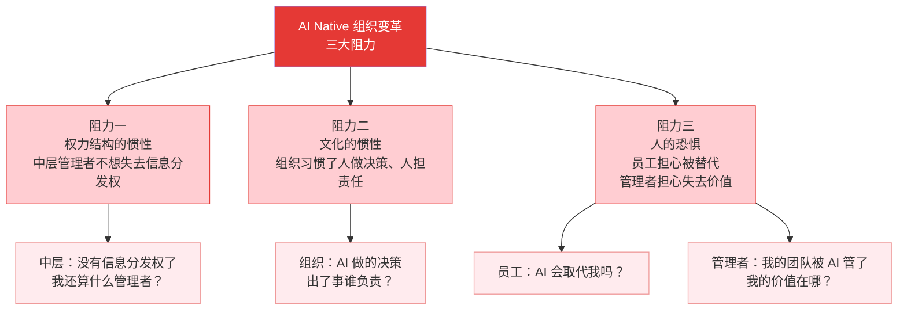
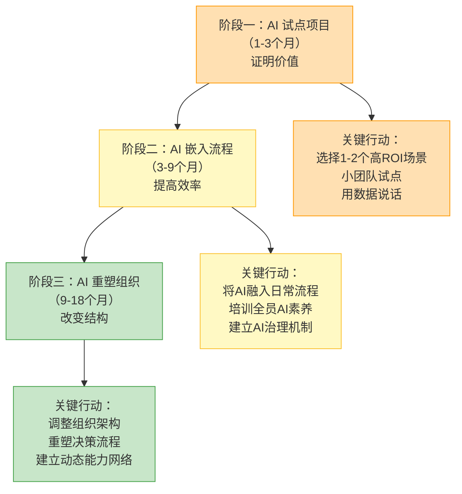
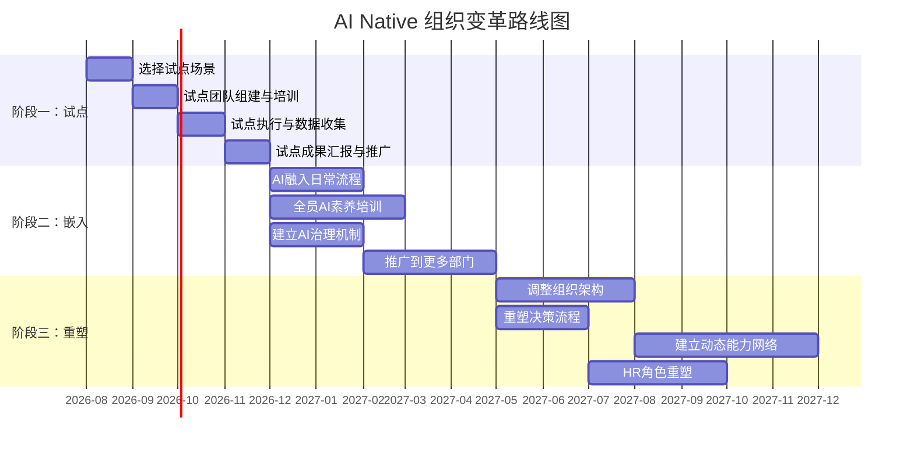
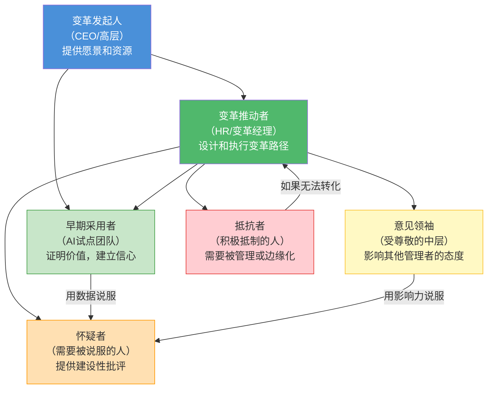

# 组织变革的阻力与路径

> [!important] 核心观点
> AI Native 组织变革的最大挑战不是技术，而是**人**——权力结构的惯性、文化的惯性、人的恐惧。理解这些阻力，并设计正确的变革路径，比选择哪款 AI 工具重要 100 倍。

> [!abstract] 本章核心问题
> 变革会遇到哪些阻力？如何设计渐进式变革路径？如何避免常见的变革陷阱？

---

## 一、变革的三大阻力

---

### 阻力一：权力结构的惯性

> [!danger] 核心矛盾
> 中层管理者的权力基础之一是**信息分发权**——他知道上级的想法，也知道下级的执行情况，他决定什么信息往上传递、什么信息往下传达。AI 扁平化了信息流，中层管理者失去了这个权力基础。

**典型表现**：
- 中层管理者表面上支持 AI 转型，但实际工作中抵制 AI 工具的使用
- "AI 的分析我看了，但我觉得还是应该按我的经验来"
- "AI 的进度追踪不准确，还是我来手动追踪靠谱"
- 中层管理者在 AI 系统之外建立"影子信息流"——继续通过邮件、会议、私聊传递信息，架空 AI 信息中枢

**深层原因**：
- 不是"不理解 AI 的价值"，而是"A I 威胁了他们的权力地位"
- 中层管理者需要回答"如果 AI 替代了我的信息传递职能，我还有什么价值？"

---

### 阻力二：文化的惯性

> [!danger] 核心矛盾
> 组织长期以来习惯了"人做决策、人担责任"的文化。当 AI 开始做决策时，组织面临一个根本性的文化冲突：**"AI 做的决策，出了事谁负责？"**

**典型表现**：
- "AI 建议的方案，我们可以参考，但最终还是得人拍板"（AI 的决策被降级为"建议"）
- "AI 拒绝了这笔贷款，但我觉得应该批准，我就人工批准了"（人架空 AI 的决策）
- "AI 监测到项目风险，但风险防控是人的责任，AI 说的不算"（AI 的预警被忽视）
- 出了问题时，"是 AI 的错"——AI 变成了"替罪羊"

**深层原因**：
- 组织的"责任文化"建立在"人做决策，人担责任"的基础上
- AI 引入后，责任边界模糊了——"AI 说要做 A，我说要做 B，最后按 B 做了，出问题了，是我负责还是 AI 负责？"
- 组织缺乏"AI 决策的责任矩阵"——谁为 AI 的决策负责？

---

### 阻力三：人的恐惧

> [!danger] 核心矛盾
> AI 转型触发了两个层面的恐惧：一线员工的"被替代恐惧"和一线管理者的"失去价值恐惧"。

**员工的恐惧**：
- "AI 能写代码了，我还能做什么？"
- "AI 能写文案了，我还能做什么？"
- "AI 能分析数据了，我还能做什么？"

**管理者的恐惧**：
- "AI 能追踪进度了，我还需要每天看日报吗？"
- "AI 能分配资源了，我还需要协调吗？"
- "AI 能评估绩效了，我的评价还有价值吗？"

**恐惧的传染性**：
- 恐惧不是理性的——即使数据证明"AI 不会取代你，只会让你更强大"，恐惧仍然存在
- 恐惧会传染——一个人的恐惧会影响整个团队的氛围
- 恐惧会导致"消极抵抗"——表面上配合，实际上不用 AI、不信任 AI

---

## 二、三种错误的变革方式

```mermaid
graph TB
    subgraph "错误方式一：技术先行"
        E1["买一堆 AI 工具"] --> E2["组织架构不变"]
        E2 --> E3["决策流程不变"]
        E3 --> E4["AI 沦为摆设"]
    end
    
    subgraph "错误方式二：一刀切"
        F1["要求所有部门<br/>同时 AI 化"] --> F2["没有试点<br/>没有验证"]
        F2 --> F3["混乱和抵触"]
        F3 --> F4["变革失败"]
    end
    
    subgraph "错误方式三：口号式"
        G1["领导喊<br/>'我们要 AI 化'"] --> G2["没有具体路径"]
        G2 --> G3["没有资源投入"]
        G3 --> G4["员工当成<br/>'又一个口号'"]
    end
    
    style E1 fill:#FFCDD2,stroke:#E53935
    style E2 fill:#FFCDD2,stroke:#E53935
    style E3 fill:#FFCDD2,stroke:#E53935
    style E4 fill:#FFCDD2,stroke:#E53935
    style F1 fill:#FFCDD2,stroke:#E53935
    style F2 fill:#FFCDD2,stroke:#E53935
    style F3 fill:#FFCDD2,stroke:#E53935
    style F4 fill:#FFCDD2,stroke:#E53935
    style G1 fill:#FFCDD2,stroke:#E53935
    style G2 fill:#FFCDD2,stroke:#E53935
    style G3 fill:#FFCDD2,stroke:#E53935
    style G4 fill:#FFCDD2,stroke:#E53935
```

### 错误方式一：技术先行

> [!danger] 症状
> 组织买了一堆 AI 工具（ChatGPT 企业版、AI 客服、AI 招聘、AI 数据分析...），但组织架构、决策流程、人才结构完全不变。AI 变成了"可以用的工具"，但没有人真正用——因为用了 AI 不会改变任何结果。

**为什么失败**：
- 员工没有动力用 AI——"用了 AI，我的工作还是这些，还要多学一个工具"
- 中层管理者没有动力推 AI——"AI 不会帮我升职加薪，还威胁我的地位"
- 决策流程不变——AI 的分析再好，也要经过层层审批，AI 的速度优势完全被浪费

---

### 错误方式二：一刀切

> [!danger] 症状
> 领导要求所有部门在 3 个月内全面 AI 化——所有部门都要用 AI 工具、所有流程都要 AI 化。没有试点、没有验证、没有缓冲。

**为什么失败**：
- 不是所有部门都适合 AI 化——AI 在客服、营销、数据分析等场景效果好，但在战略决策、创意设计等场景效果有限
- 不是所有员工都准备好了——有些人需要 3 个月学习 AI 工具，有些人需要 6 个月
- 一刀切会导致"为了 AI 化而 AI 化"——部门为了应付检查，表面上用 AI，实际上 AI 的产出没人用

---

### 错误方式三：口号式

> [!danger] 症状
> 领导在各种场合喊"我们要 AI 化"、"AI 是未来"、"不 AI 化就淘汰"，但没有具体的路径规划、没有资源投入、没有考核机制。

**为什么失败**：
- 员工不知道"AI 化"具体意味着什么——"我需要做什么？学了 AI 对我有什么好处？"
- 没有资源投入——"领导说要用 AI，但没给我买 AI 工具的预算"
- 没有考核机制——"AI 化做得好不好，不影响我的绩效，我为什么要做？"
- 口号喊多了，员工产生"口号疲劳"——"又是新一轮口号，过几个月就没人提了"

---

## 三、渐进式变革路径

---

### 阶段一：AI 试点项目（1-3 个月）

> [!tip] 目标：证明价值，建立信心

**选择试点场景的原则**：
1. **高 ROI**：AI 能带来明显的效率提升或成本降低，效果可量化
2. **低风险**：即使 AI 出错，也不会造成严重后果
3. **可复制**：试点的经验可以推广到其他场景
4. **自愿参与**：选择对 AI 有热情的团队，而不是"被迫"的团队

**推荐试点场景**：
- 客服：AI 自动回答常见问题，ROI 清晰（响应时间缩短、人力成本降低）
- 数据分析：AI 自动生成周报/月报，替代人工 Excel 操作
- 内容生成：AI 辅助撰写营销文案、产品描述
- 招聘：AI 初筛简历，缩短招聘周期

**关键行动**：
- 设定明确的成功指标（如"客服响应时间从 2 小时降到 5 分钟"）
- 每周汇报试点成果，用数据说话
- 让试点团队成为"AI 布道者"，在组织内分享经验

> [!warning] 常见陷阱
> 试点项目选择了一个"AI 不擅长"的场景（如需要深度行业知识的法律审查），导致试点失败，打击组织对 AI 的信心。**选对场景是试点成功的关键。**

---

### 阶段二：AI 嵌入流程（3-9 个月）

> [!tip] 目标：从"试点"到"日常"，AI 成为工作方式的一部分

**关键行动**：
1. **将 AI 融入日常流程**：
   - 不是"额外使用 AI 工具"，而是"AI 工具嵌入到现有工作流中"
   - 例如：CRM 中嵌入 AI 销售建议、项目管理工具中嵌入 AI 进度追踪
2. **培训全员 AI 素养**：
   - 不是"教大家用 ChatGPT"，而是"教大家如何与 AI 协作"
   - 培训内容包括：AI 能做什么/不能做什么、如何给 AI 清晰指令、如何评估 AI 的输出质量
   - 关联 [[03-HR人事/培训与人才发展/培训与人才发展_知识库建设方案]] 中的 [[03-HR人事/培训与人才发展/06-前沿趋势/19_AI在培训中的应用]]
3. **建立 AI 治理机制**：
   - AI 使用的边界（什么数据可以给 AI、什么不可以）
   - AI 决策的审核机制（AI 的决策谁负责审核）
   - AI 输出的质量标准（什么样的 AI 输出可以被直接使用）

**关键指标**：
- AI 工具的使用率（日活用户数/总用户数）
- AI 节省的时间（每个流程的 AI 替代率）
- AI 输出的质量（AI 输出被直接使用的比例）

---

### 阶段三：AI 重塑组织（9-18 个月）

> [!tip] 目标：从"工具层面"到"组织层面"，进行结构性变革

**关键行动**：
1. **调整组织架构**：
   - 从科层制向神经网络式转型（详见 [[02-AI趋势与素养/AI Native组织变革/02_组织架构变革：从金字塔到神经网络]]）
   - 中层管理者的角色转型——从"信息传递者"到"决策者+教练"
2. **重塑决策流程**：
   - 实施 AI 决策边界框架（详见 [[02-AI趋势与素养/AI Native组织变革/04_决策机制变革：AI如何改变组织决策]]）
   - 定义"什么决策 AI 自主做、什么决策 AI 提案人审批、什么决策人做 AI 辅助"
3. **建立动态能力网络**：
   - 从"固定团队"到"能力池+AI 匹配"（详见 [[02-AI趋势与素养/AI Native组织变革/06_团队结构变革：从固定团队到动态能力网络]]）
   - 建立最小可行团队（MVT）的运作模式
4. **重塑 HR 角色**：
   - HR 从"流程执行者"到"组织设计师"（详见 [[02-AI趋势与素养/AI Native组织变革/05_HR部门在AI Native组织中的角色重塑]]）

**关键指标**：
- 组织层级数量（从 5-7 层降到 2-3 层）
- 决策速度（从"天"到"小时"）
- 人机协作效能（人+AI 的综合产出 vs 纯人产出）

---

## 四、变革路线图总览

---

## 五、变革中的关键角色

> [!important] 变革中的角色策略
> 1. **变革发起人**：必须是一把手。AI Native 转型是组织基因层面的变革，没有一把手的坚定支持，不可能成功。
> 2. **变革推动者**：通常是 HR 负责人或专门的变革经理。负责设计变革路径、协调各方、管理变革节奏。
> 3. **早期采用者**：选择 1-2 个对 AI 有热情的团队做试点。让他们成为"AI 布道者"。
> 4. **意见领袖**：找到组织中受人尊敬的中层管理者，让他们成为 AI 转型的"代言人"——他们的态度会影响大批中层管理者。
> 5. **怀疑者**：不要试图"说服"他们，而是用"数据"和"早期采用者的成功案例"来影响他们。
> 6. **抵抗者**：如果积极抵制变革，需要明确边界——"你可以不参与，但不能阻碍他人参与"。如果持续抵制，可能需要让他们离开。

---

## 本章小结

> [!abstract] 核心要点
> 1. 变革的三大阻力：权力结构的惯性、文化的惯性、人的恐惧
> 2. 三种错误的变革方式：技术先行、一刀切、口号式
> 3. 渐进式变革路径：AI 试点（证明价值）→ AI 嵌入（提高效率）→ AI 重塑（改变结构）
> 4. 变革需要 18 个月的时间——不是"一个季度的事"
> 5. 变革中的关键角色：发起人、推动者、早期采用者、意见领袖、怀疑者、抵抗者

> [!question] 思考题
> 在你的组织中，最大的变革阻力是什么？是权力结构、文化惯性、还是人的恐惧？你有没有一个"变革发起人"（一把手）的坚定支持？如果没有，你打算如何获得？

---

## 关联文档

- [[02-AI趋势与素养/AI Native组织变革/02_组织架构变革：从金字塔到神经网络]] —— 了解变革的"目标架构"是什么样子的
- [[02-AI趋势与素养/AI Native组织变革/04_决策机制变革：AI如何改变组织决策]] —— 了解变革中的决策机制如何调整
- [[02-AI趋势与素养/AI Native组织变革/05_HR部门在AI Native组织中的角色重塑]] —— HR 作为"首席变革官"的角色和行动指南
- [[02-AI趋势与素养/AI Native组织变革/08_案例与推演：不同规模组织的AI Native路线图]] —— 不同规模组织的具体变革路径
- [[03-HR人事/培训与人才发展/培训与人才发展_知识库建设方案]] —— 变革中的培训体系设计，特别是 [[03-HR人事/培训与人才发展/06-前沿趋势/19_AI在培训中的应用]]