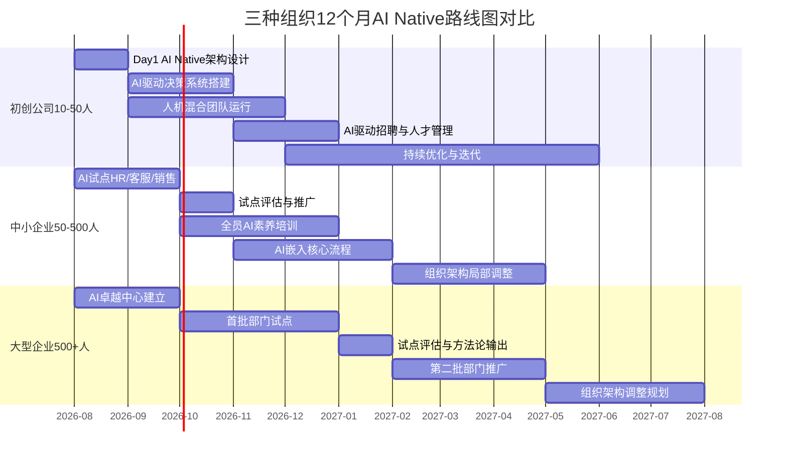
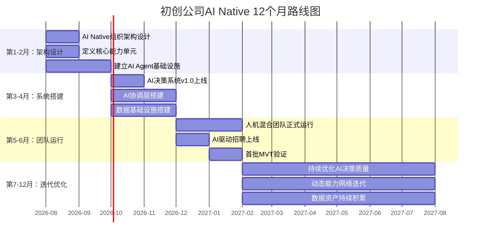
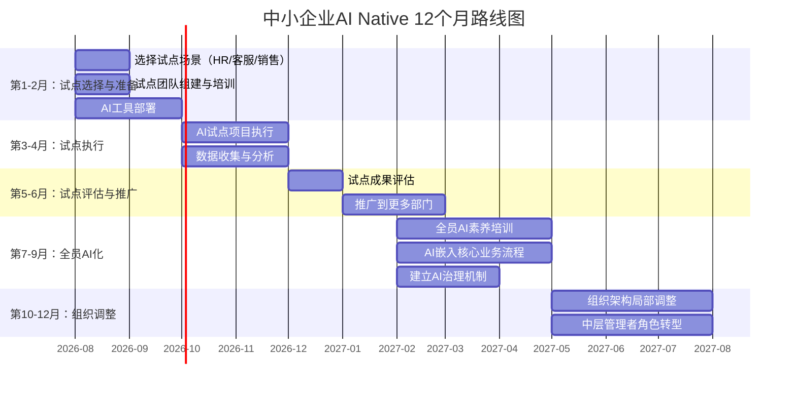
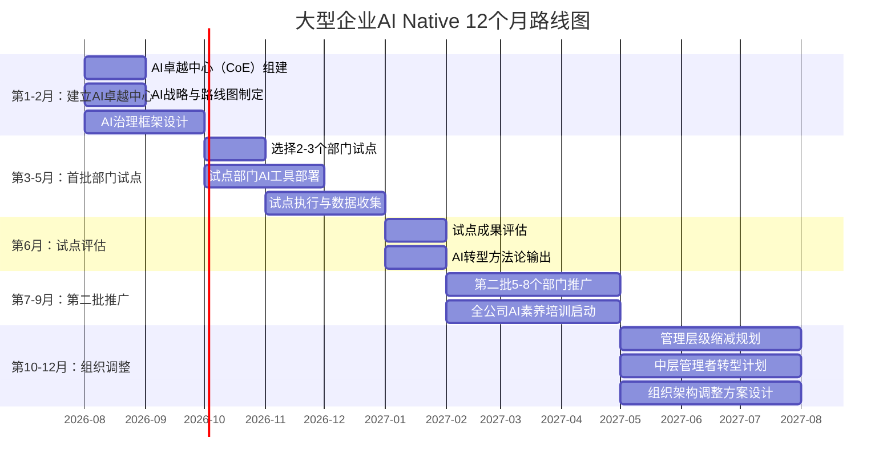

# 案例与推演：不同规模组织的AI Native路线图

> [!important] 核心观点
> 不同规模的组织，AI Native 转型的路径完全不同。初创公司可以从 Day 1 就 AI Native，中小企业在现有基础上逐步 AI 化，大型企业需要分阶段、分部门、有策略地推进。关键教训是：**不是"越大越难"，而是"越僵化越难"**。

> [!abstract] 本章核心问题
> 不同规模的组织如何落地 AI Native？初创公司、中小企业、大型企业各自的 12 个月路线图是什么？各自的成功指标和风险点是什么？

---

## 一、三种组织路线图总览

---

## 二、路线图一：初创公司（10-50 人）

> [!tip] 核心优势：从零开始，没有历史包袱

### 为什么初创公司最容易 AI Native

初创公司没有"既有组织架构"、"既有决策流程"、"既有权力结构"——这些都是大公司 AI Native 转型的最大障碍。初创公司可以做组织从 Day 1 就围绕 AI 来设计。

### 12 个月路线图

### 关键里程碑

| 时间 | 里程碑 | 具体行动 | 成功指标 |
|------|--------|---------|---------|
| **第 1 个月** | 组织架构设计完成 | 确定能力单元划分、定义 AI Agent 配置、设计信息流和决策流 | 架构文档完成，全员共识 |
| **第 2 个月** | AI 基础设施上线 | 部署 AI Agent 平台、数据平台、AI 协调层 | AI Agent 可被各能力单元调用 |
| **第 3 个月** | 人机混合团队运行 | 每个能力单元配置 1-3 个 AI Agent，开始日常工作 | AI Agent 日利用率 > 50% |
| **第 4 个月** | AI 驱动招聘上线 | 用 AI 自动筛选、AI 初面、AI 能力评估 | 招聘周期缩短 50% |
| **第 5 个月** | 首批 MVT 验证 | 用 1 人+AI 完成一个完整项目 | 1 人+AI 产出 = 传统 3 人团队产出 |
| **第 6 个月** | 数据资产初步形成 | 建立数据资产目录，AI 可访问所有业务数据 | 数据治理覆盖率 > 80% |
| **第 7-12 个月** | 持续优化迭代 | 根据运行数据优化 AI Agent 配置、调整能力单元、完善决策规则 | AI 决策准确率 > 95% |

### 预计投入

| 投入类别 | 预估金额（人民币） | 说明 |
|---------|------------------|------|
| AI 基础设施 | 10-30 万/年 | AI Agent 平台 + 数据平台 + API 调用费用 |
| 人才成本 | 薪资上浮 20-30% | 招聘"AI+业务"复合型人才，薪资高于市场平均水平 |
| 培训投入 | 5-10 万 | 团队 AI 素养培训、AI 协作培训 |
| **总计** | **15-40 万 + 薪资上浮** | 对于一个 10-50 人的初创公司，这是可承受的 |

### 风险点

> [!warning] 风险一：过度依赖 AI
> 初创公司可能过度依赖 AI，忽视了人的判断力。AI 是"加速器"，不是"方向盘"——战略方向仍然需要人来判断。

> [!warning] 风险二：AI 人才招聘困难
> 初创公司品牌力弱，难以吸引顶尖的"AI+业务"复合型人才。建议：用"AI Native 愿景"和"从零设计的自主权"来吸引人才，而非纯薪资。

> [!warning] 风险三：AI Agent 的可控性
> 初创公司资源有限，可能使用低成本的通用 AI 模型，而非针对业务场景优化的专用模型。通用 AI 在特定业务场景下可能表现不佳。

---

## 三、路线图二：中小企业（50-500 人）

> [!tip] 核心优势：有业务基础，可以验证 AI 的实际价值

### 为什么中小企业需要"在现有基础上 AI 化"

中小企业已经有一定的业务规模和组织架构，不能"推倒重来"。但规模不大，变革的灵活性高于大企业。最佳路径是：**先做 AI 试点，证明价值后再逐步推广**。

### 12 个月路线图

### 关键里程碑

| 时间 | 里程碑 | 具体行动 | 成功指标 |
|------|--------|---------|---------|
| **第 1 个月** | 试点场景确定 | 选择 HR（招聘/培训）、客服、销售中的 1-2 个场景 | 试点方案获得 CEO 批准 |
| **第 2 个月** | AI 工具部署完成 | 在试点场景部署 AI 工具 | 试点团队开始使用 AI |
| **第 3-4 个月** | 试点执行 | 试点团队在日常工作中使用 AI | AI 使用率 > 60% |
| **第 5 个月** | 试点成果评估 | 用数据证明 AI 的 ROI（效率提升、成本降低） | ROI > 200%（投入 1 元，节省 2 元） |
| **第 6 个月** | 推广到 3-5 个部门 | 将成功经验复制到更多部门 | 3-5 个部门开始使用 AI |
| **第 7-9 个月** | 全员 AI 素养培训 | 全员培训 AI 协作能力 | 培训覆盖率 > 90% |
| **第 10-12 个月** | 组织架构局部调整 | 减少管理层级、建立 AI 协调层、中层角色转型 | 管理层级减少 1-2 层 |

### 预计投入

| 投入类别 | 预估金额（人民币） | 说明 |
|---------|------------------|------|
| AI 工具采购 | 20-50 万/年 | 根据 50-500 人规模，每人 500-1000 元/年的 AI 工具预算 |
| 培训投入 | 10-30 万 | 全员 AI 素养培训 + 中层管理者转型培训 |
| 变革管理 | 5-15 万 | 外部顾问或内部变革经理 |
| 试点项目 | 5-10 万 | 试点团队的额外投入 |
| **总计** | **40-105 万/年** | 对于一个 50-500 人的企业，这是可承受的 |

### 风险点

> [!warning] 风险一：中层管理者抵制
> 中小企业通常有 3-5 层管理层级，AI 转型会直接威胁中层管理者的权力基础。需要提前做好沟通和培训。

> [!warning] 风险二：试点失败打击信心
> 如果试点选错了场景（AI 不擅长），试点失败会打击全组织对 AI 的信心，后续推动困难。选对试点场景至关重要。

> [!warning] 风险三：数据基础薄弱
> 中小企业通常数据治理不完善，AI 可能因为数据质量差而表现不佳。在 AI 试点前，需要先做基础的数据治理。

---

## 四、路线图三：大型企业（500+ 人）

> [!tip] 核心挑战：规模大、层级多、惯性大

### 为什么大型企业需要"分阶段、分部门、有策略地推进"

大型企业的 AI Native 转型是最困难的——不是因为"大"，而是因为"僵化"。大型企业有复杂的组织架构、根深蒂固的权力结构、长期形成的文化和流程。**不能"一刀切"，必须"分阶段、分部门、有策略地推进"**。

### 12 个月路线图

### 关键里程碑

| 时间 | 里程碑 | 具体行动 | 成功指标 |
|------|--------|---------|---------|
| **第 1 个月** | AI 卓越中心（CoE）成立 | 组建 5-10 人的 AI CoE 团队（AI 技术专家 + AI 产品经理 + 变革管理专家） | CoE 团队就位，CEO 直接支持 |
| **第 2 个月** | AI 战略与路线图获批 | 制定 3 年 AI 转型战略 + 12 个月详细路线图 | 董事会/CEO 批准 |
| **第 3-5 个月** | 首批 2-3 个部门试点 | 选择 AI 最适用的部门（如客服、HR、数据分析） | 试点部门 AI 使用率 > 50% |
| **第 6 个月** | 试点评估 + 方法论输出 | 总结试点经验，形成可复制的方法论 | 方法论文档完成，ROI 数据清晰 |
| **第 7-9 个月** | 第二批 5-8 个部门推广 | 基于方法论，推广到更多部门 | 10+ 部门在使用 AI |
| **第 10-12 个月** | 组织架构调整规划 | 制定管理层级缩减、中层转型、组织架构调整方案 | 方案获得 CEO 批准 |

### 预计投入

| 投入类别 | 预估金额（人民币） | 说明 |
|---------|------------------|------|
| AI CoE 团队 | 200-500 万/年 | 5-10 人专业团队（含 AI 技术专家、AI 产品经理、变革管理专家） |
| AI 工具采购 | 100-500 万/年 | 根据 500+ 人规模，企业级 AI 平台 |
| 数据基础设施建设 | 100-500 万 | 统一数据平台、数据治理 |
| 培训投入 | 50-200 万 | 全员 AI 素养培训 + 中层转型培训 |
| 变革管理 | 50-150 万 | 外部咨询顾问 + 内部变革经理 |
| 试点项目 | 20-50 万 | 首批 2-3 个部门的试点投入 |
| **总计** | **520-1900 万/年** | 对于一个 500+ 人的企业，占总营收比例通常 < 1% |

### 风险点

> [!warning] 风险一：变革疲劳
> 大型企业通常经历过多次变革（数字化、敏捷化、中台化...），员工对"新一轮变革"已经疲劳。AI 转型需要与之前的变革区分——"这不是又一次数字化，而是组织基因的变革"。

> [!warning] 风险二：部门墙
> AI CoE 可能被其他部门视为"来抢地盘的"。AI CoE 需要定位为"赋能者"而非"管理者"——帮助各部门 AI 化，而不是接管各部门的工作。

> [!warning] 风险三：CEO 支持不持续
> 大型企业的 AI 转型需要 3-5 年，如果 CEO 在 1 年后离职或兴趣转移，AI 转型可能半途而废。需要将 AI 转型嵌入公司战略，而非绑定在某个 CEO 个人身上。

> [!warning] 风险四：数据孤岛
> 大型企业通常有多个独立的 IT 系统，数据孤岛严重。AI 需要统一的数据基础，而打通数据孤岛本身就是一个 6-12 个月的大工程。

---

## 五、三种组织的对比总结

| 维度 | 初创公司（10-50人） | 中小企业（50-500人） | 大型企业（500+人） |
|------|-------------------|---------------------|-------------------|
| **核心优势** | 无历史包袱，可从零设计 | 有业务基础，可验证 AI 价值 | 资源充足，可系统化推进 |
| **核心挑战** | AI 人才招聘困难 | 中层管理者抵制 | 规模大、层级多、惯性大 |
| **变革策略** | 从 Day 1 就 AI Native | 先试点，再推广 | 分阶段、分部门、有策略 |
| **12 个月目标** | 全面 AI Native 运行 | AI 嵌入核心流程，开始组织调整 | 完成试点+推广，开始组织调整规划 |
| **预计投入** | 15-40 万 + 薪资上浮 | 40-105 万 | 520-1900 万 |
| **关键成功因素** | 愿景吸引力 + AI 人才 | 试点 ROI 数据 + 中层沟通 | CEO 持续支持 + AI CoE 实力 |
| **最大风险** | 过度依赖 AI | 试点失败 | 变革疲劳 |

---

## 六、关键教训

> [!important] 不是"越大越难"，而是"越僵化越难"
> 一个 50 人的初创公司，如果创始团队已经习惯了"人治"（老板拍板、亲信执行），其 AI Native 转型可能比一个 500 人的"开放文化"企业更难。**核心变量不是"人数"，而是"组织僵化程度"**。

> [!important] AI 转型的 ROI 是可量化的
> 不要用"AI 是未来"这种模糊的理由来推动变革。用具体的 ROI 数据：
> - 客服：AI 自动回答，响应时间从 2 小时降到 5 分钟，人力成本降低 40%
> - 招聘：AI 初筛简历，招聘周期从 30 天降到 15 天，HR 效率提升 50%
> - 数据分析：AI 自动生成周报，从 4 小时/周降到 10 分钟/周

> [!important] 变革需要时间，不要急于求成
> 12 个月只是一个"起步"的时间。真正的 AI Native 组织变革需要 3-5 年。12 个月的目标是"建立信心、证明价值、开始改变"——而不是"完成变革"。

> [!important] 人是变革的核心
> 无论什么规模的组织，AI Native 变革的核心挑战都是"人"——而不是"技术"。技术可以买，但人的心态、文化、权力结构需要时间和策略来改变。详见 [[02-AI趋势与素养/AI Native组织变革/07_组织变革的阻力与路径]]。

---

## 本章小结

> [!abstract] 核心要点
> 1. 初创公司（10-50人）：从 Day 1 就 AI Native，优势是无历史包袱，挑战是 AI 人才招聘
> 2. 中小企业（50-500人）：先试点再推广，优势是有业务基础可验证价值，挑战是中层管理者抵制
> 3. 大型企业（500+人）：分阶段、分部门、有策略推进，优势是资源充足，挑战是组织僵化
> 4. 核心教训：不是"越大越难"，而是"越僵化越难"
> 5. 12 个月只是"起步"时间，真正的 AI Native 变革需要 3-5 年

> [!question] 思考题
> 你的组织属于哪种规模？你目前处于 AI Native 变革的哪个阶段？如果让你制定一个 12 个月路线图，你最优先的 3 个行动是什么？

---

## 关联文档

- [[02-AI趋势与素养/AI Native组织变革/07_组织变革的阻力与路径]] —— 理解变革的阻力和应对策略，是所有路线图的基础
- [[02-AI趋势与素养/AI Native组织变革/02_组织架构变革：从金字塔到神经网络]] —— 了解变革的"目标架构"
- [[02-AI趋势与素养/AI Native组织变革/04_决策机制变革：AI如何改变组织决策]] —— 了解变革中的决策机制调整
- [[02-AI趋势与素养/AI Native组织变革/05_HR部门在AI Native组织中的角色重塑]] —— HR 在变革中的角色和行动指南
- [[02-AI趋势与素养/AI Native组织变革/06_团队结构变革：从固定团队到动态能力网络]] —— 变革后团队的新形态