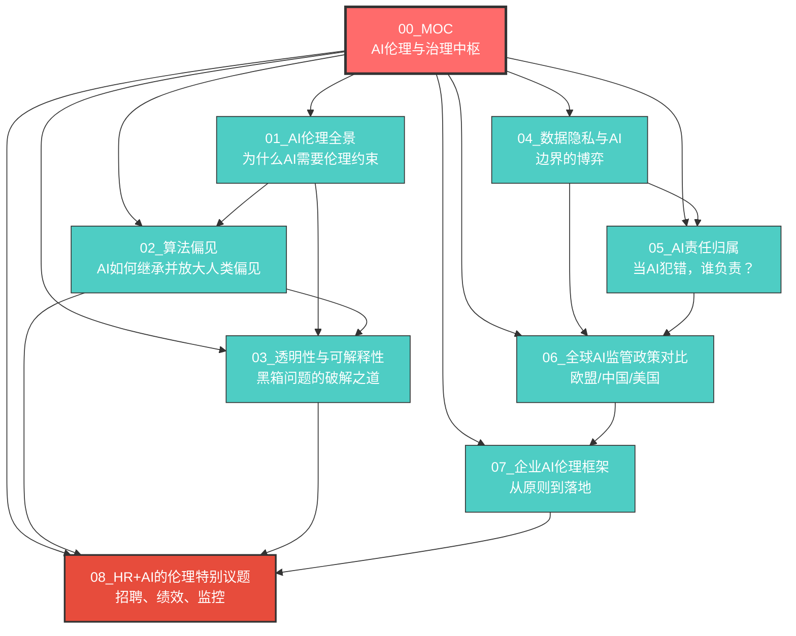
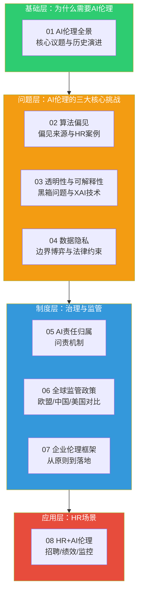
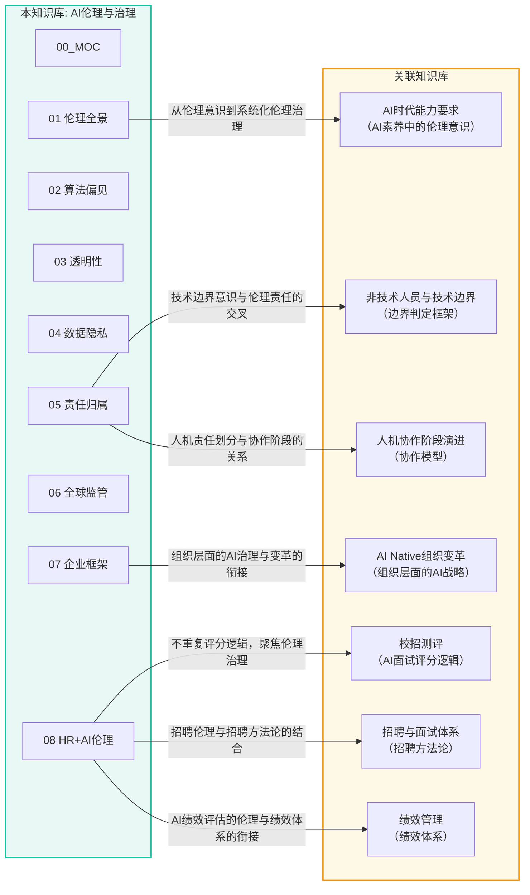
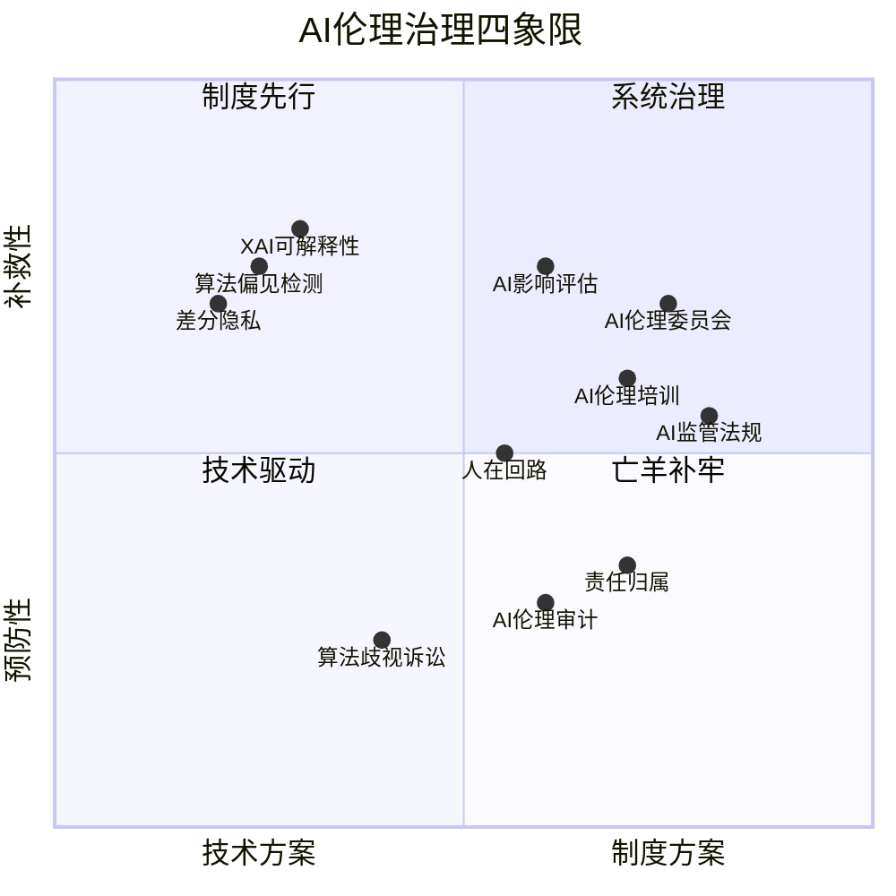
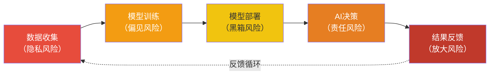

# AI伦理与治理中枢

> [!abstract] 知识库定位
> 本知识库是AI伦理与治理的**系统化深度展开**。它不重复 [[02-AI趋势与素养/AI时代能力要求/00_MOC_AI时代能力要求中枢]] 中「AI素养」的浅层伦理意识，也不重复 [[03-HR人事/校招测评/00_MOC_校招测评中枢]] 中「AI面试评分逻辑」的技术实现，而是从**战略+HR+AI**的复合视角出发，构建一个完整的AI伦理治理知识体系。
>
> **核心命题**：AI伦理不是什么「空谈」或「道德高地」，而是**AI落地的必要条件**——没有伦理的AI，最终会被监管、被诉讼、被用户抛弃。

> [!important] 为什么需要这个知识库？
> 已有知识库中，AI伦理相关的内容分散在各处：
> - [[02-AI趋势与素养/AI时代能力要求/00_MOC_AI时代能力要求中枢]] 中「AI素养」维度提到「AI伦理意识」，但只是一个能力标签（三四行带过）
> - [[03-HR人事/校招测评/00_MOC_校招测评中枢]] 中「AI面试评分逻辑」聚焦技术评分机制，不是伦理分析
> - [[02-AI趋势与素养/非技术人员与技术边界/00_MOC_非技术人员与技术边界中枢]] 讨论边界问题，但未专门展开伦理治理
>
> 本知识库将以上「点状的提及」扩展为「面状的系统性知识」，是从**原则到落地、从技术到法律、从全球到HR**的完整伦理治理框架。

> [!quote] 核心隐喻
> **AI伦理不是「刹车」——它是「交通规则」**
>
> 很多人误以为AI伦理是在给AI发展「踩刹车」。实际上，没有交通规则的道路只会陷入拥堵和事故。AI伦理治理的本质，是建立一套让AI安全、高效、可持续运行的「交通规则」。没有规则，AI就跑不远。

---

## 一、知识库导航图



---

## 二、知识库主题结构



---

## 三、各文档速览

### 文档01：[[02-AI趋势与素养/AI伦理与治理/01_AI伦理全景：为什么AI需要伦理约束]]

> [!summary] 核心内容
> 回答「AI伦理是不是空谈」这个根本问题。从AI伦理的六大核心议题（公平性、透明性、可解释性、隐私、责任归属、安全性）出发，梳理AI伦理从阿西莫夫三定律到欧盟AI法案的历史演进，论证**AI伦理是AI落地的必要条件**。

**关键问题**：
- AI伦理为什么不是「道德绑架」而是「商业必需」？
- 公平性、透明性、可解释性、隐私、责任、安全——这六大议题的内在逻辑是什么？
- 从阿西莫夫到欧盟AI法案，AI伦理是如何演进的？

**读者**：需要建立AI伦理基本认知的所有人，尤其是HR领导者和管理者。

---

### 文档02：[[02-AI趋势与素养/AI伦理与治理/02_算法偏见：AI如何继承并放大人类的偏见]]

> [!summary] 核心内容
> 深入剖析算法偏见的三种来源：数据偏见、算法偏见、反馈偏见。以HR领域的真实案例（AI简历筛选中的性别/种族偏见、AI面试中的口音/方言偏见）为切入点，说明**AI不是「客观」的——它只是把人类的偏见藏得更深**。

**关键问题**：
- 算法偏见的三种来源分别是什么？如何识别？
- 为什么AI简历筛选会产生性别和种族偏见？
- AI面试中的口音/方言偏见如何产生？如何检测？

**读者**：HR从业者、招聘负责人、AI产品经理、技术团队。

**与已有内容的边界**：不重复 [[03-HR人事/校招测评/00_MOC_校招测评中枢]] 中AI面试的评分技术细节，聚焦**偏见产生的伦理根源和治理对策**。

---

### 文档03：[[02-AI趋势与素养/AI伦理与治理/03_AI决策的透明性与可解释性]]

> [!summary] 核心内容
> 解决「黑箱问题」：为什么AI的决策难以解释？介绍可解释AI（XAI）的技术路径（LIME / SHAP / 注意力可视化），并聚焦HR场景中的**可解释性法律风险**：当AI说「这个候选人不合适」，HR如何向候选人解释？

**关键问题**：
- 什么是「黑箱问题」？为什么深度学习的决策难以解释？
- LIME、SHAP、注意力可视化等技术方案各有什么优劣？
- 在招聘场景中，可解释性不足会带来什么法律风险？

**读者**：HR从业者、法务人员、AI技术团队、数据科学家。

---

### 文档04：[[02-AI趋势与素养/AI伦理与治理/04_数据隐私与AI：边界的博弈]]

> [!summary] 核心内容
> AI训练数据中的隐私问题、员工数据隐私的灰色地带（AI监控/AI情绪分析/AI离职预测的伦理边界）、GDPR与《个人信息保护法》对AI的约束、差分隐私等技术方案。揭示**「数据驱动」和「隐私保护」之间的根本张力**。

**关键问题**：
- AI训练数据中的隐私泄露风险有哪些？
- AI员工监控、情绪分析、离职预测的伦理边界在哪里？
- GDPR和《个人信息保护法》如何约束AI数据使用？
- 差分隐私、联邦学习等隐私保护技术能解决什么问题？

**读者**：HR管理者、IT负责人、法务合规人员、数据保护官。

---

### 文档05：[[02-AI趋势与素养/AI伦理与治理/05_AI责任归属：当AI犯错，谁负责？]]

> [!summary] 核心内容
> AI决策造成伤害时的责任归属问题：开发者、部署者、使用者还是用户？聚焦HR场景的归责困境（AI拒绝了合格的候选人，谁来负责？），引入「人在回路」（Human in the Loop）作为法律防御机制。

**关键问题**：
- AI决策的责任归属有哪几种主流理论？
- 「人在回路」为什么是法律防御的关键？
- HR场景中，AI驱动的招聘/绩效/晋升决策，法律风险如何分配？

**读者**：法务人员、HR管理者、企业高管、AI产品负责人。

---

### 文档06：[[02-AI趋势与素养/AI伦理与治理/06_全球AI监管政策对比]]

> [!summary] 核心内容
> 系统对比欧盟AI法案（风险分级体系）、中国AI监管框架、美国AI监管现状，分析各国AI监管的差异与趋势，特别关注2026年最新政策动态。回答「在不同国家/地区部署AI，需要遵守哪些规则？」

**关键问题**：
- 欧盟AI法案的风险分级体系是如何运作的？
- 中国AI监管框架的核心特点是什么？
- 美国AI监管的现状和趋势？
- 不同国家/地区的监管差异对企业意味着什么？

**读者**：企业高管、法务合规人员、AI产品经理、国际化业务负责人。

---

### 文档07：[[02-AI趋势与素养/AI伦理与治理/07_企业AI伦理框架：从原则到落地]]

> [!summary] 核心内容
> 从「原则」到「落地」的完整路径：AI伦理委员会、AI影响评估（类似隐私影响评估）、AI伦理培训、AI伦理审计。对比Google/微软/IBM的AI伦理原则，提供企业可操作的AI伦理治理框架。

**关键问题**：
- 企业AI伦理治理框架应该包含哪些要素？
- AI影响评估怎么做？（类比隐私影响评估PIA）
- Google/微软/IBM的AI伦理原则有什么异同？
- AI伦理培训的核心内容是什么？

**读者**：企业管理者、AI治理负责人、合规团队、HR部门。

---

### 文档08：[[02-AI趋势与素养/AI伦理与治理/08_HR+AI的伦理特别议题]]

> [!summary] 核心内容
> 聚焦HR场景的AI伦理实务：AI面试的公平性保障、AI绩效评估的合法性、AI招聘中的「算法歧视」诉讼案例、AI员工监控的边界、HR如何平衡AI效率与伦理风险。**不重复技术实现，聚焦伦理和治理**。

**关键问题**：
- AI面试如何确保公平性？有哪些检测和修正方法？
- AI绩效评估在法律上是否站得住脚？
- 有哪些真实的「算法歧视」诉讼案例值得关注？
- AI员工监控的伦理和法律边界在哪里？
- HR如何平衡「AI驱动效率」与「伦理风险」？

**读者**：HR从业者（核心读者）、法务人员、AI产品经理、管理者。

**与已有内容的边界**：不重复 [[03-HR人事/校招测评/00_MOC_校招测评中枢]] 中AI面试的评分逻辑和技术实现，聚焦**伦理治理视角**。也不重复 [[02-AI趋势与素养/AI时代能力要求/00_MOC_AI时代能力要求中枢]] 中AI素养的浅层伦理意识，展开为**可操作的伦理治理框架**。

---

## 四、知识库与外部知识库的关联



---

## 五、阅读路径建议

### 路径一：HR从业者快速入门
适合：HR经理、招聘负责人、HRBP

```
01_AI伦理全景 → 02_算法偏见 → 08_HR+AI伦理特别议题
```
总计约3篇，快速建立对HR场景中AI伦理问题的基本认知和应对策略。

### 路径二：企业AI治理负责人
适合：AI治理委员会成员、合规负责人、法务

```
01_AI伦理全景 → 06_全球AI监管政策对比 → 07_企业AI伦理框架 → 05_AI责任归属
```
总计约4篇，构建从政策理解到企业落地的完整治理框架。

### 路径三：技术团队深入理解
适合：AI产品经理、数据科学家、ML工程师

```
01_AI伦理全景 → 02_算法偏见 → 03_透明性与可解释性 → 04_数据隐私与AI
```
总计约4篇，深入理解AI伦理的技术维度和解决方案。

### 路径四：全面掌握（推荐）
适合：希望对AI伦理与治理形成系统认知的所有人

```
01 → 02 → 03 → 04 → 05 → 06 → 07 → 08
```
总计约8篇，按知识库结构从基础到应用，完整覆盖。

---

## 六、关键概念索引

| 概念 | 定义 | 主要文档 |
|------|------|----------|
| **算法偏见（Algorithmic Bias）** | AI系统在决策中产生系统性、不公平的结果差异 | [[02-AI趋势与素养/AI伦理与治理/02_算法偏见：AI如何继承并放大人类的偏见]] |
| **可解释AI（XAI）** | 使AI决策过程可被人类理解的技术和方法 | [[02-AI趋势与素养/AI伦理与治理/03_AI决策的透明性与可解释性]] |
| **黑箱问题（Black Box Problem）** | 深度学习模型决策过程难以被人类理解的现象 | [[02-AI趋势与素养/AI伦理与治理/03_AI决策的透明性与可解释性]] |
| **差分隐私（Differential Privacy）** | 通过添加噪声保护个体数据隐私的技术 | [[02-AI趋势与素养/AI伦理与治理/04_数据隐私与AI：边界的博弈]] |
| **人在回路（Human in the Loop）** | 人类在AI决策链中保留最终审核和干预权 | [[02-AI趋势与素养/AI伦理与治理/05_AI责任归属：当AI犯错，谁负责？]] |
| **AI影响评估（AIA）** | 在AI系统部署前评估其伦理和社会影响的流程 | [[02-AI趋势与素养/AI伦理与治理/07_企业AI伦理框架：从原则到落地]] |
| **风险分级（Risk Classification）** | 欧盟AI法案将AI应用按风险程度分为四个等级 | [[02-AI趋势与素养/AI伦理与治理/06_全球AI监管政策对比]] |
| **算法歧视诉讼** | 因AI系统产生歧视性结果而引发的法律诉讼 | [[02-AI趋势与素养/AI伦理与治理/08_HR+AI的伦理特别议题]] |
| **联邦学习（Federated Learning）** | 数据不出本地、模型参数聚合的训练方式 | [[02-AI趋势与素养/AI伦理与治理/04_数据隐私与AI：边界的博弈]] |
| **AI伦理委员会** | 企业内负责AI伦理治理的跨职能组织 | [[02-AI趋势与素养/AI伦理与治理/07_企业AI伦理框架：从原则到落地]] |

---

## 七、核心问题清单

以下问题贯穿整个知识库，建议在阅读过程中持续思考：

1. **AI伦理为什么是「AI落地的必要条件」而非「道德装饰」？**
2. **算法偏见是技术问题还是社会问题？**（答案：两者都是）
3. **「AI更客观」是不是一个危险的幻觉？**
4. **在HR场景中，效率与公平之间如何权衡？**
5. **当AI决策出错时，谁应该承担法律责任？**
6. **中国的AI监管思路与欧盟的根本差异是什么？这反映了什么价值观差异？**
7. **企业AI伦理治理如何从「写在纸上的原则」变成「可执行的流程」？**
8. **HR部门在AI伦理治理中应该扮演什么角色？**

---

## 八、关键Mermaid总览

### 8.1 AI伦理治理四象限模型



### 8.2 AI伦理风险演进路径



---

## 九、使用建议

### 9.1 如果你是HR负责人
- **优先阅读**：[[02-AI趋势与素养/AI伦理与治理/01_AI伦理全景：为什么AI需要伦理约束]] → [[02-AI趋势与素养/AI伦理与治理/02_算法偏见：AI如何继承并放大人类的偏见]] → [[02-AI趋势与素养/AI伦理与治理/08_HR+AI的伦理特别议题]]
- **行动建议**：在引入任何AI驱动的HR工具前，组织团队完成AI影响评估，并建立「人在回路」的决策审核机制。

### 9.2 如果你是AI产品经理
- **优先阅读**：[[02-AI趋势与素养/AI伦理与治理/01_AI伦理全景：为什么AI需要伦理约束]] → [[02-AI趋势与素养/AI伦理与治理/02_算法偏见：AI如何继承并放大人类的偏见]] → [[02-AI趋势与素养/AI伦理与治理/03_AI决策的透明性与可解释性]] → [[02-AI趋势与素养/AI伦理与治理/04_数据隐私与AI：边界的博弈]]
- **行动建议**：在产品设计阶段嵌入「伦理设计清单」，将公平性检测和可解释性纳入产品需求。

### 9.3 如果你是企业法务/合规
- **优先阅读**：[[02-AI趋势与素养/AI伦理与治理/05_AI责任归属：当AI犯错，谁负责？]] → [[02-AI趋势与素养/AI伦理与治理/06_全球AI监管政策对比]] → [[02-AI趋势与素养/AI伦理与治理/07_企业AI伦理框架：从原则到落地]]
- **行动建议**：对照欧盟AI法案和中国AI监管要求，建立企业AI合规清单，定期更新。

### 9.4 如果你是企业高管
- **优先阅读**：[[02-AI趋势与素养/AI伦理与治理/01_AI伦理全景：为什么AI需要伦理约束]] → [[02-AI趋势与素养/AI伦理与治理/06_全球AI监管政策对比]] → [[02-AI趋势与素养/AI伦理与治理/07_企业AI伦理框架：从原则到落地]]
- **行动建议**：在企业战略层面确认AI伦理治理的优先级，设立AI伦理委员会，配置资源。

---

## 十、版本与更新

| 版本 | 日期 | 更新内容 |
|------|------|----------|
| v1.0 | 2026-07-27 | 初始版本，8篇内容文档 + MOC中枢 |

> [!warning] 持续更新
> AI伦理与治理是快速演进的领域。建议每季度回顾本知识库内容，特别是 [[02-AI趋势与素养/AI伦理与治理/06_全球AI监管政策对比]] 中的政策动态，以及 [[02-AI趋势与素养/AI伦理与治理/08_HR+AI的伦理特别议题]] 中的诉讼案例更新。

---

## 十一、致谢与参考

本知识库在构建过程中参考了以下框架和文献：

- 欧盟《人工智能法案》（EU AI Act, 2024）
- 中国《生成式人工智能服务管理暂行办法》（2023）
- 中国《人工智能法（草案）》（2024）
- IEEE 7000 系列标准（伦理对齐设计）
- NIST AI风险管理框架（AI RMF 1.0）
- Google AI Principles
- Microsoft Responsible AI Standard
- IBM AI Ethics Guidelines
- ACM 公平性、问责制和透明度会议（FAccT）论文
- 世界经济论坛《AI伦理与治理白皮书》

> [!tip] 与外部知识库的协同
> - 需要了解AI时代个人能力变化：参见 [[02-AI趋势与素养/AI时代能力要求/00_MOC_AI时代能力要求中枢]]
> - 需要了解AI面试的技术实现：参见 [[03-HR人事/校招测评/00_MOC_校招测评中枢]]
> - 需要了解组织层面的AI战略：参见 [[02-AI趋势与素养/AI Native组织变革/00_MOC_AI Native组织变革中枢]]
> - 需要了解非技术人员与AI的边界：参见 [[02-AI趋势与素养/非技术人员与技术边界/00_MOC_非技术人员与技术边界中枢]]
> - 需要了解人机协作的演进阶段：参见 [[02-AI趋势与素养/人机协作阶段演进/00_MOC_人机协作阶段演进中枢]]