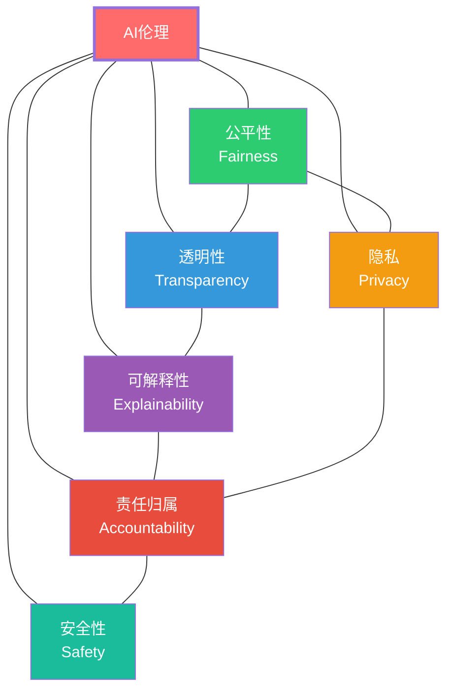
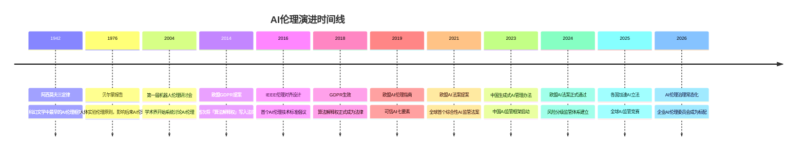
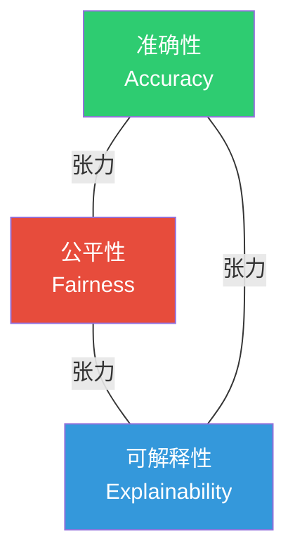
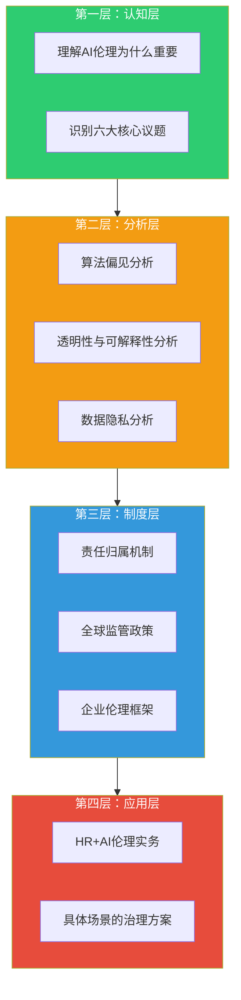

# 01 AI伦理全景：为什么AI需要伦理约束

> [!quote] 核心论断
> AI伦理不是「技术发展的刹车」，而是**AI落地的必要条件**。一个没有伦理约束的AI系统，就像一辆没有交通规则的车——短期可能跑得很快，但最终一定会撞上监管的墙、诉讼的墙、用户信任的墙。

> [!note] 本文定位
> 本文是AI伦理知识库的**总论篇**，回答「AI伦理为什么重要」这个根本问题。后续各文档将分别深入算法偏见、透明性、隐私、责任归属、监管政策和企业落地等具体议题。

---

## 一、AI伦理不是「空谈」——三个现实案例

### 1.1 亚马逊AI招聘工具（2014-2017）

亚马逊开发了一个AI招聘工具，用于自动筛选简历。结果发现，该工具**系统性地降低包含「女性」相关词汇的简历评分**（如「女子学院」「女子象棋俱乐部」）。原因在于：训练数据来自过去10年的招聘记录，而科技行业历史上男性简历占比更高，AI学到了「男性 = 好的候选人」这个错误的关联。

> [!warning] 关键教训
> 这不是AI「变坏了」，而是AI**忠实地学到了人类数据中的偏见**。伦理问题不是AI的「bug」，而是AI的「feature」——它反映了我们社会的真实偏见。

### 1.2 COMPAS再犯风险评估

美国司法系统使用的COMPAS算法用于评估被告的再犯风险。ProPublica的调查发现：该算法**错误地将黑人被告标记为高再犯风险的概率是白人的两倍**，而将白人被告错误标记为低风险的概率高于黑人。

> [!warning] 关键教训
> 即使算法设计者没有刻意歧视，模型也可能输出系统性不公平的结果。这在刑事司法、招聘、信贷等高风险决策场景中尤为致命。

### 1.3 剑桥分析数据丑闻（2018）

剑桥分析公司通过Facebook获取了8700万用户的数据，利用AI进行心理画像和政治广告精准投放，影响了2016年美国大选和英国脱欧公投。这暴露了AI在**数据隐私和操纵公众舆论**方面的巨大风险。

> [!warning] 关键教训
> AI + 数据 = 前所未有的操控能力。没有伦理约束的AI不是中性的工具，而是可以被武器化的权力。

---

## 二、AI伦理的六大核心议题

### 2.1 公平性（Fairness）

**核心问题**：AI系统是否对所有人公平对待？是否存在系统性歧视？

AI的公平性不是单一维度的概念。学术上至少有**21种不同的公平性定义**（Narayanan, 2018），但最核心的包括：

| 公平性类型 | 定义 | 示例 |
|-----------|------|------|
| **群体公平** | 不同群体获得相同结果的比例 | 男性和女性候选人的通过率应该相同 |
| **个体公平** | 相似的个体应该得到相似的结果 | 两个能力相同的候选人应该得到相似的评分 |
| **反事实公平** | 改变敏感属性不应改变结果 | 如果候选人的性别改变，结果不应改变 |

> [!danger] 核心矛盾
> 这些公平性定义在数学上**不可能同时满足**（除非在极其特殊的情况下）。这意味着：**没有「完全公平」的AI系统**，只有「在特定公平性定义下」的AI系统。选择哪种公平性定义，本身就是一个伦理选择。

### 2.2 透明性（Transparency）

**核心问题**：AI系统的工作原理是否向利益相关者公开？

透明性包含三个层次：
1. **算法透明**：模型架构、训练方法是否公开？
2. **数据透明**：训练数据的来源、组成、清洗方式是否公开？
3. **决策透明**：AI的决策过程是否可以被外部审查？

### 2.3 可解释性（Explainability）

**核心问题**：AI做出的某个具体决策，能否被人类理解？

详见 [[02-AI趋势与素养/AI伦理与治理/03_AI决策的透明性与可解释性]]。可解释性与透明性不同：透明性是「系统层面」的公开，可解释性是「决策层面」的理解。

### 2.4 隐私（Privacy）

**核心问题**：AI系统在收集、处理、使用数据时，是否尊重个人隐私？

详见 [[02-AI趋势与素养/AI伦理与治理/04_数据隐私与AI：边界的博弈]]。AI时代的隐私问题比传统互联网时代更复杂，因为AI可以从看似无害的数据中推断出敏感信息。

### 2.5 责任归属（Accountability）

**核心问题**：当AI做出错误决策造成伤害时，谁来承担责任？

详见 [[02-AI趋势与素养/AI伦理与治理/05_AI责任归属：当AI犯错，谁负责？]]。这是AI伦理中最棘手的问题之一，因为它触及了传统法律框架的边界。

### 2.6 安全性（Safety）

**核心问题**：AI系统是否安全可靠？是否存在被恶意利用的风险？

AI安全性包括：
- **鲁棒性**：AI是否能在异常输入下保持稳定？
- **对抗性攻击**：AI是否容易被恶意输入欺骗？
- **对齐问题**：AI的目标是否与人类价值观对齐？

---

## 三、AI伦理的历史演进：从阿西莫夫到欧盟AI法案

### 3.1 阿西莫夫三定律（1942）

艾萨克·阿西莫夫在科幻小说《我，机器人》中提出了著名的机器人三定律：

1. **第一定律**：机器人不得伤害人类，或因不作为而使人类受到伤害。
2. **第二定律**：机器人必须服从人类的命令，除非该命令与第一定律冲突。
3. **第三定律**：机器人在不违反第一、第二定律的情况下，必须保护自己。

> [!note] 洞察
> 阿西莫夫三定律虽然是科幻设定，但它奠定了AI伦理的一个核心原则：**AI的目标必须服从于人类的价值和安全**。这一原则至今仍是AI伦理讨论的起点。

### 3.2 从科幻到现实（2000-2015）

2000年代，随着机器学习开始在实际场景中应用，AI伦理从科幻走向现实：
- 2004年：意大利举办第一届机器人伦理国际研讨会
- 2014年：欧盟GDPR提案中首次提出「算法解释权」

### 3.3 GDPR时代（2016-2019）

GDPR第22条明确规定了「**不受制于自动化决策的权利**」，包括：
- 个人有权不服从仅基于自动化处理（包括画像）的决策
- 如果自动化决策对个人产生法律效力或重大影响，必须提供人工干预

> [!important] 里程碑意义
> GDPR是**全球首个将AI伦理写入法律**的法规。它确立了「算法解释权」和「不受自动化决策权」两个基本权利，为后续各国AI立法奠定了基础。

### 3.4 监管竞赛（2020-2026）

2020年代，全球进入AI监管的加速期：
- 欧盟AI法案（2024年通过）：**风险分级监管**
- 中国《生成式AI服务管理办法》（2023年生效）：**内容安全+算法备案**
- 美国AI行政令（2023年）：**安全测试+透明度要求**

详见 [[02-AI趋势与素养/AI伦理与治理/06_全球AI监管政策对比]]。

---

## 四、AI伦理为什么是「商业必需」而非「道德装饰」？

### 4.1 监管风险：不合规 = 高额罚款

| 法规 | 最高罚款 |
|------|----------|
| 欧盟AI法案 | 3500万欧元 或 全球年营收的7%（取高者） |
| GDPR | 2000万欧元 或 全球年营收的4%（取高者） |
| 中国《个人信息保护法》 | 5000万元 或 上年度营收的5%（取高者） |

> [!danger] 算一笔账
> 如果一家年营收100亿欧元的跨国企业违反欧盟AI法案，最高罚款可达**7亿欧元**。这不是「道德成本」，而是**真金白银的商业风险**。

### 4.2 声誉风险：一次丑闻，多年信任崩塌

Meta（Facebook）在剑桥分析事件后，品牌信任度多年未能恢复。Amazon AI招聘工具事件后，虽然亚马逊停止了该工具，但「AI招聘歧视」的标签已经深深印在公众认知中。

### 4.3 诉讼风险：算法歧视诉讼正在增加

详见 [[02-AI趋势与素养/AI伦理与治理/08_HR+AI的伦理特别议题]] 中的诉讼案例分析。在美国，因AI算法歧视引发的就业诉讼正在快速增长。在中国，虽然没有明确的「算法歧视」诉因，但《个人信息保护法》和《就业促进法》可以构成诉讼基础。

### 4.4 商业竞争力：负责任的AI是差异化优势

> [!tip] 正向视角
> 负责任的AI不只是「不犯错」，更是**建立用户信任、提升品牌价值、吸引顶尖人才**的战略资产。在AI产品同质化竞争加剧的背景下，伦理可信度可能成为关键的差异化因素。

---

## 五、AI伦理的「不可能三角」

在AI系统设计中，准确性、公平性和可解释性之间存在着根本性的张力：

- **准确性 vs 公平性**：追求公平性（如调整模型使不同群体结果均等）通常意味着牺牲一定的准确性
- **公平性 vs 可解释性**：复杂的公平性约束往往使模型更加难以解释
- **可解释性 vs 准确性**：最准确的模型（如深度神经网络）往往最不可解释；可解释的模型（如决策树）往往准确性较低

> [!important] 实践意义
> 这意味着**没有「完美」的AI系统**。AI伦理治理的核心不是追求完美，而是**在张力中做出有意识的权衡，并对权衡过程负责**。

---

## 六、AI伦理与HR的特殊关系

HR领域是AI伦理问题**最集中、最敏感**的应用场景之一：

| HR场景 | 涉及的伦理议题 |
|--------|---------------|
| AI简历筛选 | 公平性（性别/种族/年龄偏见）、可解释性 |
| AI面试评分 | 公平性（口音/方言/表情偏见）、可解释性、隐私 |
| AI绩效评估 | 公平性、可解释性、责任归属 |
| AI离职预测 | 隐私、公平性（可能对某些群体不公平） |
| AI员工监控 | 隐私、安全性 |
| AI薪酬建议 | 公平性（性别薪酬差距）、可解释性 |

详见 [[02-AI趋势与素养/AI伦理与治理/08_HR+AI的伦理特别议题]] 和 [[02-AI趋势与素养/AI伦理与治理/02_算法偏见：AI如何继承并放大人类的偏见]]。

> [!warning] HR的特殊性
> 与商品推荐不同，HR决策直接影响**人的职业发展和生活质量**。一个错误的AI招聘决策，可能让一个合格的候选人失去工作机会；一个不公平的AI绩效评估，可能影响一个人的职业生涯。因此，HR领域的AI伦理标准必须**高于**其他应用场景。

---

## 七、知识库框架：AI伦理治理的四个层次

本知识库的8篇文档，正是按照这个四层结构组织的：

- **认知层**：本文（01）建立基本认知
- **分析层**：02 算法偏见、03 透明性与可解释性、04 数据隐私
- **制度层**：05 责任归属、06 全球监管、07 企业框架
- **应用层**：08 HR+AI伦理特别议题

---

## 八、关键概念澄清

### 8.1 AI伦理 vs AI治理

> [!note] 区分
> - **AI伦理（AI Ethics）**：回答「什么是对的/什么是错的」——是价值判断
> - **AI治理（AI Governance）**：回答「如何确保做对的事」——是制度设计
>
> 伦理是目标，治理是手段。没有伦理的治理是空洞的流程，没有治理的伦理是无力的话语。

### 8.2 负责任AI（Responsible AI）

负责任AI是AI伦理与治理的实践化表达。它不是一个单一的技术或流程，而是一套**从设计到部署到监控的全生命周期管理方法论**。

> [!tip] 记忆要点
> 负责任AI = AI伦理（方向）+ AI治理（方法）+ 持续迭代（动力）

---

## 九、总结：AI伦理的「底层逻辑」

1. **AI不是中性的**：AI反映的是训练数据和设计者的价值观。没有「价值观中立」的AI。
2. **伦理不是可选项**：在强监管时代，AI伦理合规是商业底线，不是加分项。
3. **HR是高敏感场景**：HR决策直接影响人的职业发展，伦理标准必须更高。
4. **没有完美方案**：准确性、公平性、可解释性之间存在张力，治理的核心是**有意识的权衡和负责任的选择**。
5. **伦理是持续过程**：AI伦理不是一次性的「合规检查」，而是**贯穿AI生命周期的持续治理**。

---

## 十、下一步阅读

- 深入了解算法偏见：[[02-AI趋势与素养/AI伦理与治理/02_算法偏见：AI如何继承并放大人类的偏见]]
- 探索黑箱问题的解决方案：[[02-AI趋势与素养/AI伦理与治理/03_AI决策的透明性与可解释性]]
- 理解数据隐私的边界：[[02-AI趋势与素养/AI伦理与治理/04_数据隐私与AI：边界的博弈]]
- 回到知识库中枢：[[02-AI趋势与素养/AI伦理与治理/00_MOC_AI伦理与治理中枢]]
- 了解AI伦理意识的培养：[[02-AI趋势与素养/AI时代能力要求/00_MOC_AI时代能力要求中枢]]
- 了解组织层面的AI战略：[[02-AI趋势与素养/AI Native组织变革/00_MOC_AI Native组织变革中枢]]