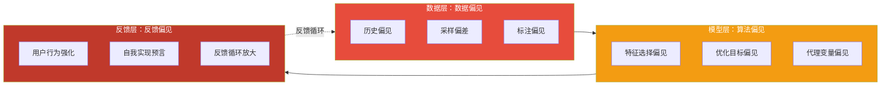
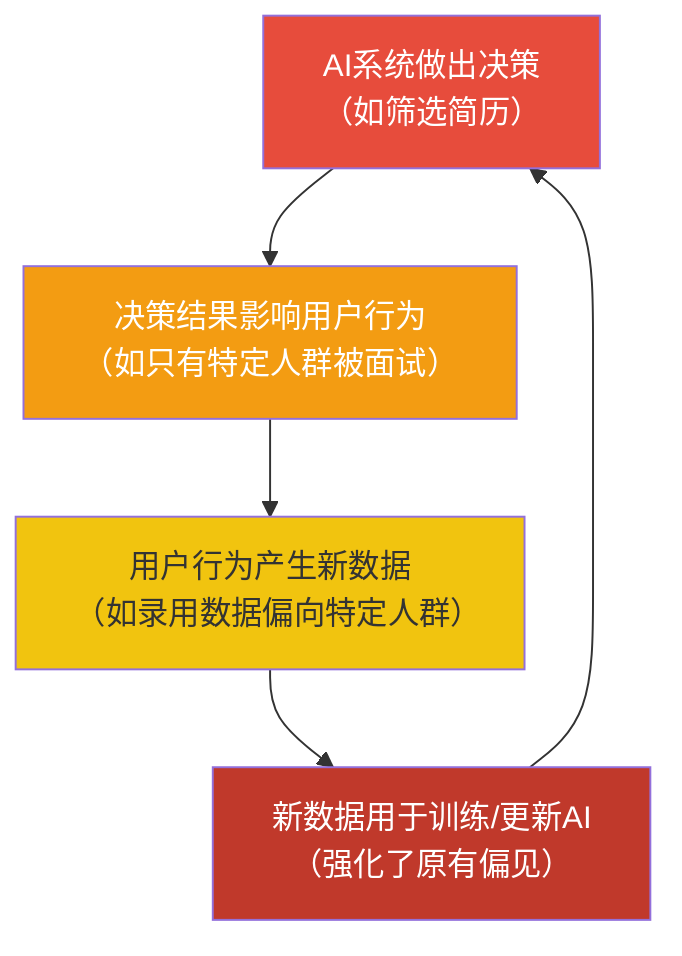
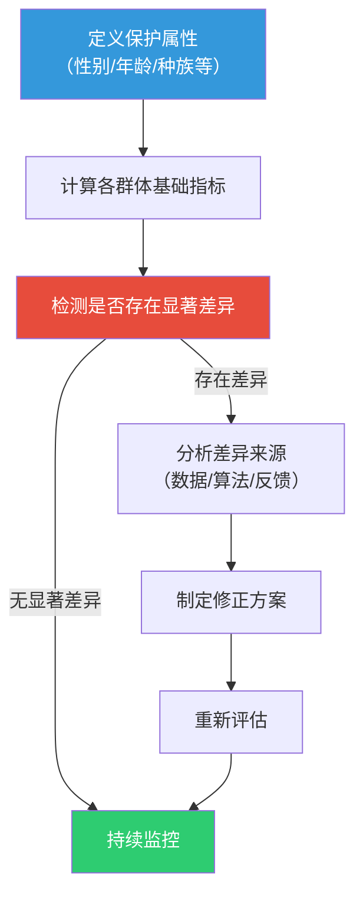

# 02 算法偏见：AI如何继承并放大人类的偏见

> [!quote] 核心论断
> **AI不是「客观」的——它只是把人类的偏见藏得更深。** 算法偏见不是AI的「bug」，而是AI忠实地从人类数据中「学到」的社会偏见。更危险的是，AI不仅继承偏见，还通过规模化部署和反馈循环**放大偏见**。

> [!note] 本文定位
> 本文深入剖析算法偏见的三种来源（数据偏见、算法偏见、反馈偏见），以HR领域的典型案例为切入点。不重复 [[03-HR人事/校招测评/00_MOC_校招测评中枢]] 中AI面试的评分技术细节，聚焦**偏见产生的伦理根源和治理对策**。

---

## 一、算法偏见的三层模型

---

## 二、第一层：数据偏见（Data Bias）

数据偏见是算法偏见**最主要、最普遍**的来源。真实世界的数据反映了真实世界的偏见，而AI「忠实」地学到了这些偏见。

### 2.1 历史偏见（Historical Bias）

**定义**：训练数据中已经包含了人类社会历史上的系统性偏见。

**HR案例：亚马逊AI招聘工具**

亚马逊2014-2017年开发的AI招聘工具，训练数据来自过去10年的招聘记录。由于科技行业历史上男性工程师占比更高，AI学到了「男性 = 更好的候选人」这个错误的关联。

> [!example] 具体表现
> - 简历中包含「女子」一词（如「女子学院」「女子象棋俱乐部」）的候选人被系统性地降低评分
> - AI对毕业于女子学院的候选人自动降分
> - 即使简历中其他内容完全相同，AI也会根据性别相关的词汇做出不同判断

**根本原因**：不是AI「歧视女性」，而是过去10年的招聘数据中，被录用的男性比例更高。AI学到的「录用模式」天然包含了性别偏见。

### 2.2 采样偏差（Sampling Bias）

**定义**：训练数据不能代表目标人群的真实分布，导致模型对某些群体表现不佳。

**HR案例：AI面试中的口音/方言偏见**

许多AI面试系统使用语音识别和自然语言处理技术。如果训练数据中**标准普通话样本占比过高**，而缺少方言口音样本，AI可能：
- 对方言口音候选人的语音识别准确率更低
- 将「口音差异」错误地关联为「语言表达能力差」
- 对有口音的候选人给出系统性的低分

> [!warning] 关键洞察
> 这不是AI「歧视」方言使用者，而是训练数据中方言样本不足。但结果是相同的：**方言使用者受到了不公平的对待**。

### 2.3 标注偏见（Labeling Bias）

**定义**：人工标注数据时，标注者的主观偏见被注入训练数据。

**HR案例：简历评分标注**

如果AI简历筛选系统使用人工标注的「好简历/差简历」作为训练标签，而标注者本身存在偏见（如更偏好名校背景、更偏好特定行业经验），这些偏见会被AI学到并放大。

> [!danger] 隐蔽性
> 标注偏见是最难检测的偏见类型之一，因为它隐藏在标注过程中，而标注过程往往不被视为「算法设计」的一部分。

---

## 三、第二层：算法偏见（Algorithmic Bias）

即使数据完全无偏，算法设计本身也可能引入偏见。

### 3.1 特征选择偏见（Feature Selection Bias）

**定义**：模型设计者选择哪些特征作为输入，这一选择本身就带有价值判断。

**HR案例**：
- 如果AI招聘系统将「工作稳定性（跳槽频率）」作为重要特征，可能对女性不公平（女性因生育更可能中断职业）
- 如果AI将「加班时长」作为绩效评估特征，可能对有家庭照顾责任的员工（尤其是女性）不公平
- 如果AI将「毕业院校排名」作为重要特征，可能强化教育不平等

### 3.2 优化目标偏见（Objective Bias）

**定义**：模型的优化目标（如「最大化预测准确率」）可能牺牲少数群体的利益。

**HR案例**：在简历筛选中，如果模型追求「最大化预测准确率」，它可能选择忽略少数群体样本（因为少数群体样本少，对整体准确率影响小），导致对少数群体的预测准确率极低。

### 3.3 代理变量偏见（Proxy Variable Bias）

**定义**：模型不使用明确的敏感属性（如性别、种族），但通过其他「代理变量」间接推断出敏感属性。

**HR案例**：
- 邮政编码 → 间接推断种族/社会经济地位
- 工作时间间隙 → 间接推断性别（女性更可能有职业中断）
- 姓名 → 间接推断种族/地域
- 兴趣爱好 → 间接推断性别（如「足球」比「瑜伽」更可能被关联为男性）

> [!important] 法律风险
> 代理变量偏见是AI歧视诉讼中最常见的争议焦点。即使招聘系统明确排除了性别/种族等敏感属性，如果通过代理变量产生了歧视性结果，在法律上仍可能被认定为歧视。

---

## 四、第三层：反馈偏见（Feedback Bias）

反馈偏见是**最危险但最容易被忽视**的偏见类型——它不仅放大现有偏见，还创造了一个自我强化的偏见循环。

### 4.1 反馈循环机制

**HR案例**：如果AI简历筛选系统对某类候选人评分偏低，这类候选人被面试和录用的机会就减少。这导致新的招聘数据中这类候选人占比更低，AI在下一轮训练中会学到「这类候选人更少被录用」——形成一个**自我实现的预言**。

### 4.2 用户行为强化

**定义**：用户（如HR、招聘经理）的偏见行为通过AI系统被放大。

**HR案例**：
- HR在看到AI推荐的候选人后，可能更倾向于选择与AI推荐特征相似的候选人
- 这种倾向产生的新数据反馈给AI，使AI的推荐越来越「窄」
- 最终，招聘渠道越来越单一，多样性越来越差

> [!warning] 隐蔽性
> 反馈偏见往往需要数月甚至数年才会显现，到那时，偏见的累积效应已经很难逆转。它不是一次性的「偏见事件」，而是一个**持续恶化的过程**。

---

## 五、算法偏见的检测与度量

### 5.1 关键度量指标

| 指标 | 定义 | 适用场景 |
|------|------|----------|
| **统计均等差异** | 不同群体的正面结果率是否相等 | 需要结果均等的场景 |
| **均等机会差异** | 不同群体中「合格者」被正确识别的比例是否相等 | 招聘筛选场景 |
| **不同影响比率** | 受保护群体与参照群体的选择率之比（通常以0.8为阈值） | 法律合规场景 |
| **校准度差异** | 模型预测的概率与实际概率在各群体中是否一致 | 风险评估场景 |

### 5.2 检测流程

---

## 六、算法偏见的修正策略

### 6.1 预处理（Pre-processing）：修正数据

- **数据重采样**：对少数群体样本进行过采样或对多数群体进行欠采样
- **数据增强**：生成合成数据补充少数群体样本
- **偏见标签修正**：重新审查和修正标注数据中的偏见

> [!warning] 注意
> 数据修正可能引入新的偏见。例如，过度修正可能导致「逆向歧视」。

### 6.2 处理中（In-processing）：修正算法

- **公平性约束**：在模型训练过程中加入公平性约束条件
- **对抗性去偏**：使用对抗网络移除模型中的敏感属性信息
- **多目标优化**：同时优化准确性和公平性

### 6.3 后处理（Post-processing）：修正输出

- **阈值调整**：对不同群体使用不同的决策阈值
- **结果校准**：确保不同群体的预测概率与实际概率一致

> [!important] 权衡
> 所有的修正策略都会带来**准确性-公平性权衡**。修正得越多，准确性损失越大。这不是技术问题，而是**价值判断**——你愿意牺牲多少准确性来换取公平性？

---

## 七、HR领域的偏见检测清单

### 7.1 数据层面

- [ ] 训练数据是否覆盖了所有目标人群？
- [ ] 训练数据中是否存在历史偏见（如性别薪酬差距）？
- [ ] 数据标注者是否具有多样性？
- [ ] 是否检查了代理变量的存在？

### 7.2 模型层面

- [ ] 特征选择是否排除了敏感属性及其代理变量？
- [ ] 是否对不同群体分别计算了模型性能指标？
- [ ] 是否进行了公平性压力测试（如输入不同性别/年龄的简历看结果差异）？

### 7.3 部署层面

- [ ] 是否建立了偏见监控机制？
- [ ] 是否设置了偏见告警阈值？
- [ ] 是否定期进行偏见审计？
- [ ] 是否保留了「人在回路」的人工审核机制？

---

## 八、案例深度分析：AI简历筛选的性别偏见

### 8.1 问题描述

某大型科技公司使用AI简历筛选系统，发现进入面试环节的女性候选人比例从AI部署前的35%下降到22%。

### 8.2 诊断过程

1. **数据审查**：训练数据中女性简历占比28%，但实际应聘者中女性占比40%——存在采样偏差
2. **特征分析**：发现「工作年限连续性」特征与性别高度相关，女性因生育中断职业的比例更高
3. **输出分析**：女性简历的「不推荐」率是男性简历的1.8倍

### 8.3 修正方案

1. **数据重采样**：补充女性简历样本，使训练数据中女性占比达到40%
2. **特征调整**：移除或降低「工作年限连续性」特征的权重
3. **公平性约束**：在模型训练中加入「不同性别通过率差异不超过10%」的约束
4. **人工审核**：AI筛选后，人工审核所有被AI拒绝的简历

### 8.4 修正结果

修正后，女性候选人进入面试的比例恢复到34%，与总体应聘者女性占比（40%）的差距缩小到可接受范围。

---

## 八点五、AI面试中的口音和方言偏见：深度分析

### 8.5.1 问题机制

AI面试系统通常包含语音识别和自然语言处理组件。当这些组件主要使用标准普通话训练时，会产生以下问题：

**语音识别层面**：
- 方言口音（如四川话、粤语、闽南话口音）可能导致语音识别准确率下降
- 识别错误可能被AI误解为「表达不清晰」或「语言能力差」
- 某些方言特有的用词和语法结构可能被NLP模型误判

**评分传播层面**：
- 语音识别错误 → 关键词匹配率下降 → 内容评分降低
- 方言用词 → 被NLP模型判断为「不专业」→ 表达评分降低
- 口音导致的语速变化 → 流畅度评分降低

**实际案例**：
某跨国快消公司的AI面试系统在中国区部署后，发现来自广东、四川、福建等方言区的候选人通过率显著低于北京、东北等普通话标准区域的候选人。经分析，系统确实存在显著的口音偏见。

### 8.5.2 检测方法

| 方法 | 操作 |
|------|------|
| 口音对比测试 | 让同一候选人分别用标准普通话和带口音的普通话回答相同问题，比较AI评分差异 |
| 控制变量测试 | 使用TTS（文本转语音）技术，用不同口音朗读相同的标准答案，比较评分差异 |
| 群体对比分析 | 比较不同籍贯/方言区候选人的AI面试评分分布 |

### 8.5.3 防范措施

- **训练数据多样化**：确保语音识别训练数据包含多种方言口音样本
- **评分校准**：对不同口音群体的评分进行校准，消除系统性偏差
- **多模态评估**：不要仅依赖语音分析，结合文本分析和内容评估
- **人工复核**：对AI面试的低分候选人进行人工复核，特别是来自方言区的候选人

> [!warning] 法律风险
> 在中国，方言口音与地域/籍贯高度相关。如果AI面试系统对方言口音存在系统性偏见，可能构成**地域歧视**，违反《就业促进法》第三条「劳动者就业，不因民族、种族、性别、宗教信仰等不同而受歧视」的规定。

### 8.5.4 与[[03-HR人事/校招测评/00_MOC_校招测评中枢]]的关系

[[03-HR人事/校招测评/00_MOC_校招测评中枢]] 中「AI面试评分逻辑」详细讲解了AI面试的打分机制（关键词匹配、流畅度、表情评分等），但不涉及这些机制是否公平、是否对不同群体存在差异。本章从伦理治理角度补充了**公平性检测和修正**的视角，两者是互补关系而非重复。

---

## 九、总结：算法偏见的五个关键认知

1. **偏见不是bug，是feature**：AI偏见反映了人类社会数据的真实偏见，是「学到」的，不是「设计」的。
2. **三层偏见互为因果**：数据偏见、算法偏见、反馈偏见相互强化，形成恶性循环。
3. **代理变量是隐藏的陷阱**：即使排除了敏感属性，模型仍可能通过代理变量产生歧视。
4. **没有完美的公平**：不同的公平性定义在数学上不可能同时满足，选择哪种公平性本身就是伦理选择。
5. **检测和修正是持续过程**：偏见不是一次修正就能消除的，需要持续的监控和迭代。

---

## 十、AI偏见治理的「黄金法则」

> [!tip] 四条黄金法则
>
> **法则一：不要假设AI是客观的。** AI反映的是训练数据的模式，而训练数据反映的是人类社会的模式。如果社会存在偏见，数据就存在偏见，AI就存在偏见。
>
> **法则二：偏见检测要在部署前完成。** 不要等到AI上线后收到投诉才开始检测偏见。偏见检测应该是AI系统上线前的**必要步骤**，就像软件上线前的安全测试一样。
>
> **法则三：建立「偏见预算」。** 完全消除偏见在数学上是不可能的。企业应该建立「偏见预算」——明确不同场景下可接受的偏见程度，并在预算范围内持续优化。
>
> **法则四：透明度是最好的防御。** 向候选人/员工公开AI偏见检测的结果和缓解措施，不仅是法律要求，也是建立信任的关键。承认AI有偏见，并展示你在努力修正——这比假装AI完美无缺更值得信任。

---

## 十、下一步阅读

- 了解黑箱问题与可解释性：[[02-AI趋势与素养/AI伦理与治理/03_AI决策的透明性与可解释性]]
- 了解HR场景的伦理实务：[[02-AI趋势与素养/AI伦理与治理/08_HR+AI的伦理特别议题]]
- 了解AI面试的技术实现（不重复本内容）：[[03-HR人事/校招测评/00_MOC_校招测评中枢]]
- 了解招聘方法论：[[03-HR人事/招聘与面试体系/00_MOC_招聘与面试体系中枢]]
- 回到知识库中枢：[[02-AI趋势与素养/AI伦理与治理/00_MOC_AI伦理与治理中枢]]