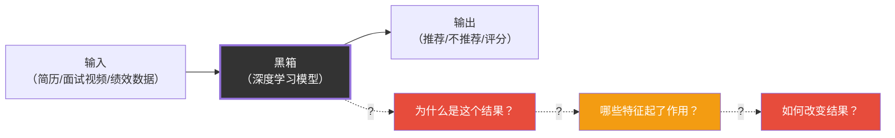
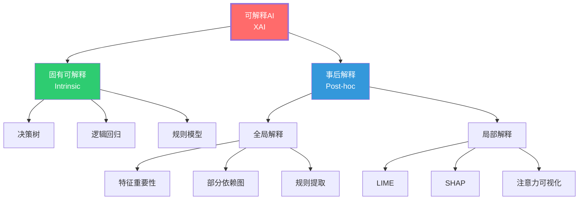
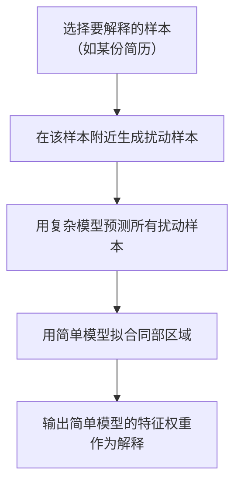
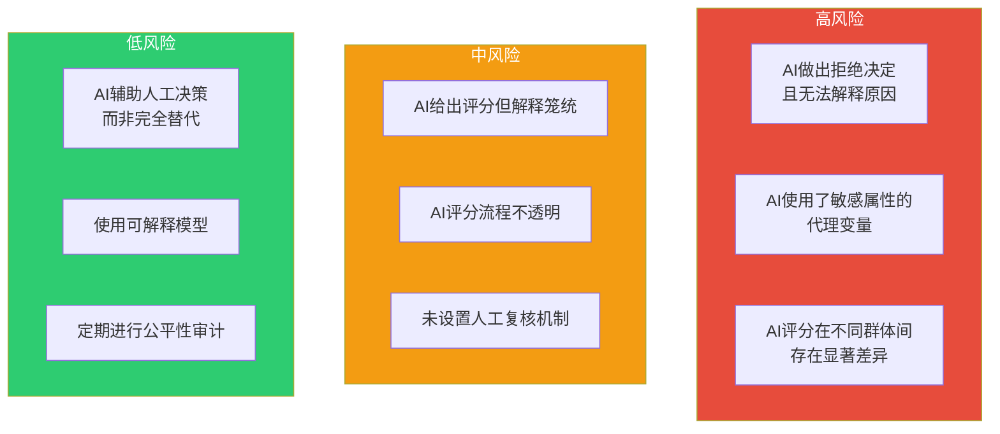
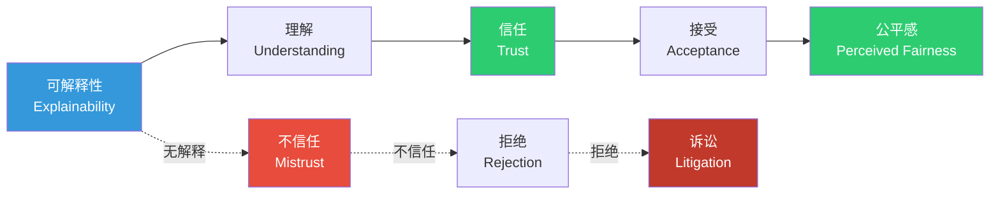

# 03 AI决策的透明性与可解释性

> [!quote] 核心论断
> **AI的「黑箱」不是技术问题，而是权利问题。** 当AI做出影响你人生的决策时——拒绝你的简历、降低你的绩效评分、预测你即将离职——你有没有权利知道「为什么」？可解释性不是AI的「锦上添花」，而是**AI决策合法性的基础**。

> [!note] 本文定位
> 本文从「黑箱问题」出发，介绍可解释AI（XAI）的核心技术路径，并聚焦HR场景中的**可解释性法律风险**。不重复 [[03-HR人事/校招测评/00_MOC_校招测评中枢]] 中AI面试的评分逻辑细节，聚焦**「为什么AI这么说」以及「HR如何向候选人解释」**。

---

## 一、什么是「黑箱问题」？

### 1.1 定义

**黑箱问题（Black Box Problem）**：指AI系统（特别是深度学习模型）的决策过程难以被人类理解的现象。

### 1.2 为什么深度学习是「黑箱」？

深度学习模型之所以难以解释，是其**内在结构**决定的：

| 特性 | 解释 |
|------|------|
| **高维非线性** | 成百上千万参数的非线性组合，人类无法直观理解 |
| **分布式表示** | 概念不是存储在单个神经元中，而是分布在大量神经元中 |
| **层级抽象** | 底层特征到高层语义的映射过程不透明 |
| **涌现行为** | 模型行为是大量简单计算单元「涌现」的结果，不可还原为简单规则 |

> [!note] 类比
> 问一个深度学习模型「为什么推荐这个候选人」，就像问一个人的大脑「你为什么喜欢这个人」——你知道有原因，但很难精确描述所有神经元是如何协同工作的。

### 1.3 黑箱问题的严重性取决于场景

| 场景 | 黑箱可接受性 | 原因 |
|------|------------|------|
| 电影推荐 | 可接受 | 后果轻微，用户不关心为什么 |
| 商品推荐 | 可接受 | 同上 |
| 医疗诊断 | 不可接受 | 涉及生命健康 |
| 刑事司法 | 不可接受 | 涉及人身自由 |
| **HR招聘** | **不可接受** | 涉及职业发展和平等就业权 |
| **HR绩效评估** | **不可接受** | 涉及收入和职业发展 |
| 信用评分 | 不可接受 | 涉及金融权利 |

> [!important] 核心原则
> **决策后果越严重，可解释性要求越高。** HR领域的AI决策直接影响人的职业发展和生活质量，属于高后果决策，必须满足高可解释性标准。

---

## 二、可解释AI（XAI）的技术路径

### 2.1 XAI全景图

### 2.2 固有可解释模型（Intrinsic）

**核心思想**：使用本身就「透明」的模型，而不是去解释一个不透明的模型。

| 模型类型 | 优点 | 缺点 | HR适用性 |
|----------|------|------|----------|
| **决策树** | 完全可解释，可视化 | 准确性有限 | 简单筛选可接受 |
| **逻辑回归** | 权重可解释 | 只能捕捉线性关系 | 基础筛选可接受 |
| **规则模型** | 规则清晰，易审计 | 覆盖不全面 | 合规审核友好 |

> [!warning] 固有可解释模型的局限性
> 在HR场景中，简历筛选、面试评分、绩效预测等任务往往需要捕捉复杂的非线性关系。固有可解释模型（如决策树）的准确性可能无法满足业务需求，这就是**准确性-可解释性权衡**。

### 2.3 事后解释方法（Post-hoc）

#### 2.3.1 LIME（Local Interpretable Model-agnostic Explanations）

**核心思想**：在某个具体预测点附近，用一个简单的可解释模型（如线性模型）来近似复杂模型的行为。

**工作原理**：

**HR应用示例**：对于一份被AI标记为「不推荐」的简历，LIME可以告诉你「主要原因是工作年限不足（贡献-0.3）和跳槽频率过高（贡献-0.25）」。

**优点**：模型无关（适用于任何模型），直观易懂
**缺点**：只解释局部，解释的稳定性有限

#### 2.3.2 SHAP（SHapley Additive exPlanations）

**核心思想**：基于博弈论中的Shapley值，公平地分配每个特征对预测结果的贡献。

**HR应用示例**：对于AI面试评分，SHAP可以展示每个评估维度（关键词匹配、流畅度、表情稳定性等）对最终评分的贡献值。

**优点**：理论基础坚实，全局和局部解释都支持
**缺点**：计算成本高（特征多时组合爆炸），需要技术背景理解

#### 2.3.3 注意力可视化（Attention Visualization）

**核心思想**：对于使用注意力机制的模型（如Transformer），可视化模型在做出决策时「关注」了输入的哪些部分。

**HR应用示例**：在AI简历筛选中，可视化模型在阅读简历时重点关注了哪些段落/词汇（如「更关注工作经历而非教育背景」）。

**优点**：直观，对于文本处理非常自然
**缺点**：注意力权重不一定等于「重要性」；可能产生误导性解释

### 2.4 技术方案对比

| 方法 | 解释粒度 | 适用模型 | 理解难度 | 法律合规性 |
|------|----------|----------|----------|------------|
| 决策树 | 全局 | 仅决策树 | 低 | 高 |
| LIME | 局部 | 任意模型 | 中 | 中 |
| SHAP | 全局+局部 | 任意模型 | 高 | 高 |
| 注意力可视化 | 局部 | 注意力模型 | 低 | 中 |

---

## 三、HR场景：AI说「这个候选人不合适」，HR如何解释？

### 3.1 问题的法律背景

GDPR第22条和中国的《个人信息保护法》第24条都赋予了个人**不受制于自动化决策的权利**和**要求解释的权利**。

> [!warning] 法律原文
> 《个人信息保护法》第24条：「通过自动化决策方式作出对个人权益有重大影响的决定，个人有权要求个人信息处理者予以说明，并有权拒绝个人信息处理者仅通过自动化决策的方式作出决定。」

这意味着，如果AI拒绝了某个候选人，候选人有权：
1. **要求说明**：「为什么我被拒绝了？」
2. **要求人工干预**：「我不接受AI的决定，请人工审核。」
3. **提起诉讼**：如果拒绝理由不充分或不公平。

### 3.2 不同场景的解释需求

| 场景 | 解释需求 | 推荐方案 |
|------|----------|----------|
| AI简历筛选 | 告知被拒原因，提供申诉渠道 | LIME + 人工审核机制 |
| AI面试评分 | 展示各维度得分，说明评分逻辑 | 结构化评分报告 + SHAP |
| AI绩效评估 | 提供评估依据，允许员工质疑 | 可解释模型 + 人工复核 |
| AI晋升推荐 | 展示推荐理由，说明数据来源 | 规则模型 + 透明度报告 |

### 3.3 面向候选人的解释模板

> [!example] 解释模板（正面示例）
> 「感谢您申请XX岗位。经过AI初筛和人工复核，您的申请未进入下一轮。主要原因是：
> 1. 岗位要求XX技能3年以上经验，您的简历显示为1.5年
> 2. 该岗位优先考虑有XX行业背景的候选人
> 
> 如果您认为以上评估有误，可以在7天内通过以下链接申请人工复核。」

> [!danger] 反面示例（不可接受）
> 「经过AI系统评估，您不符合该岗位要求。」
> 
> 这种回复没有提供任何具体原因，既不符合法律要求（没有「说明」），也损害雇主品牌。

---

## 四、可解释性在招聘中的法律风险

### 4.1 风险矩阵

### 4.2 关键法律风险点

1. **「无法解释」=「无法辩护」**：如果AI拒绝了候选人，而HR无法解释原因，在法律纠纷中会处于极为不利的位置。

2. **「解释看似合理但实际错误」也是风险**：LIME/SHAP等方法提供的是近似解释，不是精确解释。如果解释与模型的真实行为不一致，可能导致误导性辩护。

3. **「解释暴露了歧视」**：如果解释显示AI使用了与性别/种族/年龄相关的代理变量，即使是无意的，也可能构成歧视证据。

### 4.3 风险防范清单

- [ ] HR能否向候选人清晰解释AI的拒绝原因？
- [ ] 解释是否基于具体特征而非笼统表述？
- [ ] 是否提供了人工复核渠道？
- [ ] 是否定期审计AI的可解释性质量？
- [ ] 法务团队是否审查过AI的解释机制？

---

## 五、可解释性与信任的关系

> [!important] 关键洞察
> 可解释性不只是法律合规的需要，更是**建立信任**的需要。候选人可能接受被拒绝，但很难接受「不知道为什么被拒绝」。可解释性是将「AI的决定」转化为「可以被理解和质疑的决定」的关键桥梁。

---

## 六、HR实践建议

### 6.1 采购AI招聘工具时的可解释性要求

| 问题 | 期望回答 |
|------|----------|
| 是否可以解释每个具体决策？ | 可以，至少提供特征级别的解释 |
| 解释是否可以被非技术人员理解？ | 可以，使用自然语言而非技术术语 |
| 是否支持人工复核机制？ | 支持，提供人工干预的接口 |
| 是否定期进行可解释性审计？ | 是，提供审计报告 |

### 6.2 内部AI系统的可解释性标准

- **必须**：提供每个决策的主要影响因素及其权重
- **必须**：支持人工复核和覆盖
- **应该**：使用SHAP值或类似方法提供特征贡献
- **应该**：建立可解释性质量监控机制
- **可以**：提供「反事实解释」（如何改变输入才能改变结果）

---

## 七、总结

1. **黑箱不是技术问题，是权利问题**：当AI决策影响人的权益时，可解释性是基本权利。
2. **没有完美的解释**：所有XAI方法都是近似解释，需要在「解释的准确性」和「解释的可理解性」之间权衡。
3. **HR是高要求场景**：招聘和绩效评估直接影响人的职业发展，可解释性标准必须高于其他场景。
4. **「人在回路」是底线**：在可解释性技术不完美的情况下，人工审核机制是最后的保障。
5. **可解释性建立信任**：不只是法律合规，更是雇主品牌和候选人体验的核心要素。

---

## 七点五、从「可解释性」到「可质疑性」：超越技术视角

### 7.5.1 可解释性不等于可质疑性

> [!important] 核心区分
> **可解释性（Explainability）**：AI能告诉你「为什么是这个结果」
> **可质疑性（Contestability）**：你可以挑战AI的决策，并获得有意义的回应
>
> 一个AI系统可能有很高的可解释性（能告诉你哪些特征起了作用），但可质疑性很低（你无法挑战这些特征是否合理、是否有偏见）。

### 7.5.2 可质疑性的三个层次

| 层次 | 描述 | 示例 |
|------|------|------|
| **信息层** | 获取AI决策的原因 | 「你的简历在XX技能方面得分较低」 |
| **挑战层** | 对AI决策的原因提出质疑 | 「但我的简历中明确写了XX技能，为什么AI没有识别？」 |
| **修正层** | 基于质疑结果修正AI决策 | 「经过人工复核，确认候选人确实具备XX技能，AI评分已修正」 |

### 7.5.3 建立可质疑性机制

- **告知质疑权**：在AI决策通知中明确告知候选人/员工的质疑和申诉权利
- **提供申诉渠道**：建立便捷的申诉渠道（在线表单、邮件、电话）
- **设定响应时限**：承诺在特定时间内（如7个工作日）对申诉做出回应
- **保留人工干预**：确保申诉由人类（而非AI）审核和处理
- **记录申诉处理**：完整记录申诉内容和处理结果，用于持续改进

> [!tip] 实践建议
> 可质疑性可能是比可解释性更重要的设计目标。因为即使AI的解释不完全准确，只要候选人/员工能有效地质疑和申诉，AI系统的公平性就得到了制度保障。「完美的解释」是技术理想，「有效的申诉」是制度现实。

---

## 八、下一步阅读

- 了解AI责任归属：[[02-AI趋势与素养/AI伦理与治理/05_AI责任归属：当AI犯错，谁负责？]]
- 了解HR场景的伦理实务：[[02-AI趋势与素养/AI伦理与治理/08_HR+AI的伦理特别议题]]
- 了解算法偏见：[[02-AI趋势与素养/AI伦理与治理/02_算法偏见：AI如何继承并放大人类的偏见]]
- 回到知识库中枢：[[02-AI趋势与素养/AI伦理与治理/00_MOC_AI伦理与治理中枢]]