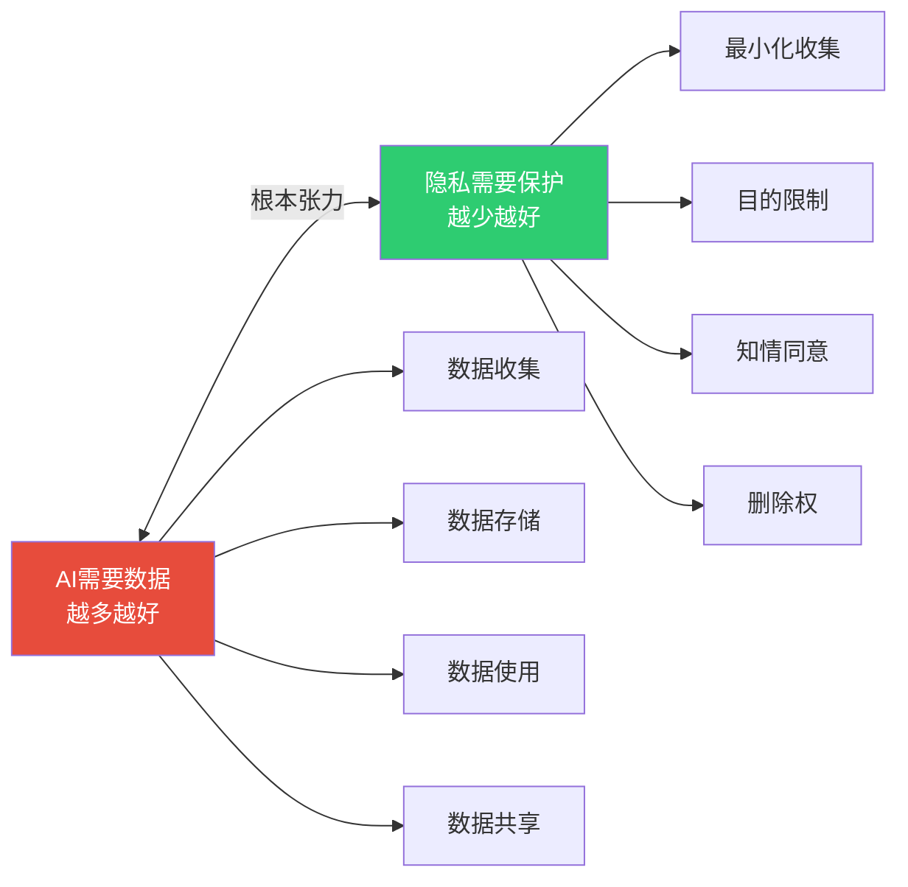
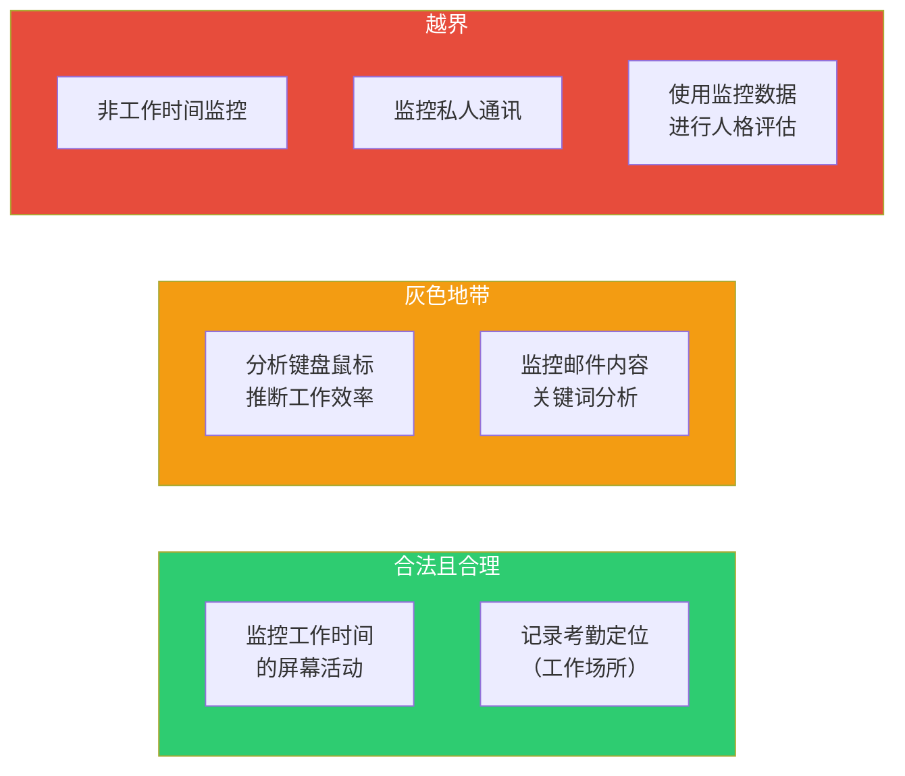
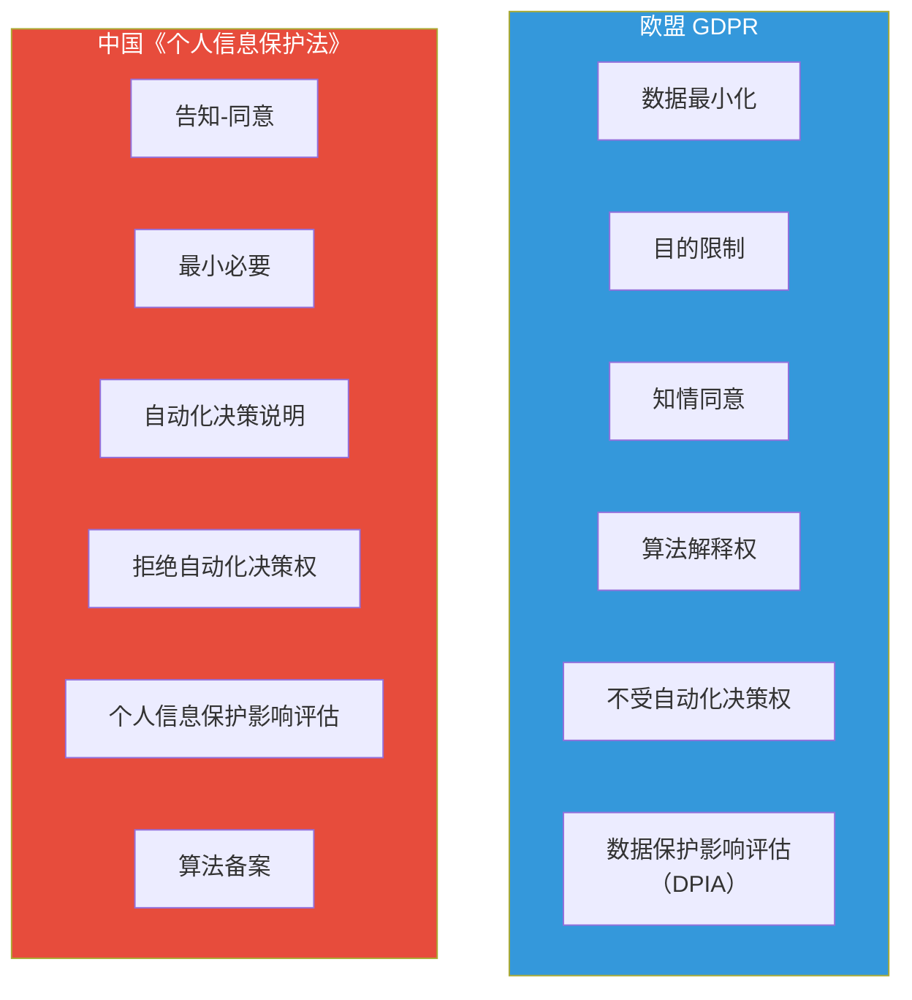
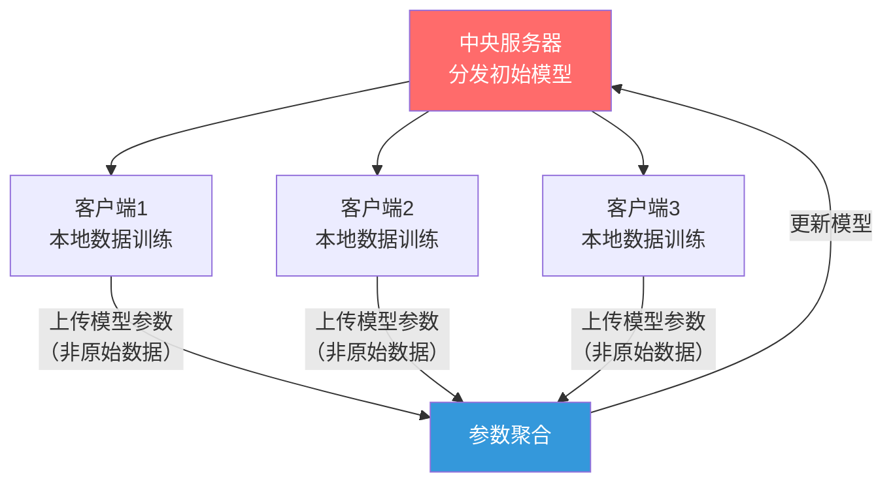

# 04 数据隐私与AI：边界的博弈

> [!quote] 核心论断
> **AI的「燃料」是数据，而数据的核心是隐私。** 在「数据驱动」和「隐私保护」之间，存在着根本性的张力。AI越智能，需要的数据越多；数据越多，隐私风险越大。这不是一个可以「解决」的问题，而是一个需要**持续博弈和动态平衡**的边界。

> [!note] 本文定位
> 本文探讨AI与数据隐私之间的核心张力，特别关注员工数据隐私的灰色地带（AI监控/AI情绪分析/AI离职预测），以及GDPR和《个人信息保护法》对AI的约束。最后介绍差分隐私、联邦学习等隐私保护技术方案。

---

## 一、「数据驱动」与「隐私保护」的根本张力

> [!important] 核心矛盾
> AI的进步依赖于海量数据，而隐私保护的核心原则是「数据最小化」。这两个目标在根本上是冲突的。AI隐私治理的核心不是「完全保护隐私」（这会让AI无法运行），也不是「完全开放数据」（这会侵犯隐私），而是**在两者之间找到合法、合情、合理的边界**。

---

## 二、AI训练数据中的隐私问题

### 2.1 训练数据中的隐私风险类型

| 风险类型 | 描述 | 案例 |
|----------|------|------|
| **直接泄露** | 训练数据中包含可直接识别个人的信息 | 简历中包含姓名、电话、身份证号 |
| **间接推断** | AI从看似无害的数据中推断出敏感信息 | 从社交媒体点赞推断性取向、政治倾向 |
| **成员推断攻击** | 攻击者可以判断某个人是否在训练数据中 | 判断某人的医疗记录是否在AI训练数据中 |
| **模型反演** | 从模型参数中反向重建训练数据 | 从人脸识别模型中重建训练数据中的人脸 |
| **模型记忆** | 大语言模型「记住」了训练数据中的具体内容 | ChatGPT可能输出训练数据中的电话号码、地址 |

### 2.2 HR领域的训练数据隐私风险

**HR AI系统的训练数据通常包含**：
- 候选人和员工的个人信息（姓名、年龄、联系方式）
- 简历中的教育背景、工作经历
- 面试视频和录音
- 绩效评估数据
- 薪酬数据
- 培训和发展记录
- 离职面谈记录

> [!danger] 极高风险
> HR数据是**最敏感的AI训练数据之一**。它包含了大量个人可识别信息（PII），而且数据集中度极高——一家公司的HR系统可能包含所有员工和候选人的完整数据。

---

## 三、员工数据隐私的灰色地带

### 3.1 AI员工监控

**现状**：越来越多的企业使用AI监控员工的工作行为，包括：
- 屏幕活动监控
- 键盘/鼠标操作分析
- 电子邮件和即时通讯内容分析
- 上网行为监控
- 位置追踪（考勤打卡、GPS定位）

**伦理边界**：

> [!warning] 关键问题
> - **知情同意**：员工是否清楚知道被监控的内容和范围？
> - **比例原则**：监控的范围和程度是否与业务需求成比例？
> - **目的限制**：监控数据是否被用于原始目的之外（如用于AI训练）？

### 3.2 AI情绪分析

**现状**：一些企业使用AI分析员工的情绪状态，通过：
- 邮件和通讯工具中的语言模式
- 视频会议中的面部表情
- 语音中的语调变化

**伦理问题**：

| 问题 | 风险 |
|------|------|
| 准确性 | AI情绪分析的准确性有限，可能误判 |
| 知情同意 | 员工是否知道自己的情绪被分析？ |
| 目的合理性 | 企业是否有权了解员工的情绪状态？ |
| 数据使用 | 情绪分析结果如何使用？是否影响绩效评估？ |
| 歧视风险 | 情绪分析结果是否可能被用于歧视性决策？ |

> [!danger] 伦理红线
> 使用AI情绪分析结果做出**影响员工职业发展的决策**（如绩效评级、晋升、解雇）是极其危险的。这不仅涉及隐私侵权，还可能导致歧视诉讼。

### 3.3 AI离职预测

**现状**：一些企业使用AI预测员工离职风险，分析因素包括：
- 工作年限和晋升频率
- 考勤模式变化
- 沟通频率变化
- 外部活动（如领英更新频率）

**伦理问题**：

| 问题 | 风险 |
|------|------|
| 数据来源 | 是否使用了员工的私人数据（如领英活动）？ |
| 预测的准确性 | 假阳性（预测离职但实际未离职）可能导致员工被不公平对待 |
| 预测的使用 | 预测结果如何使用？是用于挽留还是用于「提前准备替代」？ |
| 透明度 | 员工是否知道自己在被预测离职？ |
| 自我实现预言 | 如果员工知道自己被标记为「高风险」，是否反而加速离职？ |

> [!warning] 关键悖论
> AI离职预测的伦理困境在于：如果预测准确，它可能侵犯隐私；如果预测不准确，它可能造成不公平的对待。**无论哪种结果，都存在伦理风险。**

---

## 四、法律框架：GDPR与《个人信息保护法》对AI的约束

### 4.1 核心法律要求对比

### 4.2 对AI的关键约束

| 法律要求 | GDPR | 中国《个人信息保护法》 | 对AI的影响 |
|----------|------|----------------------|------------|
| **知情同意** | 第7条 | 第13-17条 | AI训练数据收集需要明确告知并获得同意 |
| **自动化决策** | 第22条 | 第24条 | 重大影响决策不可仅由AI做出 |
| **算法解释** | 第13-15条 | 第24条 | 个人有权要求解释AI决策 |
| **影响评估** | 第35条 | 第55-56条 | 高风险AI处理需事先评估 |
| **数据最小化** | 第5条 | 第6条 | 限制AI训练数据的收集范围 |
| **目的限制** | 第5条 | 第6条 | 训练数据不可用于原始目的之外 |

### 4.3 罚款对比

| 法规 | 最高罚款 |
|------|----------|
| GDPR | 2000万欧元 或 全球年营收的4%（取高者） |
| 中国《个人信息保护法》 | 5000万元 或 上年度营收的5%（取高者） |

> [!danger] 现实影响
> 2023年，意大利数据保护机构因ChatGPT违反GDPR而短暂封禁了OpenAI在意大利的服务。这证明**监管机构有能力和意愿采取行动**。AI隐私合规不是可选项，而是生存底线。

---

## 五、隐私保护技术方案

### 5.1 差分隐私（Differential Privacy）

**核心思想**：在数据或模型输出中加入「噪声」，使得攻击者无法判断某个个体是否在训练数据中。

**工作原理**：
- 在数据集中添加经过精心计算的随机噪声
- 保证任何个体的数据对整体统计结果的影响是「可忽略的」
- 数学上可以证明隐私保护的程度（隐私预算 epsilon）

**优点**：有严格的数学证明，隐私保护程度可量化
**缺点**：加入噪声会降低数据/模型的准确性

> [!note] 实际应用
> Apple使用差分隐私收集用户数据，Google在Chrome浏览器中使用差分隐私，美国人口普查局在2020年人口普查中使用了差分隐私。

### 5.2 联邦学习（Federated Learning）

**核心思想**：数据不出本地，模型参数在本地训练，只有模型参数（而非原始数据）被上传到中央服务器进行聚合。

**优点**：原始数据不出本地，隐私保护程度高
**缺点**：通信成本高，模型性能可能略低于集中式训练

**HR应用前景**：跨公司的AI招聘模型训练——各公司使用本地数据训练，只共享模型参数，不共享候选人和员工数据。

### 5.3 同态加密（Homomorphic Encryption）

**核心思想**：在加密数据上直接进行计算，计算结果解密后与在明文上计算的结果相同。

**优点**：数据始终处于加密状态，安全性最高
**缺点**：计算开销极大（比明文计算慢1000-1000000倍），目前难以大规模应用

### 5.4 安全多方计算（Secure Multi-Party Computation）

**核心思想**：多个参与方在不泄露各自输入的情况下，共同计算一个函数。

**HR应用前景**：薪资基准比对——多家公司在不泄露各自具体薪资数据的情况下，共同计算行业薪资中位数。

---

## 六、HR实践：数据隐私治理清单

### 6.1 AI采购前的隐私评估

- [ ] 该AI工具需要收集哪些员工/候选人数据？
- [ ] 数据收集是否遵循「最小必要」原则？
- [ ] 是否获得了数据主体的知情同意？
- [ ] 数据是否会被用于训练供应商的AI模型？
- [ ] 数据存储在哪里？是否跨境传输？
- [ ] 供应商是否提供数据删除机制？

### 6.2 AI员工监控的伦理边界清单

- [ ] 监控是否公开透明？员工是否知情？
- [ ] 监控的范围和程度是否与业务需求成比例？
- [ ] 监控数据是否被用于AI模型训练？
- [ ] 是否存在非工作时间监控？
- [ ] 是否建立了员工申诉机制？

### 6.3 数据保护影响评估（DPIA）模板

| 评估项 | 内容 |
|--------|------|
| 数据处理目的 | 描述AI系统处理数据的目的 |
| 数据类型 | 列出收集和处理的个人数据类型 |
| 数据来源 | 说明数据的来源（直接收集/第三方） |
| 法律基础 | 说明数据处理的法律依据 |
| 隐私风险 | 识别并评估隐私风险 |
| 缓解措施 | 列出降低隐私风险的措施 |
| 数据主体权利 | 说明如何保障数据主体权利 |

---

## 七、总结：数据隐私博弈的五个关键原则

1. **知情同意是底线**：任何AI数据处理都必须在数据主体知情并同意的前提下进行。
2. **最小必要是原则**：只收集AI系统运行所需的最小数据量，不收集「可能有用的」数据。
3. **目的限制是铁律**：训练数据只能用于原始收集目的，不能「顺便」用于其他AI训练。
4. **透明度是信任基础**：向员工和候选人公开AI数据处理的范围、目的和方式。
5. **技术是辅助，制度是根本**：差分隐私、联邦学习等技术是工具，但隐私保护的根本在于**制度和流程**。

---

## 八、下一步阅读

- 了解AI责任归属：[[02-AI趋势与素养/AI伦理与治理/05_AI责任归属：当AI犯错，谁负责？]]
- 了解全球AI监管政策：[[02-AI趋势与素养/AI伦理与治理/06_全球AI监管政策对比]]
- 了解HR场景的伦理实务：[[02-AI趋势与素养/AI伦理与治理/08_HR+AI的伦理特别议题]]
- 了解组织层面的AI战略：[[02-AI趋势与素养/AI Native组织变革/00_MOC_AI Native组织变革中枢]]
- 回到知识库中枢：[[02-AI趋势与素养/AI伦理与治理/00_MOC_AI伦理与治理中枢]]