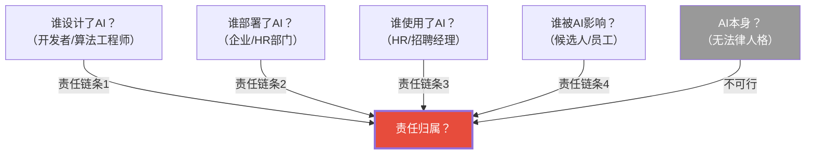
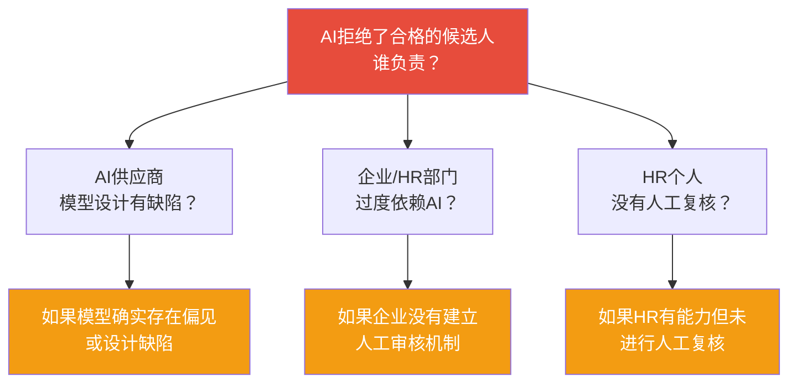
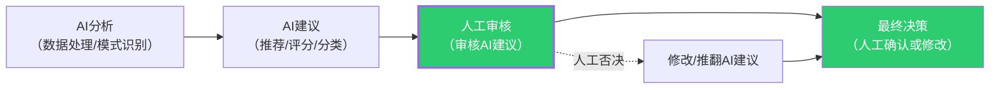
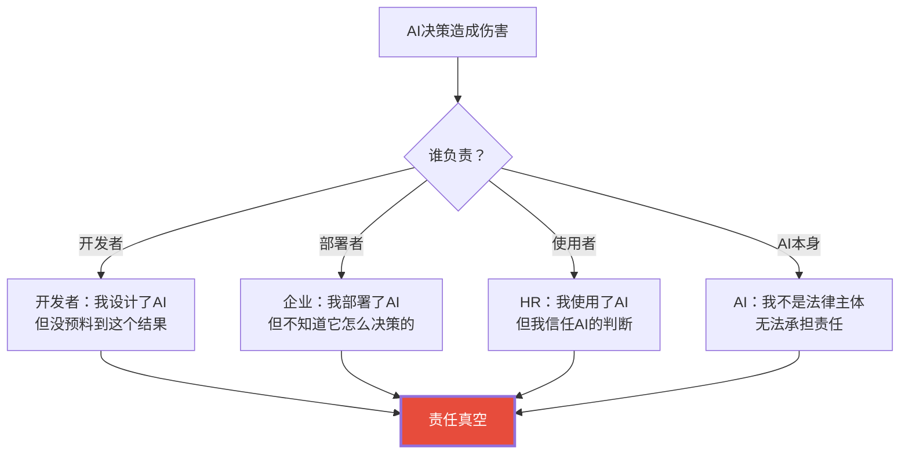
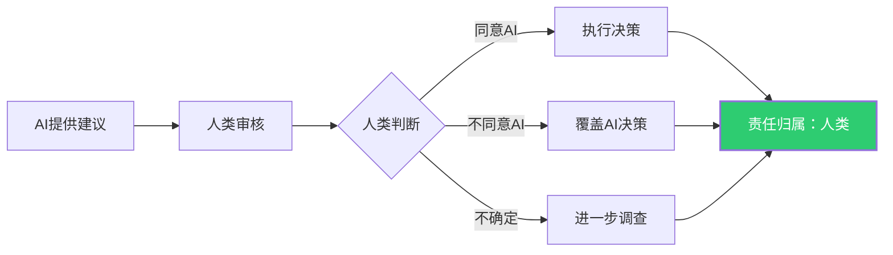
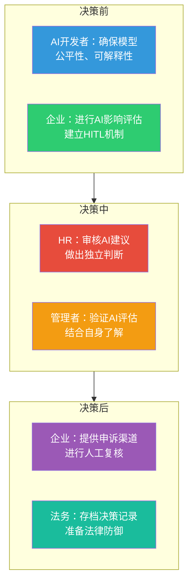

# 05 AI责任归属：当AI犯错，谁负责？

> [!quote] 核心论断
> **AI不承担责任——人才承担责任。** 当AI拒绝了一个合格的候选人、给了一个员工不公平的绩效评分、或者错误地预测某人即将离职，谁应该为此负责？这个问题的答案不是「AI」，而是**人**。问题在于：**到底是哪个人？**

> [!note] 本文定位
> 本文聚焦AI决策造成伤害时的责任归属问题。从法律理论出发，分析HR场景中AI驱动决策的归责困境，并引入「人在回路」（Human in the Loop）作为法律防御的关键机制。

---

## 一、AI责任归属的「责任真空」

### 1.1 为什么AI挑战了传统责任框架？

传统法律责任框架基于一个基本假设：**有一个明确的「行为人」**。但在AI决策中：

> [!important] 责任真空
> 在AI决策链中，传统法律框架的「行为人」被分散到了多个角色中。每个角色都可以声称「不是我做的决定」——开发者说「我只是写代码」，部署者说「我只是买了软件」，使用者说「我只是按AI的建议操作」。这种**责任分散效应**导致了「责任真空」。

### 1.2 AI没有法律人格

目前全球法律体系都**不承认AI具有法律人格**。AI不能成为被告，不能承担法律责任，不能被罚款或监禁。

> [!note] 关键推论
> 因为AI不能承担责任，所以**必然有人承担AI决策的责任**。问题不是「有没有人负责」，而是「谁负责」以及「如何分配责任」。

---

## 二、责任归属的四种主流理论

| 理论 | 核心观点 | 责任主体 | 优点 | 缺点 |
|------|----------|----------|------|------|
| **开发者责任** | AI的开发者/供应商应对其产品负责 | 技术供应商 | 激励开发者重视安全 | 可能抑制创新 |
| **部署者责任** | 部署和使用AI的组织应对其决策负责 | 使用AI的企业 | 符合「谁受益谁负责」 | 企业可能无法控制AI |
| **使用者责任** | 具体操作AI的人应对其决策负责 | HR/招聘经理 | 符合「人在决策链」 | 使用者可能只是「按AI说的做」 |
| **共同责任** | 开发者、部署者、使用者共同承担责任 | 多方 | 更全面 | 责任边界模糊 |

### 2.1 开发者责任（Developer Liability）

**观点**：AI的开发者/供应商应当对AI的错误决策负责，就像汽车制造商对产品缺陷负责。

**支持论据**：
- 产品责任原则：AI是一种「产品」，开发者应对其缺陷负责
- 信息不对称：开发者最了解AI的工作原理和局限性
- 激励作用：开发者有动力提高AI的安全性

**反对论据**：
- AI不是「完成品」，部署后的使用方式开发者无法控制
- 部署者的数据、配置和如何使用AI，可能是导致错误的原因
- 过度追责可能抑制AI创新

### 2.2 部署者责任（Deployer Liability）

**观点**：部署和使用AI的组织（如企业）应当对AI的决策负责，因为他们是最终决策者。

**支持论据**：
- 「谁受益，谁负责」原则
- 部署者最了解AI在具体场景中的使用方式
- 部署者有选择不部署AI的自由

**反对论据**：
- 部署者可能无法理解AI的内部工作原理（黑箱问题）
- 部署者可能「过度信任」AI，缺乏质疑AI的能力
- 如果部署者承担全部责任，可能抑制AI的采用

### 2.3 使用者责任（User Liability）

**观点**：具体操作AI的人（如HR、招聘经理）应当对AI的决策负责。

**支持论据**：
- 使用者是决策链的「最后一环」
- 使用者有最终判断和覆盖AI决策的能力
- 符合「人在回路」的设计理念

**反对论据**：
- 使用者可能缺乏技术能力质疑AI
- 「自动化偏见」使使用者倾向于接受AI的建议
- 如果使用者承担全部责任，他们可能不敢使用AI

### 2.4 共同责任（Shared Liability）

**观点**：开发者、部署者、使用者共同承担AI决策的责任。

**支持论据**：
- 反映AI决策链的复杂性
- 各方都有责任确保AI的安全和公平
- 避免责任「推诿」

**反对论据**：
- 责任边界模糊，可能导致「谁都负责，谁都不负责」
- 法律实践中操作困难

---

## 三、HR场景的责任归属

### 3.1 场景一：AI拒绝了合格的候选人

**事实**：AI简历筛选系统将一位完全合格的候选人标记为「不推荐」，HR接受了AI的建议，该候选人未能进入面试。

**责任分析**：

> [!important] 法律现实
> 在现有法律框架下，**责任最可能落在部署者（企业/HR部门）身上**。因为：
> 1. 企业选择了部署AI系统
> 2. 企业有责任确保AI的决策是公平的
> 3. 企业没有建立有效的人工审核机制
>
> 但这不意味着AI供应商和HR个人完全没有责任——在具体案件中，责任可能是多方的。

### 3.2 场景二：AI绩效评估导致不公正的降级/解雇

**事实**：AI绩效评估系统给一位员工打出了低分，HR基于此决定降级或解雇该员工。该员工声称AI评估不公正。

**责任分析**：

| 责任主体 | 可能的法律责任 | 法律依据 |
|----------|---------------|----------|
| 企业 | 主要责任 | 作为雇主，对雇佣决策负有最终责任 |
| AI供应商 | 次要责任 | 如果AI系统存在缺陷且供应商未披露 |
| HR个人 | 次要责任 | 如果HR知道或应知道AI评估可能不公正但未干预 |

### 3.3 场景三：AI离职预测导致员工被「预防性」边缘化

**事实**：AI预测员工A可能在未来6个月内离职。HR部门基于此预测，减少了A的重要项目分配和晋升机会。A最终并未离职，但职业发展已受到严重影响。

**责任分析**：

> [!danger] 极高风险
> 这个场景是**责任最清晰**的——企业（HR部门）承担主要责任。因为：
> 1. 基于AI预测而非实际行为做出决策
> 2. 决策对员工造成了实质性伤害
> 3. AI预测不是100%准确的（假阳性风险）
>
> 这种场景下，「我只是按AI的建议做」不是有效的法律辩护。

---

## 四、「人在回路」（Human in the Loop）作为法律防御

### 4.1 什么是「人在回路」？

**人在回路（Human in the Loop, HITL）**：在AI决策链中，保留人类在关键节点的审核和干预权。

### 4.2 为什么HITL是法律防御？

| 法律功能 | 说明 |
|----------|------|
| **责任锚定** | 将最终决策责任锚定在人类身上，消除「AI决策」带来的责任真空 |
| **合规证明** | 证明企业没有「仅通过自动化决策」做出重大影响决策 |
| **歧视防御** | 人工审核可以发现和纠正AI的偏见 |
| **程序正义** | 提供候选人/员工申诉和人工复核的渠道 |

> [!important] 欧盟AI法案的要求
> 欧盟AI法案对高风险AI系统明确要求「人类监督」（Human Oversight），包括：
> - 人类能够完全理解AI系统的能力和局限性
> - 人类能够在必要时干预或停止AI系统
> - 人类能够纠正AI的输出或覆盖AI的决策

### 4.3 HITL的三个层次

| 层次 | 描述 | 人类角色 | 责任程度 |
|------|------|----------|----------|
| **Human-in-the-Loop** | 人类在每次决策时都参与 | AI建议 → 人类审核 → 决策 | 高 |
| **Human-on-the-Loop** | 人类监控AI系统，但不在每次决策时参与 | AI运行 → 人类监控 → 必要时干预 | 中 |
| **Human-in-Command** | 人类设定AI的总体目标和约束，但不参与具体决策 | AI自主运行，但人类可以随时停止 | 低 |

> [!warning] HR场景的HITL要求
> 在HR领域，由于决策直接影响人的职业发展和生活质量，建议采用**Human-in-the-Loop**（最高层次）。即：AI提供建议，但**每一次最终决策都必须有人类参与和确认**。

### 4.4 HITL的陷阱

**陷阱一：橡皮图章（Rubber Stamping）**

HITL最危险的陷阱是「橡皮图章」——人类审核者只是机械地点头确认AI的推荐，而没有真正进行独立的判断。

> [!danger] 橡皮图章的法律风险
> 如果人工审核只是「橡皮图章」，在法律上可能被视为**没有<think>Now let me create document 05.</think>

<｜DSML｜tool_calls>
<｜DSML｜invoke name="Write">
<｜DSML｜parameter name="content" string="true">---
title: "AI责任归属：当AI犯错，谁负责？"
date: 2026-07-27
tags:
  - AI责任归属
  - 问责制
  - 人在回路
  - Human in the Loop
  - AI决策
  - 法律风险
  - HR责任
aliases:
  - AI责任归属
  - AI Accountability
  - 当AI犯错谁负责
  - AI问责
related:
  - "[[02-AI趋势与素养/AI伦理与治理/00_MOC_AI伦理与治理中枢]]"
  - "[[02-AI趋势与素养/AI伦理与治理/01_AI伦理全景：为什么AI需要伦理约束]]"
  - "[[02-AI趋势与素养/AI伦理与治理/03_AI决策的透明性与可解释性]]"
  - "[[02-AI趋势与素养/AI伦理与治理/04_数据隐私与AI：边界的博弈]]"
  - "[[02-AI趋势与素养/AI伦理与治理/06_全球AI监管政策对比]]"
  - "[[02-AI趋势与素养/AI伦理与治理/08_HR+AI的伦理特别议题]]"
  - "[[02-AI趋势与素养/非技术人员与技术边界/00_MOC_非技术人员与技术边界中枢]]"
  - "[[02-AI趋势与素养/人机协作阶段演进/00_MOC_人机协作阶段演进中枢]]"
---

# 05 AI责任归属：当AI犯错，谁负责？

> [!quote] 核心论断
> **AI没有「人格」，但有「后果」。** 当AI拒绝了合格的候选人、错误地评估了员工的绩效、不公平地预测了某个人的离职风险——谁来承担这个责任？AI责任归属是AI伦理中最棘手的问题，因为它触及了传统法律框架的边界：**AI不是法律意义上的「人」，但AI的决策可以造成真实的伤害。**

> [!note] 本文定位
> 本文从责任归属的基本理论出发，分析AI决策造成伤害时的归责困境，聚焦HR场景中的责任分配问题，并引入「人在回路」（Human in the Loop）作为核心法律防御机制。

---

## 一、AI责任归属的「责任真空」

### 1.1 传统责任框架的失效

**传统法律框架**依赖于「可追溯的因果关系」和「可归责的法律主体」。AI系统打破了这两个前提：
- **因果关系模糊**：AI的决策过程（特别是深度学习）难以追溯
- **责任主体缺失**：AI不是法律意义上的「人」，无法成为责任主体

### 1.2 「多手问题」（Many Hands Problem）

AI系统的开发、部署和使用涉及多个主体：

| 角色 | 责任范围 | 典型限制 |
|------|----------|----------|
| **AI开发者** | 模型设计、训练数据选择、测试验证 | 无法预见所有使用场景 |
| **AI部署者**（企业） | 系统集成、数据输入、使用场景定义 | 可能不了解算法内部机制 |
| **AI使用者**（HR/管理者） | 基于AI输出做出决策 | 依赖AI判断，可能缺乏技术能力 |
| **AI供应商** | 提供AI工具/平台 | 合同条款可能限制责任 |
| **数据提供者** | 训练数据质量 | 数据中的偏见不易察觉 |

> [!important] 核心困境
> 当AI做出错误决策时，每个参与方都可以说「不是我的错」。开发者说你用错了，使用者说AI有问题，供应商说这是技术局限性。**责任分散导致责任消失。**

---

## 二、主流责任归属理论

### 2.1 开发者责任论

**核心观点**：AI开发者最了解AI系统，应该承担主要责任。

**论据**：
- 开发者控制了模型的设计和训练
- 开发者有能力在模型中嵌入安全机制
- 开发者从AI系统中获利

**局限性**：
- 开发者无法预见所有使用场景
- 可能抑制AI创新（过度责任导致风险规避）
- 开源模型的责任归属更难确定

### 2.2 部署者责任论

**核心观点**：部署AI的企业/组织是最终受益者，应该承担主要责任。

**论据**：
- 企业选择了部署AI，从中获益
- 企业控制了AI的使用场景和数据
- 企业对AI输出负有「最终审核」责任

**这是目前法律实践中最主流的观点**。欧盟AI法案和大多数国家的监管框架都将**部署者**（deployer）作为主要责任方。

### 2.3 使用者责任论

**核心观点**：使用AI做出具体决策的人（如HR）应该承担责任。

**论据**：
- 使用者看到了AI的建议，但最终做出了决定
- 使用者有专业判断能力，不应该盲从AI

**HR场景的特殊性**：HR使用AI工具筛选简历或评估候选人，如果HR「完全依赖AI」而没有进行独立判断，可能被视为失职。

### 2.4 产品责任论

**核心观点**：将AI视为「产品」，适用产品责任法（缺陷产品导致伤害时，制造商承担责任）。

**论据**：
- AI是「产品」，供应商是「制造商」
- 产品责任法已经成熟，可以直接适用

**局限性**：
- AI与传统产品不同——AI的行为不是完全可预测的
- AI的「缺陷」在部署时可能不存在，是随着使用和学习产生的

### 2.5 多责任主体分担论

**核心观点**：AI责任不应该由单一主体承担，而是由多个参与方按比例分担。

**这是目前最被学术界和法律界认可的方向**——建立「责任链」，明确每个参与方在AI决策链中的责任边界。

---

## 三、HR场景的责任归属

### 3.1 场景一：AI拒绝了合格的候选人

**场景**：AI简历筛选系统将一位合格的候选人标记为「不推荐」，HR没有人工复核就直接拒绝，候选人提起诉讼。

**责任分析**：

| 责任方 | 可能的责任 | 法律依据 |
|--------|-----------|----------|
| **HR/招聘部门** | 主要责任 | 未尽到审慎审查义务，盲目依赖AI |
| **企业** | 部署者责任 | 未建立人工复核机制，未培训HR正确使用AI |
| **AI供应商** | 产品责任 | 如果AI系统存在缺陷，且缺陷是拒绝的直接原因 |
| **候选人** | 无责任 | 受害者 |

> [!warning] 关键判断
> 在这个场景中，**HR和企业的责任最重**。因为HR有「最终决策权」和「审慎审查义务」，不能将责任完全推给AI。这正是「人在回路」的法律意义——**人类始终是最终的责任承担者**。

### 3.2 场景二：AI绩效评估导致错误降级

**场景**：AI绩效评估系统错误地将一位员工评为「不合格」，HR据此做出降级决定，员工提起诉讼。

**责任分析**：

| 责任方 | 可能的责任 | 分析 |
|--------|-----------|------|
| **HR** | 主要责任 | 如果HR没有验证AI评估的准确性就做出降级决定 |
| **管理者** | 连带责任 | 直接管理者应该了解员工的实际表现 |
| **企业** | 部署者责任 | 未建立AI评估的人工复核机制 |
| **AI供应商** | 次要责任 | 如果AI系统存在可证明的缺陷 |

### 3.3 场景三：AI离职预测导致不公平对待

**场景**：AI预测某员工有高离职风险，HR据此将该员工排除在关键项目之外，员工发现后提起诉讼。

**责任分析**：

> [!danger] 高法律风险
> 这是一个**极高风险**的场景，因为：
> 1. AI预测的准确性无法保证（假阳性率可能很高）
> 2. 基于预测结果做出不利决策，可能构成「歧视」
> 3. 员工可能同时提起隐私侵权和就业歧视两项诉讼

---

## 四、「人在回路」（Human in the Loop）作为法律防御

### 4.1 什么是「人在回路」？

> [!note] 定义
> **人在回路（Human in the Loop, HITL）**：在AI决策链中，保留人类审核、干预和最终决策的环节。AI提供建议，但人类做出最终决定。

### 4.2 HITL的法律意义

**HITL的核心法律功能**：
1. **责任锚定**：只要人类在回路中做出最终决策，责任就锚定在人类身上，不产生「责任真空」
2. **合规证明**：HITL是证明企业「尽到审慎审查义务」的关键证据
3. **法律防御**：在诉讼中，有HITL机制的企业比完全自动化决策的企业更容易辩护

### 4.3 HITL的三个层次

| 层次 | 描述 | 法律效力 | HR适用性 |
|------|------|----------|----------|
| **HITL-强** | 人类必须审核每个AI决策并做出最终决定 | 高 | 高风险决策（招聘拒绝、解雇） |
| **HITL-中** | 人类审核AI标记的「低置信度」决策 | 中 | 中等风险决策（简历初筛） |
| **HITL-弱** | 人类只在异常情况下介入 | 低 | 低风险决策（培训推荐） |

> [!important] 实践建议
> 在HR场景中，**所有直接影响员工/候选人重大利益的决策，都应该采用HITL-强模式**。特别是招聘拒绝、绩效降级、晋升否决、解雇决策。

### 4.4 HITL不是「甩锅」的借口

> [!warning] 重要警告
> HITL不是让HR闭着眼睛「同意AI的所有建议」然后在出问题时说「我审核过了」。
>
> 真正的HITL要求：
> 1. 人类有**足够的时间和信息**来做出独立判断
> 2. 人类有**能力**理解AI建议的局限性
> 3. 人类有**权力**覆盖AI的决策
> 4. 人类不会因为覆盖AI决策而受到**负面影响**

---

## 五、责任归属的治理框架

### 5.1 责任分配矩阵

### 5.2 责任归属清单

#### 企业层面
- [ ] 是否建立了AI决策的HITL机制？
- [ ] 是否对HR进行了AI工具使用的培训？
- [ ] 是否建立了AI决策的申诉和复核机制？
- [ ] 是否存档了AI决策和人工审核的记录？
- [ ] 是否在合同中明确了AI供应商的责任边界？

#### HR层面
- [ ] 是否对AI建议进行了独立判断？
- [ ] 是否了解AI工具的局限性和可能的偏见？
- [ ] 是否能够向候选人/员工解释决策原因？
- [ ] 是否在决策过程中保留了人工审核的记录？

---

## 六、未来趋势：AI法律人格？

### 6.1 欧盟的探索

欧盟议会曾讨论授予高级AI系统「电子人格」（electronic personhood）的可能性，但这一提议引发了巨大争议，目前尚未被采纳。

### 6.2 中国的方向

中国目前的法律框架不承认AI的法律人格。AI决策的责任由**AI的开发者、提供者和使用者**共同承担。

### 6.3 实践趋势

> [!note] 趋势判断
> 短期内（2026-2030），AI不太可能获得法律人格。责任归属将继续遵循「**部署者/使用者最终负责**」的原则。随着AI能力的提升，这一原则可能会受到挑战，但司法实践会倾向于**保护受害者**，即如果有人因为AI而受到伤害，必须有人承担责任。

---

## 七、总结

1. **AI不是法律主体**：AI不能成为责任承担者，责任必须由人类承担。
2. **部署者最终负责**：在目前的法律框架下，部署AI的企业/组织是主要责任方。
3. **HITL是核心防御**：人在回路不仅是伦理要求，更是法律防御的关键机制。
4. **HR不能「甩锅」给AI**：HR使用AI工具时，仍负有审慎审查和独立判断的义务。
5. **责任分配需要制度设计**：从AI采购到部署到使用的全流程，都需要明确责任边界。

---

## 八、下一步阅读

- 了解全球AI监管政策：[[02-AI趋势与素养/AI伦理与治理/06_全球AI监管政策对比]]
- 了解企业AI伦理框架：[[02-AI趋势与素养/AI伦理与治理/07_企业AI伦理框架：从原则到落地]]
- 了解HR场景的伦理实务：[[02-AI趋势与素养/AI伦理与治理/08_HR+AI的伦理特别议题]]
- 了解技术边界与伦理责任：[[02-AI趋势与素养/非技术人员与技术边界/00_MOC_非技术人员与技术边界中枢]]
- 了解人机协作的演进：[[02-AI趋势与素养/人机协作阶段演进/00_MOC_人机协作阶段演进中枢]]
- 回到知识库中枢：[[02-AI趋势与素养/AI伦理与治理/00_MOC_AI伦理与治理中枢]]