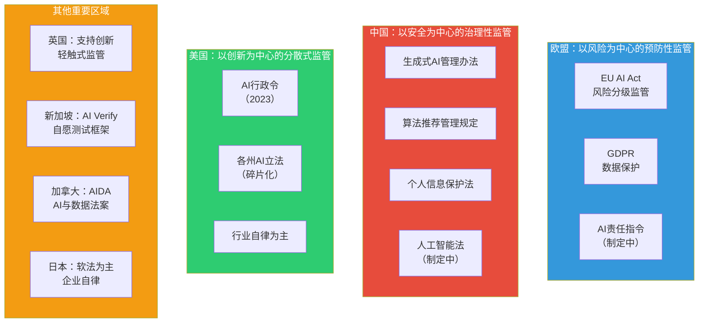
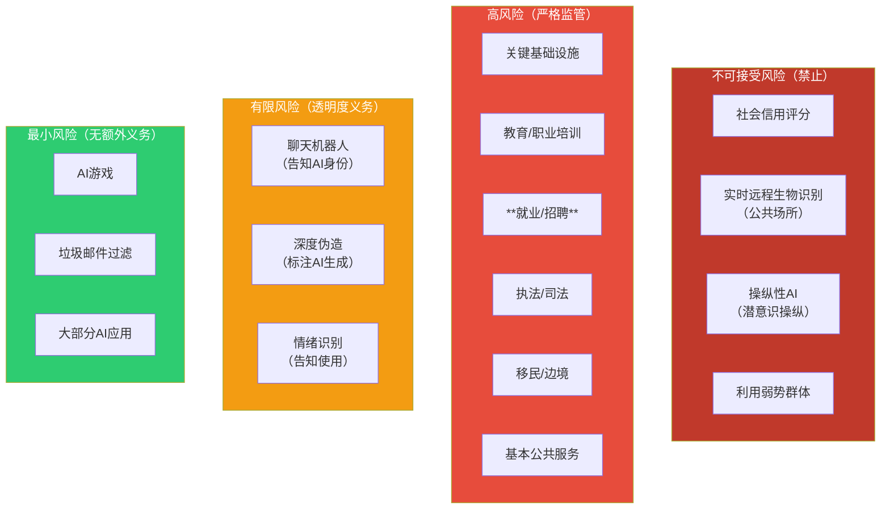
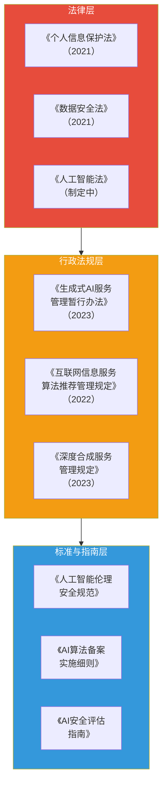
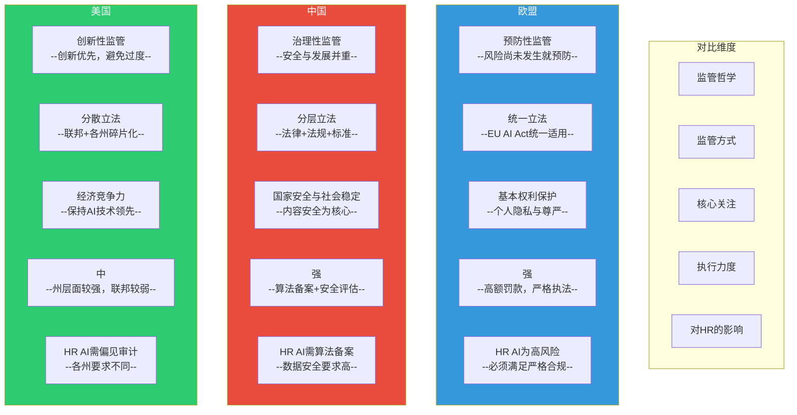

# 06 全球AI监管政策对比

> [!quote] 核心论断
> **AI监管正在从「各自为政」走向「全球竞合」。** 欧盟用「风险分级」建立规则，中国用「算法备案+内容安全」建立秩序，美国在「创新与安全」之间摇摆。对跨国企业来说，理解不同区域的AI监管差异，不是「可选项」，而是**合规生存的必修课**。

> [!note] 本文定位
> 本文系统对比欧盟、中国、美国三地的AI监管政策，分析各自的核心逻辑、关键差异和发展趋势，特别关注2025-2026年的最新政策动态。为企业在不同区域部署AI提供合规参考。

---

## 一、全球AI监管格局总览

---

## 二、欧盟AI法案：全球首个综合性AI监管框架

### 2.1 风险分级体系

欧盟AI法案（EU AI Act）于2024年正式通过，是**全球首个综合性AI监管法律**。其核心是**风险分级监管**：

### 2.2 高风险AI系统的合规要求

> [!important] HR领域的特殊地位
> 欧盟AI法案将**就业、员工管理和自雇职业相关的AI系统**明确列为**高风险**。这意味着所有AI招聘、AI绩效评估、AI员工管理工具都必须满足严格的高风险合规要求。

高风险AI系统的**七项核心要求**：

| 要求 | 说明 | HR应用影响 |
|------|------|-----------|
| **风险管理** | 建立全生命周期风险管理体系 | 需要AI影响评估流程 |
| **数据治理** | 训练数据必须相关、有代表性、无偏见 | 必须审计训练数据的公平性 |
| **技术文档** | 详细记录系统设计、开发、测试 | 需要维护完整的技术文档 |
| **透明度** | 向用户提供清晰的使用说明 | 候选人/员工必须被告知AI使用 |
| **人类监督** | 设计有效的HITL机制 | 必须有人工审核和覆盖机制 |
| **准确性** | 确保系统的准确性和鲁棒性 | 需要定期测试和校准 |
| **记录保存** | 自动记录AI决策日志 | 需要保存决策记录以备审计 |

### 2.3 罚款体系

| 违规类型 | 最高罚款 |
|----------|----------|
| 使用禁止的AI应用 | 3500万欧元 或 全球年营收的7%（取高者） |
| 违反高风险AI要求 | 1500万欧元 或 全球年营收的3%（取高者） |
| 向监管机构提供错误信息 | 750万欧元 或 全球年营收的1.5%（取高者） |

> [!danger] 注意
> 罚款是基于**全球年营收**计算的，不是欧洲营收。这意味着即使是一家中国或美国公司，只要在欧盟市场运营，就可能面临基于全球营收的巨额罚款。

### 2.4 实施时间表

| 时间节点 | 要求 |
|----------|------|
| 2025年2月 | 禁止的AI应用条款生效 |
| 2025年8月 | 通用AI（GPAI）规则生效 |
| 2026年8月 | 高风险AI系统要求全面生效 |
| 2027年8月 | 特定高风险AI系统的过渡期结束 |

---

## 三、中国AI监管框架

### 3.1 监管体系

### 3.2 中国AI监管的核心特点

| 特点 | 说明 |
|------|------|
| **安全优先** | 国家安全、社会安全、个人权益保护是核心目标 |
| **算法备案** | 具有舆论属性或社会动员能力的AI服务必须备案 |
| **内容安全** | 生成式AI必须确保输出内容符合法律法规和社会主义核心价值观 |
| **分级分类** | 正在建立AI系统的分级分类监管体系 |
| **数据安全** | 与《数据安全法》和《个人信息保护法》紧密衔接 |
| **伦理审查** | 2024年《人工智能法（草案）》引入AI伦理审查制度 |

### 3.3 生成式AI管理办法关键要求

2023年发布的《生成式人工智能服务管理暂行办法》是中国AI监管的里程碑：

| 要求 | 具体内容 |
|------|----------|
| **安全评估** | 上线前进行安全评估 |
| **算法备案** | 向网信部门进行算法备案 |
| **内容责任** | 服务提供者对生成内容承担生产者责任 |
| **训练数据** | 使用具有合法来源的数据，不侵犯知识产权 |
| **用户保护** | 保护用户个人信息，不得收集非必要信息 |
| **透明度** | 向用户告知服务由AI提供 |

### 3.4 2024-2026年最新动态

- **2024年**：《人工智能法（草案）》发布，引入AI伦理审查和分级分类监管
- **2025年**：多个AI相关标准发布，AI安全评估体系建立
- **2026年**：AI监管执法力度加强，多个AI产品被要求整改

---

## 四、美国AI监管现状

### 4.1 监管特点

美国AI监管的特点是**分散、行业化、创新优先**：

| 特点 | 说明 |
|------|------|
| **联邦层面** | 以行政令和指南为主，缺乏统一的联邦立法 |
| **州层面** | 各州独立立法，碎片化——科罗拉多、纽约、加州等已出台AI法案 |
| **行业自律** | 强调企业自愿承诺和行业自律 |
| **创新优先** | 避免过度监管抑制AI创新 |
| **安全测试** | 要求最强大的AI模型进行安全测试 |

### 4.2 2023年AI行政令

拜登政府2023年发布的AI行政令是美国联邦层面最重要的AI监管文件：

- 要求最强大的AI模型开发者通知政府并进行安全测试
- 建立AI安全标准
- 关注AI对就业市场的影响
- 强调AI公平性和公民权利保护

### 4.3 各州AI立法

| 州 | 主要立法 | 关键内容 |
|----|----------|----------|
| 科罗拉多 | AI消费者保护法 | 高风险AI系统的透明度要求 |
| 纽约 | AI招聘工具审计法 | 使用AI招聘工具必须进行偏见审计 |
| 加州 | 多项AI相关法案 | 隐私、安全、深度伪造等 |
| 伊利诺伊 | AI视频面试法 | AI面试的知情同意和透明度要求 |

> [!important] 纽约州AI招聘审计法
> 2023年实施的纽约市第144号地方法案要求：使用AI招聘工具的企业必须进行**年度偏见审计**，并向候选人告知AI的使用。这为HR领域的AI监管树立了标杆。

---

## 五、三大监管体系的对比

### 核心对比表

| 维度 | 欧盟 | 中国 | 美国 |
|------|------|------|------|
| **核心理念** | 基本权利保护 | 安全与发展并重 | 创新优先 |
| **监管模式** | 风险分级（Risk-based） | 分类分级+算法备案 | 行业自律+州级立法 |
| **主要法规** | EU AI Act | 生成式AI管理办法 | AI行政令+各州法律 |
| **HR AI定位** | 高风险 | 具有一定影响 | 需偏见审计（纽约等） |
| **最高罚款** | 全球营收7% | 上年营收5% | 各州不同 |
| **执法力度** | 强 | 强 | 中等 |
| **国际影响** | 布鲁塞尔效应 | 区域性影响 | 科技企业引领 |

---

## 六、2026年最新政策动态

### 6.1 欧盟

- EU AI Act高风险系统要求全面生效（2026年8月）
- AI责任指令立法推进中
- 通用AI（GPAI）行为准则制定中

### 6.2 中国

- 《人工智能法》立法进程加速，预计2026-2027年通过
- AI安全评估标准体系进一步完善
- 算法备案制度覆盖面扩大

### 6.3 美国

- 联邦AI立法在国会争论中，2026年可能取得突破
- 更多州出台AI相关法案
- AI安全研究机构（AISI）扩展职能

### 6.4 全球趋势

1. **监管趋同**：三地的监管框架虽然路径不同，但在**透明度、公平性、人类监督**方面趋同
2. **执法加强**：从「立法」阶段进入「执法」阶段，处罚案例增多
3. **HR AI受关注**：HR领域AI应用成为各监管体系的重点关注对象

---

## 七、企业合规建议

### 7.1 跨国企业的AI合规策略

| 市场 | 合规重点 |
|------|----------|
| 欧盟 | 满足EU AI Act高风险要求，HR AI必须建立完整合规体系 |
| 中国 | 完成算法备案，确保数据安全合规，内容安全 |
| 美国 | 关注纽约州等关键州的AI法案，进行偏见审计 |

### 7.2 合规清单

- [ ] 是否了解AI系统在各地监管框架下的风险等级？
- [ ] 是否建立了HR AI的偏见审计机制？
- [ ] 是否满足透明度和知情同意要求？
- [ ] 是否建立了HITL机制？
- [ ] 是否保存了AI决策记录以备审计？
- [ ] 是否跟踪了各地AI监管政策的最新变化？

---

## 八、总结

1. **欧盟是规则制定者**：EU AI Act是全球AI监管的标杆，具有「布鲁塞尔效应」。
2. **中国是秩序建设者**：以算法备案和安全评估为核心，强调安全与发展并重。
3. **美国是创新保护者**：在创新与监管之间寻找平衡，但州级立法正在加速。
4. **HR AI是监管重点**：三地都将HR领域的AI应用列为重点关注对象。
5. **合规是竞争优势**：在AI监管趋严的背景下，合规能力将成为企业的核心竞争力。

---

## 九、下一步阅读

- 了解企业AI伦理框架：[[02-AI趋势与素养/AI伦理与治理/07_企业AI伦理框架：从原则到落地]]
- 了解HR场景的伦理实务：[[02-AI趋势与素养/AI伦理与治理/08_HR+AI的伦理特别议题]]
- 了解数据隐私与AI：[[02-AI趋势与素养/AI伦理与治理/04_数据隐私与AI：边界的博弈]]
- 了解AI责任归属：[[02-AI趋势与素养/AI伦理与治理/05_AI责任归属：当AI犯错，谁负责？]]
- 回到知识库中枢：[[02-AI趋势与素养/AI伦理与治理/00_MOC_AI伦理与治理中枢]]