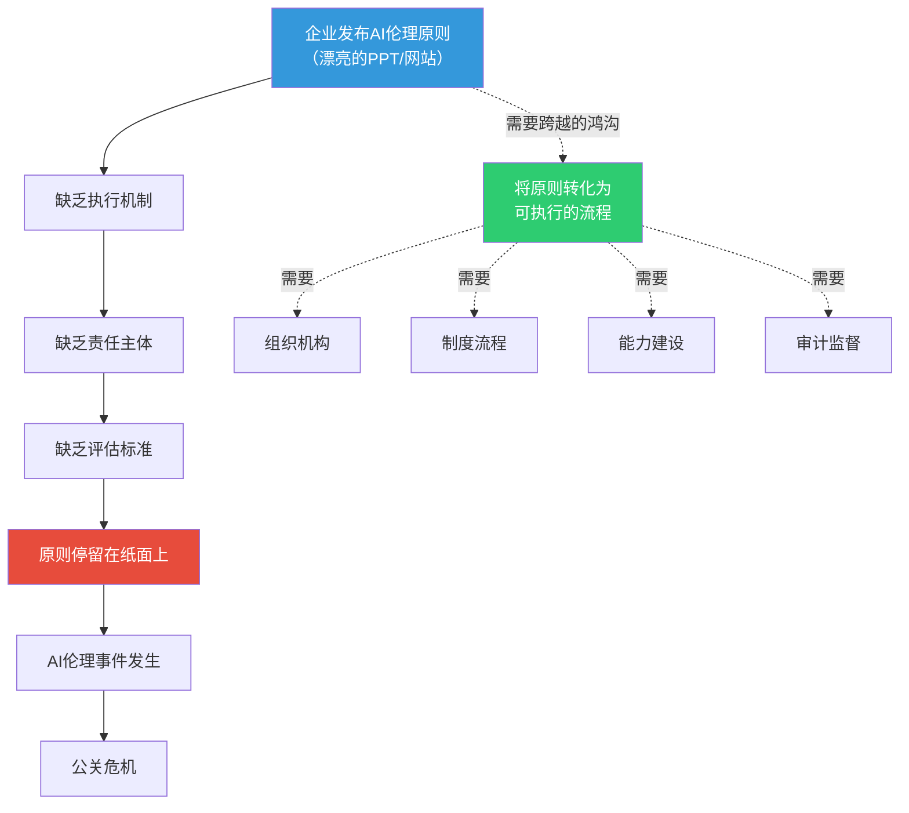
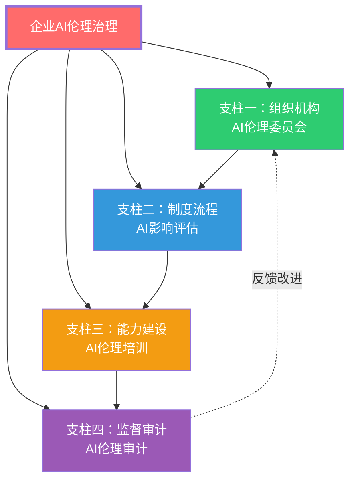
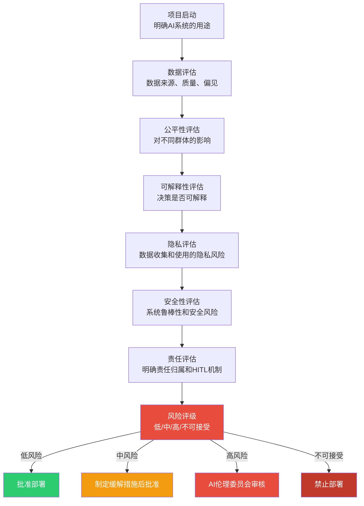
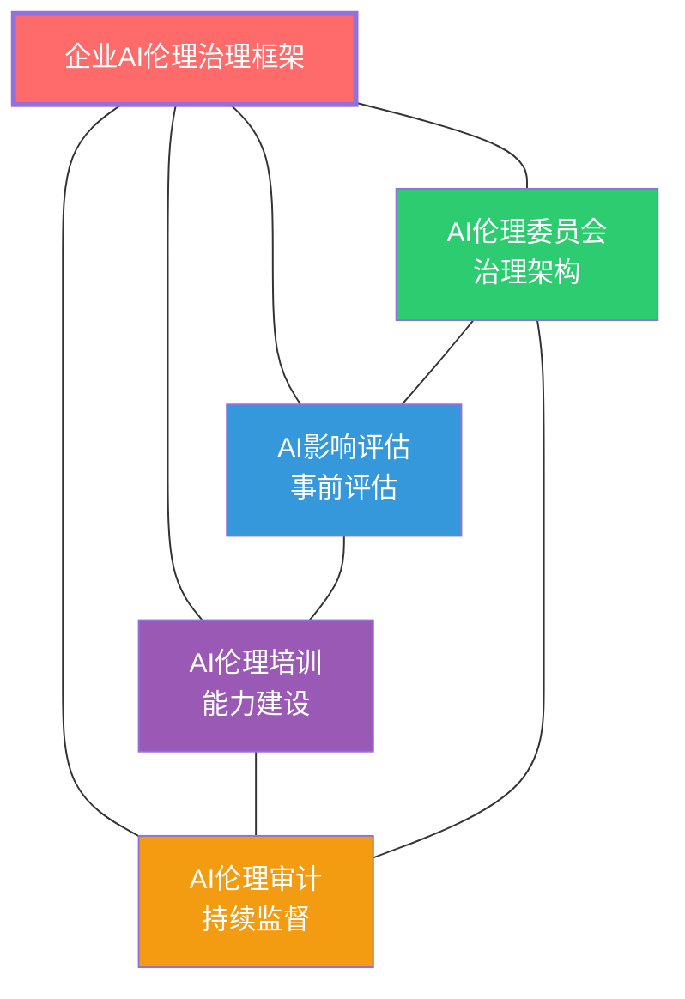
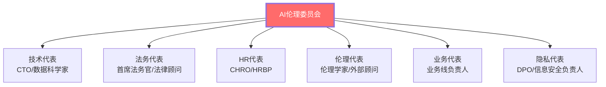
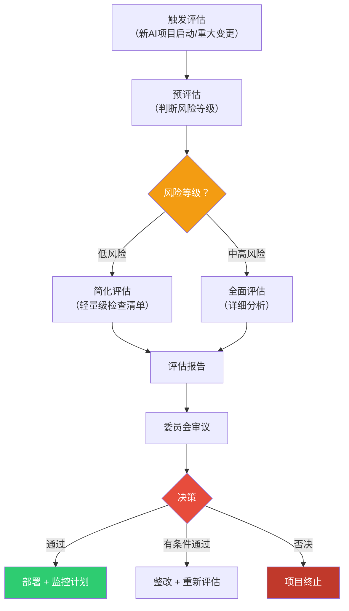
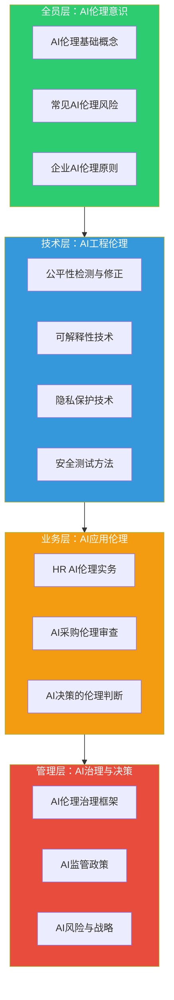
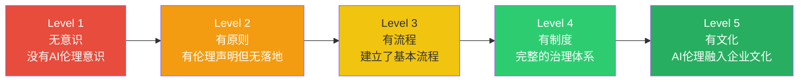

# 07 企业AI伦理框架：从原则到落地

> [!quote] 核心论断
> **AI伦理原则写得再好，如果不能落地，就是一张废纸。** 企业AI伦理治理的真正挑战不是「确立原则」——而是「让原则变成流程、让流程变成习惯、让习惯变成文化」。本文提供从原则到落地的完整路径。

> [!note] 本文定位
> 本文从企业实操角度出发，构建AI伦理治理的框架：AI伦理委员会、AI影响评估、AI伦理培训、AI伦理审计。同时对比Google、微软、IBM的AI伦理原则，为不同规模和行业的企业提供可参考的落地路径。

---

## 一、从「原则」到「落地」的鸿沟

### 1.1 为什么大多数AI伦理原则没有落地？

### 1.2 落地失败的主要原因

| 原因 | 表现 |
|------|------|
| **缺乏所有权** | 没有人对AI伦理负责 |
| **缺乏流程** | 原则没有转化为具体的操作流程 |
| **缺乏能力** | 员工不知道如何在实际工作中应用伦理原则 |
| **缺乏激励** | 遵守伦理原则没有奖励，违反也没有惩罚 |
| **缺乏监督** | 没有独立的审计机制来验证原则的落实情况 |

---

## 二、企业AI伦理治理框架

### 2.1 四支柱模型

### 2.2 支柱一：AI伦理委员会

**组成建议**：

| 角色 | 职责 | 来自部门 |
|------|------|----------|
| 主席 | 统筹AI伦理治理 | 高管层（CXO级别） |
| 技术委员 | 评估AI技术风险 | 技术/数据/AI部门 |
| 业务委员 | 评估业务场景风险 | 各业务部门 |
| 法务委员 | 评估法律合规风险 | 法务/合规部门 |
| 人力委员 | 评估HR和员工权益影响 | HR部门 |
| 伦理专家 | 提供伦理专业意见 | 外部顾问或内部 |
| 用户代表 | 反映用户/候选人视角 | 外部或跨部门 |

**核心职责**：

1. **制定和修订**企业AI伦理原则和政策
2. **审核**高风险AI项目的AI影响评估报告
3. **决策**是否批准AI系统的部署
4. **监督**AI系统的运行和伦理合规
5. **处理**AI伦理相关的投诉和事件

> [!warning] 关键提醒
> AI伦理委员会必须有**实权**，而不是「花瓶」。如果委员会只有建议权没有决策权，它的存在就是形式主义。委员会必须有权**叫停**不符合伦理标准的AI项目。

### 2.3 支柱二：AI影响评估（AIA）

**AI影响评估（AI Impact Assessment）**是AI伦理治理的**核心流程**，类似于隐私影响评估（PIA），但覆盖更广。

**AIA评估维度**：

| 维度 | 评估问题 |
|------|----------|
| **公平性** | AI对不同群体的影响是否公平？是否存在偏见？ |
| **可解释性** | AI的决策能否被理解？能否向受影响者解释？ |
| **隐私** | 数据收集和使用是否合规？是否侵犯隐私？ |
| **安全性** | AI系统是否安全可靠？是否存在被滥用的风险？ |
| **责任** | AI决策的责任归属是否明确？是否有HITL机制？ |
| **影响范围** | 多少人会受到影响？影响的严重程度如何？ |

### 2.4 支柱三：AI伦理培训

**培训目标**：让所有相关员工具备识别和处理AI伦理问题的能力。

**三层培训体系**：

| 层次 | 培训对象 | 培训内容 | 频率 |
|------|----------|----------|------|
| **基础层** | 所有员工 | AI伦理基本概念、企业AI伦理原则 | 每年一次 |
| **专业层** | HR、产品经理、数据分析师 | AI偏见识别、AI影响评估方法、HR场景伦理 | 每半年一次 |
| **决策层** | AI伦理委员会、高管 | AI治理框架、AI监管政策、AI伦理决策<think>Now let me create document 07.</think>

<｜DSML｜tool_calls>
<｜DSML｜invoke name="Write">
<｜DSML｜parameter name="content" string="true">---
title: "企业AI伦理框架：从原则到落地"
date: 2026-07-27
tags:
  - 企业AI伦理
  - AI治理框架
  - AI伦理委员会
  - AI影响评估
  - AI伦理培训
  - AI伦理审计
  - Google AI原则
  - Microsoft负责任AI
  - IBM AI伦理
aliases:
  - 企业AI伦理框架
  - 企业AI治理
  - Corporate AI Ethics
  - AI伦理落地
  - AI影响评估
related:
  - "[[02-AI趋势与素养/AI伦理与治理/00_MOC_AI伦理与治理中枢]]"
  - "[[02-AI趋势与素养/AI伦理与治理/01_AI伦理全景：为什么AI需要伦理约束]]"
  - "[[02-AI趋势与素养/AI伦理与治理/05_AI责任归属：当AI犯错，谁负责？]]"
  - "[[02-AI趋势与素养/AI伦理与治理/06_全球AI监管政策对比]]"
  - "[[02-AI趋势与素养/AI伦理与治理/08_HR+AI的伦理特别议题]]"
  - "[[02-AI趋势与素养/AI Native组织变革/00_MOC_AI Native组织变革中枢]]"
  - "[[02-AI趋势与素养/AI时代能力要求/00_MOC_AI时代能力要求中枢]]"
---

# 07 企业AI伦理框架：从原则到落地

> [!quote] 核心论断
> **AI伦理原则写出来容易，落地难。** 几乎每个科技巨头都有漂亮的AI伦理原则，但原则和落地之间的鸿沟，才是企业AI治理的真正战场。本文不是讲「应该做什么」，而是讲**「怎么做到」**——从AI伦理委员会到AI影响评估，从AI伦理培训到AI伦理审计，提供一套可操作的企业AI伦理治理框架。

> [!note] 本文定位
> 本文是企业AI伦理治理的「操作手册」。从原则到落地的四个核心支柱出发，对比Google/微软/IBM的AI伦理原则，并结合 [[02-AI趋势与素养/AI Native组织变革/00_MOC_AI Native组织变革中枢]] 中组织层面的变革思路，提供可执行的企业AI伦理治理方案。

---

## 一、从原则到落地的鸿沟

### 1.1 为什么原则不够？

几乎所有科技公司都有AI伦理原则：

| 公司 | AI伦理原则 |
|------|-----------|
| Google | 对社会有益、避免偏见、安全、对人负责、隐私、科学卓越 |
| Microsoft | 公平、可靠与安全、隐私与安全、包容、透明、问责 |
| IBM | 增强人类智能、数据与洞察属于创作者、信任与透明 |
| Meta | 隐私与安全、公平与包容、鲁棒与安全、透明与控制、问责与治理 |

> [!warning] 但原则不等于行动
> 2020年，Google解雇了其AI伦理团队的核心成员Timnit Gebru和Margaret Mitchell，引发了关于「AI伦理原则是否只是公关」的广泛质疑。这件事说明：**写在纸上的原则必须有制度保障，否则就是空话。**

### 1.2 从原则到落地的四支柱

---

## 二、支柱一：AI伦理委员会

### 2.1 为什么需要AI伦理委员会？

AI伦理委员会是企业AI治理的**最高决策和协调机构**。它的核心功能不是「审批每一个AI项目」，而是**建立标准、解决争议、推动文化**。

### 2.2 委员会构成

### 2.3 关键职能

| 职能 | 说明 | 频次 |
|------|------|------|
| **制定AI伦理政策和标准** | 建立企业的AI伦理治理框架和操作指南 | 年度 |
| **审查高风险AI项目** | 对新AI项目进行伦理审查 | 按需（项目启动前） |
| **解决伦理争议** | 对AI相关争议做出裁决 | 按需 |
| **推动AI伦理文化** | 推动AI伦理意识的提升 | 持续 |
| **监督AI伦理审计** | 审查AI伦理审计结果 | 季度 |

### 2.4 委员会运作原则

> [!important] 关键原则
> 1. **独立性**：委员会必须有独立于业务线的决策权，不能被业务KPI绑架
> 2. **多元性**：成员背景必须多元，避免「技术人员的同质化思维」
> 3. **否决权**：委员会对违反伦理原则的AI项目拥有否决权
> 4. **问责制**：委员会的决策必须有记录，成员对决策负责

---

## 三、支柱二：AI影响评估（AIA）

### 3.1 AI影响评估是什么？

AI影响评估（AI Impact Assessment, AIA）是**在AI系统部署前，系统性地评估其潜在伦理和社会影响的过程**。它类似于隐私影响评估（PIA）和数据保护影响评估（DPIA），但专注于AI特有的风险和影响。

### 3.2 AI影响评估流程

### 3.3 AI影响评估的核心维度

| 维度 | 关键问题 |
|------|----------|
| **公平性** | AI是否可能对不同群体产生不公平的结果？ |
| **透明性** | AI的使用是否对利益相关者透明？ |
| **可解释性** | AI的决策是否可以被理解和解释？ |
| **隐私** | AI是否涉及个人数据的处理？隐私风险是什么？ |
| **安全性** | AI是否存在安全风险？是否容易被恶意利用？ |
| **责任归属** | AI决策的责任是否明确？是否建立了HITL机制？ |
| **社会影响** | AI对就业、社会公平、弱势群体有什么影响？ |
| **合规性** | AI是否符合适用的法律法规？ |

### 3.4 AI影响评估的HR场景示例

**评估对象**：AI简历筛选系统

| 评估维度 | 评估结果 | 风险等级 | 缓解措施 |
|----------|----------|----------|----------|
| 公平性 | 训练数据中女性简历占比不足 | 高 | 数据重采样 + 公平性约束 |
| 透明性 | 候选人不知道AI在筛选 | 中 | 招聘页面明确告知AI使用 |
| 可解释性 | 模型是深度神经网络，难以解释 | 高 | 使用LIME/SHAP提供解释 |
| 隐私 | 处理候选人的个人信息 | 中 | 数据最小化 + 定时删除 |
| 责任归属 | 有HITL机制 | 低 | 保持现有HITL |

---

## 四、支柱三：AI伦理培训

### 4.1 为什么需要AI伦理培训？

AI伦理不是「知道几个原则就够」的——它需要**实际的判断能力和操作技能**。培训的目标是让每个涉及AI的员工都具备：
- 识别AI伦理风险的能力
- 评估AI伦理trade-off的能力
- 在具体场景中应用伦理原则的能力

### 4.2 分层培训体系

### 4.3 HR团队的AI伦理培训要点

| 模块 | 内容 | 时长 |
|------|------|------|
| AI基础认知 | AI能做什么、不能做什么、常见的局限性 | 2小时 |
| AI偏见识别 | 如何识别AI中的偏见、HR场景的偏见案例 | 3小时 |
| AI决策审核 | 如何审核AI的建议、何时应该覆盖AI | 2小时 |
| AI法律合规 | 相关法律法规、企业AI政策 | 2小时 |
| AI伦理判断 | 场景模拟和案例讨论 | 3小时 |

---

## 五、支柱四：AI伦理审计

### 5.1 AI伦理审计是什么？

AI伦理审计是**对AI系统进行独立、系统的检查，评估其是否符合伦理标准和政策要求**。它不是一次性的，而是**持续进行**的过程。

### 5.2 审计类型

| 审计类型 | 频率 | 内容 |
|----------|------|------|
| **内部审计** | 季度 | 由内部团队检查AI系统的合规性 |
| **外部审计** | 年度 | 由第三方机构进行独立审计 |
| **专项审计** | 按需 | 针对特定事件或投诉的专项审计 |
| **持续监控** | 实时 | 自动化监控AI系统的偏见和异常指标 |

### 5.3 审计清单

#### 数据层面
- [ ] 训练数据的来源是否合法合规？
- [ ] 训练数据是否覆盖了所有目标人群？
- [ ] 是否存在数据偏见？

#### 模型层面
- [ ] 是否进行了公平性检测？
- [ ] 是否具备可解释性？
- [ ] 是否进行了安全测试？

#### 运维层面
- [ ] 是否建立了HITL机制？
- [ ] 是否保存了决策记录？
- [ ] 是否建立了申诉和复核机制？

#### 合规层面
- [ ] 是否符合适用的法律法规？
- [ ] 是否完成了AI影响评估？
- [ ] 是否获得了必要的知情同意？

---

## 六、科技巨头AI伦理原则对比

### 6.1 对比表

| 维度 | Google | Microsoft | IBM |
|------|--------|-----------|-----|
| **公平性** | 避免造成或强化不公平的偏见 | 公平对待所有人 | 信任与透明 |
| **安全性** | 经过严格的安全测试 | 可靠与安全运行 | 增强人类智能 |
| **隐私** | 融入隐私设计原则 | 保护隐私与数据安全 | 数据归属创造者 |
| **透明性** | 对使用AI的情况保持透明 | 让AI系统可被理解 | 信任与透明 |
| **问责制** | 对人负责，提供反馈机制 | 对AI系统负责 | - |
| **科学卓越** | 坚持高标准的科学卓越 | 包容性设计 | - |
| **特色** | 强调科学研究 | 强调包容性 | 强调数据归属 |

### 6.2 共同点与差异

**共同点**：
- 三家公司都强调公平性、透明度、安全性和隐私
- 都认识到AI伦理不是技术问题，而是治理问题

**差异**：
- Google更强调**科学研究**（与学术圈关系紧密）
- Microsoft更强调**包容性**（与产品面向大众市场有关）
- IBM更强调**数据归属**（与B2B业务模式有关）

> [!note] 洞察
> 三巨头的AI伦理原则反映了各自的**业务模式**。Google是AI研究的领导者，所以强调科学卓越；Microsoft是生产力工具公司，所以强调包容性；IBM是B2B企业服务公司，所以强调数据归属。这提示我们：**企业的AI伦理原则应该与自身的业务模式和企业文化相匹配**。

---

## 七、中小企业AI伦理治理的简化路径

不是所有企业都有资源建立完整的AI伦理治理体系。对于中小企业，可以从以下简化路径开始：

### 7.1 三步走策略

| 阶段 | 措施 | 投入 |
|------|------|------|
| **第一步：建立意识** | AI伦理培训 + 伦理原则声明 | 低 |
| **第二步：建立流程** | AI影响评估清单 + 偏见检测工具 | 中 |
| **第三步：建立制度** | AI伦理委员会 + 外部审计 | 高 |

### 7.2 最低可行AI伦理治理（MVG）

如果资源有限，至少做到以下三点：

1. **AI伦理原则声明**：公开承诺AI伦理原则，建立内部共识
2. **AI影响评估清单**：在使用任何AI工具前，完成一份简单的伦理检查清单
3. **人在回路**：所有影响人的AI决策，必须有HITL机制

---

## 八、AI伦理治理的成熟度模型

---

## 九、总结

1. **原则是地图，不是目的地**：AI伦理原则是方向指引，但需要配套的制度、流程和工具才能落地。
2. **四支柱缺一不可**：AI伦理委员会（治理架构）、AI影响评估（事前评估）、AI伦理培训（能力建设）、AI伦理审计（持续监督）相互支撑。
3. **HR部门是关键角色**：HR不仅在AI伦理委员会中占有一席之地，更是AI伦理培训和AI伦理文化的推动者。
4. **从简单开始，持续迭代**：中小企业可以从原则上声明和简单清单开始，逐步建立完整的治理体系。
5. **AI伦理治理是竞争优势**：在AI监管趋严的背景下，完善的AI伦理治理不仅是合规要求，更是建立信任和差异化的战略资产。

---

## 十、下一步阅读

- 了解HR场景的伦理实务：[[02-AI趋势与素养/AI伦理与治理/08_HR+AI的伦理特别议题]]
- 了解全球AI监管政策：[[02-AI趋势与素养/AI伦理与治理/06_全球AI监管政策对比]]
- 了解AI责任归属：[[02-AI趋势与素养/AI伦理与治理/05_AI责任归属：当AI犯错，谁负责？]]
- 了解组织层面的AI战略：[[02-AI趋势与素养/AI Native组织变革/00_MOC_AI Native组织变革中枢]]
- 了解AI时代能力要求：[[02-AI趋势与素养/AI时代能力要求/00_MOC_AI时代能力要求中枢]]
- 回到知识库中枢：[[02-AI趋势与素养/AI伦理与治理/00_MOC_AI伦理与治理中枢]]