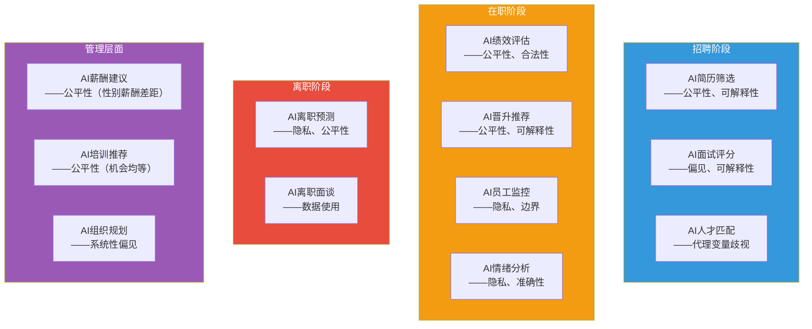
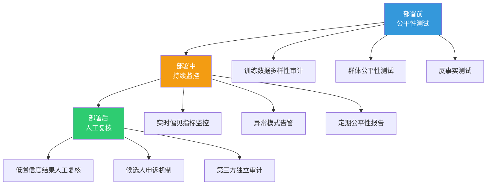
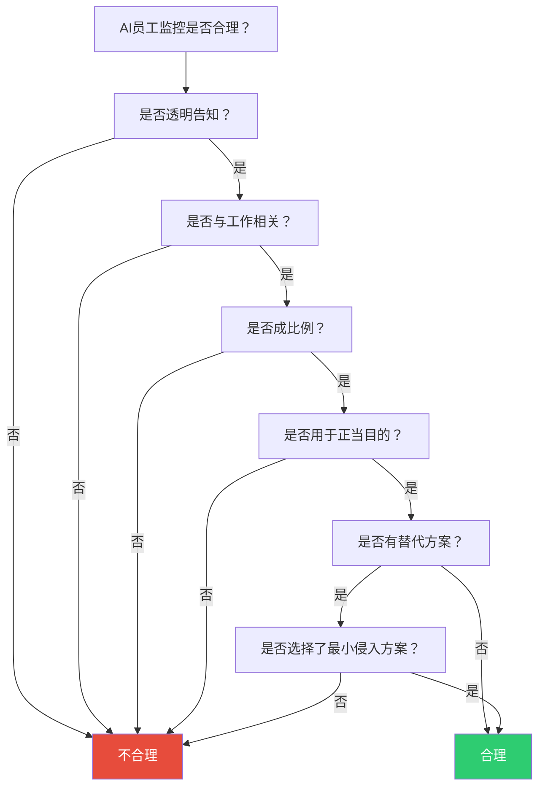
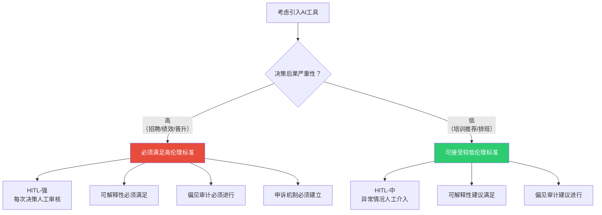

# 08 HR+AI的伦理特别议题

> [!quote] 核心论断
> **HR是AI伦理问题的「高发地带」和「检验场」。** 因为HR决策直接影响人的职业发展、收入和尊严，所以HR领域的AI应用必须以最高的伦理标准来审视。本文不重复技术实现，聚焦**伦理和治理**——HR如何在使用AI提效的同时，守住公平、透明和尊重的底线。

> [!note] 本文定位
> 本文是AI伦理知识库的**应用篇**，聚焦HR场景中的AI伦理实务。不重复 [[03-HR人事/校招测评/00_MOC_校招测评中枢]] 中AI面试的评分逻辑和技术实现，也不重复 [[02-AI趋势与素养/AI时代能力要求/00_MOC_AI时代能力要求中枢]] 中AI素养的浅层伦理意识，展开为**可操作的伦理治理框架**。

---

## 一、HR+AI伦理问题的全景图

---

## 二、AI面试的公平性保障

### 2.1 问题聚焦

AI面试的伦理问题集中在三个维度：

| 维度 | 问题 | 风险 |
|------|------|------|
| **输入偏见** | AI对不同人群的输入处理存在差异 | 口音、方言、面部特征等导致不公平 |
| **输出偏见** | AI对不同人群的评分存在系统性差异 | 某些群体系统性低分 |
| **过程不透明** | 候选人不知道AI如何评分 | 无法质疑、无法申诉 |

> [!note] 与[[03-HR人事/校招测评/00_MOC_校招测评中枢]]的边界
> [[03-HR人事/校招测评/00_MOC_校招测评中枢]] 中「AI面试评分逻辑」聚焦的是**技术评分机制**（关键词匹配、流畅度、表情等如何打分）。本文聚焦的是**伦理治理**——这些评分机制是否公平、如何检测偏见、如何建立申诉机制。

### 2.2 公平性检测方法

**检测问题**：AI面试评分是否存在对特定人群的系统性偏差？

| 检测方法 | 说明 | 操作 |
|----------|------|------|
| **群体对比** | 比较不同群体（性别/年龄/地域）的平均分和通过率 | 计算各群体的描述性统计 |
| **个体对比** | 对相同内容但不同口音/方言的面试录音进行评分对比 | 制作对比测试集 |
| **反事实测试** | 改变候选人的敏感属性（如性别、口音），观察评分变化 | 构造反事实样本 |
| **代理变量分析** | 检查AI评分是否与敏感属性的代理变量高度相关 | 相关性分析 |

### 2.3 公平性保障措施

### 2.4 候选人沟通策略

> [!tip] 正面示例
> 「本次面试使用了AI辅助评估系统。AI评估主要关注以下维度：[列出评估维度]。AI评估结果将作为参考，最终由面试官综合判断。如果您对AI评估结果有疑问，可以在7天内申请人工复核。」

> [!danger] 反面示例
> 「本次面试由AI系统完成，AI评分即为最终结果。」（不告知评估维度、不提供申诉渠道、不保留人工干预）

---

## 三、AI绩效评估的合法性

### 3.1 核心问题

AI绩效评估的伦理挑战在于：**绩效评估本身就有主观性，AI引入后，这种主观性被「技术化」和「黑箱化」了。**

| 问题 | 风险 |
|------|------|
| **AI标准是否客观？** | AI的标准来自训练数据，训练数据可能包含偏见 |
| **AI是否理解工作内容？** | AI可能无法理解某些工作的复杂性和创造性 |
| **AI评分是否可解释？** | 员工有权知道为什么被评低分 |
| **AI评估是否可申诉？** | 员工需要有效的申诉和复核机制 |

### 3.2 法律风险

> [!warning] 中国法律依据
> 《劳动合同法》第4条规定：用人单位在制定、修改或者决定有关劳动报酬、工作时间、休息休假、劳动安全卫生、保险福利、职工培训、劳动纪律以及劳动定额管理等直接涉及劳动者切身利益的规章制度或者重大事项时，应当经职工代表大会或者全体职工讨论，提出方案和意见，与工会或者职工代表平等协商确定。
>
> 如果AI绩效评估系统被认定为「直接涉及劳动者切身利益的规章制度」，那么它的引入和使用需要经过民主程序。**跳过民主程序直接部署AI绩效评估系统，可能被认定为违反《劳动合同法》。**

### 3.3 合法性保障

- [ ] AI绩效评估是否经过员工代表讨论和协商？
- [ ] 评估标准和逻辑是否向员工公开？
- [ ] 是否建立了人工复核和申诉机制？
- [ ] 是否保留了完整的评估记录？
- [ ] 是否对AI评估进行了公平性检测？

---

## 四、算法歧视诉讼案例

### 4.1 国际案例

| 案例 | 年份 | 涉及领域 | 关键问题 | 结果 |
|------|------|----------|----------|------|
| **亚马逊AI招聘工具** | 2014-2017 | 招聘 | AI系统性地降低女性简历评分 | 亚马逊停止使用该工具 |
| **HireVue被FTC投诉** | 2019 | AI视频面试 | 算法偏见、缺乏透明度 | 公司调整了产品 |
| **Workday AI歧视诉讼** | 2023 | 招聘 | AI筛选系统涉嫌种族和年龄歧视 | 诉讼进行中 |
| **iTutorGroup年龄歧视** | 2023 | 招聘 | AI自动拒绝年龄较大的申请者 | EEOC起诉，公司和解 |

### 4.2 中国相关案例

| 案例 | 年份 | 关键问题 | 法律依据 |
|------|------|----------|----------|
| **某招聘平台AI推荐** | 2022 | 算法推荐涉嫌就业歧视 | 《就业促进法》 |
| **某外卖平台算法** | 2021 | 算法对骑手的「控制」 | 社会舆论 + 监管介入 |

> [!important] 趋势
> 2024-2026年，算法歧视诉讼案件在全球范围内显著增加。随着AI在HR领域的应用越来越广泛，这类诉讼只会越来越多。HR部门需要**提前建立防御机制**，而不是等到被起诉后才开始应对。

### 4.3 诉讼防御清单

- [ ] 是否进行了AI偏见审计并保留了审计报告？
- [ ] 是否建立了HITL机制并保留了人工审核记录？
- [ ] 是否向候选人/员工明确告知AI的使用？
- [ ] 是否提供了申诉和人工复核的渠道？
- [ ] 是否保留了AI决策的完整记录？

---

## 五、AI员工监控的边界

### 5.1 监控形式与伦理风险

| 监控形式 | 技术手段 | 伦理风险 |
|----------|----------|----------|
| 屏幕监控 | 截屏、活动记录 | 侵犯隐私、制造不信任 |
| 键盘/鼠标分析 | 点击频率、打字速度 | 将「忙碌」等同于「高效」 |
| 邮件/通讯监控 | 关键词分析、情感分析 | 侵犯通信隐私 |
| 位置追踪 | GPS、WiFi定位 | 侵犯人身自由 |
| 摄像头监控 | 视频分析、表情分析 | 「监控恐惧」影响工作 |
| 生物特征监控 | 心率、脑电波 | 伦理边界严重越界 |

### 5.2 伦理边界判定

### 5.3 监控治理原则

| 原则 | 说明 |
|------|------|
| **透明性** | 员工必须清楚知道被监控什么、为什么监控 |
| **必要性** | 监控必须与工作有直接关系 |
| **比例性** | 监控的范围和程度不能超出必要 |
| **目的限制** | 监控数据只能用于原始目的 |
| **数据安全** | 监控数据必须安全存储、定期删除 |
| **员工权利** | 员工有权查看、质疑和删除自己的监控数据 |

---

## 六、HR如何平衡AI效率与伦理风险？

### 6.1 决策框架

### 6.2 效率-伦理平衡清单

| 场景 | 效率收益 | 伦理风险 | 平衡策略 |
|------|----------|----------|----------|
| AI简历初筛 | 高（节省80%筛选时间） | 中（偏见、可解释性） | AI初筛+人工复核 |
| AI面试评分 | 高（标准化评估） | 高（偏见、可解释性） | AI建议+人工终审 |
| AI绩效评估 | 中（数据驱动） | 高（合法性、公平性） | AI辅助+管理者决策 |
| AI离职预测 | 中（提前预警） | 高（隐私、假阳性） | 仅供HR参考，不作为决策依据 |
| AI培训推荐 | 中（个性化） | 低（公平性） | AI推荐+人工确认 |
| AI排班 | 高（效率优化） | 低（公平性） | AI优化+人工审核 |

### 6.3 HR的AI伦理治理角色

> [!important] HR角色的转变
> 在AI时代，HR的角色不仅是「AI工具的使用者」，更是「AI伦理的守护者」。HR需要在以下方面发挥关键作用：
>
> 1. **守门人**：在采购AI工具时进行伦理审查
> 2. **解释者**：向候选人/员工解释AI决策
> 3. **申诉处理者**：处理AI相关的不满和申诉
> 4. **培训者**：推动组织内的AI伦理培训
> 5. **倡导者**：在AI伦理委员会中为员工权益发声

---

## 七、HR+AI伦理治理的实操路径

### 7.1 四步走

### 7.2 关键行动项

| 阶段 | 行动项 | 负责人 | 时间线 |
|------|--------|--------|--------|
| 意识建立 | 完成HR团队AI伦理培训 | HR负责人 | 1个月内 |
| 流程建立 | 制定AI工具采购伦理审查清单 | HR+法务 | 2个月内 |
| 机制建立 | 建立AI决策的HITL和申诉机制 | HR+IT | 3个月内 |
| 文化建立 | 将AI伦理纳入HR日常运营 | 全HR团队 | 持续 |

---

## 八、总结：HR+AI伦理的十条准则

1. **AI是工具，HR是决策者**——AI建议不能替代HR判断
2. **公平性优先于效率**——在HR领域，公平比效率更重要
3. **透明度是信任的基础**——候选人/员工有权知道AI的使用
4. **可解释性是权利**——每个AI决策都应该能被解释
5. **HITL是底线**——所有重大决策必须有人工审核
6. **偏见审计是必须的**——使用AI前和使用中都要进行偏见检测
7. **隐私不可侵犯**——员工数据隐私是不可逾越的红线
8. **申诉渠道必须畅通**——对AI决策不满的人必须有申诉渠道
9. **持续监控是常态**——AI伦理不是一次性的，是持续的过程
10. **HR是伦理守护者**——在AI时代，HR的角色明确包括AI伦理守护

---

## 九、下一步阅读

- 了解算法偏见的深度分析：[[02-AI趋势与素养/AI伦理与治理/02_算法偏见：AI如何继承并放大人类的偏见]]
- 了解AI决策的可解释性：[[02-AI趋势与素养/AI伦理与治理/03_AI决策的透明性与可解释性]]
- 了解AI责任归属：[[02-AI趋势与素养/AI伦理与治理/05_AI责任归属：当AI犯错，谁负责？]]
- 了解企业AI伦理框架：[[02-AI趋势与素养/AI伦理与治理/07_企业AI伦理框架：从原则到落地]]
- 了解AI面试的技术实现：[[03-HR人事/校招测评/00_MOC_校招测评中枢]]
- 了解招聘方法论：[[03-HR人事/招聘与面试体系/00_MOC_招聘与面试体系中枢]]
- 了解绩效管理：[[03-HR人事/绩效管理/00_MOC_绩效管理中枢]]
- 回到知识库中枢：[[02-AI趋势与素养/AI伦理与治理/00_MOC_AI伦理与治理中枢]]