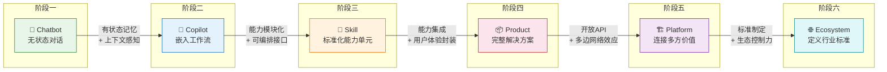
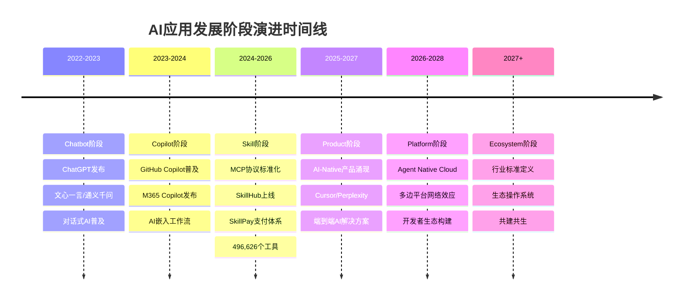

# AI应用发展阶段演进 —— 中枢导航

> [!abstract] 知识库定位
> 本知识库综合2026年多个权威行业框架，提出一个**统一的、可自洽的六阶段演进模型**（Chatbot -> Copilot -> Skill -> Product -> Platform -> Ecosystem），覆盖从"个体使用AI"到"产业生态共建"的完整视角。核心创新在于：不是简单罗列已有框架，而是提炼出跨框架的共性规律，并标注每个阶段与已有知识的对应关系。

---

## 一、六阶段总览



> [!note] 核心变化摘要
> | 跃迁 | 核心变化 |
> |---|---|
> | Chatbot -> Copilot | 从"问答"到"辅助"：AI不再只是回答问题，而是嵌入工作流提供实时建议 |
> | Copilot -> Skill | 从"能力"到"能力单元"：AI能力被标准化、模块化，可被编排和复用 |
> | Skill -> Product | 从"模块"到"产品"：标准化能力被封装为面向用户的完整解决方案 |
> | Product -> Platform | 从"产品"到"平台"：产品开放能力，连接多方参与者，形成网络效应 |
> | Platform -> Ecosystem | 从"平台"到"生态"：平台成为基础设施，定义行业标准，生态参与者共建共生 |

---

## 二、与行业框架的对照表

本知识库提出的六阶段模型并非凭空创造，而是综合以下多个行业权威框架后的统一提炼：

| 六阶段模型 | Microsoft 成熟度模型 | 360周鸿祎 Agent五级 | 阿里云Agent-Native | 工具->平台->生态 | Sam Altman 三阶段 | 行业共识 |
|---|---|---|---|---|---|---|
| 1. Chatbot | L100 初始 | L1 聊天助手 | 对话式AI | — | 对话式AI | Chatbot |
| 2. Copilot | L200 可重复 | L2 低代码工作流 | 辅助型智能体 | 工具阶段 | 推理型AI | Copilot |
| 3. Skill | L300 定义 | L3 推理型智能体 | 能力模块化 | 工具阶段 | — | Agent/Skill |
| 4. Product | L400 胜任 | L3-L4 | 企业级智能体 | 工具->平台过渡 | 智能体系统 | AI-Native产品 |
| 5. Platform | L400-L500 | L4 多智能体蜂群 | Agent Native Cloud | 平台阶段 | — | Agent平台 |
| 6. Ecosystem | L500 高效 | L5 完全自主 | 生态操作系统 | 生态阶段 | 主动式AI | AI生态 |

### 2.1 框架详细说明

> [!info] Microsoft 代理AI采用成熟度模型（2026）
> Microsoft于2026年6月发布 **Agentic AI Adoption Maturity Model**，将组织AI采用分为五个级别（L100-L500），涵盖战略、业务流程、治理、技术、组织文化五个维度。该模型强调从"初始实验"到"代理优先企业"的渐进路径，与本模型的 Skill->Product->Platform 阶段高度对应。
> [$TRAE_REF](https://learn.microsoft.com/zh-cn/agents/adoption-maturity-model/)

> [!info] 360周鸿祎 Agent五级分类（2025）
> 在ISC.AI 2025大会上，360创始人周鸿祎参照自动驾驶分级标准，提出智能体L1-L5分级体系：L1聊天助手（玩具级）、L2低代码工作流（工具级）、L3推理型智能体（专业级）、L4多智能体蜂群（协同级）、L5完全自主智能体。本模型吸收了其"从工具到自主"的渐进逻辑，但补充了Platform和Ecosystem两个产业维度。
> [$TRAE_REF](https://www.fromgeek.com/latest/699425.html)

> [!info] 阿里云 Agent Native Cloud（2026 WAIC）
> 2026年7月WAIC大会上，阿里云发布Agent Native Cloud全栈产品体系，覆盖基础设施、开发平台、云桌面，让智能体成为企业原生能力。Gartner预测到2026年底约40%的企业应用将集成任务专属AI Agent。阿里云的"Agent-Native"理念与本模型中的Product和Platform阶段高度吻合。
> [$TRAE_REF](https://www.alibabacloud.com/blog/alibaba-cloud-unveils-agent-native-innovations-at-waic-2026_603377)

> [!info] 工具->平台->生态 三阶段模型
> 行业广泛讨论的"工具->平台->生态"演进逻辑，强调产品从单点功能到连接多方价值再到定义行业标准的路径。本模型在此基础上前置了Chatbot、Copilot、Skill三个阶段，更完整地覆盖了从"个体使用AI"到"产业生态共建"的全过程。
> [$TRAE_REF](https://blog.csdn.net/sunneo/article/details/161347144)

> [!info] Sam Altman AI三阶段发展（2026）
> OpenAI CEO Sam Altman提出AI发展三阶段：对话式AI（以ChatGPT为代表）、推理型AI（以Codex为代表）、主动式AI（具备自主行动能力）。本模型中的Chatbot、Copilot/Skill、Product/Platform/Ecosystem分别对应这三个阶段，并进一步细化。
> [$TRAE_REF](https://m.sohu.com/a/1032730889_121885030/)

---

## 三、文档索引

| 编号 | 文档名称 | 核心内容 | 适合人群 |
|---|---|---|---|
| 00 | [[02-AI趋势与素养/AI应用发展阶段演进/00_MOC_AI应用发展阶段演进中枢]] | 知识库总导航、框架对照、阅读路径 | 所有人 |
| 01 | [[02-AI趋势与素养/AI应用发展阶段演进/01_全貌：AI应用发展的六阶段统一模型]] | 六阶段模型全景定义、两层映射、跃迁条件 | 所有人 |
| 02 | [[02-AI趋势与素养/AI应用发展阶段演进/02_阶段一二：Chatbot与Copilot——AI的嘴和手]] | Chatbot和Copilot阶段详解、能力边界、市场数据 | 产品经理、投资人 |
| 03 | [[02-AI趋势与素养/AI应用发展阶段演进/03_阶段三：AI Skill——从能力到能力单元的标准化]] | Skill定义、三层分级、生态现状、SkillHub | 开发者、技术负责人 |
| 04 | [[02-AI趋势与素养/AI应用发展阶段演进/04_阶段四：AI Product——从功能到解决方案]] | Product阶段特征、AI-Native产品设计、案例 | 产品经理、创业者 |
| 05 | [[02-AI趋势与素养/AI应用发展阶段演进/05_阶段五：Platform——连接多方价值的操作系统]] | Platform阶段策略、双边网络效应、平台治理 | 技术负责人、战略规划 |
| 06 | [[02-AI趋势与素养/AI应用发展阶段演进/06_阶段六：Ecosystem——定义行业标准的基础设施]] | Ecosystem阶段特征、生态护城河、标准制定 | 战略规划、投资人 |
| 07 | [[02-AI趋势与素养/AI应用发展阶段演进/07_跃迁动力学：阶段之间的关键跨越条件]] | 各阶段跃迁的触发条件、信号识别、常见陷阱 | 创业者、产品经理 |
| 08 | [[02-AI趋势与素养/AI应用发展阶段演进/08_人机关系的六次跃迁：从问答到共生]] | 技术演进路径和人机关系演进路径的深度分析 | 技术负责人、研究者 |
| 09 | [[02-AI趋势与素养/AI应用发展阶段演进/09_实践指南：你的AI应用处于哪个阶段，下一步怎么走？]] | 各阶段的创业机会、投资逻辑、赛道判断 | 创业者、投资人 |

---

## 四、推荐阅读路径

### 路径一：产品经理路径

```
01_全貌 -> 02_阶段一二 -> 03_阶段三 -> 04_阶段四 -> 05_阶段五
```

**阅读重点**：理解AI产品从Chatbot到Platform的完整演进逻辑，掌握每个阶段的产品设计原则和用户体验变化。重点关注Skill阶段——"能力单元"标准化是产品经理构建AI产品的核心抓手。

### 路径二：技术负责人路径

```
01_全貌 -> 03_阶段三 -> 06_阶段六 -> 08_技术与人机关系双重映射
```

**阅读重点**：理解技术架构如何支撑从单点能力到生态系统的跨越。重点关注Skill的标准化、MCP协议、多Agent编排、平台基础设施等技术关键点。

### 路径三：创业者/投资人路径

```
01_全貌 -> 02_阶段一二 -> 04_阶段四 -> 05_阶段五 -> 09_创业与投资机会图谱
```

**阅读重点**：识别当前市场所处阶段，判断下一个风口。2026年核心判断：Chatbot赛道已见顶，Skill和Product阶段是当前最大机会窗口，Platform阶段是长期布局方向。

---

## 五、快速自测：你的产品/能力处于哪个阶段？

> [!question] 自测清单
> 请逐个回答以下问题，选择最符合你当前状态的选项：

**阶段一：Chatbot**
- [ ] 你的AI产品主要功能是单轮对话问答
- [ ] 用户每次交互都是独立的，AI不记忆上下文
- [ ] 核心价值是"信息获取"，而非"任务完成"
- [ ] 商业模式是订阅制或Token消耗计费

**阶段二：Copilot**
- [ ] 你的AI产品已嵌入到特定工作流中（如编码、写作、设计）
- [ ] AI能基于上下文给出实时建议
- [ ] 但AI不能独立完成完整任务，需要人类确认和执行
- [ ] 人类始终是最终决策者

**阶段三：Skill**
- [ ] 你的AI能力已经被标准化为可复用的模块
- [ ] 有明确的输入/输出接口规范
- [ ] 可被其他系统或Agent编排调用
- [ ] 已上架Skill市场或平台（如SkillHub、扣子、Dify）

**阶段四：Product**
- [ ] 你的AI产品是一个完整的端到端解决方案
- [ ] AI是产品的核心引擎，而非附加功能
- [ ] 用户无需理解AI即可使用产品获得价值
- [ ] 有独立的商业模式和用户群

**阶段五：Platform**
- [ ] 你的产品已开放API供第三方开发者使用
- [ ] 平台上有活跃的开发者/创作者社区
- [ ] 存在双边或多边网络效应
- [ ] 商业模式包含平台抽成或交易手续费

**阶段六：Ecosystem**
- [ ] 你的产品/平台已成为行业基础设施
- [ ] 生态参与者（开发者、企业、用户）能获得可观收益
- [ ] 你参与或主导了行业标准制定
- [ ] 竞争对手必须兼容你的标准才能生存

> [!tip] 解读
> - 如果你主要在**阶段一**打勾：你处于AI应用的最早期阶段。注意：2026年纯Chatbot赛道的增长已见顶，建议尽快向Copilot或Skill方向演进。
> - 如果你主要在**阶段二**打勾：你已进入Copilot阶段，这是当前大多数AI产品的状态。下一步关键是：将你的Copilot能力标准化为Skill。
> - 如果你主要在**阶段三**打勾：恭喜，你已进入Skill阶段——这是2026年最活跃的创新层。下一步是：将多个Skill集成为Product。
> - 如果你主要在**阶段四**打勾：你拥有成熟的AI产品。关注：是否具备平台化的条件（用户规模、第三方开发意愿、开放API能力）。
> - 如果你主要在**阶段五**打勾：你已进入平台阶段。挑战是：如何从平台跃迁到生态，成为行业标准。
> - 如果你主要在**阶段六**打勾：你是行业定义者。关注：如何维护生态健康，持续创新。

---

## 六、与已有知识库的关联

本知识库是以下已有知识库的延伸和整合：

### 6.1 [[02-AI趋势与素养/人机协作阶段演进/00_MOC_人机协作阶段演进中枢]]

本知识库的六阶段模型在人机关系维度上，与"人机协作阶段演进"知识库形成互补。六阶段模型中的人机关系演进路径为：

```
问答 -> 辅助 -> 协作 -> 委托 -> 共建 -> 共生
```

具体对应关系：

| 六阶段 | 人机关系 | 人机协作阶段 |
|---|---|---|
| Chatbot | 人类提问，AI回答 | 工具使用 |
| Copilot | 人类决策，AI建议 | 辅助协作 |
| Skill | 人类编排，AI执行 | 能力委托 |
| Product | 人类使用，AI驱动 | 任务委托 |
| Platform | 人类参与，AI连接 | 多方协作 |
| Ecosystem | 人类与AI共建共生 | 生态共生 |

### 6.2 [[02-AI趋势与素养/AI Native组织变革/00_MOC_AI Native组织变革中枢]]

六阶段模型的Product和Platform阶段，直接对应AI Native组织变革的核心议题。当AI从"外挂工具"变为"产品核心引擎"（Product阶段），组织需要从"用AI提效"转向"以AI为中心重构业务流程"。

### 6.3 [[01-AI技术/超长项目AI跑/超长项目AI跑_知识库建设方案]]

Skill阶段和Product阶段的实践基础之一，就是"超长项目AI跑"中验证的AI自主执行能力。当AI能独立完成超长周期的复杂任务时，Skill的标准化和Product的封装才成为可能。

### 6.4 [[02-AI趋势与素养/非技术人员与技术边界/00_MOC_非技术人员与技术边界中枢]]

Skill阶段的核心理念——"从用AI到造AI"——直接回应了"非技术人员与技术边界"知识库的核心命题。Skill的标准化和低门槛特性，让非技术人员也能构建自己的AI能力，技术边界正在被重新定义。

### 6.5 [[01-AI技术/Skill制作痛点/00_MOC_Skill制作痛点中枢]]

本知识库的[[02-AI趋势与素养/AI应用发展阶段演进/03_阶段三：AI Skill——从能力到能力单元的标准化]]与"Skill制作痛点"知识库深度关联。Skill的标准化是解决Skill制作痛点的关键路径——当Skill有明确的输入/输出规范、可复用、可编排时，当前Skill制作中的碎片化、重复建设、质量参差不齐等问题将得到系统性解决。

---

## 七、2026年关键趋势信号

> [!important] 2026年不容忽视的趋势信号

1. **Chatbot增长见顶**：2026年4月Chatbot Top 20中9个产品Web访问量下滑，ChatGPT环比下降3.84% [$TRAE_REF](https://36kr.com/p/3866759935572612)

2. **Agent迎来爆发**：OpenClaw、RedClaw、WorkBuddy等智能体相继推出，Agent从概念到生产现场只用了半年 [$TRAE_REF](https://m.tech.china.com/digi/articles/20260720/202607201921248.html)

3. **Skill生态高速增长**：Skillful.sh追踪的AI Agent生态已包含496,626个工具，日均新增1,635.8个 [$TRAE_REF](https://skillful.sh/ecosystem-report)

4. **Skill支付体系上线**：腾讯SkillHub正式上线SkillPay，打通技能分发、Agent调用与技能支付全链路 [$TRAE_REF](https://www.time-weekly.com/wap-article/331153)

5. **企业级Agent落地**：Gartner预测2026年底约40%的企业应用将集成AI Agent，而2025年这一比例不足5%

6. **Agent Native Cloud发布**：阿里云在WAIC 2026发布Agent Native Cloud全栈产品体系，智能体成为企业原生能力 [$TRAE_REF](https://www.alibabacloud.com/blog/alibaba-cloud-unveils-agent-native-innovations-at-waic-2026_603377)

7. **企微"大圆"首秀**：企业微信AI Agent智能助理"大圆"首次公开亮相，用户可在任意工作界面左滑唤起，无需切换应用即可获得AI协助 [$TRAE_REF](https://www.gz.gov.cn/ysgz/xwdt/ysdt/content/mpost_10907304.html)

---

## 八、使用建议

### 8.1 如果你是第一次接触本知识库

建议从 [[02-AI趋势与素养/AI应用发展阶段演进/01_全貌：AI应用发展的六阶段统一模型]] 开始阅读，理解六阶段模型的全景定义，然后根据自己的角色选择对应的阅读路径。

### 8.2 如果你想快速定位某个话题

使用本页面的文档索引表，直接跳转到对应文档。

### 8.3 如果你想理解某个阶段

每个阶段文档都包含：核心特征、代表性产品、能力边界、行业数据、跃迁条件、与已有框架的对应关系。

### 8.4 如果你想做战略决策

重点关注 [[02-AI趋势与素养/AI应用发展阶段演进/07_跃迁动力学：阶段之间的关键跨越条件]] 和 [[02-AI趋势与素养/AI应用发展阶段演进/09_实践指南：你的AI应用处于哪个阶段，下一步怎么走？]]。

---

## 九、方法论说明

> [!note] 本知识库的方法论
> 本知识库的核心创新在于**综合而非罗列**。我们不满足于简单介绍已有的行业框架（如Microsoft成熟度模型、360五级分类等），而是：
> 1. **横向对比**：将多个框架放在同一维度下对比，找出共性规律
> 2. **纵向延伸**：从"个体使用AI"延伸到"产业生态共建"，填补现有框架的空白
> 3. **双向标注**：每个阶段都标注了在其他框架中的对应位置，确保可追溯性
> 4. **实战导向**：每个阶段都包含跃迁条件、自测清单、行业数据，确保可操作性

---

## 十、各阶段详细对比矩阵

### 10.1 六阶段核心指标对比

| 维度 | Chatbot | Copilot | Skill | Product | Platform | Ecosystem |
|---|---|---|---|---|---|---|
| AI自主性 | 0% | 5% | 30% | 60% | 80% | 95%+ |
| 人类决策权 | 100% | 95% | 70% | 40% | 20% | 5% |
| 可复用性 | 无 | 低 | 高 | 中 | 高 | 极高 |
| 可编排性 | 无 | 无 | 高 | 低 | 中 | 高 |
| 网络效应 | 无 | 无 | 弱 | 无 | 强 | 极强 |
| 商业模式 | 订阅/Token | 订阅/按量 | 技能交易 | 产品订阅 | 平台抽成 | 生态税 |
| 护城河深度 | 浅 | 中 | 中 | 深 | 深 | 极深 |
| 构建门槛 | 低 | 中 | 中 | 高 | 高 | 极高 |
| 市场集中度 | 高 | 高 | 中 | 中 | 高 | 极高 |
| 2026年成熟度 | 已见顶 | 成熟期 | 爆发期 | 成长期 | 早期 | 萌芽期 |

### 10.2 各阶段关键成功因素

| 阶段 | 关键成功因素 | 常见失败原因 |
|---|---|---|
| Chatbot | 模型能力、品牌认知、用户获取 | 模型能力不足、用户留存低、商业模式单一 |
| Copilot | 工作流深度集成、上下文理解 | 集成不够深、建议不够精准、用户不信任 |
| Skill | 标准化程度、可复用性、发现机制 | 接口不标准、质量参差不齐、缺乏市场流动性 |
| Product | 用户体验、完整解决方案、PMF | 功能堆砌、AI非核心、用户习惯未养成 |
| Platform | 网络效应、开发者生态、治理机制 | 过早平台化、开发者激励不足、质量失控 |
| Ecosystem | 标准制定权、生态治理、价值分配 | 标准不开放、生态参与者无利可图、创新被抑制 |

### 10.3 各阶段技术栈对比

| 阶段 | 核心技术 | 关键协议/标准 | 基础设施需求 |
|---|---|---|---|
| Chatbot | LLM推理引擎、对话管理 | HTTP/SSE、OpenAI API格式 | GPU集群、推理服务 |
| Copilot | 上下文感知、实时嵌入 | IDE插件协议、LSP | 低延迟推理、边缘计算 |
| Skill | MCP协议、函数调用 | MCP、OpenAPI、JSON Schema | Skill注册中心、沙箱环境 |
| Product | AI编排、端到端集成 | 应用内协议、RAG | 向量数据库、混合云 |
| Platform | 多租户架构、API网关 | OAuth、Webhook、GraphQL | 云原生基础设施、弹性伸缩 |
| Ecosystem | 跨平台互操作、标准协议 | A2A、MCP、生态协议族 | 全球分布式基础设施 |

## 十一、六阶段演进时间线



### 11.1 各阶段时间窗口的关键驱动因素

| 阶段 | 时间窗口 | 关键驱动因素 |
|---|---|---|
| Chatbot | 2022-2023 | GPT-3.5/GPT-4发布，公众对AI能力的认知爆发 |
| Copilot | 2023-2024 | LLM推理成本下降，工作流嵌入技术成熟 |
| Skill | 2024-2026 | MCP协议标准化，Skill市场机制建立，MCP Server数量爆发 |
| Product | 2025-2027 | Skill供给充足，AI-Native产品设计方法论成熟 |
| Platform | 2026-2028 | 企业级Agent需求爆发，云基础设施Agent-Native化 |
| Ecosystem | 2027+ | 跨平台互操作标准建立，行业共识形成 |

### 11.2 阶段重叠现象

> [!note] 阶段重叠
> 六阶段模型中的阶段并非严格按时间先后排列。在实际演进中，存在明显的**阶段重叠**现象：
> - 2026年，Skill阶段（爆发期）与Product阶段（成长期）和Platform阶段（早期）同时存在
> - 不同行业/领域的演进速度不同：编程领域已进入Product/Platform阶段，而传统行业可能仍处于Copilot阶段
> - 大型企业可能同时在多个阶段运营：腾讯的元宝（Chatbot）、WorkBuddy（Copilot/Product）、SkillHub（Skill/Platform）并存

## 十二、更新日志

| 日期 | 版本 | 更新内容 |
|---|---|---|
| 2026-07-27 | v1.0 | 初始版本，创建六阶段模型框架、MOC中枢、阶段一二三详解 |

---

> [!quote] 核心信念
> AI应用的发展不是线性的技术升级，而是**人机关系、商业形态、产业结构的协同进化**。理解这个演进规律，不是为了预测未来，而是为了在正确的时间、用正确的方式、做正确的卡位。